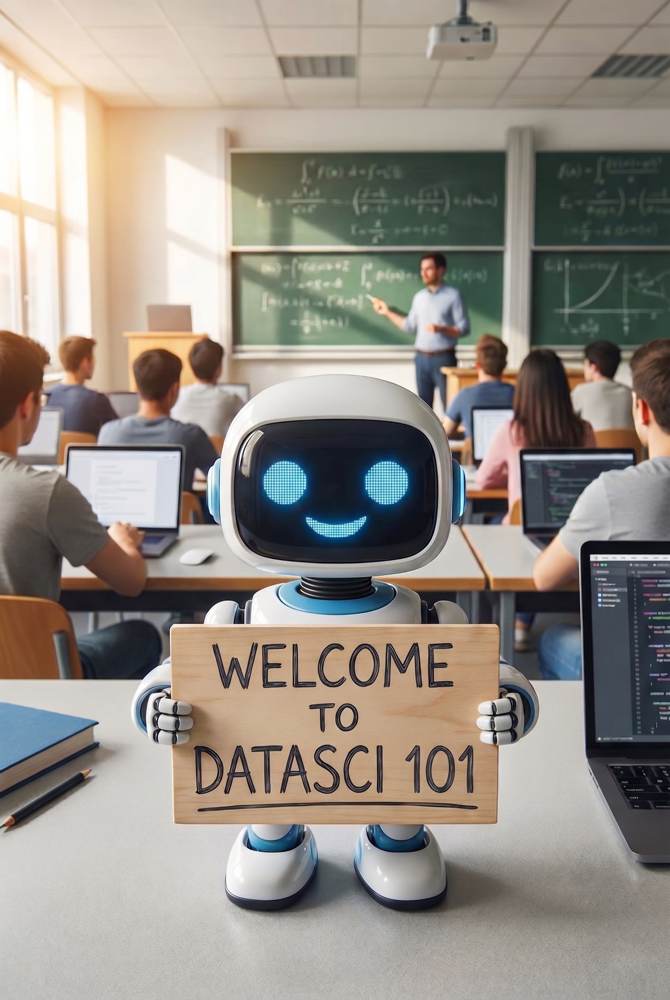
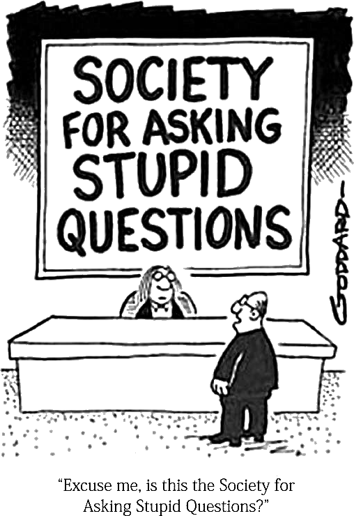
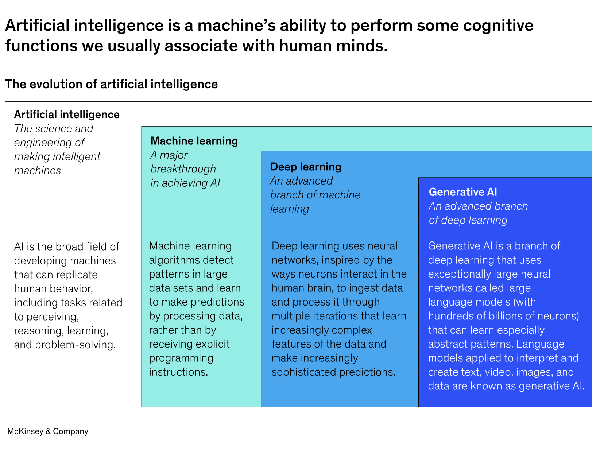
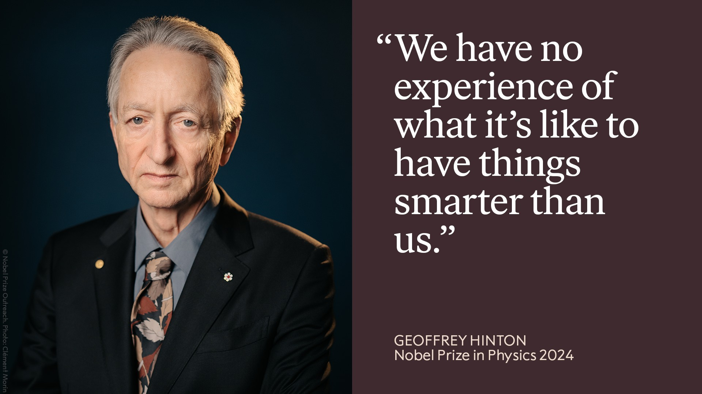
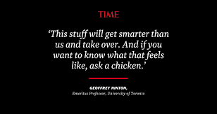
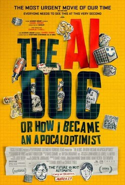

```{r setup, include=FALSE}
# figures formatting setup
options(htmltools.dir.version = FALSE)
library(knitr)
opts_chunk$set(
  prompt = T,
  fig.align="center", #fig.width=6, fig.height=4.5, 
  # out.width="748px", #out.length="520.75px",
  dpi=300, #fig.path='Figs/',
  cache=T, #echo=F, warning=F, message=F
  engine.opts = list(bash = "-l")
  )

## Next hook based on this SO answer: https://stackoverflow.com/a/39025054
knit_hooks$set(
  prompt = function(before, options, envir) {
    options(
      prompt = if (options$engine %in% c('sh','bash', 'zsh')) '$ ' else 'R> ',
      continue = if (options$engine %in% c('sh','bash', 'zsh')) '$ ' else '+ '
      )
})

# Set CRAN mirror
options(repos = c(CRAN = "https://cran.rstudio.com/"))

if (!require("fontawesome", character.only = TRUE)) {
  install.packages("fontawesome", dependencies = TRUE)
  library(fontawesome, character.only = TRUE)
}
```

# Welcome to DATASCI 101! 🎉 {background-color="#1B3A6B"}

## Lecture overview
### Today's agenda

:::{style="margin-top: 20px; font-size: 40px;"}

:::{.columns}
:::{.column width=50%}
- Hello and welcome!
- Instructor and TAs
- Motivation and course overview
- Assignments and grading
- Course logistics
:::

:::{.column width=50%}
:::{style="text-align: center; margin-top: -50px;"}
{width="65%"}
:::
:::
:::
:::

## Course materials
### Important links

::: {style="font-size: 26px;"}
`r fa('github')` Course repository: <https://github.com/danilofreire/datasci101>

`r fa('globe')` Course website: <https://danilofreire.github.io/datasci101>

All course materials, including lectures, code, assignments, and project guidelines, are available on our [GitHub repository](https://github.com/danilofreire/datasci101) and [course website](https://danilofreire.github.io/datasci101)

We will use Canvas for course administration, including submitting assignments, accessing grades, and receiving announcements

Please take some time to get to know both platforms, and reach out if you have any questions

::: {.callout-note}
Please remember to check the course repository regularly for updates and announcements!
:::
:::

# Nice to meet you! 😊 {background-color="#1B3A6B"}

## Instructor
### A bit about me

:::: {.columns}
::: {.column}


::: {style="font-size: 26px;"}
`r fa('envelope')` [danilo.freire@emory.edu](mailto:danilo.freire@emory.edu)

`r fa('globe')` <https://danilofreire.github.io/>

`r fa('github')` <https://github.com/danilofreire/>
:::
:::

:::{.column}
:::{style="font-size: 28px;"}
`r fa('chalkboard-user')` Visiting Assistant Professor in the [Department of Data and Decision Sciences](https://quantitative.emory.edu)

`r fa('graduation-cap')` MA from the Graduate Institute Geneva, PhD from King's College London, Postdoc at Brown University, Senior Lecturer at the University of Lincoln, UK

`r fa('book-open')` Research interests: computational social science, experimental methods, policy evaluation, political violence, organised crime
:::
:::
::::

## {background-image="figures/neymar.jpg" background-size="100%"}

## {background-image="figures/carnaval.jpg" background-size="100%"}

## {background-image="figures/sp.jpg" background-size="100%"}

## {background-image="figures/montblanc.jpg" background-size="100%"}

## {background-image="figures/buzz.webp" background-size="100%"}

## {background-image="figures/moonwatch.jpg" background-size="100%"}

## What about you? (time permitting!)

:::{style="margin-top: 60px; font-size: 40px;"}

- Now it's your turn! 😉

- Please introduce yourself! 👋

- Tell us your name, your major, and what would you like to learn in this course!
:::

## My teaching philosophy

:::{style="margin-top: 60px; font-size: 36px;"}

- I love teaching and aim to make learning fun 
- Classes where students participate are the best!
- Hands-on activities help you learn better
- I am always available to help and answer questions. [And I mean it!]{.alert}
- Your feedback helps me improve my teaching. Please let me know what is working and what is not 😉
:::

## Teaching assistants

:::{style="margin-top: 63px; font-size: 34px;"}

- We have [four amazing TAs]{.alert} with us this semester!

- [Tom Suo]{.alert} and [Sissi Li]{.alert} will be answering questions during our lectures and holding office hours. You can reach out to them at <tom.suo@emory.edu> and <sissi.li@emory.edu>

- [Philip Wang]{.alert} and [Anita Osuri]{.alert} will also be grading your assignments and quizzes (with my oversight). Their email addresses are <xipu.wang@emory.edu> and <anita.osuri@emory.edu>

- [We are all here to help you!]{.alert} So feel free to ask questions during class, office hours, or via email 😃
:::

## Office hours
### What for and what not for

:::{style="margin-top: 60px;"}
:::

- What office hours are meant for:
  - Applying tools in practice
  - Discussion of issues related to the assignments
  - Boosting your knowledge of AI and data science more generally

:::{.fragment .fade-in}
- What these sessions are [not]{.alert} meant for: 
    - Summarising lecture content
    - Solving the assignments for you
:::

## Class etiquette

:::{style="margin-top: 60px; font-size: 30px;"}

:::{.columns}
:::{.column width=60%}
- Learning a new topic can be tough and push you out of your comfort zone. If the course pace is too fast, let us know. I expect your commitment, but [I do not want anyone to fail]{.alert}
- You are all keen on AI, but your backgrounds may vary. That is great! Some sessions might be more engaging than others. If you are bored, [help others]{.alert} or explore additional resources (we have plenty!)
- [Please be respectful]{.alert} to each other
- [Ask questions]{.alert} whenever you need to!
:::

:::{.column width=40%}
:::{style="text-align: center;"}
{width="80%"}
:::
:::
:::
:::

## Learning objectives

:::{style="margin-top: 40px; font-size: 32px;"}

By the end of this course, you will be able to:

- `r fa('comment-dots')` [Explain]{.alert} the main ideas behind contemporary AI systems in plain language

- `r fa('triangle-exclamation')` [Identify]{.alert} common failure modes of AI systems and the data issues that cause them

- `r fa('newspaper')` [Read and assess]{.alert} claims about AI in news articles, product pages and policy documents

- `r fa('pencil-ruler')` [Design]{.alert} a small, realistic plan for an AI application, including data needs, evaluation, and a basic harm-mitigation strategy 
  
- `r fa('scale-balanced')` [Reflect critically]{.alert} on ethical, legal and social questions raised by AI deployment
:::

## Course overview

:::{style="margin-top: 30px; font-size: 36px; text-align: center;"}

| Module | Topic | Key Questions |
|--------|-------|---------------|
| 0 | Orientation | What is AI? What will we learn? |
| 1 | AI Design | How are AI systems built? |
| 2 | Perception | How do machines read, write, see and hear? |
| 3 | RAG & Pipelines | How do we make AI reliable? |
| 4 | Ethics & Bias | What can go wrong? |
| 5 | Policy & Impact | How is AI regulated? |
| 6 | Applications | Real-world uses and limits |

:::

## What makes this course unique

:::{style="margin-top: 40px; font-size: 32px;"}
- We're starting a new AI track in the Data Science curriculum! 🚀

- This is the second offering of DATASCI 101 — help us make it great! 🙂

- Why is this course different from others?
  - `r fa('user-graduate')` [Non-technical approach:]{.alert} No heavy maths or programming required
  - `r fa('question')` [Critical perspective:]{.alert} Learn to ask the right questions about AI
  - `r fa('briefcase')` [Real-world focus:]{.alert} Learn how AI is applied in practice
  - `r fa('users')` [For all backgrounds:]{.alert} Whether you're a humanities or STEM student, this course is for you!
:::

## Logistics
### Course information

:::{style="margin-top: 40px; font-size: 28px;"}
- [Syllabus:]{.alert} Available on our [course repository](https://github.com/danilofreire/datasci101/blob/main/syllabus.pdf) and [website](https://danilofreire.github.io/datasci101/syllabus.html). The course is designed to be self-contained. The syllabus includes links to the slides we will use in class, along with recommended readings, and problem sets. I will upload slides throughout the term as we progress
- [Schedule:]{.alert} Lectures are on Tuesdays and Thursdays from 2:30 to 3:20 pm in [White Hall 206](https://maps.app.goo.gl/gynyTUkKqJ7meGjm8)
- [Office Hours:]{.alert} We're always happy to help. Please [reach out to the TAs or me]{.alert} via email to schedule a time

- [Materials (recap):]{.alert} All course materials will be available on:
    - Course repository: <https://github.com/danilofreire/datasci101>
    - Course website: <https://danilofreire.github.io/datasci101>
    - Canvas
:::

## Assignments
### How you will be graded

:::{style="margin-top: 40px; font-size: 30px;"}

- [Problem sets:]{.alert} Ten of them, due on Thursdays at 11:59 pm (50%)
- [In-class quizzes:]{.alert} Five of them (30%)
- [Final project:]{.alert} Due on the last day of class (20%)
- [Late policy:]{.alert} 10% off per day late
- [Collaboration:]{.alert} You can discuss assignments with your classmates, but you must write your own code and submit your own work. AI is allowed, but you must disclose its use and ensure you understand the output
- [Academic integrity:]{.alert} Please refer to the syllabus for the university's policy on academic integrity
:::

# Motivation: <br> What the heck is AI anyway? 🤖 {background-color="#1B3A6B"}

## What is AI?

:::{style="margin-top: 40px; font-size: 27px;"}
:::{.incremental}
- A simple definition: [Artificial Intelligence (AI) is a branch of computer science focused on creating systems capable of performing tasks that typically require human intelligence]{.alert} 
- These tasks include learning, reasoning, problem-solving, perception, language understanding, and many more!
- AI can be classified into [three main categories:]{.alert} 
    - [Narrow AI:]{.alert} Designed for specific tasks (e.g., virtual assistants, recommendation systems)
    - [General AI:]{.alert} Hypothetical systems that possess human-like intelligence across a wide range of tasks
    - [Superintelligent AI:]{.alert} Surpasses human intelligence in all aspects (still theoretical)
- AI is powered by various techniques, including [machine learning, deep learning, and natural language processing]{.alert}
:::
:::

## AI taxonomy

:::{style="margin-top: 40px; font-size: 26px; text-align: center;"}
{width="80%"}

Source: [McKinsey & Company (2024)](https://www.mckinsey.com/featured-insights/mckinsey-explainers/what-is-ai)
:::

## Why should you care about AI?

:::{style="margin-top: 40px; font-size: 20px;"}
:::{.columns}
:::{.column width=50%}
- [AI already impacts many aspects of our daily lives:]{.alert} 
    - Virtual assistants (e.g., Siri, Alexa)
    - Recommendation systems (e.g., Netflix, Amazon)
    - Dating apps (e.g., Tinder, Bumble)
    - Social media algorithms (e.g., Facebook, Instagram)
- [AI is transforming industries:]{.alert} 
    - Healthcare (e.g., diagnostics, personalised medicine)
    - Finance (e.g., fraud detection, algorithmic trading)
    - Transportation (e.g., autonomous vehicles, route optimisation)
    - Education (e.g., personalised learning, 24/7 tutoring)
- Whether AI lives up to the hype or not, [it is already changing how many of these industries work]{.alert}
:::

:::{.column width=50%}
:::{style="text-align: center;"}
{width="100%"}
:::
:::
:::
:::

## Key questions we'll explore

:::{style="margin-top: 40px; font-size: 19px;"}
:::{.columns}
:::{.column width=50%}
- [What can AI actually do vs. what's hype?]{.alert}
  - Can AI truly think or is it just pattern matching?
  - Why does ChatGPT sometimes give wrong answers?
  - What can and cannot be automated?

- [Why do AI systems fail?]{.alert}
  - What happens when training data doesn't represent everyone?

- [How does data affect AI behaviour?]{.alert}
  - Garbage in, garbage out
  - Who decides what counts as "correct" data?

- [What are the ethical implications?]{.alert}
  - Should AI make life-or-death decisions?
  - Who's responsible when AI makes a mistake?

- [How should we regulate AI?]{.alert}
  - Innovation vs. safety trade-offs
  - What role should civil society play in governing AI?
:::

:::{.column width=50%}
:::{style="text-align: center;"}
{width="80%"}

{width="80%"}
:::
:::
:::
:::

<!--
## Current state of AI

:::{style="margin-top: 40px; font-size: 27px;"}
- [OpenAI's o1](https://openai.com/index/learning-to-reason-with-llms/) and [DeepSeek's R1](https://github.com/deepseek-ai/DeepSeek-R1) have shown that "thinking" AI systems can outperform humans on a variety of tasks
- [Neural scaling law](https://en.wikipedia.org/wiki/Neural_scaling_law) suggests that larger models trained on more data will continue to improve performance
- [Open-source models are closing the gap with proprietary ones](https://llm-stats.com/), democratising access to AI technology
- [We have never built as many datacentres as we are building now](https://www.mckinsey.com/industries/technology-media-and-telecommunications/our-insights/infrastructure-matters-the-future-of-data-centers), and AI workloads are a major driver of this growth
  - USD 300 billion just in 2025, and 5.2 trillion by 2030 (that's the size of Germany's economy!)
- Despite the hype, [two-thirds of companies report that their organisation has not begun scaling AI](https://www.mckinsey.com/capabilities/quantumblack/our-insights/the-state-of-ai), highlighting the gap between potential and real-world application
:::
-->

## AI benchmarks and human performance

:::{style="margin-top: 40px; font-size: 28px; text-align: center;"}
{width="60%"}

Source: [Artificial Intelligence Index Report (2025)](https://hai.stanford.edu/ai-index/2025-ai-index-report)
:::

## True or false?

:::{style="margin-top: 40px; font-size: 22px;"}
:::{.columns}
:::{.column width=50%}
:::{.incremental}
- [AI understands language like humans do]{.alert}
  - [False!]{.alert} AI predicts likely next tokens (what are they?)

- [AI will replace all jobs]{.alert}
  - [Probably not.]{.alert} AI transforms jobs more than it eliminates them

- [AI hallucinations are easy to spot]{.alert}
  - [False!]{.alert} AI sometimes confidently states incorrect information, and it's not always obvious

- [We can test AI systems by deliberately trying to trick them]{.alert}
  - [True!]{.alert} This is called adversarial testing or red-teaming
:::
:::

:::{.column width=50%}
:::{.incremental}
- [AI systems that learn without any human labels exist]{.alert}
  - [True!]{.alert} This is called unsupervised learning, and it finds hidden patterns automatically

- [AI systems can explain why they made a particular decision]{.alert}
  - [False!]{.alert} Many AI systems are "black boxes", that is, we don't know for sure how they came up with their answers

- [The order of words in a sentence affects how AI processes it]{.alert}
  - [True!]{.alert} Attention mechanisms let models weigh the importance of different words

- [The same AI model can be fine-tuned for many different tasks]{.alert}
  - [True!]{.alert} This is one of the most powerful aspects of modern AI
:::
:::
:::
:::

<!--
## AI challenges: Bias

:::{style="margin-top: 30px; font-size: 22px;"}
:::{.columns}
:::{.column width="50%"}
- AI models can [amplify biases](https://www.scientificamerican.com/article/humans-absorb-bias-from-ai-and-keep-it-after-they-stop-using-the-algorithm/) present in the training data
- For instance, I asked an AI to give me the names of famous scientists, and it came up with the following list:
  - Albert Einstein
  - Isaac Newton
  - Charles Darwin
  - Nikola Tesla
  - Galileo Galilei
  - Stephen Hawking
  - Leonardo da Vinci
:::

:::{.column width="50%"}
- Can you spot the bias?

:::{style="text-align: center;"}

:::
:::
:::
:::

## AI challenges: Hallucinations

:::{style="margin-top: 30px; font-size: 22px;"}
:::{.columns}
:::{.column width="50%"}
- AI can produce [incorrect or misleading content]{.alert}
- Errors in the model, incorrect information in the training data, limitations of model architecture
- [Check the output of these models and not take it at face value]{.alert}
- I asked Copilot (powered by GPT-4) to solve a simple quadratic equation, and [it very confidently gave me a very wrong answer]{.alert} 😅
- It provided the answers of $\frac{1}{2}$ and $\frac{-5}{4}$ when the correct answers were 0.804 and -1.55. 
:::

:::{.column width="50%"}
:::{style="text-align: center;"}

:::
:::
:::
:::

## AI challenges: Confusion

:::{style="margin-top: 30px; font-size: 22px;"}
:::{.columns}
:::{.column width="50%"}
- AI models can be [easily confused](https://www.technologyreview.com/2022/07/07/1045821/ai-bias-ethics/) by small changes in the input
- AIs have an annoying tendency to be overpolite and [agree with you even when you are wrong]{.alert}
- Thus, they can be easily manipulated (including by bad actors)
- I asked Copilot what the westernmost point of Europe was, and easily contradicted its answer
:::

:::{.column width="50%"}
:::{style="text-align: center;"}

:::
:::
:::
:::
--->

## Next class

:::{style="margin-top: 40px; font-size: 24px;"}
:::{.columns}
:::{.column width=50%}
- [Topic:]{.alert} A brief history of AI and the recent shift
- [What we'll cover:]{.alert}
  - From symbolic approaches to data-driven learning
  - The transformer architecture explained in plain language
  - How we got from early AI to ChatGPT
- [Main takeaway:]{.alert} You can't make sense of ChatGPT without knowing the 70 years of ideas that led to it
- [Preparation:]{.alert} Read the assigned articles on AI history and transformers
:::

:::{.column width=50%}
:::{style="text-align: center; margin-top: -30px;"}
[{width="60%"}](https://www.youtube.com/watch?v=yvq-jYira9I)

Suggested video: [The AI Doc](https://www.youtube.com/watch?v=yvq-jYira9I)
:::
:::
:::
:::

# ... and that's all for today! 🎉 {background-color="#1B3A6B"}

# Have a great day! 😊 {background-color="#1B3A6B"}