```{r setup, include=FALSE}
# figures formatting setup
options(htmltools.dir.version = FALSE)
library(knitr)
opts_chunk$set(
  prompt = T,
  fig.align="center", #fig.width=6, fig.height=4.5, 
  # out.width="748px", #out.length="520.75px",
  dpi=300, #fig.path='Figs/',
  cache=T, #echo=F, warning=F, message=F
  engine.opts = list(bash = "-l")
  )

## Next hook based on this SO answer: https://stackoverflow.com/a/39025054
knit_hooks$set(
  prompt = function(before, options, envir) {
	options(
	  prompt = if (options$engine %in% c('sh','bash', 'zsh')) '$ ' else 'R> ',
	  continue = if (options$engine %in% c('sh','bash', 'zsh')) '$ ' else '+ '
	  )
})

# Set CRAN mirror
options(repos = c(CRAN = "https://cran.rstudio.com/"))

if (!require("fontawesome", character.only = TRUE)) {
  install.packages("fontawesome", dependencies = TRUE)
  library(fontawesome, character.only = TRUE)
}
```

# Welcome back! 🤓 {background-color="#2d4563"}

## Short recap of last class

:::{style="margin-top: 20px; font-size: 28px;"}
- Course website: <https://danilofreire.github.io/datasci185>
- Course GitHub repo: <https://github.com/danilofreire/datasci185>
- Syllabus, schedule, and assignments will be posted on both sites
- We will use Canvas for announcements, submissions, and grades
- Instructor: Danilo Freire (<danilo.freire@emory.edu>)
- In-class TAs: Tom Suo (<tom.suo@emory.edu>) and Sissi Li (<sissi.li@emory.edu>)
- Grading TAs: Philip Wang (<xipu.wang@emory.edu>) and Anita Osuri (<anita.osuri@emory.edu>)
- Grading:
  - 10 problem sets (50%)
  - 5 in-class quizzes (30%)
  - Final project (20%)
:::

## Lecture overview
### Today's agenda

:::{style="margin-top: 20px; font-size: 32px;"}

:::{.columns}
:::{.column width=50%}
- The pre-history of AI
- Birth of AI: Dartmouth 1956
- Symbolic AI and expert systems
- AI winters and why they happened
- The neural network comeback
- The data revolution
- Transformers explained simply
- From GPT to ChatGPT
:::

:::{.column width=50%}
:::{style="text-align: center; margin-top: -30px; font-size: 22px;"}
[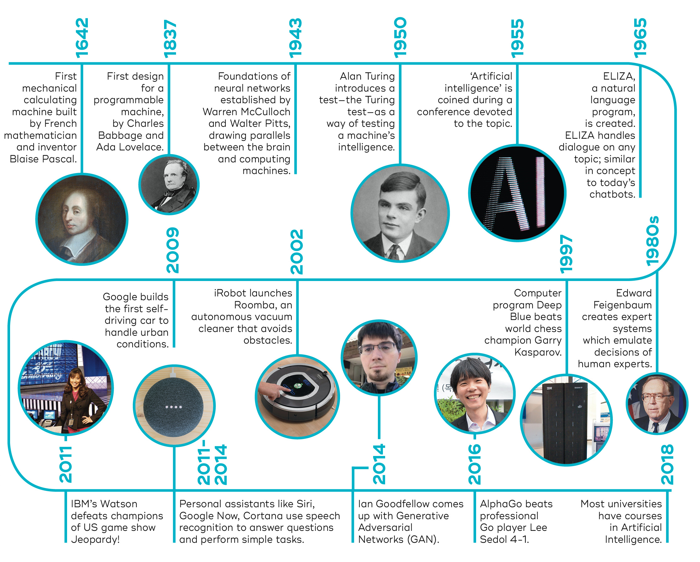{width="85%"}](#){data-modal-type="image" data-modal-url="figures/ai-timeline.jpg"}

Source: [University of Queensland's Brain Institute](https://qbi.uq.edu.au/brain/intelligent-machines/history-artificial-intelligence)
:::
:::
:::
:::

# The pre-history of AI 🏛️  {background-color="#2d4563"}

## The pre-history of AI
### Ancient myths of artificial life

:::{style="margin-top: 30px; font-size: 26px;"}
:::{.columns}
:::{.column width=55%}
- Humans have [long dreamed of creating artificial life]{.alert}
- Ancient myths featured mechanical beings:
  - [Talos](https://en.wikipedia.org/wiki/Talos) (Greek): Bronze giant protecting Crete
  - [Golem](https://en.wikipedia.org/wiki/Golem) (Jewish folklore): Clay figure brought to life
  - [Frankenstein](https://en.wikipedia.org/wiki/Frankenstein) (1818): Mary Shelley's novel about creating life
- We've always been fascinated with [replicating intelligence]{.alert}
- [Can machines truly think, or only simulate thinking?]{.alert}
:::

:::{.column width=45%}
:::{style="text-align: center;"}
[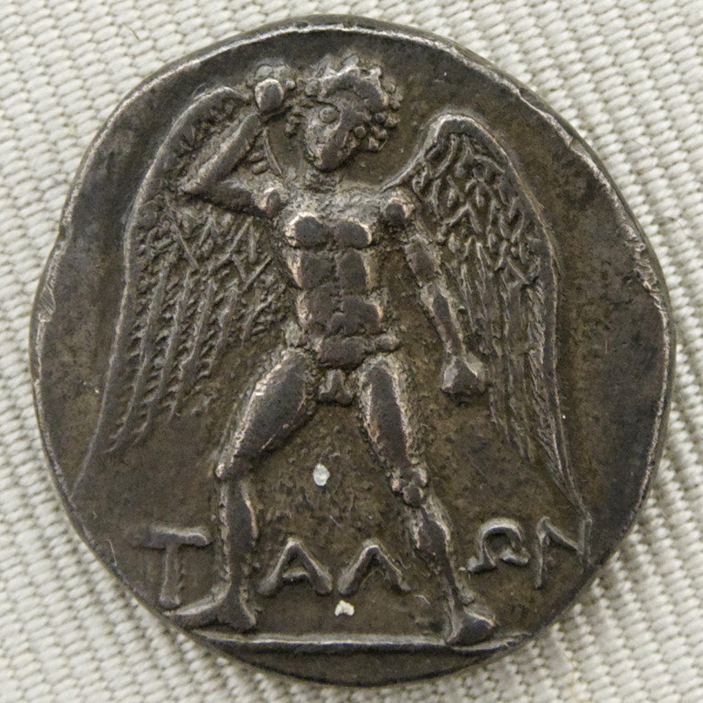{width="80%"}](#){data-modal-type="image" data-modal-url="figures/talos.jpg"}

Source: [Wikipedia - Talos](https://en.wikipedia.org/wiki/Talos)
:::
:::
:::
:::

## Early mechanical calculators
### From Pascal to Babbage

:::{style="margin-top: 30px; font-size: 22px;"}
:::{.columns}
:::{.column width=50%}
- [Can intelligence be reduced to rules and symboles, or does it emerge from interconnected units?]{.alert}
- **1642**: [Blaise Pascal](https://en.wikipedia.org/wiki/Blaise_Pascal) builds the [Pascaline](https://en.wikipedia.org/wiki/Pascaline), a mechanical calculator for addition and subtraction
- **1673**: [Gottfried Leibniz](https://en.wikipedia.org/wiki/Gottfried_Wilhelm_Leibniz) creates a [machine that can multiply and divide](https://en.wikipedia.org/wiki/Leibniz_calculator)
- **1837**: [Charles Babbage](https://en.wikipedia.org/wiki/Charles_Babbage) designs the [Analytical Engine](https://en.wikipedia.org/wiki/Analytical_Engine), a programmable, general-purpose computer (never completed)
- [Ada Lovelace](https://en.wikipedia.org/wiki/Ada_Lovelace) writes what many consider the [first computer program](https://en.wikipedia.org/wiki/Ada_Lovelace) for Babbage's machine
- [Calculation could be separated from human minds]{.alert}
:::

:::{.column width=50%}
:::{style="text-align: center;"}
[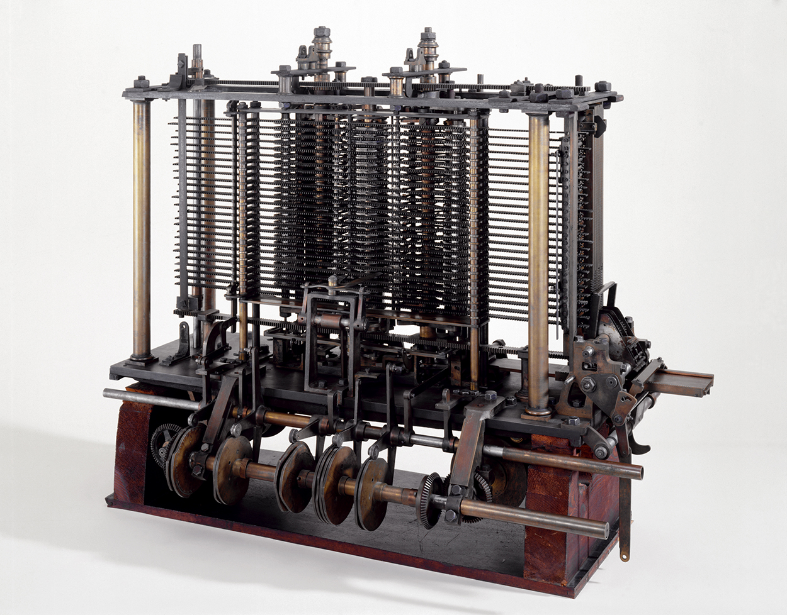{width="90%"}](#){data-modal-type="image" data-modal-url="figures/babbage.jpg"}

Source: [Wikipedia - Analytical Engine](https://en.wikipedia.org/wiki/Analytical_Engine)
:::
:::
:::
:::

## Human computers
### When "computer" meant a person

:::{style="margin-top: 30px; font-size: 24px;"}
:::{.columns}
:::{.column width=50%}
- For most of history, [the word "computer" referred to a person]{.alert}, not a machine!
- Large teams of human computers performed complex calculations:
  - Astronomical tables
  - Ballistics trajectories
  - Census data
- Often women, who were paid less than male mathematicians
- This [division of mental labour]{.alert} showed that complex calculations could be broken into simple, mechanical steps
- Historian Lorraine Daston: [Calculation shifted from "genius" to "merely mechanical"](https://hdsr.mitpress.mit.edu/pub/0aytgrau/release/3)
:::

:::{.column width=50%}
:::{style="text-align: center;"}
[{width="100%"}](#){data-modal-type="image" data-modal-url="figures/human-computers.webp"}

Source: [NASA](https://www.nasa.gov/centers-and-facilities/jpl/when-computers-were-human/)
:::
:::
:::
:::

## Alan Turing and the foundations of computing
### The theoretical breakthrough

:::{style="margin-top: 30px; font-size: 22px;"}
:::{.columns}
:::{.column width=55%}
- **1936**: [Alan Turing](https://en.wikipedia.org/wiki/Alan_Turing) publishes "[On Computable Numbers](https://www.cs.virginia.edu/~robins/Turing_Paper_1936.pdf)"
- Introduces the concept of a [universal machine]{.alert} that can compute anything computable
- **1950**: Publishes "[Computing Machinery and Intelligence](https://phil415.pbworks.com/f/TuringComputing.pdf)"
  - Proposes the famous [Turing Test](https://en.wikipedia.org/wiki/Turing_test): Can a machine fool a human into thinking it's human?
  - Asks: ["Can machines think?"]{.alert} and reframes it as a practical question (["Can machines do what we (as thinking entities) can do?"]{.alert})
- Turing's ideas laid the [theoretical foundation]{.alert} for both computing and AI
- He suggested machines could [learn]{.alert}, not just follow fixed rules
:::

:::{.column width=45%}
:::{style="text-align: center;"}
[{width="90%"}](#){data-modal-type="image" data-modal-url="figures/turing-test.png"}

Source: [Wikipedia - Turing Test](https://en.wikipedia.org/wiki/Turing_test)
:::
:::
:::
:::

## Live Turing test!

:::{style="margin-top: 30px; font-size: 22px;"}
:::{.incremental}
- Guess if the following sentences were written by a human or a machine:

<br>

- "The universe (which others call the Library) is composed of an indefinite, perhaps an infinite number of hexagonal galleries, with enormous ventilation shafts in the middle, encircled by very low railings."
  - Human! [Jorge Luis Borges (Argentine writer)](https://en.wikipedia.org/wiki/Jorge_Luis_Borges)
- "This is a multifaceted issue that requires us to examine several different perspectives."
  - Machine!
- "The function of science fiction is not always to predict the future but sometimes to prevent it."
  - Human! Attributed to [Frank Herbert (author of Dune)](https://en.wikipedia.org/wiki/Frank_Herbert)
- "The epistemological ramifications of this ontological framework necessitate a paradigmatic shift in our heuristic methodologies."
  - Machine!

- And yes, [ChatGPT did pass the Turing test](https://arxiv.org/abs/2405.08007v1)
:::
:::

# The birth of AI (1950s–1970s) 🎂 {background-color="#2d4563"}

## The Dartmouth Conference (1956)
### Where it all began

:::{style="margin-top: 30px; font-size: 22px;"}
:::{.columns}
:::{.column width=55%}
- **Summer 1956**: [A workshop at Dartmouth College](https://en.wikipedia.org/wiki/Dartmouth_workshop) marks the birth of AI as a field
- Organised by [John McCarthy](https://en.wikipedia.org/wiki/John_McCarthy_(computer_scientist)), [Marvin Minsky](https://en.wikipedia.org/wiki/Marvin_Minsky), [Nathaniel Rochester](https://en.wikipedia.org/wiki/Nathaniel_Rochester_(computer_scientist)), and [Claude Shannon](https://en.wikipedia.org/wiki/Claude_Shannon)
- First use of the term "[Artificial Intelligence]{.alert}"
- The founding conjecture:

> "Every aspect of learning or any other feature of intelligence can in principle be so precisely described that [a machine can be made to simulate it]{.alert}."

- Attendees included [Herbert Simon](https://en.wikipedia.org/wiki/Herbert_A._Simon) and [Allen Newell](https://en.wikipedia.org/wiki/Allen_Newell)
- [Optimism was high]{.alert}: Many believed human-level AI was just decades away
:::

:::{.column width=45%}
:::{style="text-align: center;"}
[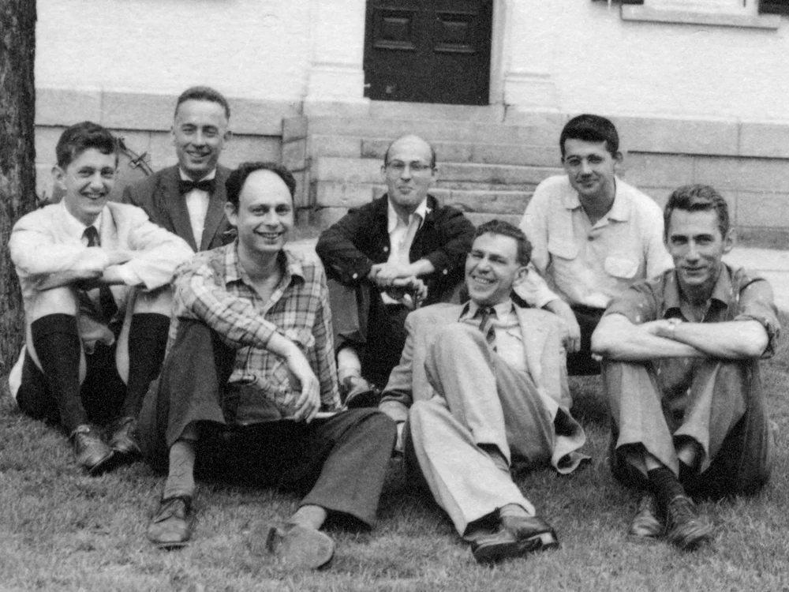{width="100%"}](#){data-modal-type="image" data-modal-url="figures/dartmouth.webp"}

Source: [IEEE Spectrum](https://spectrum.ieee.org/dartmouth-ai-workshop)
:::
:::
:::
:::

## Symbolic AI and expert systems
### Two approaches to intelligence

:::{style="margin-top: 30px; font-size: 24px;"}
:::{.columns}
:::{.column width=50%}

**Symbolic AI, 1956–1980s**

- [Intelligence = manipulating symbols according to rules]{.alert}
- Program the [formal rules]{.alert} behind intelligent behaviour into machines
- Early successes: [ELIZA](https://en.wikipedia.org/wiki/ELIZA) (therapist, [video here](https://www.youtube.com/watch?v=RMK9AphfLco)), [SHRDLU](https://en.wikipedia.org/wiki/SHRDLU) (block world, [video here](https://www.youtube.com/watch?v=bo4RvYJYOzI))
  - Try ELIZA here: <https://anthay.github.io/eliza.html> (by the [ELIZA Archaeology Project](https://sites.google.com/view/elizaarchaeology/try-eliza))
- [Bold but overconfident predictions]{.alert}: Minsky and Simon expected human-level AI within a generation
:::

:::{.column width=50%}

**Expert systems, 1970s–1980s**

- Shift to [narrow domains]{.alert} with expert knowledge
- Encode human expertise as [if-then rules]{.alert}
- Examples: [MYCIN](https://en.wikipedia.org/wiki/Mycin) (bacterial infections, [video here](https://www.youtube.com/watch?v=bro6fkDxCUE)), [DENDRAL](https://en.wikipedia.org/wiki/Dendral) (chemical analysis, [video here](https://www.youtube.com/watch?v=lH3IgyGlpzw))
- Edward Feigenbaum: "[The problem-solving power... is primarily a consequence of the specialist's knowledge employed]{.alert}"

- Both approaches relied on [hand-crafted knowledge]{.alert}, not learning from data
- Neither could [learn or improve automatically]{.alert}

:::
:::
:::

## The AI winters

:::{style="margin-top: 30px; font-size: 24px;"}
:::{.columns}
:::{.column width=50%}

**The first winter (1974–1980)**

- [Combinatorial explosion]{.alert}, [limited computing power]{.alert}, [brittleness]{.alert}
- Funding collapsed, researchers left the field
- [Lesson: AI is harder than pioneers thought]{.alert}

**The second winter (1987–1993)**

- [Expensive to maintain]{.alert}, [knowledge bottleneck]{.alert}, [couldn't learn]{.alert}
- Desktop computers made specialised AI hardware obsolete
- Market collapsed by 1987
- "[AI]{.alert}" became a dirty word

:::

:::{.column width=50%}

**The pattern**

1. Bold claims attract funding
2. Initial successes create excitement
3. Limitations become apparent at scale
4. Funding dries up, researchers move on
5. Quiet research continues, laying groundwork...

<br>
Anything familiar about this pattern? 😅

Maybe this time is different? 🤷🏻‍♂️
:::
:::
:::

# Neural networks: rise, fall, and rise again 🧠 {background-color="#2d4563"}

## Early neural networks
### Inspired by the brain

:::{style="margin-top: 30px; font-size: 20px;"}
:::{.columns}
:::{.column width=55%}
- **1943**: [McCulloch](https://en.wikipedia.org/wiki/Warren_McCulloch) and [Pitts](https://en.wikipedia.org/wiki/Walter_Pitts) propose [artificial neurons](https://en.wikipedia.org/wiki/A_Logical_Calculus_of_the_Ideas_Immanent_in_Nervous_Activity)
  - Simple binary units that mimic biological neurons
- **1958**: [Frank Rosenblatt](https://en.wikipedia.org/wiki/Frank_Rosenblatt) invents the [Perceptron](https://en.wikipedia.org/wiki/Perceptron)
  - A simple neural network that could [learn]{.alert} to classify patterns
  - Trained by adjusting weights based on errors
- The New York Times (1958) predicted it would ["walk, talk, see, write, reproduce itself"](https://www.nytimes.com/1958/07/08/archives/new-navy-device-learns-by-doing-psychologist-shows-embryo-of.html)
- Instead of programming rules, let the machine [learn from examples]{.alert}
- However, single-layer perceptrons [couldn't solve certain simple problems]{.alert}, so interest waned
- [Multi-layer networks](https://en.wikipedia.org/wiki/Artificial_neural_network) *could* solve these problems, but [training them was hard]{.alert}
- It took [nearly 20 years for neural networks to make their comeback]{.alert}
:::

:::{.column width=45%}
:::{style="text-align: center;"}
[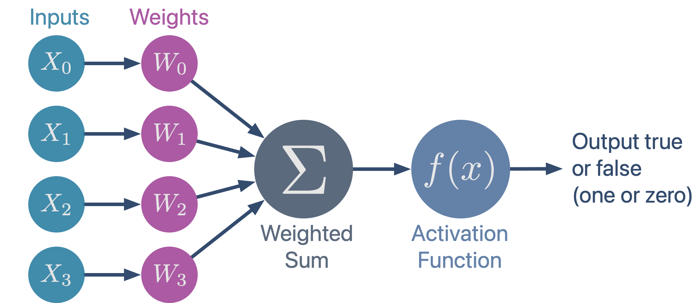{width="100%"}](#){data-modal-type="image" data-modal-url="figures/perceptron.png"}

Source: [AI Mind](https://pub.aimind.so/perceptron-101-the-building-blocks-of-a-neural-network-496f6b9b3826)
:::
:::
:::
:::

## The backpropagation breakthrough (1986)
### Learning to learn

:::{style="margin-top: 30px; font-size: 24px;"}
:::{.columns}
:::{.column width=55%}
- **1986**: [Rumelhart](https://en.wikipedia.org/wiki/David_Rumelhart), [Hinton](https://en.wikipedia.org/wiki/Geoffrey_Hinton), and [Williams](https://en.wikipedia.org/wiki/Ronald_J._Williams) popularise [backpropagation](https://en.wikipedia.org/wiki/Backpropagation)
- You can [train multi-layer networks]{.alert} by propagating errors backwards through the layers
- Finally, neural networks could learn complex patterns!
- Renewed interest in [connectionism]{.alert}
- But challenges remained:
  - Limited computing power
  - Not enough training data
- Neural networks showed promise but couldn't yet compete with other methods
:::

:::{.column width=45%}
:::{style="text-align: center;"}
[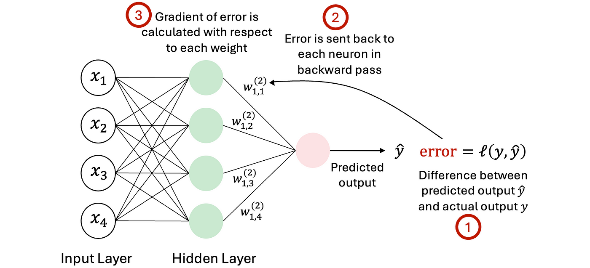{width="100%"}](#){data-modal-type="image" data-modal-url="figures/backprop.png"}

Source: [Medium](https://medium.com/@lmpo/backpropagation-the-backbone-of-neural-network-training-64946d6c3ae5)
:::
:::
:::
:::

# The data revolution 📊 {background-color="#2d4563"}

## The unreasonable effectiveness of data
### A paradigm shift

:::{style="margin-top: 30px; font-size: 20px;"}
:::{.columns}
:::{.column width=55%}
- **2009**: Google researchers ([Halevy](https://en.wikipedia.org/wiki/Alon_Halevy), [Norvig](https://en.wikipedia.org/wiki/Peter_Norvig), [Pereira](https://research.google/people/author1092/?&type=google)) publish a landmark paper called "[The Unreasonable Effectiveness of Data](https://static.googleusercontent.com/media/research.google.com/en//pubs/archive/35179.pdf)"
- [Simple models with lots of data beat complex models with less data]{.alert}
- Traditional AI: Design clever algorithms
- New AI: [Feed massive amounts of data]{.alert} to simple learning algorithms

> "Now go out and gather some data, and see what it can do."

- This insight transformed the field
- [Data became the new oil]{.alert}, together with [computing power and better algorithms]{.alert}
- Any one of them alone wasn't enough!
:::

:::{.column width=45%}
:::{style="text-align: center;"}
[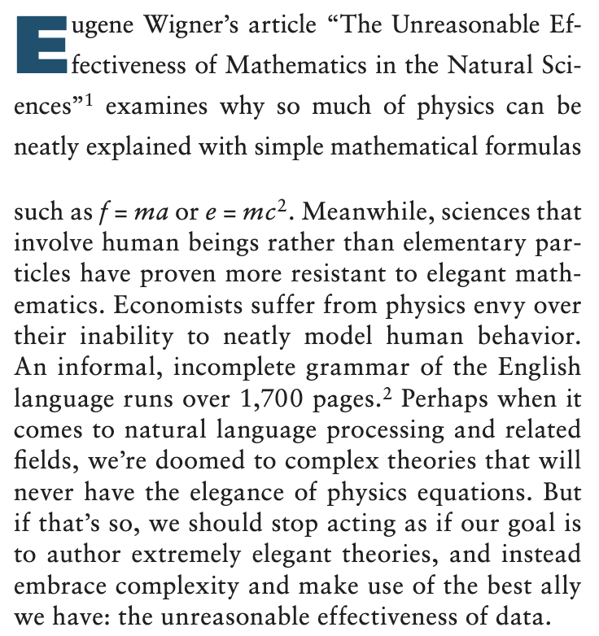{width="90%"}](#){data-modal-type="image" data-modal-url="figures/data-effectiveness.png"}

Source: [Google Research](https://static.googleusercontent.com/media/research.google.com/en//pubs/archive/35179.pdf)
:::
:::
:::
:::

## The ImageNet moment (2012)
### Deep learning arrives

:::{style="margin-top: 30px; font-size: 24px;"}
:::{.columns}
:::{.column width=55%}
- [ImageNet](https://www.image-net.org/): A dataset of 14 million labeled images
- Annual competition: Classify images into 1,000 categories
- **2012**: [AlexNet](https://spectrum.ieee.org/alexnet-source-code) ([Krizhevsky, Sutskever, Hinton](https://proceedings.neurips.cc/paper_files/paper/2012/file/c399862d3b9d6b76c8436e924a68c45b-Paper.pdf)) wins by a [huge margin]{.alert}
  - Error rate: 15.3% (next best: 26.2%)
  - Used [deep convolutional neural networks]{.alert}
  - Trained on GPUs
- This was a great moment for deep learning!
- Within years, deep learning dominated computer vision
- Proved that [neural networks + big data + GPUs = breakthrough]{.alert}
:::

:::{.column width=45%}
:::{style="text-align: center;"}
[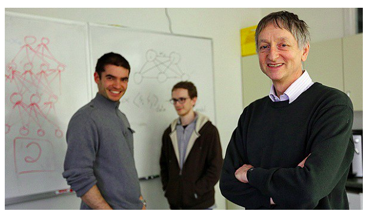{width="95%"}](#){data-modal-type="image" data-modal-url="figures/alexnet.png"}

Source: [Medium](https://svelezg.medium.com/krizhevsky-sutskever-hinton-and-imagenet-d1c7f2fba113)
:::
:::
:::
:::

# Transformers: the architecture that changed everything ⚡ {background-color="#2d4563"}

## Attention is all you need (2017)
### The transformer revolution

:::{style="margin-top: 30px; font-size: 24px;"}
:::{.columns}
:::{.column width=55%}
- **2017**: Google researchers publish "[Attention Is All You Need](https://arxiv.org/abs/1706.03762)" (Vaswani et al.)
- [Self-attention mechanism]{.alert}
- Instead of processing sequentially:
  - Each word can "look at" [every other word]{.alert} directly
  - Computes relevance scores between all pairs
  - [Parallel processing]{.alert}: Much faster to train
- This architecture powers [GPT (Generative Pre-trained Transformer), BERT, and pretty much all modern AI]{.alert}
- Beyond text: Now used in images, audio, video, proteins, games...
:::

:::{.column width=45%}
:::{style="text-align: center;"}
[{width="100%"}](#){data-modal-type="image" data-modal-url="figures/transformer-paper.png"}
:::
:::
:::
:::

## How transformers work (simplified!)
### The big picture

:::{style="margin-top: 30px; font-size: 26px;"}

:::{.columns}
:::{.column width=55%}
:::{style="text-align: center;"}
[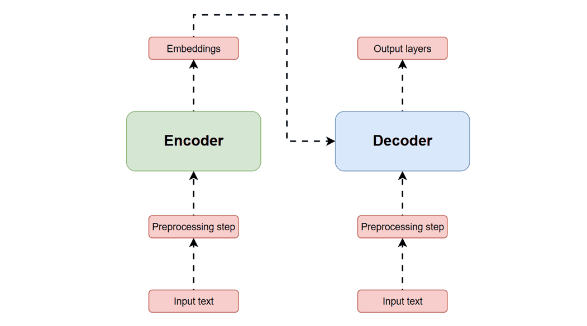{width="100%"}](#){data-modal-type="image" data-modal-url="figures/transformer.gif"}

Source: [Hivenet](https://compute.hivenet.com/post/simplifying-transformer-architecture-a-beginners-guide-to-understanding-ai-magic)
:::
:::

:::{.column width=45%}
:::{style="margin-top: 20px;"}
A transformer has [three main parts]{.alert}:

1. **Embedding**: Turn words into numbers
2. **Transformer Blocks**: Mix and refine information (the magic happens here!)
3. **Output**: Predict the next word
:::
:::
:::
:::

## Step 1: Tokenisation
### Breaking text into pieces

:::{style="margin-top: 30px; font-size: 26px;"}
:::{.columns}
:::{.column width=55%}
- Text must be converted to numbers
- **Tokenisation**: Split text into [tokens]{.alert}
  - Usually words, letters, or word pieces
  - "unhappiness" → "un", "happiness"
  - GPT-2 has a vocabulary of 50,257 tokens
- Each token gets a unique ID number
- Think of it as creating a [dictionary]{.alert} where each word/piece has a code
:::

:::{.column width=45%}
:::{style="text-align: center;"}
[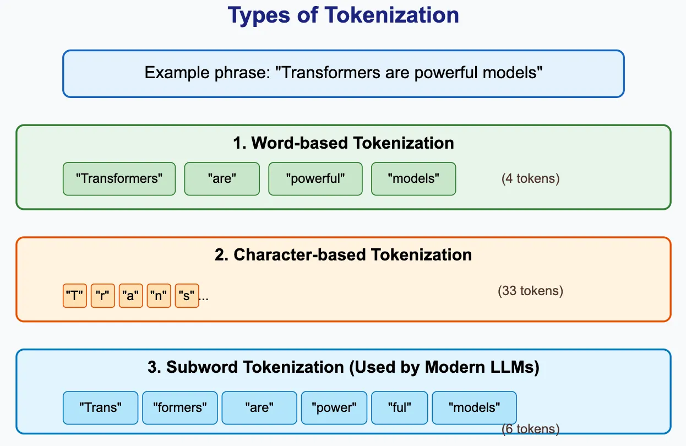](#){data-modal-type="image" data-modal-url="figures/tokenisation.webp" width="100%"}

Source: [Medium](https://shanmugasundaram.in/llm-tokenizers-the-hidden-engine-behind-ai-language-models-00f1135d4b3c)
:::
:::
:::
:::

## Step 2: Embeddings
### Words as points in space

:::{style="margin-top: 30px; font-size: 26px;"}
:::{.columns}
:::{.column width=55%}
- Each token becomes a [vector]{.alert} (a list of numbers)
- GPT-2: Each token → 768 numbers
- These vectors capture [meaning]{.alert}:
  - Similar words are close together
  - "king" - "man" + "woman" ≈ "queen"
- Also add [position information]{.alert}:
  - Word order matters in language!
  - "Dog bites man" ≠ "Man bites dog"
- These embeddings are [learned during training]{.alert}
:::

:::{.column width=45%}
:::{style="text-align: center;"}
[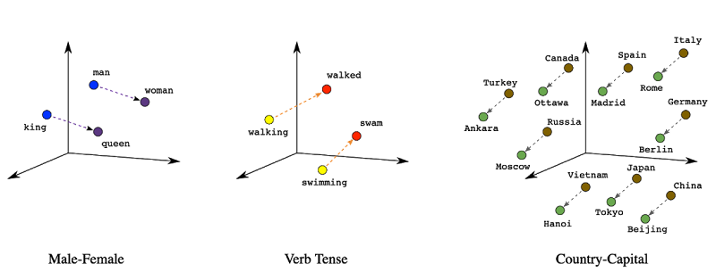](#){data-modal-type="image" data-modal-url="figures/embeddings.png" width="100%"}

Source: [Google Cloud](https://cloud.google.com/blog/topics/developers-practitioners/meet-ais-multitool-vector-embeddings)
:::
:::
:::
:::

## Step 3: Self-attention
### The key innovation

:::{style="margin-top: 30px; font-size: 24px;"}
:::{.columns}
:::{.column width=55%}
- The [core mechanism]{.alert} that makes transformers powerful
- For each word, ask: "[Which other words are relevant to understanding me?]{.alert}"
- Creates three vectors for each token:
  - **Query (Q)**: "What am I looking for?"
  - **Key (K)**: "What do I contain?"
  - **Value (V)**: "What information can I provide?"
- Attention score = how well Query matches Key
- Output = weighted sum of Values
- Analogy: Like a [search engine]{.alert} where each word searches for relevant context
:::

:::{.column width=45%}
:::{style="text-align: center;"}
[{width="70%"}](#){data-modal-type="image" data-modal-url="figures/attention.webp"}


Source: [Jay Alammar](https://jalammar.github.io/illustrated-transformer/)
:::
:::
:::
:::

## Self-attention example
### "The cat sat on the mat"

:::{style="margin-top: 30px; font-size: 24px;"}

:::{.columns}
:::{.column width=55%}
:::{style="text-align: center;"}
[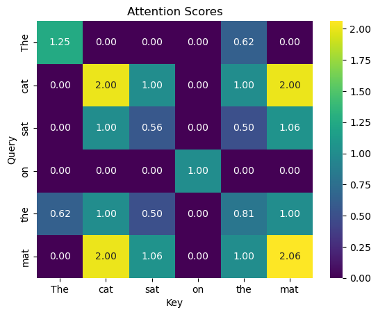{width="80%"}](#){data-modal-type="image" data-modal-url="figures/cat.png"}

Source: [Thomas Wiecki](https://twiecki.io/blog/2024/01/04/)
:::
:::

:::{.column width=45%}
:::{style="margin-top: 20px;"}
- When processing "sat", the model might attend strongly to:
  - "cat" (who is sitting?)
  - "mat" (where are they sitting?)
- [Multi-head attention]{.alert}: Multiple attention patterns in parallel
  - One head might focus on subject-verb relationships
  - Another on adjective-noun relationships
  - GPT-2 uses [12 attention heads]{.alert}
:::
:::
:::
:::

## Step 4: Feed-forward and stacking
### Building deeper understanding

:::{style="margin-top: 30px; font-size: 24px;"}
:::{.columns}
:::{.column width=55%}
- After attention, each token passes through a [feed-forward network]{.alert} (Multi-Layer Perceptron, MLP)
- This refines and transforms the representation
- One attention + one MLP = one "[Transformer Block]{.alert}"
- Models stack [many blocks]{.alert}:
  - GPT-2 (small): 12 blocks
  - GPT-3: 96 blocks
  - GPT-4: Rumoured to be much larger
- Each block builds more [abstract understanding]{.alert}
  - Early layers: Grammar, syntax
  - Later layers: Meaning, context, reasoning
:::

:::{.column width=45%}
:::{style="text-align: center;"}
[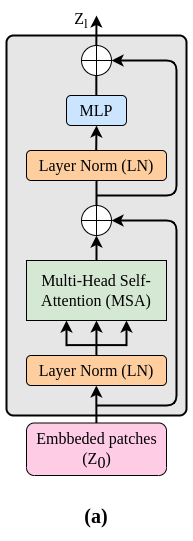{width="30%"}](#){data-modal-type="image" data-modal-url="figures/transformer-blocks.png"}

Source: [Mohamed Traore](https://www.researchgate.net/figure/Overall-Structure-of-Transformer-Encoder-Block_fig3_365101390)
:::
:::
:::
:::

## Step 5: Predicting the next token
### The final output

:::{style="margin-top: 30px; font-size: 24px;"}
- After all blocks, the model predicts: "[What comes next?]{.alert}"
- Outputs a [probability]{.alert} for every token in vocabulary
- Example: "The cat sat on the..."
  - "floor": 27.4%
  - "bed": 22.5%
  - "couch": 17.8%
  - ...
- **Temperature** controls randomness:
  - Low (0.2): More predictable
  - High (1.0+): More creative/random
- The chosen token is added, and the process [repeats]{.alert}
:::

## Step 5: Predicting the next token
### The final output

:::{style="text-align: center; margin-top: 20px;"}

[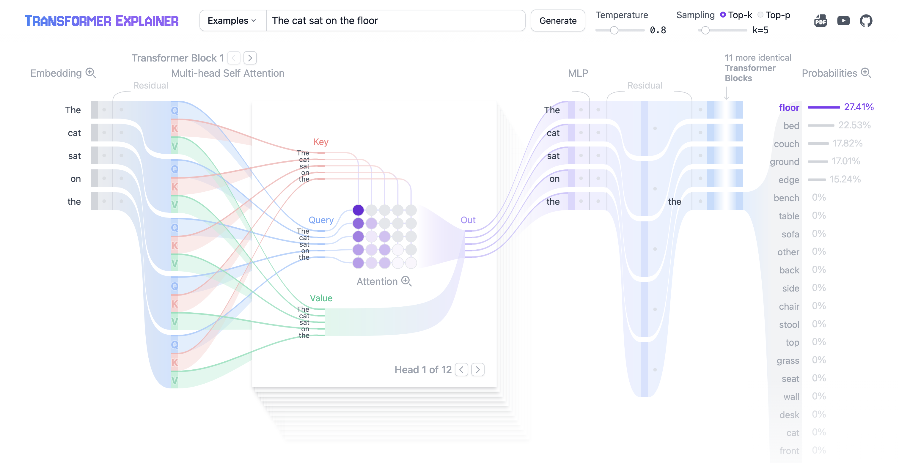{width="90%"}](#){data-modal-type="image" data-modal-url="figures/next-token.png"}

Source: [Transformer Explainer](https://poloclub.github.io/transformer-explainer/)
:::

# From GPT to ChatGPT 🚀 {background-color="#2d4563"}

## The rise of large language models
### Scaling up

:::{style="margin-top: 30px; font-size: 24px;"}

| Model | Year | Parameters | Notable Achievement |
|-------|------|------------|---------------------|
| GPT-1 | 2018 | 117M | Showed pre-training works |
| BERT | 2018 | 340M | Revolutionised NLP benchmarks |
| GPT-2 | 2019 | 1.5B | "Too dangerous to release" |
| GPT-3 | 2020 | 175B | Few-shot learning emergence |
| GPT-4 | 2023 | ~1.7T? | Multimodal, near-human reasoning |
| GPT-5 | 2025 | 635B? | More efficient, even better reasoning |

<br>

- [Bigger models + more data = emergent abilities]{.alert}
- Capabilities appear at scale that weren't explicitly trained
- This is the "[scaling hypothesis]{.alert}" (although some people, like [Ilya Sutskever](https://en.wikipedia.org/wiki/Ilya_Sutskever), argue that [scaling has reached its limits](https://www.youtube.com/watch?v=aR20FWCCjAs))
:::

## What makes ChatGPT different?
### Beyond just scaling

:::{style="margin-top: 30px; font-size: 24px;"}
:::{.columns}
:::{.column width=55%}
- ChatGPT (Nov 2022) wasn't just a bigger model
- Three key innovations:
  1. [Instruction tuning](https://www.ibm.com/think/topics/instruction-tuning): Trained to follow instructions
  2. [RLHF (Reinforcement Learning from Human Feedback)](https://en.wikipedia.org/wiki/Reinforcement_learning_from_human_feedback): Humans rate responses; model learns what's helpful
  3. [Safety training](https://en.wikipedia.org/wiki/AI_safety): Reduce harmful outputs
- Result: A model that's [actually useful]{.alert} for conversation
- [100 million users in 2 months]{.alert}—fastest-growing consumer app ever
:::

:::{.column width=45%}
:::{style="text-align: center;"}
[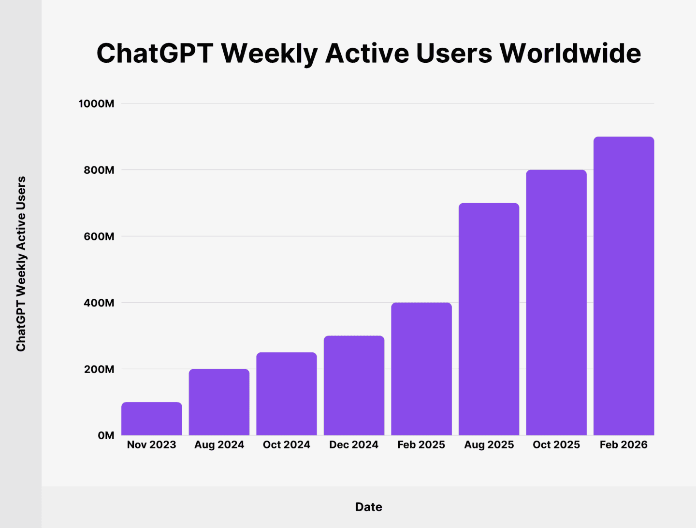{width="80%"}](#){data-modal-type="image" data-modal-url="figures/chatgpt-growth.webp"}

Source: [Voronoi](https://www.voronoiapp.com/technology/OpenAIs-ChatGPT-Hits-Record-5846-Billion-Monthly-Website-Visits-in-August-2025-6532)
:::
:::
:::
:::

## Multimodal AI
### Beyond text

:::{style="margin-top: 30px; font-size: 24px;"}
:::{.columns}
:::{.column width=55%}
- Modern AI isn't just about text anymore
- [Multimodal models]{.alert} can process:
  - Text ↔ Images (DALL-E, Midjourney)
  - Text ↔ Audio (Whisper, ElevenLabs)
  - Text ↔ Video (Sora, Runway)
  - Text ↔ Code (Codex, Copilot)
- [Same transformer architecture]{.alert}, different inputs/outputs
- Vision Transformers (ViT): Treat images as sequences of patches
- The boundaries between modalities are [blurring]{.alert}
:::

:::{.column width=45%}
:::{style="text-align: center;"}
[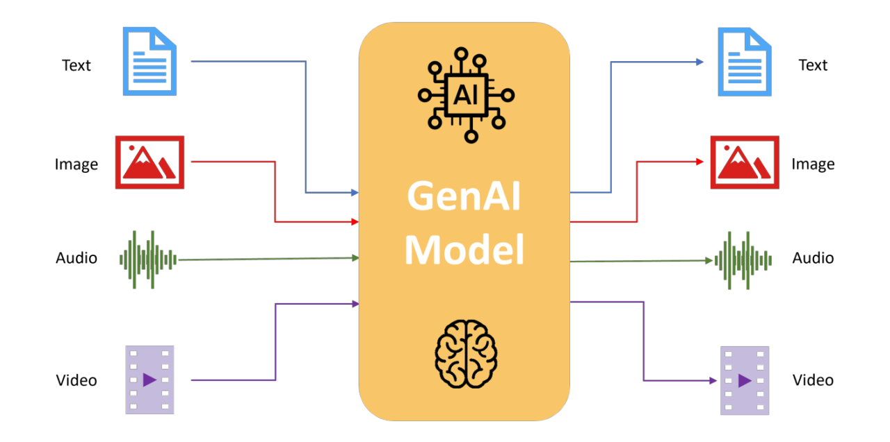{width="100%"}](#){data-modal-type="image" data-modal-url="figures/multimodal.png"}

Source: [Tarun Sharma](https://www.linkedin.com/pulse/multimodal-generative-ai-tarun-sharma-zzf9c)
:::
:::
:::
:::

# Takeaways 📚 {background-color="#2d4563"}

## What changed? What stayed the same?
### Continuity and transformation

:::{style="margin-top: 30px; font-size: 26px;"}

**What changed:**

- From [human-designed rules]{.alert} to [learned patterns]{.alert}
- From [narrow tasks]{.alert} to [general capabilities]{.alert}
- From [mimicking human reasoning]{.alert} to [optimising for prediction]{.alert}
- From [scarce data]{.alert} to [abundant data]{.alert}

**What stayed the same:**

- The [dream]{.alert} of intelligent machines
- The [question]{.alert}: Can machines truly understand the world?
- The [challenges]{.alert}: Brittleness, bias, lack of common sense
- The [hype cycles]{.alert}: Overpromise, underdeliver (are we in one now?)
:::

## Interactive resource
### Explore transformers yourself!

:::{style="margin-top: 30px; font-size: 26px;"}
:::{.columns}
:::{.column width=55%}
- Georgia Tech's [Transformer Explainer](https://poloclub.github.io/transformer-explainer/)
- Interactive visualisation of how transformers work
- See attention patterns in real time
- Experiment with temperature and sampling
- Runs GPT-2 directly in your browser!
- Great for building intuition

[https://poloclub.github.io/transformer-explainer](https://poloclub.github.io/transformer-explainer/)
:::

:::{.column width=45%}
:::{style="text-align: center;"}
[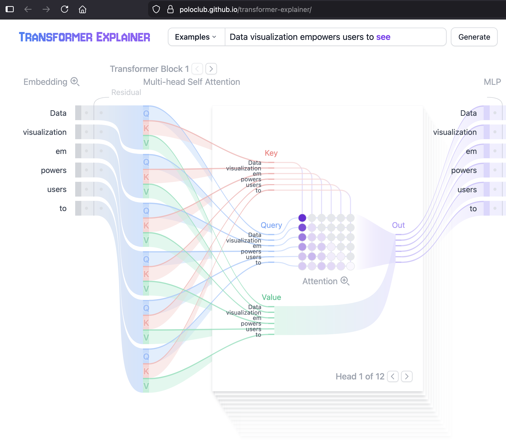{width="95%"}](#){data-modal-type="image" data-modal-url="figures/transformer-explainer.png"}
:::
:::
:::
:::

# ... and that's all for today! 🎉 {background-color="#2d4563"}

# See you all soon! 😊 {background-color="#2d4563"}
