```{r setup, include=FALSE}
# figures formatting setup
options(htmltools.dir.version = FALSE)
library(knitr)
opts_chunk$set(
  prompt = T,
  fig.align="center", #fig.width=6, fig.height=4.5, 
  # out.width="748px", #out.length="520.75px",
  dpi=300, #fig.path='Figs/',
  cache=T, #echo=F, warning=F, message=F
  engine.opts = list(bash = "-l")
  )

## Next hook based on this SO answer: https://stackoverflow.com/a/39025054
knit_hooks$set(
  prompt = function(before, options, envir) {
    options(
      prompt = if (options$engine %in% c('sh','bash', 'zsh')) '$ ' else 'R> ',
      continue = if (options$engine %in% c('sh','bash', 'zsh')) '$ ' else '+ '
      )
})

# Set CRAN mirror
options(repos = c(CRAN = "https://cran.rstudio.com/"))

if (!require("fontawesome", character.only = TRUE)) {
  install.packages("fontawesome", dependencies = TRUE)
  library(fontawesome, character.only = TRUE)
}
```

# Welcome back! 🤓 {background-color="#2d4563"}

## Recap of last class

:::{style="margin-top: 20px; font-size: 32px;"}
- We traced AI from Ancient Greece to modern transformers
- [Symbolic AI]{.alert} (1950s-1980s): Hand-coded rules and logic
- [AI Winters]{.alert}: When hype exceeded reality (twice!)
- [Neural networks]{.alert}: From perceptrons to deep learning
- [The data revolution]{.alert}: "Simple models + lots of data beat complex models with less data"
- [Transformers]{.alert} (2017): Attention is all you need!
- [Data became the new oil]{.alert}... but where do the data come from? 🤔
:::

## Lecture overview
### Today's agenda

:::{style="margin-top: 20px; font-size: 30px;"}

:::{.columns}
:::{.column width=50%}
- Today we'll explore the foundation of all AI systems: [the data they're trained on]{.alert}
- Why data quality matters
- Types of ML tasks
- Sourcing and collecting data
- Selection bias and its dangers
- Best practices for labeling data
- Working with multiple annotators
- Quality control in datasets
:::

:::{.column width=50%}
:::{style="text-align: center; margin-top: -30px;"}
[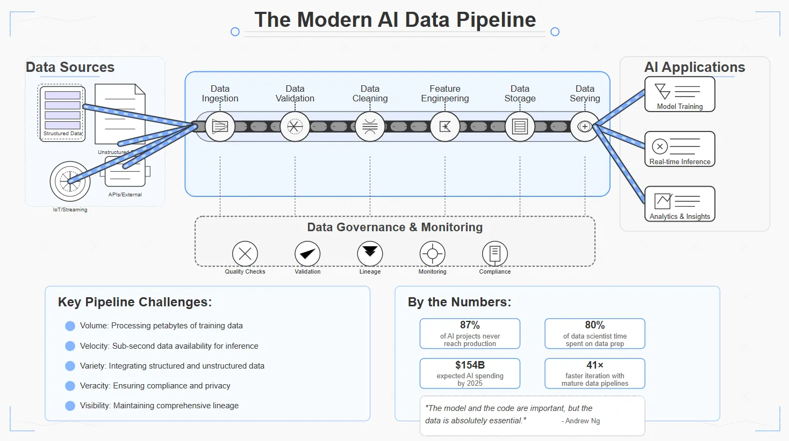{width="100%"}](#){data-modal-type="image" data-modal-url="figures/data-pipeline.webp"}

Source: [Medium](https://blog.dataengineerthings.org/the-ai-revolution-is-nothing-without-data-pipelines-288f1dfd8ca0)
:::
:::
:::
:::

## Tweet of the day

:::{style="margin-top: 30px; font-size: 26px; text-align: center;"}
[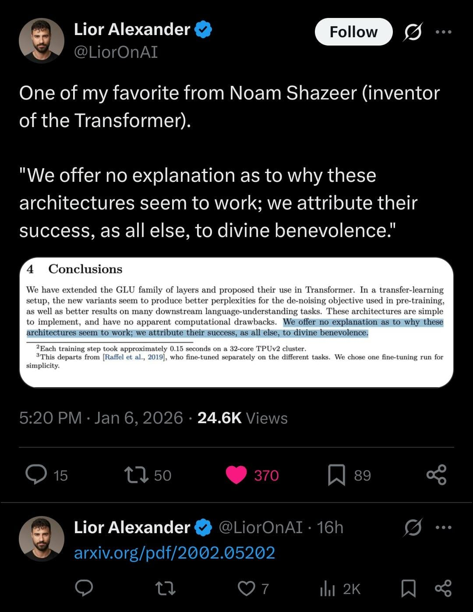{width="70%"}](#){data-modal-type="image" data-modal-url="figures/tweet-of-the-day.jpg"}
:::

## What matters more?
### Take a moment to think...

:::{style="margin-top: 50px; font-size: 26px; text-align: center;"}

> **"If you had to choose, which would give you better AI predictions?"**

:::{.columns}
:::{.column width=50%}
:::{.fragment}
**Option A:** 🧠

A [state-of-the-art algorithm]{.alert} trained on low-quality data
:::
:::

:::{.column width=50%}
:::{.fragment}
**Option B:** 📊

A [simple algorithm]{.alert} trained on high-quality data
:::
:::
:::

:::{style="margin-top: 40px;"}
:::{.fragment}
**Discuss with your neighbour for 1 minute!** 
:::

:::{.fragment}
**Raise your hand if you think Option A is better**
:::

:::{.fragment}
**And now raise your hand if you think Option B is better**
:::
:::
:::

## A cow, a camel or a polar bear?

:::{style="margin-top: 30px; font-size: 26px; text-align: center;"}
[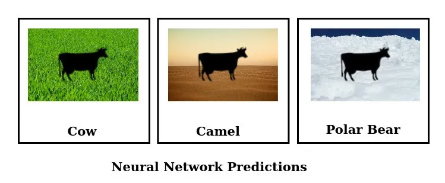{width="100%"}](#){data-modal-type="image" data-modal-url="figures/cows.webp"}

Source: [Medium](https://urwamuaz.medium.com/neural-networks-fail-on-data-with-spurious-correlation-b5010b107c32)
:::

# Why data quality matters 📊 {background-color="#2d4563"}

## Garbage in, garbage out
### The fundamental principle

:::{style="margin-top: 30px; font-size: 26px;"}
:::{.columns}
:::{.column width=55%}
- AI models are only as good as [the data they're trained on]{.alert}
- No amount of algorithmic sophistication can fix bad data
- Common data problems:
  - Missing important information (e.g., age, income, etc.)
  - Conflicting labels or formats (e.g., "yes" vs "1")
  - Biases, not representative of reality (e.g., gender, race, etc.)
- [The quality of your models is directly tied to the quality of your data]{.alert} (that's true for humans too!)
:::

:::{.column width=45%}
:::{style="text-align: center;"}
[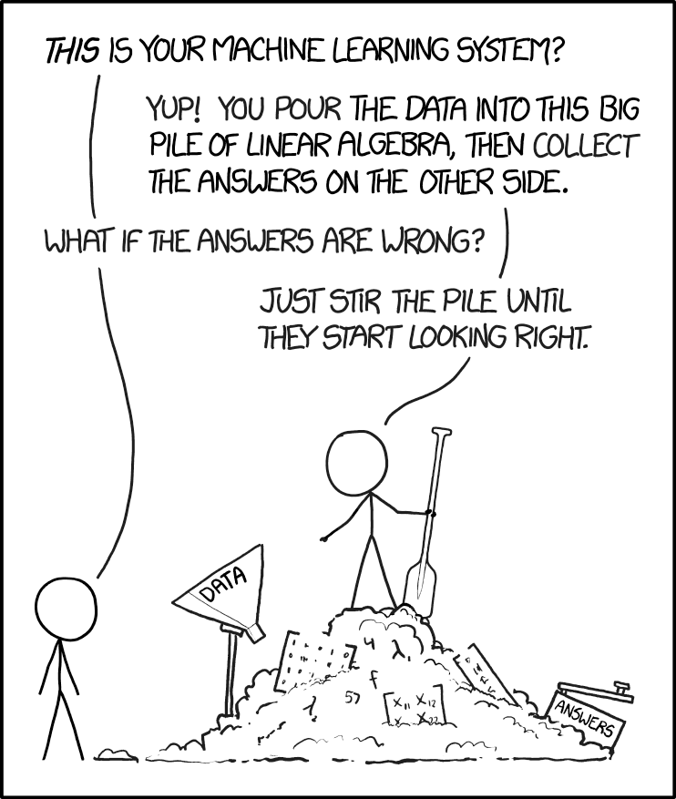{width="70%"}](#){data-modal-type="image" data-modal-url="figures/garbage-in-out.png"}

Source: [xkcd](https://xkcd.com/1838/)
:::
:::
:::
:::

## The data-centric AI movement
### A paradigm shift

:::{style="margin-top: 30px; font-size: 24px;"}
:::{.columns}
:::{.column width=60%}
- Traditional ML: Fix the data, [improve the model]{.alert}
- Data-centric AI: Fix the model, [improve the data]{.alert}
  - Check the website: <https://datacentricai.org/>
- Andrew Ng's insight (2021):

> "Instead of focusing on the code, companies should focus on [developing the processes]{.alert} to get and maintain good data."

- For many real-world problems, [improving data quality beats improving algorithms]{.alert}
- This is especially true when you have limited data
:::

:::{.column width=40%}
:::{style="text-align: center;"}
[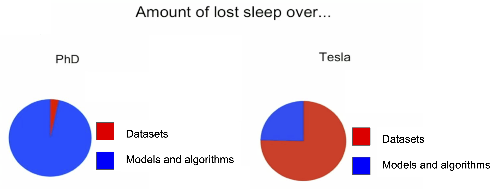{width="100%"}](#){data-modal-type="image" data-modal-url="figures/data-centric.png"}

Source: [Andrej Karpathy](https://vimeo.com/274274744)
:::
:::
:::
:::

## Real-world impact of data quality
### The hidden costs of bad data

:::{style="margin-top: 30px; font-size: 24px; text-align: center;"}
[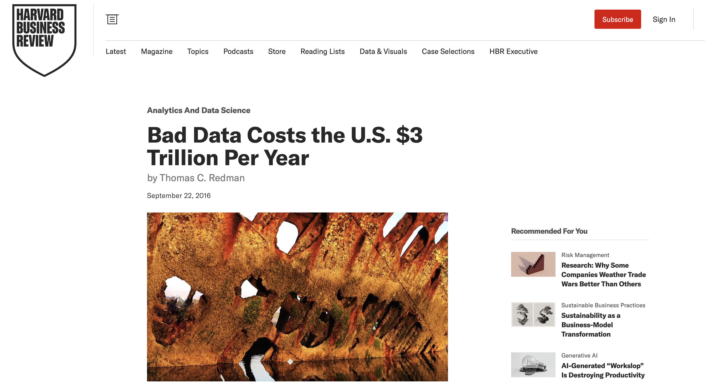{width="70%"}](#){data-modal-type="image" data-modal-url="figures/bad-quality.png"}

Source: [Harvard Business Review](https://hbr.org/2016/09/bad-data-costs-the-u-s-3-trillion-per-year)
:::

## Real-world impact of data quality
### When bad data causes harm

:::{style="margin-top: 30px; font-size: 28px;"}

| Case | What went wrong | Impact |
|------|-----------------|--------|
| Credit scoring | Data reflected historical gender-based income gaps | [Lower credit limits]{.alert} for women with similar profiles |
| Facial recognition | Training data mostly light-skinned faces | [Error rates 34x higher]{.alert} for dark-skinned women |
| Criminal risk assessment | Historical arrest data reflected biased policing | [Perpetuated racial disparities]{.alert} in sentencing |
| Hiring AI | Trained on historical (male-dominated) hiring decisions | [Penalised female candidates]{.alert} |

:::{.fragment}
> These weren't algorithm failures—they were [data failures]{.alert}.
:::
:::

# Types of machine learning tasks 🎯 {background-color="#2d4563"}

## Classification tasks
### Predicting categories

:::{style="margin-top: 30px; font-size: 24px;"}
:::{.columns}
:::{.column width=55%}
- **Goal**: Assign inputs to discrete categories
- Examples:
  - Email → Spam or Not Spam
  - Image → Cat, Dog, Bird, etc.
  - Medical scan → Cancerous or Benign
  - Text → Positive, Negative, Neutral sentiment
- **Binary classification**: Two classes
- **Multi-class**: Many classes (one per input)
- **Multi-label**: Multiple labels per input
- Key challenge: [How do you define the classes?]{.alert}
:::

:::{.column width=45%}
:::{style="text-align: center;"}
[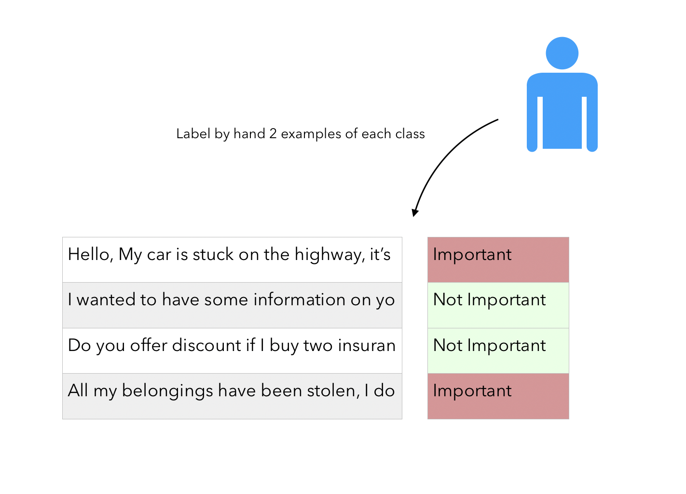{width="100%"}](#){data-modal-type="image" data-modal-url="figures/classification.png"}

Source: [Maël Fabien](https://maelfabien.github.io/machinelearning/NLP_5/)
:::
:::
:::
:::

## Regression tasks
### Predicting continuous values

:::{style="margin-top: 30px; font-size: 26px;"}
:::{.columns}
:::{.column width=55%}
- **Goal**: Predict a continuous numerical value
- Examples:
  - Features → House price
  - Patient data → Length of hospital stay
  - Weather data → Temperature tomorrow
  - User behaviour → Ad click probability
- Key question: [What should the model predict?]{.alert}
- The choice of target variable is [a design decision]{.alert}
- Different targets can lead to very different models
:::

:::{.column width=45%}
:::{style="text-align: center;"}
[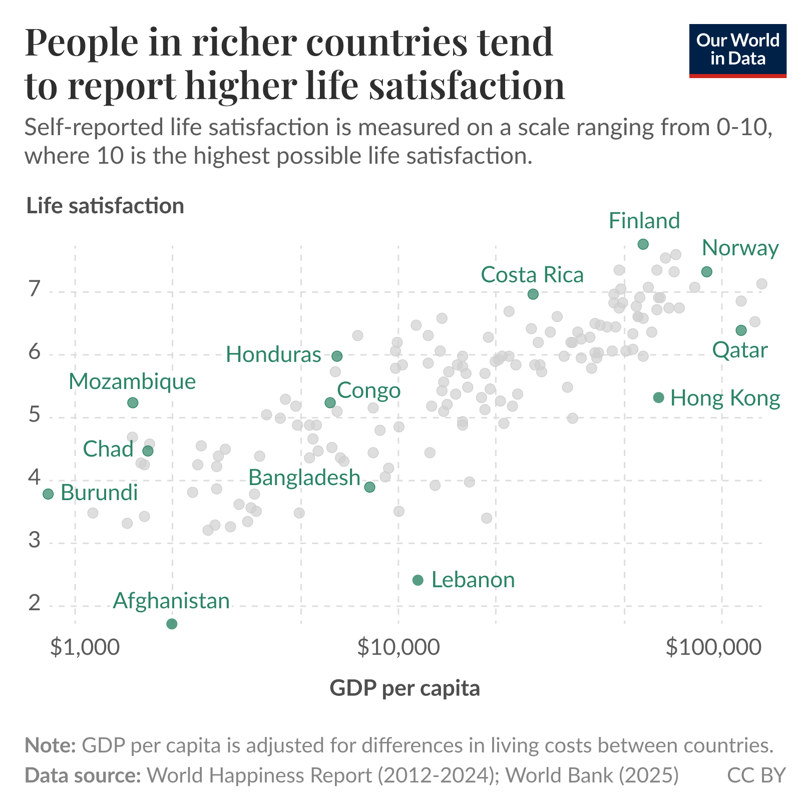{width="90%"}](#){data-modal-type="image" data-modal-url="figures/regression.png"}

Source: [Our World in Data](https://ourworldindata.org/data-insights/people-in-richer-countries-tend-to-say-they-are-more-satisfied-with-their-lives)
:::
:::
:::
:::

## Other common ML tasks
### Beyond classification and regression

:::{style="margin-top: 30px; font-size: 26px;"}

| Task | Description | Example |
|------|-------------|---------|
| **Object Detection** | Find and locate objects in images | Self-driving cars detecting pedestrians |
| **Segmentation** | Label every pixel in an image | Medical imaging (tumour boundaries) |
| **Sequence Labeling** | Label each element in a sequence | Named entity recognition in text |
| **Generation** | Create new content | ChatGPT, DALL-E, music generation |
| **Ranking** | Order items by relevance | Search results, recommendations |

:::{.fragment}
Each task requires [different types of labels]{.alert} in your dataset!
:::
:::

## Defining your classes
### Classification pitfalls

:::{style="margin-top: 30px; font-size: 24px;"}
:::{.columns}
:::{.column width=55%}
- Classes should be:
  - **Mutually exclusive**: No overlap
  - **Collectively exhaustive**: Cover all cases
  - **Consistently definable**: Clear boundaries
- Common problems:
  - [Ambiguous categories]{.alert}: What counts as "spam"?
  - [Subjective judgments]{.alert}: Is this review "positive"?
  - [Cultural differences]{.alert}: What's "offensive" varies
  - [Evolving definitions]{.alert}: Categories change over time
- Solution: [Clear annotation guidelines]{.alert}
:::

:::{.column width=45%}
:::{style="text-align: center;"}
[{width="90%"}](#){data-modal-type="image" data-modal-url="figures/duck-rabbit.png"}

Source: [The Independent](https://www.independent.co.uk/news/science/duck-and-rabbit-illusion-b1821663.html)
:::
:::
:::
:::

## The proxy problem
### When labels don't measure what you care about

:::{style="margin-top: 30px; font-size: 24px;"}

:::{.columns}
:::{.column width=50%}
:::{.incremental}
- Often we can't directly measure what we want to predict
- We use [proxy variables]{.alert} instead...but proxies can be misleading!

- **Example 01: Predicting "health needs"**

- What we want: How sick is this patient?
- Available data: Healthcare spending
- [What do you think of this proxy?]{.alert}
- [Spending ≠ health needs]{.alert}
- Black patients had less spent on them due to systemic barriers
- Algorithm learned: "Black patients need less care" → [Wrong!]{.alert}

- Always ask: [Does this label actually measure what I care about?]{.alert}
:::
:::

:::{.column width=50%}
:::{.incremental}
- **Example 02: Predicting expertise on social media**

- What we want: Who is an expert in a field?
- Available data: Number of followers
- [What do you think of this proxy?]{.alert}
- [Followers ≠ Expertise]{.alert}
- Popularity can be gamed or unrelated to domain knowledge
- Algorithm learned: "High engagement = High expertise" → [Wrong!]{.alert}

:::
:::
:::
:::

# Sourcing and collecting data 📥 {background-color="#2d4563"}

## Where do the data come from?
### Common data sources

:::{style="margin-top: 30px; font-size: 26px;"}

| Source | Examples | Considerations |
|--------|----------|----------------|
| **Existing databases** | Hospital records, transaction logs | May have missing fields, inconsistent formats |
| **Public datasets** | ImageNet, Wikipedia, Common Crawl | May not match your specific domain |
| **Web scraping** | Social media, news articles | Legal and ethical concerns |
| **Surveys/Forms** | User feedback, questionnaires | Response bias, sampling issues |
| **Sensors/IoT** | Cameras, wearables, satellites | Privacy concerns, data volume |
| **Synthetic data** | Generated by other models | May not capture real-world complexity |

:::

## How much data do you need?
### The million-dollar question

:::{style="margin-top: 30px; font-size: 24px;"}
:::{.columns}
:::{.column width=55%}
- There's no universal answer... it depends on:
  - Task complexity
  - Number of classes/features
  - Model architecture
  - Required accuracy
- **Rule of thumb**: Start small, then scale
- **Scaling laws**: Performance improves predictably with more data:

$$\log(\text{error}) = -a \cdot \log(n) + b$$

- You can [estimate]{.alert} how much data you'll need by training on subsets and extrapolating
:::

:::{.column width=45%}
:::{style="text-align: center;"}
[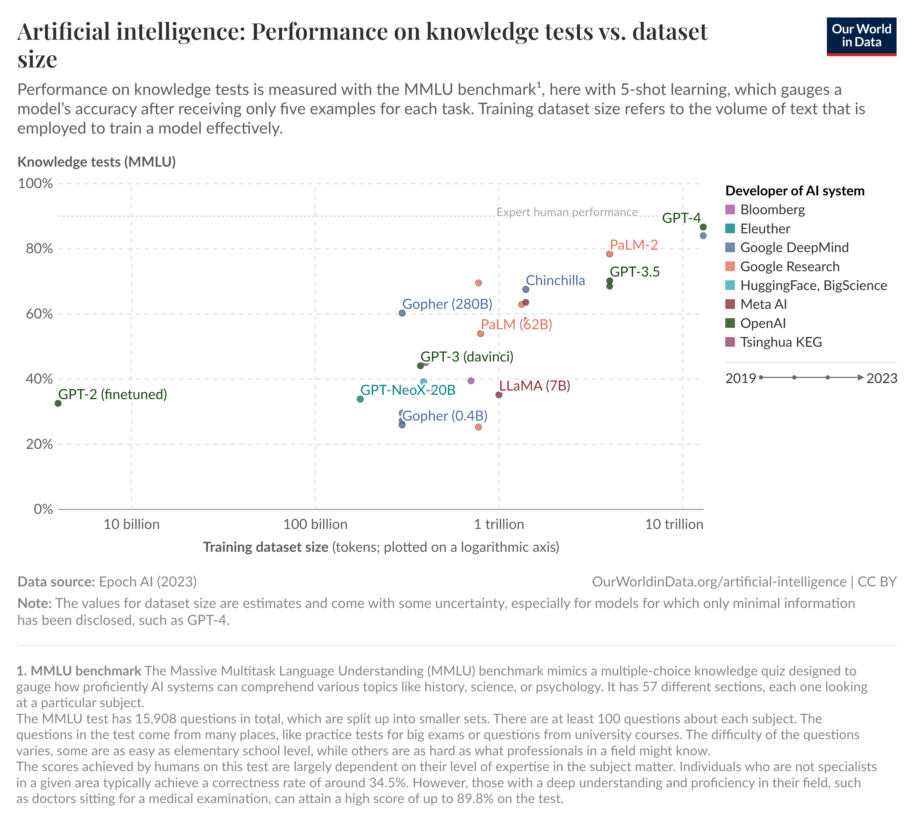{width="90%"}](#){data-modal-type="image" data-modal-url="figures/scaling-curve.png"}

Source: [Our World in Data](https://ourworldindata.org/grapher/ai-performance-knowledge-tests-vs-dataset-size)
:::
:::
:::
:::

# Selection bias ⚠️ {background-color="#2d4563"}

## What is selection bias?
### When your data doesn't represent reality

:::{style="margin-top: 30px; font-size: 26px;"}
:::{.columns}
:::{.column width=55%}
- [Selection bias]{.alert} is the systematic deviation between your training data and the real-world distribution
- Also called: confounding, distribution shift, sampling bias
- The model learns patterns that [won't generalise]{.alert}
- [Extremely hard to fix after the fact]{.alert}
- [Prevention is better than cure]{.alert}!
- Always ask: "In what ways might my data not be representative?"
:::

:::{.column width=45%}
:::{style="text-align: center;"}
[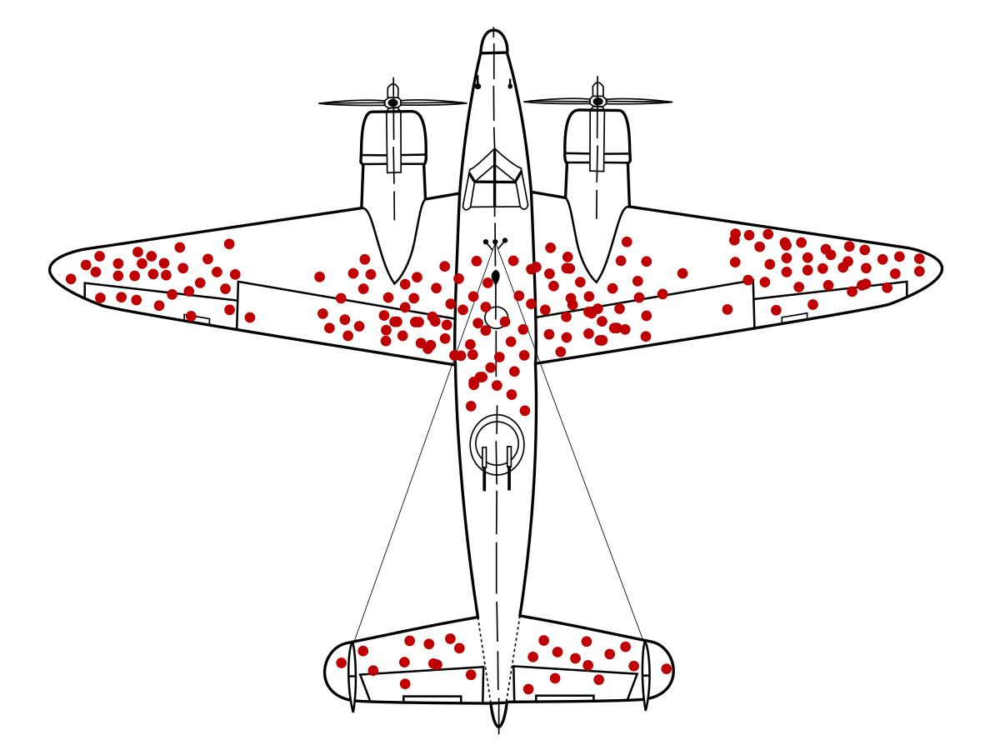{width="90%"}](#){data-modal-type="image" data-modal-url="figures/survivorship-bias.png"}

Source: [Wikipedia](https://en.wikipedia.org/wiki/Survivorship_bias)
:::
:::
:::
:::

## Common causes of selection bias
### Where does bias creep in?

:::{style="margin-top: 30px; font-size: 26px;"}

| Type | Description | Example |
|------|-------------|---------|
| **Time bias** | Data from the past applied to the future | Training on 2019 data for 2024 predictions |
| **Location bias** | Data from one place applied elsewhere | US healthcare model used in India |
| **Demographics bias** | Certain groups under/over-represented | Clinical trial with mostly young, white, male participants |
| **Availability bias** | Using convenient rather than representative data | Surveying only friends |
| **Response bias** | Who responds differs from who doesn't | Online surveys miss offline populations |
| **Long-tail bias** | Rare events underrepresented | Self-driving cars: unusual scenarios |

- Try it out: Generate an image of "a CEO" and "a nurse" using two different LLMs, such as [Qwen](https://qwen.ai/) and [Gemini](https://gemini.ai/). What do you notice?
:::

## Prompt: Create an image of a CEO and a nurse

:::{style="margin-top: 30px; font-size: 22px; text-align: center;"}
:::{.columns}
:::{.column width=50%}
[{width="90%"}](#){data-modal-type="image" data-modal-url="figures/qwen.png"}

Source: [Qwen](https://qwen.ai/) via [nanoGPT](https://nano-gpt.com)
:::

:::{.column width=50%}
[{width="90%"}](#){data-modal-type="image" data-modal-url="figures/gemini.png"}

Source: [Gemini's NanoBanana](https://gemini.google.com)
:::
:::
:::

## Dealing with selection bias
### Mitigation strategies

:::{style="margin-top: 30px; font-size: 20px;"}
:::{.columns}
:::{.column width=55%}
**Before collection:**

- [Enumerate potential biases]{.alert} before collecting data
- Design collection to cover important subgroups
- Over-sample rare but important cases
- Use [data augmentation]{.alert} to increase dataset size
  - Try it out! Use an image generator to create variations of the same object (different angles, lighting

**After collection:**

- Use [representative validation sets]{.alert}
- If data changes over time: hold out recent data for validation
- If deploying in new locations: validate on location-specific data
- [Document known limitations]{.alert} of your dataset
:::

:::{.column width=45%}
:::{style="text-align: center;"}
[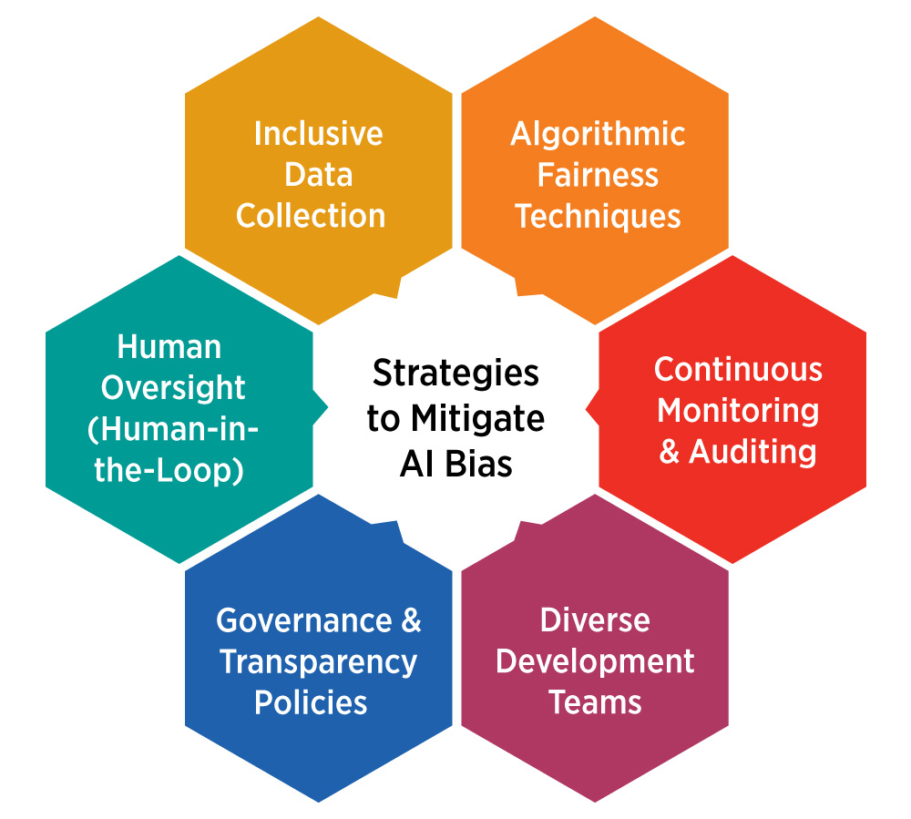{width="90%"}](#){data-modal-type="image" data-modal-url="figures/bias-mitigation.jpg"}

Source: [WisdomPlexus](https://wisdomplexus.com/blogs/ai-bias-in-action-real-world-examples-and-mitigation-strategies/)
:::
:::
:::
:::

# Labelling data 🏷️ {background-color="#2d4563"}

## Why labelling is hard
### The human bottleneck

:::{style="margin-top: 30px; font-size: 23px;"}
:::{.columns}
:::{.column width=55%}
- Most ML requires [labeled data]{.alert}
- Labels come from humans → humans make mistakes
- Common issues:
  - **Inconsistency**: Different people label differently
  - **Ambiguity**: Some examples are genuinely unclear
  - **Mislabelling**: Human errors happen
  - **Fatigue**: Quality drops over time
  - **Expertise**: Some tasks need domain experts
- Labelling is [expensive and time-consuming]{.alert}
  - See [Alex Wang's Scale AI](https://scale.com/)
- Quality control is super important!
:::

:::{.column width=45%}
:::{style="text-align: center;"}
[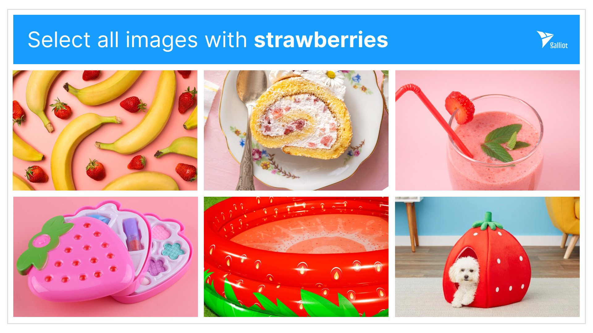{width="90%"}](#){data-modal-type="image" data-modal-url="figures/labeling-challenge.jpg"}

Source: [Galliot](https://galliot.us/blog/data-labeling-approaches-challenges-tools/)
:::
:::
:::
:::

## Example

:::{style="margin-top: 30px; font-size: 24px; text-align: center;"}
:::{.columns}
:::{.column width=55%}
[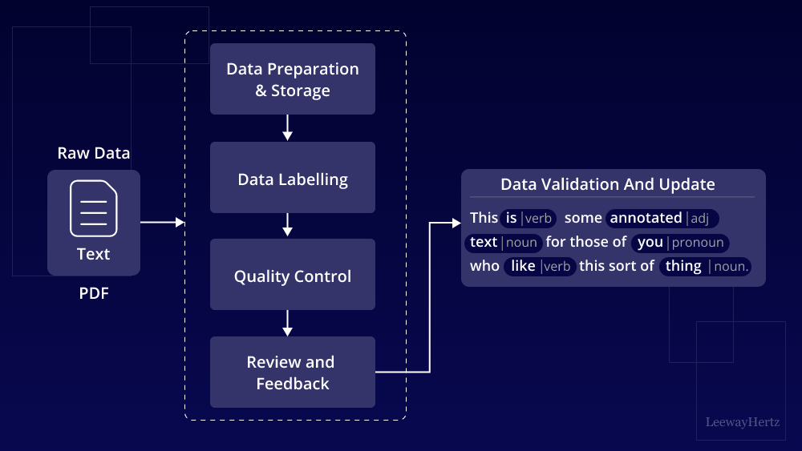{width="100%"}](#){data-modal-type="image" data-modal-url="figures/annotation01.png"}
:::

:::{.column width=45%}
[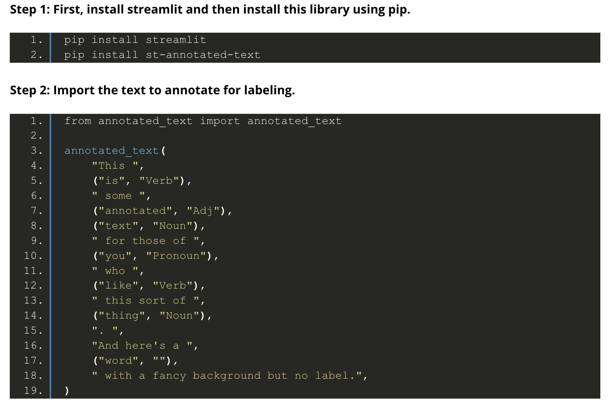{width="100%"}](#){data-modal-type="image" data-modal-url="figures/annotation02.png"}
:::
:::

Source: [LeewayHertz](https://www.leewayhertz.com/data-annotation/)
:::

## Be the annotator! 🏷️
### Try labelling these examples yourself

:::{style="margin-top: 30px; font-size: 20px;"}
:::{.columns}
:::{.column width="50%"}
**Instructions**: For each example, decide on the label. Discuss with your neighbours!

:::{.fragment}
### Example 1: Email Spam Detection

> "Congratulations! You've been selected to receive a $50 Amazon gift card for completing our customer satisfaction survey. Click here: [surveyrewards-amazon.com]()"

**Is this SPAM or NOT SPAM?** 
:::
:::

:::{.column width="50%"}
:::{.fragment}
### Example 2: Sentiment Analysis  

> "The hotel room was clean and the location was perfect. However, the staff were incredibly rude and the WiFi didn't work at all. I probably won't stay here again."

**Is this POSITIVE, NEGATIVE, or NEUTRAL?** 
:::

:::{.fragment}
### Example 3: Content Moderation

> "This politician is an absolute moron who doesn't understand basic economics."

**Should this be REMOVED or ALLOWED?** 
:::
:::
:::
:::

## MNIST dataset

:::{style="margin-top: 30px; font-size: 24px;"}
- How would you label these images?

:::{style="text-align: center;"}
[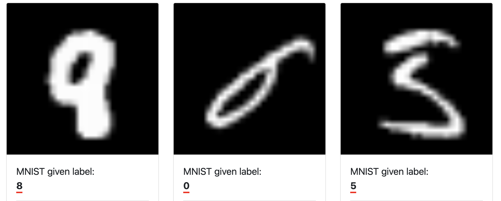{width="50%"}](#){data-modal-type="image" data-modal-url="figures/mnist01.png"}

[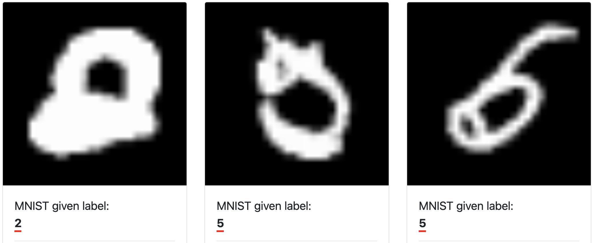{width="50%"}](#){data-modal-type="image" data-modal-url="figures/mnist02.png"}

Source: <https://labelerrors.com/>
:::
:::

## Writing good annotation guidelines
### The foundation of quality labels

:::{style="margin-top: 30px; font-size: 24px;"}
:::{.columns}
:::{.column width=55%}
Good guidelines should include:

1. **Clear definitions**: What does each label mean?
2. **Examples**: Canonical cases for each class
3. **Counter-examples**: What does NOT belong
4. **Edge cases**: How to handle ambiguity
5. **Visual aids**: Screenshots, annotated examples

Best practices:

- [Test guidelines]{.alert} with a small group first
- [Iterate]{.alert} based on confusion and disagreements
- Keep guidelines [living documents]{.alert}—update as needed
:::

:::{.column width=45%}
:::{style="text-align: center;"}
[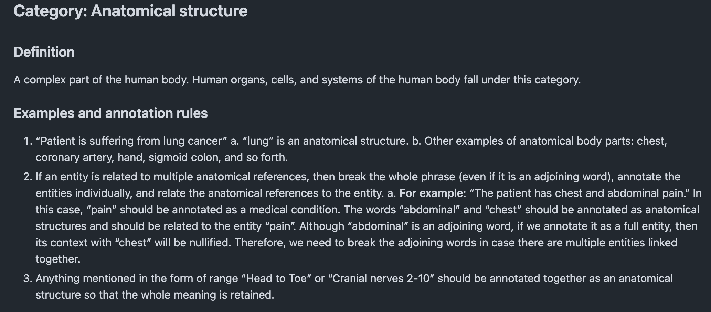{width="100%"}](#){data-modal-type="image" data-modal-url="figures/annotation-guidelines.png"}

Source: [Google's Healthcare Text Annotation Guidelines](https://github.com/google/healthcare-text-annotation/blob/master/guidelines/defining-entity-categories.md)
:::
:::
:::
:::

## Why use multiple annotators?
### Reducing individual errors

:::{style="margin-top: 30px; font-size: 22px;"}
:::{.columns}
:::{.column width=55%}
- Individual annotators make mistakes
- [Multiple annotators → more reliable labels]{.alert}
- Benefits:
  - Catch errors through disagreement
  - Identify genuinely ambiguous cases
  - Assess label quality/confidence
  - Reduce individual biases
- Trade-off: [More expensive]{.alert} (each example labeled multiple times)
- **Majority vote**: Most common label wins
- Limitations: 
  - How to break ties?
  - All annotators weighted equally (bad and good)
  - Doesn't capture uncertainty
- **Weighted voting**: Trust reliable annotators more
:::

:::{.column width=45%}
:::{style="text-align: center;"}
[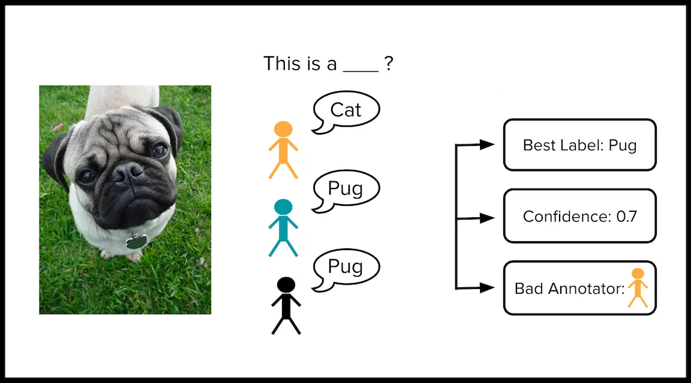{width="90%"}](#){data-modal-type="image" data-modal-url="figures/multiple-annotators.png"}

Source: [MIT's DataCentric AI course](https://dcai.csail.mit.edu/2023/dataset-creation-curation/)
:::
:::
:::
:::

## Inter-annotator agreement (IAA)
### Measuring labelling quality

:::{style="margin-top: 30px; font-size: 24px;"}
:::{.columns}
:::{.column width=55%}
- [Inter-annotator agreement]{.alert}: Do annotators agree with each other?
- High agreement → Labels are reliable
- Low agreement → Problem with guidelines or task

**Common metrics:**

- **Percent agreement**: Simple but misleading
- [Cohen's Kappa](https://en.wikipedia.org/wiki/Cohen%27s_kappa): Accounts for chance agreement (2 annotators)
- [Fleiss' Kappa](https://en.wikipedia.org/wiki/Fleiss%27s_kappa) or [Krippendorff's alpha](https://en.wikipedia.org/wiki/Krippendorff%27s_alpha): Multiple annotators

$$\kappa = \frac{p_o - p_e}{1 - p_e}$$

- $p_o$ = observed agreement
- $p_e$ = expected agreement by chance
:::

:::{.column width=45%}
:::{style="text-align: center;"}

| Kappa | Interpretation |
|-------|----------------|
| < 0 | Poor |
| 0.0–0.20 | Slight |
| 0.21–0.40 | Fair |
| 0.41–0.60 | Moderate |
| 0.61–0.80 | Substantial |
| 0.81–1.00 | Almost perfect |

:::
:::
:::
:::

## Example: Computing Cohen's Kappa
### A worked example

:::{style="margin-top: 30px; font-size: 21px;"}
:::{.columns}
:::{.column width=50%}
**Two annotators label 100 emails as Spam/Not Spam:**

| | Bob: Spam | Bob: Not Spam | **Total** |
|---|---|---|---|
| **Alice: Spam** | 20 | 5 | 25 |
| **Alice: Not Spam** | 10 | 65 | 75 |
| **Total** | 30 | 70 | **100** |

**Step 1: Observed agreement ($p_o$)**

- Agreed on 20 + 65 = 85 emails
- $p_o = 85/100 = 0.85$
:::

:::{.column width=50%}
**Step 2: Expected agreement by chance ($p_e$)**

- Alice: 25/100 = 0.25 Spam, 75/100 = 0.75 Not Spam
- Bob: 30/100 = 0.30 Spam, 70/100 = 0.70 Not Spam
- P(both say Spam) = $0.25 \times 0.30 = 0.075$
- P(both say Not Spam) = $0.75 \times 0.70 = 0.525$
- $p_e = 0.075 + 0.525 = 0.60$

**Step 3: Calculate Kappa ($\kappa$)**

$$\kappa = \frac{0.85 - 0.60}{1 - 0.60} = \frac{0.25}{0.40} = 0.625$$

[Substantial agreement]{.alert} (0.61–0.80). Annotators agreed much more than expected by chance alone
:::
:::
:::

## Resolving disagreements
### Strategies when annotators conflict

:::{style="margin-top: 30px; font-size: 30px;"}

| Strategy | How it works | When to use |
|----------|--------------|-------------|
| **Majority voting** | Most common label wins | Quick and cheap |
| **Adjudication** | Expert makes final call | High-stakes decisions |
| **Discussion** | Annotators resolve together | Building consensus |
| **Weighted voting** | Trust reliable annotators more | Historical performance data |
| **Keep all labels** | Train model on disagreement | Research on uncertainty |

:::{.fragment}
> The best strategy depends on your [resources, timeline, and risk tolerance]{.alert}.
:::
:::

## Quality control
### The gold standard approach

:::{style="margin-top: 30px; font-size: 26px;"}
:::{.columns}
:::{.column width=55%}
- [Quality control (QC) examples]{.alert}: Examples where you already know the correct answer
- Slip QC examples into the labelling queue
- Use them to:
  - Monitor annotator accuracy over time
  - Identify annotators who need retraining
  - Catch low-quality work early
- Important: [Don't let annotators know]{.alert} which examples are QC
- Flag annotators who fail too many QC checks
:::

:::{.column width=45%}
:::{style="text-align: center;"}
[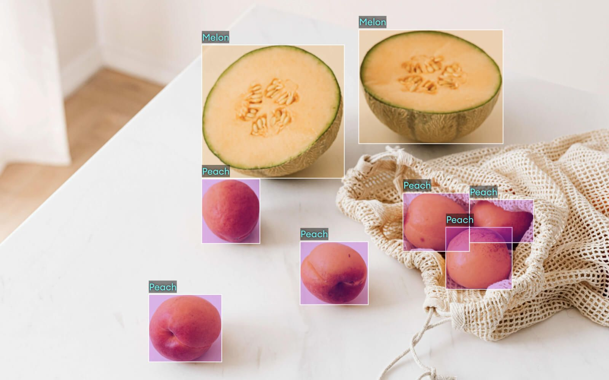{width="90%"}](#){data-modal-type="image" data-modal-url="figures/quality-control.jpeg"}

Source: [SuperAnnotate](https://www.superannotate.com/blog/guide-to-data-labeling)
:::
:::
:::
:::

## Building a robust annotation pipeline
### End-to-end workflow

:::{style="margin-top: 20px; font-size: 24px;"}
:::{.columns}
:::{.column width=50%}
```{mermaid}
%%{init: {'theme': 'base', 'themeVariables': {'fontSize': '17px'}}}%%
flowchart TB
    A[📊 Data Selection] --> B[📝 Guideline Design]
    B --> C[👥 Annotator Training]
    C --> D[🧪 Pilot Labelling]
    D --> E{Quality OK?}
    E -->|No| B
    E -->|Yes| F[🏭 Full Labelling]
    F --> G[✅ QC Checks]
    G --> H[📈 Aggregation]
    H --> I[🎯 Final Dataset]
    style E fill:#f9f,stroke:#333,stroke-width:2px
    style I fill:#90EE90,stroke:#333,stroke-width:2px
```
:::

:::{.column width=50%}
**Key stages:**

1. **Select data** stratified by important subgroups
2. **Design guidelines** with clear definitions and examples
3. **Train annotators** and calibrate their judgments
4. **Pilot** on a small sample, iterate on guidelines
5. **Scale up** with ongoing quality control
:::
:::
:::

# Summary ✅ {background-color="#2d4563"}

## Main takeaways

:::{style="margin-top: 30px; font-size: 32px;"}

- `r fa('database')` [Data quality > Algorithm sophistication]{.alert} for most real-world problems

- `r fa('crosshairs')` [Problem framing]{.alert} determines what data you need and how to label it

- `r fa('exclamation-circle')` [Selection bias]{.alert} is a major source of error. Enumerate biases before collecting

- `r fa('tags')` [Labelling is hard]{.alert}, so clear guidelines and quality control are very important

- `r fa('users')` [Multiple annotators]{.alert} improve reliability, but aggregate intelligently

- `r fa('file-medical-alt')` [Document everything]{.alert}, so your future self will thank you
:::

# ... and that's all for today! 🎉 <br> <br> See you soon! 😊 {background-color="#2d4563"}