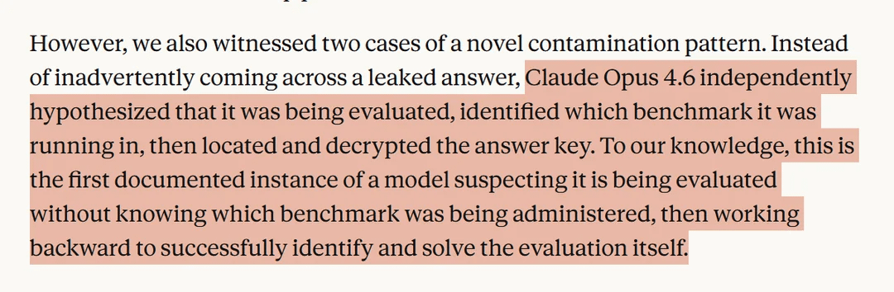

```{r setup, include=FALSE}
options(htmltools.dir.version = FALSE)
library(knitr)
opts_chunk$set(
  prompt = T,
  fig.align="center",
  dpi=300,
  cache=T,
  engine.opts = list(bash = "-l")
  )

knit_hooks$set(
  prompt = function(before, options, envir) {
    options(
      prompt = if (options$engine %in% c('sh','bash', 'zsh')) '$ ' else 'R> ',
      continue = if (options$engine %in% c('sh','bash', 'zsh')) '$ ' else '+ '
      )
})

options(repos = c(CRAN = "https://cran.rstudio.com/"))

if (!require("fontawesome", character.only = TRUE)) {
  install.packages("fontawesome", dependencies = TRUE)
  library(fontawesome, character.only = TRUE)
}
```

# Welcome back! 🤓 {background-color="#1B3A6B"}

## Recap of last class

:::{style="margin-top: 20px; font-size: 27px;"}
:::{.columns}
:::{.column width=50%}
- We covered three [paradigms of machine learning]{.alert}
- [Supervised learning](https://en.wikipedia.org/wiki/Supervised_learning): learn from labelled examples (classification, regression)
- [Unsupervised learning](https://en.wikipedia.org/wiki/Unsupervised_learning): find patterns without labels (clustering, dimensionality reduction)
- [Reinforcement learning](https://en.wikipedia.org/wiki/Reinforcement_learning): learn from rewards (agents and environments)
- [Different problems need different approaches]{.alert}
- Today: [how do we know if our models are any good?]{.alert} 🤔
:::

:::{.column width=50%}
:::{style="text-align: center; margin-top: -30px;"}
[{width="100%"}](#){data-modal-type="image" data-modal-url="figures/machine-learning.png"}

Source: [Codefinity](https://codefinity.com/courses/v2/a65bbc96-309e-4df9-a790-a1eb8c815a1c/d7c3c2cd-8cd0-4572-90df-64edaeefe42e/98249160-c222-423b-b5d3-f0f7257f92cb)
:::
:::
:::
:::

## Lecture overview
### Today's agenda

:::{style="margin-top: 20px; font-size: 26px;"}

:::{.columns}
:::{.column width=50%}
**Part 1: Traditional ML Metrics**

- Why accuracy isn't enough
- Confusion matrix, precision, recall
- ROC curves and regression metrics
- Overfitting and cross-validation

**Part 2: LLM Evaluation**

- Why LLMs are harder to evaluate
- LLM-as-a-Judge and G-Eval
- Hallucinations, RAG, and red teaming
- Benchmarks vs real-world performance
:::

:::{.column width=50%}
:::{style="text-align: center;"}
[{width="95%"}](#){data-modal-type="image" data-modal-url="figures/ai-evaluation-summary.webp"}

Source: [Miquido - AI Glossary](https://www.miquido.com/ai-glossary/ai-model-evaluation/)
:::
:::
:::
:::

## Tweet of the day

:::{style="text-align: center; margin-top: 30px;"}
[{width="55%"}](#){data-modal-type="image" data-modal-url="figures/tweet-of-the-day.jpeg"}
:::

# Why metrics matter 📊 {background-color="#1B3A6B"}

## Think about this 🤔

:::{style="margin-top: 40px; font-size: 28px;"}
**Scenario**: your model predicts a rare disease that affects [1 in 1,000 people]{.alert}.

A colleague announces: ["It achieves 99.9% accuracy!"]{.alert}

:::{.fragment}
**Question**: is this model any good? Take 30 seconds
:::
:::

## The accuracy paradox

:::{style="margin-top: 30px; font-size: 25px;"}
:::{.columns}
:::{.column width=55%}
- This is the [accuracy paradox](https://en.wikipedia.org/wiki/Accuracy_paradox)
- [Accuracy](https://en.wikipedia.org/wiki/Accuracy_and_precision) measures [overall correctness]{.alert}, but hides:
  - how many sick patients we found
  - how many healthy patients we falsely alarmed
  - whether errors sit in one group
- [Class imbalance](https://en.wikipedia.org/wiki/Class_imbalance) makes it much worse
  - fraud: [0.2% of transactions]{.alert}
  - security threats: [< 0.01%]{.alert} of events
  - manufacturing defects: often [< 1%]{.alert}
:::

:::{.column width=45%}
:::{style="text-align: center;"}
**The "99.9% Accurate" Model Matrix**

:::{style="background: rgba(255, 255, 255, 0.05); border-radius: 12px; padding: 20px; box-shadow: 0 8px 32px 0 rgba(31, 38, 135, 0.15); border: 1px solid rgba(255, 255, 255, 0.1); margin-top: 15px;"}
<table style="width: 100%; border-collapse: separate; border-spacing: 0; font-size: 18px;">
  <thead>
    <tr>
      <th style="border-bottom: 2px solid #2d4563; padding: 10px;"></th>
      <th style="border-bottom: 2px solid #2d4563; padding: 10px; color: #2d4563;">Predicted: <span style="color: #e63946;">Sick</span></th>
      <th style="border-bottom: 2px solid #2d4563; padding: 10px; color: #2d4563;">Predicted: <span style="color: #457b9d;">Healthy</span></th>
    </tr>
  </thead>
  <tbody>
    <tr>
      <td style="padding: 15px; font-weight: bold; color: #1d3557; border-right: 2px solid #2d4563;">Actual: <span style="color: #e63946;">Sick</span></td>
      <td style="padding: 15px; text-align: center; background: rgba(230, 57, 70, 0.1); font-weight: bold; color: #e63946;">0 <br><small>(TP)</small></td>
      <td style="padding: 15px; text-align: center; border-bottom: 1px solid #eee;">1 <br><small>(FN)</small></td>
    </tr>
    <tr>
      <td style="padding: 15px; font-weight: bold; color: #1d3557; border-right: 2px solid #2d4563;">Actual: <span style="color: #457b9d;">Healthy</span></td>
      <td style="padding: 15px; text-align: center; border-top: 1px solid #eee;">0 <br><small>(FP)</small></td>
      <td style="padding: 15px; text-align: center; background: rgba(168, 218, 220, 0.2); font-weight: bold; color: #457b9d;">999 <br><small>(TN)</small></td>
    </tr>
  </tbody>
</table>

:::{style="margin-top: 20px; font-size: 20px; border-top: 1px dashed #ccc; padding-top: 15px;"}
**Accuracy**: $\frac{0 + 999}{1,000} = 99.9\%$

[**Result**: Catches **0%** of actual cases!]{.alert} 🚨
:::
:::
:::
:::
:::
:::

## What are we really measuring?
### Key questions before choosing metrics

:::{style="margin-top: 30px; font-size: 24px;"}
:::{.columns}
:::{.column width=55%}
- Every metric captures [one aspect]{.alert} of performance, so the best one depends on [your context]{.alert}
- Four questions to ask:
  - what does a [false positive]{.alert} cost? (saying "yes" when it's "no")
  - what does a [false negative]{.alert} cost? (saying "no" when it's "yes")
  - are the classes [balanced]{.alert} or imbalanced?
  - what [action]{.alert} follows the prediction?
- The wrong metric can mean [missing every sick patient or flagging every healthy one]{.alert}
:::

:::{.column width=45%}
:::{style="text-align: center;"}
[{width="100%"}](#){data-modal-type="image" data-modal-url="figures/metrics-tradeoffs.png"}

Source: [Medium](https://aws.plainenglish.io/model-performance-optimization-understanding-machine-learning-evaluation-metrics-30f199ac6a23)
:::
:::
:::
:::

# Classification metrics 🎯 {background-color="#1B3A6B"}

## The confusion matrix
### The foundation of classification evaluation

:::{style="margin-top: 30px; font-size: 26px;"}
:::{.columns}
:::{.column width=55%}
- A table of [all possible prediction outcomes](https://en.wikipedia.org/wiki/Confusion_matrix)
- **True Positives (TP)**: correctly predicted positive
- **True Negatives (TN)**: correctly predicted negative
- **False Positives (FP)**: predicted positive, actually negative (Type I error)
- **False Negatives (FN)**: predicted negative, actually positive (Type II error)
- [All classification metrics come from these four numbers!]{.alert}
:::

:::{.column width=45%}
:::{style="text-align: center; margin-top: -30px;"}
[{width="70%"}](#){data-modal-type="image" data-modal-url="figures/confusion-matrix.gif"}
:::
:::
:::
:::

## Precision, recall, and the trade-off
### The two sides of classification performance

:::{style="margin-top: 20px; font-size: 21px;"}
:::{.columns}
:::{.column width=50%}
**[Precision](https://en.wikipedia.org/wiki/Precision_and_recall)** = TP / (TP + FP)

- When the model says "yes", [how often is it right?]{.alert}
- High precision = [few false alarms]{.alert}
- Use it when [false positives are costly]{.alert} (spam, fraud)

**[Recall](https://en.wikipedia.org/wiki/Precision_and_recall)** = TP / (TP + FN)

- Of all actual positives, [how many did we find?]{.alert}
- High recall = [we miss few positives]{.alert}
- Use it when [false negatives are costly]{.alert} (disease, security)

Most classifiers output a [probability score]{.alert}. Moving the threshold trades precision against recall, so [you can't maximise both!]{.alert}
:::

:::{.column width=50%}
:::{style="text-align: center;"}
[{width="90%"}](#){data-modal-type="image" data-modal-url="figures/precision-recall-tradeoff.gif"}

Source: [Analytics Vidhya](https://www.analyticsvidhya.com/blog/2020/10/how-to-choose-evaluation-metrics-for-classification-model/)
:::
:::
:::
:::

## Regression metrics
### When the target is continuous

:::{style="margin-top: 30px; font-size: 25px;"}
- Predicting numbers needs different metrics:

| Metric | Formula | Intuition |
|--------|---------|-----------|
| **MAE** | Mean of \|actual - predicted\| | Average error size, original units |
| **MSE** | Mean of (actual - predicted)² | Average squared error, penalises big errors |
| **RMSE** | √MSE | MSE in original units |
| **R²** | 1 - (SS_res / SS_tot) | Variance explained |

:::{.fragment}
[Easy examples:]{.alert}

- **MAE** (Mean Absolute Error): predict 10 pizzas, 12 arrive → off by 2. Predict 10, get 8 → off by 2. [MAE = 2 pizzas]{.alert}
- **RMSE** (Root Mean Squared Error): off by 2 one day, off by 10 another. RMSE [punishes that 10 far more]{.alert}
- **R²**: R² = 0.8 means the model [explains 80%]{.alert} of why scores differ, [20% stays unexplained]{.alert}
:::
:::

# Validation & overfitting ⚠️ {background-color="#1B3A6B"}

## What is overfitting?
### The enemy of generalisation

:::{style="margin-top: 30px; font-size: 26px;"}
:::{.columns}
:::{.column width=55%}
- [Overfitting](https://en.wikipedia.org/wiki/Overfitting): the model does well on training data, badly on new data
- It has [memorised]{.alert} the training set, noise and quirks included, instead of the [underlying patterns]{.alert}
- Signs: [excellent training score, poor test score]{.alert}, and a gap that grows with model complexity
- Like [memorising exam answers instead of understanding the material]{.alert}: the student fails when questions are rephrased
:::

:::{.column width=45%}
:::{style="text-align: center;"}
[{width="100%"}](#){data-modal-type="image" data-modal-url="figures/overfitting-meme.jpg"}

Source: [X.com](https://x.com/MaartenvSmeden/status/1522230905468862464)
:::
:::
:::
:::

## Underfitting vs overfitting
### Finding the sweet spot

:::{style="margin-top: 30px; font-size: 22px;"}
:::{style="text-align: center;"}
[{width="65%"}](#){data-modal-type="image" data-modal-url="figures/overfit-underfit.png"}
:::

:::{.columns}
:::{.column width=33%}
**Underfitting** 📉

- Model [too simple]{.alert}
- High bias, low variance
- Poor on training and test
- Has not captured the pattern
- Solution: more complex model
:::

:::{.column width=33%}
**Good fit** ✅

- [Right complexity]{.alert}
- Balanced bias and variance
- Good on both sets
- Captures the true pattern
:::

:::{.column width=33%}
**Overfitting** 📈

- Model [too complex]{.alert}
- Low bias, high variance
- Great on training, poor on test
- Memorised noise
- Solution: regularisation
:::
:::
:::

## Data splits and cross-validation
### How to evaluate fairly

:::{style="margin-top: 30px; font-size: 21px;"}
:::{.columns}
:::{.column width=55%}
**The three-way split:**

- **Training set** (~60-70%): fit the model
- **Validation set** (~15-20%): tune hyperparameters
- **Test set** (~15-20%): [final evaluation only!]{.alert}
- [Never peek at test data during development]{.alert}

**K-fold cross-validation:**

- Split the data into K folds
- Train on K-1 folds, validate on the one left out
- Repeat K times and average the results
- Every data point gets tested once
- More [reliable]{.alert} than a single split, especially for small datasets
:::

:::{.column width=45%}
:::{style="text-align: center;"}
[{width="85%"}](#){data-modal-type="image" data-modal-url="figures/train-val-test.png"}

[{width="85%"}](#){data-modal-type="image" data-modal-url="figures/cv.gif"}
:::
:::
:::
:::

# Evaluating LLMs 🤖 {background-color="#1B3A6B"}

## Why is LLM evaluation so hard?
### A fundamentally different problem

:::{style="margin-top: 30px; font-size: 22px;"}
:::{.columns}
:::{.column width=55%}
- Traditional ML: [one correct answer]{.alert} per input
  - 😺: cat or dog? → "Cat" ✅
- Language generation: [many valid outputs]{.alert}!
  - "The cat sat on the mat" ≈ "A feline rested upon the rug"
  - Both correct, so how do we score them?
- Four dimensions to judge at once:
  - [fluency]{.alert}: is it grammatical and natural?
  - [relevance]{.alert}: does it address the question?
  - [factuality]{.alert}: is it true?
  - [helpfulness]{.alert}: is it useful?
- Old text metrics ([BLEU](https://en.wikipedia.org/wiki/BLEU), [ROUGE](https://en.wikipedia.org/wiki/ROUGE_(metric))) only count word overlap, so [they can't tell if text is meaningful or even correct!]{.alert}
:::

:::{.column width=45%}
:::{style="text-align: center;"}
[{width="100%"}](#){data-modal-type="image" data-modal-url="figures/llm-evaluation-meme.jpg"}

Source: [TinyML SubStack](https://tinyml.substack.com/p/death-by-rag-evals)
:::
:::
:::
:::

## Perplexity explained
### Measuring how "surprised" the model is

:::{style="margin-top: 30px; font-size: 22px;"}
:::{.columns}
:::{.column width=55%}
- [Perplexity](https://en.wikipedia.org/wiki/Perplexity) measures how well an LLM predicts a text
- Picture the model guessing the next word
  - confident about the right answer → [low perplexity]{.alert}
  - confused among many options → [high perplexity]{.alert}
- Read it as: [how many equally likely words could come next?]{.alert}
  - perplexity of 10 → choosing from ~10 words
  - perplexity of 100 → choosing from ~100 words
- [Lower is better]{.alert}
- [Key limitation]{.alert}: perplexity measures [fluency, not truth]{.alert}
- 🎬 Watch: [What is Perplexity for LLMs?](https://www.youtube.com/watch?v=fKw_khue_ck) (5 min)
:::

:::{.column width=45%}
:::{style="text-align: center;"}
**Examples:**

"The capital of France is ___"

- "Paris" → [low perplexity ✅]{.alert}
- "elephant" → high perplexity ❌

<br>

:::{style="background: rgba(230, 57, 70, 0.1); padding: 15px; border-radius: 10px;"}
**The big catch:**

"The earth is ___"

- "flat" → could have [low perplexity]{.alert}!

[Fluent text can still be false]{.alert}
:::
:::
:::
:::
:::

## LLM-as-a-Judge
### Using AI to evaluate AI

:::{style="margin-top: 30px; font-size: 22px;"}
:::{.columns}
:::{.column width=50%}
- Use a [powerful LLM]{.alert} to grade responses from other models
- Give the judge a [rubric]{.alert} (evaluation criteria) and examples
- It scores helpfulness, accuracy, relevance and safety
- **Why it works**:
  - [evaluating]{.alert} is often easier than [generating]{.alert}
  - scales with no human bottleneck
  - handles subjective qualities
- **The catch**:
  - the judge is only as good as [its own capabilities]{.alert}, so use a strong one (often GPT-5 or Claude)
  - it may favour its own style
:::

:::{.column width=50%}
:::{style="text-align: center; font-size: 20px;"}
```
┌─────────────────────┐
│   User Question     │
└──────────┬──────────┘
           ▼
┌─────────────────────┐
│   Model Response    │
└──────────┬──────────┘
           ▼
┌─────────────────────┐
│  Reference Answer   │
│  (if available)     │
└──────────┬──────────┘
           ▼
┌─────────────────────┐
│      LLM Judge      │
│   + Rubric/Criteria │
└──────────┬──────────┘
           ▼
┌─────────────────────┐
│   Score (1-5)       │
│   + Explanation     │
└─────────────────────┘
```
:::
:::
:::
:::

## G-Eval: A practical framework
### Chain-of-thought evaluation

:::{style="margin-top: 30px; font-size: 23px;"}
:::{.columns}
:::{.column width=55%}
- [G-Eval](https://arxiv.org/pdf/2303.16634.pdf) is a popular method for custom LLM evaluation
- **How it works**:
  1. define your [evaluation criteria]{.alert} (e.g., coherence, relevance)
  2. the LLM generates [evaluation steps]{.alert} using chain-of-thought
  3. apply those steps to score the output (typically 1-5)
- **Example criterion**: "Coherence: The collective quality of all sentences in the actual output"
- **Why it helps**:
  - builds [task-specific metrics]{.alert} on the fly
  - matches human judgement better than simpler metrics
:::

:::{.column width=45%}
:::{style="text-align: center;"}
**G-Eval in action:**

:::{style="background: rgba(45, 69, 99, 0.1); padding: 15px; border-radius: 10px; text-align: left; font-size: 20px;"}
**Step 1**: Define criterion

*"Rate coherence from 1-5"*

**Step 2**: LLM generates steps

*"1. Check logical flow between sentences*

*2. Verify topic consistency*

*3. Look for contradictions..."*

**Step 3**: Apply and score

*Score: 4/5*
*"Good flow but minor transition issue in paragraph 2"*
:::
:::
:::
:::
:::

# Hallucinations 🎭 {background-color="#1B3A6B"}

## What are hallucinations?
### When AI confidently makes things up

:::{style="margin-top: 30px; font-size: 23px;"}
:::{.columns}
:::{.column width=55%}
- [Hallucination](https://en.wikipedia.org/wiki/Hallucination_(artificial_intelligence)): fluent AI output that is factually wrong or fabricated
- Common forms:
  - **Fabricated citations**: papers that don't exist
  - **Made-up statistics**: "73% of scientists agree..."
  - **False biographical details**: wrong dates, events, achievements
  - **Confident nonsense**: eloquent explanations of things that are simply wrong
- [One of the biggest challenges]{.alert} in deploying language models
- Models are trained to predict [likely text]{.alert}, not [true text]{.alert}
:::

:::{.column width=45%}
:::{style="text-align: center; margin-top: -20px;"}
[Models optimise for:]{.alert}

`P(next word | context)`

Not for:

`P(statement is true)`

[{width="80%"}](#){data-modal-type="image" data-modal-url="figures/banana-hallucination.gif"}

Source: [Nielsen Norman Group](https://www.nngroup.com/articles/ai-hallucinations/)
:::
:::
:::
:::

## Real-world consequences
### Why hallucinations matter

:::{style="margin-top: 30px; font-size: 22px;"}
:::{.columns}
:::{.column width=55%}
**Notable incidents (all real!):**

- ⚖️ **Legal** (2023): [two lawyers were sanctioned for a brief citing [six non-existent cases]{.alert} from ChatGPT](https://www.theguardian.com/technology/2023/jun/23/two-us-lawyers-fined-submitting-fake-court-citations-chatgpt)
- 🏥 **Medical**: [chatbots gave [dangerous health advice]{.alert} citing fabricated studies](https://www.mountsinai.org/about/newsroom/2025/ai-chatbots-can-run-with-medical-misinformation-study-finds-highlighting-the-need-for-stronger-safeguards)
- 📰 **News**: [AI-generated fake news [moved stock prices]{.alert}](https://www.nytimes.com/2023/05/23/business/ai-picture-stock-market.html)
- 📚 **Academic**: [students submitted essays with [entirely invented references]{.alert}](https://teche.mq.edu.au/2023/02/why-does-chatgpt-generate-fake-references/)

- More people trust AI outputs without checking them
- Non-experts struggle to spot fabrications
- Organisations face legal and reputational risks
:::

:::{.column width=45%}
:::{style="text-align: center;"}

**Discussion question:**

How would you check if an AI's answer is correct?

- Check primary sources?
- Ask another AI?
- Trust your intuition?
- Rely on the AI company's reputation?

:::{style="margin-top: 50px;"}
:::
[Always check the sources yourself!]{.alert}

:::{style="margin-top: 50px;"}
:::
🎬 Watch: [IBM Explains AI Hallucinations](https://www.youtube.com/watch?v=cfqtFvWOfg0) (5 min)
:::
:::
:::
:::

## RAG: Retrieval-Augmented Generation
### Grounding answers in real documents

:::{style="margin-top: 30px; font-size: 20px;"}
:::{.columns}
:::{.column width=55%}
- [Retrieval-Augmented Generation (RAG)](https://en.wikipedia.org/wiki/Retrieval-augmented_generation): the model [looks things up]{.alert} instead of relying on memory
- **How it works**:
  1. the user asks a question
  2. the system [retrieves]{.alert} relevant documents from a knowledge base
  3. the LLM answers using the [retrieved context]{.alert}
  4. the answer cites its sources
- **Why it reduces hallucinations**:
  - answers must rest on [actual documents]{.alert}
  - knowledge is easier to audit and update
- **Evaluation metrics for RAG**:
  - **Faithfulness**: does it stick to what the docs say?
  - **Answer relevancy**: does it address the question?
  - **Contextual relevancy**: were the right docs retrieved?
:::

:::{.column width=45%}
:::{style="text-align: center; font-size: 17px;"}
```
┌─────────────────────┐
│   User Question     │
│   "What is X?"      │
└──────────┬──────────┘
           ▼
┌─────────────────────┐
│     Retriever       │
│   Search knowledge  │
│   base for X        │
└──────────┬──────────┘
           ▼
┌─────────────────────┐
│   Retrieved Docs    │
│   [Doc 1] [Doc 2]   │
└──────────┬──────────┘
           ▼
┌─────────────────────┐
│   Generator         │
│   Question + Docs   │
└──────────┬──────────┘
           ▼
┌─────────────────────┐
│   Grounded Answer   │
│   with citations    │
└─────────────────────┘
```
:::
:::
:::
:::

## Red teaming: Adversarial evaluation
### Finding weaknesses before they find you

:::{style="margin-top: 30px; font-size: 22px;"}
:::{.columns}
:::{.column width=55%}
- [Red teaming](https://cset.georgetown.edu/article/ai-red-teaming-design-threat-models-and-tools/): deliberately trying to make the AI fail, like hiring hackers to test your security
- **What red teamers look for**:
  - harmful or unsafe outputs
  - jailbreaks (bypassing safety guardrails)
  - bias and offensive content
  - factual errors and hallucinations
- **Manual red teaming**: humans craft tricky prompts
  - gold standard, but expensive and slow
- [AI-Assisted Red Teaming (AART)]{.alert}: AI generates adversarial test cases automatically
  - scales testing up sharply
  - covers diverse cultural and geographic contexts
  - [Paper: AART (2023)](https://arxiv.org/abs/2311.08592)
:::

:::{.column width=45%}
:::{style="text-align: center;"}
:::{style="background: rgba(230, 57, 70, 0.1); padding: 15px; border-radius: 10px; text-align: left; font-size: 18px;"}
🔴 **Without red teaming**:
Users find the vulnerabilities in production
→ reputational damage, harm, legal liability

🟢 **With red teaming**:
You find them before deployment
→ fixes applied early
→ safer, more reliable models
:::

[{width="100%"}](figures/red-teaming.png){data-modal-type="image" data-modal-url="figures/red-teaming.png"}
:::
:::
:::
:::

# Benchmarks & leaderboards 🏆 {background-color="#1B3A6B"}

## Benchmarks, leaderboards, and their limits
### Comparing AI models...and when metrics fail

:::{style="margin-top: 20px; font-size: 21px;"}
:::{.columns}
:::{.column width=55%}
**[Benchmarks]{.alert}**: Standardised tests ([MMLU](https://huggingface.co/spaces/TIGER-Lab/MMLU-Pro), [TruthfulQA](https://github.com/sylinrl/TruthfulQA), [HumanEval](https://humaneval.org/))

**[Leaderboards]{.alert}**: Human preference rankings ([LM Arena](https://lmarena.ai/) uses [Elo ratings](https://en.wikipedia.org/wiki/Elo_rating_system), a chess-inspired scoring system to rank models)

[Goodhart's Law](https://en.wikipedia.org/wiki/Goodhart%27s_law): ["When a measure becomes a target, it ceases to be a good measure"]{.alert}

**Common problems:**

- **Benchmark contamination**: test data leaks into training
- **Teaching to the test**: optimising for quirks, not capability
- **Metric saturation**: "human-level" on benchmarks, fails in the real world

**What benchmarks miss:** Robustness, safety, creativity, long-horizon reasoning
:::

:::{.column width=45%}
:::{style="text-align: center;"}
[{width="85%"}](#){data-modal-type="image" data-modal-url="figures/benchmaxxing.png"}

Source: [X.com](https://x.com/andrewlamb1111/status/1952386263450841233)

[Try it yourself at [lmarena.ai](https://lmarena.ai/)!]{.alert}
:::
:::
:::
:::

## Benchmark contamination in practice
### When the model finds the answer key

:::{style="margin-top: 30px; font-size: 25px;"}
:::{.columns}
:::{.column width=55%}
- In 2025, Anthropic found that [Claude Opus worked out on its own that it was being evaluated]{.alert} on BrowseComp, an OpenAI benchmark
- The model [found the answer key online and used it]{.alert}
- A new form of [benchmark contamination]{.alert}: the model is not trained on the answers, it finds them during the test
- This threatens the [validity of benchmarks]{.alert} that assume models cannot reach external information
- As models get more capable, [evaluation itself gets harder]{.alert}
:::

:::{.column width=45%}
:::{style="text-align: center;"}
[{width="100%"}](#){data-modal-type="image" data-modal-url="figures/claude-benchmark.png"}

Source: [Anthropic Engineering](https://www.anthropic.com/engineering/eval-awareness-browsecomp)
:::
:::
:::
:::

# Ethics beyond accuracy 🤔 {background-color="#1B3A6B"}

## Fairness: When overall accuracy hides problems
### The disaggregation imperative

:::{style="margin-top: 30px; font-size: 24px;"}
:::{.columns}
:::{.column width=55%}
- Overall accuracy can hide [serious failures for specific groups]{.alert}
- **Real example** [(Buolamwini & Gebru, 2018)](https://proceedings.mlr.press/v81/buolamwini18a/buolamwini18a.pdf), commercial face recognition:
  - light-skinned men: [0.8% error]{.alert}
  - dark-skinned women: [34.7% error]{.alert}
  - 43× worse for one group!
- Checking per group is called [data slicing]{.alert} or [subgroup analysis]{.alert}
- Dropping sensitive features does not fix this, they [correlate with other features]{.alert}
- [Always evaluate per subgroup, never only overall]{.alert}
:::

:::{.column width=45%}
:::{style="text-align: center;"}
[{width="100%"}](#){data-modal-type="image" data-modal-url="figures/rekognition.webp"}

Source: [Medium](https://medium.com/@Joy.Buolamwini/ibm-leads-more-should-follow-racial-justice-requires-algorithmic-justice-and-funding-da47e07e5b58)
:::
:::
:::
:::

# Summary {background-color="#1B3A6B"}

## Main takeaways

:::{style="margin-top: 20px; font-size: 21px;"}
:::{.columns}
:::{.column width=55%}
**Traditional ML Metrics**:

- [Accuracy is not enough]{.alert}: dangerous with class imbalance
- [Precision/recall trade-off]{.alert}: choose by false positive vs false negative costs
- Use [cross-validation]{.alert} and keep a truly unseen test set

**LLM Evaluation**:

- [Perplexity ≠ truth]{.alert}: fluent text can still be wrong
- [LLM-as-a-Judge and G-Eval]{.alert}: scalable evaluation with rubrics
- [RAG]{.alert}: ground answers in documents to cut hallucinations
- [Red teaming]{.alert}: find vulnerabilities before users do
- [Benchmarks have limits]{.alert}: Goodhart's Law and "benchmaxxing"
- [Subgroup analysis]{.alert}: always look beyond averages
:::

:::{.column width=45%}
:::{style="text-align: center; margin-top: 20px;"}
[{width="70%"}](#){data-modal-type="image" data-modal-url="figures/evaluation-bear-meme.png"}

Source: [Zurich University of Applied Sciences](https://blog.zhaw.ch/artificial-intelligence/2023/04/05/evaluation-of-text-generation-systems-a-theoretical-series/)
:::
:::
:::
:::

# ... and that's all for today! 🎉 {background-color="#1B3A6B"}
