```{r setup, include=FALSE}
options(htmltools.dir.version = FALSE)
library(knitr)
opts_chunk$set(
  prompt = T,
  fig.align="center",
  dpi=300,
  cache=T,
  engine.opts = list(bash = "-l")
  )

knit_hooks$set(
  prompt = function(before, options, envir) {
    options(
      prompt = if (options$engine %in% c('sh','bash', 'zsh')) '$ ' else 'R> ',
      continue = if (options$engine %in% c('sh','bash', 'zsh')) '$ ' else '+ '
      )
})

options(repos = c(CRAN = "https://cran.rstudio.com/"))

if (!require("fontawesome", character.only = TRUE)) {
  install.packages("fontawesome", dependencies = TRUE)
  library(fontawesome, character.only = TRUE)
}
```

# Welcome back! 🤓 {background-color="#1B3A6B"}

## Recap of last class

:::{style="margin-top: 20px; font-size: 25px;"}
:::{.columns}
:::{.column width=50%}
- We explored [model evaluation]{.alert} across two domains
- **Traditional ML metrics**: Accuracy, precision, recall
- The [accuracy paradox]{.alert}: 99.9% accuracy can be useless!
- **Overfitting**: When models memorise instead of learn
- **Cross-validation**: More reliable evaluation
- **LLM evaluation**: Perplexity, LLM-as-a-Judge, G-Eval
- **Hallucinations** and **RAG** for grounding answers
- Today: [How do LLMs actually understand language?]{.alert} 🤔
:::

:::{.column width=50%}
:::{style="text-align: center; margin-top: -30px;"}
[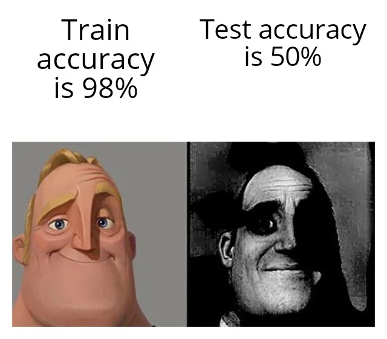{width="90%"}](#){data-modal-type="image" data-modal-url="figures/metrics-meme.webp"}

Source: [r/ProgrammerHumor](https://www.reddit.com/r/ProgrammerHumor/comments/seq5zz/nooooo/)
:::
:::
:::
:::

## Lecture overview
### Today's agenda

:::{style="margin-top: 20px; font-size: 26px;"}

:::{.columns}
:::{.column width=50%}
**Part 1: How LLMs "See" Text**

- The translation problem: Text to numbers
- The processing pipeline

**Part 2: Tokens and Tokenisation**

- What tokens are (hint: not always words!)
- Tokenisation methods and quirks
- Token limits and API costs

:::

:::{.column width=50%}
**Part 3: Embeddings**

- Words as vectors in space
- Semantic similarity and the king-queen example in detail

**Part 4: Parameters**

- What are the billions of parameters?
- Embeddings, weights, and biases
- Temperature and creativity dials
:::
:::
:::

## Meme of the day

:::{style="text-align: center; margin-top: 30px;"}
[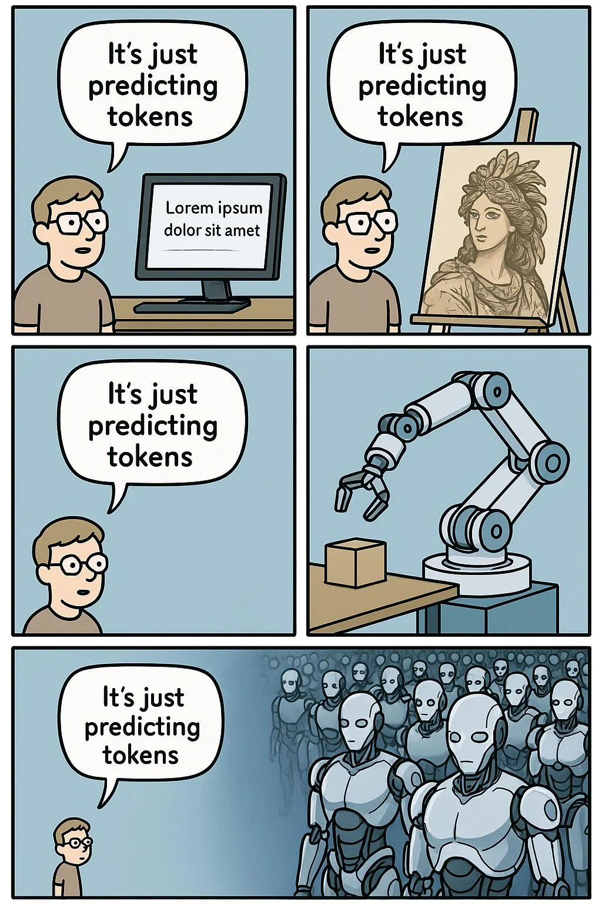{width="35%"}](#){data-modal-type="image" data-modal-url="figures/tweet-of-the-day.webp"}

Source: [Reddit r/Singularity](https://www.reddit.com/r/singularity/comments/1jjw81o/comment/mk0pvf2/?utm_source=share&utm_medium=web3x&utm_name=web3xcss&utm_term=1&utm_content=share_button)
:::

## New study by Anthropic on how AI impacts coding skills

:::{style="margin-top: 20px; font-size: 23px; text-align: center;"}
:::{.columns}
:::{.column width=50%}
[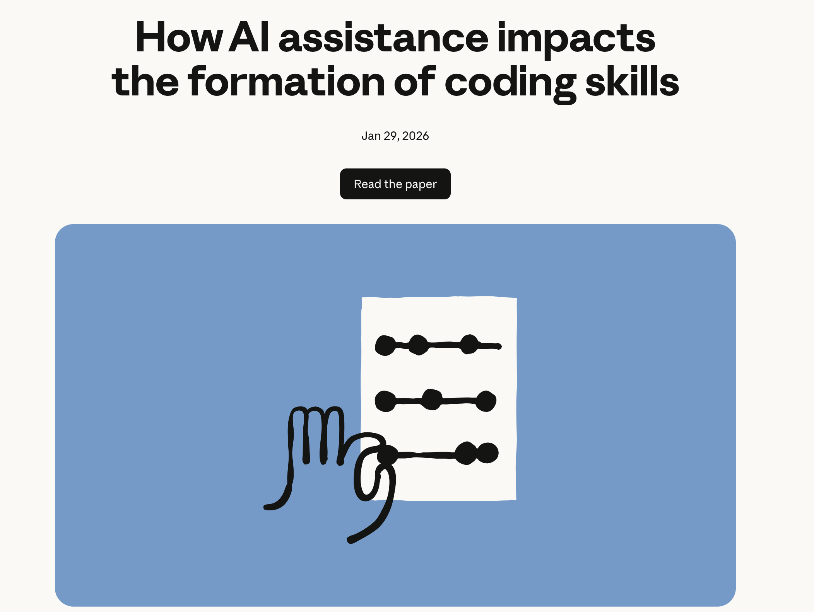{width="80%"}](#){data-modal-type="image" data-modal-url="figures/anthropic-coding-skills.png"}

Source: <https://www.anthropic.com/research/AI-assistance-coding-skills>
:::

:::{.column width=50%}
[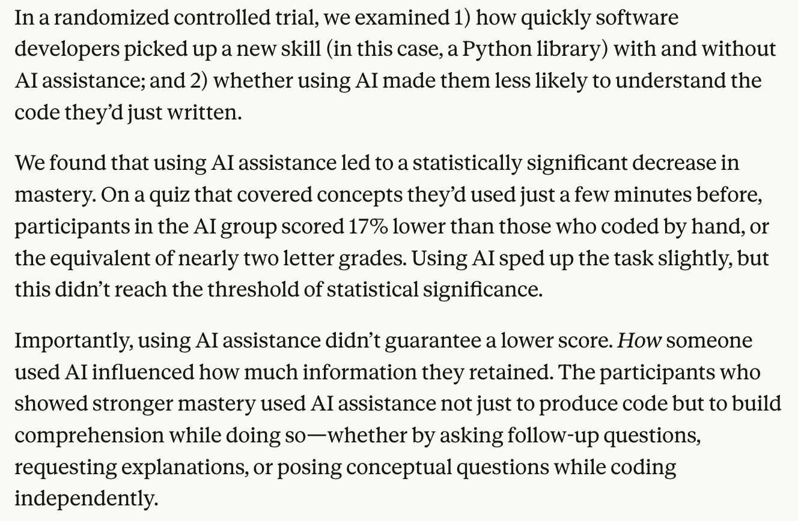{width="100%"}](#){data-modal-type="image" data-modal-url="figures/anthropic-coding-skills.png"}
:::
:::
:::

# How LLMs "See" Text 👁️ {background-color="#1B3A6B"}

## The translation problem
### LLMs don't read English!

:::{style="margin-top: 30px; font-size: 22px;"}
:::{.columns}
:::{.column width=55%}
- Here's something you probably know by now: [Computers only understand numbers]{.alert}
- When you type "Hello, how are you?", the [LLM doesn't see letters!]{.alert}
- It sees something like: `[15496, 11, 703, 527, 499, 30]`
- This creates a [translation problem]{.alert}:
  - How do we convert text into numbers?
  - How do we preserve [meaning]{.alert} in those numbers?
  - How do we capture relationships between words?
- The solution involves two key concepts:
  - [Tokenisation]{.alert}: Breaking text into pieces
  - [Embeddings]{.alert}: Converting pieces into meaningful vectors
:::

:::{.column width=45%}
:::{style="text-align: center; margin-top: -20px;"}
<!-- Suggested image: Robot looking confused at text, or text→numbers transformation -->
[{width="70%"}](#){data-modal-type="image" data-modal-url="figures/robot-reading.jpeg"}
:::
:::
:::
:::

## From text to output
### The LLM processing pipeline

:::{style="margin-top: 30px; font-size: 22px;"}
:::{.columns}
:::{.column width=55%}
[How prompting really works:]{.alert}

1. **Input text**: "The cat sat on the mat"
2. **Tokenisation**: Break into tokens → `["The", "cat", "sat", "on", "the", "mat"]`
3. **Token IDs**: Map to numbers → `[464, 3797, 3332, 319, 262, 2603]`
4. **Embeddings**: Convert to vectors → Each token becomes a list of ~4,096 numbers!
5. **Processing**: Pass through neural network layers
6. **Output**: Generate next token probabilities
7. **Decoding**: Convert back to text

[Your prompt goes through all of these steps before the model produces a single word]{.alert}
:::

:::{.column width=45%}
:::{style="text-align: center; font-size: 16px; margin-top: 20px;"}
[{width="100%"}](#){data-modal-type="image" data-modal-url="figures/llm-pipeline.png"}

Source: [NanoBanana](https://gemini.google/overview/image-generation/)
:::
:::
:::
:::

## Why this matters for you
### Practical implications

:::{style="margin-top: 30px; font-size: 22px;"}
:::{.columns}
:::{.column width=55%}
Understanding the pipeline helps you:

- **Write better prompts**: Know what the model "sees"
- **Understand costs**: API pricing is [per token]{.alert}, not per word
- **Avoid surprises**: Some words use more tokens than others
- **Debug issues**: Why did the model misunderstand?
- **Use context wisely**: [Token limits]{.alert} are real constraints

:::{style="background: rgba(45, 69, 99, 0.1); padding: 15px; border-radius: 10px; margin-top: 20px;"}
**Fun fact**: The word "everything" is 1 token, but "ChatGPT" is 3 tokens in OpenAI's (old) tokeniser! 🤯
:::
:::

:::{.column width=45%}
:::{style="text-align: center;"}
<!-- Suggested image: Token counter screenshot or API pricing diagram -->
[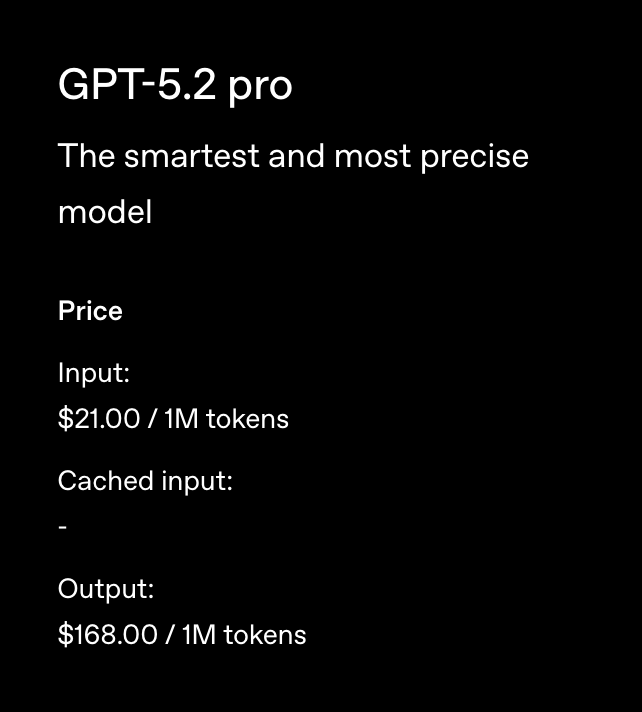{width="70%"}](#){data-modal-type="image" data-modal-url="figures/token-cost.png"}

Source: [OpenAI](https://openai.com/api/pricing/)
:::
:::
:::
:::

# Tokens and Tokenisation 🧩 {background-color="#1B3A6B"}

## What is a token?
### The basic unit of LLM processing

:::{style="margin-top: 30px; font-size: 22px;"}
:::{.columns}
:::{.column width=55%}
- A [token]{.alert} is the basic unit that an LLM reads
- Tokens are [NOT always words!]{.alert}
- A token can be:
  - A full word: "hello" → 1 token
  - Part of a word: "unhappiness" → "un" + "happiness" (2 tokens)
  - A single character: "!" → 1 token
  - A space: " " → often included with the next word
- Rule of thumb: [1 token ≈ 4 characters]{.alert} in English
- Or roughly: [100 tokens ≈ 75 words]{.alert}
- Other languages often use [more tokens]{.alert} per word
- Let's try it out with "Hello, it's Danilo here!"
- We'll use [OpenAI's tokenizer](https://platform.openai.com/tokenizer) for this example
:::

:::{.column width=45%}
:::{style="text-align: center;"}
<!-- Suggested image: Animated GIF showing text being split into tokens -->
[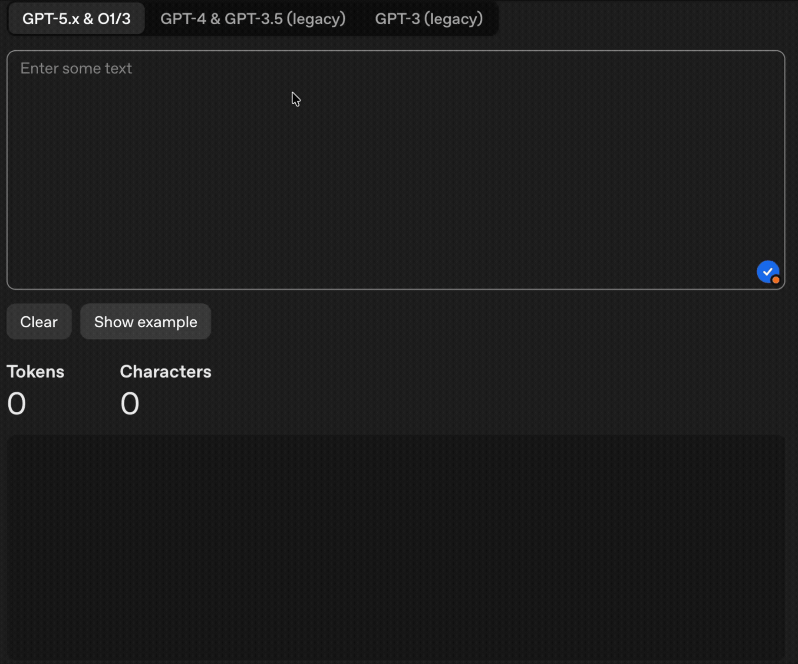{width="100%"}](#){data-modal-type="image" data-modal-url="figures/tokenisation-example.gif"}

Source: [OpenAI Tokenizer](https://platform.openai.com/tokenizer)
:::
:::
:::
:::

## Why use tokens instead of words?
### The clever engineering choice

:::{style="margin-top: 30px; font-size: 21px;"}
:::{.columns}
:::{.column width=55%}
**Three approaches to breaking up text:**

| Method | Example: "Evergreen" | Pros | Cons |
|--------|---------------------|------|------|
| **Word-based** | 1 token | Intuitive | Huge vocabulary |
| **Character-based** | 9 tokens | Tiny vocabulary | Loses meaning |
| **Subword (BPE)** | 2 tokens | Best of both! | Less intuitive |

<br>

- Modern LLMs use [Byte Pair Encoding (BPE)](https://huggingface.co/docs/transformers/tokenizer_summary#byte-pair-encoding)
- Common subwords become single tokens
- Rare words are split into known pieces
- This is why "ChatGPT" → ["Chat", "G", "PT"]
- How does this save space?
  - Example: "unbelievable", "unhappy", "undo", and "unknown" all share the same "un"
  - The model only needs to store "un" once!
:::

:::{.column width=45%}
:::{style="text-align: center;"}
**Why subwords win:**

:::{style="background: rgba(45, 69, 99, 0.1); padding: 15px; border-radius: 10px; font-size: 20px;"}
- ✅ Handles [unknown words]{.alert} gracefully
- ✅ Keeps vocabulary manageable (~50,000 tokens)
- ✅ Common words stay whole
- ✅ Rare words get broken up sensibly
- ✅ Works across languages
:::

<!-- Suggested image: BPE tokenisation diagram -->
[{width="100%"}](#){data-modal-type="image" data-modal-url="figures/bpe-diagram.png"}

Source: [Hugging Face](https://huggingface.co/docs/transformers/tokenizer_summary)
:::
:::
:::
:::

## Tokenisation in action
### Try it yourself!

:::{style="margin-top: 30px; font-size: 21px;"}
:::{.columns}
:::{.column width=55%}
**OpenAI's Tokeniser** (try it!): [platform.openai.com/tokenizer](https://platform.openai.com/tokenizer)

The number of tokens can change from one version to another!

**Some surprising examples:**

| Text | Tokens | Count |
|------|--------|-------|
| "Hello" | ["Hello"] | 1 |
| "hello" | ["hello"] | 1 |
| " hello" (with space) | [" hello"] | 1 |
| "Hello!" | ["Hello", "!"] | 2 |
| "everything" | ["everything"] | 1 |
| "ChatGPT" | ["Chat", "G", "PT"] | 3 |
| "São Paulo" | ["S", "ão", " Paulo"] | 3 |
| "🎉" | Multiple bytes | 2+ |

Notice: [Capitalisation, spacing, and punctuation]{.alert} all affect tokenisation!
:::

:::{.column width=45%}
:::{style="text-align: center;"}
<!-- Suggested image: Screenshot of OpenAI tokenizer with coloured tokens -->
[{width="100%"}](#){data-modal-type="image" data-modal-url="figures/tokenizer-screenshot.png"}

Source: [OpenAI Platform](https://platform.openai.com/tokenizer)
:::
:::
:::
:::

## Token limits and context windows
### Why your prompt has a maximum length

:::{style="margin-top: 30px; font-size: 20px;"}
:::{.columns}
:::{.column width=55%}
- Every LLM has a [context window]{.alert}: Maximum tokens it can process
- This limit includes [both your prompt AND the response!]{.alert}
- Output tokens typically cost [2-4x more]{.alert} than input tokens!

:::{style="text-align: center;"}
| Model | Context Window |
|-------|---------------|
| GPT-3.5 | 4,096 or 16,384 tokens |
| GPT-4 | 8,192 or 128,000 tokens |
| Gemini Pro | 1,000,000+ tokens |
:::

- If your prompt uses 3,500 tokens and the limit is 4,096...
- You only have [596 tokens left]{.alert} for the response!
- Exceeding limits → [Error]{.alert} or truncated output
- Curiosity: [Non-English languages use more tokens]{.alert}
  - Chinese, Japanese, Korean: ~2-3x more tokens per concept
  - This means higher costs and shorter effective context
:::

:::{.column width=45%}
:::{style="text-align: center;"}
[{width="90%"}](#){data-modal-type="image" data-modal-url="figures/context-window.png"}

Source: [Anthropic](https://platform.claude.com/docs/en/build-with-claude/context-windows)

**Same meaning, different tokens:**

| Language | Text | Tokens |
|----------|------|--------|
| English | "Hello" | 1 |
| Chinese | "你好" | 4 |
| Arabic | "مرحبا" | 6 |
| Japanese | "こんにちは" | 6 |
:::
:::
:::
:::

# Embeddings 🌌 {background-color="#1B3A6B"}

## What are embeddings?
### Words as points in space

:::{style="margin-top: 30px; font-size: 22px;"}
:::{.columns}
:::{.column width=55%}
- Once text is tokenised, each token gets converted to an [embedding]{.alert}
- An embedding is a [vector]{.alert}: A list of numbers
- Typically [768 to 4,096 numbers]{.alert} per word!
- Example: "cat" → `[0.23, -0.45, 0.12, -0.89, ... (4,096 numbers)]`
- These numbers [capture the meaning]{.alert} of the word
- [Similar words have similar vectors]{.alert}
  - "cat" and "dog" will be close together
  - "cat" and "aeroplane" will be far apart
- The model [learns]{.alert} these representations during training
- This is where the "understanding" happens!
- Remember $\vec{\text{king}} - \vec{\text{man}} + \vec{\text{woman}} \approx \vec{\text{queen}}$
:::

:::{.column width=45%}
:::{style="text-align: center;"}
<!-- Suggested image: 3D scatter plot showing word embeddings -->
[{width="100%"}](#){data-modal-type="image" data-modal-url="figures/embeddings-3d.png"}

Source: [TensorFlow Projector](https://projector.tensorflow.org/)

[Similar words cluster together in the embedding space]{.alert}
:::
:::
:::
:::

## Word2Vec: A brief history
### Where modern embeddings began

:::{style="margin-top: 30px; font-size: 22px;"}
:::{.columns}
:::{.column width=55%}
- [Word2Vec]{.alert} [(2013, Google's Mikolov et al.)](https://arxiv.org/abs/1301.3781) revolutionised NLP
- Two training approaches:
  - **CBOW** (Continuous Bag of Words): Predict word from context
  - **Skip-gram**: Predict context from word
- Key insight: [Words appearing in similar contexts have similar meanings]{.alert}
  - "I love my _____" → cat, dog, hamster are all likely
  - So cat, dog, hamster should be near each other!
- Trained on billions of words from the web
- Created the embedding approach modern LLMs use
- 🎬 Watch: [Word2Vec Explained](https://www.youtube.com/watch?v=viZrOnJclY0) (10 min)
:::

:::{.column width=45%}
:::{style="text-align: center;"}
<!-- Suggested image: CBOW and Skip-gram diagram -->
[{width="100%"}](#){data-modal-type="image" data-modal-url="figures/word2vec-diagram.png"}

Source: [Chris McCormick](https://mccormickml.com/2016/04/19/word2vec-tutorial-the-skip-gram-model/)

:::{style="font-size: 18px; margin-top: 15px;"}
*"You shall know a word by the company it keeps"*
— J.R. Firth (1957)
:::
:::
:::
:::
:::

## Word2vec illustrated
### How embeddings capture meaning

:::{style="margin-top: 30px; font-size: 22px;"}
:::{.columns}
:::{.column width=55%}
- Imagine we have the word embeddings for a few words
- The colours represent numbers from -2 to +2, obtained from our model
- See how "woman" and "girl" are similar to each other, but "queen" is further away?
- [This tell us something!]{.alert}
- Although [we don't know what each dimension codes for]{.alert}, we can see some patterns
- There are clear places where “king” and “queen” are similar to each other and distinct from all the others
- [The model has learned something about gender and royalty!]{.alert}
- Note that "water" has few connections to other words
:::

:::{.column width=45%}
:::{style="text-align: center;"}
<!-- Suggested image: Word embeddings illustration -->
[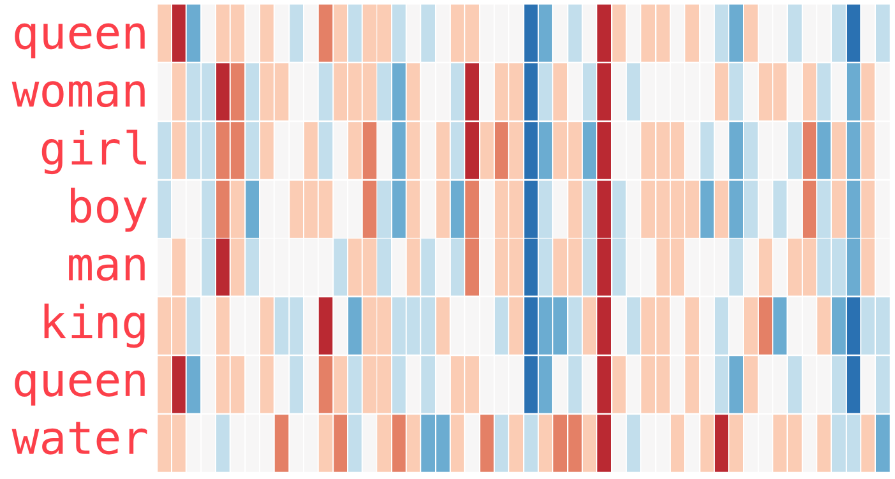{width="100%"}](#){data-modal-type="image" data-modal-url="figures/queen-woman-girl-embeddings.png"}

Source: [Jay Alammar](https://jalammar.github.io/illustrated-word2vec/)
:::
:::
:::
:::

## Embeddings in practice
### Real-world applications

:::{style="margin-top: 30px; font-size: 22px;"}
:::{.columns}
:::{.column width=55%}
**How embeddings power modern AI:**

- **Semantic search** 🔍
  - Search by meaning, not just keywords
  - "cheap flights" finds "budget airfare"
  
- **Recommendations** 📚
  - Find similar products, articles, or content
  - "Users who liked X also liked Y"
  
- **Clustering** 📊
  - Group similar documents automatically
  - Topic modelling without labels
  
- **RAG** (Retrieval-Augmented Generation)
  - Find relevant documents for LLM context
  - Power behind ChatGPT + browsing/search
:::

:::{.column width=45%}
:::{style="text-align: center;"}
:::{style="background: rgba(45, 69, 99, 0.1); padding: 15px; border-radius: 10px; font-size: 18px;"}
**Similarity search example:**

Query: "How to fix a broken phone screen?"

Most similar (by embedding):
1. "Repairing cracked smartphone displays"
2. "DIY phone screen replacement guide"
3. "Mobile repair services near me"

[Meaning match, not keyword match!]{.alert}
:::

<!-- Suggested image: Semantic search diagram -->
[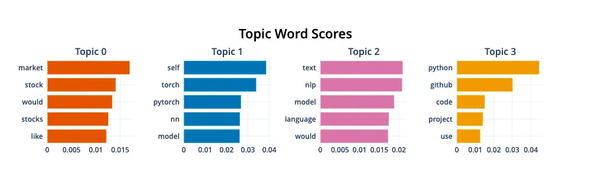{width="100%"}](#){data-modal-type="image" data-modal-url="figures/semantic-search.webp"}

Source: [Pinecone](https://www.pinecone.io/learn/bertopic/)
:::
:::
:::
:::

# Parameters: The LLM's Brain 🧠 {background-color="#1B3A6B"}

## What is a parameter?
### What are these numbers, exactly?

:::{style="margin-top: 30px; font-size: 22px;"}
:::{.columns}
:::{.column width=55%}
- Think back to algebra: $y = 2x + 3$
- The numbers 2 and 3 are [parameters]{.alert}
- They determine the behaviour of the function
- In an LLM, parameters are numbers that:
  - Get set during [training]{.alert}
  - Control how the model processes text
  - Determine what the model "knows"
- GPT-3: [175 billion]{.alert} parameters
- GPT-4: estimated [1+ trillion]{.alert} parameters
- Each parameter is adjusted [thousands of times]{.alert} during training
- Training = finding the right numbers to make predictions accurate
:::

:::{.column width=45%}
:::{style="text-align: center;"}
<!-- Suggested image: Neural network with parameters visualised -->
[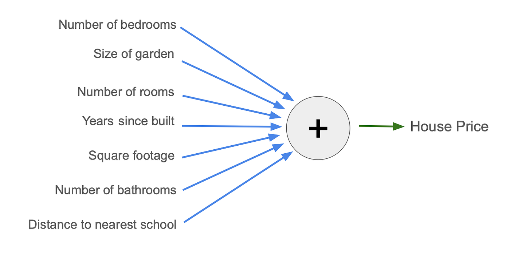{width="100%"}](#){data-modal-type="image" data-modal-url="figures/parameters-visual.png"}

Source: [Medium](https://catherinebreslin.medium.com/what-is-a-parameter-3d4b7736c81d)

:::{style="font-size: 18px; margin-top: 15px;"}
*Each arrow represents parameters that are learned during training*
:::
:::
:::
:::
:::

## How many parameters?
### The scale of modern LLMs

:::{style="margin-top: 30px; font-size: 26px;"}
:::{style="text-align: center;"}
| Model | Parameters | Training Data |
|-------|-----------|---------------|
| GPT-2 (2019) | 1.5 billion | 40 GB text |
| GPT-3 (2020) | 175 billion | 570 GB text |
| GPT-4 (2023) | ~1+ trillion (est.) | Undisclosed |
| LLaMA 2 (2023) | 7B - 70B | 2 trillion tokens |
| Gemini Ultra (2024) | Undisclosed | Massive |

:::{style="margin-top: 20px; font-size: 24px;"}
**To put this in perspective:**

- 175 billion parameters = [175,000,000,000]{.alert} individual numbers
- If you counted 1 per second, it would take [5,500 years]{.alert}!
- Training GPT-3 required [~3.6 million GPU hours]{.alert}
- Each of those parameters was updated [tens of thousands of times]{.alert}
:::
:::
:::

## The three types of parameters
### Embeddings, weights, and biases

:::{style="margin-top: 30px; font-size: 18px;"}
:::{.columns}
:::{.column width=55%}
**1. Embedding parameters**

- Store the learned vector for each token
- Vocabulary (~50,000) × dimensions (~4,096)
- = ~200 million parameters just for embeddings!

**2. Weight parameters**

- Control [connections between neurons]{.alert}
- Determine how strongly different parts influence each other
- Like volume knobs: amplify or diminish signals

**3. Bias parameters**

- [Adjust thresholds]{.alert} for neuron activation
- Help detect subtle patterns that might otherwise be missed
- Like a baseline adjustment

[In short: embeddings store word meanings, weights connect the dots, and biases fine-tune the thresholds]{.alert}
:::

:::{.column width=45%}
:::{style="text-align: center;"}
<!-- Suggested image: Diagram showing embeddings, weights, biases -->
[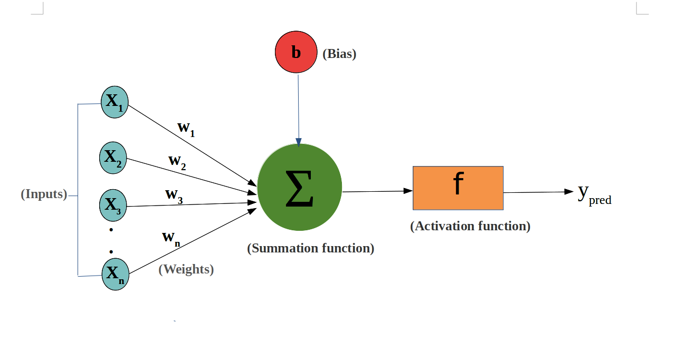{width="100%"}](#){data-modal-type="image" data-modal-url="figures/parameter-types.png"}

Source: [Medium](https://medium.com/ai-insights-cobet/no-more-floating-points-the-era-of-1-58-bit-large-language-models-b9805879ac0a)

:::{style="background: rgba(45, 69, 99, 0.1); padding: 15px; border-radius: 10px; font-size: 18px; margin-top: 15px;"}
**Simple analogy:**

- Embeddings = [vocabulary]{.alert}
- Weights = [grammar rules]{.alert}
- Biases = [intuition adjustments]{.alert}
:::
:::
:::
:::
:::

## Training: Finding the right numbers
### How parameters get their values

:::{style="margin-top: 30px; font-size: 22px;"}
:::{.columns}
:::{.column width=55%}
**The training process:**

1. Start with [random parameter values]{.alert}
2. Show the model text: "The cat sat on the ___"
3. Model predicts: "table" (wrong!)
4. Calculate the [error]{.alert}
5. [Backpropagation]{.alert}: Adjust parameters to reduce error
6. Repeat [billions of times]{.alert}

**Key insight:**

- The model learns by [predicting the next word]{.alert}
- Every error teaches it something
- Patterns emerge from massive repetition
- Training GPT-3 cost [~$3.5 million]{.alert} in compute!
:::

:::{.column width=45%}
:::{style="text-align: center;"}
<!-- Suggested image: Gradient descent visualisation -->
[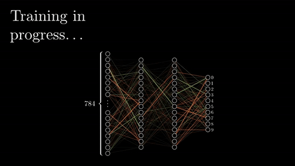{width="100%"}](#){data-modal-type="image" data-modal-url="figures/gradient-descent.gif"}

Source: [Daniel McKee and Maghav Kumar](https://slazebni.cs.illinois.edu/spring21/assignment2.html)

:::{style="font-size: 18px; margin-top: 15px;"}
*Parameters are adjusted step by step to minimise errors*
:::
:::
:::
:::
:::

## Model size vs. capability
### Bigger isn't always better

:::{style="margin-top: 30px; font-size: 23px;"}
:::{.columns}
:::{.column width=55%}
**The scaling hypothesis:**

- More parameters = more capability (generally)
- But [diminishing returns]{.alert} set in
- A 10x bigger model isn't 10x smarter

**Small models fighting back:**

- [Efficient training]{.alert}: Better data, longer training
- [Distillation]{.alert}: Teach small models from big ones
- [Quantisation]{.alert}: Reduce precision (32-bit → 4-bit)
- [Mixture of Experts]{.alert}: Only use relevant parts
:::

:::{.column width=45%}
:::{style="text-align: center;"}
**Example:**

- LLaMA 2 (7B) can outperform GPT-3 (175B) on some tasks!
- Why? Better training data and techniques
- [Quality over quantity]{.alert} matters for training data
  
<!-- Suggested image: Model size vs performance chart -->
[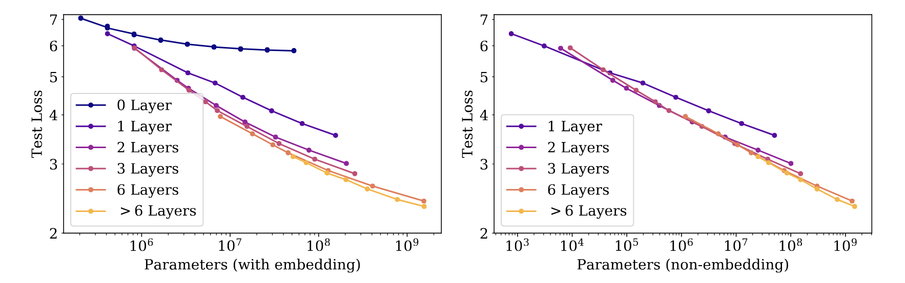{width="100%"}](#){data-modal-type="image" data-modal-url="figures/scaling-laws.png"}

Source: [OpenAI Scaling Laws Paper](https://arxiv.org/abs/2001.08361)
:::
:::
:::
:::

## Hyperparameters: The creativity dials
### Temperature, top-p, and top-k

:::{style="margin-top: 30px; font-size: 20px;"}
:::{.columns}
:::{.column width=55%}
**Not all parameters are learned!**

[Hyperparameters]{.alert} are settings YOU control:

- **Temperature** 🌡️
  - Controls randomness/creativity
  - Low (0.1-0.3): Focused, deterministic
  - High (0.7-1.0): Creative, varied
  - 0.0: Always picks most likely word
  - (Google AI Studio divides the scale up to 2.0)

- **Top-p** (nucleus sampling)
  - Only consider words in top p% probability
  - 0.9: Consider top 90% of likely words

- **Top-k**
  - Only consider top k most likely words
  - k=50: Choose from 50 most likely words
:::

:::{.column width=45%}
:::{style="text-align: center;"}
**Temperature in action:**

<!-- Suggested image: Temperature distribution diagram -->
[{width="100%"}](#){data-modal-type="image" data-modal-url="figures/temperature.gif"}

Source: [Medium](https://medium.com/@nigelgebodh/why-does-my-llm-have-a-temperature-f2e314a52086)
:::
:::
:::
:::

# Putting It All Together 🔗 {background-color="#1B3A6B"}

## The full picture
### From your prompt to the response

:::{style="margin-top: 30px; font-size: 18px;"}
:::{style="text-align: center;"}
[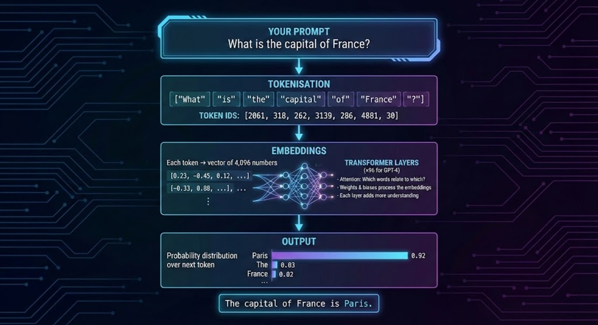{width="90%"}](#){data-modal-type="image" data-modal-url="figures/diagram.jpeg"}
:::
:::

## The attention mechanism (recap)
### How LLMs understand context

:::{style="margin-top: 30px; font-size: 21px;"}
:::{.columns}
:::{.column width=55%}
- [Attention]{.alert} is the key innovation of transformers
- Every word "looks at" every other word
- Determines which words are [relevant to each other]{.alert}

**Example:**

*"The animal didn't cross the street because it was too tired"*

- What does "it" refer to?
- Attention helps the model [connect "it" to "animal"]{.alert}
- Not all words matter equally for understanding

**How it works:**

- Each word asks: "Who should I pay attention to?"
- Creates weighted connections between all words
- Allows understanding of [long-range dependencies]{.alert}
:::

:::{.column width=45%}
:::{style="text-align: center; margin-top: -20px;"}
<!-- Suggested image: Attention heatmap visualisation -->
[{width="90%"}](#){data-modal-type="image" data-modal-url="figures/attention-heatmap.png"}

Source: [Jay Alammar](https://jalammar.github.io/illustrated-transformer/)

:::{style="font-size: 18px; margin-top: 15px;"}
*Darker = more attention between those words*
:::
:::
:::
:::
:::

## Practical tips for prompting
### Using your new knowledge

:::{style="margin-top: 30px; font-size: 20px;"}
:::{.columns}
:::{.column width=55%}
**Now that you understand the internals:**

- ✅ [Be concise]{.alert}: Fewer tokens = lower cost, more room for response
- ✅ [Use clear language]{.alert}: Common words tokenise efficiently
- ✅ [Provide context]{.alert}: Help the attention mechanism
- ✅ [Be specific]{.alert}: The model uses your exact words
- ✅ [Test different temperatures]{.alert}: Match creativity to task
- ✅ [Mind the context limit]{.alert}: Plan for both prompt AND response

**When things go wrong:**

- Model confused? → Try rephrasing with different words
- Model doesn't understand? → Provide more context
- Running out of context? → Summarise earlier content
:::

:::{.column width=45%}
:::{style="text-align: center;"}
:::{style="background: rgba(45, 69, 99, 0.1); padding: 15px; border-radius: 10px; font-size: 18px;"}
**Quick reference:**

| Task | Temperature |
|------|-------------|
| Factual Q&A | 0.0-0.3 |
| General chat | 0.5-0.7 |
| Creative writing | 0.7-1.0 |
| Brainstorming | 0.8-1.2 |
:::

<!-- Suggested image: Prompting tips infographic -->
[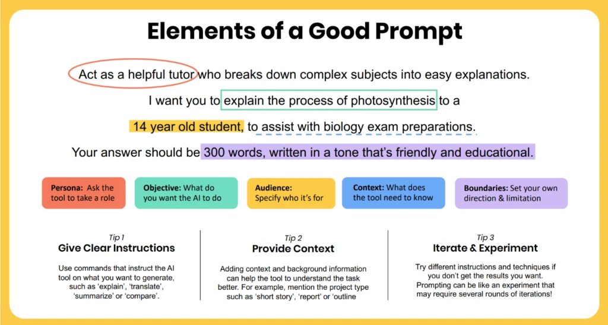{width="100%"}](#){data-modal-type="image" data-modal-url="figures/prompting-tips.webp"}

Source: [Microsoft Education](https://www.microsoft.com/en-us/education/blog/2024/06/five-quick-prompting-tips-to-get-more-from-your-ai-assistant/)
:::
:::
:::
:::

# Summary 📚 {background-color="#1B3A6B"}

## Main takeaways

:::{style="margin-top: 30px; font-size: 28px;"}

- `r fa('language')` LLMs don't read text; they process [tokens]{.alert}, numerical representations of text chunks

- `r fa('puzzle-piece')` [Tokenisation]{.alert} breaks text into pieces; ~100 tokens ≈ 75 words; affects cost and limits

- `r fa('cube')` [Embeddings]{.alert} convert tokens to vectors, capturing meaning in ~4,096 dimensions

- `r fa('crown')` The famous [king − man + woman ≈ queen]{.alert} shows embeddings encode semantic relationships

- `r fa('brain')` [Parameters]{.alert} (billions of them!) are the numbers learned during training

- `r fa('sliders-h')` [Hyperparameters]{.alert} like temperature let you control creativity vs. determinism

- `r fa('link')` [Attention]{.alert} mechanisms help models understand context and word relationships
:::

# ... and that's all for today! 🎉 {background-color="#1B3A6B"}