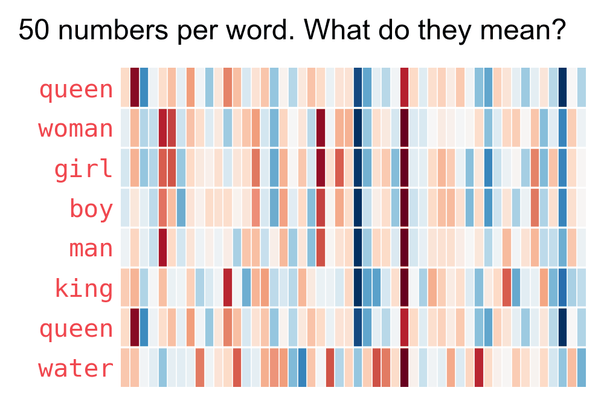
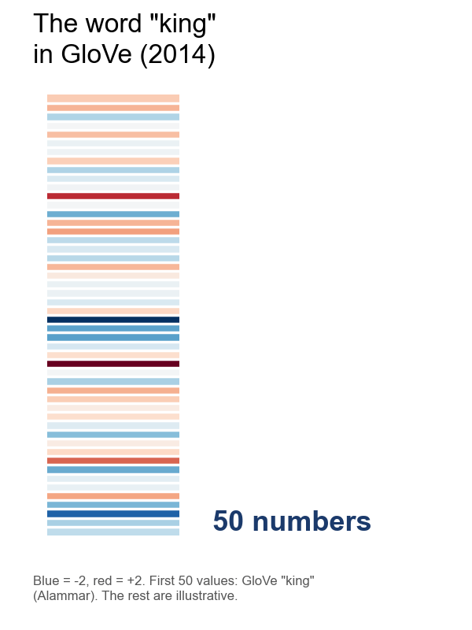

```{r setup, include=FALSE}
options(htmltools.dir.version = FALSE)
library(knitr)
opts_chunk$set(
  prompt = T,
  fig.align="center",
  dpi=300,
  cache=T,
  engine.opts = list(bash = "-l")
  )

knit_hooks$set(
  prompt = function(before, options, envir) {
    options(
      prompt = if (options$engine %in% c('sh','bash', 'zsh')) '$ ' else 'R> ',
      continue = if (options$engine %in% c('sh','bash', 'zsh')) '$ ' else '+ '
      )
})

options(repos = c(CRAN = "https://cran.rstudio.com/"))

if (!require("fontawesome", character.only = TRUE)) {
  install.packages("fontawesome", dependencies = TRUE)
  library(fontawesome, character.only = TRUE)
}
```

# Welcome back! 🤓 {background-color="#1B3A6B"}

## Recap of last class

:::{style="margin-top: 20px; font-size: 25px;"}
:::{.columns}
:::{.column width=50%}
- We covered [model evaluation]{.alert} across two domains
- [Traditional ML metrics]{.alert}: accuracy, precision, recall
- The [accuracy paradox]{.alert}: 99.9% accuracy can be useless!
- [Overfitting]{.alert}: models memorise instead of learn
- [Cross-validation]{.alert}: more reliable evaluation
- [LLM evaluation]{.alert}: perplexity, LLM-as-a-Judge, G-Eval
- [Hallucinations]{.alert} and [RAG]{.alert} for grounding answers
- Today: [How do LLMs actually understand language?]{.alert} 🤔
:::

:::{.column width=50%}
:::{style="text-align: center; margin-top: -30px;"}
[{width="90%"}](#){data-modal-type="image" data-modal-url="figures/metrics-meme.webp"}

Source: [r/ProgrammerHumor](https://www.reddit.com/r/ProgrammerHumor/comments/seq5zz/nooooo/)
:::
:::
:::
:::

## Lecture overview
### Today's agenda

:::{style="margin-top: 20px; font-size: 26px;"}

:::{.columns}
:::{.column width=50%}
**Part 1: How LLMs "See" Text**

- The translation problem: Text to numbers
- The processing pipeline

**Part 2: Tokens and Tokenisation**

- What tokens are (hint: not always words!)
- Tokenisation methods and quirks
- Token limits and API costs

:::

:::{.column width=50%}
**Part 3: Embeddings**

- Words as vectors in space
- Semantic similarity and the king-queen example

**Part 4: Parameters**

- What are the billions of parameters?
- Embeddings, weights, and biases
- Temperature and creativity dials
:::
:::
:::

## Meme of the day

:::{style="text-align: center; margin-top: 30px;"}
[{width="35%"}](#){data-modal-type="image" data-modal-url="figures/tweet-of-the-day.webp"}

Source: [Reddit r/Singularity](https://www.reddit.com/r/singularity/comments/1jjw81o/comment/mk0pvf2/?utm_source=share&utm_medium=web3x&utm_name=web3xcss&utm_term=1&utm_content=share_button)
:::

## New study by Anthropic on how AI impacts coding skills

:::{style="margin-top: 20px; font-size: 23px; text-align: center;"}
:::{.columns}
:::{.column width=50%}
[{width="80%"}](#){data-modal-type="image" data-modal-url="figures/anthropic01.png"}

Source: <https://www.anthropic.com/research/AI-assistance-coding-skills>
:::

:::{.column width=50%}
[{width="100%"}](#){data-modal-type="image" data-modal-url="figures/anthropic02.png"}
:::
:::
:::

# How LLMs "See" Text 👁️ {background-color="#1B3A6B"}

## The translation problem
### LLMs don't read English!

:::{style="margin-top: 30px; font-size: 22px;"}
:::{.columns}
:::{.column width=55%}
- [Computers only understand numbers]{.alert}
- Type "Hello, how are you?" and the [LLM does not see letters]{.alert}
- It sees something like: `[15496, 11, 703, 527, 499, 30]`
- This creates a [translation problem]{.alert}:
  - How do we convert text into numbers?
  - How do we preserve [meaning]{.alert} in those numbers?
  - How do we capture relationships between words?
- Two concepts solve it:
  - [Tokenisation]{.alert}: break text into pieces
  - [Embeddings]{.alert}: turn pieces into meaningful vectors
:::

:::{.column width=45%}
:::{style="text-align: center; margin-top: -20px;"}
<!-- Suggested image: Robot looking confused at text, or text→numbers transformation -->
[{width="70%"}](#){data-modal-type="image" data-modal-url="figures/robot-reading.jpeg"}
:::
:::
:::
:::

## From text to output
### The LLM processing pipeline

:::{style="margin-top: 30px; font-size: 22px;"}
:::{.columns}
:::{.column width=55%}
1. **Input text**: "The cat sat on the mat"
2. **Tokenisation**: break into tokens → `["The", "cat", "sat", "on", "the", "mat"]`
3. **Token IDs**: map to numbers → `[464, 3797, 3332, 319, 262, 2603]`
4. **Embeddings**: each token becomes a list of ~4,096 numbers!
5. **Processing**: pass through neural network layers
6. **Output**: generate next token probabilities
7. **Decoding**: convert back to text

[Your prompt goes through all of these steps before the model produces a single word]{.alert}
:::

:::{.column width=45%}
:::{style="text-align: center; font-size: 16px; margin-top: 20px;"}
[{width="100%"}](#){data-modal-type="image" data-modal-url="figures/llm-pipeline.png"}

Source: [NanoBanana](https://gemini.google/overview/image-generation/)
:::
:::
:::
:::

## Why this matters for you
### Practical implications

:::{style="margin-top: 30px; font-size: 22px;"}
:::{.columns}
:::{.column width=55%}
The pipeline helps you:

- [Write better prompts]{.alert}: know what the model "sees"
- [Understand costs]{.alert}: API pricing is per token, not per word
- [Avoid surprises]{.alert}: some words use more tokens than others
- [Debug issues]{.alert}: why did the model misunderstand?
- [Use context wisely]{.alert}: token limits are real constraints

:::{style="background: rgba(45, 69, 99, 0.1); padding: 15px; border-radius: 10px; margin-top: 20px;"}
**Fun fact**: The word "everything" is 1 token, but "ChatGPT" is 3 tokens in OpenAI's (old) tokeniser! 🤯
:::
:::

:::{.column width=45%}
:::{style="text-align: center;"}
<!-- Suggested image: Token counter screenshot or API pricing diagram -->
[{width="70%"}](#){data-modal-type="image" data-modal-url="figures/token-cost.png"}

Source: [OpenAI](https://openai.com/api/pricing/)
:::
:::
:::
:::

# Tokens and Tokenisation 🧩 {background-color="#1B3A6B"}

## What is a token?
### The basic unit of LLM processing

:::{style="margin-top: 30px; font-size: 22px;"}
:::{.columns}
:::{.column width=55%}
- A [token]{.alert} is the basic unit an LLM reads
- Tokens are [not always words]{.alert}
- A token can be:
  - A full word: "hello" → 1 token
  - Part of a word: "unhappiness" → "un" + "happiness" (2 tokens)
  - A single character: "!" → 1 token
  - A space: " " → often included with the next word
- Rule of thumb: [1 token ≈ 4 characters]{.alert} in English, or [100 tokens ≈ 75 words]{.alert}
- Other languages often use [more tokens]{.alert} per word
- Let's try "Hello, it's Danilo here!" in [OpenAI's tokenizer](https://platform.openai.com/tokenizer)
:::

:::{.column width=45%}
:::{style="text-align: center;"}
<!-- Suggested image: Animated GIF showing text being split into tokens -->
[{width="100%"}](#){data-modal-type="image" data-modal-url="figures/tokenisation-example.gif"}

Source: [OpenAI Tokenizer](https://platform.openai.com/tokenizer)
:::
:::
:::
:::

## Why use tokens instead of words?
### A clever engineering choice

:::{style="margin-top: 30px; font-size: 20px;"}
:::{.columns}
:::{.column width=55%}
**Three approaches to breaking up text:**

| Method | Example: "Evergreen" | Pros | Cons |
|--------|---------------------|------|------|
| **Word-based** | 1 token | Intuitive | Huge vocabulary |
| **Character-based** | 9 tokens | Tiny vocabulary | Loses meaning |
| **Subword (BPE)** | 2 tokens | Best of both! | Less intuitive |

:::{style="margin-top: 30px;"}
:::

- Modern LLMs use [Byte Pair Encoding (BPE)](https://huggingface.co/docs/transformers/tokenizer_summary#byte-pair-encoding)
  - Start with single characters (bytes) as tokens
  - Find the pair that appears together most often in the training text, e.g. "u" + "n"
  - Merge it into a new token ("un") and repeat until the vocabulary is big enough
- [Common subwords become single tokens;]{.alert} rare words split into known pieces
- It also saves space: "unbelievable", "unhappy", "undo" and "unknown" share the same "un". [The model stores "un" only once!]{.alert}
:::

:::{.column width=45%}
:::{style="text-align: center;"}
**Why subwords win:**

:::{style="background: rgba(45, 69, 99, 0.1); padding: 15px; border-radius: 10px; font-size: 20px;"}
- Handles [unknown words]{.alert} gracefully
- Keeps vocabulary manageable (~50,000 to 200,000 tokens)
- Common words stay whole, rare words split sensibly
- Works across languages
:::

<!-- Suggested image: BPE tokenisation diagram -->
[{width="100%"}](#){data-modal-type="image" data-modal-url="figures/bpe-diagram.png"}

Source: [Hugging Face](https://huggingface.co/docs/transformers/tokenizer_summary)
:::
:::
:::
:::

## Tokenisation in action
### Try it yourself!

:::{style="margin-top: 30px; font-size: 21px;"}
:::{.columns}
:::{.column width=55%}
**OpenAI's Tokeniser**: [platform.openai.com/tokenizer](https://platform.openai.com/tokenizer)

Token counts change from one version to another!

**Some surprising examples:**

| Text | Tokens | Count |
|------|--------|-------|
| "Hello" | ["Hello"] | 1 |
| "hello" | ["hello"] | 1 |
| " hello" (with space) | [" hello"] | 1 |
| "Hello!" | ["Hello", "!"] | 2 |
| "everything" | ["everything"] | 1 |
| "ChatGPT" | ["Chat", "G", "PT"] | 3 |
| "São Paulo" | ["S", "ão", " Paulo"] | 3 |
| "🎉" | Multiple bytes | 2+ |

[Capitalisation, spacing and punctuation]{.alert} all affect tokenisation!
:::

:::{.column width=45%}
:::{style="text-align: center;"}
<!-- Suggested image: Screenshot of OpenAI tokenizer with coloured tokens -->
[{width="100%"}](#){data-modal-type="image" data-modal-url="figures/tokenizer-screenshot.png"}

Source: [OpenAI Platform](https://platform.openai.com/tokenizer)
:::
:::
:::
:::

## Token limits and context windows
### Why your prompt has a maximum length

:::{style="margin-top: 30px; font-size: 20px;"}
:::{.columns}
:::{.column width=55%}
- Every LLM has a [context window]{.alert}: the maximum tokens it can process
  - Longer inputs need much more computing power and memory, so providers set a limit
- The limit covers [both your prompt and the response]{.alert}
- Output tokens usually cost [5-6x more]{.alert} than input tokens!

:::{style="text-align: center; margin-top: 20px; margin-bottom: 30px;"}
| Model | Context Window |
|-------|---------------|
| GPT-3.5 | 4,096 or 16,384 tokens |
| GPT-4 | 8,192 or 128,000 tokens |
| Gemini Pro / Claude / GPT-5.5 | 1,000,000+ tokens |
:::

- A 3,500-token prompt against a 4,096 limit leaves [596 tokens]{.alert} for the response!
- Exceeding limits gives an [error]{.alert} or truncated output
- [Non-English languages often use more tokens]{.alert}
  - Higher costs and shorter effective context, though newer tokenisers narrow the gap
:::

:::{.column width=45%}
:::{style="text-align: center;"}
[{width="90%"}](#){data-modal-type="image" data-modal-url="figures/context-window.png"}

Source: [Anthropic](https://platform.claude.com/docs/en/build-with-claude/context-windows)

**Same meaning, different tokens:**

| Language | Text | GPT-3 | GPT-4o |
|----------|------|-------|--------|
| English | "Hello" | 1 | 1 |
| Chinese | "你好" | 4 | 1 |
| Arabic | "مرحبا" | 6 | 2 |
| Japanese | "こんにちは" | 6 | 1 |
:::
:::
:::
:::

# Embeddings 🌌 {background-color="#1B3A6B"}

## What are embeddings?
### Words as points in space

:::{style="margin-top: 30px; font-size: 22px;"}
:::{.columns}
:::{.column width=55%}
- Each token gets converted to an [embedding]{.alert}
- An embedding is a [vector]{.alert}: a list of numbers, typically [768 to 4,096]{.alert} per word
- Example: "cat" → `[0.23, -0.45, 0.12, -0.89, ... (4,096 numbers)]`
- These numbers [capture the meaning]{.alert} of the word
- [Similar words have similar vectors]{.alert}
  - "cat" and "dog" sit close together
  - "cat" and "aeroplane" sit far apart
- The model [learns]{.alert} these representations during training, and this is where the "understanding" happens
  - Each word gets [one vector]{.alert}, fixed once training ends
- Remember $\vec{\text{king}} - \vec{\text{man}} + \vec{\text{woman}} \approx \vec{\text{queen}}$
:::

:::{.column width=45%}
:::{style="text-align: center;"}
<!-- Suggested image: 3D scatter plot showing word embeddings -->
[{width="100%"}](#){data-modal-type="image" data-modal-url="figures/embeddings-3d.png"}

Source: [TensorFlow Projector](https://projector.tensorflow.org/)

[Similar words cluster together in the embedding space]{.alert}
:::
:::
:::
:::

## Word2Vec: A brief history
### Where modern embeddings began

:::{style="margin-top: 30px; font-size: 22px;"}
:::{.columns}
:::{.column width=55%}
- [Word2Vec]{.alert} [(2013, Google's Mikolov et al.)](https://arxiv.org/abs/1301.3781) revolutionised NLP
- [CBOW]{.alert} (Continuous Bag of Words): predict the word from its context
- [Skip-gram]{.alert}: predict the context from the word
- Key insight: [words in similar contexts have similar meanings]{.alert}
  - "I love my _____" → cat, dog, hamster are all likely
  - so cat, dog and hamster should sit near each other!
- Trained on billions of words from the web
- Created the embedding approach modern LLMs use
- Watch: [Word2Vec Explained](https://www.youtube.com/watch?v=viZrOnJclY0) (10 min)
:::

:::{.column width=45%}
:::{style="text-align: center;"}
<!-- Suggested image: CBOW and Skip-gram diagram -->
[{width="100%"}](#){data-modal-type="image" data-modal-url="figures/word2vec-diagram.png"}

Source: [Chris McCormick](https://mccormickml.com/2016/04/19/word2vec-tutorial-the-skip-gram-model/)

:::{style="font-size: 18px; margin-top: 15px;"}
*"You shall know a word by the company it keeps"*
— J.R. Firth (1957)
:::
:::
:::
:::
:::

## Word2vec illustrated
### How embeddings capture meaning

:::{style="margin-top: 30px; font-size: 22px;"}
:::{.columns}
:::{.column width=55%}
- Here are the embeddings for a few words
- Each row is one word's 50 numbers, from blue (-2) to red (+2)
- See how "woman" and "girl" are similar, but "queen" is further away?
- [We don't know what each dimension codes for]{.alert}, yet patterns still show
- In some places "king" and "queen" match each other and differ from all the rest
- [The model has learned something about gender and royalty!]{.alert}
- Note that "water" has few connections to other words
:::

:::{.column width=45%}
:::{style="text-align: center;"}
<!-- Suggested image: Word embeddings illustration -->
[{width="100%"}](#){data-modal-type="image" data-modal-url="figures/word2vec-highlights.gif"}

Data: [GloVe](https://nlp.stanford.edu/projects/glove/). Layout after [Jay Alammar](https://jalammar.github.io/illustrated-word2vec/)
:::
:::
:::
:::

## How big are real embeddings?
### From 50 numbers to thousands

:::{style="margin-top: 30px; font-size: 24px;"}
:::{.columns}
:::{.column width=55%}
- GloVe (2014) stores each word as [50 numbers]{.alert}, like the rows on the last slide
- LLMs store each token as [thousands of numbers]{.alert}: 4,096 in Llama 3 8B, 12,288 in GPT-3
- More numbers leave room for [finer shades of meaning]{.alert}
- Nobody reads them one by one: we study the patterns instead
:::

:::{.column width=45%}
:::{style="text-align: center;"}
[{width="78%"}](#){data-modal-type="image" data-modal-url="figures/embedding-scale.gif"}
:::
:::
:::
:::

## Embeddings in practice
### Real-world applications

:::{style="margin-top: 30px; font-size: 22px;"}
:::{.columns}
:::{.column width=55%}
**How embeddings power modern AI:**

- [Semantic search]{.alert}: search by meaning, not keywords
  - "cheap flights" finds "budget airfare"
  
- [Recommendations]{.alert}: find similar products, articles or content
  - "Users who liked X also liked Y"
  
- [Clustering]{.alert}: group similar documents automatically
  - topic modelling without labels
  
- [RAG]{.alert} (Retrieval-Augmented Generation): find relevant documents for LLM context
  - the power behind ChatGPT + browsing/search
:::

:::{.column width=45%}
:::{style="text-align: center;"}
:::{style="background: rgba(45, 69, 99, 0.1); padding: 15px; border-radius: 10px; font-size: 18px;"}
**Similarity search example:**

Query: "How to fix a broken phone screen?"

Most similar (by embedding):
1. "Repairing cracked smartphone displays"
2. "DIY phone screen replacement guide"
3. "Mobile repair services near me"

[Meaning match, not keyword match!]{.alert}
:::

<!-- Suggested image: Semantic search diagram -->
[{width="100%"}](#){data-modal-type="image" data-modal-url="figures/semantic-search.webp"}

Source: [Pinecone](https://www.pinecone.io/learn/bertopic/)
:::
:::
:::
:::

# Parameters: The LLM's Brain 🧠 {background-color="#1B3A6B"}

## What is a parameter?
### What are these numbers, exactly?

:::{style="margin-top: 30px; font-size: 22px;"}
:::{.columns}
:::{.column width=55%}
- Think back to algebra: $y = 2x + 3$
- The numbers 2 and 3 are [parameters]{.alert}: they set the behaviour of the function
- In an LLM, parameters are numbers that:
  - get set during [training]{.alert}
  - control how the model processes text
  - determine what the model "knows"
- GPT-3: [175 billion]{.alert} parameters
- GPT-4: estimated [1+ trillion]{.alert} parameters
- Each GPT-3 parameter was adjusted [about 100,000 times]{.alert} during training
- Training means finding the numbers that make predictions accurate
:::

:::{.column width=45%}
:::{style="text-align: center;"}
<!-- Suggested image: Neural network with parameters visualised -->
[{width="100%"}](#){data-modal-type="image" data-modal-url="figures/parameters-visual.png"}

Source: [Medium](https://catherinebreslin.medium.com/what-is-a-parameter-3d4b7736c81d)

:::{style="font-size: 18px; margin-top: 15px;"}
*Each arrow represents parameters that are learned during training*
:::
:::
:::
:::
:::

## How many parameters?
### The scale of modern LLMs

:::{style="margin-top: 30px; font-size: 22px;"}
:::{style="text-align: center; margin-bottom: 30px; font-size: 24px;"}
| Model | Total parameters | Used per token | Training data |
|-------------|-----------------|----------------|---------------|
| GPT-2 (2019) | 1.5 billion | All | 40 GB text |
| GPT-3 (2020) | 175 billion | All | ~300 billion tokens |
| Llama 3.1 (2024) | 405 billion | All | 15 trillion tokens |
| Kimi K2 (2025) | 1 trillion | 32 billion | 15.5 trillion tokens |
| DeepSeek-V4-Pro (2026) | 1.6 trillion | 49 billion | 32+ trillion tokens |
| GPT-5, Claude, Gemini | Undisclosed | Undisclosed | Undisclosed |

:::{style="margin-top: 20px; font-size: 22px;"}
**To put this in perspective:**

- 1.6 trillion parameters = [1,600,000,000,000]{.alert} individual numbers
- Counting 1 per second would take [~50,000 years]{.alert}!
- Most new models use [Mixture of Experts (MoE)]{.alert}: many smaller "expert" networks
  - Each token goes to only a few experts: DeepSeek-V4-Pro uses [~3% of its parameters]{.alert} per token
- Training data grew [~100x]{.alert} since GPT-3
:::
:::
:::

## The three types of parameters
### Embeddings, weights, and biases

:::{style="margin-top: 30px; font-size: 18px;"}
:::{.columns}
:::{.column width=55%}
**1. Embedding parameters**

- Store the learned vector for each token
- Vocabulary (~50,000) × dimensions (~4,096) = ~200 million parameters just for embeddings!

**2. Weight parameters**

- Control [connections between neurons]{.alert}, and how strongly parts influence each other
- Like volume knobs: amplify or damp signals
- Like regression coefficients: [almost all of an LLM's parameters are weights]{.alert}

**3. Bias parameters**

- [Adjust thresholds]{.alert} for neuron activation
- Like the intercept in a regression, they shift the output up or down
- Many modern LLMs (Llama, DeepSeek) drop most biases
:::

:::{.column width=45%}
:::{style="text-align: center;"}
[{width="100%"}](#){data-modal-type="image" data-modal-url="figures/parameter-types.png"}

Source: [Medium](https://medium.com/ai-insights-cobet/no-more-floating-points-the-era-of-1-58-bit-large-language-models-b9805879ac0a)

:::{style="background: rgba(45, 69, 99, 0.1); padding: 15px; border-radius: 10px; font-size: 18px; margin-top: 15px;"}
**Simple analogy:**

- Embeddings = [vocabulary]{.alert}
- Weights = [grammar rules]{.alert}
- Biases = [intuition adjustments]{.alert}
:::
:::
:::
:::
:::

## Training: Finding the right numbers
### How parameters get their values

:::{style="margin-top: 30px; font-size: 22px;"}
:::{.columns}
:::{.column width=55%}
**The training process:**

1. Start with [random parameter values]{.alert}
2. Show the model text: "The cat sat on the ___"
3. Model predicts: "table" (wrong!)
4. Calculate the [error]{.alert}
5. [Backpropagation]{.alert}: adjust parameters to reduce the error
6. Repeat [billions of times]{.alert}

**In short:**

- The model learns by [predicting the next word]{.alert}, and every error teaches it something
- Patterns emerge from massive repetition
- Training GPT-3 cost [[~$4.6 million]{.alert}](https://lambda.ai/blog/demystifying-gpt-3) in compute!
:::

:::{.column width=45%}
:::{style="text-align: center;"}
<!-- Suggested image: Gradient descent visualisation -->
[{width="100%"}](#){data-modal-type="image" data-modal-url="figures/gradient-descent.gif"}

Source: [Daniel McKee and Maghav Kumar](https://slazebni.cs.illinois.edu/spring21/assignment2.html)

:::{style="font-size: 18px; margin-top: 15px;"}
*Parameters are adjusted step by step to minimise errors*
:::
:::
:::
:::
:::

## Model size vs. capability
### Bigger isn't always better

:::{style="margin-top: 30px; font-size: 22px;"}
:::{.columns}
:::{.column width=55%}
**The scaling hypothesis:**

- More parameters generally means more capability
- But [diminishing returns]{.alert} set in: a 10x bigger model isn't 10x smarter

**Small models fighting back:**

- [Efficient training]{.alert}: better data, longer training
- [Distillation]{.alert}: teach small models from big ones
- [Quantisation]{.alert}: reduce precision (32-bit → 4-bit)
- [Mixture of Experts]{.alert}: use only the relevant parts
:::

:::{.column width=45%}
:::{style="text-align: center;"}
**Example:**

- LLaMA 2 (7B) can beat GPT-3 (175B) on some tasks!
- Why? Better training data and techniques
- [Quality beats quantity]{.alert} in training data, although more parameters help with generalisation
  
[{width="100%"}](#){data-modal-type="image" data-modal-url="figures/scaling-laws.png"}

Source: [OpenAI Scaling Laws Paper](https://arxiv.org/abs/2001.08361)
:::
:::
:::
:::

## Hyperparameters: The creativity dials
### Temperature, top-p, and top-k

:::{style="margin-top: 30px; font-size: 22px;"}
:::{.columns}
:::{.column width=55%}
Not all parameters are learned. [Hyperparameters]{.alert} are settings you control:

- [Temperature]{.alert}: controls randomness
  - low (0.1-0.3): focused, deterministic
  - high (0.7-1.0): creative, varied
  - 0.0: always picks the most likely word
  - (OpenAI and Google AI Studio go up to 2.0)

- [Top-p]{.alert} (nucleus sampling): keep the fewest words whose probabilities add up to p
  - 0.9: the most likely words until they cover 90% (often just a handful)

- [Top-k]{.alert}: only consider the top k most likely words
  - k=50: choose from the 50 most likely words
:::

:::{.column width=45%}
:::{style="text-align: center;"}
**Temperature in action:**

<!-- Suggested image: Temperature distribution diagram -->
[{width="100%"}](#){data-modal-type="image" data-modal-url="figures/temperature.gif"}

Source: [Medium](https://medium.com/@nigelgebodh/why-does-my-llm-have-a-temperature-f2e314a52086)
:::
:::
:::
:::

# Putting It All Together 🔗 {background-color="#1B3A6B"}

## The full picture
### From your prompt to the response

:::{style="margin-top: 30px; font-size: 18px;"}
:::{style="text-align: center;"}
[{width="90%"}](#){data-modal-type="image" data-modal-url="figures/diagram.jpeg"}
:::
:::

## The attention mechanism (recap)
### How LLMs understand context

:::{style="margin-top: 30px; font-size: 21px;"}
:::{.columns}
:::{.column width=55%}
- [Attention]{.alert} is the key innovation of transformers
- Every word "looks at" every other word to find which are [relevant to each other]{.alert}

**Example:**

*"The animal didn't cross the street because it was too tired"*

- What does "it" refer to? Attention [connects "it" to "animal"]{.alert}
- Not all words matter equally for understanding

**How it works:**

- Each word asks: "who should I pay attention to?"
- Weighted connections between all words capture [long-range dependencies]{.alert}
:::

:::{.column width=45%}
:::{style="text-align: center; margin-top: -20px;"}
<!-- Suggested image: Attention heatmap visualisation -->
[{width="90%"}](#){data-modal-type="image" data-modal-url="figures/attention-heatmap.png"}

Source: [Jay Alammar](https://jalammar.github.io/illustrated-transformer/)

:::{style="font-size: 18px; margin-top: 15px;"}
*Darker = more attention between those words*
:::
:::
:::
:::
:::

## Two ways of using context
### Word2vec and attention are not the same thing

:::{style="margin-top: 30px; font-size: 22px;"}
:::{.columns}
:::{.column width=50%}
**Word2vec**

- Happens [once]{.alert}, during training
- Looks at neighbours across [billions of sentences]{.alert}
- Averages everything it saw into [one point per word]{.alert}, then freezes it
- "cheap" keeps that same vector for ever, in every sentence you ever write
:::

:::{.column width=50%}
**Attention**

- Happens [every time you run the model]{.alert}
- Looks at the neighbours in [this sentence]{.alert} only
- Rebuilds each word's vector [from scratch]{.alert}, every time
- "cheap flights" and "cheap wine" give "cheap" [two different vectors]{.alert}
:::
:::

:::{style="text-align: center; margin-top: 25px; font-size: 24px;"}
When you add context to a prompt, [attention]{.alert} is the part that reads it
:::
:::

## Practical tips for prompting
### Using your new knowledge

:::{style="margin-top: 30px; font-size: 20px;"}
:::{.columns}
:::{.column width=55%}
**Now that you understand the internals:**

- [Be concise]{.alert}: fewer tokens mean lower cost and more room for the response
- [Use clear language]{.alert}: common words tokenise efficiently
- [Provide context]{.alert}: help the attention mechanism
- [Be specific]{.alert}: the model uses your exact words
- [Test different temperatures]{.alert}: match creativity to the task
- [Mind the context limit]{.alert}: plan for both prompt and response

**When things go wrong:**

- Model confused? → rephrase with different words
- Model doesn't understand? → give more context
- Running out of context? → summarise earlier content
:::

:::{.column width=45%}
:::{style="text-align: center;"}
:::{style="background: rgba(45, 69, 99, 0.1); padding: 15px; border-radius: 10px; font-size: 18px;"}
**Quick reference:**

| Task | Temperature |
|------|-------------|
| Factual Q&A | 0.0-0.3 |
| General chat | 0.5-0.7 |
| Creative writing | 0.7-1.0 |
| Brainstorming | 0.8-1.2 |
:::

<!-- Suggested image: Prompting tips infographic -->
[{width="100%"}](#){data-modal-type="image" data-modal-url="figures/prompting-tips.webp"}

Source: [Microsoft Education](https://www.microsoft.com/en-us/education/blog/2024/06/five-quick-prompting-tips-to-get-more-from-your-ai-assistant/)
:::
:::
:::
:::

# Summary 📚 {background-color="#1B3A6B"}

## Main takeaways

:::{style="margin-top: 30px; font-size: 28px;"}

- LLMs don't read text; they process [tokens]{.alert}, numerical representations of text chunks

- [Tokenisation]{.alert} breaks text into pieces; ~100 tokens ≈ 75 words; affects cost and limits

- [Embeddings]{.alert} convert tokens to vectors, capturing meaning in ~4,096 dimensions

- The famous [king − man + woman ≈ queen]{.alert} shows embeddings encode semantic relationships

- [Parameters]{.alert} (billions of them!) are the numbers learned during training

- [Hyperparameters]{.alert} like temperature let you control creativity vs. determinism

- [Attention]{.alert} mechanisms help models understand context and word relationships
:::

# ... and that's all for today! 🎉 {background-color="#1B3A6B"}