```{r setup, include=FALSE}
options(htmltools.dir.version = FALSE)
library(knitr)
opts_chunk$set(
  prompt = T,
  fig.align="center",
  dpi=300,
  cache=T,
  engine.opts = list(bash = "-l")
  )

knit_hooks$set(
  prompt = function(before, options, envir) {
    options(
      prompt = if (options$engine %in% c('sh','bash', 'zsh')) '$ ' else 'R> ',
      continue = if (options$engine %in% c('sh','bash', 'zsh')) '$ ' else '+ '
      )
})

options(repos = c(CRAN = "https://cran.rstudio.com/"))

if (!require("fontawesome", character.only = TRUE)) {
  install.packages("fontawesome", dependencies = TRUE)
  library(fontawesome, character.only = TRUE)
}
```

# Welcome back! 🤓 {background-color="#1B3A6B"}

## Recap of last class

:::{style="margin-top: 20px; font-size: 27px;"}
:::{.columns}
:::{.column width=50%}
- Last time, we saw [how LLMs process text]{.alert}
- Words become [numbers]{.alert}! (embeddings)
- These numbers capture [meaning]{.alert}, and similar words are close together
- Remember: [king − man + woman ≈ queen]{.alert}?
- The model learns which words tend to appear near each other
- [What about images and sounds?]{.alert} 🖼️🎵
- Spoiler: They become numbers too!
:::

:::{.column width=50%}
:::{style="text-align: center; margin-top: -30px;"}
[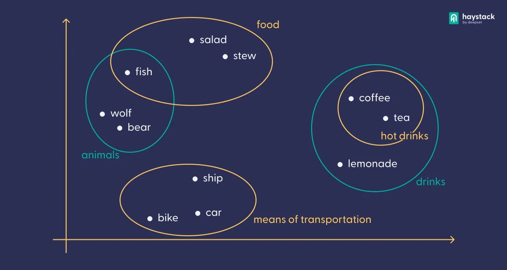{width="100%"}](#){data-modal-type="image" data-modal-url="figures/text-to-embeddings.webp"}

Source: [DeepSet AI](https://www.deepset.ai/blog/the-beginners-guide-to-text-embeddings)
:::
:::
:::
:::

## Lecture overview
### Today's agenda

:::{style="margin-top: 20px; font-size: 25px;"}

:::{.columns}
:::{.column width=50%}
**Part 1: How Machines "See"**

- What computers actually see (again: just numbers!)
- How AI learns to recognise objects
- Fun activity: Train your own image classifier!

**Part 2: How Machines "Hear"**

- Turning invisible sound waves into pictures
- How Siri and Alexa understand speech
:::

:::{.column width=50%}
**Part 3: The Big Picture**

- The main insight: Everything becomes the same kind of numbers!

**Part 4: What This Means for Society**

- Can you trust what you see and hear?
- Deepfakes, bias, and privacy
- Class discussion: Where do we draw the line?
:::
:::
:::

## Tweet of the day 😄
### Power to the people! ✊🏻

:::{style="text-align: center; margin-top: 30px;"}
[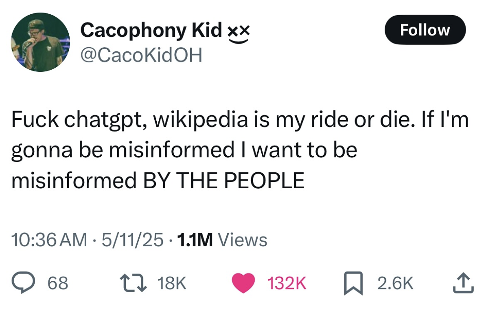{width="55%"}](#){data-modal-type="image" data-modal-url="figures/tweet-of-the-day.png"}
:::

# How machines "see" images 🔍 {background-color="#1B3A6B"}

## Discussion: Describe this to a computer 🤔

:::{style="margin-top: 30px; font-size: 22px;"}

:::{.columns}
:::{.column width=50%}
> **Imagine you need to describe a photo to someone who can ONLY understand numbers.**
>
> How would you do it?

:::{.fragment}
**Take 1 minute to discuss with your neighbour!** ⏱️

- What information would you include?
- How would you represent colours? Shapes?
- What makes this hard?
:::

:::{.fragment}
:::{style="margin-top: 30px;"}
Just like text needs to become numbers, [images need to become numbers too]{.alert}!

And it turns out there's a nice way to do this...
:::
:::
:::

:::{.column width=50%}
:::{style="text-align: center;"}
[{width="100%"}](#){data-modal-type="image" data-modal-url="figures/cute-cat.jpg"}
:::
:::
:::
:::

## What computers actually see
### It's just a grid of numbers!

:::{style="margin-top: 30px; font-size: 20px;"}
:::{.columns}
:::{.column width=55%}
- A digital photo is just a [grid of tiny coloured squares]{.alert} (pixels)
- Each pixel has three numbers:
  - **Red**: 0 (none) to 255 (brightest red)
  - **Green**: 0 to 255
  - **Blue**: 0 to 255
- Each number tells the computer [how much light is at that pixel]{.alert}
- Mix them together → millions of colours!
- A small 3x3 grayscale image (which has only one channel) could look like this:

```
[[255, 128, 0],
 [64, 200, 150],
 [0, 50, 255]]
```

- A typical photo might have [millions of pixels]{.alert}
- That's millions of numbers for the AI to process
- But here's the problem: [Raw numbers don't tell you "this is a cute cat with a hat"]{.alert} (and that's inefficient!) 😺
:::

:::{.column width=45%}
:::{style="text-align: center;"}
[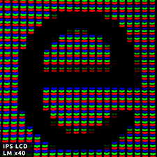{width="75%"}](#){data-modal-type="image" data-modal-url="figures/rgb-pixels.png"}

:::{style="font-size: 18px; margin-top: 10px;"}
Each pixel = three numbers (Red, Green, Blue)

Your screen is showing millions of these right now!

Source: [Reddit](https://www.reddit.com/r/apple/comments/9fp1ty/did_you_ever_looked_at_apple_screens_under_a/)
:::
:::
:::
:::
:::

## How AI learns to see
### Like learning to read!

:::{style="margin-top: 30px; font-size: 24px;"}
:::{.columns}
:::{.column width=55%}
:::{.incremental}
- Think about how you learned to read:

1. First, you learned to recognise [letters]{.alert}
2. Then you combined letters into [words]{.alert}
3. Then words into [sentences]{.alert}
4. Then sentences into [meaning]{.alert}

- **AI vision works the same way!**

1. First, detect [simple edges and colours]{.alert}
2. Combine edges into [shapes and textures]{.alert}
3. Combine shapes into [parts]{.alert} (eyes, wheels, petals)
4. Combine parts into [whole objects]{.alert} (cat, car, flower)

- [Each layer builds on the previous one]{.alert} 🧱
:::
:::

:::{.column width=45%}
:::{style="text-align: center;"}
[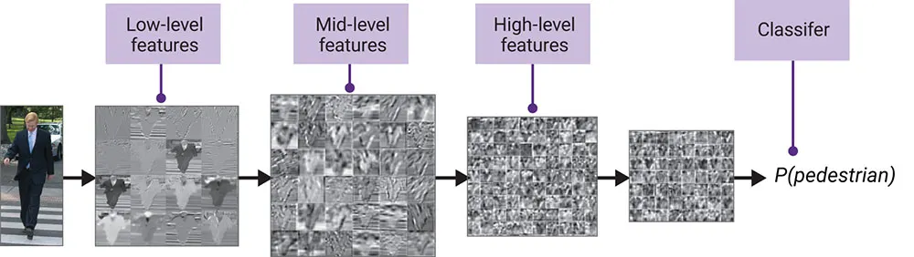{width="100%"}](#){data-modal-type="image" data-modal-url="figures/pedestrian.webp"}

Source: [Towards AI](https://pub.towardsai.net/how-computers-see-the-world-a-beginners-guide-to-cnns-c847ab855104)
:::
:::
:::
:::

## The convolution operation
### A "sliding magnifying glass"

:::{style="margin-top: 30px; font-size: 24px;"}
:::{.columns}
:::{.column width=55%}
- [Convolution]{.alert}: A small filter "slides" across the image
- At each position, it performs element-wise multiplication and sums the result
- Different filters detect different features:
  - Vertical edges, horizontal edges
  - Corners, textures, gradients
- The filter [learns what to look for]{.alert} during training!
- Output: A [feature map]{.alert} showing where that feature appears

:::{style="margin-top: 20px;"}
**Analogy**: Like using a stencil to find specific patterns 🔍
:::
:::

:::{.column width=45%}
:::{style="text-align: center;"}
[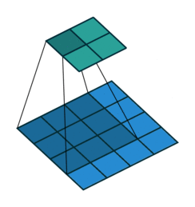{width="60%"}](#){data-modal-type="image" data-modal-url="figures/convolution-animation.gif"}

Source: [vdumoulin/conv_arithmetic](https://github.com/vdumoulin/conv_arithmetic)
:::
:::
:::
:::

## Feature hierarchies
### From edges to objects

:::{style="margin-top: 30px; font-size: 24px;"}
:::{.columns}
:::{.column width=50%}
- CNNs stack [multiple convolutional layers]{.alert}
- Each layer builds on the previous one:
  - **Layer 1**: Simple edges and colours
  - **Layer 2**: Textures and corners
  - **Layer 3**: Parts (eyes, wheels, leaves)
  - **Layer 4+**: Whole objects and scenes
- This is called a [feature hierarchy]{.alert}
- The network learns to [compose simple features into complex concepts]{.alert}
- Similar to how our visual cortex works!
:::

:::{.column width=50%}
:::{style="text-align: center; margin-top: -30px;"}
[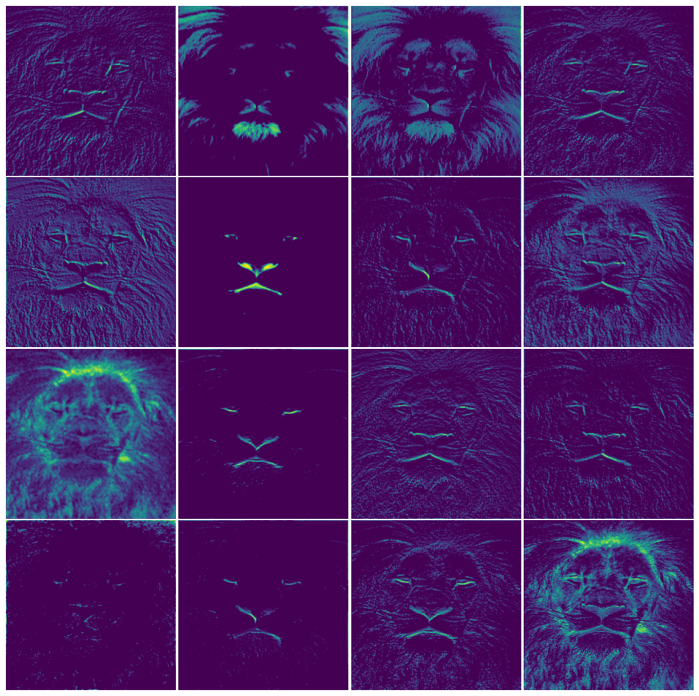{width="80%"}](#){data-modal-type="image" data-modal-url="figures/feature-extraction.webp"}

Source: [Towards Data Science](https://towardsdatascience.com/exploring-feature-extraction-with-cnns-345125cefc9a/)
:::
:::
:::
:::

## The full CNN architecture
### Putting it all together

:::{style="margin-top: 30px; font-size: 22px;"}
:::{.columns}
:::{.column width=100%}
:::{style="text-align: center;"}
[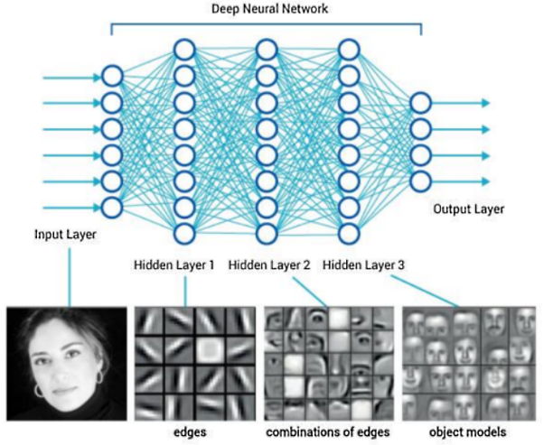{width="40%"}](#){data-modal-type="image" data-modal-url="figures/cnn-visualization.png"}
:::

:::{style="margin-top: 20px;"}
1. **Input**: Raw image (e.g., 224×224×3)
2. **Convolutional layers**: Extract features (edges → textures → objects)
3. **Fully connected layers**: Combine features for final decision
4. **Output**: Class probabilities (e.g., 95% woman, 5% man)
:::
:::
:::
:::

## Vision Transformers (ViT)
### "An Image is Worth 16×16 Words"

:::{style="margin-top: 30px; font-size: 21px;"}
:::{.columns}
:::{.column width=55%}
- In 2020, researchers asked: [Can we use Transformers for images?]{.alert}
- Key idea: Treat image patches like tokens!
- The process:
  1. **Divide** image into fixed-size patches (e.g., 16×16 pixels)
  2. **Flatten** each patch into a vector
  3. **Add positional embeddings** (so model knows patch locations)
  4. **Process through Transformer** (same attention mechanism as LLMs, so patches can "look at" other patches to understand context)
- [Same architecture for text AND images]{.alert}
- Foundation for multimodal models like GPT-4V and Gemini
:::

:::{.column width=45%}
:::{style="text-align: center;"}
[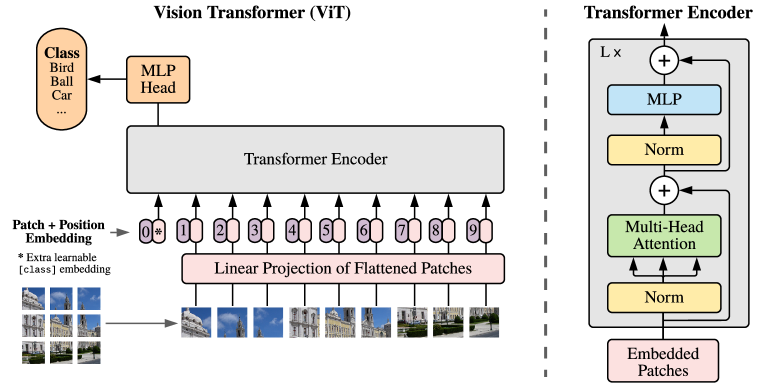{width="60%"}](#){data-modal-type="image" data-modal-url="figures/vit-architecture.png"}

[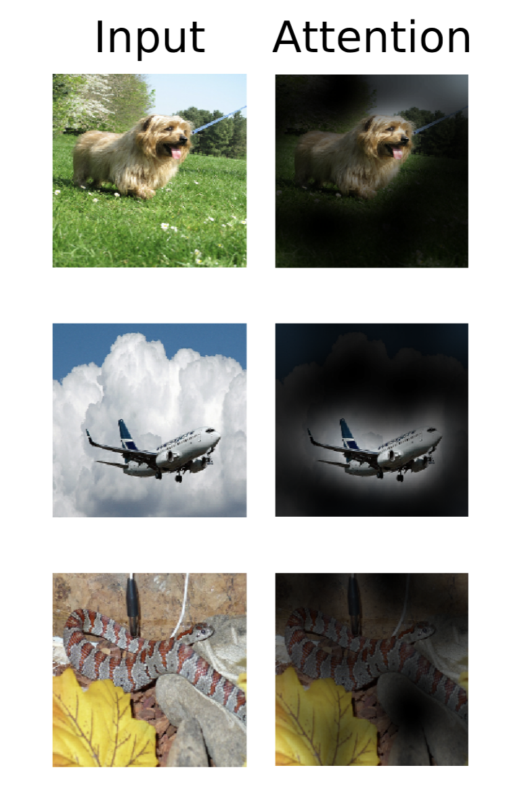{width="30%"}](#){data-modal-type="image" data-modal-url="figures/attention.png"}

Source: [Dosovitskiy et al. (2020)](https://arxiv.org/abs/2010.11929)
:::
:::
:::
:::

## CLIP: Connecting images and text
### The bridge to multimodal AI

:::{style="margin-top: 30px; font-size: 24px;"}
:::{.columns}
:::{.column width=55%}
- [CLIP]{.alert} (Contrastive Language-Image Pre-training) by OpenAI
- Trained on [400 million image-text pairs]{.alert} from the internet
- Key innovation: [Shared embedding space]{.alert} for images AND text
- How it works:
  - Image encoder → image embedding
  - Text encoder → text embedding
  - Train so matching pairs are [close together]{.alert}
- Result: Can match images to text descriptions [without task-specific training]{.alert}
- Foundation for DALL-E, Stable Diffusion, and multimodal LLMs!
:::

:::{.column width=45%}
:::{style="text-align: center;"}
[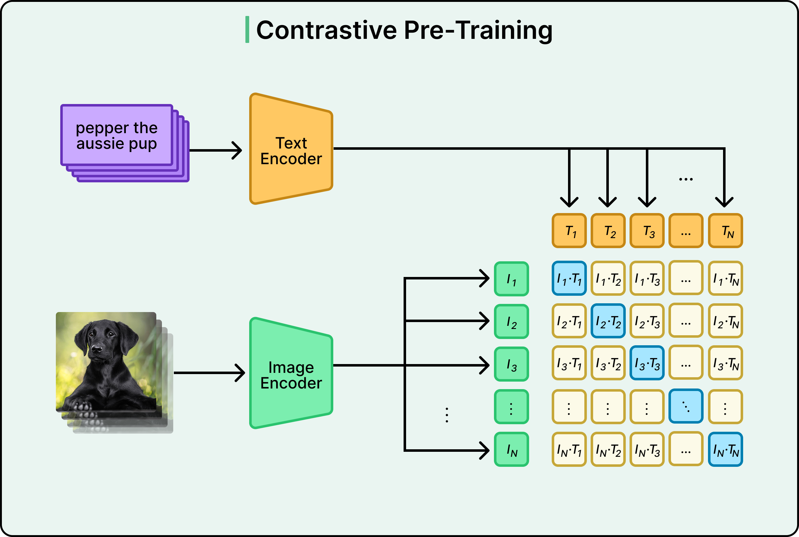{width="100%"}](#){data-modal-type="image" data-modal-url="figures/clip.png"}

Source: [OpenAI CLIP](https://openai.com/research/clip)
:::
:::
:::
:::

## What can AI do with images?
### Three main tasks

:::{style="margin-top: 30px; font-size: 22px;"}
:::{.columns}
:::{.column width=100%}
:::{style="text-align: center;"}
[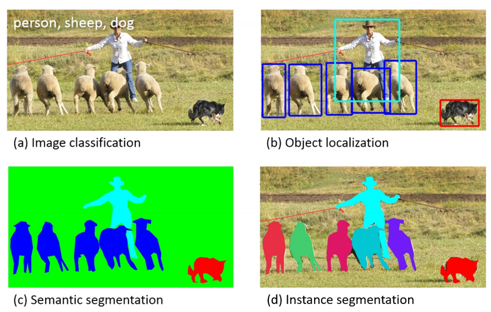{width="50%"}](#){data-modal-type="image" data-modal-url="figures/vision-tasks-comparison.png"}

| Task | Question | Real-world Example |
|------|----------|-------------------|
| [Classification]{.alert} | "What is this?" | Instagram knowing your photo is a selfie |
| [Detection]{.alert} | "What and where?" | Your phone camera finding faces |
| [Segmentation]{.alert} | "Which pixels are what?" | iPhone's Portrait Mode blurring backgrounds |

:::
:::
:::
:::

# Activity time! 🎮 {background-color="#1B3A6B"}

## Train your own AI! 
### Teachable Machine demo

:::{style="margin-top: 30px; font-size: 22px;"}
:::{.columns}
:::{.column width=55%}
**Let's train an image classifier: no coding required!**

1. Go to [teachablemachine.withgoogle.com](https://teachablemachine.withgoogle.com/)
2. Click "Get Started" → "Image Project" → "Standard"
3. Create 2-3 classes (e.g., "thumbs up", "thumbs down", "peace sign")
4. Record ~12 examples of each using your webcam (the website records 3 at a time)
5. Click "Train Model" (takes about 10 seconds)
6. Test it live!

**Try this:**

- What happens if you show it something it wasn't trained on?
- Can you "fool" your model?
:::

:::{.column width=45%}
:::{style="text-align: center;"}
[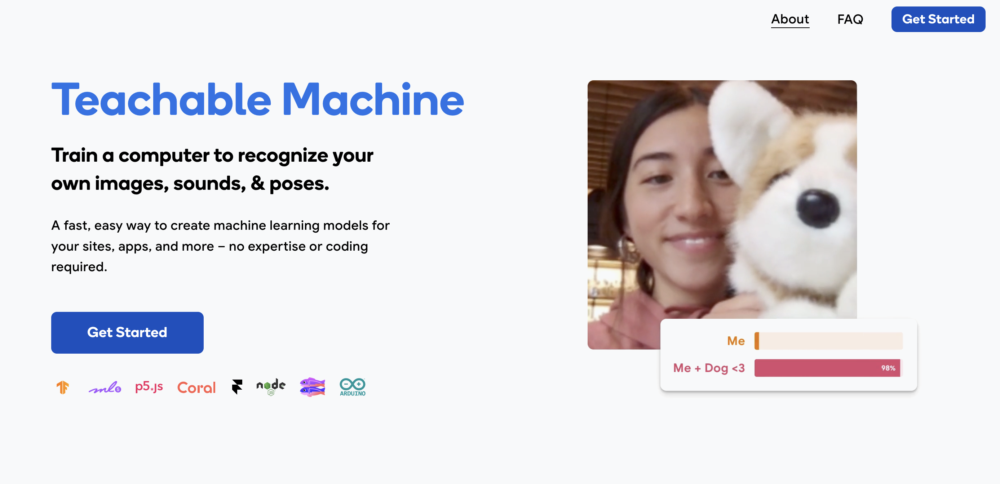{width="100%"}](#){data-modal-type="image" data-modal-url="figures/teachable-machine.png"}

:::{style="font-size: 18px; margin-top: 10px;"}
[teachablemachine.withgoogle.com](https://teachablemachine.withgoogle.com/)
:::
:::
:::
:::
:::

# How machines "hear" audio 🎵 {background-color="#1B3A6B"}

## Sound is invisible...so how do we process it?

:::{style="margin-top: 30px; font-size: 26px;"}

:::{.columns}
:::{.column width=55%}
Sound is just [vibrations in the air]{.alert}. We can't see it!

But here's a clever trick:

1. Record the vibrations as a [waveform]{.alert} (line going up and down)
2. Transform the waveform into a [picture]{.alert} called a spectrogram
3. Now we can use [the same AI that understands images]{.alert}!

**It's like creating a "photograph" of sound** 📸🎵

This is why modern AI is so powerful! We can turn [anything into pictures or numbers]{.alert} and use similar techniques!
:::

:::{.column width=45%}
:::{style="text-align: center;"}
[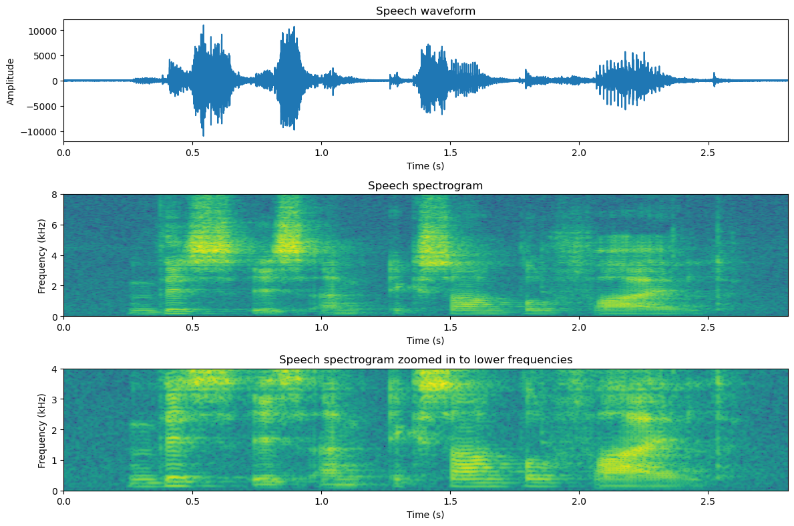{width="100%"}](#){data-modal-type="image" data-modal-url="figures/waveform-spectrogram.png"}

:::{style="font-size: 18px; margin-top: 10px;"}
Top: [Waveform](https://en.wikipedia.org/wiki/Waveform) (raw sound)

Middle: [Spectrogram](https://en.wikipedia.org/wiki/Spectrogram) (sound as an image!)

Bottom: [Mel-spectrogram](https://en.wikipedia.org/wiki/Mel-frequency_cepstrum) (adjusted for human hearing, with more resolution for lower frequencies and less for higher frequencies)

Source: [Bäckström et al (2026)](https://speechprocessingbook.aalto.fi/Representations/Spectrogram_and_the_STFT.html)
:::
:::
:::
:::
:::

## What the AI "sees" in your voice

:::{style="margin-top: 30px; font-size: 22px;"}
:::{.columns}
:::{.column width=55%}
In a spectrogram:

- **Horizontal axis**: Time (left to right)
- **Vertical axis**: Pitch (low notes at bottom, high at top)
- **Colour/brightness**: How loud that frequency is

What patterns can AI find?

- [Your unique voice "fingerprint"]{.alert}
- The difference between "cat" and "bat"
- Emotion (are you happy? angry? tired?)
- Whether you're speaking or singing
- What language you're using

:::{style="margin-top: 20px;"}
**Fun fact**: Dogs, cats, and humans all have distinctive spectrogram patterns! 🐕🐱👤
:::
:::

:::{.column width=45%}
:::{style="text-align: center;"}
[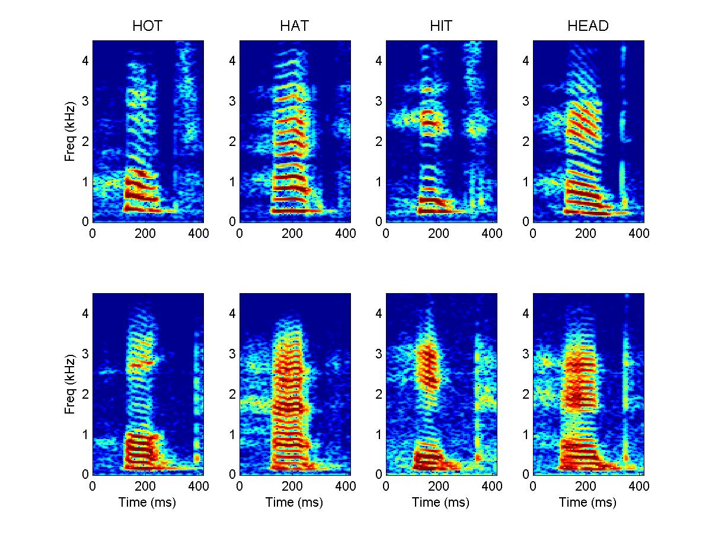{width="100%"}](#){data-modal-type="image" data-modal-url="figures/mel-spectrogram.jpg"}

Source: [Schnupp et al (2012)](https://auditoryneuroscience.com/vocalizations-speech/formants-harmonics)

:::
:::
:::
:::

## Activity: See your own voice! 🎤
### Spectrograms in real-time

:::{style="margin-top: 30px; font-size: 20px;"}
:::{.columns}
:::{.column width=55%}
**Try this later:**

1. Go to [musiclab.chromeexperiments.com/Spectrogram](https://musiclab.chromeexperiments.com/Spectrogram/)
2. Allow microphone access
3. Watch what happens when you:
   - Hum a low note vs a high note
   - Say "aaaah" vs "eeeeh" vs "ooooh"
   - Whistle
   - Snap your fingers or clap

**What to notice:**

- Low sounds appear at the [bottom]{.alert}, high sounds at the [top]{.alert}
- Vowels create [stable horizontal bands]{.alert}
- Percussive sounds (claps) create [vertical spikes]{.alert}
- Your voice has a unique pattern, like a [fingerprint]{.alert}!
:::

:::{.column width=45%}
:::{style="text-align: center;"}
[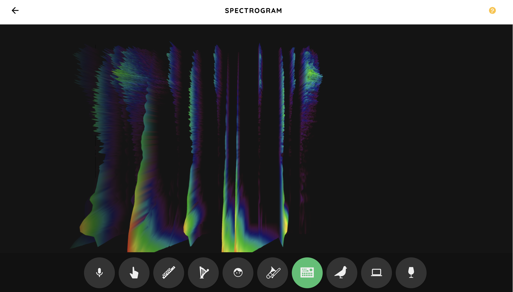{width="100%"}](#){data-modal-type="image" data-modal-url="figures/chrome-spectrogram.png"}

:::{style="font-size: 18px; margin-top: 10px;"}
[musiclab.chromeexperiments.com/Spectrogram](https://musiclab.chromeexperiments.com/Spectrogram/)

Try making different sounds and watch the patterns!
:::
:::
:::
:::
:::

## Whisper: How Siri and Alexa understand you

:::{style="margin-top: 30px; font-size: 20px;"}
:::{.columns}
:::{.column width=55%}
[Whisper](https://openai.com/research/whisper) is OpenAI's speech recognition system:

- Trained on [680,000 hours]{.alert} of audio from the internet
- Understands [99 languages]{.alert}!
- Can handle accents, background noise, different speaking styles
- Completely [open source and free]{.alert}

**How it works:**

1. **Slice**: Break audio into short windows (typically 25ms)
2. **FFT**: Convert each window from waveform to frequencies (how much of each frequency is present)
3. **Mel mapping**: Apply mel scale to match human perception
4. **Stack**: Create 2D spectrogram from all windows
5. **Process**: Use Transformers, [same as text and images!]{.alert}
6. **Context**: Use context (attention) to predict next tokens
:::

:::{.column width=45%}
- Architecture: [Encoder-decoder Transformer]{.alert}
  - Encoder: Processes mel spectrogram
  - Decoder: Generates text tokens
- [Open source and free to use!](https://github.com/openai/whisper)
  
This powers much of what Siri, Alexa, and Google Assistant do!

:::{style="text-align: center;"}
[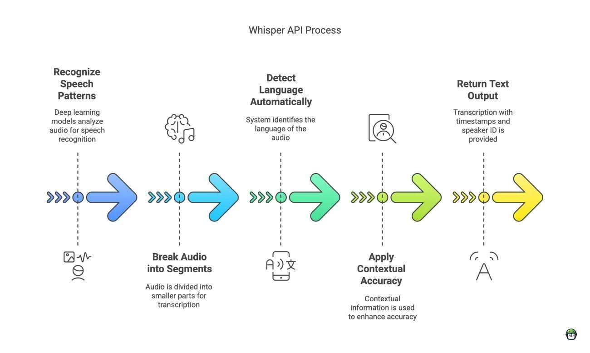{width="100%"}](#){data-modal-type="image" data-modal-url="figures/whisper-demo.webp"}

Source: [Sam Galope (2024)](https://www.samgalope.dev/2024/07/25/convert-wav-files-to-text-using-whisper-api/)
:::
:::
:::
:::

## Activity: Test speech recognition! 🎤

:::{style="margin-top: 30px; font-size: 22px;"}
:::{.columns}
:::{.column width=55%}
**Let's try the Whisper demo:**

[huggingface.co/spaces/openai/whisper](https://huggingface.co/spaces/openai/whisper)

**Experiments to try at home:**

1. Record yourself speaking normally
2. Try speaking with an accent
3. Record with background noise (music, talking)
4. Try a different language if you speak one!
5. Speak very fast or very slow

**Observe:**

- What does it get right? Wrong?
- Does it understand your accent?
- What about punctuation? Who decides where sentences end?
:::

:::{.column width=45%}
:::{style="text-align: center; margin-top: 40px;"}
[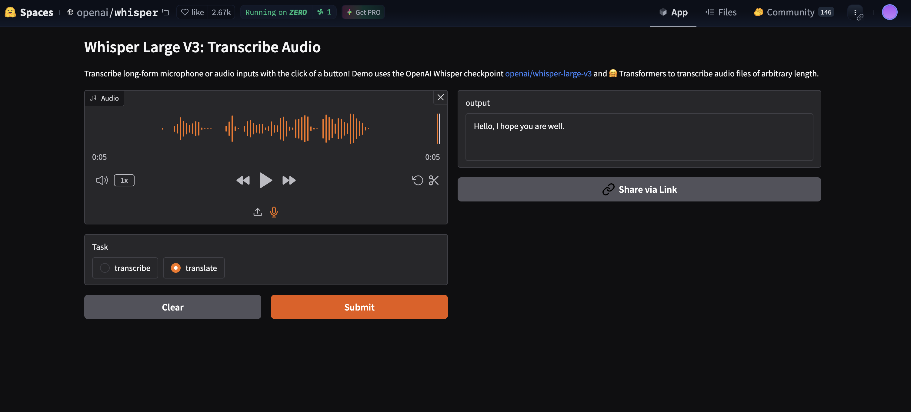{width="100%"}](#){data-modal-type="image" data-modal-url="figures/whisper-hf.png"}

:::{style="font-size: 18px; margin-top: 15px;"}
[huggingface.co/spaces/openai/whisper](https://huggingface.co/spaces/openai/whisper)
:::
:::
:::
:::
:::

## AI can compose music now 🎵
### Suno.ai and AI music

:::{style="margin-top: 30px; font-size: 24px;"}
:::{.columns}
:::{.column width=55%}
**[Suno.ai](https://suno.ai/)** generates complete songs from text prompts:

- Give it a description: "upbeat pop song about studying for exams"
- It creates: melody, harmony, rhythm, [AND vocals]{.alert}!
- A full song in about 30 seconds

**How does it work?**

- Trained on [millions of hours of music]{.alert}
- Learns patterns: chord progressions, song structures, vocal styles
- Uses the same "sound → numbers → AI" pipeline we discussed

**The questions this raises:**

- Anyone can now create professional-sounding music
- But: [Who owns AI-generated music?]{.alert}
- Some AI songs sound eerily similar to real artists
- Musicians worry about their livelihoods
:::

:::{.column width=45%}
:::{style="text-align: center; margin-top: 30px;"}
[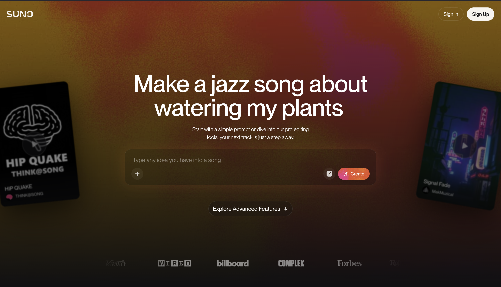{width="100%"}](#){data-modal-type="image" data-modal-url="figures/suno-ai.png"}

:::{style="font-size: 18px; margin-top: 10px;"}
[suno.ai](https://suno.ai/). Try generating your own song!
:::

:::{style="margin-top: 20px; background: rgba(45, 69, 99, 0.1); padding: 15px; border-radius: 10px; font-size: 20px;"}
**Discussion**: If AI creates a song that sounds like Taylor Swift, is that copying? Should it be legal?
:::
:::
:::
:::
:::

# The Big Picture 🌐 {background-color="#1B3A6B"}

## The main idea: Everything becomes numbers

:::{style="margin-top: 30px; font-size: 26px;"}
:::{.columns}
:::{.column width=55%}
- So... whether it's text, images, or audio...
- Everything gets converted to [embeddings]{.alert}!
- [Same mathematical representation]{.alert}:
  - Text token → 4096-dimensional vector
  - Image patch → 4096-dimensional vector
  - Audio segment → 4096-dimensional vector
- Once in embedding space, the [LLM doesn't know the original modality]{.alert}!
- This is why [multimodal models]{.alert} can work with text, images, and audio at the same time
:::

:::{.column width=45%}
:::{style="text-align: center;"}
[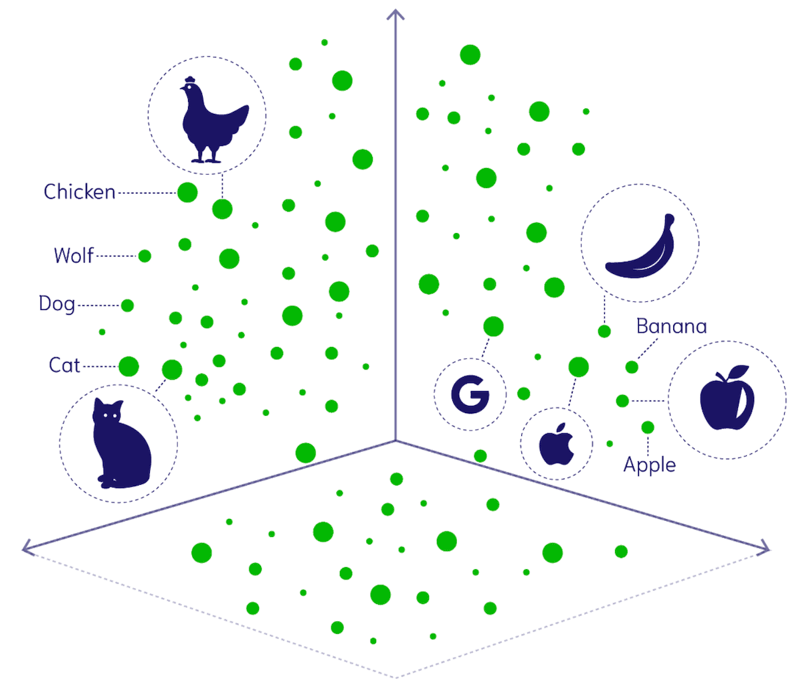{width="100%"}](#){data-modal-type="image" data-modal-url="figures/modality-embeddings.png"}

:::{style="font-size: 18px; margin-top: 10px;"}
Text, images, and audio all become the same kind of numbers, so AI can understand them together!
:::
:::
:::
:::
:::

## The three-part architecture
### How multimodal LLMs work

:::{style="margin-top: 30px; font-size: 22px;"}
:::{.columns}
:::{.column width=100%}
:::{style="text-align: center;"}
[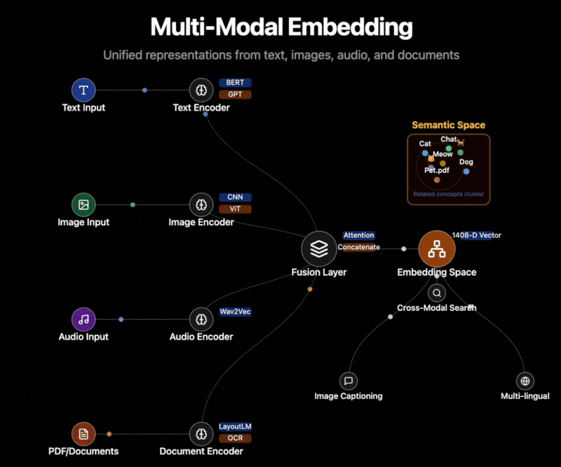{width="40%"}](#){data-modal-type="image" data-modal-url="figures/multimodal-embeddings.gif"}
:::

:::{style="margin-top: 20px;"}
1. **Modality Encoder**: Vision Transformer (images) or Whisper (audio). These are [pre-trained specialists]{.alert}
2. **Projection Layer**: Aligns encoder outputs to the LLM's embedding space. This part is [often surprisingly simple!]{.alert}
3. **LLM Backbone**: The "brain" (GPT, Gemini, Claude), which processes everything as tokens
:::
:::
:::
:::

## Training multimodal models
### Two-stage learning

:::{style="margin-top: 30px; font-size: 21px;"}
:::{.columns}
:::{.column width=55%}
**Stage 1: Feature Alignment**

- [Freeze]{.alert} vision encoder and LLM
- Only train the neural network that projects the encoder outputs to the LLM's embedding space
- Goal: Learn that "dog image" and "dog text" should be close
- Dataset: Millions of image-caption pairs

**Stage 2: Instruction Tuning**

- [Unfreeze]{.alert} the LLM
- Train on question-answer datasets
- Goal: Learn to follow complex multimodal instructions
- Dataset: "Describe this image", "What's wrong with this chart?"
:::

:::{.column width=45%}
:::{style="text-align: center;"}
[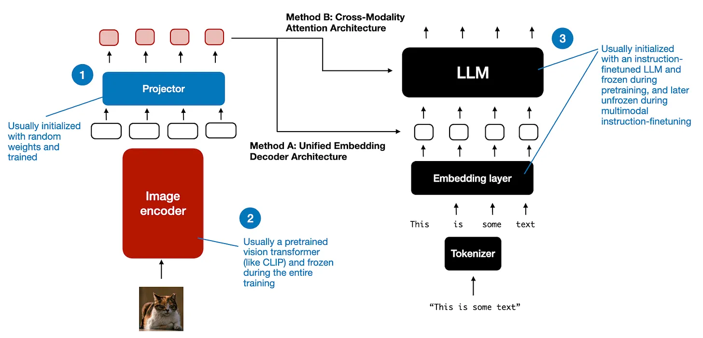{width="100%"}](#){data-modal-type="image" data-modal-url="figures/multimodal-training.png"}

Source: [Sebastian Raschka](https://magazine.sebastianraschka.com/p/understanding-multimodal-llms)
:::
:::
:::
:::

# What this means for society ⚠️ {background-color="#1B3A6B"}

## Class discussion: Where do we draw the line? 🤔

:::{style="margin-top: 30px; font-size: 24px;"}

**In small groups, discuss this question:**

**Voice/image generation**

Should AI-generated content require...

- Watermarks that can't be removed?
- Disclosure that it's AI-made?
- Consent from people being depicted?
- None of the above (free speech)?

[How would you enforce it?]{.alert}

:::{style="margin-top: 20px; text-align: center;"}
**Take 2 minutes, then we'll share perspectives!**
:::
:::

# Summary 📚 {background-color="#1B3A6B"}

## Main takeaways

:::{style="margin-top: 30px; font-size: 28px;"}

- `r fa('image')` **Images = grids of numbers**: AI learns to spot patterns, from edges to objects

- `r fa('music')` **Sound = pictures of vibrations**: We turn audio into spectrograms and use image AI!

- `r fa('brain')` **The big insight**: Text, images, and audio all become [embeddings]{.alert}, the same kind of numbers

- `r fa('link')` **Multimodal AI**: ChatGPT, Claude, and Gemini can see images because [everything speaks the same mathematical "language"]{.alert}

- `r fa('hand-paper')` **Hands-on**: You trained your own AI with Teachable Machine!

- `r fa('exclamation-triangle')` **Critical thinking**: Deepfakes, bias, and privacy are [real concerns]{.alert} we must address
:::

# ... and that's all for today! 🎉 {background-color="#1B3A6B"}