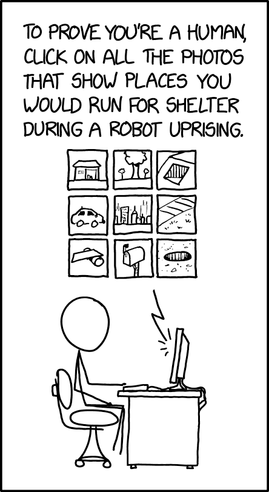

```{r setup, include=FALSE}
options(htmltools.dir.version = FALSE)
library(knitr)
opts_chunk$set(
  prompt = T,
  fig.align="center",
  dpi=300,
  cache=T,
  engine.opts = list(bash = "-l")
  )

knit_hooks$set(
  prompt = function(before, options, envir) {
    options(
      prompt = if (options$engine %in% c('sh','bash', 'zsh')) '$ ' else 'R> ',
      continue = if (options$engine %in% c('sh','bash', 'zsh')) '$ ' else '+ '
      )
})

options(repos = c(CRAN = "https://cran.rstudio.com/"))

if (!require("fontawesome", character.only = TRUE)) {
  install.packages("fontawesome", dependencies = TRUE)
  library(fontawesome, character.only = TRUE)
}
```

# Welcome back! 🧠 {background-color="#1B3A6B"}

## Today's plan

:::{style="margin-top: 50px; font-size: 32px;"}
- Quiz 01 is on [Thursday!]{.alert} (50 minutes, in class)
- The quiz tests [understanding and critical evaluation]{.alert}, not memorisation
- Today is [your session]{.alert}: I ask, you answer
  1. A rapid recap of the seven lectures
  2. One realistic scenario, broken down together
  3. Practice questions, alone or in pairs
  4. Open Q&A
- [Stop me]{.alert} whenever something is unclear! 😉
:::

## Quiz logistics

:::{style="margin-top: 40px; font-size: 28px;"}
- [Format:]{.alert} 4 questions plus one bonus, covering lectures 01 to 07
- [Length:]{.alert} 50 minutes, in person
- [Submission:]{.alert} one Word or PDF file, uploaded to Canvas
- [Allowed:]{.alert} laptops, notes, lecture slides, web search
- [AI assistants:]{.alert} use them sparingly, only when a question needs one
- [Honour code:]{.alert} write your own answers; if you used an AI, say which one
- [What is graded:]{.alert} your reasoning, not the polish of your AI's prose
- Your job is to [spot problems]{.alert}, [judge trade-offs]{.alert}, and
  [write something useful]{.alert}, better than the AI can
:::

## Comic of the day

:::{style="margin-top: 40px; font-size: 28px; text-align: center;"}
[{width="23%"}](#){data-modal-type="image" data-modal-url="figures/xkcd.png"}

Source: <https://xkcd.com/2228/>
:::

# Part 1: quick recap 🚀 {background-color="#1B3A6B"}

## How this part works

:::{style="margin-top: 30px; font-size: 30px;"}
- I name [a few concepts]{.alert} from one of the seven lectures
- One of you explains it in [your own words]{.alert} (about 30 seconds)
- The rest of us [push back, add nuance, or correct]{.alert}
- Wrong answers are useful; silence is not 😉
:::

## Concept 1: hallucination

:::{style="margin-top: 40px; font-size: 32px;"}
- In one sentence: [what is an AI hallucination, and why does it happen?]{.alert}
- Any volunteer or victim? 🙋
- Is a hallucination the same as a [lie]{.alert}? The same as a [factual error]{.alert}?
- Why might an open-laptop quiz [punish]{.alert} someone who copy-pastes an LLM answer? 😂
:::

## Concept 2: dataset and labels

:::{style="margin-top: 40px; font-size: 30px;"}
- Let's pick someone new!
- [What does it mean to "label" a dataset, and why is it often one of the most
  expensive steps?]{.alert}
- Room poll: [is the label easy, hard, or contested?]{.alert}
  - "Is this email spam?"
  - "Is this tweet toxic?"
  - "Is this CT scan showing pneumonia?"
  - "Is this résumé a good fit for the role?"
- Connect to: [garbage in, garbage out]{.alert}
:::

## Concept 3: the three learning paradigms

:::{style="margin-top: 30px; font-size: 28px;"}
- Three students, one paradigm each, one sentence per person:
  - [Supervised learning]{.alert}?
  - [Unsupervised learning]{.alert}?
  - [Reinforcement learning]{.alert}?
- Room: name one [real product]{.alert} that uses each
- Trick question: where does [training a chatbot with thumbs up / thumbs down]{.alert}
  fit?
:::

## Concept 4: precision vs recall

:::{style="margin-top: 30px; font-size: 28px;"}
- Volunteer to [draw the confusion matrix]{.alert} on the board (or describe it)
- [Precision]{.alert} (of what it flagged, how much was right) or [recall]{.alert}
  (of what it should have flagged, how much it caught)?
  - A detector that flags student essays as [AI-written]{.alert}
  - The [smoke alarm]{.alert} in your flat
  - YouTube [blocking an upload]{.alert} for copyright. Answer it once as the
    [creator]{.alert}, then again as the [rights holder]{.alert}
:::

## Concept 5: overfitting and validation

:::{style="margin-top: 30px; font-size: 28px;"}
- A model predicts [daily passenger numbers]{.alert} at Atlanta airport
  - Trained on [2019 to 2020]{.alert}: 99% of predictions within 5% of the truth
  - Validated on [2021]{.alert}, which it never saw: 97% within 5%
- Room: [would you use it today?]{.alert}
- Hint: what was air travel like in [2021]{.alert}? 
:::

## Concept 6: tokens and embeddings

:::{style="margin-top: 30px; font-size: 28px;"}
- Pair up with the person next to you. One minute. 🗣️
  - One of you explains [tokenisation]{.alert}
  - The other explains [embeddings]{.alert}
- Then I pick two pairs to share
- Rapid-fire:
  - Why does OpenAI's API charge by the [token]{.alert} and not by the word?
  - Why does the [order]{.alert} of words matter, even after embedding?
  - What is a [context window]{.alert}, and why does it cost so much to make it
    bigger?
:::

## Concept 7: multimodal

:::{style="margin-top: 30px; font-size: 28px;"}
- Last concept of the recap
- [What does "multimodal" mean for an AI system?]{.alert}
- Name three [modalities]{.alert} we discussed
- Why is [audio]{.alert} harder than text in some ways and easier in others?
- When you upload a photo to ChatGPT, what is happening [under the hood]{.alert}?
:::

# Part 2: a real scenario 🏥 {background-color="#1B3A6B"}

## The setup

:::{style="margin-top: 20px; font-size: 27px;"}
A fictional startup, [ClinicNote]{.alert}, sells an AI tool to hospitals. The tool
listens to doctor-patient conversations and writes the clinical note.

- The model is a [fine-tuned LLM]{.alert}
- Training data: 80,000 doctor-patient transcripts
  - All from [one hospital network]{.alert} in California
  - Collected between [2019 and 2024]{.alert}
- The labels are the [final clinical notes]{.alert} doctors wrote and signed off
- ClinicNote reports [92% agreement]{.alert} with doctor-written notes on a
  held-out test set
- They now sell the product to hospitals across the country
:::

## Question A

:::{style="margin-top: 30px; font-size: 28px;"}
- [What problems can you spot]{.alert} with the training data?
- Hints:
  - Where did the data come from? Who is in it? Who is [not]{.alert} in it?
  - The labels are [doctor-written notes]{.alert}: the truth, or one person's
    interpretation?
  - The data is from [2019-2024]{.alert}: does medicine change over five years?
- Try to name [at least three distinct issues]{.alert}
:::

## Question B

:::{style="margin-top: 30px; font-size: 28px;"}
- ClinicNote reports [92% agreement with doctor-written notes]{.alert}
- The doctor writes something wrong and the model copies it.
  [What does it score?]{.alert}
- Is the [8%]{.alert} spread evenly across patients?
- The same doctor writes that note again a week later.
  [Do the two versions agree 100%?]{.alert}
:::

## Question C

:::{style="margin-top: 30px; font-size: 28px;"}
- Your hospital is considering buying ClinicNote
- The room votes by show of hands:
  - [Yes, buy it]{.alert}
  - [No, do not buy it]{.alert}
  - [Buy it, but with conditions]{.alert}
- One defender of each position [argues for 60 seconds]{.alert}
- Then: [what evidence would change your mind?]{.alert}
:::

# Part 3: practice questions 📝 {background-color="#1B3A6B"}

## How this part works

:::{style="margin-top: 30px; font-size: 28px;"}
- I show you [three practice questions]{.alert}, one at a time
- Work alone or with the person next to you, as you prefer
- You have [a few minutes per question]{.alert}
- Then I pick someone to share, and the room critiques
- These are [not the real quiz questions]{.alert}, but the format is similar
:::

## Practice question 1

:::{style="margin-top: 20px; font-size: 26px;"}
Lecture 06 said a model never sees words, only [tokens]{.alert}.

Someone asks an older model how many times the letter [r]{.alert} appears in
"strawberry". It answers two. They then ask it to spell "strawberry" one
letter at a time, and it does so perfectly.

[Your task:]{.alert}

1. One answer is wrong, one is right. Explain how both come out of the
   [same machinery]{.alert}
2. The model has seen the word millions of times. Explain why that alone
   would not teach it the [spelling]{.alert}, and say what kind of text would
:::

## Practice question 2

:::{style="margin-top: 20px; font-size: 26px;"}
Lecture 06 showed you semantic search: a query for *"cheap flights"* finds a
page titled *"budget airfare"*, because those words sit close in embedding space.

Someone checks the same model and finds this:

::: {style="text-align: center; font-size: 30px; margin: 18px 0;"}
[cheap]{.alert} and [expensive]{.alert} also sit close together
:::

- The lecture said embeddings [capture meaning]{.alert}. Two opposites, side by side
- First: [how did that happen?]{.alert}
- Harder: why does a search for [*"cheap flights"*]{.alert} still work?
- Hint: Lecture 06 compared word2vec and attention. [When does each one look
  at the neighbours?]{.alert}
:::

## Practice question 3

:::{style="margin-top: 20px; font-size: 26px;"}
A delivery app introduces a bonus for its [best couriers]{.alert}. Six months
later, couriers avoid the hilly part of the city, refuse orders from restaurants
that are slow to cook, and several have been caught running red lights. 🛵

Nobody designed any of this.

[Your task:]{.alert}

1. Work backwards. What is the bonus [most likely measuring?]{.alert}
2. Pick one of the three behaviours and trace it [back to that measure]{.alert}
3. Is any of the three [understandable]{.alert}? Say which, and
   [who you would blame]{.alert}
:::

# Part 4: open Q&A 💬 {background-color="#1B3A6B"}

## Anything unclear

:::{style="margin-top: 50px; font-size: 32px;"}
- Your last chance before Thursday
- If [you]{.alert} are unsure, [others]{.alert} are too
- Topics most often asked about in past semesters:
  - [Embeddings]{.alert}: what does the vector "mean"?
  - [Validation vs test set]{.alert}: what is the difference?
  - [Multimodal]{.alert}: how does the model "see" an image?
  - [The proxy problem]{.alert}: when is a metric a bad proxy?
:::

# Many thanks and see you soon! 👋 {background-color="#1B3A6B"}
