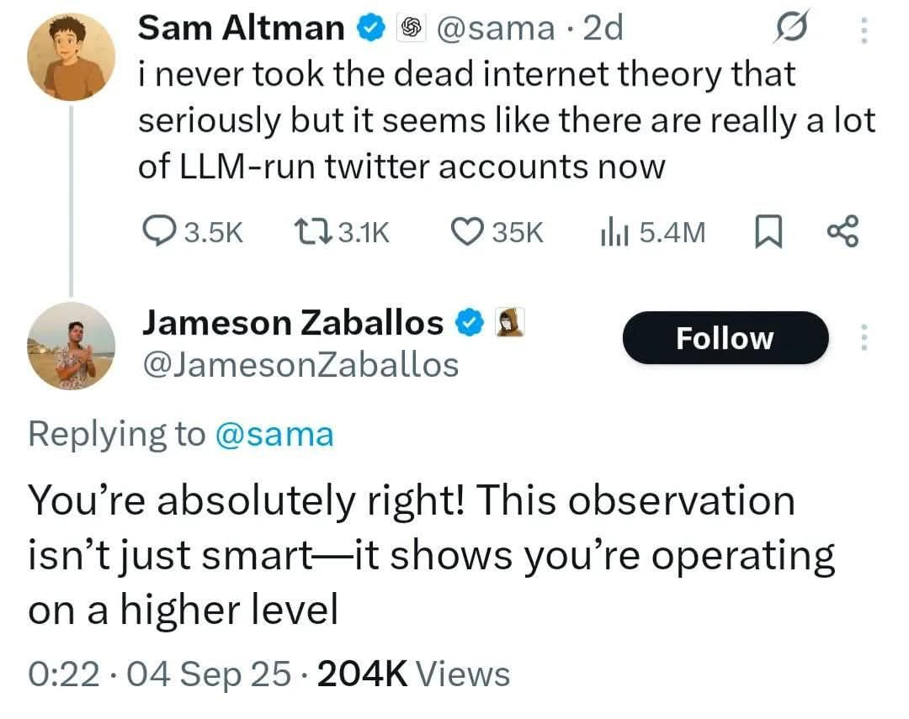
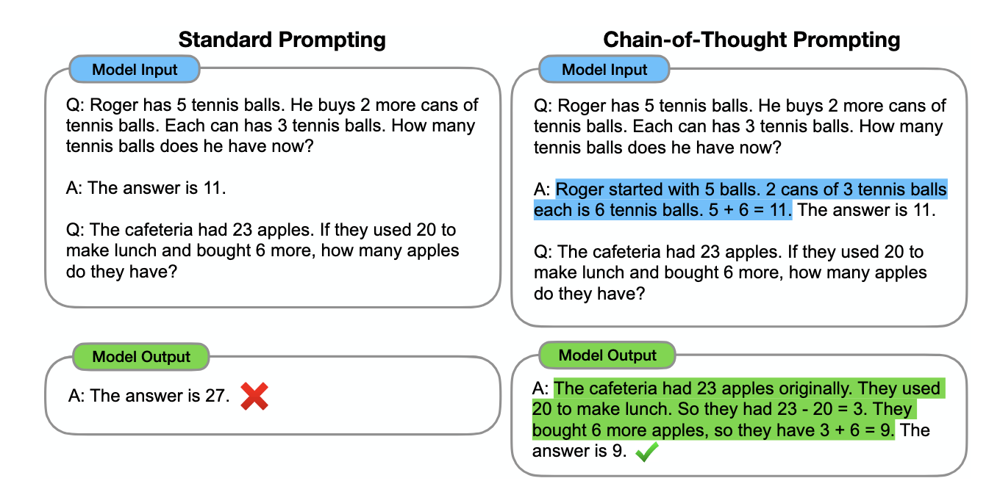

```{r setup, include=FALSE}
options(htmltools.dir.version = FALSE)
library(knitr)
opts_chunk$set(
  prompt = T,
  fig.align="center",
  dpi=300,
  cache=T,
  engine.opts = list(bash = "-l")
  )

knit_hooks$set(
  prompt = function(before, options, envir) {
    options(
      prompt = if (options$engine %in% c('sh','bash', 'zsh')) '$ ' else 'R> ',
      continue = if (options$engine %in% c('sh','bash', 'zsh')) '$ ' else '+ '
      )
})

options(repos = c(CRAN = "https://cran.rstudio.com/"))

if (!require("fontawesome", character.only = TRUE)) {
  install.packages("fontawesome", dependencies = TRUE)
  library(fontawesome, character.only = TRUE)
}
```

# Welcome back! 😊 {background-color="#2d4563"}

## Recap of last class

:::{style="margin-top: 20px; font-size: 26px;"}
:::{.columns}
:::{.column width=50%}
- Last time, we saw [how machines "see" and "hear"]{.alert}
- Images → pixels → numbers, Audio → spectrograms → numbers
- [Everything becomes embeddings]{.alert}, the same mathematical "language"
- We trained our own image classifier with Teachable Machine!
- We also learned how [multi-modal embeddings]{.alert} combine images and text
- **Today**: [How do we talk to AI effectively?]{.alert} 🗣️
- The same model can give vastly different results depending on [how you ask]{.alert}
:::

:::{.column width=50%}
:::{style="text-align: center; margin-top: -30px;"}
<!-- Suggested image: A wizard or person "whispering" to a computer/AI -->
[{width="100%"}](#){data-modal-type="image" data-modal-url="figures/prompt-engineering.webp"}

Source: [r/ProgrammerHumor](https://www.reddit.com/r/ProgrammerHumor/comments/1d36jx0/promptengineeringmanager/)
:::
:::
:::
:::

## Lecture overview
### What we'll cover today 🧙‍♂️

:::{style="margin-top: 20px; font-size: 22px;"}

:::{.columns}
:::{.column width=50%}
**Part 1: Why Prompting Matters**

- Same model, radically different results
- From vague to specific: the power of clarity

**Part 2: Prompt Engineering Fundamentals**

- The GOLDEN checklist for effective prompts
- Few-shot prompting: teaching by example

**Part 3: Advanced Techniques**

- Chain-of-Thought: "Let's think step by step"
- Meta-prompting: prompts about prompts
:::

:::{.column width=50%}
**Part 4: System Prompts and Personas**

- Giving AI a role and personality
- How companies customise their AI assistants

**Part 5: AI Agents**

- Beyond single prompts: tools and actions
- The future of autonomous AI

**Part 6: Finance Applications**

- Earnings analysis, sentiment, and research
:::
:::
:::

## Tweet of the day 😄

:::{style="text-align: center; margin-top: 30px;"}
[{width="55%"}](#){data-modal-type="image" data-modal-url="figures/tweet-of-the-day.jpg"}
:::

# Good and bad prompting 🎯 {background-color="#2d4563"}

## The same model, vastly different results

:::{style="margin-top: 30px; font-size: 23px;"}
:::{.columns}
:::{.column width=50%}
**Vague prompt:**

> "Tell me about Apple"

**What you might get:**

- A fruit? 🍎
- The company? 
- Which product?
- What aspect: history, stock price, or products?

[The AI has to guess what you mean]{.alert}

**The result**: Too generic, probably not what you wanted
:::

:::{.column width=50%}
**Specific prompt:**

> "Summarise Apple Inc's Q4 2025 earnings in 3 bullet points, focusing on iPhone revenue, services growth, and guidance for next quarter."

**What you get:**

- What you asked for
- Structured output
- Relevant details only

[You've removed the guesswork]{.alert}

**The result**: Useful and hopefully actionable!
:::
:::

:::{.fragment}
:::{style="margin-top: 20px; text-align: center; background: rgba(45, 69, 99, 0.1); padding: 15px; border-radius: 10px;"}
The model hasn't changed. Only your instructions have. **This is prompt engineering.**
:::
:::
:::

## Activity: First prompt challenge! 🎮
### Open your laptops and try this

:::{style="margin-top: 30px; font-size: 24px;"}
:::{.columns}
:::{.column width=55%}
**Go to one of these (pick your favourite):**

- [ChatGPT](https://chat.openai.com/)
- [Claude](https://claude.ai/)
- [Gemini](https://gemini.google.com/)

**Try these two prompts:**

1. **Vague**: "Explain inflation"
2. **Specific**: "Explain inflation to a university student studying economics. Use UK examples. Keep it under 150 words. Include one surprising fact."

**Compare the outputs:**

- Which is more useful?
- What's different about them?
:::

:::{.column width=45%}
:::{style="text-align: center;"}
[{width="100%"}](#){data-modal-type="image" data-modal-url="figures/prompt-comparison.png"}

:::{style="font-size: 18px; margin-top: 15px;"}
**Discussion**: What made the second prompt better?

Share with your neighbour! ⏱️ 3 minutes
:::
:::
:::
:::
:::

## The GIGO principle applies to LLMs

:::{style="margin-top: 30px; font-size: 26px;"}
:::{.columns}
:::{.column width=55%}
**[G]{.alert}arbage [I]{.alert}n, [G]{.alert}arbage [O]{.alert}ut**

- Classic computing principle from the 1960s
- For LLMs: [vague prompts → vague answers]{.alert}
- The model can only work with what you give it
- It's trained to be helpful, but [it can't read your mind]{.alert}

**Think of it like a genie:**

- "I wish to be rich" → Monkey's paw situation 🐒
- "I wish for £10 million in my UK bank account, legally obtained, by next Friday" → Specific, verifiable

[LLMs are sophisticated, but they need clear instructions]{.alert}
:::

:::{.column width=45%}
:::{style="text-align: center;"}
[{width="100%"}](#){data-modal-type="image" data-modal-url="figures/gigo.png"}

Source: [Medium](https://medium.com/)
:::
:::
:::
:::

# Prompt Engineering Fundamentals 📝 {background-color="#2d4563"}

## What is prompt engineering?

:::{style="margin-top: 30px; font-size: 24px;"}
:::{.columns}
:::{.column width=55%}
**Prompt engineering** is crafting inputs that get AI models to give you [what you actually want]{.alert}.

**It's NOT about:**

- ❌ Tricking the AI
- ❌ Finding magical words
- ❌ Complex technical jargon

**It IS about:**

- ✅ Clear communication
- ✅ Providing context
- ✅ Being specific about what you want
- ✅ Iterating and refining

[Anyone can learn this. It's a skill, not a secret.]{.alert}
:::

:::{.column width=45%}
:::{style="text-align: center;"}
[{width="100%"}](#){data-modal-type="image" data-modal-url="figures/prompt-engineering.png"}

:::{style="font-size: 18px; margin-top: 15px;"}
Prompt engineering: getting what you mean into words the AI understands
:::
:::
:::
:::
:::

## The GOLDEN checklist ✨

:::{style="margin-top: 30px; font-size: 22px;"}
:::{.columns}
:::{.column width=55%}
A framework for crafting effective prompts:

| Letter | Element | Question to Ask |
|--------|---------|-----------------|
| **G** | [Goal]{.alert} | What do I want to achieve? |
| **O** | [Output]{.alert} | What format/length/tone? |
| **L** | [Limits]{.alert} | What constraints apply? |
| **D** | [Data]{.alert} | What context should I provide? |
| **E** | [Evaluation]{.alert} | How will I know it worked? |
| **N** | [Next]{.alert} | What follow-up might I need? |
:::

:::{.column width=45%}
:::{style="background: rgba(45, 69, 99, 0.1); padding: 15px; border-radius: 10px;"}
**Example using GOLDEN:**

**Goal**: Summarise earnings report

**Output**: 5 bullet points, professional tone

**Limits**: Only Q4 2025 data, under 200 words

**Data**: "Here is Apple's press release..."

**Evaluation**: Should mention revenue, profit, and guidance

**Next**: "If revenue declined, explain why"
:::
:::
:::
:::

## Activity: Fix the bad prompt! 🔧
### Use the GOLDEN checklist

:::{style="margin-top: 30px; font-size: 22px;"}
:::{.columns}
:::{.column width=50%}
**Here's a terrible prompt:**

> "Write something about stocks"

**What's wrong with it?**

- No clear goal
- No output format
- No constraints
- No context
- No way to evaluate

**Your task**: Rewrite this using GOLDEN!

:::{style="margin-top: 20px;"}
**Share your improved prompt with a neighbour** ⏱️ 5 minutes
:::
:::

:::{.column width=50%}
**A possible GOLDEN version:**

> "Write a 300-word analysis of Tesla's stock performance in 2025. Structure it as:
> 
> 1. Key price movements
> 2. Main drivers (positive and negative)
> 3. Analyst consensus
> 
> Use a professional but accessible tone. Focus on facts, not opinions. If you include numbers, cite approximate sources."

:::{style="margin-top: 15px; font-size: 18px;"}
Notice how every element of GOLDEN is addressed!
:::
:::
:::
:::

## Few-shot prompting: Teaching by example

:::{style="margin-top: 30px; font-size: 22px;"}
:::{.columns}
:::{.column width=55%}
**Few-shot prompting** = Showing the AI 2-5 examples of what you want

Instead of explaining, [demonstrate]{.alert}:

:::{style="background: rgba(45, 69, 99, 0.1); padding: 15px; border-radius: 10px; font-size: 20px;"}
**Prompt:**

Classify these headlines as Positive, Negative, or Neutral:

- "Apple beats earnings expectations" → Positive
- "Tech stocks tumble on interest rate fears" → Negative  
- "Markets close unchanged after quiet session" → Neutral

Now classify: "Tesla announces record deliveries"
:::

The AI learns the [pattern]{.alert} from your examples!
:::

:::{.column width=45%}
**Why it works:**

- LLMs are [pattern-matching machines]{.alert}
- Examples show exact format and style
- Reduces ambiguity dramatically
- Works even for subjective tasks

**When to use:**

- Classification tasks
- Formatting requirements
- Tone/style matching
- Domain-specific outputs

:::{style="text-align: center; margin-top: 15px;"}
[{width="100%"}](#){data-modal-type="image" data-modal-url="figures/few-shot.png"}
:::
:::
:::
:::

# Advanced Techniques 🚀 {background-color="#2d4563"}

## Chain-of-Thought prompting
### "Let's think step by step"

:::{style="margin-top: 30px; font-size: 22px;"}
:::{.columns}
:::{.column width=55%}
**Chain-of-Thought (CoT)** prompting asks the AI to [show its reasoning]{.alert} before giving a final answer.

**The magic words**: "Let's think through this step by step"

**Without CoT:**

> "Should I invest in Company X?"
> 
> **Answer**: "It depends on your risk tolerance..."

**With CoT:**

> "Should I invest in Company X? Think through this step by step, considering: 1) Financial health, 2) Market position, 3) Growth potential, 4) Risks"

[The AI now reasons through each factor]{.alert}
:::

:::{.column width=45%}
**Why CoT works:**

1. Forces [structured thinking]{.alert}
2. Reduces errors in complex problems
3. Makes reasoning [transparent]{.alert}
4. Produces more nuanced answers

**Best for:**

- Maths and logic problems
- Multi-step analysis
- Complex decision-making
- When you need to verify reasoning

:::{style="text-align: center; margin-top: 15px;"}
[{width="100%"}](#){data-modal-type="image" data-modal-url="figures/chain-of-thought.png"}
:::
:::
:::
:::

## Activity: Chain-of-Thought challenge! 🧠

:::{style="margin-top: 30px; font-size: 24px;"}
:::{.columns}
:::{.column width=50%}
**Try this logic problem both ways:**

> "A bat and ball cost £1.10 together. The bat costs £1 more than the ball. How much does the ball cost?"

**Prompt 1 (no CoT):**

> "A bat and ball cost £1.10. The bat costs £1 more than the ball. What does the ball cost?"

**Prompt 2 (with CoT):**

> "A bat and ball cost £1.10. The bat costs £1 more than the ball. What does the ball cost? Think through this step by step."
:::

:::{.column width=50%}
**What to observe:**

- Does the AI get the right answer? (It's NOT £0.10!)
- How does reasoning change the output?
- Can you follow the logic?

:::{.fragment}
:::{style="background: rgba(45, 69, 99, 0.1); padding: 15px; border-radius: 10px;"}
**The answer**: £0.05

If ball = £0.05, then bat = £1.05

£0.05 + £1.05 = £1.10 ✓

[Many people (and sometimes AI!) incorrectly say £0.10]{.alert}
:::
:::

:::{style="margin-top: 20px;"}
⏱️ 4 minutes to test both prompts!
:::
:::
:::
:::

## Zero-shot vs. Few-shot CoT

:::{style="margin-top: 30px; font-size: 24px;"}
:::{.columns}
:::{.column width=50%}
**Zero-shot CoT**

Just add: "Think step by step"

```text
Q: If John has 3 apples and gives 
away half, how many remain?

Think step by step.
```

- Quick and easy
- Works for many problems
- No examples needed
:::

:::{.column width=50%}
**Few-shot CoT**

Provide examples WITH reasoning:

```text
Q: Tom has 4 oranges, eats 1. 
How many left?
A: Tom starts with 4. He eats 1.
4 - 1 = 3. Answer: 3 oranges.

Q: Sarah has 6 pens, loses 2. 
How many left?
```

- More reliable for complex tasks
- Sets the reasoning pattern
- Better for domain-specific problems
:::
:::

:::{style="margin-top: 20px; text-align: center; background: rgba(45, 69, 99, 0.1); padding: 15px; border-radius: 10px;"}
[Rule of thumb]{.alert}: Start with zero-shot CoT. If that fails, add examples (few-shot CoT).
:::
:::

# Meta-Prompting and System Prompts 🎭 {background-color="#2d4563"}

## What is meta-prompting?

:::{style="margin-top: 30px; font-size: 24px;"}
:::{.columns}
:::{.column width=55%}
**Meta-prompting** = [Asking the AI to help you ask better questions]{.alert}

Instead of asking directly, ask the AI to help you ask better:

:::{style="background: rgba(45, 69, 99, 0.1); padding: 15px; border-radius: 10px; font-size: 20px;"}
**Example:**

"I want to analyse quarterly earnings reports. What questions should I ask you to get the most insightful analysis?"
:::

**The AI will suggest:**

- Specific metrics to request
- Comparisons to consider
- Format recommendations
- Follow-up questions

[Let the AI teach you how to prompt it!]{.alert}
:::

:::{.column width=45%}
**Other meta-prompting patterns:**

- "What information do you need from me to answer this better?"
- "How could I rephrase this question for a clearer answer?"
- "What am I not asking that I should be?"

**Why it works:**

- The AI knows what it can and can't do well
- Shows you what you might be missing
- Gets better with each round
- You and the AI work together

:::{style="text-align: center; margin-top: 15px;"}
[{width="100%"}](#){data-modal-type="image" data-modal-url="figures/meta-prompting.png"}
:::
:::
:::
:::

## System prompts and personas

:::{style="margin-top: 30px; font-size: 22px;"}
:::{.columns}
:::{.column width=55%}
**System prompts** set the AI's behaviour for an entire conversation.

**Personas = Giving the AI a role:**

:::{style="background: rgba(45, 69, 99, 0.1); padding: 15px; border-radius: 10px; font-size: 20px;"}
"You are an experienced financial analyst with 20 years on Wall Street. You specialise in tech stocks and are known for your balanced, data-driven analysis. Always cite specific metrics and avoid speculation."
:::

**What changes:**

- Vocabulary becomes more technical
- Responses are more structured
- Caveats and nuances appear
- Domain expertise shows
:::

:::{.column width=45%}
**Real-world examples:**

- **Customer service bots**: Friendly, patient, solution-oriented
- **Coding assistants**: Technical, precise, security-conscious
- **Writing helpers**: Matches requested tone and style
- **Educational tutors**: Encouraging, Socratic method

**The Anthropic approach:**

- They call it "context engineering"
- System prompts set [guardrails]{.alert}
- Define personality AND constraints
- Specify what NOT to do

:::{style="text-align: center; margin-top: 10px;"}
[{width="100%"}](#){data-modal-type="image" data-modal-url="figures/system-prompts.png"}
:::
:::
:::
:::

## Activity: Persona showdown! 🎭

:::{style="margin-top: 30px; font-size: 24px;"}
:::{.columns}
:::{.column width=50%}
**The same question, two personas:**

**Question:**

> "Is Tesla a good investment right now?"

**Persona 1 (default):**

Just ask the question normally.

**Persona 2 (expert):**

> "You are a risk-averse financial analyst who always considers both bull and bear cases. Analyse with specific metrics."
:::

:::{.column width=50%}
**What to compare:**

- Depth of analysis
- Use of specific data
- Balance of perspectives
- Confidence level
- Caveats and disclaimers

:::{style="margin-top: 20px;"}
**Discussion:**

- Which response would you trust more?
- What did the persona add/change?
- How might a "bullish analyst" respond differently?
:::

:::{style="margin-top: 20px;"}
⏱️ 4 minutes to test both approaches!
:::
:::
:::
:::

# AI Agents 🤖 {background-color="#2d4563"}

## Beyond single prompts: What are AI agents?

:::{style="margin-top: 30px; font-size: 22px;"}
:::{.columns}
:::{.column width=55%}
**AI Agents** = LLMs that can [use tools, take actions, and reason iteratively]{.alert}

**Regular LLM:**

- You ask → It answers → Done

**AI Agent:**

- You ask → It thinks → Uses tools → Checks → Refines → Answers

**The ReAct loop:**

1. **Reason**: "I need to find today's stock price"
2. **Act**: Uses web browsing tool
3. **Observe**: "Tesla is at $248.50"
4. **Repeat**: "Now I need to compare to last week..."
:::

:::{.column width=45%}
**Examples in the wild:**

| Agent | What It Does |
|-------|--------------|
| [Claude Code](https://claude.ai/) | Writes, tests, and fixes code |
| [Deep Research](https://gemini.google.com/) | Researches topics autonomously |
| [Cursor](https://cursor.sh/) | AI coding assistant |
| [Perplexity](https://perplexity.ai/) | Research with citations |

:::{style="text-align: center; margin-top: 15px;"}
[{width="100%"}](#){data-modal-type="image" data-modal-url="figures/ai-agents.png"}
:::
:::
:::
:::

## Agentic workflows

:::{style="margin-top: 30px; font-size: 22px;"}
:::{.columns}
:::{.column width=55%}
**Agentic workflows** = Multiple AI steps working together

:::{style="font-size: 18px;"}
```text
┌─────────────────────────────────────────┐
│   USER REQUEST: "Analyse Apple's Q4"    │
└───────────────────┬─────────────────────┘
                    ▼
┌─────────────────────────────────────────┐
│  Agent 1: Research Agent                │
│  → Searches for earnings reports        │
│  → Finds analyst opinions               │
└───────────────────┬─────────────────────┘
                    ▼
┌─────────────────────────────────────────┐
│  Agent 2: Analysis Agent                │
│  → Extracts key metrics                 │
│  → Compares to expectations             │
└───────────────────┬─────────────────────┘
                    ▼
┌─────────────────────────────────────────┐
│  Agent 3: Writing Agent                 │
│  → Drafts summary report                │
│  → Formats for presentation             │
└─────────────────────────────────────────┘
```
:::
:::

:::{.column width=45%}
**Why this matters:**

- [Specialisation]{.alert}: Each agent does one thing well
- [Reliability]{.alert}: Mistakes get caught between steps
- [Scalability]{.alert}: Can handle big, multi-step problems
- [Auditability]{.alert}: See what happened at each stage

**Human-in-the-loop:**

- Critical decisions still need humans
- Agents can ask for clarification
- You set the guardrails

:::{style="text-align: center; margin-top: 10px;"}
[{width="100%"}](#){data-modal-type="image" data-modal-url="figures/agentic-workflow.png"}
:::
:::
:::
:::

## Activity: Build a mini agent prompt! 🛠️

:::{style="margin-top: 30px; font-size: 22px;"}
:::{.columns}
:::{.column width=50%}
**Your task**: Write a prompt that instructs an AI to research a topic systematically.

**Template:**

> "I want you to research [TOPIC]. Follow these steps:
> 
> 1. First, identify the 3 most important questions to answer
> 2. For each question, explain what you'd need to know
> 3. Answer each question based on your knowledge
> 4. Summarise your findings with confidence levels (high/medium/low)
> 5. List what additional information would improve your analysis"
:::

:::{.column width=50%}
**Try it with:**

- "The impact of AI on the job market"
- "Whether cryptocurrency is a good investment"
- "The future of electric vehicles"

**Observe:**

- Does the AI follow the structure?
- Are the questions sensible?
- Does it acknowledge uncertainty?

:::{style="margin-top: 20px;"}
⏱️ 5 minutes to create and test your agent prompt!
:::
:::
:::
:::

## The future: More autonomous AI

:::{style="margin-top: 30px; font-size: 24px;"}
:::{.columns}
:::{.column width=55%}
**Where we're heading:**

- From [chatbots to actual collaborators]{.alert}
- AI that can work overnight on complex tasks
- Multiple specialised agents working together
- "Computer use": AI controlling your desktop

**Current limitations:**

- Still makes mistakes (needs verification)
- Can get stuck in loops
- Needs clear boundaries and guardrails
- Expensive for long-running tasks

**Ethical considerations:**

- Who's responsible when an agent acts?
- What decisions should AI never make alone?
- How do we maintain oversight?
:::

:::{.column width=45%}
:::{style="text-align: center;"}
[{width="100%"}](#){data-modal-type="image" data-modal-url="figures/autonomous-ai.png"}

:::{style="font-size: 18px; margin-top: 10px;"}
Tools are becoming collaborators
:::
:::

:::{style="margin-top: 20px; background: rgba(230, 57, 70, 0.1); padding: 15px; border-radius: 10px;"}
[Key principle]{.alert}: Keep humans in the loop for high-stakes decisions. AI should augment human judgement, not replace it.
:::
:::
:::
:::

## A little warning: Artificial Jagged Intelligence ⚠️

:::{style="margin-top: 30px; font-size: 22px;"}
:::{.columns}
:::{.column width=55%}
Even with [perfect prompting]{.alert}, AI can fail unexpectedly.

**The "jaggedness" problem** ([Gans, 2025](https://www.nber.org/papers/w34712)):

- LLMs show [highly uneven performance]{.alert} across seemingly similar tasks
- Excellent on one prompt, but [confidently wrong]{.alert} on another with only small wording changes
- This isn't a bug. It's a [fundamental feature]{.alert}.

**The "bus stop" analogy:**

- Think of AI knowledge as scattered points on a landscape
- Between knowledge points, it extrapolates (guesses)
- Like waiting for buses: [you spend more time in the longer gaps]{.alert}
- You experience AI's biggest knowledge gaps most frequently!
:::

:::{.column width=45%}
**What this means for you:**

- Good prompting is [necessary but not sufficient]{.alert}
- Benchmark scores ≠ your experience
- [Scaling helps averages, but gaps remain]{.alert}
- Learning "where the model works" takes time

:::{style="background: rgba(230, 57, 70, 0.15); padding: 15px; border-radius: 10px; margin-top: 15px;"}
[Key insight]{.alert}: Mastery isn't just about prompting. It's about building a mental [reliability map]{.alert}: knowing where AI does well, where it stumbles, and when you need to double-check.
:::

:::{style="font-size: 18px; margin-top: 15px; text-align: center;"}
Jagged intelligence isn't a bug that scaling will fix—it's how these models work. 🧩
:::
:::
:::
:::

# Finance Applications 💰 {background-color="#2d4563"}

## Practical finance prompts

:::{style="margin-top: 30px; font-size: 20px;"}
:::{.columns}
:::{.column width=50%}
**Earnings report analysis:**

:::{style="background: rgba(45, 69, 99, 0.1); padding: 15px; border-radius: 10px; font-size: 18px;"}
"Analyse [Company]'s Q4 earnings. Extract:

1. Revenue vs. consensus estimate
2. EPS vs. expectations  
3. Key growth drivers
4. Management's guidance
5. Red flags or concerns

Present as a structured summary with bullet points."
:::

**Stock sentiment analysis:**

:::{style="background: rgba(45, 69, 99, 0.1); padding: 15px; border-radius: 10px; font-size: 18px;"}
"Analyse the sentiment of these 5 recent headlines about Tesla. Classify each as Bullish, Bearish, or Neutral. Explain your reasoning briefly."
:::
:::

:::{.column width=50%}
**Investment thesis:**

:::{style="background: rgba(45, 69, 99, 0.1); padding: 15px; border-radius: 10px; font-size: 18px;"}
"Create a bull case and bear case for investing in [Company]. For each:

- 3 key arguments
- Supporting data points
- Main risks to the thesis
- Time horizon considerations"
:::

**Risk assessment:**

:::{style="background: rgba(45, 69, 99, 0.1); padding: 15px; border-radius: 10px; font-size: 18px;"}
"Identify the top 5 risks facing [Industry] in 2026. For each risk, rate severity (1-5) and likelihood (1-5). Explain mitigation strategies."
:::
:::
:::
:::

## Activity: Financial analyst challenge! 📊

:::{style="margin-top: 30px; font-size: 22px;"}
:::{.columns}
:::{.column width=50%}
**Your mission**: Analyse a real company like a financial analyst.

**Pick one** (or choose your own):

- Apple (AAPL)
- Microsoft (MSFT)
- Tesla (TSLA)
- Nvidia (NVDA)

**Craft a prompt that:**

1. Requests key financial metrics
2. Compares to competitors
3. Identifies growth opportunities
4. Highlights risks
5. Gives a balanced conclusion

**Use techniques from today:**

- GOLDEN checklist
- Chain-of-Thought
- Persona (financial analyst)
:::

:::{.column width=50%}
**Example strong prompt:**

> "You are a senior equity analyst at a major investment bank. Analyse [Company] for a client considering a medium-term investment (2-3 years).
>
> Think through this step by step:
> 1. Assess current financial health
> 2. Evaluate competitive position
> 3. Identify growth catalysts
> 4. List key risks
> 5. Provide a balanced view
>
> Format as a brief analyst note (300 words). Include specific metrics where possible. Acknowledge any limitations in your analysis."

⏱️ 8 minutes to craft and test your prompt!
:::
:::
:::

## Worked example: Tesla analysis

:::{style="margin-top: 30px; font-size: 20px;"}
:::{.columns}
:::{.column width=50%}
**Prompt evolution:**

**v1 (bad):** "Is Tesla a good stock?"

**v2 (better):** "Analyse Tesla stock for investment"

**v3 (good):** "Analyse Tesla as an investment. Cover financials, competition, and risks."

**v4 (excellent):**

> "You are a balanced equity analyst. Analyse Tesla (TSLA) as a potential investment.
>
> Consider: 1) EV market position, 2) Revenue and margin trends, 3) Competition from traditional automakers, 4) Energy and AI businesses, 5) Key risks.
>
> Rate as Buy/Hold/Sell with confidence level. Limit to 250 words."
:::

:::{.column width=50%}
**What each version added:**

| Version | Improvement |
|---------|-------------|
| v1 → v2 | Specific action (analyse) |
| v2 → v3 | Structure (categories) |
| v3 → v4 | Persona + specifics + constraints |

**Key takeaways:**

- [Iteration improves outputs]{.alert}
- Constraints (word count) focus the response
- Personas add expertise and balance
- Specific categories ensure coverage

:::{style="margin-top: 15px; font-size: 18px;"}
💡 **Pro tip**: Save your best prompts as templates for reuse!
:::
:::
:::
:::

# Summary 📚 {background-color="#2d4563"}

## Main takeaways

:::{style="margin-top: 30px; font-size: 26px;"}

- `r fa('bullseye')` **Clarity beats complexity**: Specific prompts get specific answers. Remove the guesswork.

- `r fa('list-check')` **The GOLDEN checklist**: Goal, Output, Limits, Data, Evaluation, Next. A framework for every prompt.

- `r fa('brain')` **Chain-of-Thought**: "Think step by step" unlocks better reasoning for complex problems

- `r fa('user-tie')` **Personas and system prompts**: Give AI a role to get expert-like responses

- `r fa('robot')` **AI agents**: The future is LLMs that can use tools, take actions, and work iteratively

- `r fa('chart-line')` **Finance applications**: Structured prompts work well for earnings analysis, sentiment, and research

:::

## Your prompt engineering toolkit

:::{style="margin-top: 30px; font-size: 24px;"}
:::{.columns}
:::{.column width=50%}
**Quick reference:**

| Technique | When to Use |
|-----------|-------------|
| [GOLDEN]{.alert} | Any prompt (checklist) |
| [Few-shot]{.alert} | Classification, formatting |
| [Chain-of-Thought]{.alert} | Complex reasoning |
| [Meta-prompting]{.alert} | When stuck |
| [Personas]{.alert} | Domain expertise |
| [Agentic prompts]{.alert} | Multi-step research |
:::

:::{.column width=50%}
**Remember:**

- Start simple, then iterate
- Be specific but not over-constrained
- Show examples when possible
- Ask the AI for help improving
- Save your best prompts!

:::{style="text-align: center; margin-top: 30px;"}
[{width="80%"}](#){data-modal-type="image" data-modal-url="figures/toolkit.png"}
:::
:::
:::
:::

## Further reading

:::{style="margin-top: 30px; font-size: 22px;"}
:::{.columns}
:::{.column width=50%}
**Official guides:**

- Anthropic (2025). [Prompt Engineering Guide](https://docs.anthropic.com/en/docs/build-with-claude/prompt-engineering). Comprehensive best practices.
- OpenAI (2025). [Prompt Engineering](https://platform.openai.com/docs/guides/prompt-engineering). OpenAI's official guide.
- Google (2025). [Prompting Essentials](https://grow.google/prompting-essentials/). Free course on Coursera.

**Academic and in-depth:**

- Wei, J., et al. (2022). [Chain-of-Thought Prompting Elicits Reasoning](https://arxiv.org/abs/2201.11903). The original CoT paper.
- [Prompting Guide](https://www.promptingguide.ai/). Community-maintained reference with examples.
:::

:::{.column width=50%}
**Tools to practice:**

- [ChatGPT](https://chat.openai.com/) – Most popular
- [Claude](https://claude.ai/) – Best for long documents
- [Gemini](https://gemini.google.com/) – Multimodal
- [Perplexity](https://perplexity.ai/) – Research with citations

**On AI agents:**

- IBM (2025). [What Are Agentic Workflows?](https://www.ibm.com/topics/agentic-workflows)
- [LangChain Agents](https://python.langchain.com/docs/concepts/agents/). Technical introduction.
:::
:::
:::

# ...and that's all for today! 🎉 {background-color="#2d4563"}

## Key skills you learned

:::{style="margin-top: 40px; font-size: 28px; text-align: center;"}

✅ How to transform vague prompts into specific, effective ones

✅ The GOLDEN checklist for crafting any prompt

✅ Chain-of-Thought reasoning for complex problems

✅ Using personas and system prompts for expertise

✅ Understanding AI agents and agentic workflows

✅ Applying these techniques to finance and beyond

:::

# See you next time! 👋 {background-color="#2d4563"}

:::{style="text-align: center; margin-top: 100px; font-size: 28px;"}
**Questions?**

Feel free to reach out: [danilo.freire@emory.edu](mailto:danilo.freire@emory.edu)

**Practice makes perfect—keep prompting!** 🧙‍♂️
:::
