```{r setup, include=FALSE}
options(htmltools.dir.version = FALSE)
library(knitr)
opts_chunk$set(
  prompt = T,
  fig.align="center",
  dpi=300,
  cache=T,
  engine.opts = list(bash = "-l")
  )

knit_hooks$set(
  prompt = function(before, options, envir) {
    options(
      prompt = if (options$engine %in% c('sh','bash', 'zsh')) '$ ' else 'R> ',
      continue = if (options$engine %in% c('sh','bash', 'zsh')) '$ ' else '+ '
      )
})

options(repos = c(CRAN = "https://cran.rstudio.com/"))

if (!require("fontawesome", character.only = TRUE)) {
  install.packages("fontawesome", dependencies = TRUE)
  library(fontawesome, character.only = TRUE)
}
```

# Welcome back! 📚 {background-color="#1B3A6B"}

## Recap of last class

:::{style="margin-top: 50px; font-size: 28px;"}
:::{.columns}
:::{.column width=50%}
- Last time: [hallucinations]{.alert}
- [Why they happen]{.alert}: no fact-checking mechanism, sycophancy
- [Types]{.alert}: factual errors, fake citations, logical contradictions
- Higher risk for: recent events, legal/medical, obscure topics
- Prompting helps, but [doesn't fully solve]{.alert} the problem
- [Today]{.alert}: what if AI could access [your own documents]{.alert}? 📄
:::

:::{.column width=50%}
:::{style="text-align: center; margin-top: -10px;"}
[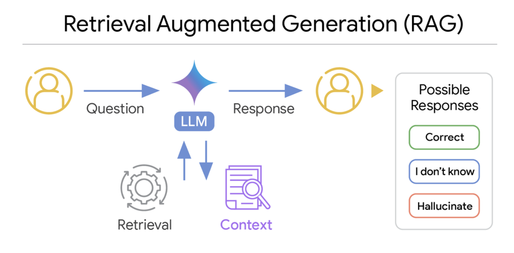{width="100%"}](#){data-modal-type="image" data-modal-url="figures/rag-concept.png"}

Source: [Google Research](https://research.google/blog/deeper-insights-into-retrieval-augmented-generation-the-role-of-sufficient-context/)
:::
:::
:::
:::

## Lecture overview
### Today's agenda

:::{style="margin-top: 20px; font-size: 26px;"}

:::{.columns}
:::{.column width=50%}
**Part 1: The Problem**

- Quick recap: hallucinations (from Lecture 10)
- The knowledge cutoff issue
- How RAG solves both problems

**Part 2: Semantic Search**

- Finding by meaning, not just keywords
- Quick embeddings recap
- Why this matters for RAG
:::

:::{.column width=50%}
**Part 3: The RAG Pipeline**

- How documents become searchable
- Chunking, embedding, retrieving
- From question to grounded answer

**Part 4: No-Code Tools**

- NotebookLM, Perplexity
- Build your own RAG system today! 🛠️
:::
:::
:::

## Meme of the day 😄

:::{style="text-align: center; margin-top: 24px;"}
[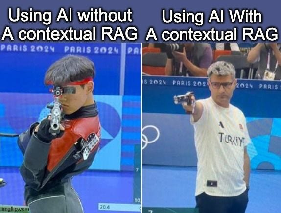{width="60%"}](#){data-modal-type="image" data-modal-url="figures/meme-of-the-day.jpg"}

Source: [Bhavishya Pandit](https://bhavishyapandit9.substack.com/p/multimodal-retrieval-augmented-generation)
:::

## Quick recap: Hallucinations 🤥

:::{style="margin-top: 30px; font-size: 23px;"}
:::{.columns}
:::{.column width=55%}
- LLMs are [pattern-matching machines]{.alert}: they generate text that fits statistical expectations
- They have [no internal verification system]{.alert} for truth
- They'd rather [make something up than admit ignorance]{.alert}
- Training mixes [credible sources with unreliable ones]{.alert}
- Fabricated answers sound [just as convincing]{.alert} as accurate ones

:::{style="margin-top: 20px; background: rgba(230, 57, 70, 0.1); padding: 15px; border-radius: 10px;"}
**The main question for today:**

What if we could give the LLM [access to real, verified information]{.alert} when answering?
:::
:::

:::{.column width=45%}
:::{style="text-align: center;"}
[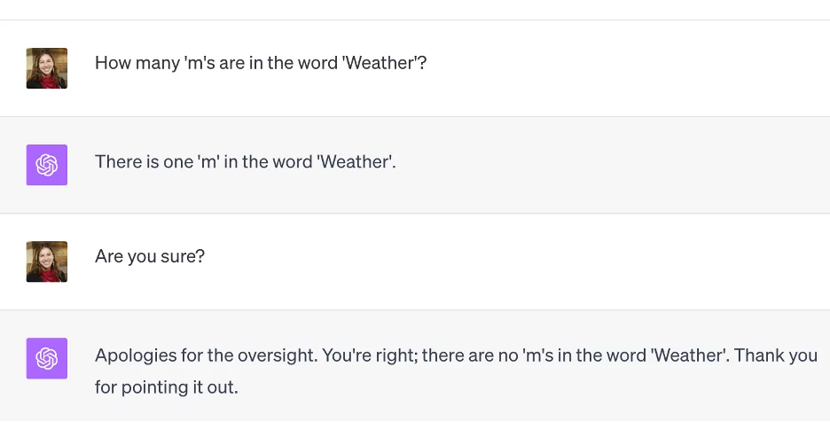{width="100%"}](#){data-modal-type="image" data-modal-url="figures/hallucination-example.webp"}

:::{style="font-size: 18px; margin-top: 15px;"}
What if the LLM could look things up before answering?
:::

Source: [Iguazio](https://www.iguazio.com/glossary/llm-hallucination/)
:::
:::
:::
:::

## The solution: Give AI access to real information!

:::{style="margin-top: 30px; font-size: 23px;"}
:::{.columns}
:::{.column width=55%}
**RAG = [R]{.alert}etrieval-[A]{.alert}ugmented [G]{.alert}eneration**

**The main idea:**

1. You ask a question
2. [Search your documents]{.alert} for relevant information
3. Give that information to the LLM
4. The LLM answers [using your data]{.alert}

**Why this works:**

- The LLM gets [real, up-to-date information]{.alert}
- Answers are [grounded]{.alert} in your documents
- It can [cite sources]{.alert}, so you can verify them
- No need to retrain the model

[It's like giving the AI an open-book exam!]{.alert} 📖
:::

:::{.column width=45%}
:::{style="text-align: center;"}
[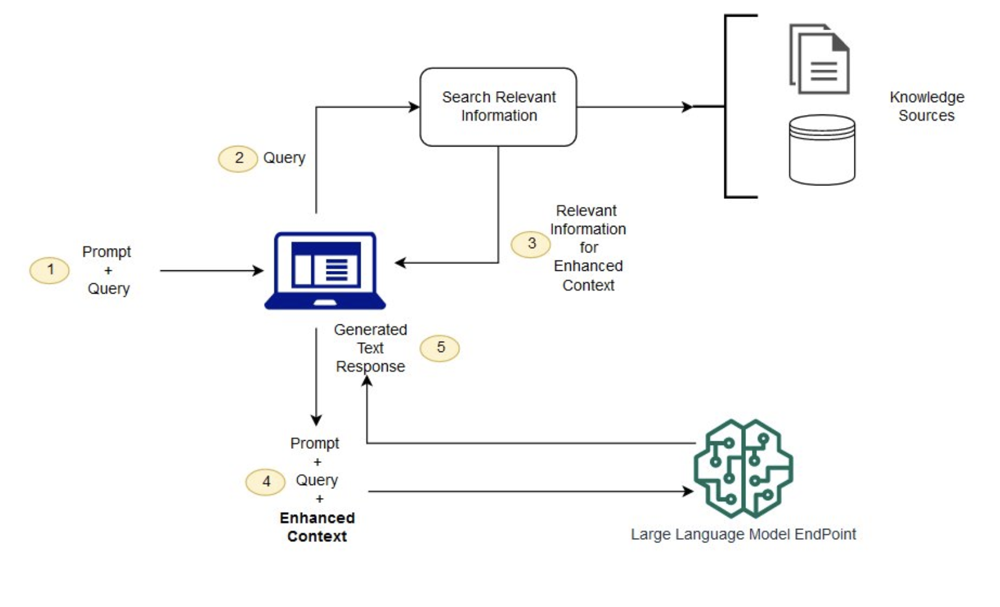{width="100%"}](#){data-modal-type="image" data-modal-url="figures/rag-simple-diagram.png"}

Source: [AWS](https://aws.amazon.com/what-is/retrieval-augmented-generation/)
:::
:::
:::
:::

# Semantic Search 🔍 {background-color="#1B3A6B"}

## Traditional search vs. semantic search

:::{style="margin-top: 30px; font-size: 20px;"}
:::{.columns}
:::{.column width=55%}
:::{style="font-size: 26px; margin-top: 15px;"}
| Feature | Keyword Search | Semantic Search |
|---------|---------------|----------------|
| **Matching** | Exact words only | Meaning-based |
| **"cheap flights"** | ✅ "cheap flights" | ✅ "budget airfare" too! |
| **Synonyms** | ❌ Misses them | ✅ Understands them |
| **Typos** | ❌ Breaks results | ✅ Often still works |
| **Context** | ❌ Ignores it | ✅ Considers it |
| **Technology** | String matching | [Embeddings]{.alert} |
:::

:::{style="margin-top: 40px; font-size: 22px;"}
**Example query**: "How do I fix a broken pipe?"

- Keyword search: only documents with "broken pipe"
- Semantic search: also "plumbing repair", "leaky faucet solutions"
:::
:::

:::{.column width=45%}
**Why does this matter for RAG?**

- Users ask in [natural language]{.alert}; your documents use [different terminology]{.alert}
- Semantic search bridges this gap

:::{style="text-align: center; margin-top: 15px;"}
[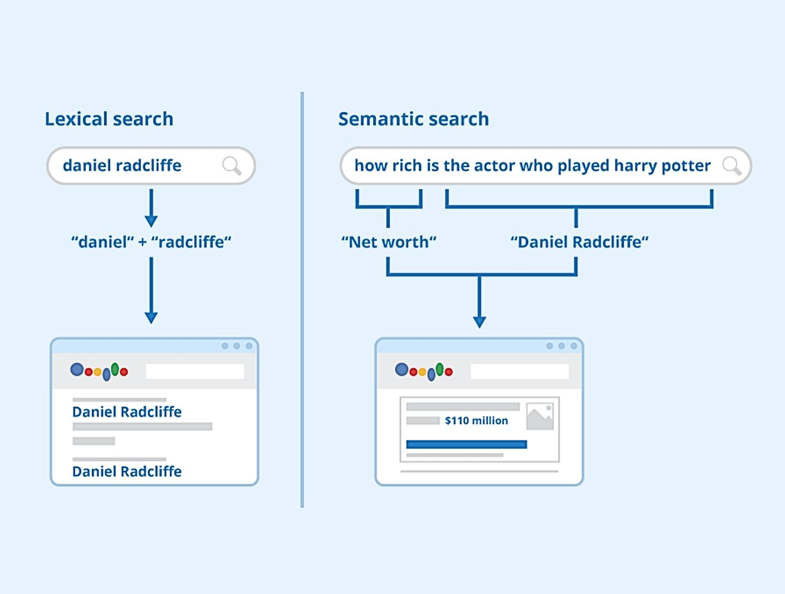{width="100%"}](#){data-modal-type="image" data-modal-url="figures/semantic-vs-keyword.png"}
:::
:::
:::
:::

## How semantic search works: Embeddings

:::{style="margin-top: 30px; font-size: 20px;"}
:::{.columns}
:::{.column width=55%}
**From Lecture 06:**

Text becomes [vectors]{.alert} (lists of numbers):

| Text | Vector (simplified) |
|------|--------------------|
| "king" | [0.82, 0.15, -0.43, ...] |
| "queen" | [0.79, 0.18, -0.41, ...] |
| "apple" | [-0.12, 0.67, 0.23, ...] |

**Key properties:**

- Similar meanings → [similar vectors]{.alert}
- "king" and "queen" are close in vector space; "king" and "apple" are far apart
- Modern embedding models produce [768 to 3,072 dimensions]{.alert}

| Model | Dimensions | Use Case |
|-------|------------|----------|
| OpenAI ada-002 | 1,536 | General purpose |
| Google Gecko | 768 | Lightweight |
| Cohere Embed v3 | 1,024 | Multilingual |
:::

:::{.column width=45%}
:::{style="text-align: center;"}
[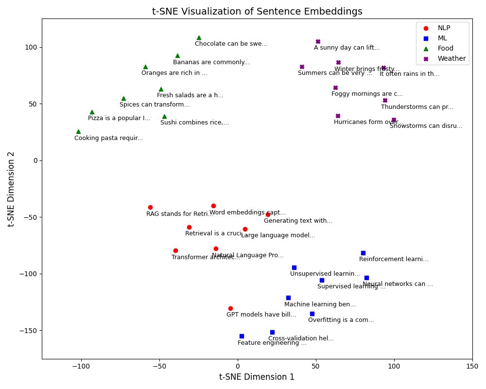{width="100%"}](#){data-modal-type="image" data-modal-url="figures/sentence-embeddings.png"}

:::{style="font-size: 18px; margin-top: 15px;"}
Similar sentences cluster together in embedding space
:::
:::
:::
:::
:::

## Measuring similarity: Cosine similarity

:::{style="margin-top: 30px; font-size: 18px;"}
:::{.columns}
:::{.column width=55%}
**How do we measure if two vectors are similar?**

- [Cosine similarity]{.alert} measures the angle between vectors
- Numerator: the dot product (multiply corresponding components and add them up; how much they point the same way)
- Denominator: normalises by their lengths (magnitude)
  - If $A = [0.8, 0.6]$, then $\|A\| = \sqrt{0.8^2 + 0.6^2} = 1$
- Identical vectors = 1; orthogonal = 0; opposite = -1
- Values range from 0 to 1 because word counts cannot be negative

$$\text{similarity}(A, B) = \frac{A \cdot B}{\|A\| \times \|B\|}$$

**Interpretation:**

| Score | Meaning | Example |
|-------|---------|----------|
| 0.9–1.0 | Very similar | "car" vs "automobile" |
| 0.7–0.9 | Related | "car" vs "truck" |
| 0.4–0.7 | Loosely related | "car" vs "road" |
| 0.0–0.4 | Unrelated | "car" vs "banana" |
:::

:::{.column width=45%}
**In RAG systems:**

- Compare the query embedding to all chunk embeddings
- Return chunks with the [highest similarity scores]{.alert}
- Typical threshold: retrieve if score > 0.7

:::{style="background: rgba(45, 69, 99, 0.1); padding: 15px; border-radius: 10px; font-size: 18px;"}
**Mini-example (2D for simplicity):**

```text
"I love dogs"  → [0.8, 0.6]
"I adore puppies" → [0.75, 0.65]
"The weather is nice" → [-0.3, 0.9]
```

Cosine similarity:

- "dogs" vs "puppies": **0.98** ✅
- "dogs" vs "weather": **0.12** ❌

The search finds "puppies" when you ask about "dogs"!
:::
:::
:::
:::

# The RAG Pipeline 🔄 {background-color="#1B3A6B"}

## How RAG works

:::{style="margin-top: 30px; font-size: 20px;"}
:::{style="text-align: center;"}
[{width="60%"}](#){data-modal-type="image" data-modal-url="figures/rag-pipeline.png"}
:::

:::{style="font-size: 22px; margin-top: 20px;"}
**Left side (once)**: Prepare your documents for searching

**Right side (every query)**: Find relevant info, then generate answer

[You prepare once, then every query is fast]{.alert} 📚
:::
:::

## Step 1: Ingest your documents

:::{style="margin-top: 30px; font-size: 22px;"}
:::{.columns}
:::{.column width=55%}
**What can you ingest?**

| Format | Examples | Challenges |
|--------|----------|------------|
| **PDF** | Papers, reports | Tables, columns, headers |
| **Word/Docs** | Reports, notes | Formatting, styles |
| **Web pages** | Articles, docs | Navigation, ads |
| **Code** | .py, .js files | Comments vs. code |
| **Transcripts** | Meeting notes | Speaker identification |

**The challenge:**

- Documents are [unstructured]{.alert}
- Extract clean text while preserving meaningful structure

**Good news:** NotebookLM and ChatGPT handle extraction automatically
:::

:::{.column width=45%}
:::{style="text-align: center; margin-top: 40px;"}
[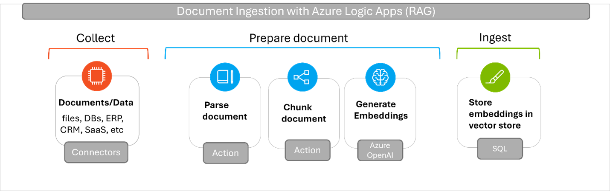{width="100%"}](#){data-modal-type="image" data-modal-url="figures/document-ingestion.png"}

:::{style="font-size: 18px; margin-top: 15px;"}
Many document types → unified text
:::
:::
:::
:::
:::

## Step 2: Chunk the text

:::{style="margin-top: 30px; font-size: 19px;"}
:::{.columns}
:::{.column width=55%}
**Why chunk?**

- LLMs have [context window limits]{.alert} (4K–128K tokens), so a whole book won't fit in one prompt
- You need the [most relevant parts]{.alert}
- Many chunking strategies exist, each with trade-offs. More [here](https://masteringllm.medium.com/11-chunking-strategies-for-rag-simplified-visualized-df0dbec8e373)

**Chunking parameters:**

| Parameter | Typical Values | Trade-off |
|-----------|---------------|----------|
| **Chunk size** | 256–1,024 tokens | Small = precise, Large = more context |
| **Overlap** | 10–20% | Prevents losing info at boundaries |
| **Strategy** | Sentence, paragraph, semantic | Depends on document structure |

:::{style="margin-top: 10px; background: rgba(45, 69, 99, 0.1); padding: 10px; border-radius: 10px;"}
**Rule of thumb:** start with [512 tokens, 20% overlap]{.alert}, then adjust to your documents and retrieval quality
:::
:::

:::{.column width=45%}
**Chunk size trade-offs:**

| Size | Pros | Cons |
|------|------|------|
| **Small (256)** | Precise retrieval | Loses context |
| **Medium (512)** | Balanced | Good default |
| **Large (1024)** | Rich context | May dilute relevance |

:::{style="text-align: center; margin-top: 15px;"}
[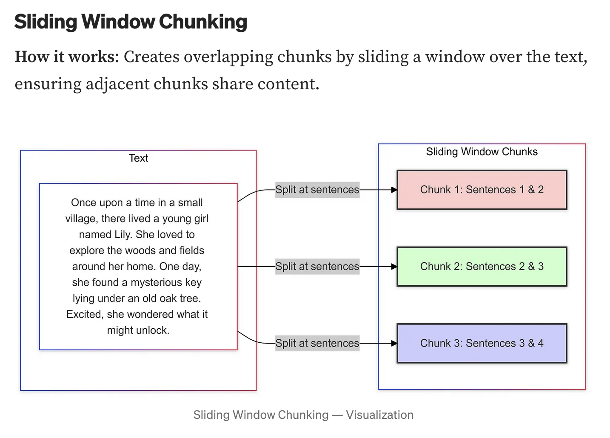{width="100%"}](#){data-modal-type="image" data-modal-url="figures/chunking-diagram.png"}

Source: [Mastering LLM](https://masteringllm.medium.com/11-chunking-strategies-for-rag-simplified-visualized-df0dbec8e373)
:::
:::
:::
:::

## Step 3: Embed, store & retrieve

:::{style="margin-top: 30px; font-size: 22px;"}
:::{.columns}
:::{.column width=50%}
**Convert chunks to vectors & store:**

- Each chunk → embedding model → vector
- Use the same embedding model for queries later

| Database | Type | Speed (1M vectors) |
|----------|------|-------------------|
| [Pinecone](https://pinecone.io/) | Cloud | ~50ms queries |
| [Chroma](https://www.trychroma.com/) | Local/Cloud | ~100ms queries |
| [FAISS](https://github.com/facebookresearch/faiss) | Local | ~10ms queries |

**Why vector databases?**

- Traditional databases: [exact match]{.alert}
- Vector databases: [similarity search]{.alert}

[No-code tools handle this for you]{.alert}
:::

:::{.column width=50%}
**Retrieval (when you ask a question):**

1. Question → embedding → query vector
2. Vector DB finds [similar chunks]{.alert}
3. Returns top-k most similar (k = 3–10)

:::{style="background: rgba(45, 69, 99, 0.1); padding: 10px; border-radius: 10px; font-size: 19px;"}
**Example**: "What is our refund policy?"

| Rank | Chunk | Score |
|------|-------|-------|
| 1 | "Returns and refunds: Customers may return..." | 0.92 |
| 2 | "Our guarantee covers full refunds..." | 0.87 |
| 3 | "Payment methods accepted..." | 0.54 ❌ |
:::

:::{style="margin-top: 10px; font-size: 16px;"}
**Parameters**: top-k (3–10), threshold (0.7–1.0)
:::
:::
:::
:::

## Step 4: Generate with context

:::{style="margin-top: 30px; font-size: 20px;"}
:::{.columns}
:::{.column width=55%}
The LLM receives a prompt like this:

:::{style="background: rgba(45, 69, 99, 0.1); padding: 15px; border-radius: 10px; font-size: 16px;"}
**System**: Answer the user's question using ONLY the context provided. If the answer isn't in the context, say "I don't have that information."

**Context**: [Chunk 1]: "Returns and refunds: Customers may return items within 30 days...". [Chunk 2]: "Our guarantee covers full refunds for defective products..."

**User question**: "What is your refund policy?"
:::

**The LLM now:**

- Has [specific, relevant information]{.alert} to work with
- Is told to [cite sources]{.alert} and to say "I don't know" when the context lacks the answer
- Generates a [grounded response]{.alert}
:::

:::{.column width=45%}
:::{style="text-align: center;"}
[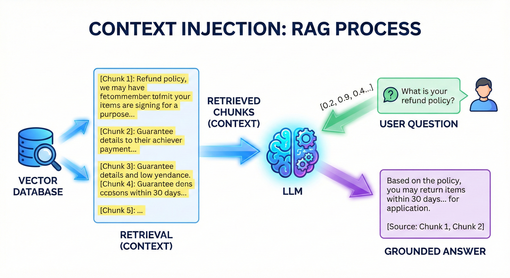{width="100%"}](#){data-modal-type="image" data-modal-url="figures/context-injection.png"}

:::{style="font-size: 18px; margin-top: 10px;"}
Retrieved chunks become the LLM's "reference material"
:::
:::

:::{style="margin-top: 15px; background: rgba(230, 57, 70, 0.1); padding: 12px; border-radius: 10px;"}
[This is why RAG reduces hallucinations]{.alert}: the LLM answers from your documents instead of guessing from its training data
:::
:::
:::
:::

# RAG vs. Alternatives 🔄 {background-color="#1B3A6B"}

## RAG vs. fine-tuning vs. prompting

:::{style="margin-top: 30px; font-size: 22px;"}
:::{.columns}
:::{.column width=100%}
**Three ways to customise LLM behaviour:**

:::{style="font-size: 20px; text-align: center; margin-top: 40px;"}
| Aspect                 | Prompt Engineering   | RAG                    | Fine-tuning            |
|------------------------|----------------------|------------------------|------------------------|
| **What it does** | Careful instructions | Add external knowledge | Retrain model weights  |
| **Cost** | Free or \$           | \$                     | \$\$\$                 |
| **Setup time** | Minutes              | Hours                  | Days–Weeks             |
| **Data freshness** | Training cutoff      | [Real-time]{.alert}    | Training cutoff        |
| **Accuracy (domain)** | Low–Medium           | [High]{.alert}         | High                   |
| **Hallucination risk** | High                 | [Low]{.alert}          | Medium                 |
| **Cites sources** | ❌                   | [✅]{.alert}           | ❌                     |
| **Best for** | Simple tasks         | Knowledge-intensive QA | Style/behaviour change |
:::

:::{style="margin-top: 30px;"}
**When to use each:**

- [Prompting]{.alert}: quick experiments, general tasks, no private data
- [RAG]{.alert}: customer support, research, legal/medical QA, anything needing current or private information
- [Fine-tuning]{.alert}: specific writing style, consistent persona, specialised domain language
:::
:::
:::
:::

## Research findings: Does RAG actually help?

:::{style="margin-top: 30px; font-size: 19px;"}
:::{.columns}
:::{.column width=55%}
**Yes, the evidence is strong:**

| Study | Finding |
|-------|--------|
| [Lewis et al. (2020)](https://arxiv.org/abs/2005.11401) | Original RAG paper: outperformed fine-tuned models on knowledge-intensive tasks |
| [Shuster et al. (2021)](https://arxiv.org/abs/2104.07567) | RAG reduced hallucinations by [~30–50%]{.alert} in dialogue systems |
| [Gao et al. (2024)](https://arxiv.org/abs/2312.10997) | Comprehensive survey: RAG approach dominant in production systems |
| [Liu et al. (2023)](https://arxiv.org/abs/2307.03172) | "Lost in the middle": LLMs use beginning and end of context better than middle |

**Hallucination rates comparison:**

| Setting | Hallucination Rate |
|---------|-------------------|
| Base LLM (no RAG) | 15–40% |
| LLM + RAG | [5–15%]{.alert} |
| LLM + RAG + verification | 2–8% |

*Rates vary by domain and implementation quality*
:::

:::{.column width=45%}
:::{style="background: rgba(45, 69, 99, 0.1); padding: 15px; border-radius: 10px; font-size: 16px; margin-top: 40px;"}
**The "Lost in the Middle" problem:**

[Liu et al. (2023)](https://arxiv.org/abs/2307.03172): LLMs pay most attention to the

1. [Beginning]{.alert} of context (primacy)
2. [End]{.alert} of context (recency)
3. [Middle]{.alert} is often ignored

**Implication for RAG:** put the most relevant chunks [first or last]{.alert}, not in the middle
:::

:::{style="margin-top: 15px; text-align: center; font-size: 18px;"}
[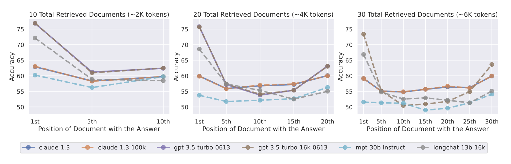{width="90%"}](#){data-modal-type="image" data-modal-url="figures/lost-in-middle.png"}

Source: [Liu et al. (2023)](https://arxiv.org/abs/2307.03172)
:::
:::
:::
:::

# RAG Failure Modes ⚠️ {background-color="#1B3A6B"}

## When RAG goes wrong

:::{style="margin-top: 30px; font-size: 19px;"}
:::{.columns}
:::{.column width=55%}
**Common failure modes:**

| Failure Type | What Happens | Frequency |
|--------------|--------------|----------|
| **Retrieval failure** | Wrong chunks retrieved | 15–25% of queries |
| **Lost in the middle** | Relevant info in middle ignored | Common with many chunks |
| **Context overflow** | Too much text, truncated | Depends on doc size |
| **Outdated docs** | Stale information retrieved | Depends on maintenance |
| **Extraction errors** | PDF tables/images parsed incorrectly | 10–30% of complex docs |

**Retrieval failures happen when:**

- The query uses different terms than the documents
- The question is ambiguous
- Multiple topics compete for relevance
- The embedding model misses domain-specific meaning
:::

:::{.column width=45%}
:::{style="background: rgba(230, 57, 70, 0.1); padding: 15px; border-radius: 10px;"}
**Example: Retrieval failure**

**Your document says:**
> "The quarterly earnings call is scheduled for March 15th"

**You ask:**
> "When is the investor meeting?"

**Problem:** "investor meeting" ≠ "earnings call" in embedding space

**Result:** wrong chunks retrieved, wrong answer
:::

:::{style="margin-top: 15px; background: rgba(45, 69, 99, 0.1); padding: 15px; border-radius: 10px;"}
**Mitigation strategies:**

- Use terms from your documents
- Add synonyms to your documents
- Use hybrid search (keyword + semantic)
- Increase top-k (retrieve more chunks)
:::
:::
:::
:::

## Best practices for reliable RAG

:::{style="margin-top: 30px; font-size: 20px;"}
:::{.columns}
:::{.column width=50%}
**For document preparation:**

1. **Clean your documents**
   - Remove headers, footers, page numbers; fix OCR errors in scanned PDFs

2. **Use descriptive headings**
   - Helps chunking and retrieval: "Q4 2024 Revenue" > "Section 3.2"

3. **Keep documents updated**
   - Stale docs = stale answers, so version control your knowledge base

4. **Test with real queries**
   - Ask what users will actually ask, and check the retrieved chunks contain the answer
:::

:::{.column width=50%}
**For querying:**

1. **Be specific**
   - ✅ "What was Q4 2024 revenue?"
   - ❌ "Tell me about the company"

2. **Use document terminology**
   - If doc says "associates", ask about "associates" not "employees"

3. **Check the citations!**
   - Does the answer match the source? This is your [verification step]{.alert}

4. **Ask follow-up questions**
   - "What source did you use for that?"
   - "Can you quote the relevant passage?"

:::{style="margin-top: 15px; background: rgba(45, 69, 99, 0.1); padding: 12px; border-radius: 10px;"}
**Golden rule:** [Trust, but verify]{.alert} 🔍
:::
:::
:::
:::

# No-Code RAG Tools 🛠️ {background-color="#1B3A6B"}

## Tools you can use today!

:::{style="margin-top: 30px; font-size: 20px;"}
:::{style="text-align: center; font-size: 26px; margin-top: 30px;"}
| Tool | Free? | Best For | Key Feature |
|------|-------|----------|-------------|
| [NotebookLM](https://notebooklm.google.com/) | ✅ Yes | Research, study notes | Multi-source synthesis |
| [ChatGPT + Files](https://chat.openai.com/) | ✅ Free tier | General documents | Easy upload & chat |
| [Claude + Files](https://claude.ai/) | ✅ Free tier | Long documents | 200K token context |
| [Google AI Studio](https://aistudio.google.com/) | ✅ Free tier | Experimentation | Gemini models |
:::

:::{style="margin-top: 40px; font-size: 22px;"}
**All of these implement RAG internally:**

- You upload documents → (Retrieval source)
- System finds relevant parts → (Augmented)
- LLM generates answers → (Generation)

[No coding required, just upload and ask]{.alert}
:::
:::

## NotebookLM: Your AI research assistant

:::{style="margin-top: 30px; font-size: 20px;"}
:::{.columns}
:::{.column width=55%}
**What is NotebookLM?**

- Free tool from Google
- Upload up to [50 sources]{.alert} (PDFs, docs, websites, YouTube) to build a personal knowledge base
- The AI answers from [YOUR sources only]{.alert}

**Features:**

| Feature | What It Does |
|---------|-------------|
| **Source grounding** | Only answers from your docs |
| **Citations** | Points to exact source passages |
| **Audio Overview** | Generates podcast-style summary |
| **Study guides** | Creates questions & summaries |
| **Cross-referencing** | Finds connections between sources |

**Best for:** Research projects, exam prep, literature reviews, understanding complex reports
:::

:::{.column width=45%}
:::{style="text-align: center; margin-top: 40px;"}
[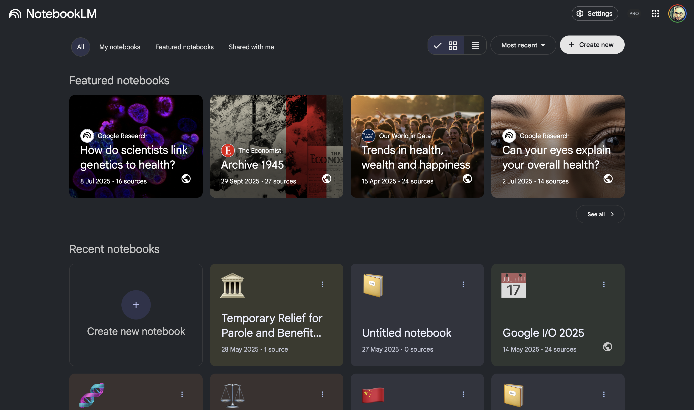{width="100%"}](#){data-modal-type="image" data-modal-url="figures/notebooklm-screenshot.png"}

:::{style="font-size: 18px; margin-top: 10px;"}
[notebooklm.google.com](https://notebooklm.google.com/)
:::
:::
:::
:::
:::

## Activity: File upload RAG 📎

:::{style="margin-top: 30px; font-size: 20px;"}
:::{.columns}
:::{.column width=50%}
**Compare: with vs. without your documents. Let's do it together (or at home if Emory's connection doesn't allow us to! 😂)**

**Step 1: Without documents**

1. Open <https://aistudio.google.com/> and start a [new chat]{.alert}
2. Ask: "What are the assignment deadlines for DATASCI 101 at Emory University?"
3. Qwen doesn't know: it's not in the training data

**Step 2: With your document**

1. Start another [new chat]{.alert}
2. Click the 📎 (attach) button and upload the course syllabus PDF
3. Ask the same question: "What are the assignment deadlines?"
4. Compare the answers
:::

:::{.column width=50%}
**What to observe:**

| Without Doc | With Doc |
|-------------|----------|
| "I don't have access to..." | Specific dates from syllabus |
| May hallucinate generic answer | [Grounded]{.alert} in your document |
| No citations | Can quote the source |

:::{style="margin-top: 15px; background: rgba(45, 69, 99, 0.1); padding: 15px; border-radius: 10px;"}
**This is RAG in action!**

The LLM [retrieves]{.alert} relevant parts of your file and uses them to [generate]{.alert} an accurate answer.

You just built a RAG system! 🎉
:::
:::
:::
:::

# Real-World Applications 🌍 {background-color="#1B3A6B"}

## RAG is everywhere!

:::{style="margin-top: 30px; font-size: 24px;"}
:::{.columns}
:::{.column width=100%}
| Industry | Application | How RAG Helps | Example Company |
|----------|-------------|---------------|----------------|
| 🏢 **Customer Support** | AI chatbots | Answer questions from product docs | Intercom, Zendesk |
| ⚖️ **Legal** | Research assistants | Search case law by meaning | Harvey AI, Casetext |
| 🏥 **Healthcare** | Clinical support | Find relevant patient records, guidelines | Epic, Nuance |
| 📚 **Education** | Personal tutors | Answer questions from course materials | Khan Academy, Duolingo |
| 💼 **Finance** | Analyst tools | Search earnings reports, SEC filings | Bloomberg, Kensho |
| 🔬 **Research** | Literature review | Find related papers, summarise findings | Elicit, Semantic Scholar |
| 💻 **Developer Tools** | Documentation QA | Answer questions from codebases | GitHub Copilot, Cursor |

:::{style="margin-top: 15px; font-size: 20px;"}
In each case, users need answers grounded in [specific documents]{.alert}, with a citation for where the answer came from

**Market size**: enterprise RAG solutions expected to reach [$40B+ by 2035](https://www.businesswire.com/news/home/20251010008494/en/Retrieval-Augmented-Generation-RAG-Industry-Report-2025-2035-Global-RAG-Market-to-Surpass-%2440-Billion-by-2035-as-Enterprises-Accelerate-AI-Integration---ResearchAndMarkets.com) (estimates vary)

**Advanced RAG**: [LangChain](https://www.langchain.com/) is a popular framework for building RAG applications. Explore it if you know Python or JavaScript and want to build your own
:::
:::
:::
:::

# Summary {background-color="#1B3A6B"}

## Key takeaways

:::{style="margin-top: 30px; font-size: 26px;"}
:::{.columns}
:::{.column width=55%}
- [The problem]{.alert}: LLMs hallucinate and lack access to private or current information

- [Semantic search]{.alert}: find by meaning using embeddings and cosine similarity

- [The RAG pipeline]{.alert}: chunk → embed → store → retrieve → generate

- [Research shows]{.alert}: RAG reduces hallucinations by 30–50%

- [Watch out for]{.alert}: retrieval failures, lost-in-the-middle, outdated docs

- [No-code tools]{.alert}: NotebookLM, ChatGPT with files, etc

- [Always verify]{.alert}: RAG reduces errors but doesn't eliminate them
:::

:::{.column width=45%}
**Quick reference:**

| Concept | Key Numbers |
|---------|-------------|
| Cosine similarity | 0.9+ = very similar |
| Chunk size | 256–1024 tokens |
| Overlap | 10–20% |
| Top-k retrieval | 3–10 chunks |
| Hallucination reduction | 30–50% |

:::{style="margin-top: 15px; font-size: 20px;"}
Upload your docs, ask specific questions, and [always check citations]{.alert}
:::
:::
:::
:::

# ...and that's all for today! 🎉 {background-color="#1B3A6B"}