```{r setup, include=FALSE}
options(htmltools.dir.version = FALSE)
library(knitr)
opts_chunk$set(
  prompt = T,
  fig.align="center",
  dpi=300,
  cache=T,
  engine.opts = list(bash = "-l")
  )

knit_hooks$set(
  prompt = function(before, options, envir) {
    options(
      prompt = if (options$engine %in% c('sh','bash', 'zsh')) '$ ' else 'R> ',
      continue = if (options$engine %in% c('sh','bash', 'zsh')) '$ ' else '+ '
      )
})

options(repos = c(CRAN = "https://cran.rstudio.com/"))

if (!require("fontawesome", character.only = TRUE)) {
  install.packages("fontawesome", dependencies = TRUE)
  library(fontawesome, character.only = TRUE)
}
```

# Welcome back! ⚖️ {background-color="#2d4563"}

## Recap of last class

:::{style="margin-top: 20px; font-size: 27px;"}
:::{.columns}
:::{.column width=50%}
- Last time we explored [data documentation and governance]{.alert}
- Datasheets for datasets, model cards for models, system cards for AI systems
- Data lineage: tracking where data comes from
- The consent problem in AI training data
- **Today**: [Types of bias]{.alert} and how they arise
- This topic affects [real people in real ways]{.alert}, as we'll see
- [Whose values]{.alert} does AI encode when it makes decisions?
:::

:::{.column width=50%}
:::{style="text-align: center; margin-top: -30px;"}
[{width="60%"}](#){data-modal-type="image" data-modal-url="figures/opus-system-card.jpeg"}

Source: [Anthropic](https://www-cdn.anthropic.com/14e4fb01875d2a69f646fa5e574dea2b1c0ff7b5.pdf)
:::
:::
:::
:::

## Lecture overview
### Today's agenda

:::{style="margin-top: 20px; font-size: 25px;"}

:::{.columns}
:::{.column width=50%}
**Part 1: The big picture**

- What is bias? (It's complicated!)
- The mirror problem: AI reflects us
- Real-world harms: who gets hurt?

**Part 2: Types of bias**

- Historical bias: the past baked in
- Representation bias: who's missing?
- Measurement bias: bad proxies
- Aggregation and evaluation bias
:::

:::{.column width=50%}
**Part 3: Applying the framework**

- Activity: Spot the bias!
- Where bias shows up (preview)

**Part 4: The hard questions**

- The impossibility theorem: can we be fair?
- Fairness tradeoffs: uncomfortable choices
- Is AI bias fixable?
:::
:::
:::

## Neural network of the day!

:::{style="text-align: center; margin-top: 30px; font-size: 20px;"}
:::{.columns}
:::{.column width=50%}
[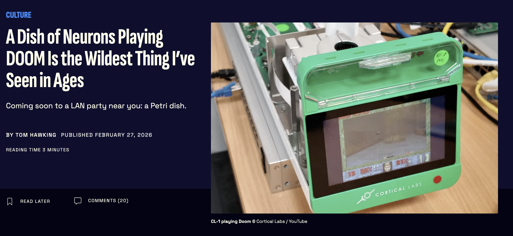{width="100%"}](#){data-modal-type="image" data-modal-url="figures/gizmodo01.png"}

<https://gizmodo.com/a-dish-of-neurons-playing-doom-is-the-wildest-thing-ive-seen-in-ages-2000727674>
:::

:::{.column width=50%}
[{width="100%"}](#){data-modal-type="image" data-modal-url="figures/gizmodo02.png"}
:::
:::
:::

## Cortical Labs

:::{style="text-align: center; margin-top: 30px; font-size: 20px;"}
[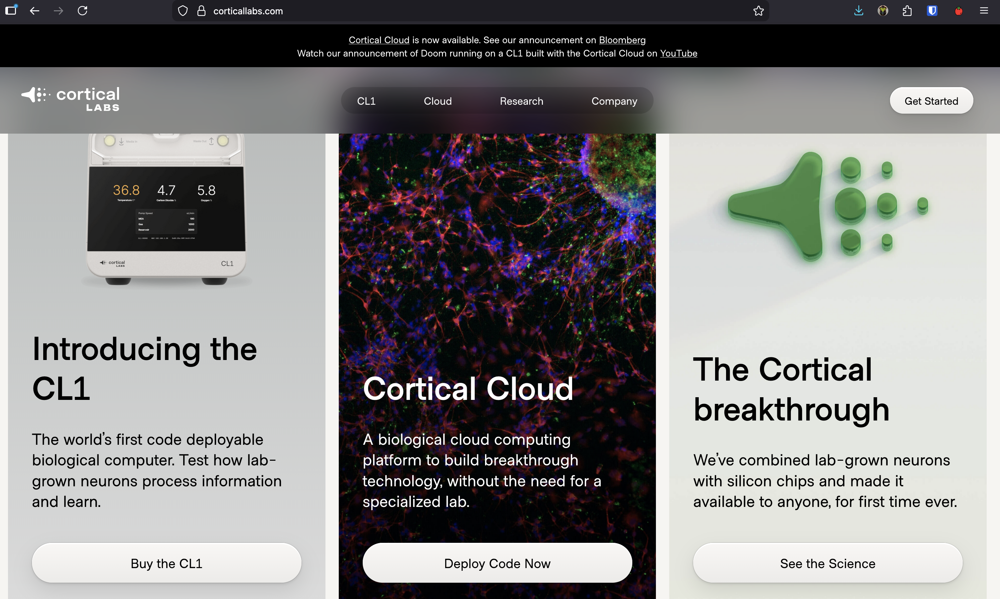{width="80%"}](#){data-modal-type="image" data-modal-url="figures/cortical-labs.png"}

Source: [Cortical Labs](https://corticallabs.com/)
:::

# Well, let's get back to our lecture... 😅 {background-color="#2d4563"} 

## A story to start with

:::{style="margin-top: 30px; font-size: 23px;"}
:::{.columns}
:::{.column width=55%}
**Robert Julian-Borchak Williams, Detroit, 2020**

- Arrested in front of his family
- Accused of stealing watches
- Held for 30 hours in jail
- Later released: [wrong person]{.alert}

**What happened?**

- A facial recognition system matched his driver's licence photo to grainy surveillance footage
- The algorithm was [wrong]{.alert}
- Robert is Black. Research shows facial recognition has [higher error rates]{.alert} for darker-skinned faces

[This wasn't a software bug. It was how the system was built]{.alert}
:::

:::{.column width=45%}
:::{style="text-align: center;"}
[{width="100%"}](#){data-modal-type="image" data-modal-url="figures/robert-williams.png"}

:::{style="font-size: 18px; margin-top: 15px;"}
Source: [ACLU](https://www.aclumich.org/news/i-was-wrongfully-arrested-because-facial-recognition-technology-it-shouldnt-happen-anyone-else/)
:::
:::
:::
:::
:::

# What is Bias? 🤔 {background-color="#2d4563"}

## Defining bias: It's complicated

:::{style="margin-top: 30px; font-size: 22px;"}
:::{.columns}
:::{.column width=55%}
**"Bias" means different things:**

| Context | Meaning | Example |
|---------|---------|---------|
| **Statistical** | Systematic deviation | Biased estimator under/overestimates |
| **Cognitive** | Mental shortcuts | Confirmation bias |
| **Cultural** | Learned assumptions | "Doctors are male" |
| **Algorithmic** | Systematic unfairness | Different error rates by group |
| **Historical** | Past inequalities | Less data on minorities |

**In AI, bias typically means:**

> A system that produces [systematically unfair outcomes]{.alert} for certain groups of people.

But who defines "unfair"? That's the hard part.
:::

:::{.column width=45%}
:::{style="text-align: center; margin-top: 30px;"}
[{width="100%"}](#){data-modal-type="image" data-modal-url="figures/bias-types.jpg"}

:::{style="font-size: 18px; margin-top: 15px;"}
Source: [National Institute of Standards and Technology](https://www.nist.gov/news-events/news/2022/03/theres-more-ai-bias-biased-data-nist-report-highlights)
:::
:::
:::
:::
:::

## The mirror problem: AI reflects us

:::{style="margin-top: 30px; font-size: 21px;"}
:::{.columns}
:::{.column width=55%}
> Is AI biased, or is it just [showing us what we already are]{.alert}?

- AI learns from [human-generated data]{.alert}
- Historical data contains historical discrimination
- If humans made biased decisions, AI learns those patterns
- And AI can [amplify]{.alert} existing biases at scale

**Example: Word embeddings**

- "Man" is to "Doctor" as "Woman" is to... "Nurse"
- The AI learned this from [millions of human texts]{.alert}
- It picked up [our own sexism]{.alert} from the text
:::

:::{.column width=45%}
:::{style="text-align: center;"}
[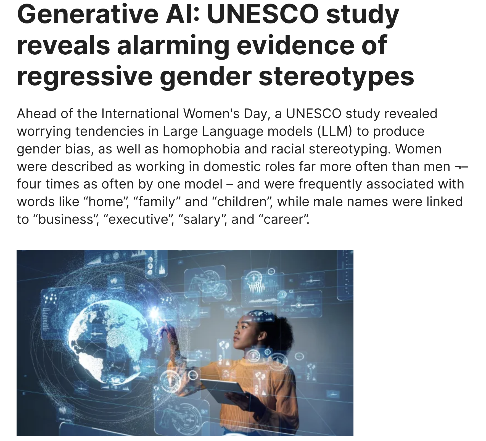{width="80%"}](#){data-modal-type="image" data-modal-url="figures/ai-mirror.png"}

:::{style="font-size: 18px; margin-top: 10px;"}
Source: [UNESCO](https://www.unesco.org/en/articles/generative-ai-unesco-study-reveals-alarming-evidence-regressive-gender-stereotypes)
:::
:::

:::{style="margin-top: 20px; background: rgba(45, 69, 99, 0.1); padding: 15px; border-radius: 10px;"}
If the bias comes from us, does that make AI less accountable, or more?
:::
:::
:::
:::

## Discussion: Pick your risk 🎲

:::{style="margin-top: 30px; font-size: 20px;"}
:::{.columns}
:::{.column width=50%}
**The scenario:**

You're applying to university. You get to choose who evaluates your application:

**Option A: A human admissions officer**

- Might favour applicants who remind them of themselves
- Could be swayed by mood, time of day, or fatigue
- You can appeal and read social cues
- Bias is [inconsistent and unpredictable]{.alert}

**Option B: An AI admissions tool**

- Might penalise your ZIP code, name, or school
- Applies the same criteria to everyone, every time
- You cannot argue with it or explain context
- Bias is [systematic and invisible]{.alert}
:::

:::{.column width=50%}
:::{style="background: rgba(45, 69, 99, 0.1); padding: 15px; border-radius: 10px; margin-top: 30px;"}
**Which do you choose, and why?**

Think about:

- Does it matter that you [can't argue]{.alert} with an algorithm?
- Is consistent bias fairer than unpredictable bias?
- Would your answer change if you knew [which group]{.alert} the bias disadvantaged?
- What would you want to know before choosing?
:::

:::{style="margin-top: 20px; background: rgba(230, 57, 70, 0.1); padding: 15px; border-radius: 10px;"}
Neither option is safe. The question is which [risk]{.alert} you'd rather take, and what that tells us about what we value.
:::

⏱️ 2 minutes
:::
:::
:::

## Why this matters

:::{style="margin-top: 30px; font-size: 21px;"}
:::{.columns}
:::{.column width=55%}
**AI systems are making decisions about:**

| Domain | Decision | Affected |
|--------|----------|----------|
| **Employment** | Who gets hired, promoted, fired | Millions of applicants |
| **Finance** | Who gets loans, credit, insurance | Billions globally |
| **Healthcare** | Who gets treatment, care priority | Life and death |
| **Criminal justice** | Bail, sentencing, parole | Freedom and families |
| **Education** | Admissions, resources, grading | Future opportunities |

**The scale problem:**

- Algorithms decide [faster than humans can review]{.alert}
- One biased system can affect [millions of people]{.alert}
- Errors compound: a bad decision today feeds worse data into tomorrow's model
:::

:::{.column width=45%}
:::{style="background: rgba(230, 57, 70, 0.1); padding: 15px; border-radius: 10px; margin-top: 30px;"}
**A few real cases:**

- 2018: [Amazon's hiring AI penalised women](https://www.reuters.com/article/world/insight-amazon-scraps-secret-ai-recruiting-tool-that-showed-bias-against-women-idUSKCN1MK0AG/)
- 2019: [Healthcare algorithm deprioritised Black patients](https://www.scientificamerican.com/article/racial-bias-found-in-a-major-health-care-risk-algorithm/)
- 2020: [Robert Williams arrested due to facial recognition](https://www.npr.org/2020/06/24/882683463/the-computer-got-it-wrong-how-facial-recognition-led-to-a-false-arrest-in-michig)
- 2023: [NYC passes AI hiring audit law](https://www.osc.ny.gov/press/releases/2025/12/dinapoli-new-yorkers-deserve-transparent-hiring-process-when-artificial-intelligence-used-vet-their)
- 2024: [EU AI Act classifies high-risk AI systems](https://artificialintelligenceact.eu/article/6/)
:::
:::
:::
:::

# Types of Bias 📊 {background-color="#2d4563"}

## A taxonomy of bias

:::{style="margin-top: 30px; font-size: 26px;"}
:::{style="text-align: center;"}
| Bias type | When it occurs | Example |
|-----------|---------------|---------|
| [Historical]{.alert} | Past decisions encoded in data | Loan data from discriminatory era |
| [Representation]{.alert} | Some groups underrepresented | Few dark-skinned faces in training |
| [Measurement]{.alert} | Proxies used for unmeasurable concepts | Using ZIP code for creditworthiness |
| [Aggregation]{.alert} | Treating diverse groups as one | "One model fits all" fails |
| [Evaluation]{.alert} | Wrong benchmarks for testing | Testing on unrepresentative data |
| [Deployment]{.alert} | Model used in wrong context | US model applied globally |
:::

:::{style="margin-top: 20px; font-size: 22px;"}
Bias can creep in at [any stage]{.alert}:

Data collection → Data labelling → Model training → Model evaluation → Deployment → Use
:::
:::

## Historical bias: the past baked in

:::{style="margin-top: 30px; font-size: 21px;"}
:::{.columns}
:::{.column width=55%}
This happens when [past discrimination]{.alert} is baked into the training data, even if the data accurately reflects the real world at the time

**The Amazon hiring case (2018):**

- Amazon built an AI to screen CVs
- Trained on [10 years of past hiring]{.alert} decisions
- Past hiring was male-dominated
- AI learned: [penalise CVs mentioning "women's"]{.alert}
  - "Women's chess club captain" → downgraded
  - All-women's college → downgraded
- Amazon scrapped the tool

The data was "accurate": it did reflect Amazon's actual hiring. But that hiring was biased.
:::

:::{.column width=45%}
:::{style="text-align: center;"}
[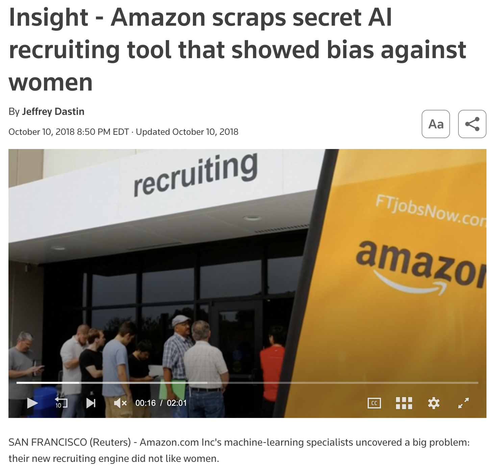{width="90%"}](#){data-modal-type="image" data-modal-url="figures/amazon-hiring.png"}

:::{style="font-size: 18px; margin-top: 15px;"}
Source: [Reuters](https://www.reuters.com/article/world/insight-amazon-scraps-secret-ai-recruiting-tool-that-showed-bias-against-women-idUSKCN1MK0AG/)
:::
:::

:::{style="margin-top: 15px; background: rgba(230, 57, 70, 0.1); padding: 15px; border-radius: 10px;"}
Accurate data ≠ fair data. The history was real; the discrimination was too.
:::
:::
:::
:::

## Representation bias: Who's missing?

:::{style="margin-top: 30px; font-size: 19px;"}
:::{.columns}
:::{.column width=55%}
When certain groups are [underrepresented]{.alert} in training data, the model performs poorly for them

**Example: Voice assistants**

- Voice recognition systems trained primarily on:
  - American and British accents
  - Male voices (often from tech employees)
  - Native speakers
- Result: [Higher error rates]{.alert} for:
  - Non-native English speakers
  - Regional accents (Scottish, Indian, Nigerian)
  - Women's voices in some systems
  - Children and elderly users

**Why?**

- Whoever collects the data determines [who's in it]{.alert}
- Convenience samples from developers themselves
- "Edge cases" are actually [most of the world]{.alert}
:::

:::{.column width=45%}
:::{style="text-align: center;"}
[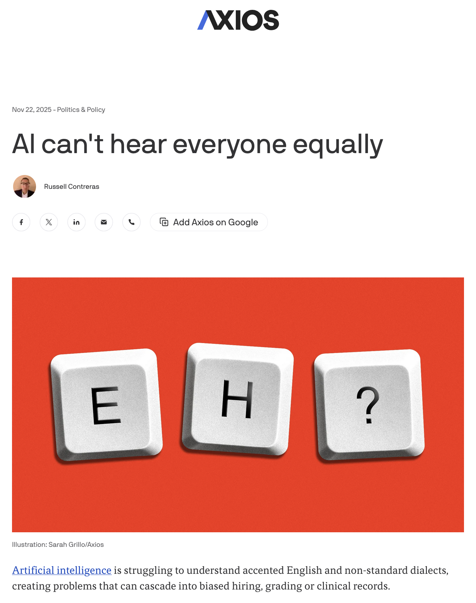{width="60%"}](#){data-modal-type="image" data-modal-url="figures/voice-bias.png"}

Source: [Axios](https://www.axios.com/2025/11/22/ai-accents-chatgpt-jobs-health)
:::

:::{style="margin-top: 15px; background: rgba(230, 57, 70, 0.1); padding: 15px; border-radius: 10px;"}
If you're not in the training data, the model has nothing to learn about you.
:::
:::
:::
:::

## Measurement bias: Proxies gone wrong

:::{style="margin-top: 30px; font-size: 21px;"}
:::{.columns}
:::{.column width=55%}
Using a [measurable proxy]{.alert} for something you actually care about... but the proxy doesn't work equally for everyone

**Example: ZIP code as a credit proxy**

- Banks can't legally use race to make loan decisions
- But they can use [ZIP codes]{.alert}
- ZIP codes correlate strongly with race due to housing discrimination
- Result: A "race-neutral" variable that encodes race

**Other problematic proxies:**

| What we want | Proxy used | Problem |
|--------------|------------|---------|
| Intelligence | Standardised tests | Reflects access to prep |
| Job quality | Tenure | Penalises caregivers |
| Creditworthiness | Payment history | Assumes equal opportunity |
| Health needs | Past spending | Reflects access barriers |
:::

:::{.column width=45%}
:::{style="text-align: center; margin-top: 30px;"}
[{width="100%"}](#){data-modal-type="image" data-modal-url="figures/proxy-bias.png"}

Source: [Harvard Law Review](https://harvardlawreview.org/print/vol-138/resetting-antidiscrimination-law-in-the-age-of-ai/)
:::

:::{style="margin-top: 15px; background: rgba(45, 69, 99, 0.1); padding: 15px; border-radius: 10px;"}
You can remove race from the data and still end up with a racially biased model, because the proxies do the work instead.
:::
:::
:::
:::

## Aggregation bias: One size doesn't fit all

:::{style="margin-top: 30px; font-size: 20px;"}
:::{.columns}
:::{.column width=55%}
Treating [diverse populations as if they're all the same]{.alert}, when the underlying relationships differ across groups

**Example: Diabetes prediction**

- A single model is trained on data from all patients
- But diabetes manifests differently across ethnicities:
  - Different genetic risk factors
  - Different dietary patterns
  - Different symptom presentations
- A single model may work well [on average]{.alert} but poorly for specific groups
- [Simpson's paradox](https://en.wikipedia.org/wiki/Simpson%27s_paradox)

**The maths:**

| Model | Overall Accuracy | Group A | Group B |
|-------|------------------|---------|---------|
| Single model | 85% | 90% | 75% |
| Group-specific | 88% | 89% | 86% |
:::

:::{.column width=45%}
:::{style="text-align: center;"}
[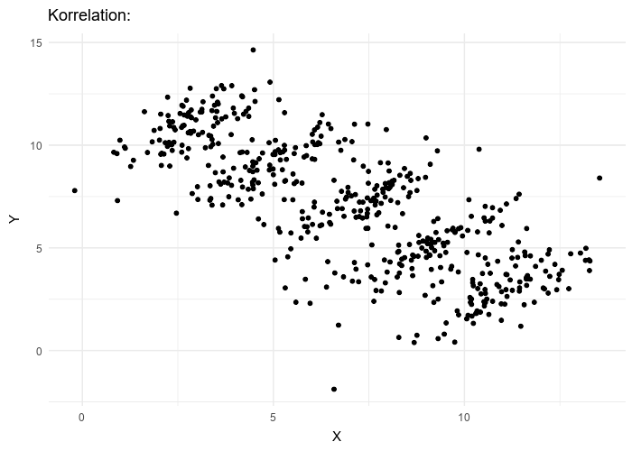{width="100%"}](#){data-modal-type="image" data-modal-url="figures/simpsons-paradox.gif"}

Source: [Wikipedia](https://en.wikipedia.org/wiki/Simpson's_paradox)
:::

:::{style="margin-top: 15px; background: rgba(45, 69, 99, 0.1); padding: 15px; border-radius: 10px;"}
[Question]{.alert}: Should we build separate models for different groups? What are the tradeoffs?
:::
:::
:::
:::

## Evaluation bias: Testing on the wrong people

:::{style="margin-top: 30px; font-size: 22px;"}
:::{.columns}
:::{.column width=55%}
When the [benchmark dataset]{.alert} used to test a model doesn't represent the population it will be used on

**The benchmark problem:**

- Standard benchmarks become industry standards
- Everyone optimises for the same tests
- If the test is biased, [success on the test means nothing]{.alert}

**Example: ImageNet**

- For years, the gold standard in computer vision
- But images were predominantly from the US and Europe
- Models trained and tested on it worked great... in the US
- Deployed globally: [failures on everyday objects from other cultures]{.alert}
:::

:::{.column width=45%}
:::{style="text-align: center;"}
[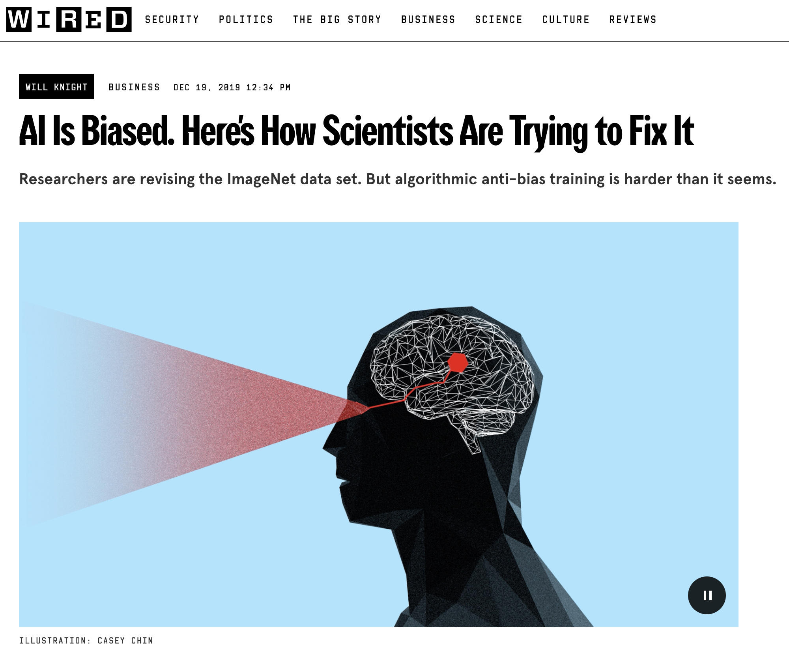{width="90%"}](#){data-modal-type="image" data-modal-url="figures/evaluation-bias.png"}

Source: [Wired](https://www.wired.com/story/ai-biased-how-scientists-trying-fix/)
:::

:::{style="margin-top: 10px; background: rgba(230, 57, 70, 0.1); padding: 15px; border-radius: 10px;"}
High scores on a biased benchmark just mean the model is good at being biased.
:::
:::
:::
:::

## Deployment bias: wrong context

:::{style="margin-top: 30px; font-size: 20px;"}
:::{.columns}
:::{.column width=55%}
Sometimes a model works fine where it was built but fails when used in a [different context]{.alert}.

**Example: US model in India**

- Credit scoring model trained on US financial data
- Deployed in India to assess loan applications
- Problem: Different banking systems, income patterns, credit histories
- Result: [Inappropriate decisions]{.alert} for the new context

**Example: COVID-19 detection**

- Models trained on hospital data from one region
- Deployed in different regions with different equipment
- X-ray machines, demographics, disease prevalence all differed
- Performance [dropped significantly]{.alert}
:::

:::{.column width=45%}
:::{style="text-align: center;"}
[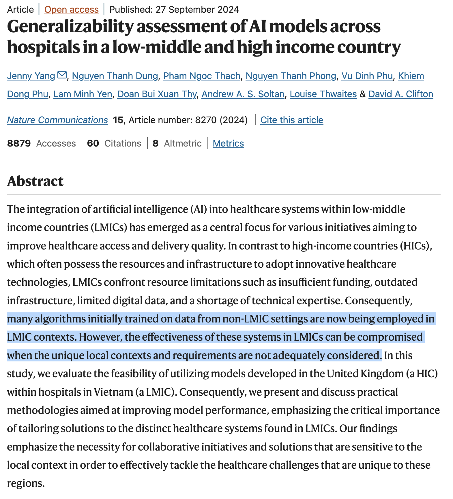{width="60%"}](#){data-modal-type="image" data-modal-url="figures/deployment-bias.png"}

Source: [Yang et al (2024)](https://www.nature.com/articles/s41467-024-52618-6)
:::

:::{style="margin-top: 10px; background: rgba(45, 69, 99, 0.1); padding: 15px; border-radius: 10px;"}
A model trained in one context can fail quietly when moved to another.
:::
:::
:::
:::

## Bias through the AI lifecycle

:::{style="margin-top: 30px; font-size: 22px; text-align: center;"}
[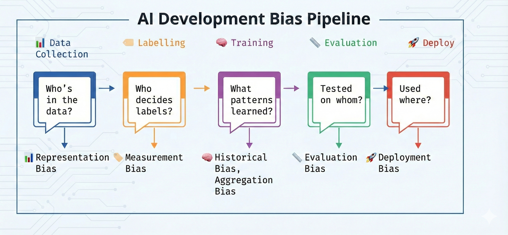{width="100%"}](#){data-modal-type="image" data-modal-url="figures/bias-lifecycle.png"}

Fixing the training data won't help if the evaluation benchmark is also biased. You need to check [every stage]{.alert}
:::

## Feedback loops: Bias that amplifies itself

:::{style="margin-top: 30px; font-size: 18px;"}
:::{.columns}
:::{.column width=55%}
**What is a feedback loop?**

When an algorithm's [predictions influence the data]{.alert} it will be trained on in the future

**Example: Predictive policing**

1. Algorithm predicts crime hotspots based on [past arrest data]{.alert}
2. Police patrol those areas more heavily
3. More patrols → more arrests (whether or not crime rates differ)
4. New arrest data confirms the algorithm's predictions
5. Algorithm becomes [more confident]{.alert} in biased patterns
6. Cycle continues...

**Why this is dangerous:**

- The algorithm creates evidence for its own predictions
- Bias [compounds over time]{.alert}
- After a few cycles, nobody can tell what the real crime rate was
:::

:::{.column width=45%}
:::{style="text-align: center;"}
[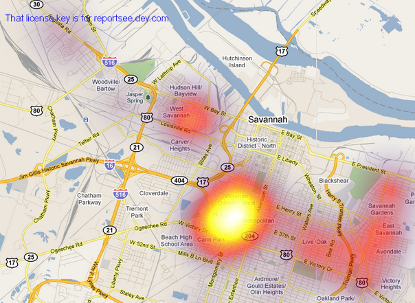{width="100%"}](#){data-modal-type="image" data-modal-url="figures/feedback-loop.png"}

Source: [SpotCrime](https://blog.spotcrime.com/2011/06/savanna-ga-heat-map.html)
:::

:::{style="margin-top: 15px; background: rgba(230, 57, 70, 0.1); padding: 15px; border-radius: 10px;"}
**Other feedback loops:**

- Loan denials → worse credit → more denials
- Resume filters → homogeneous workforce → more biased training data
:::
:::
:::
:::

## Activity: Spot the bias! 🔍

:::{style="margin-top: 30px; font-size: 22px;"}
**Scenario: University admissions**

An AI recommends admissions based on SAT scores, high school GPA, and extracurriculars

- What types of bias might this contain?
- Who might be disadvantaged?
- What proxies are being used?

:::{style="margin-top: 20px; background: rgba(45, 69, 99, 0.1); padding: 15px; border-radius: 10px; width: fit-content;"}
**Discuss one scenario with a neighbour:**

1. Identify at least 2 types of bias
2. Propose how you might mitigate them
3. What tradeoffs would you face?
:::

⏱️ 2 minutes
:::

# The Hard Questions ❓ {background-color="#2d4563"}

## The impossibility theorem
### You can't have it all

:::{style="margin-top: 30px; font-size: 20px;"}
:::{.columns}
:::{.column width=55%}
**Three fairness criteria (simplified):**

1. **Calibration**: Among those given the same score, outcomes should be similar across groups

2. **Equal false positive rates**: Groups should have equal rates of being wrongly flagged

3. **Equal false negative rates**: Groups should have equal rates of being wrongly missed

**The impossibility theorem:**

> If base rates differ between groups, you [cannot satisfy all three]{.alert} simultaneously

**Put simply**: If Group A reoffends at 40% and Group B at 20%, you must choose which type of error to equalise

[There is no mathematically "fair" solution.]{.alert}
:::

:::{.column width=45%}
:::{style="text-align: center;"}
[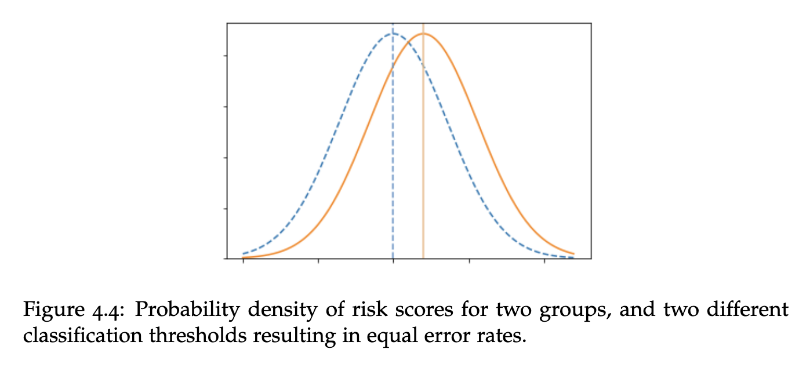{width="100%"}](#){data-modal-type="image" data-modal-url="figures/impossibility-theorem.png"}

:::{style="font-size: 18px; margin-top: 10px;"}
Source: [Fairness and Machine Learning Book (p. 100)](https://fairmlbook.org/)
:::
:::

:::{style="margin-top: 15px; background: rgba(230, 57, 70, 0.1); padding: 15px; border-radius: 10px;"}
No algorithm can tell you which errors matter more. That is a [political and moral question]{.alert}.
:::
:::
:::
:::

## Who defines "fair"? 🤔

:::{style="margin-top: 30px; font-size: 30px; text-align: center;"}
**What counts as fair depends on what you value:**

:::{style="margin-top: 40px;"}
| Definition | Prioritises | Drawback |
|------------|-------------|----------|
| **Equal treatment** | Consistency | Ignores context |
| **Equal outcomes** | Equity | May require discrimination |
| **Equal error rates** | Group parity | May sacrifice accuracy |
| **Calibration** | Individual accuracy | Hides disparity |
:::

:::{style="margin-top: 40px;"}
**The problem:**

- There is [no neutral default]{.alert}
- Whoever picks the fairness definition [shapes who benefits]{.alert}
- Saying "we just use the data" is itself a choice
:::
:::

## Fairness tradeoffs: Uncomfortable choices

:::{style="margin-top: 30px; font-size: 22px;"}
:::{.columns}
:::{.column width=55%}
**Tradeoff 1: Accuracy vs. Fairness**

- Making predictions equally accurate across groups may reduce overall accuracy
- Who pays the cost?

**Tradeoff 2: Individual vs. Group Fairness**

- Treating individuals identically (blind to group) may produce unequal group outcomes
- Treating groups equally may disadvantage qualified individuals

**Tradeoff 3: Transparency vs. Gaming**

- Revealing how the algorithm works allows people to game it
- Keeping it secret prevents accountability

**Tradeoff 4: Short-term vs. Long-term**

- Using current data perpetuates historical inequalities
- Ignoring current data may reduce accuracy today
:::

:::{.column width=45%}
:::{style="background: rgba(45, 69, 99, 0.1); padding: 15px; border-radius: 10px; margin-top: 30px;"}
**Different stakeholders want different things:**

- **Affected communities**: Equalise outcomes
- **Companies**: Maximise accuracy
- **Regulators**: Ensure process fairness
- **Courts**: Protect individual rights

Who gets to decide which tradeoff to make?
:::
:::
:::
:::

## Activity: Make the tradeoff! ⚖️

:::{style="margin-top: 30px; font-size: 21px;"}
:::{.columns}
:::{.column width=50%}
**You're designing a loan approval algorithm**

**The data shows:**

- Group A: 80% repay loans
- Group B: 60% repay loans (due to historical economic disadvantage)

**You must choose ONE approach:**

1. **Same threshold for all**: 70% predicted repayment = approved
   - Result: More Group B rejected

2. **Equal approval rates**: Adjust thresholds so both groups have 50% approval
   - Result: More defaults, higher risk

3. **Equal false rejection rates**: Ensure same % of good borrowers rejected across groups
   - Result: Different approval rates
:::

:::{.column width=50%}
**Questions to discuss:**

- Which approach is "fairest"?
- Who benefits and who is harmed by each?
- Would your answer change if Group B's lower rate was due to discrimination (not ability)?
- Should the algorithm try to [correct]{.alert} historical injustice, or just not [perpetuate]{.alert} it?

:::{style="margin-top: 20px; background: rgba(45, 69, 99, 0.1); padding: 15px; border-radius: 10px;"}
**Vote with your class!**

Which approach would you choose and why?
:::

⏱️ 3 minutes to debate!
:::
:::
:::

## Perspectives: Is AI bias fixable?

:::{style="margin-top: 30px; font-size: 20px;"}
:::{.columns}
:::{.column width=50%}
**The optimists**

- AI bias is a [technical problem]{.alert} with technical solutions
- Better data, better algorithms, better audits
- AI might be *less* biased than humans
  - Humans are inconsistent; AI is at least consistent
  - AI decisions can be audited; human gut feelings cannot
- Datasets are improving, regulations are catching up

> "A biased algorithm can be retrained. A biased hiring manager is harder to fix."
:::

:::{.column width=50%}
**The sceptics**

- AI bias reflects [societal problems]{.alert} that can't be coded away
- "Fair AI" talk distracts from the root causes
- Who defines fairness? Usually those already in power
- AI obscures human accountability
- Some decisions shouldn't be automated at all

> "You can't fix a discriminatory housing market by tweaking a credit-scoring model."

:::{style="margin-top: 20px; background: rgba(45, 69, 99, 0.1); padding: 15px; border-radius: 10px;"}
**Where do you stand?**
:::
:::
:::
:::

# Summary 📚 {background-color="#2d4563"}

## Main takeaways

:::{style="margin-top: 30px; font-size: 35px;"}

- `r fa('eye')` AI learns from human data, so it inherits human biases

- `r fa('history')` Historical bias bakes past discrimination into models

- `r fa('users')` If a group is missing from training data, the model fails for them

- `r fa('ruler')` Seemingly neutral proxies (ZIP code, test scores) can encode inequality

- `r fa('balance-scale')` The impossibility theorem: you cannot satisfy all fairness criteria at once

- `r fa('question-circle')` Choosing a fairness definition is a values question, not a technical one

:::


# ...and that's all for today! 🎉 {background-color="#2d4563"}