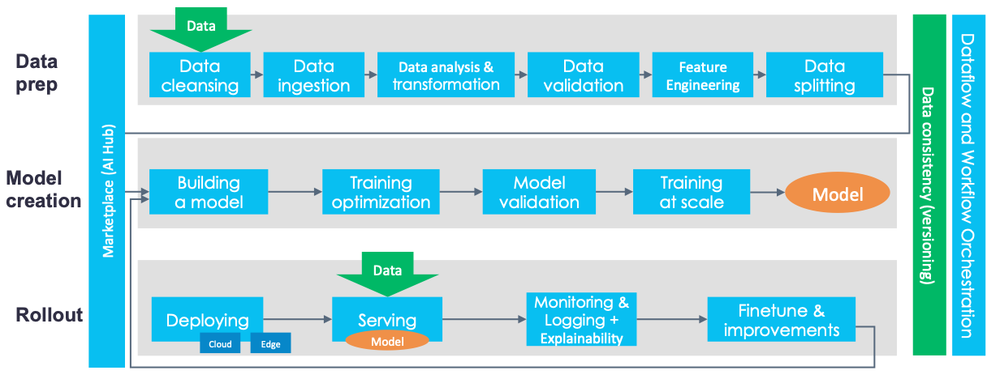
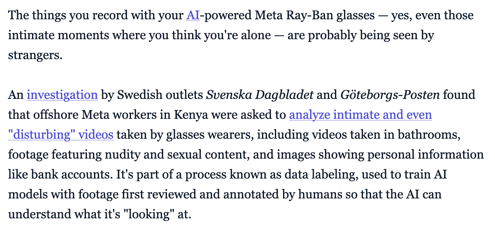
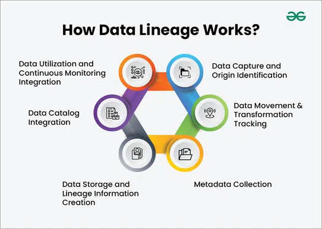
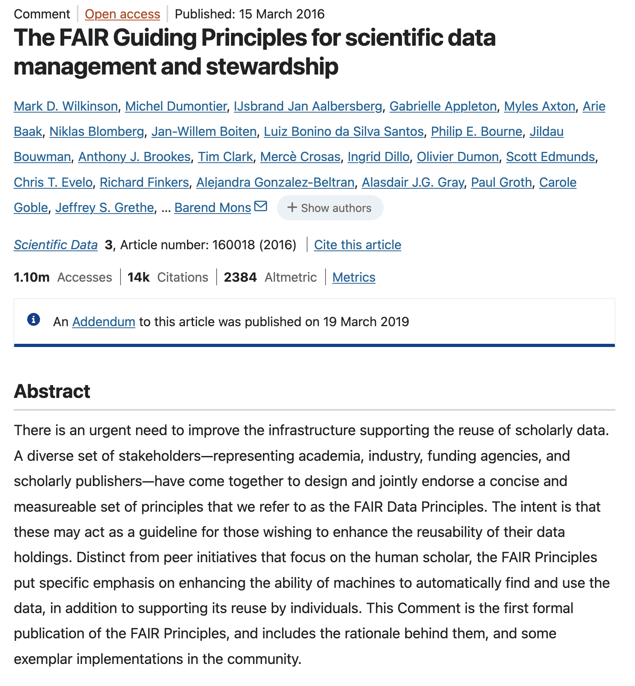
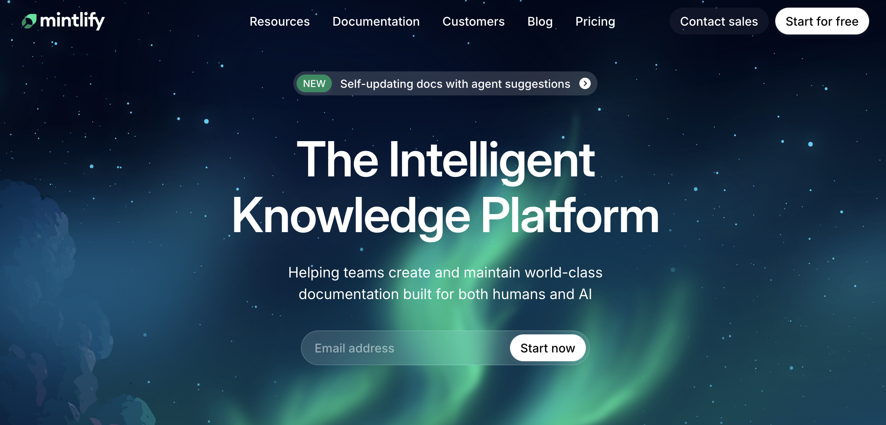

```{r setup, include=FALSE}
options(htmltools.dir.version = FALSE)
library(knitr)
opts_chunk$set(
  prompt = T,
  fig.align="center",
  dpi=300,
  cache=T,
  engine.opts = list(bash = "-l")
  )

knit_hooks$set(
  prompt = function(before, options, envir) {
    options(
      prompt = if (options$engine %in% c('sh','bash', 'zsh')) '$ ' else 'R> ',
      continue = if (options$engine %in% c('sh','bash', 'zsh')) '$ ' else '+ '
      )
})

options(repos = c(CRAN = "https://cran.rstudio.com/"))

if (!require("fontawesome", character.only = TRUE)) {
  install.packages("fontawesome", dependencies = TRUE)
  library(fontawesome, character.only = TRUE)
}
```

# Welcome back! 📋 {background-color="#2d4563"}

## Recap of last class

:::{style="margin-top: 20px; font-size: 24px;"}
:::{.columns}
:::{.column width=50%}
- Last time we explored [pipelines and monitoring]{.alert}
- AI systems are complex chains that can fail at any step
- Monitoring helps catch problems before users do
- Testing for properties, not exact outputs
- **Today**: We enter [Module 4, Data Ethics and Bias]{.alert}
- [Documentation]{.alert} as the first line of defence
- If you don't know where your data came from, [you can't fix bias]{.alert}
- Meta AI research scientist [Moustapha Cissé](https://venturebeat.com/technology/datasheets-could-be-the-solution-to-biased-ai): "_You are what you eat, and right now we feed our models junk food_."
:::

:::{.column width=50%}
:::{style="text-align: center; margin-top: -30px;"}
[{width="100%"}](#){data-modal-type="image" data-modal-url="figures/pipeline.png"}

Source: [Labellerr](https://www.labellerr.com/blog/top-platforms-to-manage-the-ai-ml-pipeline/)
:::
:::
:::
:::

## Lecture overview
### Today's agenda

:::{style="margin-top: 20px; font-size: 24px;"}

:::{.columns}
:::{.column width=50%}
**Part 1: Why Documentation Matters**

- The "nutrition label" for AI
- What happens without it (spoiler: chaos)
- Documentation as accountability

**Part 2: Datasheets for Datasets**

- What, why, how, who, when
- Reading and writing datasheets
- Hands-on: Create your own!
:::

:::{.column width=50%}
**Part 3: Model Cards**

- What does the model do (and not do)?
- Intended uses and limitations
- Ethical considerations

**Part 4: LLM Training Data Governance**

- How modern AI datasets are documented
- LAION, Common Crawl, and data provenance
- The FAIR principles for research data
:::
:::
:::

## Fun fact of the day! 😁

:::{style="margin-top: 20px; font-size: 24px; text-align: center;"}
[{width="60%"}](#){data-modal-type="image" data-modal-url="figures/fun-fact.png"}

Source: [Reddit](https://www.reddit.com/r/dataisbeautiful/comments/1qu5ccf/the_chatgpt_effect_ai_domain_registrations_grew/)
:::

## Revolting fact of the day! 😠

:::{style="margin-top: 20px; font-size: 24px; text-align: center;"}
:::{.columns}
:::{.column width=50%}
[{width="100%"}](#){data-modal-type="image" data-modal-url="figures/meta.png"}

:::

:::{.column width=50%}
[{width="100%"}](#){data-modal-type="image" data-modal-url="figures/meta-2.png"}

Source: [Mashable](https://mashable.com/article/meta-ai-ray-ban-glasses-intimate-videos-workers)
:::
:::
:::

# Why Documentation Matters 📝 {background-color="#2d4563"}

## The horror stories: What happens without documentation

:::{style="margin-top: 30px; font-size: 18px;"}
:::{.columns}
:::{.column width=55%}
**ImageNet's hidden problems (2019):**

- Most influential computer vision dataset ever
- Powered 10+ years of AI research
- [Nobody knew]{.alert} where the images came from!
- Later discovered:
  - Scraped from Flickr without consent
  - Racist and sexist labels ([MTurk](https://www.mturk.com/) workers)
  - Non-consensual photos of minors
  - Content from revenge porn sites

**The root cause?**

> They built it quickly and never documented what they were doing!

[Thousands of AI systems were built on this undocumented foundation!]{.alert}
:::

:::{.column width=45%}
:::{style="text-align: center;"}
[{width="100%"}](#){data-modal-type="image" data-modal-url="figures/imagenet-issues.webp"}

Source: [Excavating AI](https://excavating.ai/) (great resource, check it out!)
:::
:::
:::
:::

## Documentation as accountability

:::{style="margin-top: 30px; font-size: 22px;"}
:::{.columns}
:::{.column width=55%}
**Without documentation, we can't:**

- ❌ Know if data were collected ethically
- ❌ Identify sources of bias
- ❌ Determine if a model is appropriate for a use case
- ❌ Assign responsibility when things go wrong
- ❌ Reproduce or verify results
- ❌ Update or fix problems later

**With documentation, we can:**

- ✅ Make informed choices about using a dataset
- ✅ Trace bias back to its source
- ✅ Match models to appropriate applications
- ✅ Hold creators accountable
- ✅ Build trust with users and regulators
:::

:::{.column width=45%}
:::{style="background: rgba(45, 69, 99, 0.1); padding: 15px; border-radius: 10px;"}
**The legal angle:**

Regulations are [now requiring]{.alert} documentation:

- **EU AI Act**: Mandates documentation for high-risk AI
- **NYC Law 144**: Requires bias audits (needs documentation!)
- **California CCPA**: Data transparency requirements

We'll cover US vs EU regulations in detail in [Lecture 17]{.alert}.

If you can't document it, you [can't deploy it]{.alert} (legally).
:::
:::
:::
:::

## The three pillars: Datasheets, Model Cards, and System Cards

:::{style="margin-top: 30px; font-size: 21px;"}
:::{style="text-align: center;"}
[{width="60%"}](#){data-modal-type="image" data-modal-url="figures/ai-model-cards.jpg"}

Source: [Laurel Papworth](https://laurelpapworth.com/datasheets-model-cards/)
:::

:::{style="margin-top: 20px;"}
They originated from landmark papers: [Gebru et al. (2018)](https://arxiv.org/abs/1803.09010) for datasheets and [Mitchell et al. (2019)](https://arxiv.org/abs/1810.03993) for model cards.

These are now [industry standards]{.alert} adopted by [Google](https://deepmind.google/models/model-cards/), [Microsoft](https://azure.microsoft.com/en-us/products/ai-foundry/models), [Hugging Face](https://huggingface.co/docs/hub/en/model-cards), and others!
:::
:::

# Datasheets for Datasets 📊 {background-color="#2d4563"}

## What is a datasheet?

:::{style="margin-top: 30px; font-size: 22px;"}
:::{.columns}
:::{.column width=55%}
**Inspired by electronics industry:**

- Every electronic component has a "datasheet"
- Spec sheet with all relevant information
- Engineers can make informed decisions

**[Timnit Gebru et al. (2018)](https://arxiv.org/abs/1803.09010) proposed the same for datasets:**

> "A datasheet documents the motivation, composition, collection process, recommended uses, and other information about a dataset."

**Core sections:**

[Motivation, Composition, Collection, Preprocessing, Uses, Distribution, Maintenance]{.alert}
:::

:::{.column width=45%}
:::{style="text-align: center;"}
[{width="100%"}](#){data-modal-type="image" data-modal-url="figures/datasheet.png"}

:::{style="font-size: 18px; margin-top: 15px;"}
Source: [Jonathan Rystrøm (2024) - Dataset Card: Multicultural WVS Alignment](https://huggingface.co/datasets/ryzzlestrizzle/multicultural-wvs-alignment)
:::
:::
:::
:::
:::

## What a datasheet answers

:::{style="margin-top: 30px; font-size: 18px;"}
:::{.columns}
:::{.column width=50%}
[Motivation:]{.alert}

- Why was the dataset created?
- Who created it and who funded it?
- What task was it designed for?

[Composition:]{.alert}

- What types of data are included?
- How many instances are there?
- Is there any sensitive information?
- Are there known errors or noise?

[Collection:]{.alert}

- How was data collected (scraped, survey, sensors)?
- Was consent obtained?
- Who were the data subjects?
- What timeframe was covered?
:::

:::{.column width=50%}
[Preprocessing:]{.alert}

- Was data cleaned or filtered?
- Were any instances removed?
- How was data labelled?

[Uses:]{.alert}

- What tasks has it been used for?
- What should it [NOT]{.alert} be used for?
- Are there known impact areas?

[Distribution:]{.alert}

- How is the dataset shared?
- Is it versioned?

[Maintenance:]{.alert}

- Who is responsible for updates?
- Is there a way to report issues?
:::
:::
:::

## Example: A good datasheet

:::{style="margin-top: 30px; font-size: 20px;"}
:::{.columns}
:::{.column width=55%}
**The [CHoRUS Dataset Datasheet](https://bridge2ai.github.io/data-sheets-schema/html_output/concatenated/curated/CHORUS_human_readable.html) (excerpt):**

:::{style="background: rgba(45, 69, 99, 0.1); padding: 15px; border-radius: 10px; font-size: 15px;"}
**Motivation:**

Develop diverse, ethically sourced, AI-ready dataset to improve recovery from acute illness, with attention to diversity, equity, and Social Determinants of Health.

**Composition:**

23,400 hospital admissions from 14 hospitals. Multi-modal: EHR, waveforms, imaging (DICOM), clinical notes (OHNLP), EEG data.

**Ethical considerations:**

- Multi-site IRB approvals
- Patient-focused ethical frameworks
- BRIDGE Center ethics expertise on AI/ML biases

**Recommended uses:**

AI/ML for clinical care, particularly acute illness recovery prediction.

**NOT recommended for:**

Re-identification of patients (prohibited), applications perpetuating bias or discrimination.
:::
:::

:::{.column width=45%}
:::{style="text-align: center; margin-top: 20px;"}
[{width="50%"}](#){data-modal-type="image" data-modal-url="figures/chorus-datasheet.jpeg"}

:::{style="font-size: 18px; margin-top: 15px;"}
Source: [BRIDGE Center](https://bridge2ai.github.io/data-sheets-schema/html_output/concatenated/curated/CHORUS_human_readable.html)
:::
:::
:::
:::
:::

## Activity: Let's read a real datasheet! 📖

:::{style="margin-top: 30px; font-size: 21px;"}
:::{.columns}
:::{.column width=50%}
**Read Anthropic's HH-RLHF Dataset Card:**

1. Visit [Anthropic/hh-rlhf](https://huggingface.co/datasets/Anthropic/hh-rlhf)
2. Read the Dataset Card carefully
3. This dataset is used to train AI assistants to be [helpful and harmless]{.alert}!

**Questions to answer:**

- What are the [two types]{.alert} of data in this dataset?
- Why does Anthropic warn against using this for supervised training of dialogue agents?
- What content warning does the dataset include?
- How can you contact the authors with issues?
:::

:::{.column width=50%}
**Evaluate the documentation:**

- ✅ Clear purpose: Train preference/reward models for RLHF
- ✅ Explicit warnings about misuse (don't train chatbots directly!)
- ✅ Content disclaimer about harmful material
- ✅ Links to papers for methodology details
- ✅ Contact email provided

**Discussion:**

- Would you be comfortable using this dataset?
- What [ethical responsibilities]{.alert} come with accessing data that contains harmful content for research purposes?

⏱️ 3 minutes to explore!
:::
:::
:::

# Model Cards 🤖 {background-color="#2d4563"}

## What is a model card?

:::{style="margin-top: 30px; font-size: 19px;"}
:::{.columns}
:::{.column width=55%}
**The "user manual" for AI models:**

Just like datasheets document data, [model cards]{.alert} document models.

**Margaret Mitchell et al. (2019):**

> "Model cards are short documents accompanying trained ML models that provide benchmarked evaluation in a variety of conditions."

**Core sections:**

1. **Model details**: What is this model?
2. **Intended use**: What should it be used for?
3. **Factors**: What affects performance?
4. **Metrics**: How was it evaluated?
5. **Training data**: What was it trained on?
6. **Ethical considerations**: What could go wrong?
7. **Caveats and recommendations**: Warnings!
:::

:::{.column width=45%}
:::{style="text-align: center;"}
[{width="50%"}](#){data-modal-type="image" data-modal-url="figures/model-cards-paper.png"}

:::{style="font-size: 18px; margin-top: 15px;"}
Source: [Mitchell et al. (2019)](https://arxiv.org/abs/1810.03993)
:::
:::
:::
:::
:::

## Intended use: The most important section

:::{style="margin-top: 30px; font-size: 22px;"}
:::{.columns}
:::{.column width=55%}
**Why "intended use" matters:**

A hammer is a great tool. But:

- ✅ Intended use: Driving nails
- ❌ NOT intended for: Brain surgery

**Models need the same clarity:**

:::{style="font-size: 20px;"}
| Model | Intended Use | NOT For |
|-------|--------------|---------|
| Gemini 3 | Conversation, assistance | Medical diagnosis |
| Face detection | Placing cameras | Law enforcement ID |
| Sentiment analysis | Product feedback | Hiring decisions |
:::

**Without this guidance:**

People [will]{.alert} use models inappropriately and harm others.
:::

:::{.column width=45%}
:::{style="background: rgba(45, 69, 99, 0.1); padding: 15px; border-radius: 10px;"}
**Real example: [Gemini 3 Model Card](https://storage.googleapis.com/deepmind-media/Model-Cards/Gemini-3-Pro-Model-Card.pdf)** (edited and summarised)

**Intended use:**

"Assistance with a variety of text-based tasks"

**Out-of-scope:**

"Assistance with illegal activities"

"Chemical synthesis"

"Mental health crisis intervention"

:::
:::
:::
:::

## Disaggregated evaluation: Breaking it down

:::{style="margin-top: 30px; font-size: 21px;"}
:::{.columns}
:::{.column width=55%}
**Why overall accuracy isn't enough:**

- A model can be [90% accurate overall]{.alert}
- But 95% for Group A and 70% for Group B!

**Disaggregated evaluation** = report performance [separately]{.alert} for different groups.

**Real example: [OpenAI CLIP Model Card (2021)](https://github.com/openai/clip/blob/main/model-card.md)**

Gender classification accuracy using [FairFace](https://arxiv.org/abs/1908.04913) dataset:

:::{style="font-size: 18px;"}
| Race Category | Gender Accuracy |
|---------------|-----------------|
| Middle Eastern | [98.4%]{.alert} (highest) |
| White | [96.5%]{.alert} (lowest) |
| All races | >96% |
:::

Racial classification: ~93% | Age classification: ~63%
:::

:::{.column width=45%}
:::{style="background: rgba(230, 57, 70, 0.1); padding: 15px; border-radius: 10px; font-size: 18px;"}
**CLIP's bias findings:**

OpenAI found [significant disparities]{.alert} when classifying people into crime-related categories:

- Performance varied by race and gender
- Disparities shifted based on how classes were constructed
- Risk of denigration harms identified

> "We tested the risk of certain kinds of denigration with CLIP by classifying images of people from Fairface into crime-related and non-human animal categories."
:::

:::
:::
:::

## System cards vs model cards

:::{style="margin-top: 30px; font-size: 20px;"}
:::{.columns}
:::{.column width=55%}
**A newer concept: System Cards**

Modern AI products often chain several models together. A model card only covers one of them, so **system cards** document the [entire system]{.alert}.

**What's included in a system card:**

- Multiple models working together
- How components interact
- Human oversight mechanisms
- Deployment context and safeguards
- Red teaming and safety evaluations

**Who's using system cards:**

- **OpenAI**: Released [o1 System Card](https://openai.com/index/openai-o1-system-card/) in December 2024
- **Anthropic**: Publishes system cards for each Claude release
- **Meta**: Released 22 system cards in 2023 for their AI products
:::

:::{.column width=45%}
:::{style="background: rgba(45, 69, 99, 0.1); padding: 15px; border-radius: 10px; font-size: 20px;"}
**Model Card vs System Card:**

| Aspect | Model Card | System Card |
|--------|------------|-------------|
| Scope | Single model | Entire system |
| Focus | Performance | Safety + deployment |
| Audience | Developers | Developers + public |
| Includes | Training data, metrics | Red teaming, safeguards |
:::

:::{style="margin-top: 20px; text-align: center;"}
[{width="100%"}](#){data-modal-type="image" data-modal-url="figures/system-card.png"}

:::{style="font-size: 18px;"}
[OpenAI o1 System Card (Dec 2024)](https://openai.com/index/openai-o1-system-card)
:::
:::
:::
:::
:::

# LLM Training Data Governance 🗂️ {background-color="#2d4563"}

## How large AI datasets are built

:::{style="margin-top: 30px; font-size: 19px;"}
:::{.columns}
:::{.column width=55%}
**The data behind modern AI:**

Large language models and image generators are trained on [massive datasets]{.alert} scraped from the web. If you want to understand where bias comes from, start with how the data was collected.

**[Common Crawl](https://commoncrawl.org/): The foundation**

- Non-profit that crawls the web monthly
- Billions of web pages archived
- Raw HTML, metadata, and extracted text
- [Free and open]{.alert} for anyone to use
- No consent from content creators

**The pipeline:**

1. Common Crawl provides raw web data
2. Organisations filter and clean it
3. Datasets like LAION, The Pile, C4 are created
4. These train models like GPT, DALL-E, Stable Diffusion
:::

:::{.column width=45%}
:::{style="text-align: center; margin-top: 20px;"}
[{width="100%"}](#){data-modal-type="image" data-modal-url="figures/common-crawl.png"}

:::{style="font-size: 18px; margin-top: 10px;"}
Source: [Common Crawl](https://commoncrawl.org/)
:::
:::
:::
:::
:::

## Data provenance: Where did this come from?

:::{style="margin-top: 30px; font-size: 22px;"}
:::{.columns}
:::{.column width=55%}
**Data provenance** = Tracking data from source to use

Think of it like a [family tree]{.alert} for your data.

**Why it matters:**

1. **Debugging**: Where did this error originate?
2. **Compliance**: Can we legally use this data?
3. **Quality**: Has this data been properly validated?
4. **Reproducibility**: Can we recreate this analysis?

**Tools for tracking provenance:**

- **Data Provenance Explorer** (MIT): Generates summaries of dataset sources, licenses, and allowable uses
- **DVC** (Data Version Control): Git for data
- **MLflow**: Tracks experiments and data versions
:::

:::{.column width=45%}
:::{style="text-align: center;"}
[{width="100%"}](#){data-modal-type="image" data-modal-url="figures/data-lineage.webp"}

:::{style="font-size: 18px; margin-top: 15px;"}
Source: [Geeks for Geeks](https://www.geeksforgeeks.org/data-analysis/what-is-data-lineage/)
:::
:::

:::{style="margin-top: 15px; background: rgba(45, 69, 99, 0.1); padding: 15px; border-radius: 10px;"}
[Analogy]{.alert}: Like a food supply chain. If there's contamination, you need to trace it back to the source!
:::
:::
:::
:::

## Simplified example: Tracking data with Python

:::{style="margin-top: 20px; font-size: 20px;"}
:::{.columns}
:::{.column width=55%}
**What this code does:**

This is a simplified example of how you might track where your data comes from. In practice, tools like [DVC](https://dvc.org/) do this automatically

**Key concepts:**

- **source**: Where did the data originate?
- **collected_at**: When was it gathered?
- **transformations**: What processing was applied?
- **version**: Which version of the data is this?

**Why this matters:**

If your model starts behaving badly, you can trace back and ask: "Did the data change? Was a filter removed?"
:::

:::{.column width=45%}
:::{style="margin-top: 30px;"}
```python
# Simple data provenance tracking
# This is metadata, not actual data

provenance = {
    "dataset_name": "restaurant_reviews",
    "version": "2.1",
    "source": "yelp_api",
    "collected_at": "2024-01-15",
    "transformations": [
        "removed_duplicates",
        "filtered_english_only",
        "anonymised_usernames"
    ],
    "row_count": 50000,
    "known_issues": [
        "US restaurants only",
        "2023 reviews missing"
    ]
}
```

:::{style="margin-top: 10px; font-size: 16px; text-align: center;"}
This creates a "paper trail" for your dataset.
:::
:::
:::
:::
:::

# The FAIR Principles 🔬 {background-color="#2d4563"}

## FAIR: The gold standard for research data

:::{style="margin-top: 30px; font-size: 20px;"}
:::{.columns}
:::{.column width=55%}
**FAIR Principles (2016):**

A framework for making research data more useful, developed by the scientific community.

**F - Findable:**

- Data has a unique, persistent identifier (like a DOI)
- Rich metadata describes the data
- Registered in a searchable resource

**A - Accessible:**

- Retrievable by identifier using standard protocols
- Metadata remains accessible even if data isn't
- Clear authentication if access is restricted

**I - Interoperable:**

- Uses standardised formats and vocabularies
- Can be combined with other datasets
- Machine-readable

**R - Reusable:**

- Clear usage license
- Detailed provenance information
- Meets domain-relevant standards
:::

:::{.column width=45%}
:::{style="text-align: center;"}
[{width="100%"}](#){data-modal-type="image" data-modal-url="figures/fair-principles.png"}

:::{style="font-size: 18px; margin-top: 10px;"}
Source: [GO-FAIR](https://www.go-fair.org/fair-principles/)
:::
:::

:::{style="margin-top: 15px; background: rgba(45, 69, 99, 0.1); padding: 15px; border-radius: 10px;"}
The NIH, EU, and most major funders now [require]{.alert} FAIR data practices for grant-funded research.
:::
:::
:::
:::

# Data Governance in Practice 🏛️ {background-color="#2d4563"}

## Consent and the data supply chain

:::{style="margin-top: 30px; font-size: 22px;"}
:::{.columns}
:::{.column width=55%}
**The uncomfortable truth about AI training data:**

Most large AI models are trained on data [without explicit consent]{.alert}:

- Web scraping (your blog posts, photos, art)
- Social media posts (even "private" ones)
- Books and articles (often without author permission)
- Code repositories (GPL violations?)

**The consent problem:**

- You posted a photo to Instagram in 2015
- It was scraped into a dataset
- That dataset trained a facial recognition system
- That system is now used for surveillance
:::

:::{.column width=45%}
:::{style="background: rgba(230, 57, 70, 0.1); padding: 15px; border-radius: 10px;"}
**High-profile cases:**

- **LAION-5B**: Billions of images scraped; later found to contain child pornography (Source: [CNN](https://www.cnn.com/2023/12/21/tech/child-sexual-abuse-material-ai-training-data))
- **Clearview AI**: Scraped 30+ billion faces from social media (Source: [BBC](https://www.bbc.com/news/technology-67133157))
- **Getty Images vs. Stability AI**: Lawsuit over image scraping (rejected!) (Source: [Paul Weiss](https://www.paulweiss.com/insights/client-memos/getty-images-v-stability-ai-the-uk-courts-first-word-on-use-of-copyright-works-in-ai-model-development))
:::

:::{style="margin-top: 10px; font-size: 26px; text-align: center;"}
[Did you consent to this?]{.alert} 🤔
:::
:::
:::
:::

## Data rights movements: The future

:::{style="margin-top: 30px; font-size: 21px;"}
:::{.columns}
:::{.column width=55%}
**New movements emerging:**

**1. Data dignity:**

- "Your data = your labour"
- Companies should pay for data (like paying workers)
- [Jaron Lanier](https://cdss.berkeley.edu/video/data-dignity-and-inversion-ai-jaron-lanier), [Radical Markets movement](https://www.amazon.com/Radical-Markets-Uprooting-Capitalism-Democracy/dp/0691177503)

**2. Opt-out rights:**

- GDPR: Right to be forgotten
- CCPA: Right to know and delete
- AI training opt-out (some systems support this now)

**3. Data trusts:**

- Independent organisations manage data on your behalf
- Negotiate terms and protect privacy
:::

:::{.column width=45%}
:::{style="text-align: center; margin-top: 20px;"}
[{width="100%"}](#){data-modal-type="image" data-modal-url="figures/lanier.png"}

:::{style="font-size: 18px; margin-top: 10px;"}
Jaron Lanier, author of *Who Owns the Future?*
:::
:::

:::{style="margin-top: 15px; background: rgba(45, 69, 99, 0.1); padding: 15px; border-radius: 10px;"}
**Discussion**: Should YOU be paid when your data trains an AI that makes billions?
:::
:::
:::
:::

## Discussion: Who owns the data? 💭

:::{style="margin-top: 30px; font-size: 22px;"}
:::{.columns}
:::{.column width=50%}
**Scenario:**

You wrote a poem and posted it online in 2018. An AI company scraped it, and now their AI can write poems "inspired by" your style.

**Questions to debate:**

1. Did the company do anything wrong?
2. Should you be compensated?
3. Should you be able to opt out [retroactively]{.alert}?
:::

:::{.column width=50%}
**Different perspectives:**

:::{style="font-size: 20px;"}
**Tech companies**: "It's fair use, like learning from reading books"

**Artists**: "You're profiting from my creative work without consent"

**Lawyers**: "Current law wasn't designed for this"

**Users**: "I just want cool AI. I don't care about the source"
:::

:::{style="margin-top: 20px; background: rgba(45, 69, 99, 0.1); padding: 15px; border-radius: 10px;"}
**Your turn**: Where do you stand?
:::
:::
:::
:::

# Putting It Into Practice 🛠️ {background-color="#2d4563"}

## Tools for documentation

:::{style="margin-top: 30px; font-size: 20px;"}
:::{.columns}
:::{.column width=55%}
**Good news: Tools exist!**

**For Datasheets:**

- [Hugging Face Dataset Cards](https://huggingface.co/docs/hub/datasets-cards) — Standard format, easy to publish
- [Data Nutrition Project](https://datanutrition.org/) — Visual "nutrition labels"
- [Google Dataset Search](https://datasetsearch.research.google.com/) — Requires documentation to be indexed!

**For Model Cards:**

- [Hugging Face Model Cards](https://huggingface.co/docs/hub/model-cards) — Industry standard
- [TensorFlow Model Card Toolkit](https://github.com/tensorflow/model-card-toolkit) — Automated card generation
- [Google Model Cards](https://modelcards.withgoogle.com/about) — Example cards
:::

:::{.column width=45%}
**For Data Lineage:** (advanced)

- DVC (Data Version Control) - <https://dvc.org/>
- MLflow - <https://mlflow.org/>

:::{style="text-align: center;"}
[{width="100%"}](#){data-modal-type="image" data-modal-url="figures/mintlify.png"}
:::

:::{style="margin-top: 15px; background: rgba(45, 69, 99, 0.1); padding: 15px; border-radius: 10px;"}
Hugging Face [will not list]{.alert} a model or dataset without a card. Google Dataset Search ignores undocumented datasets entirely.
:::
:::
:::
:::

# Summary 📚 {background-color="#2d4563"}

## Main takeaways

:::{style="margin-top: 30px; font-size: 28px;"}

- `r fa('file-alt')` **Datasheets**: Document datasets with motivation, composition, and limitations

- `r fa('id-card')` **Model cards**: Document models with intended use, performance by group, and ethics

- `r fa('sitemap')` **System cards**: Document entire AI systems including safety evaluations

- `r fa('project-diagram')` **Data lineage**: Track where data came from and how it changed

- `r fa('database')` **FAIR principles**: Findable, Accessible, Interoperable, Reusable data

- `r fa('user-check')` **Consent matters**: Much AI training data lacks proper consent

- `r fa('briefcase')` **Career opportunity**: Employers are hiring for documentation and data governance roles

:::

# ...and that's all for today! 🎉 {background-color="#2d4563"}