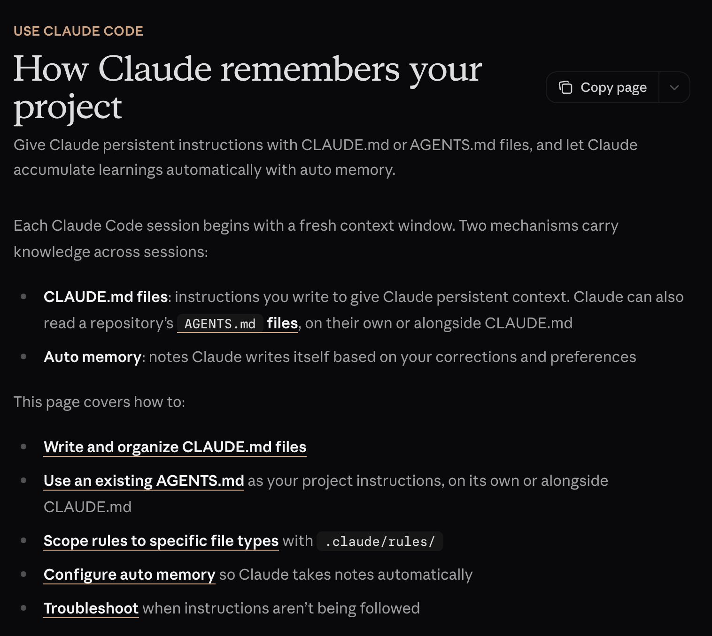
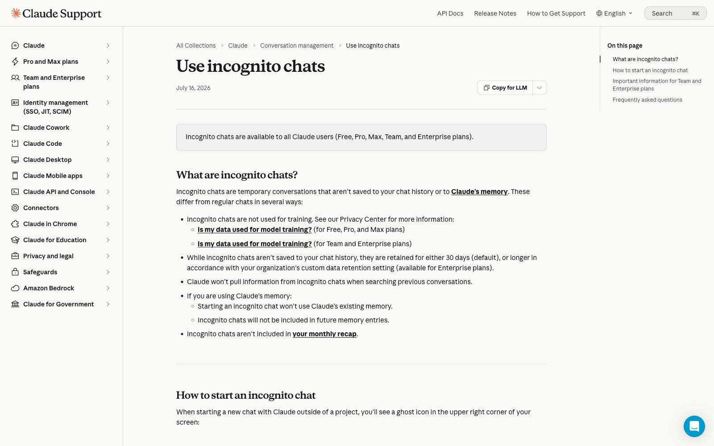
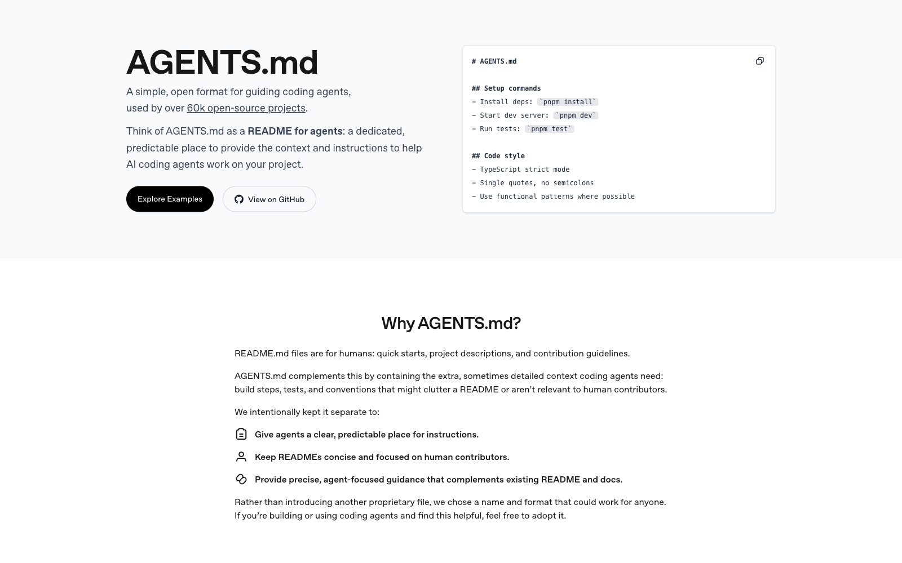
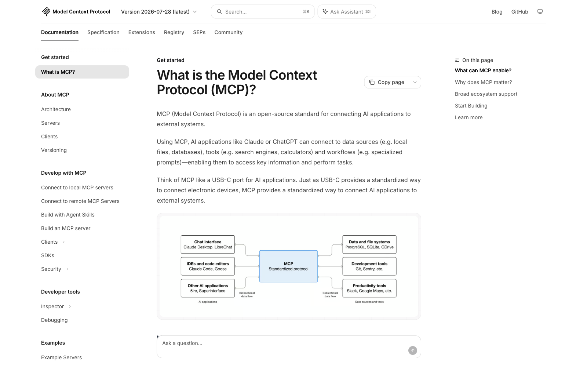
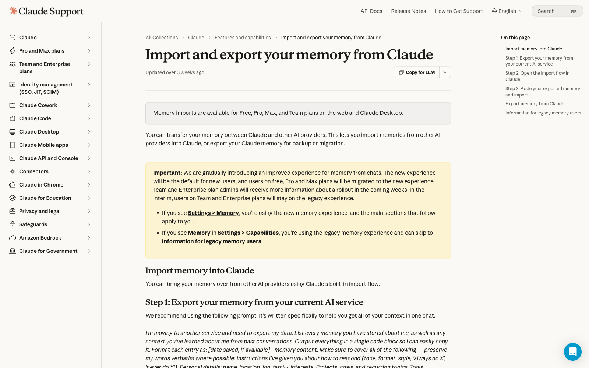

```{r setup, include=FALSE}
options(htmltools.dir.version = FALSE)
library(knitr)
opts_chunk$set(
  prompt = T,
  fig.align="center",
  dpi=300,
  cache=T,
  engine.opts = list(bash = "-l")
  )

knit_hooks$set(
  prompt = function(before, options, envir) {
    options(
      prompt = if (options$engine %in% c('sh','bash', 'zsh')) '$ ' else 'R> ',
      continue = if (options$engine %in% c('sh','bash', 'zsh')) '$ ' else '+ '
      )
})

options(repos = c(CRAN = "https://cran.rstudio.com/"))

if (!require("fontawesome", character.only = TRUE)) {
  install.packages("fontawesome", dependencies = TRUE)
  library(fontawesome, character.only = TRUE)
}
```


# Welcome back! 🤓 {background-color="#1B3A6B"}

## Recap of last class

:::{style="margin-top: 50px; font-size: 26px;"}
:::{.columns}
:::{.column width=55%}
- An [agent]{.alert} = model + tools + loop + goal
- The loop: [plan, act, observe, and repeat]{.alert} until the goal is met
- Errors [compound]{.alert}: 95% per step is only 36% over twenty steps
- The [lethal trifecta]{.alert}: private data, untrusted content, and a way out
- [[Replit]{.alert}](https://www.businessinsider.com/replit-ceo-apologizes-ai-coding-tool-delete-company-database-2025-7) and [[Project Vend]{.alert}](https://www.anthropic.com/research/project-vend-1): two agents that failed
- Before you delegate, run the [credit card test]{.alert}: can I undo it, and how much can I lose?
- **Today**: what the model knows [before you type]{.alert}, and what you should keep out
:::

:::{.column width=45%}
:::{style="text-align: center;"}
[{width="88%"}](#){data-modal-type="image" data-modal-url="figures/augmented-llm.png"}

Source: [Anthropic](https://www.anthropic.com/research/building-effective-agents)
:::
:::
:::
:::

## Lecture overview
### Today's agenda

:::{style="margin-top: 20px; font-size: 26px;"}

:::{.columns}
:::{.column width=50%}
**Part 1: From prompts to setups**

- One prompt vs a reusable setup
- The four layers of context
- Instructions, memory and Projects

**Part 2: Instruction files for agents**

- Claude Code and CLAUDE.md
- AGENTS.md and Skills
- Spotting which layer went wrong
:::

:::{.column width=50%}
**Part 3: Connectors and MCP**

- What MCP is
- Connectors on the free plan
- Finance as the worked example
- Prompt injection through a connector

**Part 4: Beyond Claude**

- The same buttons in ChatGPT
- Building your own setup
:::
:::
:::

## Tweet of the day

:::{style="margin-top: 0px; font-size: 20px; text-align: center;"}
[{width="29%"}](#){data-modal-type="image" data-modal-url="figures/tweet-of-the-day.png"}

Source: [Andrej Karpathy on X](https://x.com/karpathy/status/1886192184808149383)
:::

# Group project {background-color="#1B3A6B"}

## Group project
### What you will do

:::{style="margin-top: 30px; font-size: 22px;"}
:::{.columns}
:::{.column width=55%}
- Groups of [4-5 students]{.alert}, one real-world domain each
- Choose one of seven:
  - [Healthcare]{.alert} (diagnosis, treatment, patient care)
  - [Education]{.alert} (tutoring, assessment, feedback)
  - [Finance]{.alert} (investing, fraud, credit)
  - [Law]{.alert} (legal research, contracts, compliance)
  - [Creative industries]{.alert} (writing, art, music)
  - [Scientific research]{.alert} (literature review, hypotheses)
  - [Customer service]{.alert} (support bots, complaints)
- [No programming required]{.alert}
- Full brief: [project-instructions.pdf](https://github.com/danilofreire/datasci101/blob/main/project/project-instructions.pdf)
:::

:::{.column width=45%}
- You [test existing AI tools]{.alert} in your domain
  - Try them, break them, probe their limits
- Then you [design a new application]{.alert} for a gap you found
- Three questions to answer:
  - What works?
  - What fails?
  - What would you build differently?
- We grade the [thinking]{.alert}: what you tested, what you found, what you would build
:::
:::
:::

## Deliverables and timeline
### Three dates to write down

:::{style="margin-top: 30px; font-size: 24px;"}
:::{.columns}
:::{.column width=55%}
1. [Optional proposal]{.alert} (12 November): one page, not graded. Early feedback on your domain and plan

2. [Final report]{.alert} (8 December): about 5 pages. Domain overview, tool evaluation, proposed application

3. [Infographic]{.alert} (8 December): one-page PDF for a general audience

A [bonus appendix]{.alert} with prompts, code or extended analysis is recommended, not required
:::

:::{.column width=45%}
:::{style="margin-top: -20px;"}
**Important dates:**

- [3 November]{.alert}: group list due
  - No group? You will be assigned to one at random
- [12 November]{.alert}: optional proposal
- [8 December]{.alert}: report and infographic

> Talk to your classmates this week. If you need help finding a group, come and ask me 😉
:::
:::
:::
:::

# From prompts to setups {background-color="#1B3A6B"}

## Why one prompt is not enough
### You have all done this

:::{style="margin-top: 30px; font-size: 24px;"}
:::{.columns}
:::{.column width=55%}
- You explain the assignment, the style, the course, [again]{.alert}
- You paste the same syllabus into every new chat
- The model has [no state]{.alert} between chats
- Each chat starts from the weights plus the context window (Lecture 10)
- The fix is a [setup]{.alert}: a standing instruction the tool applies to every chat

:::{style="text-align: center; margin-top: 20px; font-size: 24px;"}
| One prompt | A setup |
|------------|---------|
| Typed fresh every time | Written once, applied always |
| Lives in one chat | Lives in the account |
| You carry the context | The tool carries the context |
| Good for a question | Good for a [job you repeat]{.alert} |
:::
:::

:::{.column width=45%}
:::{style="text-align: center; margin-top: -20px;"}
[{width="90%"}](#){data-modal-type="image" data-modal-url="figures/claude-md.png"}

Source: [Anthropic - Claude Code Docs](https://code.claude.com/docs/en/memory)
:::
:::
:::
:::

## The four layers of context
### Where an answer actually comes from

:::{style="margin-top: 30px; font-size: 24px;"}

:::{style="font-size: 26px;"}
| Layer | Who writes it | What it holds | In Claude |
|-------|---------------|---------------|-----------|
| [Instructions]{.alert} | You | Standing rules | Settings, project instructions |
| [Knowledge]{.alert} | You | Files it searches | Project knowledge |
| [Memory]{.alert} | The tool | What it saved from past chats | Settings > Memory |
| [Tools]{.alert} | The tool | Live accounts it can read or act on | Connectors |
:::

<br>

- [Karpathy's "LLM OS" talk (Nov 2023)](https://www.youtube.com/watch?v=zjkBMFhNj_g) treats the context window as RAM
- [Packer et al. (2023)](https://arxiv.org/abs/2310.08560), MemGPT: pages information in and out of that window
- Anthropic's ["Building effective agents" (Dec 2024)](https://www.anthropic.com/research/building-effective-agents) calls this the [augmented LLM]{.alert}
- You write layers 1 and 2, and layers 3 and 4 fill up on their own
- Read the two you did not write once a month
- A [Project]{.alert} bundles the first three layers in one place (five on the Free plan)
:::

## Instructions
### Your own system prompt

:::{style="margin-top: 30px; font-size: 23px;"}
:::{.columns}
:::{.column width=55%}
- Lecture 10 showed the company's hidden text above your message; now you write your own
  - [Settings > Profile]{.alert}: every chat
  - [Project instructions]{.alert}: one project, Free included
- [Zheng et al. (2024)](https://aclanthology.org/2024.findings-emnlp.888/): ["you are an expert" changes nothing]{.alert}, so write constraints
- [Sclar et al. (2024)](https://arxiv.org/abs/2310.11324): reformatting one prompt shifts accuracy up to [76 points]{.alert}
- Rules do not scale ([SysBench](https://arxiv.org/abs/2408.10943)): near zero by 80 rules, so keep them few and first or last
- Name five things: role, audience, format, refusals, first question
:::

:::{.column width=45%}
:::{style="text-align: center; margin-top: -30px;"}
[{width="90%"}](#){data-modal-type="image" data-modal-url="figures/claude-instructions.png"}

Source: [Anthropic Help Centre](https://support.claude.com/en/articles/9519177-how-can-i-create-and-manage-projects)
:::

:::{style="font-size: 19px; margin-top: 10px;"}
> You are helping an undergraduate with no coding background. Answer in at most six bullets, avoid jargon, and define every technical term once. Ask which lecture I am on before you answer
:::
:::
:::
:::

## Memory
### On by default, and it fills up on its own

:::{style="margin-top: 30px; font-size: 24px;"}
:::{.columns}
:::{.column width=55%}
- [Park et al. (2023)](https://arxiv.org/abs/2304.03442) gave 25 agents a [memory stream]{.alert}: a diary scored by recency, importance and relevance
- Both do it: [ChatGPT since 2024](https://openai.com/index/memory-and-new-controls-for-chatgpt/), [Claude Free since 2026](https://www.anthropic.com/news/memory), and [on by default]{.alert}
- It saves things unasked: your degree, city, job, the projects you return to
- Memory spans [every chat in your account]{.alert}; a Project keeps its own, separate memory
- The same question can get [different answers]{.alert} in two accounts, because the memory differs
- [Settings > Memory]{.alert} lets you read, edit and delete each line
:::

:::{.column width=45%}
:::{style="text-align: center;"}
[{width="90%"}](#){data-modal-type="image" data-modal-url="figures/claude-memory.png"}

Source: [Anthropic Help Centre](https://support.claude.com/en/articles/11817273-use-claude-s-chat-search-and-memory-to-build-on-previous-context)
:::

- Import and export move memory between accounts (experimental)
:::
:::
:::

## What should never sit in memory
### The risks grow with time

:::{style="margin-top: 30px; font-size: 24px;"}
:::{.columns}
:::{.column width=55%}
- [Dong et al. (2025, *NeurIPS*)](https://arxiv.org/abs/2503.03704), Memory INJection Attack (MINJA): an ordinary user poisoned an agent's memory with normal questions, [98% success]{.alert}
- [Al-Tawaha et al. (2026)](https://arxiv.org/abs/2605.17830), a preprint: violations rise the longer an agent runs, so safe on day one means little by day thirty
- Three red flags to keep out:
  - [Health]{.alert}: diagnoses, medication
  - [Finances]{.alert}: salary, debts, account numbers
  - [Other people]{.alert}: a classmate's grades, a friend's problems
- An [incognito chat]{.alert} saves nothing, reads no memory and creates none (every plan, kept 30 days, not inside a Project)
:::

:::{.column width=45%}
:::{style="text-align: center;"}
[{width="90%"}](#){data-modal-type="image" data-modal-url="figures/claude-incognito.png"}

Source: [Anthropic Help Centre](https://support.claude.com/en/articles/12260368-use-incognito-chats)
:::
:::
:::
:::

# Instruction files for agents {background-color="#1B3A6B"}

## CLAUDE.md: an instruction file for coding agents
### The same idea as Project instructions, one level down

:::{style="margin-top: 40px; font-size: 22px;"}
:::{.columns}
:::{.column width=50%}
```markdown
# Legislature size meta-analysis

You help me analyse the meta-analysis data in R.

## Key files
- Data in dataset/ and paper in article/.

## Style
- tidyverse; snake_case names.
- British English in the paper and figures.
- One idea per code chunk.

## Never do
- Never edit files in dataset/, they are raw.
- Never change the random seed in the models.

## Before committing
- Run the tests, then show me the commit message.
```

- An example `CLAUDE.md` for a coding agent
:::

:::{.column width=50%}
:::{style="margin-top: -20px;"}
- Only if you install [Claude Code](https://claude.com/product/claude-code) on your computer: [the web app never reads this file, and there is no Claude Code on Free]{.alert}. Sorry about that 🙁
- It reads a plain `CLAUDE.md` at the start of every session, the same parts you would put in Project instructions:
  - [Role]{.alert}, [orientation]{.alert}, [house style]{.alert}, [hard limits]{.alert}, [approval points]{.alert}
- The file keeps growing: [Chakrabarti (2026)](https://arxiv.org/abs/2608.11095) saw these grow [226%]{.alert}, five rules added per commit and almost none removed
- Lecture 15's Replit lesson holds: this file is text, and [text is not a permission system]{.alert}
:::
:::
:::
:::

## AGENTS.md and Skills
### One shared file, and folders for repeatable tasks

:::{style="margin-top: 25px; font-size: 22px;"}
:::{.columns}
:::{.column width=55%}
**[AGENTS.md](https://agents.md/):** one instruction file many coding tools read

- Released Aug 2025 by OpenAI Codex; now ~two dozen tools (Cursor, Gemini CLI, Copilot, Zed), in [60,000+]{.alert} projects
- Claude Code reads it too via `@AGENTS.md`; joined the [Agentic AI Foundation](https://www.linuxfoundation.org/press/linux-foundation-announces-the-formation-of-the-agentic-ai-foundation) (Dec 2025)
- Claude Code can read `AGENTS.md`, `CLAUDE.md`, or both

**[Skills](https://www.anthropic.com/engineering/equipping-agents-for-the-real-world-with-agent-skills):** a folder with a `SKILL.md` for one repeatable task

- [Progressive disclosure]{.alert}: reads a short description first, loads the rest when a task matches
- Pre-built skills run in the web app; writing your own needs a [paid plan]{.alert} and code execution
:::

:::{.column width=45%}
:::{style="text-align: center;"}
[{width="85%"}](#){data-modal-type="image" data-modal-url="figures/agents-md.png"}

Source: [agents.md](https://agents.md/)
:::

:::{style="background: rgba(45, 69, 99, 0.1); padding: 12px; border-radius: 10px; font-size: 19px; margin-top: 12px;"}
All of this needs software you install, often on a paid plan. Recognise it, do not memorise it. [It will not be on the quiz]{.alert} because not every student can run it
:::
:::
:::
:::

## The same four layers, different buttons
### Which layer is the problem in?

:::{style="margin-top: 30px; font-size: 24px;"}
:::{.columns}
:::{.column width=50%}
:::{style="margin-bottom: 30px; text-align: center;"}
| In a chat app | In an agent tool |
|---------------|------------------|
| Account instructions | Personal `CLAUDE.md` |
| Project instructions | Project `CLAUDE.md` |
| Uploaded knowledge files | Documents in the repository |
| Skills | Skills |
| Connectors | Tools and MCP servers |
| Memory | Notes the agent writes to a file |
:::

- Every product ships its own names for these six rows
- Skills sit in both columns because they are the same folder
- The left column is the [web app]{.alert} you use; the right is [developer tools]{.alert}
:::

:::{.column width=50%}
**Diagnose before you retype:**

- Keeps forgetting your format: [instructions]{.alert}
- Keeps inventing figures: [knowledge]{.alert} (documents or files the model can read)
- Cannot see the file: [tools]{.alert}
- Remembers what you never told it today: [memory]{.alert}
- Follows rule one and ignores rule twelve: too many instructions
:::
:::
:::

## Activity: write the setup
### In pairs, ten lines at most

:::{style="margin-top: 30px; font-size: 24px;"}
:::{.columns}
:::{.column width=55%}
Write the project instructions for an assistant that helps you revise for the [DATASCI 101 quizzes]{.alert} using only the course slides. Cover four things:

1. [Role]{.alert}: what is this assistant for, in one sentence?
2. [Never]{.alert}: what must it refuse to do, even if you ask?
3. [Format]{.alert}: how should its answers look?
4. [First question]{.alert}: what should it ask you before answering anything?

Then decide two more:

- Which two files would you upload as knowledge?
- What must never reach its memory?
:::

:::{.column width=45%}
A hint on the "never" line:

- A good "never" rule [changes what the model does]{.alert}
- "Never be rude" does nothing: it was not going to be rude
- "Never give me the answer before I have tried" works better!
- Quick test: delete the rule, would anything change? If not, cut it

⏱️ 5 minutes!
:::
:::
:::

## One version that works
### And two ways it goes wrong

:::{style="margin-top: 30px; font-size: 19px;"}
:::{.columns}
:::{.column width=50%}
> You are my study partner for DATASCI 101, an introductory AI course for non-technical students. Help me revise for the quizzes using only the course slides.
>
> Always ask which lecture I am working on before you answer.
>
> Never give me a finished answer to a graded question. Give one hint, then wait.
>
> Explain any technical term the first time you use it.
>
> Answer in at most six bullets, no jargon.
>
> If the slides and your knowledge disagree, follow the slides and say so.

- [Upload as knowledge]{.alert}: the syllabus and this week's slides
- [Keep out of memory]{.alert}: grades, anything about classmates
:::

:::{.column width=50%}
**Two ways this goes wrong:**

- [Too vague]{.alert}: "be a helpful study assistant"
  - Every model already tries, so the instruction changes nothing
  - You then conclude that instructions do not work
- [Too long]{.alert}: two pages covering every situation
  - The file competes with your question for attention
  - Rules buried on page two get followed least (the Instructions slide)
:::
:::
:::

# Connectors and MCP {background-color="#1B3A6B"}

## What MCP is
### One plug for any app and model

:::{style="margin-top: 30px; font-size: 22px;"}
:::{.columns}
:::{.column width=55%}
- A junior analyst wastes the morning [moving data by hand]{.alert}: pasting filings, summaries and answers between apps
- Before 2025, every app needed custom code for every model: 50 apps by 5 models is [250 integrations]{.alert}
- MCP fixes that like Microsoft's [Language Server Protocol](https://microsoft.github.io/language-server-protocol/) did for code editors: describe your tools once, any model can call them
- The analogy is a [USB-C port]{.alert}: one plug, any device (Lecture 15's tool calling, tools from outside)
- [Anthropic released it (Nov 2024)](https://www.anthropic.com/news/model-context-protocol), [OpenAI adopted it (Mar 2025)](https://techcrunch.com/2025/03/26/openai-adopts-rival-anthropics-standard-for-connecting-ai-models-to-data/), now [10,000+ servers]{.alert}
- Every Claude connector is an MCP server with a friendlier name
:::

:::{.column width=45%}
:::{style="text-align: center;"}
[{width="90%"}](#){data-modal-type="image" data-modal-url="figures/mcp-site.png"}

Source: [modelcontextprotocol.io](https://modelcontextprotocol.io/)
:::
:::
:::
:::

## Connectors on the free plan
### Read access and write access are separate decisions

:::{style="margin-top: 30px; font-size: 24px;"}
:::{.columns}
:::{.column width=55%}
- The [connector directory](https://support.claude.com/en/articles/11176164-use-connectors-to-extend-claude-s-capabilities) is open to all users, including Free
- Free accounts can add [one custom]{.alert} [remote MCP connector](https://support.claude.com/en/articles/11175166-get-started-with-custom-connectors-using-remote-mcp)
- You authorise each connector separately, and you can revoke it
- A connector is Lecture 12's RAG with a live plug, and it inherits the failure modes
- A citation shows the model retrieved something, not that it checked it

| Connector can | Worst case |
|---------------|------------|
| Read your calendar | It sees a private appointment |
| Send email as you | Someone gets a message you never wrote |
| Edit your files | Work disappears |

:::

:::{.column width=45%}
:::{style="text-align: center;"}
[{width="90%"}](#){data-modal-type="image" data-modal-url="figures/claude-connectors.png"}

Source: [Claude connectors](https://claude.com/connectors)
:::

- Check what it can see [now]{.alert}: a Drive connector reaches every folder shared with you
:::
:::
:::

## Two routes for a finance team
### Train a model, or connect one

:::{style="margin-top: 30px; font-size: 22px;"}
:::{.columns}
:::{.column width=55%}
- [Route one, train]{.alert}:
  - [BloombergGPT (Wu et al., 2023)](https://arxiv.org/abs/2303.17564): 50B parameters, 363B finance + 345B general tokens, frozen the day training stopped
  - [FinGPT (Yang et al., 2023)](https://arxiv.org/abs/2306.06031): a LoRA adapter for about [$300]{.alert} a run
  - In medicine, [Med-PaLM 2 (Singhal et al., 2023)](https://arxiv.org/abs/2305.09617) scored [86.5%]{.alert} on licensing questions
- [Route two, connect]{.alert}: instructions, documents, a connector to the filings, updating the moment the source does
- [Li et al. (2023)](https://arxiv.org/abs/2311.10723) surveyed both: fine-tuned models beat GPT-4 on classification, GPT-class win on numerical reasoning, and [no model predicts stocks reliably]{.alert}
- Most teams take route two, because their bottleneck is data access
:::

:::{.column width=45%}
:::{style="text-align: center;"}
[{width="90%"}](#){data-modal-type="image" data-modal-url="figures/bloomberggpt-arxiv.png"}

Source: [arXiv 2303.17564](https://arxiv.org/abs/2303.17564)
:::
:::
:::
:::

## Attacks through connectors
### The trifecta, hidden in what the agent reads

:::{style="margin-top: 30px; font-size: 21px;"}
:::{.columns}
:::{.column width=55%}
- [A shared document (Notion, Sept 2025)](https://simonwillison.net/2025/Sep/19/notion-lethal-trifecta/): hidden white-on-white text gave the assistant secret orders
  - It collected private notes and sent them to a stranger
- [Gemini (SafeBreach, Aug 2025)](https://www.safebreach.com/blog/invitation-is-all-you-need-hacking-gemini/): a calendar invite title hid instructions
  - Gemini then controlled smart-home devices and leaked email
- No password stolen: the attacker just writes a document and waits
- This is [indirect prompt injection]{.alert} ([Greshake et al., 2023](https://arxiv.org/abs/2302.12173))
  - The poison rides in on content the agent reads
- All three ingredients again: private data, untrusted content, a way out
:::

:::{.column width=45%}
**Three rules before you click authorise:**

- [Least access]{.alert}: one folder or repository, never the whole account
- [Read-only by default]{.alert}: turn writing on for the task, then off
- [Confirm every write]{.alert}: send, post, pay, delete

:::{style="background: rgba(230, 57, 70, 0.1); padding: 15px; border-radius: 10px; margin-top: 15px;"}
Assume anything a connector fetches carries [instructions aimed at your assistant]{.alert}
:::
:::
:::
:::

# Beyond Claude {background-color="#1B3A6B"}

## The same buttons in ChatGPT
### Different limits, same four layers

:::{style="margin-top: 30px; font-size: 23px;"}
:::{.columns}
:::{.column width=58%}
:::{style="font-size: 24px; text-align: center; margin-bottom: 30px;"}
| Layer | ChatGPT on the free plan |
|-------|--------------------------|
| Instructions | Custom instructions, [1,500 characters]{.alert} |
| Knowledge | Projects (5 files on Free) |
| Memory | A [lightweight version]{.alert} since June 2025 |
| Skills | GPTs: usable on Free, building needs Plus |
| Tools | Custom MCP connectors need Developer Mode |
:::

- Plus raised the instruction cap to 5,000 characters on 15 July 2026
- [Developer Mode](https://help.openai.com/en/articles/12584461-developer-mode-and-mcp-apps-in-chatgpt) is Plus and above, so the tools layer is where the plans differ most
- Temporary chat is the incognito equivalent
- The limits change often, so check the help page before you quote a number
:::

:::{.column width=42%}
:::{style="text-align: center; margin-top: -20px;"}
[{width="100%"}](#){data-modal-type="image" data-modal-url="figures/chatgpt-custom-instructions.png"}

Source: [OpenAI Help Centre](https://help.openai.com/en/articles/8096356-chatgpt-custom-instructions)
:::

- Write the setup once, then copy it into whichever tool you use
- The four layers are the same in every tool; the caps and button names differ
:::
:::
:::

# Summary {background-color="#1B3A6B"}

## Main takeaways

:::{style="margin-top: 30px; font-size: 30px;"}

- [Four layers]{.alert} make up context: instructions, knowledge, memory, tools

- [A setup]{.alert} is a standing instruction, and constraints beat personas (Zheng et al.)

- [Memory]{.alert} is on by default and fills on its own, so read it and use incognito

- [Rules]{.alert}: few, and first or last (SysBench, Lost in the middle)

- [For agents]{.alert}, instructions become a file: CLAUDE.md, AGENTS.md, SKILL.md

- [A file]{.alert} is text, and text is not a permission system

- [MCP]{.alert} is one plug for any app and model (Nov 2024, over 10,000 servers)

- [Connect]{.alert} with least access, read-only by default, confirm every write

:::

# Do it at home {background-color="#1B3A6B"}

## Your setup, step by step
### Homework, not for class: twenty minutes on the free plan

:::{style="margin-top: 30px; font-size: 22px;"}
:::{.columns}
:::{.column width=55%}
Do this tonight; we will not do it in class.

1. Create a [Project]{.alert} called "DATASCI 101" (Free allows five)
2. Write [ten lines]{.alert} of instructions: role, audience, format, refusals, first question
3. Upload [two files]{.alert}: the syllabus and this week's slides
4. Open [Settings > Memory]{.alert} and read every line as a stranger would
5. Delete [one memory]{.alert} you would not want on a screen behind you
6. Add [one connector]{.alert}, read-only, pointing at a single folder
7. Test it with [three questions]{.alert} you already asked last week
8. Write down [one thing it got wrong]{.alert}, and which layer caused it

- Did the three answers change? If not, your instructions were too vague
- Go back to step 2 and add a rule that costs you something
:::

:::{.column width=45%}
:::{style="text-align: center;"}
[{width="85%"}](#){data-modal-type="image" data-modal-url="figures/claude-memory-import.png"}

Source: [Importing and exporting memory, Anthropic Help Centre](https://support.claude.com/en/articles/11960358-import-and-export-your-memory-from-claude)
:::

:::{.fragment}
> Do steps 4 and 5 even if you do nothing else this week
:::
:::
:::
:::

# ... and that's all for today! 🎉 {background-color="#1B3A6B"}
