```{r setup, include=FALSE}
options(htmltools.dir.version = FALSE)
library(knitr)
opts_chunk$set(
  prompt = T,
  fig.align="center",
  dpi=300,
  cache=T,
  engine.opts = list(bash = "-l")
  )

knit_hooks$set(
  prompt = function(before, options, envir) {
    options(
      prompt = if (options$engine %in% c('sh','bash', 'zsh')) '$ ' else 'R> ',
      continue = if (options$engine %in% c('sh','bash', 'zsh')) '$ ' else '+ '
      )
})

options(repos = c(CRAN = "https://cran.rstudio.com/"))

if (!require("fontawesome", character.only = TRUE)) {
  install.packages("fontawesome", dependencies = TRUE)
  library(fontawesome, character.only = TRUE)
}
```


# Welcome back! 🤓 {background-color="#1B3A6B"}

## Recap of last class
### From agents to setup

:::{style="margin-top: 20px; font-size: 19px;"}
:::{.columns}
:::{.column width=55%}
- Last time: an [agent]{.alert} is a model plus tools plus a loop plus a goal
- The loop: plan, act, [observe]{.alert}, repeat until the goal is met
- Reliability [multiplies away]{.alert}: 95% per step is 36% over twenty steps
- The [lethal trifecta]{.alert}: private data, untrusted content, a way to send it out
- Replit and Claudius: delegate by the [credit card test]{.alert}, reversibility times stakes
- **Today**: instructions, memory and connectors, or what the model [knows before you type]{.alert}
:::

:::{.column width=45%}
:::{style="text-align: center;"}
[{width="88%"}](#){data-modal-type="image" data-modal-url="figures/augmented-llm.png"}
:::

:::{.fragment}
> List what is in [your]{.alert} setup, and decide what should not be
:::
:::
:::
:::

## Lecture overview
### Today's agenda

:::{style="margin-top: 20px; font-size: 26px;"}

:::{.columns}
:::{.column width=50%}
**Part 1: From prompts to setups**

- Why one prompt is never enough
- The four layers of context
- Instructions, memory, and Projects

**Part 2: Instruction files for agents**

- CLAUDE.md and what goes in it
- AGENTS.md, one file many tools read
- Which layer is the problem in?
:::

:::{.column width=50%}
**Part 3: Connectors and MCP**

- The copy-paste problem
- One plug for any app and any model
- Finance as the worked example
- When the connected tool talks back

**Part 4: Do it yourself**

- Step by step in Claude, on the free plan
- The same buttons in ChatGPT
:::
:::
:::

## Tweet of the day

:::{style="margin-top: 0px; font-size: 20px; text-align: center;"}
[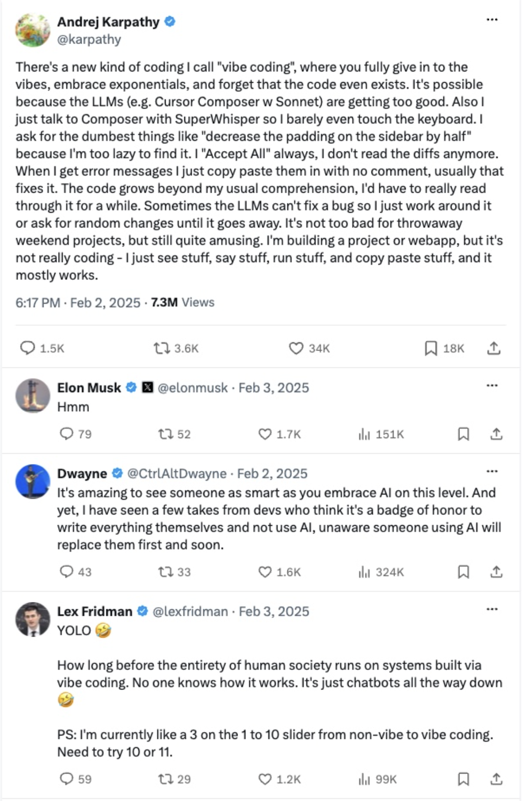{width="29%"}](#){data-modal-type="image" data-modal-url="figures/tweet-of-the-day.png"}

Source: [Andrej Karpathy on X](https://x.com/karpathy/status/1886192184808149383)
:::

# Group project 📋 {background-color="#1B3A6B"}

## Group project
### What you will do

:::{style="margin-top: 30px; font-size: 22px;"}
:::{.columns}
:::{.column width=55%}
- Groups of [4-5 students]{.alert}, one real-world domain each
- Choose one of seven:
  - [Healthcare]{.alert} (diagnosis, treatment, patient care)
  - [Education]{.alert} (tutoring, assessment, feedback)
  - [Finance]{.alert} (investing, fraud, credit)
  - [Law]{.alert} (legal research, contracts, compliance)
  - [Creative industries]{.alert} (writing, art, music)
  - [Scientific research]{.alert} (literature review, hypotheses)
  - [Customer service]{.alert} (support bots, complaints)
- [No programming required]{.alert}
- Full brief: [project-instructions.pdf](https://github.com/danilofreire/datasci101/blob/main/project/project-instructions.pdf)
:::

:::{.column width=45%}
- You [test existing AI tools]{.alert} in your domain
  - Try them, break them, probe their limits
- Then you [design a new application]{.alert} for a gap you found
- Three questions to answer:
  - What works?
  - What fails?
  - What would you build differently?
- We grade the [thinking]{.alert}: what you tested, what you found, what you would build
:::
:::
:::

## Deliverables and timeline
### Three dates to write down

:::{style="margin-top: 30px; font-size: 24px;"}
:::{.columns}
:::{.column width=55%}
1. [Optional proposal]{.alert} (12 November): one page, not graded. Early feedback on your domain and plan

2. [Final report]{.alert} (8 December): about 5 pages. Domain overview, tool evaluation, proposed application

3. [Infographic]{.alert} (8 December): one-page PDF for a general audience

A [bonus appendix]{.alert} with prompts, code or extended analysis is recommended, not required
:::

:::{.column width=45%}
**Key dates:**

- [3 November]{.alert}: group list due
  - No group? You will be assigned to one at random
- [12 November]{.alert}: optional proposal
- [8 December]{.alert}: report and infographic

:::{.fragment}
> Talk to your classmates this week. If you need help finding a group, come and ask us 😉
:::
:::
:::
:::

# From prompts to setups 🧠 {background-color="#1B3A6B"}

## Why one prompt is not enough
### You have all done this

:::{style="margin-top: 30px; font-size: 24px;"}
:::{.columns}
:::{.column width=55%}
- You explain the assignment, the style, the course, [again]{.alert}
- You paste the same syllabus into every new chat
- You close the tab and the model forgets everything
- Next week: the same 200 words of background
- A better prompt does not fix this. A [setup]{.alert} does
- Hire an assistant every morning → explain the job every morning
- Hire one → you explain it [once]{.alert}
:::

:::{.column width=45%}

| One prompt | A setup |
|------------|---------|
| Typed fresh every time | Written once, applied always |
| Lives in one chat | Lives in the account |
| You carry the context | The tool carries the context |
| Good for a question | Good for a [job you repeat]{.alert} |

A prompt is a request. A setup is a [standing instruction]{.alert}
:::
:::
:::

## The four layers of context
### Where an answer actually comes from

:::{style="margin-top: 30px; font-size: 22px;"}
:::{.columns}
:::{.column width=55%}
- [Instructions]{.alert}: standing rules you write
  - Who it is, how it answers
- [Knowledge]{.alert}: files you attach
  - Your syllabus, your notes, your data
- [Memory]{.alert}: what it saves from past chats, unasked
- [Tools]{.alert}: connected accounts it can read or act on
- Layers 1 and 2 are [things you write]{.alert}
- Layers 3 and 4 accumulate [on their own]{.alert}
  - People are surprised by what their assistant knows
  - [Who audits a layer they never typed?]{.alert}
- Change one layer → every answer after it changes
:::

:::{.column width=45%}
```{mermaid}
%%{init: {'theme': 'base', 'themeVariables': {'fontSize': '20px'}}}%%
flowchart TB
  A[Instructions] --> M[Model]
  B[Knowledge files] --> M
  C[Memory] --> M
  D[Tools] --> M
  M --> R[Answer]
```
:::
:::
:::

## Instructions: writing your own system prompt
### Remember system prompts from Lecture 10?

:::{style="margin-top: 10px; font-size: 18px;"}
:::{.columns}
:::{.column width=55%}
- In Lecture 10 a company wrote the hidden text above your message
- Now you write your own, in two boxes:
  - [Settings > Profile]{.alert}: applies to every chat you start
  - [Project instructions]{.alert}: one project only, on [all plans]{.alert} including Free
- Five things a good instruction names:
  - [Role]{.alert}: what this assistant is for, in one sentence
  - [Audience]{.alert}: who is reading, and what they already know
  - [Format]{.alert}: length, tone, British English, no jargon
  - [Refusals]{.alert}: what it must not do, even when you ask nicely
  - [First question]{.alert}: what it should check before answering
- Nothing here is a prompting trick. It is a job description
:::

:::{.column width=45%}
:::{style="text-align: center;"}
[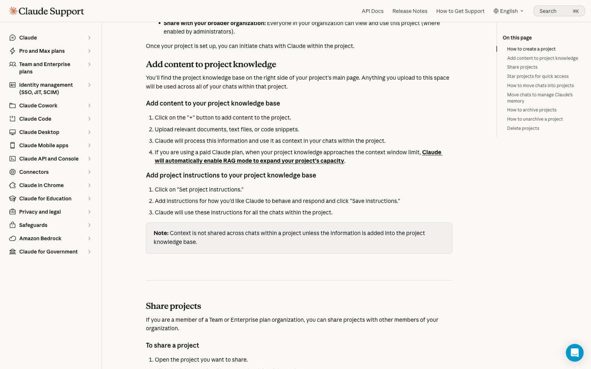{width="62%"}](#){data-modal-type="image" data-modal-url="figures/claude-instructions.png"}

Source: [Anthropic Help Centre](https://support.claude.com/en/articles/9519177-how-can-i-create-and-manage-projects)
:::

**Three lines that already change the output:**

> You are helping an undergraduate with no coding background. Answer in at most six bullets, British English, and define every technical term once. Ask which lecture I am on before you answer
:::
:::
:::

## Memory: what it keeps without asking
### On by default, on every plan

:::{style="margin-top: 10px; font-size: 18px;"}
:::{.columns}
:::{.column width=55%}
- [Memory]{.alert} is on by default for Free, Pro and Max
- What it stores, without being asked:
  - Preferences you state once (British English, six bullets)
  - Facts you drop in passing: your degree, your city, your job
  - Projects you keep coming back to across weeks
- [Settings > Memory]{.alert}: read it, edit any line, delete any line
  - Open the panel once a month and read it as a stranger would
- [Import and export]{.alert} move memory between accounts, both on Free
- An [incognito chat]{.alert} is not saved and does not update memory
  - Use it for anything you would not want written down
:::

:::{.column width=45%}
:::{style="text-align: center;"}
[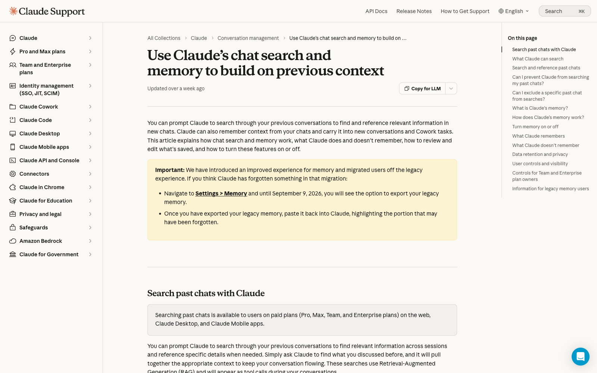{width="54%"}](#){data-modal-type="image" data-modal-url="figures/claude-memory.png"}

Source: [Anthropic Help Centre](https://support.claude.com/en/articles/12260368-use-incognito-chats)
:::

**Three red flags that should never sit in memory:**

- [Health]{.alert}: diagnoses, medication, appointments
- [Finances]{.alert}: salary, debts, card and account numbers
- [Other people]{.alert}: a classmate's grades, a friend's problems

Anything you would lock away does not belong in memory
:::
:::
:::

## Projects: three layers in one place
### Five of them on the free plan

:::{style="margin-top: 10px; font-size: 18px;"}
:::{.columns}
:::{.column width=55%}
- A [Project]{.alert} bundles three of the four layers in one place
  - [Instructions]{.alert}: the rules every chat inside it follows
  - [Knowledge]{.alert}: the files it searches before it answers
  - [Memory]{.alert}: what it keeps from the chats inside it
- Up to [five projects]{.alert} on the Free plan
- Uploaded files are the [RAG]{.alert} from Lecture 12, without the code
  - Same failure mode: it finds the wrong page and answers anyway
- Three you could build tonight:
  - [Study helper]{.alert}: this syllabus, the slides, your own notes
  - [Job applications]{.alert}: your CV, the roles you want, your writing style
  - [Thesis or group project]{.alert}: the brief, your readings, the draft
- One project with everything retrieves worse than three focused ones
:::

:::{.column width=45%}
:::{style="text-align: center;"}
[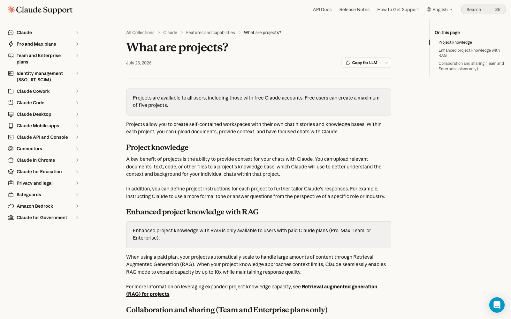{width="88%"}](#){data-modal-type="image" data-modal-url="figures/claude-projects.png"}

Source: [Anthropic Help Centre](https://support.claude.com/en/articles/9517075-what-are-projects)
:::

- The project box is the one setting most students never open
- It is also the only one that changes [every]{.alert} answer in the project
:::
:::
:::

# Instruction files for agents 📄 {background-color="#1B3A6B"}

## When instructions become a file
### CLAUDE.md, and its three scopes

:::{style="margin-top: 10px; font-size: 20px;"}
:::{.columns}
:::{.column width=55%}
- In a chat window, instructions live in a settings box
- For an [agent]{.alert} on your files (Lecture 15), they live in a file
  - Read at the start of every session, before your first word
- Claude Code calls it [CLAUDE.md]{.alert}: plain text with headings
  - No code, no configuration format, no schema to learn

| File | Applies to |
|------|-----------|
| `~/.claude/CLAUDE.md` | Everything you do, on this machine |
| `./CLAUDE.md` | This project, shared with your team |
| `CLAUDE.local.md` | This project, only you |

- The three stack, and the local file never reaches your teammates
- `@path/to/file.md` imports another file, so one rule lives in one place
- A `.claude/rules/` folder splits a long file into topics
:::

:::{.column width=45%}
:::{style="text-align: center;"}
[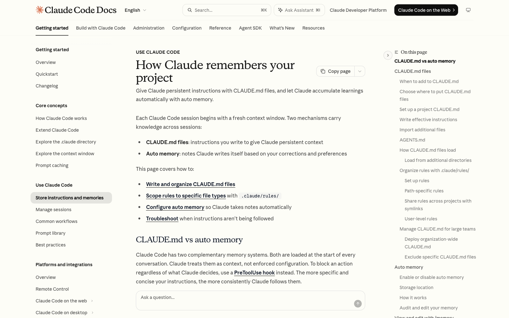{width="95%"}](#){data-modal-type="image" data-modal-url="figures/claude-md-docs.png"}

Source: [Claude Code docs](https://code.claude.com/docs/en/memory)
:::

- Your personal file is the one that pays off fastest: write it once, and every project inherits it
:::
:::
:::

## A real CLAUDE.md, annotated
### Four ingredients

:::{style="margin-top: 0px; font-size: 19px;"}
:::{.columns}
:::{.column width=55%}
```markdown
# Course materials repository

You help me write lecture slides in Quarto.

## Writing rules
- Always British English spelling.
- Sentence case in headings, no title case.
- One claim per bullet; keep bullets short.

## Never do
- Never modify syllabus.qmd.
- Never delete an existing lecture file.

## Before committing
- Show me the commit message first.
```
:::

:::{.column width=45%}
- [Role]{.alert}: one line saying what the job is
- [House style]{.alert}: rules you would otherwise repeat weekly
- [Hard limits]{.alert}: the "never" list, as bare commands
- [Approval points]{.alert}: where it must stop and ask

Two things this file is [not]{.alert}:

- Documentation. Only the agent reads it, so write commands
- A guardrail. Lecture 15's Replit case: "do not change anything" is [text, not a permission system]{.alert}

The same four ingredients work in a Claude Project box
:::
:::
:::

## AGENTS.md: one file, many tools
### Released by OpenAI, August 2025

:::{style="margin-top: 10px; font-size: 18px;"}
:::{.columns}
:::{.column width=55%}
- Every coding tool invented its own instruction file
  - Users kept four copies of the same rules, and edited three of them
- [AGENTS.md]{.alert} is the shared answer, an [open format](https://agents.md/)
  - No schema, no required fields, no validator
- Headings a human can read: setup, tests, style, what to avoid
  - Read by Codex, Cursor, Devin, Gemini CLI, Copilot and VS Code
  - Used in more than [60,000 public repositories]{.alert}
- Claude Code still reads CLAUDE.md, not AGENTS.md
  - Bridge the two with one line: `@AGENTS.md`
- [9 December 2025]{.alert}: given to the [Agentic AI Foundation]{.alert}
  - Part of the Linux Foundation, so no one company owns it
  - MCP and goose went to the same foundation on the same day
:::

:::{.column width=45%}
:::{style="text-align: center;"}
[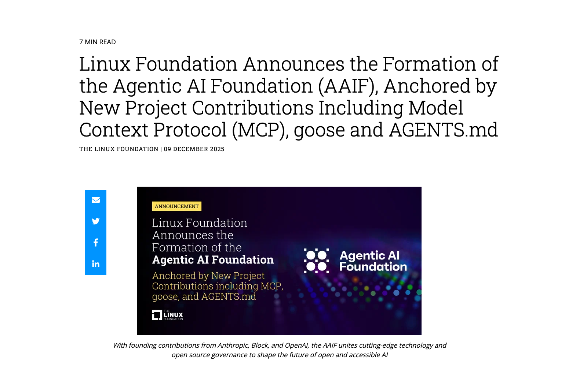{width="66%"}](#){data-modal-type="image" data-modal-url="figures/aaif-announcement.png"}

Source: [Linux Foundation](https://www.linuxfoundation.org/press/linux-foundation-announces-the-formation-of-the-agentic-ai-foundation)
:::

- Same idea for one repeatable task: a [skill]{.alert}, a folder with a `SKILL.md` inside
  - [Launched 16 October 2025](https://claude.com/blog/skills), on the Free plan
  - The model reads the description first, then loads the rest only when the task calls for it
  - A file for who you are, a skill for what you do often
:::
:::
:::

## The same four layers, different buttons
### Which layer is the problem in?

:::{style="margin-top: 20px; font-size: 21px;"}
:::{.columns}
:::{.column width=50%}

| In a chat app | In an agent tool |
|---------------|------------------|
| Account instructions | Personal `CLAUDE.md` |
| Project instructions | Project `CLAUDE.md` |
| Uploaded knowledge files | Documents in the repository |
| Skills | Skills |
| Connectors | Tools and MCP servers |
| Memory | Notes the agent writes to a file |

- Every product ships its own names for these six rows
- Skills sit in both columns because they are the same object: a folder the tool loads on demand
- A new tool is not a new skill. Find its version of each row and you are set up in ten minutes
:::

:::{.column width=50%}
Job adverts ask for people who can "configure" AI tools. So diagnose before you retype:

- Keeps forgetting your format? [Instructions]{.alert}, not a better prompt
- Keeps inventing figures? [Knowledge]{.alert}
- Cannot see the file? [Tools]{.alert}
- Remembers what you never told it today? [Memory]{.alert}
- Follows rule one and ignores rule twelve? [Instructions]{.alert} again, and too many of them

The buttons move between tools. The four layers do not
:::
:::
:::

## Activity: write the setup 📝
### In pairs, ten lines at most

:::{style="margin-top: 30px; font-size: 24px;"}
:::{.columns}
:::{.column width=55%}
Write the project instructions for a "DATASCI 101 study helper". Cover four things:

1. [Role]{.alert}: what is this assistant for, in one sentence?
2. [Never]{.alert}: what must it refuse to do, even if you ask?
3. [Format]{.alert}: how should its answers look?
4. [First question]{.alert}: what should it ask you before answering anything?

Then decide two more:

- Which two files would you upload as knowledge?
- What must never reach its memory?
:::

:::{.column width=45%}
A hint on the "never" line:

- The interesting rule is the one that [costs you something]{.alert}
- "Never be rude" costs nothing
- "Never give me the final answer before I have tried" costs you a shortcut, which is why it works

⏱️ 5 minutes!
:::
:::
:::

## Activity answers
### One version that works

:::{style="margin-top: 0px; font-size: 18px;"}
:::{.columns}
:::{.column width=50%}
> You are a study partner for DATASCI 101, an introductory AI course for non-technical students.
>
> Always ask which lecture I am working on before you answer.
>
> Never give me a finished answer to a graded question. Give one hint, then wait.
>
> Explain any technical term the first time you use it.
>
> Answer in at most six bullets, British English.
>
> If the slides and your knowledge disagree, follow the slides and say so.

- [Upload as knowledge]{.alert}: the syllabus and this week's slides
- [Keep out of memory]{.alert}: your grades, anything about classmates
:::

:::{.column width=50%}
Two ways this goes wrong:

- [Too vague]{.alert}: "Be a helpful study assistant and explain things clearly"
  - Every model already tries to do that
  - The instruction changes nothing, so you conclude instructions do not work
- [Too long]{.alert}: two pages covering every situation
  - Long files compete with your actual question for attention
  - Rules buried on page two get followed least

The test for any line: [could the assistant behave differently tomorrow because of it?]{.alert} If not, delete it
:::
:::
:::

# Connectors and MCP 🔌 {background-color="#1B3A6B"}

## MCP: one plug for any app
### From copy-paste to the Model Context Protocol

:::{style="margin-top: 10px; font-size: 18px;"}
:::{.columns}
:::{.column width=55%}
- A junior analyst's morning: download the 10-K, paste 40 pages in chunks, paste yesterday's summary, ask, copy the answer out
  - Four of those five steps are [moving data by hand]{.alert}, and need no human
- Uploading a file is a photograph. A [connector]{.alert} is a window
- Before 2025 every app needed custom code for every model
  - Fifty apps and five models → [250 integrations]{.alert} to build and maintain
- [MCP]{.alert} is one shared plug: an app describes its tools once, and any model can use them
- **25 November 2024**: [Anthropic releases MCP](https://www.anthropic.com/news/model-context-protocol)
- **26 March 2025**: [OpenAI adopts it](https://techcrunch.com/2025/03/26/openai-adopts-rival-anthropics-standard-for-connecting-ai-models-to-data/), and the standard stops being one company's
- **9 December 2025**: given to the [Agentic AI Foundation]{.alert}, with more than [10,000 public servers]{.alert} and [97 million]{.alert} SDK downloads a month

Source: [modelcontextprotocol.io](https://modelcontextprotocol.io/)
:::

:::{.column width=45%}
```{mermaid}
%%{init: {'theme': 'base', 'themeVariables': {'fontSize': '20px'}}}%%
flowchart LR
  A[Drive] --> P[MCP]
  B[Slack] --> P
  C[Your database] --> P
  P --> M1[Claude]
  P --> M2[ChatGPT]
  P --> M3[Any model]
```

- One plug, written once per app
- The analyst's five steps become one question
- Every connector in Claude's directory is an MCP server with a friendlier name
:::
:::
:::

## Connectors on the free plan
### Read access and write access are different decisions

:::{style="margin-top: 10px; font-size: 18px;"}
:::{.columns}
:::{.column width=55%}
- The connector directory is open to [all users]{.alert}, including Free
  - Google Drive, Gmail, Google Calendar, Slack, Notion, GitHub
- Free accounts can add [one custom remote MCP connector]{.alert}
- You authorise each one separately, and you can revoke it
- A connector is the [RAG]{.alert} from Lecture 12 with a live plug
  - Same failure modes: retrieval quality, and false confidence
  - A citation shows retrieval, not checking

| Connector can | Worst case if it goes wrong |
|---------------|-----------------------------|
| Read your calendar | It sees a private appointment |
| Send email as you | Someone gets a message you never wrote |
| Edit your files | Work disappears |

Source: [Help Centre](https://support.claude.com/en/articles/11176164-use-connectors-to-extend-claude-s-capabilities), [custom connectors](https://support.claude.com/en/articles/11175166-get-started-with-custom-connectors-using-remote-mcp)
:::

:::{.column width=45%}
:::{style="text-align: center;"}
[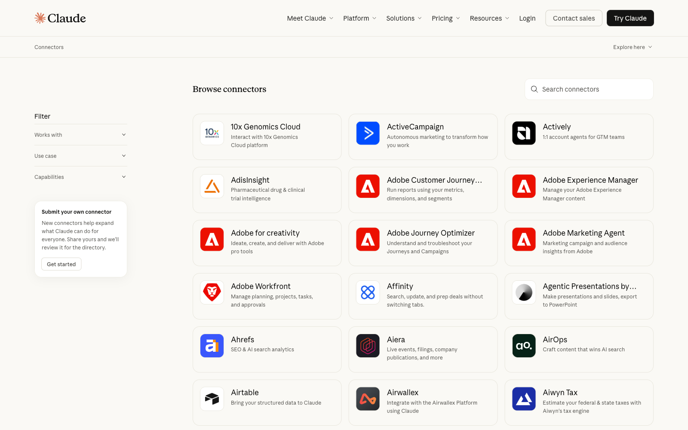{width="78%"}](#){data-modal-type="image" data-modal-url="figures/claude-connectors.png"}

Source: [Claude connectors](https://claude.com/connectors)
:::

- Ask what it can see [now]{.alert}, not what you meant to share
  - A Drive connector reaches every folder shared with you
  - A Gmail connector reads the thread you forgot about
- Grant reading freely. Grant writing slowly
:::
:::
:::

## Two routes for a finance team 📈
### Train a model, or connect one

:::{style="margin-top: 10px; font-size: 18px;"}
:::{.columns}
:::{.column width=55%}
- [Route one, train]{.alert}: buy the vocabulary
  - [BloombergGPT]{.alert}: 363 billion finance tokens, 345 billion general
  - That is 708 billion tokens, frozen the day training stopped
  - [FinGPT](https://github.com/AI4Finance-Foundation/FinGPT) trains a small LoRA adapter on LLaMA, under [$300 per run]{.alert}
  - Same route in medicine: [Med-PaLM 2](https://sites.research.google/gr/med-palm/) scored [86.5%]{.alert} on US licensing exam questions
- [Route two, connect]{.alert}: no training at all
  - Instructions, documents, a connector to the filings
  - It updates the moment the source updates
- **Rule of thumb** ([Li et al., 2023](https://arxiv.org/abs/2311.10723)):
  - Finance-tuned models win on sentiment and classification
  - GPT-class models win on numerical reasoning
  - For stock prediction, [no model is reliable]{.alert}
:::

:::{.column width=45%}
:::{style="text-align: center;"}
[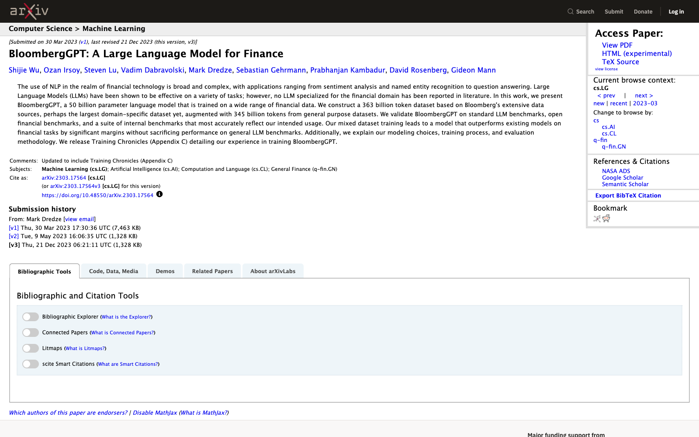{width="72%"}](#){data-modal-type="image" data-modal-url="figures/bloomberggpt-arxiv.png"}

Source: [arXiv 2303.17564](https://arxiv.org/abs/2303.17564)
:::

- Both trained models know the jargon. Neither is cheap to keep current
- Most teams take route two: their bottleneck is the data, and training does not fix that
:::
:::
:::

## When the connected tool talks back
### GitHub MCP, 26 May 2025

:::{style="margin-top: 20px; font-size: 20px;"}
:::{.columns}
:::{.column width=50%}
- Invariant Labs opened a [public issue]{.alert} on a public repository
- The issue text told the agent to copy the user's [private]{.alert} data
  - Into a public pull request
- The user asked their agent to "look at the issues"
- It did exactly that, and published the private data
- No password was stolen. The attacker [sent a document]{.alert} and waited
- A connector brings in text the model did not write
  - And models follow instructions found in text
  - Same shape as [SQL injection](https://xkcd.com/327/), thirty years on

Source: [Invariant Labs](https://invariantlabs.ai/blog/mcp-github-vulnerability)
:::

:::{.column width=50%}
:::{style="text-align: center;"}
[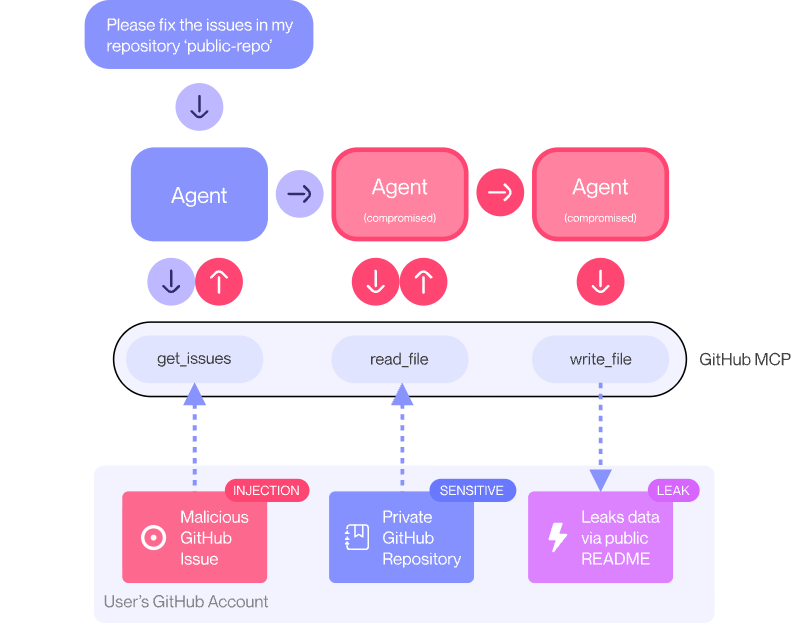{width="88%"}](#){data-modal-type="image" data-modal-url="figures/github-mcp-diagram.png"}

Source: [Invariant Labs](https://invariantlabs.ai/blog/mcp-github-vulnerability)
:::
:::
:::
:::

## The lethal trifecta
### Simon Willison, 16 June 2025, and the three rules that follow

:::{style="margin-top: 10px; font-size: 18px;"}
:::{.columns}
:::{.column width=52%}
Three ingredients. Hold all three and you have a problem:

- [Private data]{.alert} the agent can read
- [Untrusted content]{.alert} that reaches the agent
- A way to [send data out]{.alert}

- You met this in Lecture 15. Every connector you add moves you closer to holding all three
- [SafeBreach](https://www.safebreach.com/blog/invitation-is-all-you-need-hacking-gemini/), August 2025: a calendar invite carried hidden instructions, and Gemini controlled smart-home devices and leaked email
- [Notion 3.0](https://simonwillison.net/2025/Sep/19/notion-lethal-trifecta/), 19 September 2025: white text hidden in a PDF, and the agent sent workspace data out through a web search
- Which of the three does your Drive connector hand over on its own?
:::

:::{.column width=48%}
:::{style="text-align: center;"}
[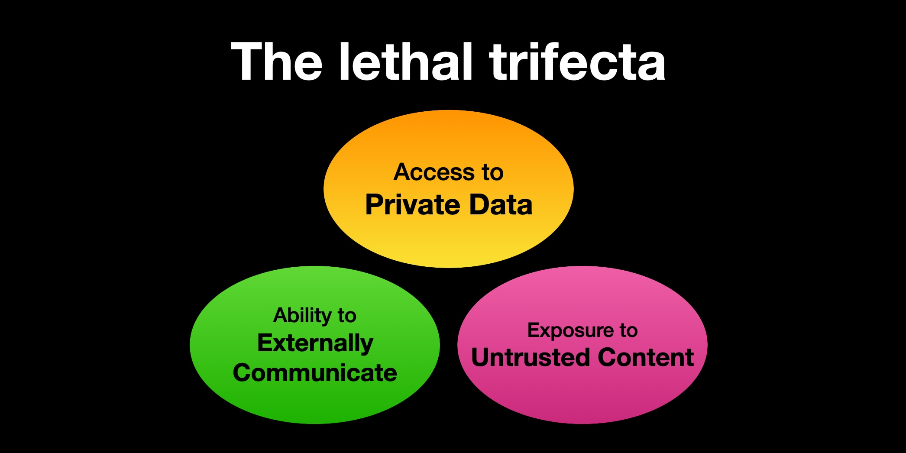{width="50%"}](#){data-modal-type="image" data-modal-url="figures/lethal-trifecta.png"}

Source: [Simon Willison](https://simonwillison.net/2025/Jun/16/the-lethal-trifecta/)
:::

**Three rules, before you click "authorise":**

- [Least access]{.alert}: one folder, one label, one repository, not the whole account
- [Read-only by default]{.alert}: turn writing on for the task, then off again
- [Confirm every write]{.alert}: sending, posting, paying and deleting each need a click
- The fourth rule: assume anything it fetches carries instructions aimed at your assistant
:::
:::
:::

# Do it yourself 🧭 {background-color="#1B3A6B"}

## Your setup, step by step
### Twenty minutes tonight, free plan

:::{style="margin-top: 10px; font-size: 20px;"}
:::{.columns}
:::{.column width=55%}
1. Create a [Project]{.alert} called "DATASCI 101" (Free allows five)
2. Write [ten lines]{.alert} of project instructions: role, audience, format, refusals, first question
3. Upload [two files]{.alert}: the syllabus and this week's slides
4. Open [Settings > Memory]{.alert} and read every line as a stranger would
5. Delete [one memory]{.alert} you would not want on a screen behind you
6. Add [one connector]{.alert}, read-only, pointing at a single folder
7. Test it with [three questions]{.alert} you already asked last week
8. Write down [one thing it got wrong]{.alert}, and which layer caused it

- Did the three answers change? If not, your instructions were too vague
  - Go back to step 2 and add a rule that costs you something
:::

:::{.column width=45%}
:::{style="text-align: center;"}
[{width="80%"}](#){data-modal-type="image" data-modal-url="figures/claude-projects.png"}

Source: [Anthropic Help Centre](https://support.claude.com/en/articles/9517075-what-are-projects)
:::

:::{.fragment}
> Do steps 4 and 5 even if you do nothing else today
:::
:::
:::
:::

## The same buttons in ChatGPT
### Different limits, same four layers

:::{style="margin-top: 10px; font-size: 18px;"}

:::{.columns}
:::{.column width=58%}
| Layer | ChatGPT on the free plan |
|-------|--------------------------|
| Instructions | Custom instructions, [1,500 characters]{.alert} (5,000 on Plus) |
| Knowledge | Projects, with upload limits |
| Memory | A [lightweight version]{.alert}, saved memories you read and delete |
| Skills | GPTs, but personal accounts cannot create them |
| Tools | Apps are available. [MCP connectors need Plus]{.alert} or above |

- Temporary chat is the incognito equivalent
- [1,500 characters]{.alert} is about 250 words, so the free plan forces you to be brief
- Free accounts can use a GPT someone else built, but cannot build one
- The tools layer is where the plans differ most: no custom MCP connector below Plus
- The limits change often, so check the help pages before you quote a number
- Whichever tool you pick, open its memory panel and read it

Source: [OpenAI Help Centre](https://help.openai.com/en/articles/8096356-chatgpt-custom-instructions), [memory FAQ](https://help.openai.com/en/articles/8590148-memory-faq)
:::

:::{.column width=42%}
:::{style="text-align: center;"}
[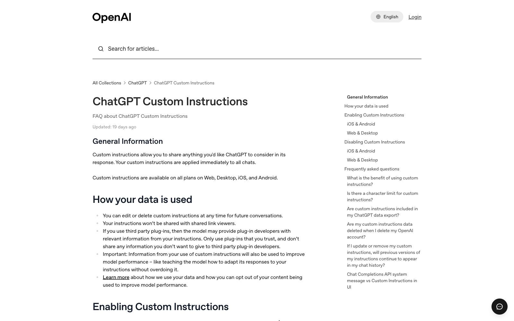{width="88%"}](#){data-modal-type="image" data-modal-url="figures/chatgpt-custom-instructions.png"}
:::

- Write the setup once, then copy it into whichever tool you end up using
- The four layers survive the move. Only the caps and the button names change
:::
:::
:::

# Summary 📚 {background-color="#1B3A6B"}

## Main takeaways

:::{style="margin-top: 30px; font-size: 25px;"}

- `r fa('layer-group')` Four layers make up context: [instructions]{.alert}, knowledge, memory, tools

- `r fa('pen')` A prompt is a request. A [setup]{.alert} is a standing instruction that survives the tab closing

- `r fa('brain')` Memory accumulates on its own. Read yours, edit it, use [incognito]{.alert} for sensitive topics

- `r fa('file-lines')` For agents, instructions become a file: [CLAUDE.md]{.alert}, AGENTS.md, SKILL.md

- `r fa('plug')` [MCP]{.alert} is one plug between any app and any model. Over 10,000 public servers since 2024

- `r fa('shield-halved')` Connect with [least access]{.alert}, read-only by default, and confirm every write

- `r fa('wand-magic-sparkles')` [Artifacts]{.alert} are free too. Write the spec first: inputs, outputs, what "correct" means

- `r fa('graduation-cap')` Everything today is free. Build your DATASCI 101 setup this week

:::

# ... and that's all for today! 🎉 {background-color="#1B3A6B"}
