```{r setup, include=FALSE}
options(htmltools.dir.version = FALSE)
library(knitr)
opts_chunk$set(
  prompt = T,
  fig.align="center",
  dpi=300,
  cache=T,
  engine.opts = list(bash = "-l")
  )

knit_hooks$set(
  prompt = function(before, options, envir) {
    options(
      prompt = if (options$engine %in% c('sh','bash', 'zsh')) '$ ' else 'R> ',
      continue = if (options$engine %in% c('sh','bash', 'zsh')) '$ ' else '+ '
      )
})

options(repos = c(CRAN = "https://cran.rstudio.com/"))

if (!require("fontawesome", character.only = TRUE)) {
  install.packages("fontawesome", dependencies = TRUE)
  library(fontawesome, character.only = TRUE)
}
```

# Welcome back! 😉 {background-color="#1B3A6B"}

## Recap of last class

:::{style="margin-top: 20px; font-size: 24px;"}
:::{.columns}
:::{.column width=50%}
- Last time we covered [types of bias in AI systems]{.alert}
- Bias can enter [at every stage]{.alert}: data collection, labelling, model design, deployment
- [Historical bias]{.alert}: past discrimination baked into training data
- [Representation bias]{.alert}: some groups underrepresented
- [Measurement bias]{.alert}: proxies that correlate with protected attributes
- Fairness has [multiple definitions]{.alert} that can conflict
- Today: [how AI is used in healthcare and finance, and where bias shows up]{.alert}
:::

:::{.column width=50%}
:::{style="text-align: center; margin-top: -30px;"}
[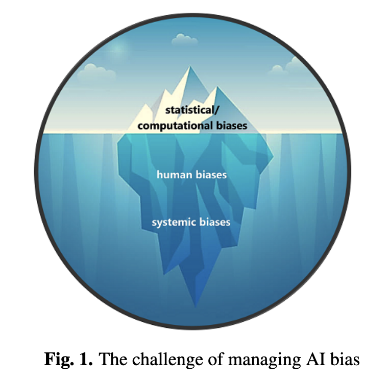{width="80%"}](#){data-modal-type="image" data-modal-url="figures/bias-cycle.png"}

Source: [NIST](https://www.nist.gov/publications/towards-standard-identifying-and-managing-bias-artificial-intelligence)
:::
:::
:::
:::

## Lecture overview
### What we will cover today

:::{style="margin-top: 20px; font-size: 28px;"}

:::{.columns}
:::{.column width=50%}
**Part 1: AI in healthcare**

- Traditional ML vs LLMs in medicine
- Real deployments and RAG in clinical settings

**Part 2: AI in finance**

- ML for trading, credit scoring, and fraud
- LLMs, RAG, and agentic workflows
:::

:::{.column width=50%}
**Part 3: When bias creeps in**

- The Optum algorithm and credit scoring
- RAG-specific risks in both fields
- Patterns that repeat across domains

**Part 4: What can we learn?**

- Questions to ask about any AI system
- Group discussion
:::
:::
:::

## Meme of the day

:::{style="text-align: center; margin-top: 30px; font-size: 20px;"}
[{width="65%"}](#){data-modal-type="image" data-modal-url="figures/meme-of-the-day.jpg"}

Source: [Medium](https://medium.com/@codingandcoffee/ai-luddites-and-the-future-of-finance-b06621999f7e)
:::

# Group project 📋 {background-color="#1B3A6B"}

## Group project

:::{style="margin-top: 30px; font-size: 20px;"}
:::{.columns}
:::{.column width=55%}
You will work in groups of [4-5 students]{.alert} to explore how AI tools perform in a real-world domain

Choose one of seven domains:

- [Healthcare]{.alert} (diagnosis, treatment, patient care)
- [Education]{.alert} (tutoring, assessment, feedback)
- [Finance]{.alert} (investing, fraud, credit)
- [Law]{.alert} (legal research, contracts, compliance)
- [Creative industries]{.alert} (writing, art, music)
- [Scientific research]{.alert} (literature review, hypothesis generation)
- [Customer service]{.alert} (support bots, complaint handling)

[No programming required]{.alert}: the focus is on evaluation and design

[More information here]{.alert}: <https://github.com/danilofreire/datasci101/blob/main/project/project-instructions.pdf>
:::

:::{.column width=45%}
:::{style="background: rgba(45, 69, 99, 0.1); padding: 15px; border-radius: 10px; font-size: 18px; margin-top: 30px;"}
**What you actually do**

You [test existing AI tools]{.alert} in your chosen domain (try them, break them, probe their limits!) and then [design a new application]{.alert} that addresses a gap or problem you find

The goal is to think critically: what works, what fails, and what would you build differently?
:::
:::
:::
:::

## Deliverables and timeline

:::{style="margin-top: 20px; font-size: 25px;"}
:::{.columns}
:::{.column width=55%}
**Three deliverables:**

1. [Optional proposal]{.alert} (April 1): one page, not graded. Lets you get early feedback on your domain and plan

2. [Final report]{.alert} (April 27): roughly 5 pages. Covers your domain overview, tool evaluation, and proposed application

3. [Infographic]{.alert} (April 27): one-page PDF summarising your findings for a general audience

You may also include a [bonus appendix]{.alert} with technical details, prompts, code, or extended analysis ([not required but recommended]{.alert})
:::

:::{.column width=45%}
**Key dates:**

- [March 23]{.alert}: group list due. If you don't have a group, you'll be assigned to one randomly by March 25
- [April 1]{.alert}: optional proposal due
- [April 27]{.alert}: report and infographic due

:::{style="background: rgba(230, 57, 70, 0.1); padding: 15px; border-radius: 10px; font-size: 18px; margin-top: 15px;"}
**Form your group soon!** 🤓

Groups should be confirmed by [March 23]{.alert}. Talk to your classmates this week. If you need help finding a group, contact us! 😉
:::
:::
:::
:::

# AI in healthcare 🏥 {background-color="#1B3A6B"}

## Traditional ML in healthcare

:::{style="margin-top: 30px; font-size: 22px;"}
:::{.columns}
:::{.column width=55%}
ML has been used in medicine for years, mostly for tasks with [labelled data and a clear outcome]{.alert} (supervised learning):

- [Medical imaging]{.alert}: CNNs detect tumours in X-rays, mammograms, retinal scans. Some match or beat radiologists
- [Risk scoring]{.alert}: ML models predict readmission, sepsis, mortality. Hospitals use these to allocate resources
- [Drug discovery]{.alert}: ML screens millions of molecules against protein targets, saving years in early development
- [Electrocardiogram analysis]{.alert}: Deep learning flags arrhythmias from wearables in real time

Give the model [structured input]{.alert}, get a classification or a number out
:::

:::{.column width=45%}
:::{style="text-align: center;"}
[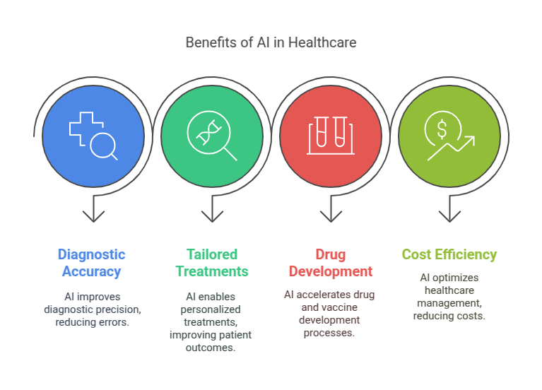{width="100%"}](#){data-modal-type="image" data-modal-url="figures/healthcare-ml.png"}

:::{style="background: rgba(45, 69, 99, 0.1); padding: 15px; border-radius: 10px; font-size: 18px; margin-top: 15px;"}
If you can put the input in a spreadsheet and the output is a number or a category, traditional ML is probably the right tool
:::
:::
:::
:::
:::

## What LLMs add to healthcare

:::{style="margin-top: 30px; font-size: 21px;"}
:::{.columns}
:::{.column width=55%}
LLMs handle tasks that involve [reading, writing, and reasoning about text]{.alert}:

- [Clinical note summarisation]{.alert}: Pull out key medications, diagnoses, and follow-up instructions in seconds
- [Patient-facing chatbots]{.alert}: Explain diagnoses in plain language, answer follow-up questions, triage symptoms
- [Literature synthesis]{.alert}: Summarise findings across dozens of papers on a condition
- [Clinical trial matching]{.alert}: Match unstructured patient records against trial eligibility criteria (previously done by hand)
- [My suggestion]{.alert}: [DeepMind's MedGemma](https://deepmind.google/models/gemma/medgemma/), a free and open-source LLM for medical tasks. Optimised for medical text and image comprehension

The key difference from traditional ML: these tasks need [language comprehension]{.alert}, not number-crunching
:::

:::{.column width=45%}
:::{style="text-align: center;"}
<!-- Suggested image: LLM clinical notes or chatbot illustration -->
[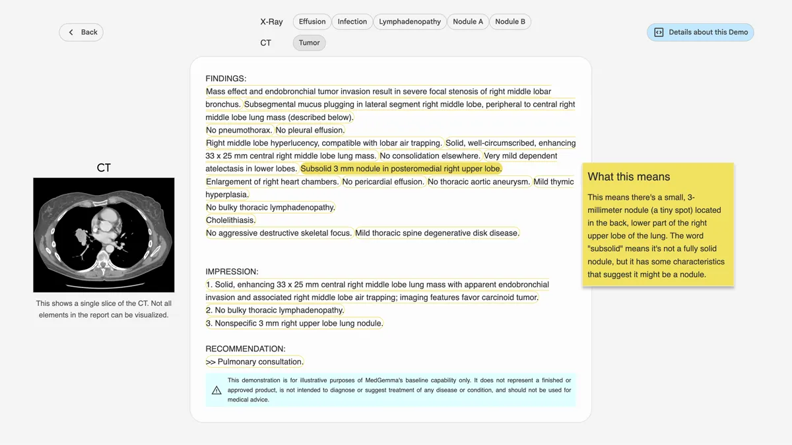{width="100%"}](#){data-modal-type="image" data-modal-url="figures/llm-healthcare.webp"}
[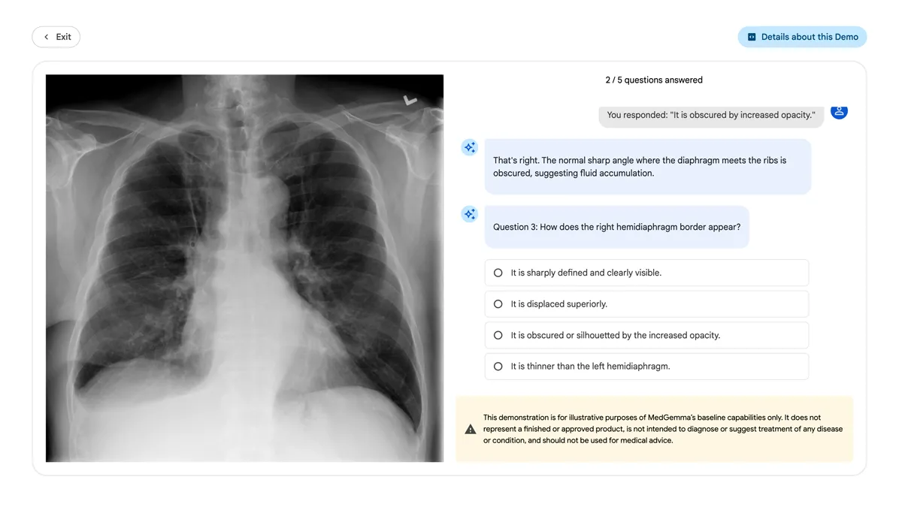{width="100%"}](#){data-modal-type="image" data-modal-url="figures/llm-healthcare-02.webp"}

Source: [Google Health AI](https://health.google/health-research/medical-ai/)
:::
:::
:::
:::

## LLMs reading clinical notes

:::{style="margin-top: 30px; font-size: 22px;"}
:::{.columns}
:::{.column width=55%}
Over 150 US health systems use [AI-drafted messages]{.alert} via [Epic's MyChart (GPT-4)](https://www.epic.com/software/ai/):

- Patient sends a question about medication side effects
- System reads the patient's record and drafts a response
- Clinician reviews and sends. Saves ~[30 seconds per message]{.alert}

Google's [Med-PaLM 2]{.alert} scored 86.5% on US Medical Licensing Exam questions. Physicians [preferred its open-ended answers]{.alert} over those from other doctors

But [passing exams ≠ treating patients.]{.alert} The model cannot examine the patient, read body language, or pick up on context outside the charts
:::

:::{.column width=45%}
:::{style="text-align: center;"}
[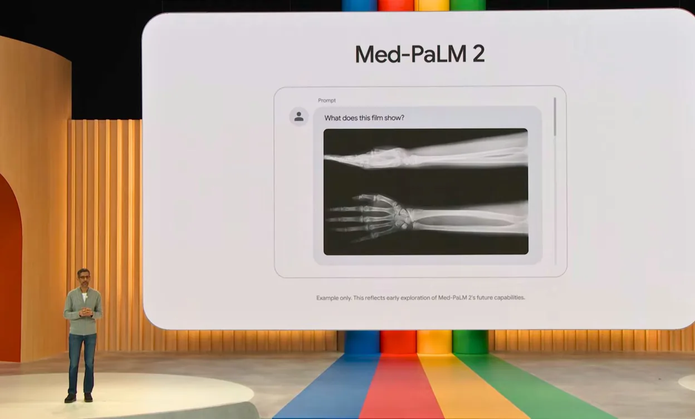{width="100%"}](#){data-modal-type="image" data-modal-url="figures/medpalm.webp"}

Source: [Google Research](https://sites.research.google/gr/med-palm/)
:::
:::
:::
:::

## LLMs for patient communication

:::{style="margin-top: 30px; font-size: 22px;"}
:::{.columns}
:::{.column width=55%}
LLMs are already used to [talk to patients]{.alert}:

- [Multilingual support]{.alert}: Translate discharge instructions into a patient's language without a dedicated translator
- [After-visit summaries]{.alert}: Plain-language version of what happened and what to do next
- [Symptom triage]{.alert}: Chatbots recommend whether to see a doctor, go to A&E, or stay home

**John Muir Health**: clinicians using AI-assisted charting saved [34 min/day]{.alert} on documentation. Physician turnover dropped 44%. [More here](https://www.epicshare.org/share-and-learn/john-muir-upmc-ai-charting)

Liability remains unresolved. If an AI chatbot gives bad advice and a patient is harmed, who is responsible?
:::

:::{.column width=45%}
:::{style="text-align: center; margin-top: 30px;"}
[{width="100%"}](#){data-modal-type="image" data-modal-url="figures/patient-chatbot.webp"}

Source: [NewsMedical.net](https://www.news-medical.net/health/The-Pros-and-Cons-of-Healthcare-Chatbots.aspx)
:::
:::
:::
:::

## Discussion: would you trust an AI doctor?

:::{style="margin-top: 30px; font-size: 18px;"}
:::{.columns}
:::{.column width=50%}
**Think about this:**

> You visit your GP. Instead of a doctor, an AI chatbot takes your symptoms, checks your medical history, and recommends a diagnosis and treatment plan. A doctor reviews the AI's recommendation for 30 seconds before signing off.

1. Would you be comfortable with this?
2. Does it matter if the AI is [more accurate]{.alert} on average than the doctor alone?
3. What if you could see the AI's reasoning?

**Things to consider:**

- Accuracy on average ≠ accuracy for [your specific case]{.alert}
- Trust depends on transparency and the ability to question
- Some patients may prefer a human for emotional and cultural reasons
:::

:::{.column width=50%}
:::{style="text-align: center;"}
[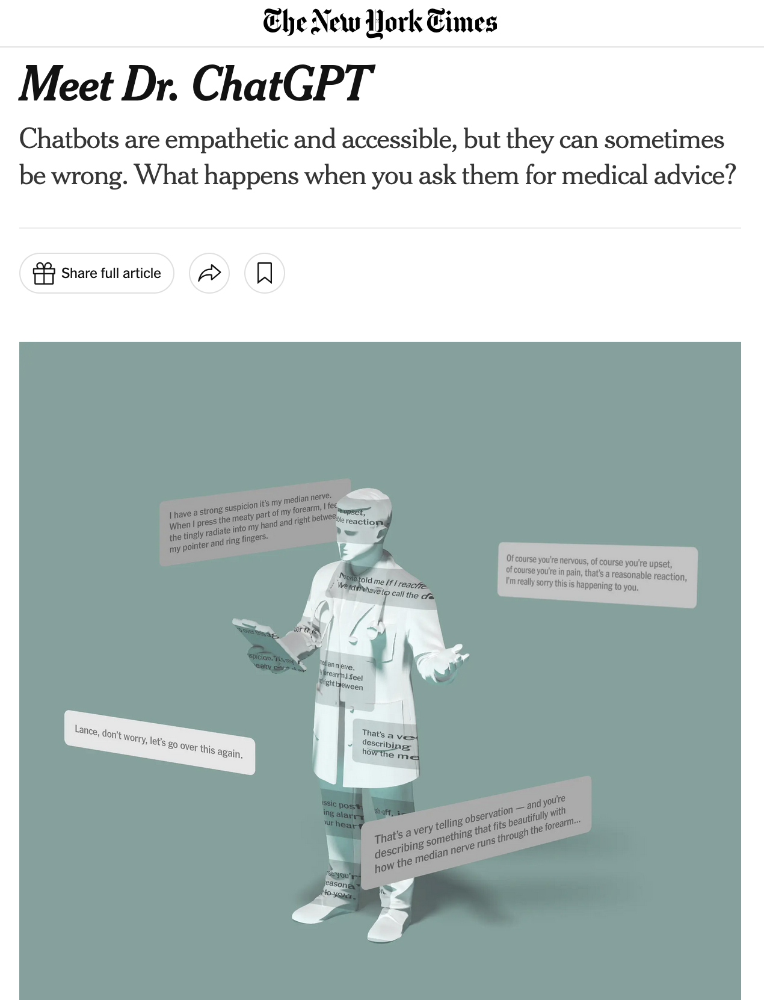{width="70%"}](#){data-modal-type="image" data-modal-url="figures/ai-doctor.png"}

Source: [The New York Times](https://www.nytimes.com/2025/11/16/briefing/meet-dr-chatgpt.html)
:::
:::
:::
:::

# AI in finance 📈 {background-color="#1B3A6B"}

## Traditional ML in finance

:::{style="margin-top: 30px; font-size: 22px;"}
:::{.columns}
:::{.column width=55%}
Finance adopted ML early, and for good reason: there is a lot of structured data and the [payoffs are measurable]{.alert}.

- [Price forecasting]{.alert}: Neural networks on time-series data. Results are mixed; markets are noisy
- [Credit scoring]{.alert}: Logistic regression estimate default probability. Backbone of consumer lending
- [Fraud detection]{.alert}: Deep learning flags suspicious transactions in real time. Outperforms rule-based systems (McKinsey, 2023)
- [Algorithmic trading]{.alert}: RL agents learn strategies by trial and error in simulated markets

These tasks share a common trait: the inputs are numbers, the outputs are numbers, and you can tell quickly whether the model is working
:::

:::{.column width=45%}
:::{style="text-align: center; margin-top: 30px;"}
[{width="100%"}](#){data-modal-type="image" data-modal-url="figures/simons.jpg"}

:::{style="font-size: 18px; margin-top: 15px;"}
Jim Simons started using ML for trading in 1988. The data was there; the question was always whether the models were good enough
:::
:::
:::
:::
:::

## What LLMs add to finance

:::{style="margin-top: 30px; font-size: 22px;"}
:::{.columns}
:::{.column width=55%}
LLMs handle tasks that require [reading and interpreting text]{.alert}. Much of the information that moves markets is in natural language:

- [Sentiment analysis]{.alert}: Classify financial news and earnings calls as positive, negative, or neutral
- [Document summarisation]{.alert}: Condense 10-K filings and earnings reports into short summaries
- [Numerical reasoning]{.alert}: Models like [FinQA]{.alert} read financial tables and do multi-step calculations
- [Advisory chatbots]{.alert}: Answer portfolio questions, explain products, guide users through tax season

See the [Chartered Financial Analyst Institute practical guide (2024)](https://rpc.cfainstitute.org/research/the-automation-ahead-content-series/practical-guide-for-llms-in-the-financial-industry) for more detail.
:::

:::{.column width=45%}
:::{style="text-align: center;"}
[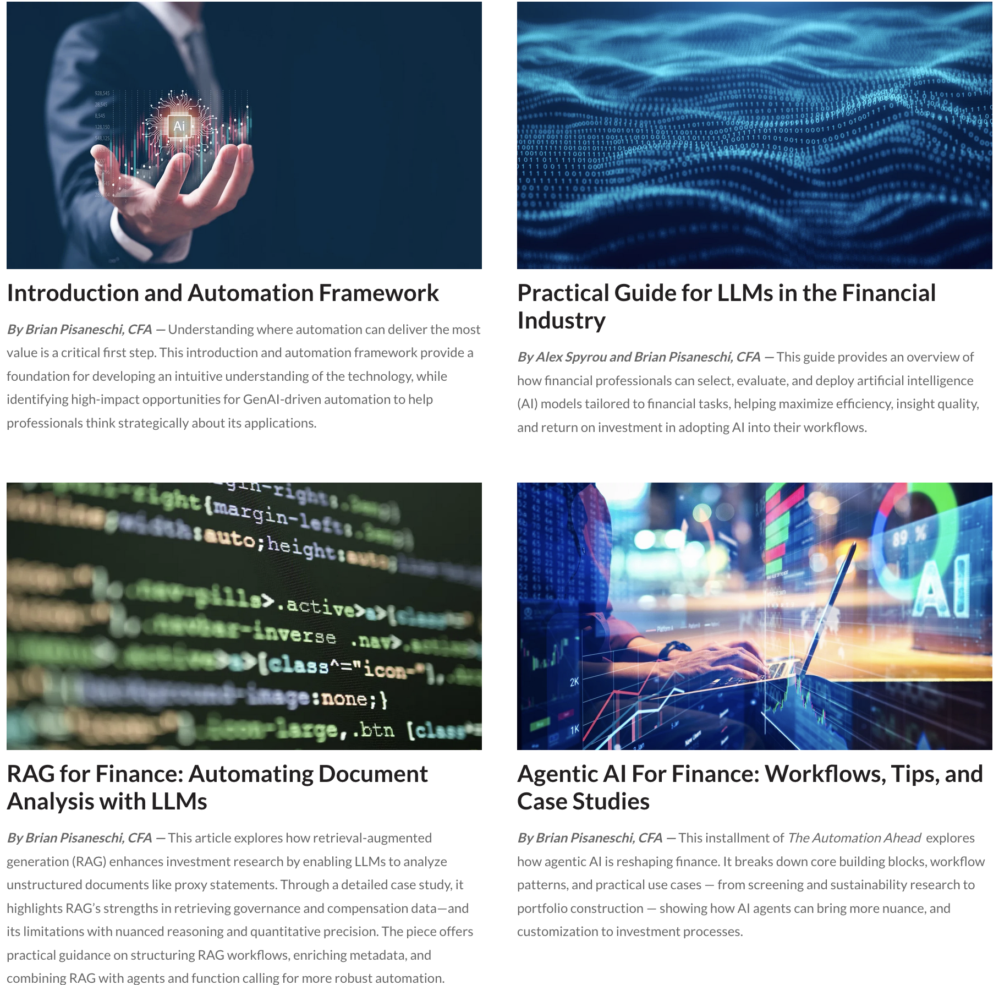{width="100%"}](#){data-modal-type="image" data-modal-url="figures/llm-finance.png"}

Source: [CFA Institute](https://rpc.cfainstitute.org/research/the-automation-ahead-content-series)
:::
:::
:::
:::

## LLMs vs traditional ML: when to use which

:::{style="margin-top: 30px; font-size: 20px;"}
:::{.columns}
:::{.column width=100%}
| Aspect | Traditional ML/DL | LLMs |
|--------|-------------------|------|
| [Best data type]{.alert} | Numerical, time-series, tabular | Unstructured text, documents |
| [Typical tasks]{.alert} | Classification, regression, anomaly detection | Summarisation, Q&A, sentiment, generation |
| [Training data]{.alert} | Needs [labelled examples]{.alert} for each task | Can work zero-shot or few-shot |
| [Multi-task]{.alert} | Separate model per task | [One model, different prompts]{.alert} |
| [Numerical precision]{.alert} | Strong | Weaker — struggles with exact calculations |
| [Cost]{.alert} | Lower inference cost | Higher — large models are expensive to run |

:::{style="margin-top: 20px;"}
**Rule of thumb** ([Li et al., 2023](https://arxiv.org/abs/2311.10723)): if your task is [well-defined]{.alert} (regression, classification) and you have plenty of labelled data, a traditional model is cheaper and just as good. LLMs pay off when the input is [unstructured text]{.alert} or when the task requires reasoning across multiple steps
:::
:::
:::
:::

## Finance-specific LLMs

:::{style="margin-top: 30px; font-size: 22px;"}
:::{.columns}
:::{.column width=55%}
Several LLMs have been fine-tuned for finance:

- **BloombergGPT**: 363B tokens of financial data + 345B general. Beats general models on financial benchmarks
- **FinGPT**: Open-source, fine-tunes LLaMA via LoRA. Under $300 per run
- **FinMA (PIXIU)**: 136K finance-specific instructions. Beats general LLMs on sentiment

**Benchmarks** (CFA Institute; [Li et al., 2023](https://arxiv.org/abs/2311.10723)):

- Finance-tuned LLMs [beat general models]{.alert} on sentiment and classification
- GPT-4 still [wins on numerical reasoning]{.alert} (more maths in pre-training)
- [For stock prediction, no model is reliable]{.alert}. ARIMA/LSTM still more practical
:::

:::{.column width=45%}
:::{style="text-align: center;"}
[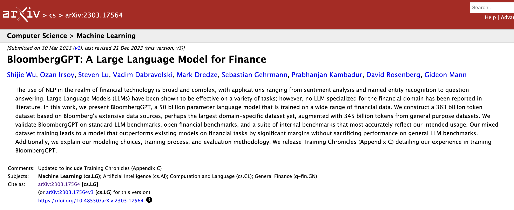{width="100%"}](#){data-modal-type="image" data-modal-url="figures/finance-llms.png"}

:::{style="background: rgba(45, 69, 99, 0.1); padding: 15px; border-radius: 10px; font-size: 18px; margin-top: 15px;"}
The trade-off: these models understand financial jargon better, but lose ground on general reasoning. [BloombergGPT paper](https://arxiv.org/abs/2303.17564)
:::
:::
:::
:::
:::

## Example: sentiment analysis for trading

:::{style="margin-top: 30px; font-size: 21px;"}
:::{.columns}
:::{.column width=55%}
The [Financial PhraseBank]{.alert} dataset has annotated financial news sentences:

:::{style="background: rgba(45, 69, 99, 0.1); padding: 15px; border-radius: 10px; font-size: 19px;"}
**Prompt**: "Analyse the sentiment of this financial news statement: negative, positive, or neutral."

**Text**: "We have analysed Kaupthing Bank Sweden and found a business which fits well into Alandsbanken."

**Answer**: Positive
:::

A [trading pipeline]{.alert}:

1. Collect headlines and earnings call transcripts
2. Score sentiment with a fine-tuned FinLLM
3. Aggregate into a market signal
4. Combine with quantitative data for a trading decision
:::

:::{.column width=45%}
:::{style="text-align: center; margin-top: 30px;"}
[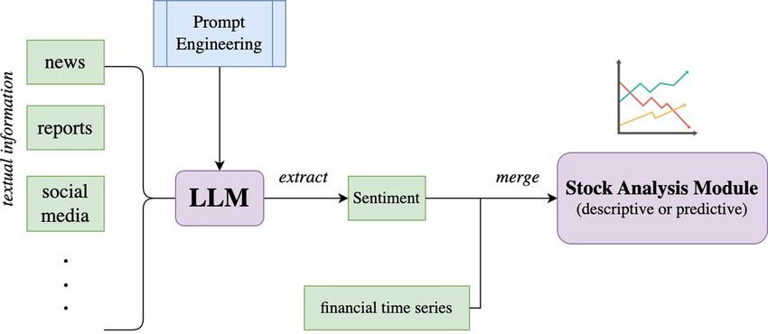{width="100%"}](#){data-modal-type="image" data-modal-url="figures/sentiment-pipeline.png"}

Source: [Chen et al (2025)](https://www.researchgate.net/figure/LLM-as-financial-sentiment-predictor_fig1_391601991)
:::
:::
:::
:::

## Agentic LLMs in finance

:::{style="margin-top: 30px; font-size: 22px;"}
:::{.columns}
:::{.column width=55%}
LLMs can [orchestrate multi-step workflows]{.alert} ([Li et al., 2023](https://arxiv.org/abs/2311.10723)):

> User asks an LLM agent to optimise a portfolio of equity and bond ETFs.

**The LLM breaks this into steps**:

1. Look up relevant ETFs in a database
2. Pull historical prices via API
3. Write Python code for Sharpe ratio optimisation
4. Run the code and interpret results
5. Present a recommendation

The LLM is the glue: it decides what to do next, calls the right tool, and passes results along. JPMorgan (and many others) already uses AI agents for investment advice
:::

:::{.column width=45%}
:::{style="text-align: center;"}
[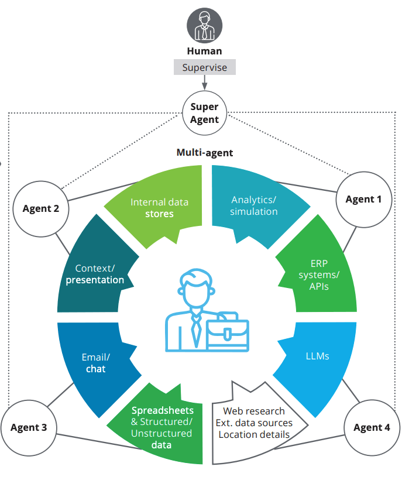{width="70%"}](#){data-modal-type="image" data-modal-url="figures/tool-augmented-llm.png"}

:::{style="background: rgba(230, 57, 70, 0.1); padding: 15px; border-radius: 10px; font-size: 18px; margin-top: 15px;"}
The LLM does not "know" finance the way a quant does. It [orchestrates tools]{.alert} that do the computation
:::
:::
:::
:::
:::

## RAG in healthcare and finance

:::{style="margin-top: 30px; font-size: 20px;"}
:::{.columns}
:::{.column width=55%}
**In healthcare:**

- Clinicians query drug interaction databases and clinical guidelines through natural language
- Systems retrieve relevant papers and generate evidence-backed answers
- Medical knowledge bases can be updated without retraining the model

**In finance:**

- Compliance officers ask questions about new regulations. The system retrieves the [actual rule text]{.alert} and generates grounded answers
- Analysts query internal research repositories
- Knowledge bases stay current as regulations change

RAG is popular in both fields for one reason: it lets the model cite actual documents instead of making things up.
:::

:::{.column width=45%}
:::{style="text-align: center;"}
[{width="100%"}](#){data-modal-type="image" data-modal-url="figures/rag.avif"}

Source: [StackAI](https://www.stack-ai.com/blog/rag-use-cases)

:::{style="font-size: 18px; margin-top: 15px;"}
RAG grounds LLM answers in [actual documents]{.alert}. The model cites sources, not memory
:::
:::
:::
:::
:::

## RAG risks in healthcare and finance

:::{style="margin-top: 30px; font-size: 22px;"}
:::{.columns}
:::{.column width=55%}
RAG reduces hallucination but does not eliminate risk. Both domains face [domain-specific problems]{.alert}:

**Retrieval quality:**

- If the knowledge base is incomplete or outdated, the retrieved documents will be wrong. In medicine, outdated guidelines can be dangerous
- In finance, retrieving superseded regulations may lead to compliance failures

**Bias in the knowledge base:**

- Medical literature underrepresents certain populations. RAG retrieves what exists, so gaps in research translate into gaps in answers
- Financial knowledge bases skew toward English-language and Western-market sources
:::

:::{.column width=45%}
**False confidence:**

- RAG answers look authoritative because they cite documents. Users may [trust them more than they should]{.alert}
- A clinician might skip verification if the answer comes with citations. A compliance officer might not read the full regulation

:::{style="background: rgba(230, 57, 70, 0.1); padding: 15px; border-radius: 10px; font-size: 18px; margin-top: 10px;"}
RAG is better than pure LLM generation, but "grounded" does not mean "correct." If the knowledge base has gaps, the answers will too
:::
:::
:::
:::

## Discussion: will AI replace financial analysts?

:::{style="margin-top: 30px; font-size: 21px;"}
:::{.columns}
:::{.column width=50%}
**Quick poll:**

> Show of hands: will AI replace more than half of entry-level financial analyst jobs within 10 years?

**Discuss (2 minutes):**

1. Which analyst tasks are [most automatable]{.alert}?
2. Which are [hardest to automate]{.alert}?
3. How would this change your career preparation?

:::{.fragment}
**Consider:**

- Summarising reports: very automatable
- Client relationships: not automatable
- Novel situations: partly automatable
- Responsibility for wrong calls: [someone has to]{.alert}
:::
:::

:::{.column width=50%}
:::{style="text-align: center;"}
[{width="90%"}](#){data-modal-type="image" data-modal-url="figures/robot-finance.webp"}
:::
:::
:::
:::

# When bias creeps in 🤔 {background-color="#1B3A6B"}

## Healthcare bias: the Optum case

:::{style="margin-top: 30px; font-size: 22px;"}
:::{.columns}
:::{.column width=55%}
[Obermeyer et al. (2019)](https://www.science.org/doi/10.1126/science.aax2342), published in *Science*, exposed a widely-used Optum algorithm

**What it did**: Identified patients needing extra care. Getting flagged = getting help

**The problem**: Used [healthcare costs]{.alert} as a proxy for needs. But Black patients spend less even when equally sick (access barriers, insurance gaps, income inequality)

**Result**: At the same risk score, Black patients had [26.3% more chronic conditions]{.alert}. Unbiased referral would have raised the Black patient share from 17.7% to 46.5%

Race was not an input. But costs [carried racial information]{.alert} because healthcare access itself was unequal
:::

:::{.column width=45%}
:::{style="text-align: center;"}
[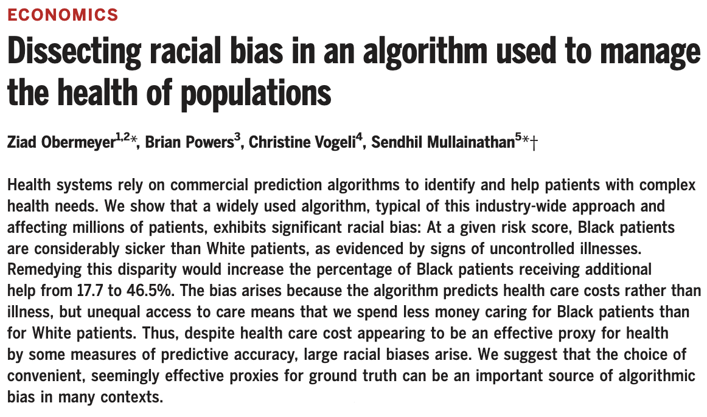{width="100%"}](#){data-modal-type="image" data-modal-url="figures/obermeyer.png"}

Source: [Obermeyer et al. (2019)](https://www.science.org/doi/10.1126/science.aax2342)
:::
:::
:::
:::

## Healthcare bias: the fix

:::{style="margin-top: 30px; font-size: 20px;"}
:::{.columns}
:::{.column width=55%}
**What happened next:**

- Researchers contacted Optum before publication
- Switched from predicting [costs]{.alert} to predicting [health outcomes]{.alert}
- Racial bias reduced by ~84%

**Lessons:**

- The fix was simple. The hard part was [recognising the problem]{.alert}
- Nobody had checked if the proxy worked equally for all groups
- Cost seemed reasonable, until someone disaggregated by race

:::{style="background: rgba(45, 69, 99, 0.1); padding: 15px; border-radius: 10px; margin-top: 15px; font-size: 18px;"}
What you optimise for matters. Costs ≠ needs when access to care is unequal
:::
:::

:::{.column width=45%}
:::{style="text-align: center;"}
[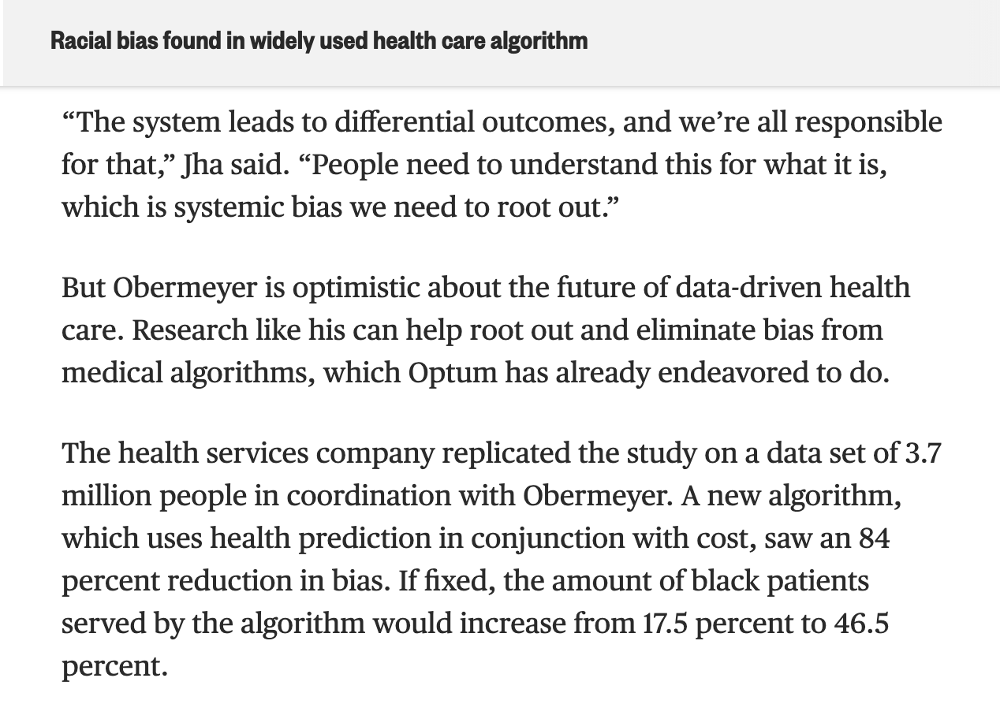{width="100%"}](#){data-modal-type="image" data-modal-url="figures/algorithm-fix.png"}

Source: [NBC News](https://www.nbcnews.com/news/nbcblk/racial-bias-found-widely-used-health-care-algorithm-n1076436)
:::
:::
:::
:::

## Financial bias: credit scoring

:::{style="margin-top: 30px; font-size: 22px;"}
:::{.columns}
:::{.column width=55%}
Credit scoring decides who gets loans and at what rate. [High-stakes ML]{.alert}

**Proxy problems:**

- Postcode correlates with race → [indirect racial encoding]{.alert}
- Purchase patterns correlate with gender
- Career breaks penalise women disproportionately

**Apple Card (2019):** [David Heinemeier Hansson's credit limit was [20× his wife's]{.alert} despite shared finances](https://www.library.hbs.edu/working-knowledge/gender-bias-complaints-against-apple-card-signal-a-dark-side-to-fintech). NY regulators investigated Goldman Sachs. Found [no intentional discrimination]{.alert}, but the inability to explain the outcomes damaged trust
:::

:::{.column width=45%}
:::{style="text-align: center;"}
[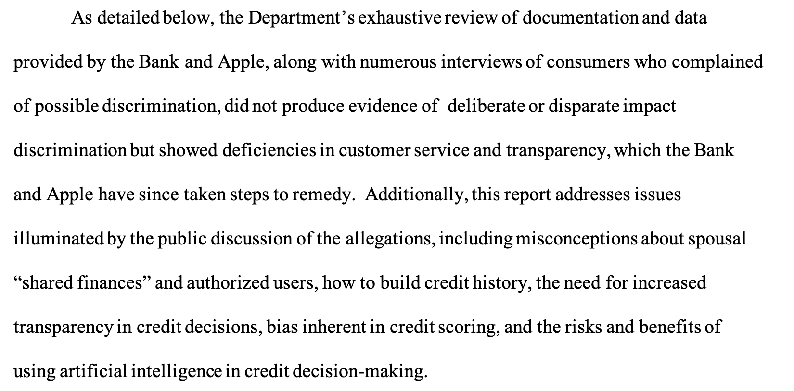{width="100%"}](#){data-modal-type="image" data-modal-url="figures/credit-scoring-bias.png"}

Source: [Department of Financial Services, New York State](https://www.dfs.ny.gov/system/files/documents/2021/03/rpt_202103_apple_card_investigation.pdf)

:::{style="background: rgba(230, 57, 70, 0.1); padding: 15px; border-radius: 10px; font-size: 18px; margin-top: 15px;"}
No illegality found, but the [inability to explain]{.alert} the algorithm undermined public trust
:::
:::
:::
:::
:::

## Financial bias: LLM sentiment and market access

:::{style="margin-top: 30px; font-size: 20px;"}
:::{.columns}
:::{.column width=55%}
LLMs in finance carry their own bias risks:

**Sentiment analysis:**

- Training data skews toward English-language media (Bloomberg, Reuters, FT)
- [Less accurate]{.alert} for emerging markets, smaller firms, non-English sources
- Biased sentiment → biased trading signals → biased capital flows

**Advisory chatbots:**

- Trained on advice for wealthy clients → may [not serve lower-income users]{.alert}
- Better in English than other languages

**Summarisation:**

- Stronger on large US corporations than international firms → [unequal service]{.alert}
:::

:::{.column width=45%}
:::{style="text-align: center;"}
[{width="100%"}](#){data-modal-type="image" data-modal-url="figures/emerging-markets.jpg"}

:::{style="font-size: 18px; margin-top: 15px;"}
Bias in financial LLMs is about [whose information is well-represented]{.alert} and whose is not
:::
:::
:::
:::
:::

## Common patterns across domains

:::{style="margin-top: 30px; font-size: 22px;"}
:::{.columns}
:::{.column width=55%}
The same patterns appear in both healthcare and finance, even without using race and gender as inputs:

1. **Proxy problems**
   - Costs → health needs; postcode → creditworthiness
2. **Historical data**
   - Healthcare access and lending were (and are) unequal
3. **Feedback loops**
   - Denied credit → fewer opportunities → lower scores
   - Less care → worse health → higher costs
4. **Invisible until examined**
   - Overall accuracy looked fine. [Disaggregated analysis]{.alert} revealed disparities
:::

:::{.column width=45%}
:::{style="text-align: center;"}
[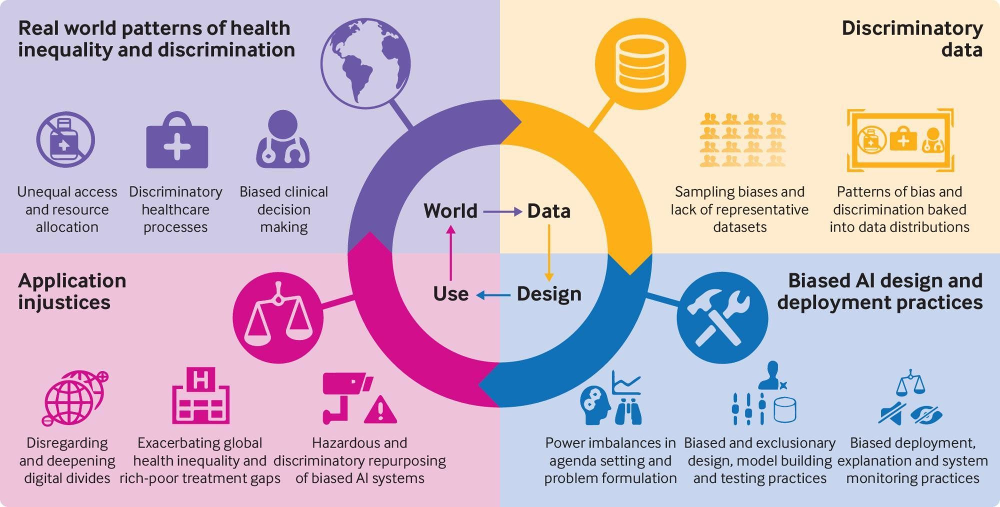{width="100%"}](#){data-modal-type="image" data-modal-url="figures/bias-patterns.jpg"}

Source: [UBIS Global](https://ubisglobal.com/blog/addressing-bias-in-ai-advancing-gender-race-and-age-equality/)
:::
:::
:::
:::

## Discussion

:::{style="margin-top: 30px; font-size: 22px;"}
:::{.columns}
:::{.column width=50%}
**Scenario:**

A health insurer uses an LLM to read clinical notes and [estimate costs for premium pricing]{.alert}:

- Reads discharge summaries and doctor notes
- Estimates future costs → sets premiums
- No human reviews individual estimates

**Questions:**

1. What [bias]{.alert} could enter?
2. What [proxy problems]{.alert} do you see?
3. How might this create a [feedback loop]{.alert}?
4. What [safeguards]{.alert} would you require?
:::

:::{.column width=50%}
:::{.fragment}
**Consider:**

- Clinical notes describe patients [differently by race or gender]{.alert}
- Cost estimates inherit Optum-style problems
- "Expensive" patients pay more → [reduced access]{.alert}
- Would you be comfortable if this system made decisions about [you or someone you care about]{.alert}?

:::
:::
:::
:::

## Main takeaways

:::{style="margin-top: 30px; font-size: 22px;"}
:::{.columns}
:::{.column width=55%}
`r fa('hospital')` **Healthcare AI**

- Traditional ML: imaging, risk scoring, drug discovery
- LLMs: note summarisation, patient communication, literature synthesis
- RAG: evidence-backed clinical Q&A

`r fa('chart-line')` **Finance AI**

- ML: trading, credit scoring, fraud detection
- LLMs: sentiment, summarisation, agentic workflows
- RAG: compliance and regulatory Q&A
:::

:::{.column width=45%}
`r fa('exclamation-triangle')` **Bias and RAG risks**

- Proxy variables carry hidden assumptions
- Historical data encodes inequality
- RAG reduces hallucination but inherits knowledge base biases
- [Disaggregated analysis]{.alert} is the only way to see the problem

:::{style="background: rgba(45, 69, 99, 0.1); padding: 15px; border-radius: 10px; margin-top: 15px; font-size: 18px;"}
The same algorithm can save lives or deny care, depending on what it optimises for. The Optum case showed that a single proxy choice (costs vs. health outcomes) changed everything.
:::
:::
:::
:::

# And that is all for today! {background-color="#1B3A6B"}
