```{r setup, include=FALSE}
options(htmltools.dir.version = FALSE)
library(knitr)
opts_chunk$set(
  prompt = T,
  fig.align="center",
  dpi=300,
  cache=T,
  engine.opts = list(bash = "-l")
  )

knit_hooks$set(
  prompt = function(before, options, envir) {
    options(
      prompt = if (options$engine %in% c('sh','bash', 'zsh')) '$ ' else 'R> ',
      continue = if (options$engine %in% c('sh','bash', 'zsh')) '$ ' else '+ '
      )
})

options(repos = c(CRAN = "https://cran.rstudio.com/"))

if (!require("fontawesome", character.only = TRUE)) {
  install.packages("fontawesome", dependencies = TRUE)
  library(fontawesome, character.only = TRUE)
}
```

# Welcome back! 🌍 {background-color="#2d4563"}

## Recap of last class

:::{style="margin-top: 20px; font-size: 21px;"}
:::{.columns}
:::{.column width=50%}
- We explored [AI in healthcare and finance]{.alert}, comparing traditional ML with LLMs in each field
- **Healthcare**: ML for imaging and risk scoring; LLMs for clinical notes, patient communication, and RAG-based Q&A
- **Finance**: ML for credit scoring, fraud, and trading; LLMs for sentiment analysis, finance-specific models (BloombergGPT, FinGPT), and [agentic workflows]{.alert}
- **Optum case**: healthcare costs as a proxy for needs penalised Black patients
- **Apple Card**: unexplainable credit limits
- RAG reduces hallucination but inherits [knowledge base biases]{.alert}
- We also spoke about the [group project]{.alert}: test AI tools in a real-world domain and design a new application
- Today: how are governments responding to these challenges?
:::

:::{.column width=50%}
:::{style="text-align: center; margin-top: 30px;"}
[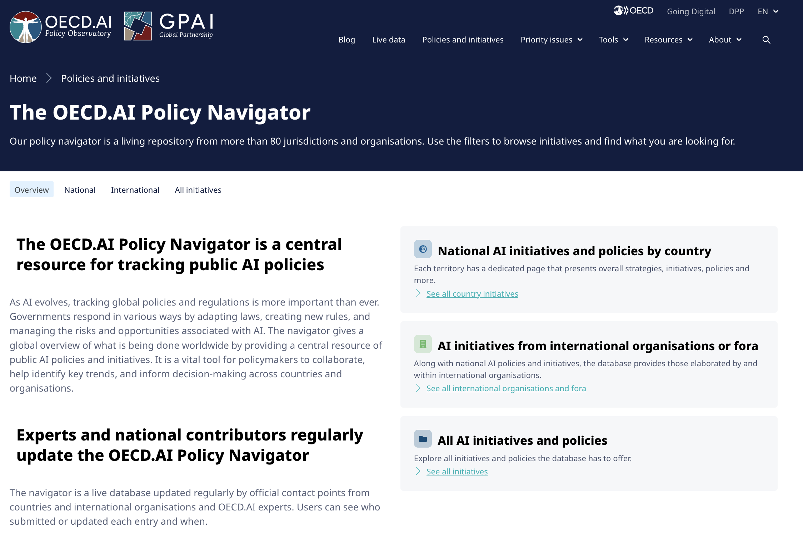{width="100%"}](#){data-modal-type="image" data-modal-url="figures/ai-regulation-map.png"}

Source: [OECD AI Policy Observatory](https://oecd.ai/en/dashboards/overview)
:::
:::
:::
:::

## Lecture overview
### What we will cover today

:::{style="margin-top: 20px; font-size: 24px;"}

:::{.columns}
:::{.column width=50%}
**Part 1: Why regulate AI?**

- The case for government intervention
- Different regulatory philosophies

**Part 2: The EU AI Act**

- Risk-based approach
- Prohibited, high-risk, and low-risk systems
- Compliance requirements
:::

:::{.column width=50%}
**Part 3: The US approach**

- Sectoral regulation vs comprehensive laws
- Executive orders and agency guidance
- State-level initiatives

**Part 4: Other approaches**

- China's AI regulations
- The global race for AI governance
- What this means for practitioners
:::
:::
:::

## Meme of the day 😄

:::{style="text-align: center; margin-top: 30px;"}
<!-- Suggested image: Regulation meme about AI -->
[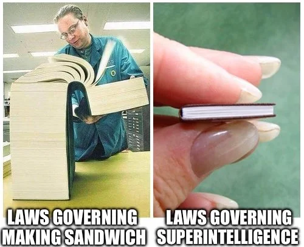{width="50%"}](#){data-modal-type="image" data-modal-url="figures/meme-of-the-day.webp"}

Source: [r/agi](https://www.reddit.com/r/agi/comments/1klizks/how_do_you_feel_about_ai_regulation_will_it/)
:::

# Why regulate AI? 🤔 {background-color="#2d4563"}

## The case for intervention

:::{style="margin-top: 30px; font-size: 20px;"}
:::{.columns}
:::{.column width=55%}
**Market failures:**

- [Information asymmetry]{.alert}: Users can't evaluate AI systems
  - How accurate is this hiring algorithm? Nobody knows
  - Is this chatbot hallucinating? Hard to tell
- [Externalities]{.alert}: Harms fall on people who didn't choose to use the system
  - For instance, deepfakes harm people who never consented
- [Collective action problems]{.alert}: Race to the bottom
  - Company A deploys unsafe AI
  - Company B must follow or lose market share

**Rights and dignity:**

- Some uses may violate [fundamental rights]{.alert}
- Facial recognition in public spaces
- Manipulation of democratic processes
:::

:::{.column width=45%}
:::{style="text-align: center;"}
[{width="100%"}](#){data-modal-type="image" data-modal-url="figures/market-failure.jpg"}

:::{style="background: rgba(45, 69, 99, 0.1); padding: 15px; border-radius: 10px; font-size: 18px; margin-top: 15px;"}
"Move fast and break things" maybe works for social media features. It's [less appealing when the things being broken]{.alert} are people's careers (or even lifes)!
:::
:::
:::
:::
:::

## The case against (heavy) intervention

:::{style="margin-top: 30px; font-size: 19px;"}
:::{.columns}
:::{.column width=55%}
**Innovation concerns:**

- Regulation can [slow development]{.alert}
- Compliance costs burden small companies
- May push innovation to less regulated jurisdictions

**Technical challenges:**

- Technology moves faster than law
- [General-purpose systems]{.alert} defy categorisation
- Enforcement requires technical expertise

**Existing laws may suffice:**

- Discrimination laws already apply
- Consumer protection already exists

:::{style="background: rgba(45, 69, 99, 0.1); padding: 15px; border-radius: 10px; margin-top: 15px; font-size: 18px;"}
Most people agree AI needs some rules. The real argument is [where to draw the line]{.alert} and who gets to draw it.
:::
:::

:::{.column width=45%}
:::{style="text-align: center;"}
[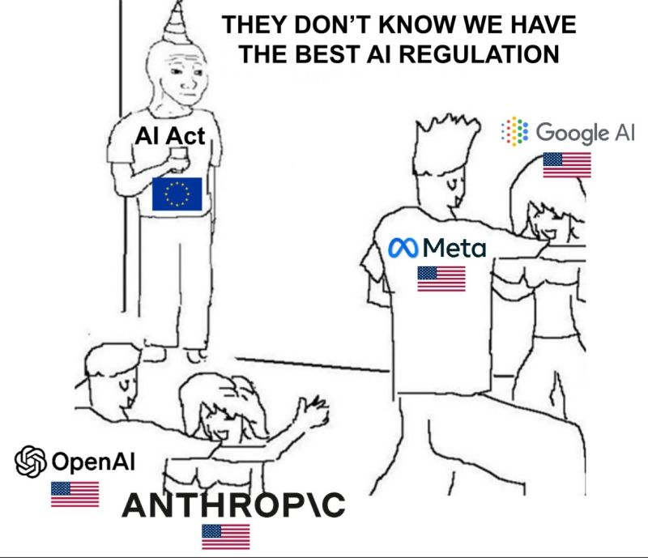{width="100%"}](#){data-modal-type="image" data-modal-url="figures/innovation-regulation.png"}

Source: [X.com](https://x.com/pascal_bornet/status/1892786338015171026)
:::
:::
:::
:::

## Regulatory philosophies

:::{style="margin-top: 30px; font-size: 25px;"}
:::{.columns}
:::{.column width=100%}
| Approach | Philosophy | Example |
|----------|------------|---------|
| **Precautionary** | Prove safety before deployment | EU AI Act's prohibited uses |
| **Innovation-first** | Regulate only after harms emerge | Early US approach to internet |
| **Risk-based** | Stricter rules for higher-risk uses | EU AI Act's tiered system |
| **Sectoral** | Different rules for different industries | US healthcare vs finance AI |
| **Self-regulation** | Industry develops own standards | Many current AI ethics guidelines |

:::{style="margin-top: 20px;"}
[No single approach dominates]{.alert}

- EU leans precautionary/risk-based
- US leans sectoral/innovation-first (but changing)
- China mixes state control with innovation goals
- Most countries are still figuring it out
:::
:::
:::
:::

# The EU AI Act 🇪🇺 {background-color="#2d4563"}

## The world's first comprehensive AI law

:::{style="margin-top: 30px; font-size: 18px;"}
:::{.columns}
:::{.column width=55%}
**Timeline:**

- April 2021: European Commission proposal
- December 2023: Political agreement
- March 2024: European Parliament approval
- August 2024: Entry into force
- 2025-2027: Phased implementation

**Scope:**

- Applies to AI systems [placed on the EU market]{.alert}
- Covers providers, deployers, importers, distributors
- [Extraterritorial reach]{.alert}: If you sell to the EU, you must comply
- Since the EU market is huge, [most companies will comply globally to avoid fragmentation]{.alert}

**Approach:**

- [Risk-based]{.alert}: Rules depend on potential harm
- Horizontal: Applies across all sectors
- Technology-neutral: Doesn't define specific techniques
:::

:::{.column width=45%}
:::{style="text-align: center;"}
[{width="100%"}](#){data-modal-type="image" data-modal-url="figures/eu-ai-act.png"}

Source: [European Commission](https://digital-strategy.ec.europa.eu/en/policies/regulatory-framework-ai)
:::
:::
:::
:::

## The risk pyramid

:::{style="margin-top: 30px; font-size: 18px;"}
:::{.columns}
:::{.column width=55%}
**Unacceptable risk (banned):**

- Social scoring by governments
- Real-time biometric identification in public (with exceptions)
- Emotion recognition in workplaces and schools
- Predictive policing based solely on profiling

**High risk (strict requirements):**

- Biometric identification systems
- Critical infrastructure management
- Employment and worker management
- Access to essential services (credit, insurance)
- Law enforcement and border control
- Justice and democratic processes
:::

:::{.column width=45%}
:::{style="text-align: center; margin-top: 10px;"}
[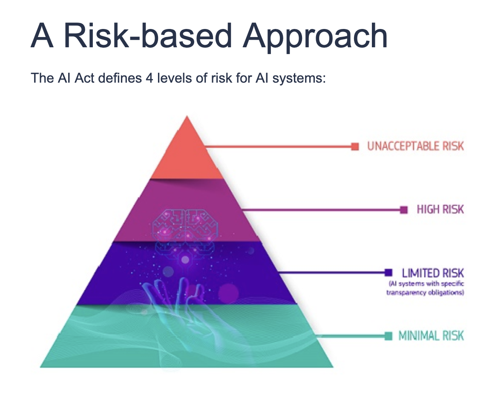{width="60%"}](#){data-modal-type="image" data-modal-url="figures/risk-pyramid.png"}
:::

**Limited risk (transparency only):**

- Chatbots (must disclose AI)
- Emotion recognition (must inform)
- Deep fakes (must label)

**Minimal risk (no requirements):**

- Spam filters
- Video game AI
- Most consumer applications
:::
:::
:::

## High-risk system requirements

:::{style="margin-top: 30px; font-size: 18px;"}
:::{.columns}
:::{.column width=55%}
If your AI system is classified as high-risk, you must:

**Before deployment:**

- Conduct a [conformity assessment]{.alert}
- Establish a [risk management system]{.alert}
- Maintain [technical documentation]{.alert}
- Enable [logging and traceability]{.alert}

**During operation:**

- Ensure [human oversight]{.alert} capability
- Guarantee [accuracy, robustness, cybersecurity]{.alert}
- Register in [EU database]{.alert}
- Report serious incidents

**For deployers (users of high-risk AI):**

- Use according to instructions
- Ensure human oversight
- Monitor for issues
- Inform affected individuals
:::

:::{.column width=45%}
:::{style="background: rgba(45, 69, 99, 0.1); padding: 15px; border-radius: 10px; font-size: 18px; margin-top: 30px;"}
**Data governance requirements:**

- Training data must be [relevant, representative, free of errors]{.alert}
- Must examine for possible biases
- Must be able to [demonstrate compliance]{.alert}

**Transparency requirements:**

- Clear information about capabilities and limitations
- Instructions for use
- Contact information for oversight
:::
:::
:::
:::

## General-Purpose AI (GPAI) rules

:::{style="margin-top: 30px; font-size: 21px;"}
:::{.columns}
:::{.column width=55%}
The Act includes special rules for [foundation models]{.alert} like GPT-5, Claude, and Gemini

**All GPAI providers must:**

- Maintain technical documentation
- Provide information to downstream deployers
- Comply with copyright law (or demonstrate exceptions)
- Publish training content summaries

**"Systemic risk" GPAI (more powerful models) must also:**

- Conduct model evaluations including [adversarial testing]{.alert}
- Assess and mitigate systemic risks
- Track and report [serious incidents]{.alert}
- Ensure adequate [cybersecurity]{.alert}
:::

:::{.column width=45%}
:::{style="text-align: center;"}
[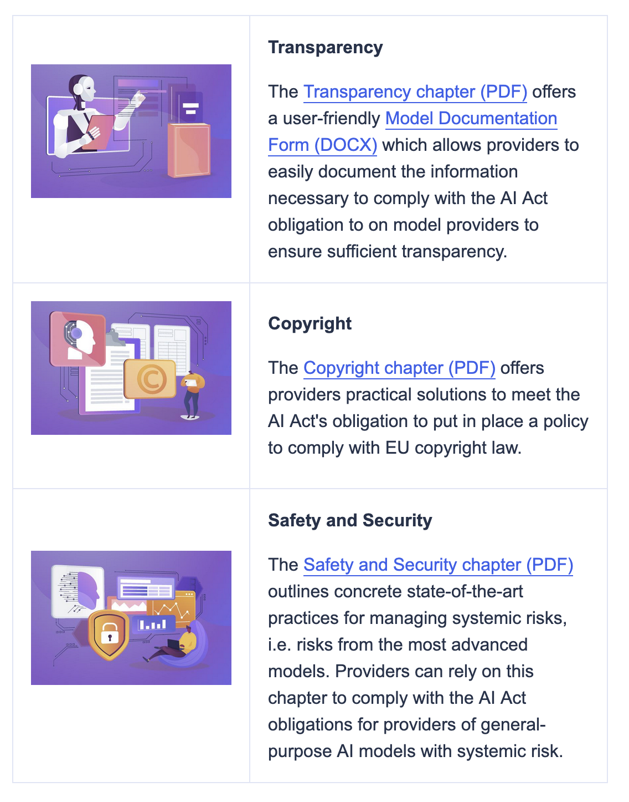{width="70%"}](#){data-modal-type="image" data-modal-url="figures/foundation-models.png"}

Source: [European Commission](https://digital-strategy.ec.europa.eu/en/policies/contents-code-gpai)
:::
:::
:::
:::

## Open-source models: a partial exemption

:::{style="margin-top: 30px; font-size: 20px;"}
:::{.columns}
:::{.column width=55%}
The Act gives a [partial exemption]{.alert} to open-source AI models:

- If you release model weights under a free licence, you are generally [exempt from most GPAI transparency requirements]{.alert}
- But if the model is classified as posing [systemic risk]{.alert} (trained with more than 10^25^ FLOPs), the stricter tier still applies
- [Why the exception?]{.alert} Open-source models allow [independent scrutiny]{.alert}, which partly substitutes for regulatory oversight
- Supports European open-source ecosystem and research

**Criticism:**

- Creates a potential [loophole]{.alert}: open models can still cause harm once deployed by third parties
- The deployer bears responsibility, but small deployers may lack resources to comply
:::

:::{.column width=45%}
:::{style="text-align: center; margin-top: 30px;"}
[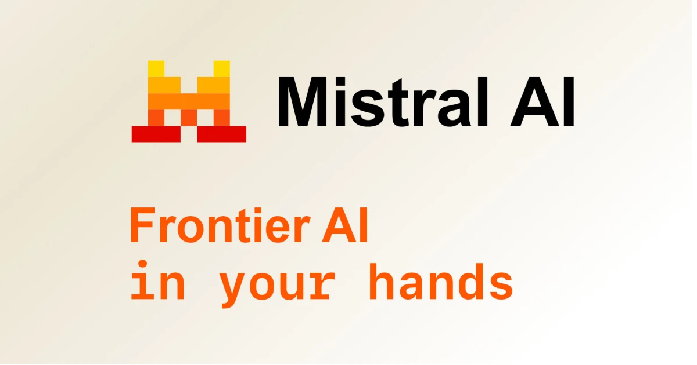{width="80%"}](#){data-modal-type="image" data-modal-url="figures/mistral.webp"}

:::{style="background: rgba(45, 69, 99, 0.1); padding: 15px; border-radius: 10px; font-size: 18px; margin-top: 15px;"}
**Example:** [Mistral](https://mistral.ai/) is a French open-source AI company. Its larger models (like Mistral Large) are trained above the systemic risk threshold, so they still face the stricter GPAI rules. Its smaller models, released under open licences, would be largely exempt.
:::
:::
:::
:::
:::

## Penalties and enforcement

:::{style="margin-top: 30px; font-size: 21px;"}
:::{.columns}
:::{.column width=55%}
**Maximum fines:**

| Violation | Max fine |
|-----------|----------|
| Prohibited AI practices | [€35M or 7% global turnover]{.alert} |
| High-risk non-compliance | €15M or 3% global turnover |
| Incorrect information | €7.5M or 1.5% global turnover |

**For comparison:**

- GDPR (General Data Protection Regulation) maximum: €20M or 4% turnover
- EU AI Act is [stricter]{.alert} for the worst violations

**Enforcement:**

- National [market surveillance authorities]{.alert}
- New [AI Office]{.alert} at EU level for GPAI
- Complaints mechanism for affected individuals
- Regulatory sandboxes for testing
:::

:::{.column width=45%}
:::{style="text-align: center;"}
[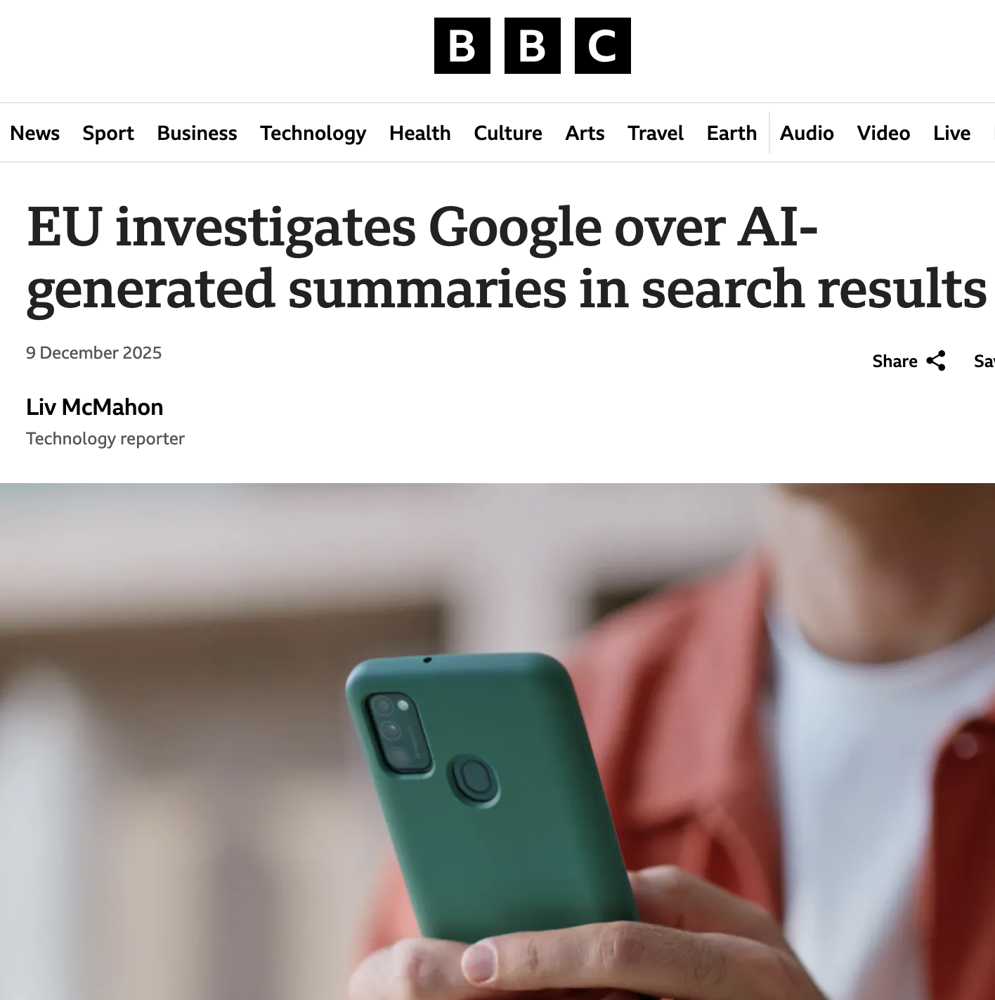{width="70%"}](#){data-modal-type="image" data-modal-url="figures/eu-ai-fines.png"}

Source: [BBC News](https://www.bbc.com/news/articles/crl95eg33k1o)

:::{style="font-size: 18px; margin-top: 15px;"}
For a company like Google (2024 revenue ~$350B), a 7% fine would be [~$24.5 billion]{.alert}. That gets attention.
:::
:::
:::
:::
:::

## Where would these fit? 🤔

:::{style="margin-top: 30px; font-size: 19px;"}
**Quick reference for the four risk levels:**

- [Prohibited]{.alert}: uses that threaten fundamental rights
- [High risk]{.alert}: affects safety or fundamental rights in specific domains
- [Limited risk]{.alert}: interacts with people directly, so users must be told they are dealing with AI
- [Minimal risk]{.alert}: low-stakes uses with no specific requirements

:::{.columns}
:::{.column width=50%}
:::{.fragment}
1. ChatGPT used for customer service
:::
:::{.fragment}
   - [Limited risk]{.alert} – must disclose it's AI
:::
:::{.fragment}
2. An AI system that scores job applicants
:::
:::{.fragment}
   - [High risk]{.alert} – employment decisions
:::
:::{.fragment}
3. Spotify's music recommendation algorithm
:::
:::{.fragment}
   - [Minimal risk]{.alert} – entertainment
:::
:::{.fragment}
4. Facial recognition at airport security
:::
:::{.fragment}
   - [High risk]{.alert} – biometric + border control
:::
:::

:::{.column width=50%}
:::{.fragment}
5. An AI that predicts which students will drop out
:::
:::{.fragment}
   - [High risk]{.alert} – educational access
:::
:::{.fragment}
6. Deepfake detection software
:::
:::{.fragment}
   - [Minimal risk]{.alert} – helps detect manipulation
:::
:::{.fragment}
7. China-style social credit scoring in the EU
:::
:::{.fragment}
   - [Prohibited]{.alert} – social scoring by government
:::
:::{.fragment}
:::{style="background: rgba(45, 69, 99, 0.1); padding: 15px; border-radius: 10px; margin-top: 15px; font-size: 18px;"}
The classification often depends on [context and use]{.alert}, not just the technology itself
:::
:::
:::
:::
:::

# The US approach 🇺🇸 {background-color="#2d4563"}

## No comprehensive federal AI law (yet)

:::{style="margin-top: 30px; font-size: 17px;"}
:::{.columns}
:::{.column width=55%}
The US has taken a [different path]{.alert} from the EU:

**Sectoral approach:**

- Healthcare AI: [Food and Drug Administration (FDA)](https://www.fda.gov/medical-devices/software-medical-device-samd/artificial-intelligence-software-medical-device) regulates medical devices
- Financial AI: [Securities and Exchange Commission (SEC)](https://www.sec.gov/ai) oversees lending/trading
- Employment AI: [Equal Employment Opportunity Commission (EEOC)](https://www.eeoc.gov/newsroom/eeoc-launches-initiative-artificial-intelligence-and-algorithmic-fairness) applies discrimination law
- [No single AI authority]{.alert}

**Recent developments:**

- **October 2023**: Biden's [Executive Order on AI](https://bidenwhitehouse.archives.gov/briefing-room/presidential-actions/2023/02/16/executive-order-on-further-advancing-racial-equity-and-support-for-underserved-communities-through-the-federal-government/)
- **July 2025**: Trump's [America's AI Action Plan](https://www.whitehouse.gov/wp-content/uploads/2025/07/Americas-AI-Action-Plan.pdf)
- State-level initiatives ([Colorado](https://leg.colorado.gov/bills/sb24-205), [California](https://leginfo.legislature.ca.gov/), [Illinois](https://www.ilga.gov/legislation/ilcs/ilcs3.asp?ActID=4015&ChapterID=68))

**Philosophy:**

- [Innovation-friendly]{.alert} compared to EU
- Voluntary commitments from companies
- Existing laws apply to AI uses
:::

:::{.column width=45%}
:::{style="text-align: center;"}
[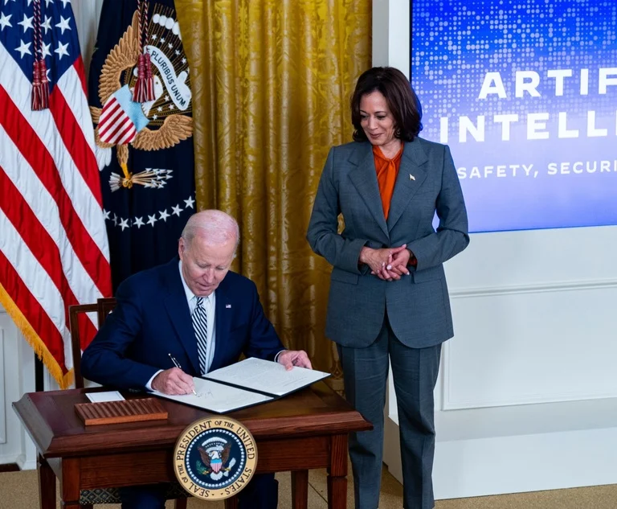{width="100%"}](#){data-modal-type="image" data-modal-url="figures/us-ai-regulation.webp"}

Source: [Law.com](https://www.law.com/legaltechnews/2023/11/01/white-houses-ai-executive-order-opens-the-door-wide-to-new-rules-enforcement-actions/?slreturn=20260214023811)
:::
:::
:::
:::

## Biden's Executive Order (2023)

:::{style="margin-top: 30px; font-size: 20px;"}
:::{.columns}
:::{.column width=55%}
**Requirements:**

- Developers of powerful AI must [share safety test results]{.alert} with government
- Standards for [red-teaming]{.alert} AI systems
- Guidelines for [watermarking]{.alert} AI-generated content
- Protections against AI-enabled fraud

**Focus on national security:**

- Reporting requirements for [large training runs]{.alert}
- Export controls on AI chips
- Protection of critical infrastructure

**Limitations:**

- Executive orders can be [reversed]{.alert} by next president (and they were!)
- Many provisions are [voluntary]{.alert} or guidance
- Congress hasn't passed comprehensive legislation
:::

:::{.column width=45%}
:::{style="text-align: center;"}
[{width="100%"}](#){data-modal-type="image" data-modal-url="figures/biden-ai-eo.webp"}

Source: [Congress.gov (2023)](https://www.congress.gov/crs-product/R47843)
:::
:::
:::
:::

## America's AI Action Plan (2025)

:::{style="margin-top: 30px; font-size: 21px;"}
:::{.columns}
:::{.column width=55%}
The Trump administration's approach differs from Biden's:

**Priorities:**

- [American AI dominance]{.alert} over global competitors
- Reduce regulatory barriers to development
- Focus on [national security applications]{.alert}
- Energy infrastructure for AI data centres
- Streamlined permitting for AI facilities
- [Suggested framework](https://www.whitehouse.gov/wp-content/uploads/2026/03/03.20.26-National-Policy-Framework-for-Artificial-Intelligence-Legislative-Recommendations.pdf) for Congress to consider (March 2026)

**Changes from Biden era:**

- Less emphasis on AI safety requirements
- More focus on [competition with China]{.alert}
- Voluntary industry commitments over mandates
- Concern about "overregulation" slowing innovation
:::

:::{.column width=45%}
**Implications:**

- US-EU [regulatory divergence]{.alert} may increase
- Companies face different rules in different markets
- "Race to the bottom" concerns
- Debate continues about appropriate balance

:::{style="text-align: center;"}
[{width="80%"}](#){data-modal-type="image" data-modal-url="figures/ai-competition.avif"}

Source: [Voice of America](https://www.voanews.com/a/trump-signals-aggressive-stance-as-us-races-china-in-ai-development/7947068.html)
:::
:::
:::
:::

## State-level action

:::{style="margin-top: 30px; font-size: 20px;"}
:::{.columns}
:::{.column width=55%}
With limited federal action, states are filling gaps:

**[Colorado AI Act (2024)](https://leg.colorado.gov/bills/sb24-205):**

- First comprehensive state AI law
- Requires [impact assessments]{.alert} for high-risk systems
- Disclosure requirements for consumers

**California (various bills):**

- Multiple bills on deepfakes, employment AI
- Often sets [national trends]{.alert}

**[Illinois](https://www.ilga.gov/legislation/ilcs/ilcs3.asp?ActID=4015&ChapterID=68):**

- AI Video Interview Act: Must disclose AI in hiring

**[New York City](https://www.nyc.gov/site/dca/about/automated-employment-decision-tools.page):**

- First US jurisdiction to require [bias audits for hiring AI](https://rules.cityofnewyork.us/rule/automated-employment-decision-tools-updated/)
:::

:::{.column width=45%}
:::{style="text-align: center;"}
[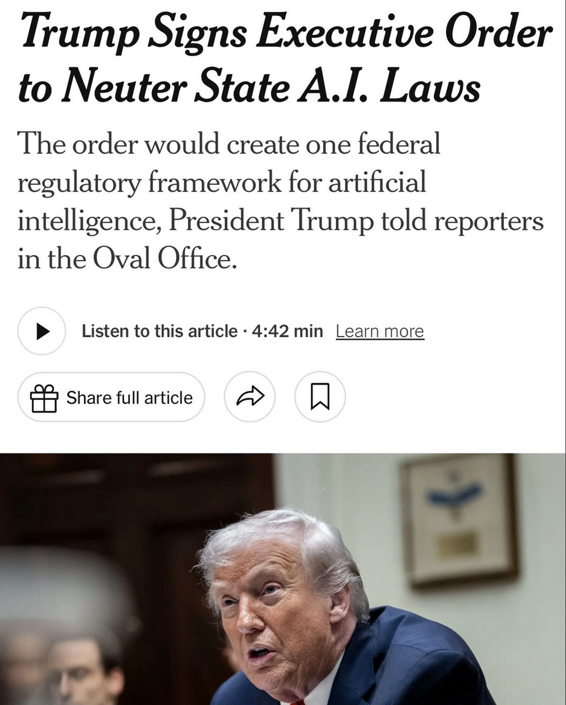{width="60%"}](#){data-modal-type="image" data-modal-url="figures/state-ai-laws.png"}

:::{style="background: rgba(45, 69, 99, 0.1); padding: 15px; border-radius: 10px; font-size: 18px; margin-top: 15px;"}
Companies operating nationally face a [patchwork]{.alert} of state requirements. Many prefer federal law just for consistency.
:::
:::
:::
:::
:::

# Global perspectives 🌏 {background-color="#2d4563"}

## China's AI governance

:::{style="margin-top: 30px; font-size: 17px;"}
:::{.columns}
:::{.column width=55%}
China has been [very active]{.alert} on AI regulation:

**Features:**

- [Content control]{.alert}: AI must uphold "socialist values"
- [Registration requirements]{.alert} for public-facing AI
- Three targeted regulations form the core "trio":
  - [Algorithm Recommendation Provisions (2022)](https://digichina.stanford.edu/work/translation-internet-information-service-algorithmic-recommendation-management-provisions-effective-march-1-2022/): transparency and control over recommendation systems
  - [Deep Synthesis Provisions (2023)](https://www.chinalawtranslate.com/en/deep-synthesis/): labelling requirements for synthetic content
  - [Generative AI Measures (2023)](https://www.chinalawtranslate.com/en/generative-ai-interim/): first binding rules for generative AI worldwide
- [Amended Cybersecurity Law (2026)](https://iclg.com/practice-areas/cybersecurity-laws-and-regulations/01-generative-ai-and-cyber-risk-in-china) brings AI into national law for the first time

**Contradictions:**

- Regulates facial recognition but [deploys it extensively]{.alert}
- Restricts AI manipulation but uses AI for surveillance
- Rules for companies, [exceptions for government]{.alert}
- Innovation priorities vs content control tensions
:::

:::{.column width=45%}
:::{style="text-align: center;"}
[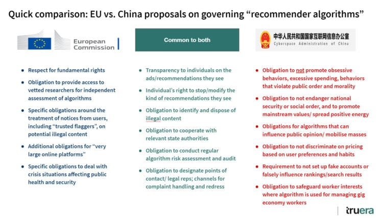{width="100%"}](#){data-modal-type="image" data-modal-url="figures/china-ai.jpg"}

Source: [Corporate Compliance Insights](https://www.corporatecomplianceinsights.com/regulating-artificial-intelligence-china-west/)

:::{style="background: rgba(45, 69, 99, 0.1); padding: 15px; border-radius: 10px; font-size: 18px; margin-top: 15px;"}
China's approach: regulate [commercial AI carefully]{.alert}, but [state use is largely unrestricted]{.alert}
:::
:::
:::
:::
:::

## Other approaches

:::{style="margin-top: 30px; font-size: 20px;"}
:::{.columns}
:::{.column width=55%}
**United Kingdom:**

- ["Pro-innovation" approach](https://www.gov.uk/government/publications/ai-regulation-a-pro-innovation-approach): sector regulators apply existing frameworks
- No comprehensive AI law (yet)
- [AI Safety Institute](https://www.aisi.gov.uk/) for frontier model evaluation

**Canada:**

- [AIDA (Artificial Intelligence and Data Act)](https://ised-isde.canada.ca/site/innovation-better-canada/en/artificial-intelligence-and-data-act) was proposed but [died in parliament](https://www.mcinnescooper.com/publications/the-demise-of-the-artificial-intelligence-and-data-act-aida-5-key-lessons/) in January 2025
- Now pursuing AI governance through privacy legislation instead

**Brazil:**

- [Comprehensive AI bill (PL 2338/2023)](https://artificialintelligenceact.com/brazil-ai-act/) approved by Senate, now in the Chamber of Deputies
- Influenced by EU approach; rights-based framework
:::

:::{.column width=45%}
**International coordination:**

| Initiative | Focus |
|------------|-------|
| [OECD AI Principles](https://oecd.ai/en/ai-principles) | Soft law, voluntary |
| [G7 Hiroshima Process](https://www.soumu.go.jp/hiroshimaaiprocess/en/index.html) | International norms |
| [UN AI Advisory Body](https://www.un.org/ai-advisory-body) | Global governance |
| [Council of Europe AI Convention](https://www.coe.int/en/web/artificial-intelligence/the-framework-convention-on-artificial-intelligence) | Human rights focus |
| [ISO/IEC 42001](https://www.iso.org/standard/42001) | Technical standards |

:::{style="background: rgba(45, 69, 99, 0.1); padding: 15px; border-radius: 10px; font-size: 18px; margin-top: 15px;"}
No global consensus on AI governance. The "Brussels Effect" (EU rules becoming global standards) may apply, as with GDPR.
:::
:::
:::
:::

## Comparing approaches

:::{style="margin-top: 30px; font-size: 22px;"}
:::{.columns}
:::{.column width=100%}
| Aspect | EU | US | China | UK |
|--------|----|----|-------|-------|
| **Framework** | Comprehensive law | Sectoral | Multiple regulations | Guidance + sectors |
| **Philosophy** | Risk-based, precautionary | Innovation-first | State control + innovation | Pro-innovation |
| **Enforcement** | Dedicated AI Office | Existing agencies | Cyberspace Admin | Sector regulators |
| **Prohibited uses** | Social scoring, some biometrics | Few explicit bans | Political content | Minimal |
| **GPAI rules** | Yes, tiered | Voluntary | Yes, content-focused | AI Safety Institute |
| **Extraterritorial** | Yes | Limited | Yes | No |

:::{style="margin-top: 20px;"}
The EU is the only jurisdiction that has passed a [comprehensive, binding law]{.alert}. If your company sells AI in both the EU and the US, you will need two separate compliance strategies.
:::
:::
:::
:::

# What this means for practitioners 💼 {background-color="#2d4563"}

## Practical implications

:::{style="margin-top: 30px; font-size: 21px;"}
:::{.columns}
:::{.column width=55%}
**If you're building AI systems:**

- Know your [use case classification]{.alert} under EU AI Act
- Document training data and development process
- Build in [human oversight]{.alert} capabilities
- Plan for [audits and assessments]{.alert}
- Consider compliance early, not as afterthought

**If you're deploying AI systems:**

- Understand what system you're using
- Ensure appropriate [human review]{.alert}
- Inform affected individuals
- Monitor for problems
- Know your [liability]{.alert}
:::

:::{.column width=45%}
**If you're affected by AI systems:**

- You may have [transparency rights]{.alert}
- Ask how decisions are made
- Challenge automated decisions
- Report problems to authorities
 
:::{style="background: rgba(45, 69, 99, 0.1); padding: 15px; border-radius: 10px; font-size: 20px; margin-top: 60px;"}
**Compliance as competitive advantage:**

Companies that document their training data and build in oversight now will have less to fix when regulations arrive. Compliance is cheaper when you plan for it from the start.
:::
:::
:::
:::

## The regulatory trajectory

:::{style="margin-top: 30px; font-size: 21px;"}
:::{.columns}
:::{.column width=55%}
**Where we're heading:**

- More jurisdictions will regulate AI
- [Convergence]{.alert} likely around high-risk categories
- Interoperability challenges will persist
- Technical standards will matter more

**Open questions:**

- Can regulation keep pace with technology?
- What about [AI systems that don't fit categories]{.alert}?

**What we do know:**

- Every major economy is working on AI rules
- Companies that sell globally will face multiple regimes
- The EU's rules will likely shape what other countries do, just as GDPR did for data protection
:::

:::{.column width=45%}
:::{style="text-align: center;"}
[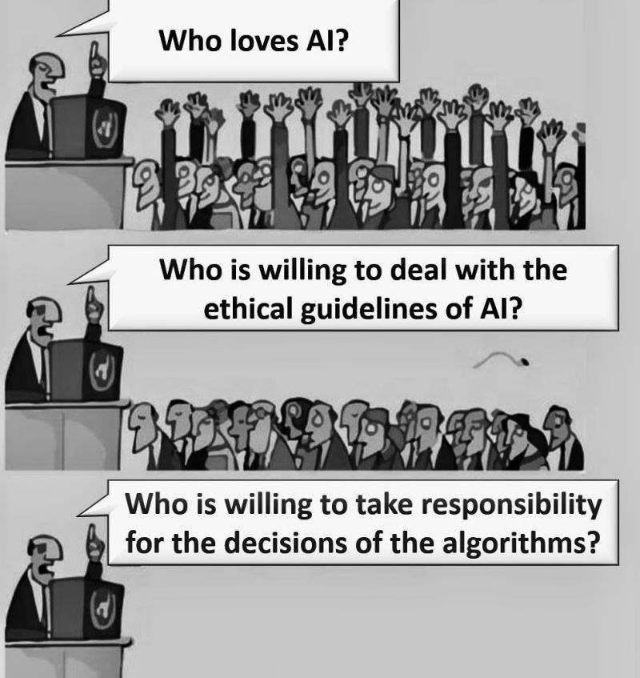{width="100%"}](#){data-modal-type="image" data-modal-url="figures/ai-future-regulation.jpg"}

Source: [LinkedIn](https://www.linkedin.com/posts/senkorasic_stealing-this-meme-to-point-out-that-1-activity-7244270295614722049-RBRU)
:::
:::
:::
:::

# Summary and takeaways 📝 {background-color="#2d4563"}

## Main takeaways

:::{style="margin-top: 30px; font-size: 19px;"}
:::{.columns}
:::{.column width=55%}
`r fa('scale-balanced')` **Why regulate?**

- Market failures: information asymmetry, externalities
- Rights protection and human dignity
- Collective action problems

`r fa('flag')` **EU AI Act**

- World's first comprehensive AI law
- Risk-based approach with four tiers
- Strict requirements for high-risk systems
- Special rules for foundation models
- Fines up to 7% global turnover

`r fa('flag')` **US approach**

- Sectoral regulation, no comprehensive law
- Executive orders and voluntary commitments
- State-level initiatives filling gaps
- Innovation-first philosophy
:::

:::{.column width=45%}
`r fa('globe')` **Global picture**

- No international consensus
- EU likely to set de facto global standards
- China: extensive but contradictory
- UK, Canada, others developing approaches

`r fa('briefcase')` **For practitioners**

- Know your use case classification
- Build compliance in from the start
- Document everything
- Plan for human oversight
- Stay informed as rules evolve

:::{style="background: rgba(45, 69, 99, 0.1); padding: 15px; border-radius: 10px; margin-top: 15px; font-size: 18px;"}
How do you hold someone accountable for a decision made by a machine? Every framework we covered today is trying to answer that!
:::
:::
:::
:::

# ... and that's all for today! 🎉 {background-color="#2d4563"}