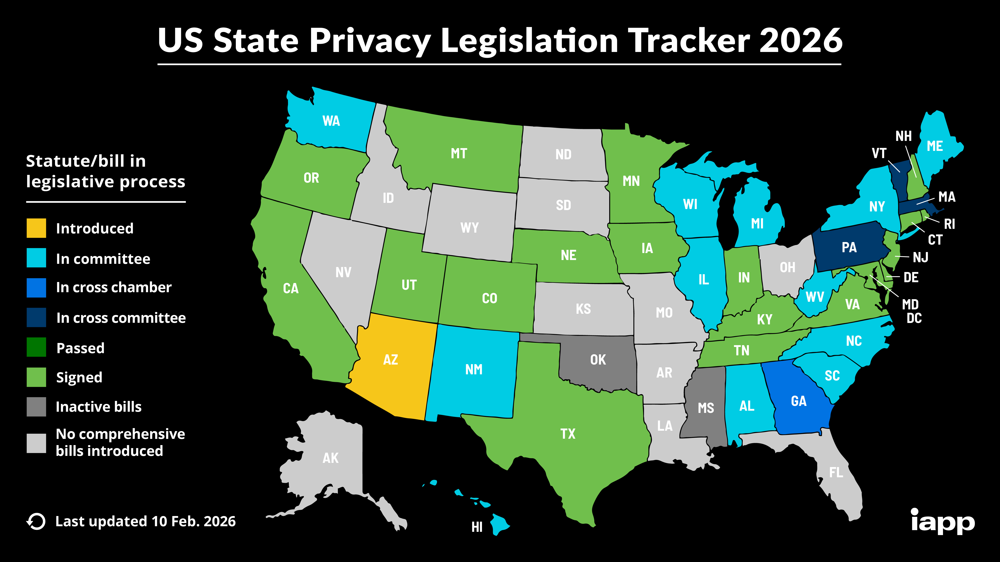
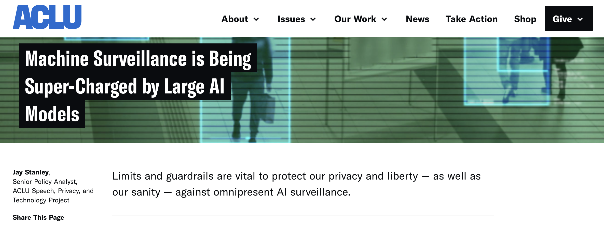

```{r setup, include=FALSE}
options(htmltools.dir.version = FALSE)
library(knitr)
opts_chunk$set(
  prompt = T,
  fig.align="center",
  dpi=300,
  cache=T,
  engine.opts = list(bash = "-l")
  )

knit_hooks$set(
  prompt = function(before, options, envir) {
    options(
      prompt = if (options$engine %in% c('sh','bash', 'zsh')) '$ ' else 'R> ',
      continue = if (options$engine %in% c('sh','bash', 'zsh')) '$ ' else '+ '
      )
})

options(repos = c(CRAN = "https://cran.rstudio.com/"))

if (!require("fontawesome", character.only = TRUE)) {
  install.packages("fontawesome", dependencies = TRUE)
  library(fontawesome, character.only = TRUE)
}
```

# Welcome back! 🔒 {background-color="#2d4563"}

## Recap of last class

:::{style="margin-top: 20px; font-size: 26px;"}
:::{.columns}
:::{.column width=50%}
- We covered [AI regulation]{.alert} around the world
- **EU AI Act**: World's first comprehensive AI law with risk-based approach (banned, high-risk, limited, minimal risk tiers)
- **US approach**: Sectoral regulation with state-level initiatives
- **China**: State control over content with innovation goals; requires algorithm registration
- No global consensus yet, but convergence on key principles is likely
- Today: How does AI intersect with [privacy]{.alert}?
:::

:::{.column width=50%}
:::{style="text-align: center; margin-top: 30px;"}
[{width="100%"}](#){data-modal-type="image" data-modal-url="figures/privacy-illustration.jpg"}
:::
:::
:::
:::

## Lecture overview
### What we will cover today

:::{style="margin-top: 20px; font-size: 26px;"}

:::{.columns}
:::{.column width=50%}
**Part 1: Privacy in the AI age**

- Why AI makes privacy harder
- Data collection at unprecedented scale
- Inference and prediction of sensitive attributes

**Part 2: Legal frameworks**

- GDPR and data protection principles
- Rights of individuals
- US privacy landscape
:::

:::{.column width=50%}
**Part 3: Technical approaches**

- Differential privacy
- Federated learning
- Privacy-preserving machine learning

**Part 4: Challenges and tensions**

- AI as a force for good vs surveillance
- What can you do?
:::
:::
:::

## Meme of the day 😄

:::{style="text-align: center; margin-top: 30px;"}
[{width="55%"}](#){data-modal-type="image" data-modal-url="figures/privacy-meme.png"}

Source: [Caniphis](https://caniphish.com/blog/ai-memes)
:::

## Good news of the day 📰

:::{style="text-align: center; margin-top: 30px;"}
[{width="65%"}](#){data-modal-type="image" data-modal-url="figures/ai-polarisation.png"}

Source: [Financial Times](https://www.ft.com/content/3880176e-d3ac-4311-9052-fdfeaed56a0e)
:::

# Privacy in the AI age 🔍 {background-color="#2d4563"}

## Why AI makes privacy harder

:::{style="margin-top: 30px; font-size: 19px;"}
:::{.columns}
:::{.column width=55%}
AI makes privacy harder in ways that older laws did not anticipate:

**Scale of collection:**

- Traditional surveillance was limited by staffing; AI-enabled collection runs [around the clock at almost no cost]{.alert}
- Every interaction becomes a data point, creating "data exhaust" from ordinary activities

**Inference capabilities:**

- AI can [predict sensitive information]{.alert} from seemingly innocuous data, e.g. shopping patterns reveal health conditions, typing speed reveals mood, social networks reveal politics
- [Things you never disclosed can be inferred]{.alert}

**Persistence:**

- Data doesn't decay; models trained today affect you forever and decisions follow you across contexts
- "Right to be forgotten" is technically hard
:::

:::{.column width=45%}
:::{style="text-align: center;"}
[{width="100%"}](#){data-modal-type="image" data-modal-url="figures/data-collection.png"}

Source: [AI Multiple](https://research.aimultiple.com/data-collection-methods/)

:::{style="background: rgba(45, 69, 99, 0.1); padding: 15px; border-radius: 10px; font-size: 18px; margin-top: 15px;"}
"If you're not paying for the product, you are the product." This phrase understates it. [Even when you pay]{.alert}, your data is often the real product.
:::
:::
:::
:::
:::

## What can be inferred from your data?

:::{style="margin-top: 30px; font-size: 20px;"}
:::{.columns}
:::{.column width=55%}
**Research has shown AI can predict:**

| Data source | What can be inferred |
|-------------|---------------------|
| Facebook likes | Political views, sexuality, personality |
| Smartphone sensors | Depression, anxiety, Parkinson's |
| Typing patterns | Age, gender, emotional state |
| Purchase history | Pregnancy, health conditions |
| Location data | Home address, workplace, religion |
| Voice recordings | Emotional state, health, age |

**Famous example: Target and pregnancy**

- Target's marketing algorithm identified a pregnant teenager
- Sent baby product coupons to her home
- Her father found out before she told him
- [The algorithm knew before her family did]{.alert}
:::

:::{.column width=45%}
:::{style="text-align: center;"}
[{width="100%"}](#){data-modal-type="image" data-modal-url="figures/target.png"}

Source: [Time](https://techland.time.com/2012/02/17/how-target-knew-a-high-school-girl-was-pregnant-before-her-parents/)

:::{style="background: rgba(230, 57, 70, 0.1); padding: 15px; border-radius: 10px; font-size: 18px; margin-top: 15px;"}
**The inference problem**: You can control what you share. You [cannot control what can be inferred]{.alert} from what you share.
:::
:::
:::
:::
:::

## Training data and privacy

:::{style="margin-top: 30px; font-size: 21px;"}
:::{.columns}
:::{.column width=55%}
**LLMs have a training data problem:**

- Trained on internet-scale data
- That data includes [personal information]{.alert}
- Models can [memorise and regurgitate]{.alert} training data
- Your name, address, phone number might be in there

**Demonstrated attacks:**

- Researchers extracted [verbatim training data]{.alert} from GPT2
- Including names, phone numbers, email addresses
- Extraction attacks continue to improve

**The consent problem:**

- Most people don't know what's in training sets
- "Publicly available" ≠ "consented to AI training"
:::

:::{.column width=45%}
:::{style="text-align: center;"}
[{width="100%"}](#){data-modal-type="image" data-modal-url="figures/training-data.png"}

Source: [The Hacker News](https://thehackernews.com/2025/02/12000-api-keys-and-passwords-found-in.html)

:::{style="font-size: 18px; margin-top: 15px;"}
When you ask an LLM about yourself, it might [actually know things]{.alert} from training data you never shared with it directly.
:::
:::
:::
:::
:::

## Discussion: would you share? 🤔

:::{style="margin-top: 30px; font-size: 22px;"}
:::{.columns}
:::{.column width=50%}
**Quick poll (raise your hand):**

Would you share your data if...

1. A health app predicts disease risk but [sells data to insurers]{.alert}?
2. A smart home device improves comfort but [records all conversations]{.alert}?
3. A job search site personalises results but [shares with employers]{.alert}?
4. A social app connects you with friends but [builds a profile for advertisers]{.alert}?
5. An AI tutor helps you learn but [reports to your school]{.alert}?
:::

:::{.column width=50%}
:::{.fragment}
**The usual pattern:**

- People say they care about privacy
- But they don't [act]{.alert} like they care
- This is called the [privacy paradox]{.alert}

**Why?**

- Costs are immediate, harms are distant
- Default settings favour sharing
- Terms of service are unreadable
- "Everyone does it" normalisation
- Benefits are tangible, harms are abstract
- [We're not good at probabilistic thinking]{.alert}
:::
:::
:::
:::

# Legal frameworks 📜 {background-color="#2d4563"}

## GDPR fundamentals

:::{style="margin-top: 30px; font-size: 20px;"}
:::{.columns}
:::{.column width=55%}
The [General Data Protection Regulation]{.alert} (2018) is the EU's comprehensive privacy law.

**Key principles:**

1. **Lawfulness, fairness, transparency**: Process data legally and openly
2. **Data minimisation**: Collect only what's necessary
3. **Accuracy**: Keep data accurate and up to date
4. **Storage limitation**: Don't keep longer than needed
5. **Integrity and confidentiality**: Protect data properly
6. **Accountability**: Demonstrate compliance

**Lawful bases for processing:**

- Consent (freely given, specific, informed)
- Legal obligation
- Vital interests
- Public interest
- [Legitimate interests]{.alert} (most contested)
:::

:::{.column width=45%}
:::{style="text-align: center;"}
[{width="100%"}](#){data-modal-type="image" data-modal-url="figures/gdpr.jpg"}

:::{style="background: rgba(45, 69, 99, 0.1); padding: 15px; border-radius: 10px; font-size: 18px; margin-top: 15px;"}
GDPR applies to any organisation processing EU residents' data, [wherever they're located]{.alert}. It has global reach, like the EU AI Act.
:::
:::
:::
:::
:::

## Individual rights under GDPR

:::{style="margin-top: 30px; font-size: 21px;"}
:::{.columns}
:::{.column width=55%}
**You have the right to:**

| Right | What it means |
|-------|---------------|
| **Access** | Get a copy of your data |
| **Rectification** | Correct inaccurate data |
| **Erasure** | "Right to be forgotten" |
| **Portability** | Move data to another service |
| **Restriction** | Limit processing |
| **Object** | Stop certain processing |
| **Not be profiled** | Reject automated decisions |

**Article 22: automated decisions**

- You have the right [not to be subject]{.alert} to purely automated decisions 
- There must be [human involvement]{.alert} in consequential decisions
- Exceptions exist for contracts and explicit consent
:::

:::{.column width=45%}
:::{style="text-align: center;"}
[{width="100%"}](#){data-modal-type="image" data-modal-url="figures/gdpr-02.jpg"}

Source: [EU GDPR Portal](https://gdpr.eu/what-is-gdpr/)

:::{style="background: rgba(45, 69, 99, 0.1); padding: 15px; border-radius: 10px; font-size: 18px; margin-top: 15px;"}
**In practice**: These rights exist on paper, but [exercising them is often difficult]{.alert}. Companies make it hard to find the right forms, respond slowly, or claim exemptions.
:::
:::
:::
:::
:::

## GDPR and AI tensions

:::{style="margin-top: 30px; font-size: 19px;"}
:::{.columns}
:::{.column width=55%}
**Purpose limitation vs model training:**

- You gave data for one purpose
- Can it train a model for another?
- AI companies claim [legitimate interest]{.alert}

**Data minimisation vs big data:**

- AI works better with more data
- GDPR says collect only what's necessary
- What's "necessary" for a foundation model?

**Right to explanation vs black boxes:**

- If an AI makes a decision about you, you can ask why
- But many AI systems [can't explain themselves]{.alert}

**Right to erasure vs model training:**

- Can you demand your data be removed from a trained model?
- "Unlearning" is technically very difficult
:::

:::{.column width=45%}
:::{style="text-align: center;"}
[{width="100%"}](#){data-modal-type="image" data-modal-url="figures/gdpr-ai.webp"}

Source: [CertPro](https://certpro.com/ai-and-gdpr/)

:::{style="font-size: 18px; margin-top: 15px;"}
GDPR was written before the LLM era. [Applying 2018 law to 2026 technology]{.alert} creates interpretation challenges.
:::
:::
:::
:::
:::

## US privacy landscape

:::{style="margin-top: 30px; font-size: 20px;"}
:::{.columns}
:::{.column width=55%}
**No comprehensive federal privacy law**

Instead, a [patchwork]{.alert} of sector-specific rules:

| Law | Scope |
|-----|-------|
| HIPAA | Healthcare data |
| FERPA | Education records |
| COPPA | Children's data |
| GLBA | Financial data |
| FCRA | Credit reporting |
| ECPA | Electronic communications |

**State laws filling the gap:**

- **California (CCPA/CPRA)**: Most comprehensive, GDPR-like rights
- **Virginia, Colorado, Connecticut**: Similar frameworks
- **Illinois BIPA**: Biometric data, with private right of action
- Many more states following, as we saw in previous lectures
:::

:::{.column width=45%}
:::{style="text-align: center;"}
[{width="100%"}](#){data-modal-type="image" data-modal-url="figures/us-privacy-map.jpg"}

Source: [IAPP](https://iapp.org/resources/article/us-state-privacy-legislation-tracker)

:::{style="background: rgba(45, 69, 99, 0.1); padding: 15px; border-radius: 10px; font-size: 18px; margin-top: 15px;"}
The US approach: [regulate specific harms in specific sectors]{.alert} rather than establishing general data rights. This leaves many gaps.
:::
:::
:::
:::
:::

## GDPR enforcement

:::{style="margin-top: 30px; font-size: 22px;"}
:::{.columns}
:::{.column width=55%}
**Major fines (selected):**

| Company | Fine | Reason |
|---------|------|--------|
| Meta (2023) | [€1.2B]{.alert} | EU-US data transfers |
| Amazon (2021) | €746M | Targeted advertising |
| Meta (2022) | €405M | Instagram children's data |
| Google (2022) | €150M | Cookie consent |
| TikTok (2023) | €345M | Children's privacy |

**Patterns:**

- Big tech companies are primary targets
- Data transfers, consent, children are focus areas
- Fines are [getting larger]{.alert}
- Enforcement varies by country (Ireland is lax)
:::

:::{.column width=45%}
:::{style="text-align: center;"}
[{width="80%"}](#){data-modal-type="image" data-modal-url="figures/gdpr-fines.avif"}

Source: [Secureframe](https://secureframe.com/hub/gdpr/fines-and-penalties)

:::{style="font-size: 18px; margin-top: 15px;"}
€1.2 billion sounds big, but Meta made [~$135 billion in 2024]{.alert}. Is that a fine or a cost of doing business?
:::
:::
:::
:::
:::

# Technical approaches to privacy 🛡️ {background-color="#2d4563"}

## Differential privacy

:::{style="margin-top: 30px; font-size: 21px;"}
:::{.columns}
:::{.column width=55%}
[Differential privacy]{.alert} is a mathematical framework for privacy-preserving data analysis.

**The core idea:**

- Add carefully calibrated [noise]{.alert} to data or results
- The noise makes it impossible to tell whether any individual was in the dataset
- But aggregate patterns remain visible

**Formal guarantee:**

- The output of an analysis is [nearly the same]{.alert} whether or not any single individual is included
- An attacker learns almost nothing about any specific person
- Privacy loss is quantified by [epsilon (ε)]{.alert}
- Trade-off: More noise = more privacy = less accuracy
:::

:::{.column width=45%}
:::{style="text-align: center;"}
[{width="100%"}](#){data-modal-type="image" data-modal-url="figures/dp-intro.png"}

Source: [Flower AI](https://flower.ai/docs/framework/explanation-differential-privacy.html)

:::{style="background: rgba(45, 69, 99, 0.1); padding: 15px; border-radius: 10px; font-size: 18px; margin-top: 15px;"}
**Real-world use**: Apple uses differential privacy for emoji suggestions, Google for Chrome usage stats, US Census for 2020 data.
:::
:::
:::
:::
:::

## Federated learning

:::{style="margin-top: 30px; font-size: 21px;"}
:::{.columns}
:::{.column width=55%}
[Federated learning]{.alert} trains AI models without centralising data.

**How it works:**

1. Central server sends model to devices
2. Each device trains on its [local data]{.alert}
3. Devices send [model updates]{.alert} (not data) back
4. Server aggregates updates into improved model
5. Repeat

**Privacy benefits and limitations:**

- Raw data never leaves your device
- Server only sees aggregated gradients
- Much harder to extract individual information
- But [coordination is complex]{.alert} and [models can still leak information]{.alert}
:::

:::{.column width=45%}
:::{style="text-align: center;"}
<!-- Suggested image: Federated learning diagram -->
[{width="100%"}](#){data-modal-type="image" data-modal-url="figures/federated-learning.png"}

Source: [Wikipedia](https://en.wikipedia.org/wiki/Federated_learning)

:::{style="font-size: 18px; margin-top: 15px;"}
**Example**: Google's Gboard uses federated learning to improve predictions. Your typing stays on your phone; only model improvements are shared.
:::
:::
:::
:::
:::

## Synthetic data for privacy

:::{style="margin-top: 30px; font-size: 21px;"}
:::{.columns}
:::{.column width=55%}
What if you could train a model on data that looks real but isn't? That is the idea behind [synthetic data]{.alert}.

**How it works:**

- Train a generative model on real data
- Model learns statistical patterns and correlations
- Generate [new, fake data points]{.alert} that look real
- Train your AI on synthetic data instead

**Privacy benefits and limitations:**

- No real personal data in training pipeline
- [Individuals can't be identified]{.alert} from synthetic records
- Can share data freely for research and collaboration
- However, synthetic data may [not capture rare cases]{.alert} well
- Risk of "overfitting" to original data (memorisation)
:::

:::{.column width=45%}
:::{style="text-align: center;"}
<!-- Suggested image: Synthetic data illustration -->
[{width="100%"}](#){data-modal-type="image" data-modal-url="figures/synthetic-data.png"}

Source: [GOV.UK](https://dataingovernment.blog.gov.uk/2020/08/20/synthetic-data-unlocking-the-power-of-data-and-skills-for-machine-learning/)

:::{style="background: rgba(45, 69, 99, 0.1); padding: 15px; border-radius: 10px; font-size: 18px; margin-top: 15px;"}
**Real-world use**: Healthcare organisations use synthetic patient data for research. Financial institutions test fraud detection on synthetic transactions.
:::
:::
:::
:::
:::

## Do these techniques actually help?

:::{style="margin-top: 30px; font-size: 22px;"}
**Honest assessment:**

- They help at the margins
- They don't solve fundamental problems
- [Collection is still the main issue]{.alert}

**The data minimisation solution:**

- Best privacy protection: don't collect data
- But AI companies have opposite incentive
- Technical fixes work around the problem
- They don't address the power imbalance
- Companies announce privacy features with [large epsilon]{.alert} (weak privacy)
- Hard for users to evaluate claims
:::

# Challenges and tensions ⚖️ {background-color="#2d4563"}

## AI as a force for good vs surveillance

:::{style="margin-top: 30px; font-size: 21px;"}
:::{.columns}
:::{.column width=55%}
**The promise:**

- Disease prediction saves lives
- Personalised education helps students
- Recommendation systems save time
- Fraud detection protects consumers

**The same system can be both good and bad:**

- Health app: Helps you exercise OR enables insurance discrimination
- Location data: Optimises traffic OR tracks movements
- Facial recognition: Finds missing children OR enables authoritarian control
- Whether the same tool helps or harms depends on [who controls it and what rules apply]{.alert}
:::

:::{.column width=45%}
:::{style="text-align: center;"}
[{width="100%"}](#){data-modal-type="image" data-modal-url="figures/ai-two-faces.png"}

Source: [ACLU](https://www.aclu.org/news/privacy-technology/machine-surveillance-is-being-super-charged-by-large-ai-models)

:::{style="font-size: 18px; margin-top: 15px;"}
"The technology is neutral" is a dodge. Facial recognition that works better on lighter skin was not designed to be racist, but [the design choices had that effect]{.alert}.
:::
:::
:::
:::
:::

## What can you do?

:::{style="margin-top: 30px; font-size: 21px;"}
:::{.columns}
:::{.column width=55%}
**Individual actions:**

- Review privacy settings and use [privacy-focused tools]{.alert} (Signal, DuckDuckGo, Firefox)
- Limit location sharing and use different email addresses for different services
- Exercise your rights (access, deletion requests) and be [skeptical of "personalisation"]{.alert}

**Limitations of individual action:**

- Opting out often means losing service; privacy is [collective]{.alert}, not just individual
- Your data can be inferred from others' data, and power imbalance is structural
:::

:::{.column width=45%}
**Collective action:**

- Support privacy legislation and demand transparency from companies
- Support organisations fighting for privacy (EFF, EPIC, etc.)
- Choose services that respect privacy and vote for privacy-protecting candidates

:::{style="background: rgba(45, 69, 99, 0.1); padding: 15px; border-radius: 10px; font-size: 18px; margin-top: 15px;"}
Using Signal instead of WhatsApp helps, but it won't change how insurers use your health data. That takes [legislation]{.alert}.
:::
:::
:::
:::

## Case study: Clearview AI 🔍

:::{style="margin-top: 30px; font-size: 21px;"}
:::{.columns}
:::{.column width=55%}
**What happened:**

- Clearview AI scraped [billions of photos]{.alert} from social media
- Built a facial recognition database without consent
- Sold access to law enforcement, corporations, wealthy individuals
- People never knew their faces were in the database

**Privacy violations:**

- No consent for data collection or use
- Violated terms of service of platforms
- [GDPR fines]{.alert}: €20M in multiple EU countries
- [Illinois BIPA]{.alert}: Multiple class action settlements
- UK, Australia, Canada: Ordered to delete data
:::

:::{.column width=45%}
:::{style="text-align: center;"}
[{width="100%"}](#){data-modal-type="image" data-modal-url="figures/clearview-ai.png"}

Source: [Library of Congress](https://www.loc.gov/item/global-legal-monitor/2024-10-16/netherlands-face-recognition-company-clearview-ai-fined-for-violating-eus-general-data-protection-regulation/)

:::{style="background: rgba(230, 57, 70, 0.1); padding: 15px; border-radius: 10px; font-size: 18px; margin-top: 15px;"}
Clearview claimed their service was only for law enforcement. Investigation revealed they gave accounts to [anyone willing to pay]{.alert}, including investors' friends.
:::
:::
:::
:::
:::

## Quick quiz: What's wrong and how would you fix it? 🎯

:::{style="margin-top: 30px; font-size: 23px;"}
**For each scenario, discuss with your neighbour: What's the problem? How would you fix it?**

:::{.columns}
:::{.column width=50%}
:::{style="margin-top: 30px;"}
1. A social media company uses your messages to train an AI without telling you

2. A shopping app collects your exact location every 30 seconds, even when not in use

3. A company keeps customer data "just in case" with no deletion policy

4. An AI hiring tool rejects candidates without any human review
:::
:::

:::{.column width=50%}
:::{.fragment}
**Problem + Fix:**

1. **Using data for undisclosed purpose** → Get explicit consent, clearly disclose AI training in privacy policy
2. **Collecting more data than necessary** → Only track location when the app is actively being used
3. **Keeping data indefinitely** → Set clear retention limits, delete old data automatically
4. **Fully automated decisions with major impact** → Always have a human review hiring decisions
:::
:::
:::
:::

## Class discussion: where's your line? 💬

:::{style="margin-top: 30px; font-size: 22px;"}
:::{.columns}
:::{.column width=50%}
**Scenario:**

A new app offers free health monitoring. It tracks:

- Your heart rate and sleep
- Your location and activity
- What you eat and drink
- Your social interactions

In exchange, it provides:

- Personalised health advice
- Early warning of health issues
- Discounts from health insurers
- Connection with others like you
:::

:::{.column width=50%}
**Let's discuss together:**

1. Would you use this app?
2. What would make you change your mind?
3. What data would be "too much"?
4. Does it matter who runs it (tech company, hospital, government)?
5. Would you feel differently if it were mandatory?

:::{style="background: rgba(45, 69, 99, 0.1); padding: 15px; border-radius: 10px; font-size: 18px; margin-top: 15px;"}
There's no right answer. The point is to [identify your own values]{.alert} and understand what trade-offs you're willing to make.
:::
:::
:::
:::

# Summary and takeaways 📝 {background-color="#2d4563"}

## Main takeaways

:::{style="margin-top: 30px; font-size: 21px;"}
:::{.columns}
:::{.column width=55%}
`r fa('magnifying-glass')` **AI and privacy**

- AI enables collection at unprecedented scale
- Inference makes "non-sensitive" data sensitive
- Models can memorise and leak personal information

`r fa('scale-balanced')` **Legal frameworks**

- GDPR: Comprehensive rights-based approach
- US: Patchwork of sectoral laws
- Tension between AI development and data protection

`r fa('shield-halved')` **Technical approaches**

- Differential privacy: Add noise, preserve patterns
- Federated learning: Train without centralising
- Synthetic data: Train on artificial data, protect originals
- All have trade-offs; none is a silver bullet
:::

:::{.column width=45%}
`r fa('balance-scale')` **Tensions**

- Same data enables benefits and surveillance
- Trade-off between utility and privacy exists but is overstated

`r fa('lightbulb')` **Key insights**

- [Collection is the core problem]{.alert}
- Privacy is collective, not just individual
- Technical fixes don't address power imbalances
- Rules and oversight determine whether data helps or harms

:::{style="background: rgba(45, 69, 99, 0.1); padding: 15px; border-radius: 10px; margin-top: 15px; font-size: 18px;"}
The Target pregnancy case and the Clearview AI scraping both came down to the same thing: someone used your data in a way [you never agreed to]{.alert}.
:::
:::
:::
:::

# ... and that's all for today! 🎉 {background-color="#2d4563"}