```{r setup, include=FALSE}
options(htmltools.dir.version = FALSE)
library(knitr)
opts_chunk$set(
  prompt = T,
  fig.align="center",
  dpi=300,
  cache=T,
  engine.opts = list(bash = "-l")
  )

knit_hooks$set(
  prompt = function(before, options, envir) {
    options(
      prompt = if (options$engine %in% c('sh','bash', 'zsh')) '$ ' else 'R> ',
      continue = if (options$engine %in% c('sh','bash', 'zsh')) '$ ' else '+ '
      )
})

options(repos = c(CRAN = "https://cran.rstudio.com/"))

if (!require("fontawesome", character.only = TRUE)) {
  install.packages("fontawesome", dependencies = TRUE)
  library(fontawesome, character.only = TRUE)
}
```

# Welcome back! 🔒 {background-color="#2d4563"}

## Recap of last class

:::{style="margin-top: 20px; font-size: 26px;"}
:::{.columns}
:::{.column width=50%}
- We covered [AI regulation]{.alert} around the world
- [EU AI Act]{.alert}: World's first comprehensive AI law with risk-based approach (banned, high-risk, limited, minimal risk tiers)
- [US approach]{.alert}: Sectoral regulation with state-level initiatives
- [China]{.alert}: State control over content with innovation goals; requires algorithm registration
- [No global consensus yet, but convergence on key principles is likely]{.alert}
- Today: How does AI intersect with [privacy]{.alert}?
:::

:::{.column width=50%}
:::{style="text-align: center; margin-top: 30px;"}
[{width="100%"}](#){data-modal-type="image" data-modal-url="figures/privacy-illustration.jpg"}

- [Note:]{.alert} A filming crew will be in the room next lecture to record a video about this class! If you prefer not to be filmed, please let me know 😉
:::
:::
:::
:::

## Lecture overview
### What we will cover today

:::{style="margin-top: 20px; font-size: 26px;"}

:::{.columns}
:::{.column width=50%}
**Part 1: Privacy in the AI age**

- Why AI makes privacy harder
- Data collection at unprecedented scale
- Inference and prediction of sensitive attributes

**Part 2: Legal frameworks**

- GDPR and data protection principles
- Rights of individuals
- US privacy landscape
:::

:::{.column width=50%}
**Part 3: Technical approaches**

- Differential privacy
- Federated learning
- Privacy-preserving machine learning (synthetic data)

**Part 4: Challenges and tensions**

- Case study: Clearview AI
- Discussion: where's your line on privacy?
- What can you do?
:::
:::
:::

## Meme of the day 😄

:::{style="text-align: center; margin-top: 30px;"}
[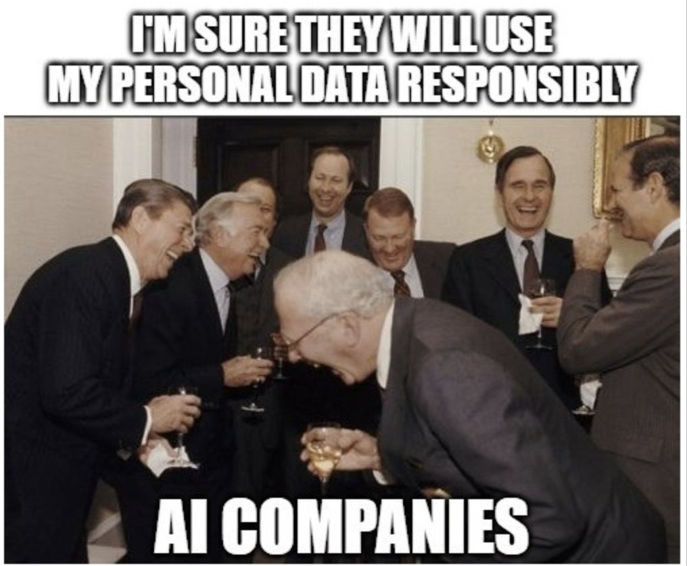{width="55%"}](#){data-modal-type="image" data-modal-url="figures/privacy-meme.png"}

Source: [Caniphis](https://caniphish.com/blog/ai-memes)
:::

## Good news of the day 📰

:::{style="text-align: center; margin-top: 30px;"}
[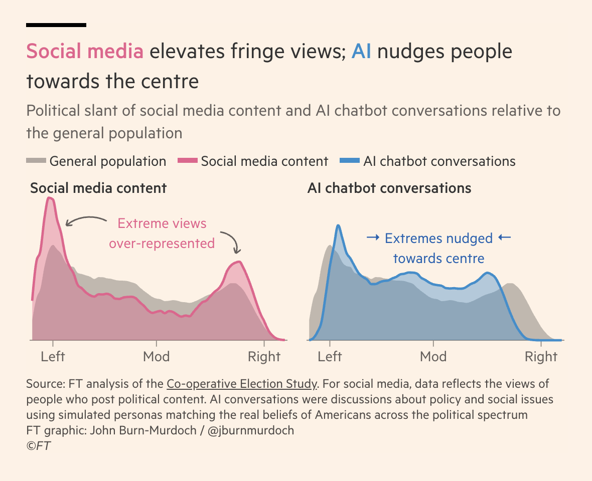{width="65%"}](#){data-modal-type="image" data-modal-url="figures/ai-polarisation.png"}

Source: [Financial Times](https://www.ft.com/content/3880176e-d3ac-4311-9052-fdfeaed56a0e)
:::

# Privacy in the AI age 🔍 {background-color="#2d4563"}

## Why AI makes privacy harder

:::{style="margin-top: 30px; font-size: 19px;"}
:::{.columns}
:::{.column width=55%}
[AI makes privacy harder]{.alert} in ways that older laws did not anticipate:

**Scale of collection:**

- Traditional surveillance was limited by staffing; AI-enabled collection runs [around the clock at almost no cost]{.alert}
- Every interaction becomes a data point, creating "data exhaust" (data generated as a byproduct of normal use) from ordinary activities

**Inference capabilities:**

- AI can [predict sensitive information]{.alert} from seemingly innocuous data, e.g. shopping patterns reveal health conditions, typing speed reveals mood, social networks reveal politics
- [Things you never disclosed can be inferred]{.alert}

**Persistence:**

- [Data doesn't decay]{.alert}; models trained today affect you forever and decisions follow you across contexts
- ["Right to be forgotten" is technically hard]{.alert}
:::

:::{.column width=45%}
:::{style="text-align: center;"}
[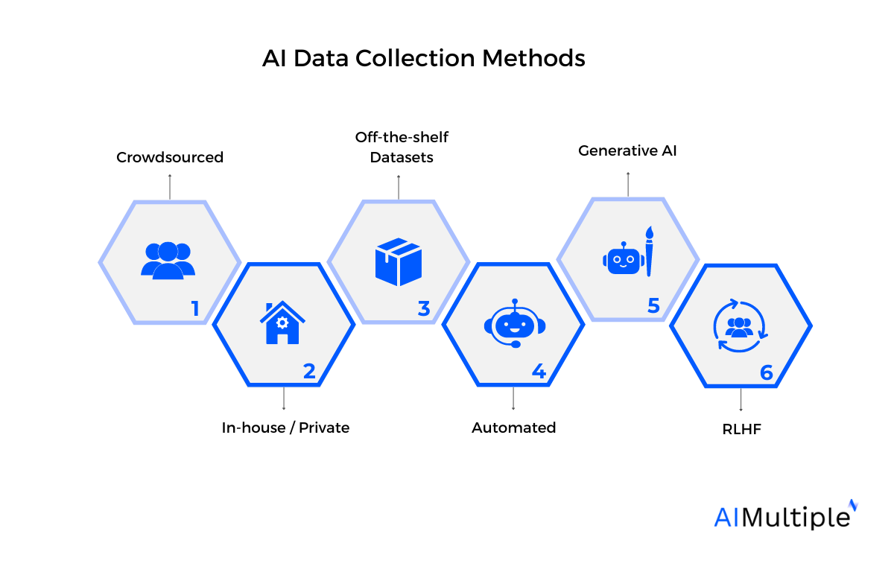{width="100%"}](#){data-modal-type="image" data-modal-url="figures/data-collection.png"}

Source: [AI Multiple](https://research.aimultiple.com/data-collection-methods/)

:::{style="background: rgba(45, 69, 99, 0.1); padding: 15px; border-radius: 10px; font-size: 18px; margin-top: 15px;"}
"If you're not paying for the product, you are the product." This phrase understates it! [Even when you pay]{.alert}, your data is often the real product!
:::
:::
:::
:::
:::

## What can be inferred from your data?

:::{style="margin-top: 30px; font-size: 20px;"}
:::{.columns}
:::{.column width=55%}
**Research has shown AI can predict:**

| Data source | What can be inferred |
|-------------|---------------------|
| Facebook likes | Political views, sexuality, personality |
| Smartphone sensors | Depression, anxiety, Parkinson's |
| Typing patterns | Age, gender, emotional state |
| Purchase history | Pregnancy, health conditions |
| Location data | Home address, workplace, religion |
| Voice recordings | Emotional state, health, age |

**Famous example: Target and pregnancy**

- Target's marketing algorithm identified a pregnant teenager
- Sent baby product coupons to her home
- Her mother complained to Target, saying her daughter was "only in high school"
- Days later, the father called Target, apologising and confirming the pregnancy
- [The algorithm knew before her family did]{.alert} ([NYT](https://www.nytimes.com/2012/02/19/magazine/shopping-habits.html))
:::

:::{.column width=45%}
:::{style="text-align: center;"}
[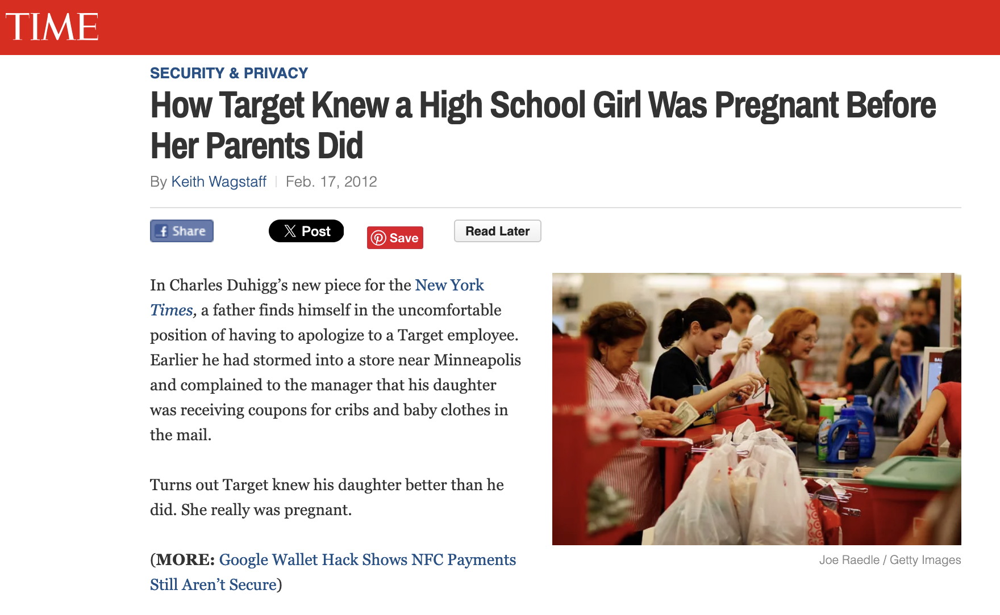{width="100%"}](#){data-modal-type="image" data-modal-url="figures/target.png"}

Source: [Time](https://techland.time.com/2012/02/17/how-target-knew-a-high-school-girl-was-pregnant-before-her-parents/)

:::{style="background: rgba(230, 57, 70, 0.1); padding: 15px; border-radius: 10px; font-size: 18px; margin-top: 15px;"}
**The inference problem**: You can control what you share. You [cannot control what can be inferred]{.alert} from what you share.
:::
:::
:::
:::
:::

## Training data and privacy

:::{style="margin-top: 30px; font-size: 21px;"}
:::{.columns}
:::{.column width=55%}
**LLMs have a training data problem:**

- Trained on internet-scale data
- That data includes [personal information]{.alert}
- Models can [memorise and regurgitate]{.alert} training data
- Your name, address, phone number might be in there!

**Demonstrated attacks:**

- Researchers extracted [verbatim training data]{.alert} from GPT-2 ([Carlini et al., 2021](https://arxiv.org/abs/2012.07805))
- Including names, phone numbers, email addresses
- Extraction attacks continue to improve

**The consent problem:**

- Most people don't know what's in training sets
- "Publicly available" ≠ "consented to AI training"
:::

:::{.column width=45%}
:::{style="text-align: center;"}
[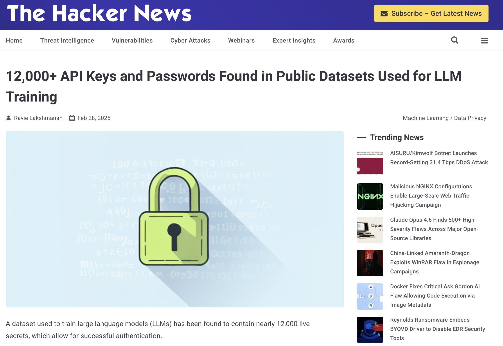{width="100%"}](#){data-modal-type="image" data-modal-url="figures/training-data.png"}

Source: [The Hacker News](https://thehackernews.com/2025/02/12000-api-keys-and-passwords-found-in.html)

:::{style="font-size: 18px; margin-top: 15px;"}
When you ask an LLM about yourself, it might [actually know things]{.alert} from training data you never shared with it directly.
:::
:::
:::
:::
:::

## Discussion: would you share? 🤔

:::{style="margin-top: 30px; font-size: 22px;"}
:::{.columns}
:::{.column width=50%}
**Quick poll (raise your hand):**

Would you share your data if...

1. A health app predicts disease risk but [sells data to insurers]{.alert}?
2. A smart home device improves comfort but [records all conversations]{.alert}?
3. A job search site personalises results but [shares with employers]{.alert}?
4. A social app connects you with friends but [builds a profile for advertisers]{.alert}?
5. An AI tutor helps you learn but [reports to your school]{.alert}?
:::

:::{.column width=50%}
:::{.fragment}
**The usual pattern:**

- People say they care about privacy
- But they don't [act]{.alert} like they care
- This is called the [privacy paradox]{.alert}

**Why?**

- Costs are immediate, harms are distant
- Default settings favour sharing
- Terms of service are unreadable
- "Everyone does it" normalisation
- Benefits are tangible, harms are abstract
- [We're not good at probabilistic thinking]{.alert}
:::
:::
:::
:::

# Legal frameworks 📜 {background-color="#2d4563"}

## GDPR fundamentals

:::{style="margin-top: 30px; font-size: 19px;"}
:::{.columns}
:::{.column width=55%}
The [General Data Protection Regulation]{.alert} ([2016/679](https://eur-lex.europa.eu/eli/reg/2016/679/oj/eng), effective 2018) is the EU's comprehensive privacy law.

**Main principles:**

1. **Lawfulness, fairness, transparency**: Process data legally and openly
2. **Data minimisation**: Collect only what's necessary
3. **Accuracy**: Keep data accurate and up to date
4. **Storage limitation**: Don't keep longer than needed
5. **Integrity and confidentiality**: Protect data properly
6. **Accountability**: Demonstrate compliance

**Lawful bases for processing:**

- Consent (freely given, specific, informed)
- Legal obligation
- Public interest
- [Legitimate interests]{.alert} (most contested: companies use this to justify processing without consent, e.g., fraud prevention or training AI models)
:::

:::{.column width=45%}
:::{style="text-align: center;"}
[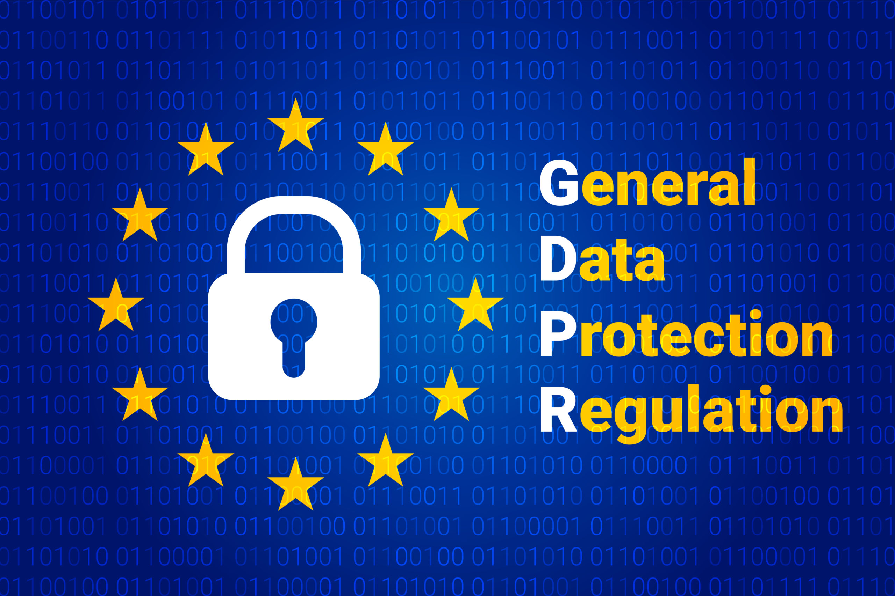{width="100%"}](#){data-modal-type="image" data-modal-url="figures/gdpr.jpg"}

:::{style="background: rgba(45, 69, 99, 0.1); padding: 15px; border-radius: 10px; font-size: 18px; margin-top: 15px;"}
GDPR applies to any organisation processing EU residents' data, [wherever they're located]{.alert}. It has global reach, like the EU AI Act. This means a US startup with European users must comply with GDPR, even if it has no office in the EU.
:::
:::
:::
:::
:::

## Individual rights under GDPR

:::{style="margin-top: 30px; font-size: 21px;"}
:::{.columns}
:::{.column width=55%}
**You have the right to:**

| Right | What it means |
|-------|---------------|
| **Access** | Get a copy of your data |
| **Rectification** | Correct inaccurate data |
| **Erasure** | "Right to be forgotten" |
| **Portability** | Move data to another service |
| **Restriction** | Limit processing |
| **Object** | Stop certain processing |
| **Not be profiled** | Reject automated decisions |

**[Article 22](https://gdpr-info.eu/art-22-gdpr/): automated decisions**

- You have the right [not to be subject]{.alert} to purely automated decisions 
- There must be [human involvement]{.alert} in consequential decisions
- Exceptions exist for contracts and explicit consent
:::

:::{.column width=45%}
:::{style="text-align: center;"}
[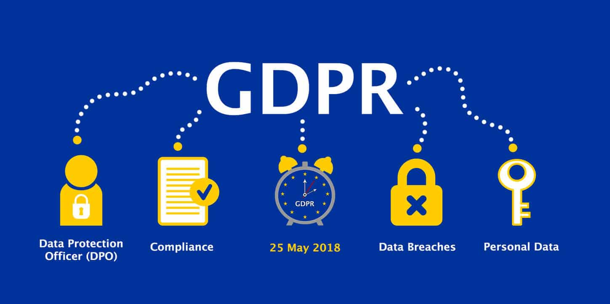{width="100%"}](#){data-modal-type="image" data-modal-url="figures/gdpr-02.jpg"}

Source: [EU GDPR Portal](https://gdpr.eu/what-is-gdpr/)

:::{style="background: rgba(45, 69, 99, 0.1); padding: 15px; border-radius: 10px; font-size: 18px; margin-top: 15px;"}
**In practice**: These rights exist on paper, but [exercising them is often difficult]{.alert}. Companies make it hard to find the right forms, respond slowly, or claim exemptions.
:::
:::
:::
:::
:::

## GDPR and AI tensions

:::{style="margin-top: 30px; font-size: 19px;"}
:::{.columns}
:::{.column width=55%}
**Purpose limitation vs model training:**

- You gave data for one purpose
- Can it train a model for another?
- AI companies claim [legitimate interest]{.alert}

**Data minimisation vs big data:**

- AI works better with more data
- GDPR says collect only what's necessary
- What's "necessary" for a foundation model? Everything?

**Right to explanation vs black boxes:**

- If an AI makes a decision about you, you can ask why
- But many AI systems [can't explain themselves]{.alert}

**Right to erasure vs model training:**

- Can you demand your data be removed from a trained model?
- "Unlearning" is technically very difficult
:::

:::{.column width=45%}
:::{style="text-align: center;"}
[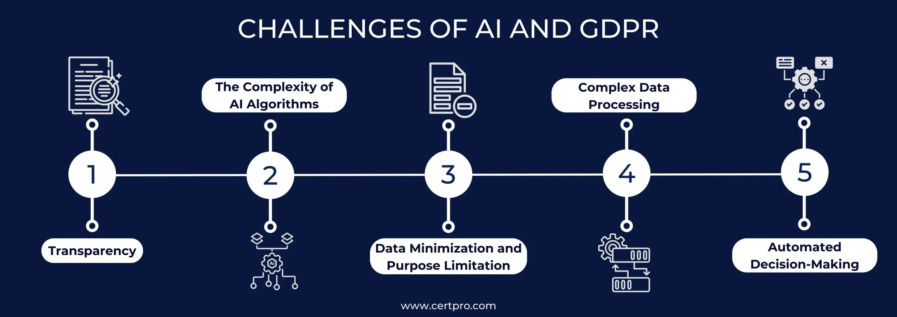{width="100%"}](#){data-modal-type="image" data-modal-url="figures/gdpr-ai.webp"}

Source: [CertPro](https://certpro.com/ai-and-gdpr/)

:::{style="font-size: 18px; margin-top: 15px;"}
GDPR was written before the LLM era. [Applying 2018 law to 2026 technology]{.alert} creates interpretation challenges.
:::
:::
:::
:::
:::

## US privacy landscape

:::{style="margin-top: 30px; font-size: 20px;"}
:::{.columns}
:::{.column width=55%}
**No comprehensive federal privacy law**, as we saw in previous lectures

Instead, a [patchwork]{.alert} of sector-specific rules:

| Law | Scope | Protects |
|-----|-------|----------|
| [HIPAA](https://www.hhs.gov/hipaa/index.html) | Healthcare data | Patient medical records |
| [FERPA](https://www2.ed.gov/policy/gen/guid/fpco/ferpa/index.html) | Education records | Student academic data |
| [COPPA](https://www.ftc.gov/legal-library/browse/rules/childrens-online-privacy-protection-rule-coppa) | Children's data | Under-13 online activity |
| [GLBA](https://www.ftc.gov/legal-library/browse/statutes/gramm-leach-bliley-act) | Financial data | Bank and loan records |
| [FCRA](https://www.ftc.gov/legal-library/browse/statutes/fair-credit-reporting-act) | Credit reporting | Credit scores and history |
| [ECPA](https://bja.ojp.gov/program/it/privacy-civil-liberties/authorities/statutes/1285) | Electronic comms | Emails, calls, stored data |

**State laws filling the gap:**

- **[California (CCPA/CPRA)](https://oag.ca.gov/privacy/ccpa)**: Most comprehensive, GDPR-like rights
- **Virginia, Colorado, Connecticut**: Similar frameworks
- **[Illinois BIPA](https://www.ilga.gov/legislation/ilcs/ilcs3.asp?ActID=3004)**: Biometric data, with private right of action
- Many more states following, as we saw before
:::

:::{.column width=45%}
:::{style="text-align: center;"}
[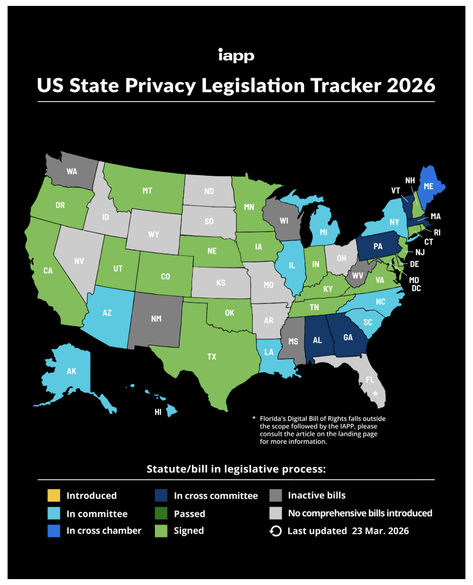{width="85%"}](#){data-modal-type="image" data-modal-url="figures/us-privacy-map.png"}

Source: [IAPP](https://iapp.org/resources/article/us-state-privacy-legislation-tracker)
:::
:::
:::
:::

## GDPR enforcement

:::{style="margin-top: 30px; font-size: 22px;"}
:::{.columns}
:::{.column width=55%}
**Major fines (selected):**

| Company | Fine | What they did wrong |
|---------|------|---------------------|
| [Meta (2023)](https://www.edpb.europa.eu/news/news/2023/12-billion-euro-fine-facebook-result-edpb-binding-decision_en) | [€1.2B]{.alert} | Transferred EU user data to US servers without adequate safeguards |
| [Amazon (2021)](https://dataprivacymanager.net/luxembourg-dpa-issues-e746-million-gdpr-fine-to-amazon/) | €746M | Processed personal data for targeted ads without valid consent |
| [Meta (2022)](https://www.dataprotection.ie/en/news-media/press-releases/data-protection-commission-announces-decision-instagram-inquiry) | €405M | Exposed children's accounts and contact info on Instagram |
| [Google (2022)](https://www.cnil.fr/en/cookies-cnil-fines-google-total-150-million-euros-and-facebook-60-million-euros-non-compliance) | €150M | Made it harder to reject cookies than to accept them |
| [TikTok (2023)](https://www.dataprotection.ie/en/news-media/press-releases/DPC-announces-345-million-euro-fine-of-TikTok) | €345M | Failed to protect children's privacy settings and data |

**Patterns:**

- Big tech companies are primary targets
- Data transfers, consent, children are focus areas
- Fines are [getting larger]{.alert}
- Enforcement varies by country (Ireland is lax)
:::

:::{.column width=45%}
:::{style="text-align: center;"}
[{width="80%"}](#){data-modal-type="image" data-modal-url="figures/gdpr-fines.avif"}

Source: [Secureframe](https://secureframe.com/hub/gdpr/fines-and-penalties)

:::{style="font-size: 18px; margin-top: 15px;"}
€1.2 billion sounds big, but Meta made [~$135 billion in 2024]{.alert}. Is that a fine or a cost of doing business?
:::
:::
:::
:::
:::

# Technical approaches to privacy 🛡️ {background-color="#2d4563"}

## Differential privacy

:::{style="margin-top: 30px; font-size: 21px;"}
:::{.columns}
:::{.column width=55%}
[Differential privacy]{.alert} is a mathematical framework for privacy-preserving data analysis ([Dwork & Roth, 2014](https://www.cis.upenn.edu/~aaroth/Papers/privacybook.pdf)).

- Add carefully calibrated [random noise]{.alert} to query results before releasing them
- For example: "How many people in this dataset have diabetes?" The true answer is 137, but the system returns 137 ± some noise (say, 134 or 141)
- Individual records stay hidden, but aggregate patterns remain visible

**Formal guarantee:**

- The output is [nearly the same]{.alert} whether or not any single individual is in the dataset
- Privacy loss is quantified by [epsilon (ε)]{.alert}: small ε = strong privacy but noisier results; large ε = weaker privacy but more accurate results
- This is a provable, mathematical guarantee, not just a promise
:::

:::{.column width=45%}
:::{style="text-align: center;"}
[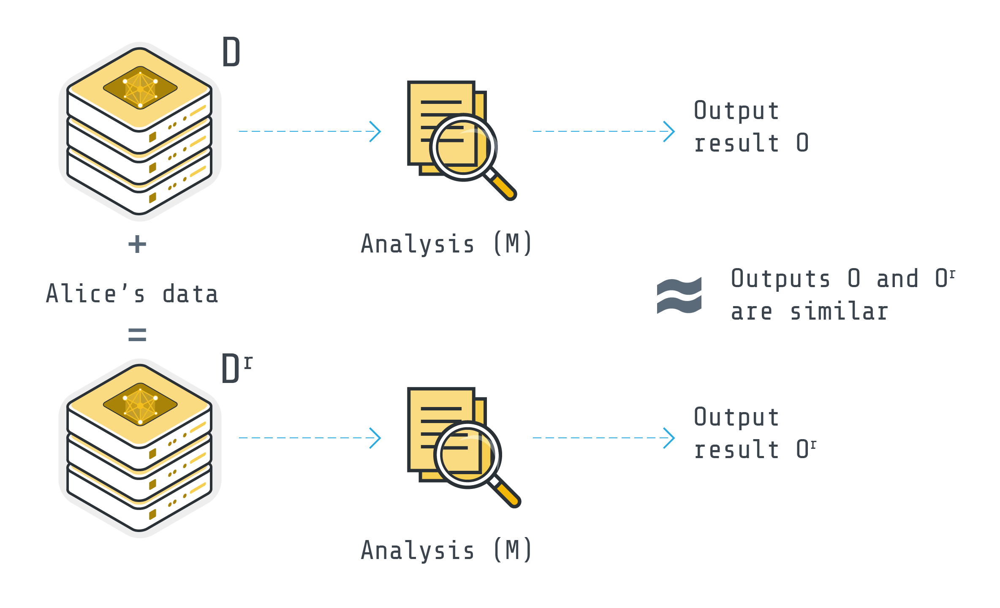{width="100%"}](#){data-modal-type="image" data-modal-url="figures/dp-intro.png"}

Source: [Flower AI](https://flower.ai/docs/framework/explanation-differential-privacy.html)

:::{style="background: rgba(45, 69, 99, 0.1); padding: 15px; border-radius: 10px; font-size: 18px; margin-top: 15px;"}
**Real-world use**: Apple uses differential privacy for emoji suggestions, Google for Chrome usage stats, US Census for 2020 data.
:::
:::
:::
:::
:::

## Federated learning

:::{style="margin-top: 30px; font-size: 20px;"}
:::{.columns}
:::{.column width=55%}
[Federated learning]{.alert} trains AI models without centralising data ([McMahan et al., 2017](https://arxiv.org/abs/1602.05629)).

**How it works:**

1. A central server sends the [same model]{.alert} to many devices 
2. Each device trains the model on its own [local data]{.alert}
3. Each device sends back only [what it learned]{.alert} (updated model weights), not the data itself
4. The server [averages]{.alert} all the updates into an improved model
5. The improved model is sent back to devices

**Why it matters for privacy:**

- Your raw data [never leaves your device]{.alert}
- The server never sees your messages, photos, or browsing history
- But it is not perfect: model updates can still [leak information]{.alert} about the training data, and coordinating thousands of devices is complex
:::

:::{.column width=45%}
:::{style="text-align: center;"}
<!-- Suggested image: Federated learning diagram -->
[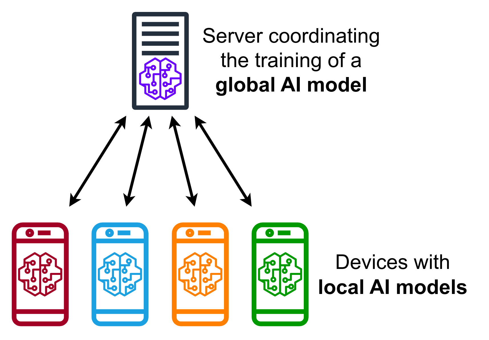{width="100%"}](#){data-modal-type="image" data-modal-url="figures/federated-learning.png"}

Source: [Wikipedia](https://en.wikipedia.org/wiki/Federated_learning)

:::{style="font-size: 18px; margin-top: 15px;"}
**Example**: Google's Gboard uses federated learning to improve predictions. Your typing stays on your phone; only model improvements are shared.
:::
:::
:::
:::
:::

## Synthetic data for privacy

:::{style="margin-top: 30px; font-size: 21px;"}
:::{.columns}
:::{.column width=55%}
What if you could train a model on data that looks real but isn't? That is the idea behind [synthetic data]{.alert} ([Jordon et al., 2022](https://proceedings.mlr.press/v133/jordon21a.html)).

**How it works:**

- Train a generative model on real data
- Model learns statistical patterns and correlations
- Generate [new, fake data points]{.alert} that look real
- Train your AI on synthetic data instead

**Privacy benefits and limitations:**

- No real personal data in training pipeline
- [Individuals can't be identified]{.alert} from synthetic records
- Can share data freely for research and collaboration
- However, synthetic data may [not capture rare cases]{.alert} well
- Risk of "overfitting" to original data (memorisation)
:::

:::{.column width=45%}
:::{style="text-align: center;"}
<!-- Suggested image: Synthetic data illustration -->
[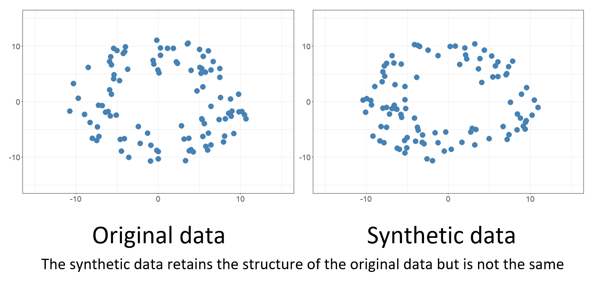{width="100%"}](#){data-modal-type="image" data-modal-url="figures/synthetic-data.png"}

Source: [GOV.UK](https://dataingovernment.blog.gov.uk/2020/08/20/synthetic-data-unlocking-the-power-of-data-and-skills-for-machine-learning/)

:::{style="background: rgba(45, 69, 99, 0.1); padding: 15px; border-radius: 10px; font-size: 18px; margin-top: 15px;"}
**Real-world use**: Healthcare organisations use synthetic patient data for research. Financial institutions test fraud detection on synthetic transactions.
:::
:::
:::
:::
:::

## Do these techniques actually help?

:::{style="margin-top: 30px; font-size: 21px;"}
:::{.columns}
:::{.column width=50%}
**What they can do:**

- Allow useful research on sensitive datasets (medical, financial) while protecting privacy
- Give engineers concrete tools, not just good intentions
- Provide [mathematical guarantees]{.alert} (differential privacy) or [architectural separation]{.alert} (federated learning)

**What they cannot do:**

- Stop companies from collecting data in the first place
- Fix the [power imbalance]{.alert} between users and platforms
- Prevent governments from demanding access to data
- Make users understand how their data is used
:::

:::{.column width=50%}
**However...**

The best privacy protection is [not collecting data at all]{.alert}. But AI companies have the opposite incentive: more data = better models = more profit.

Technical fixes work *within* the system. They don't change the system itself.

:::{style="background: rgba(230, 57, 70, 0.1); padding: 15px; border-radius: 10px; font-size: 18px; margin-top: 15px;"}
**Watch out for "privacy washing"**: companies announce differential privacy with [large epsilon values]{.alert} (weak privacy) or federated learning that still collects metadata. The tools are real, but the way they are deployed can be misleading.
:::
:::
:::
:::

# Challenges and tensions ⚖️ {background-color="#2d4563"}

## Case study: Clearview AI 🔍

:::{style="margin-top: 30px; font-size: 20px;"}
:::{.columns}
:::{.column width=55%}
- In January 2020, the [New York Times](https://www.nytimes.com/2020/01/18/technology/clearview-privacy-facial-recognition.html) revealed that Clearview AI had secretly scraped [over 30 billion photos]{.alert} from Facebook, Instagram, LinkedIn, and other platforms
- Built a facial recognition database [without anyone's consent!]{.alert}
- Sold access to over [2,400 US law enforcement agencies]{.alert}, plus corporations and wealthy individuals
- US police used the database [nearly a million times]{.alert}
- People never knew their faces were in the database

**The legal fallout:**

- [American Civil Liberties Union (ACLU) sued](https://www.aclu.org/cases/aclu-v-clearview-ai) under [Illinois BIPA]{.alert} (2020). Settlement (2022): Clearview [permanently banned]{.alert} from selling its database to private companies nationwide
- [France (CNIL)](https://www.cnil.fr/en/facial-recognition-20-million-euros-penalty-against-clearview-ai): €20M fine for illegal data collection
- [Italy](https://www.edpb.europa.eu/news/national-news/2022/facial-recognition-italian-sa-fines-clearview-ai-eur-20-million_en): €20M fine
- [Netherlands](https://www.loc.gov/item/global-legal-monitor/2024-10-16/netherlands-face-recognition-company-clearview-ai-fined-for-violating-eus-general-data-protection-regulation/): €30.5M fine (2024)
- UK, Australia, Canada: ordered to delete data
:::

:::{.column width=45%}
:::{style="text-align: center;"}
[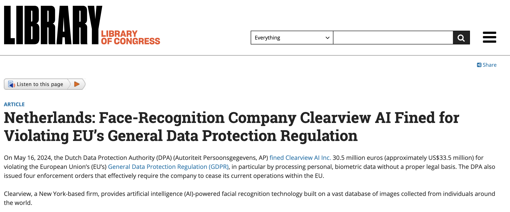{width="100%"}](#){data-modal-type="image" data-modal-url="figures/clearview-ai.png"}

Source: [Library of Congress](https://www.loc.gov/item/global-legal-monitor/2024-10-16/netherlands-face-recognition-company-clearview-ai-fined-for-violating-eus-general-data-protection-regulation/)

:::{style="background: rgba(230, 57, 70, 0.1); padding: 15px; border-radius: 10px; font-size: 18px; margin-top: 15px;"}
Clearview claimed their service was only for law enforcement. Investigation revealed they gave accounts to [anyone willing to pay]{.alert}, including investors' friends. The ACLU described it as putting everyone into a ["perpetual police line-up"](https://www.aclu.org/press-releases/big-win-settlement-ensures-clearview-ai-complies-with-groundbreaking-illinois).
:::
:::
:::
:::
:::

## Quick quiz: What's wrong and how would you fix it? 🎯

:::{style="margin-top: 30px; font-size: 28px;"}
:::{.incremental}
1. A social media company uses your messages to train an AI without telling you

2. A shopping app collects your exact location every 30 seconds, even when not in use

3. A company keeps customer data "just in case" with no deletion policy

4. An AI hiring tool rejects candidates without any human review
:::
:::

## Where's your line? 💬

:::{style="margin-top: 30px; font-size: 22px;"}
:::{.columns}
:::{.column width=50%}
**Scenario:**

A new app offers free health monitoring. It tracks:

- Your heart rate and sleep
- Your location and activity
- What you eat and drink
- Your social interactions

In exchange, it provides:

- Personalised health advice
- Early warning of health issues
- Discounts from health insurers
- Connection with others like you
:::

:::{.column width=50%}
**Let's discuss together:**

1. Would you use this app?
2. What would make you change your mind?
3. What data would be "too much"?
4. Does it matter who runs it (tech company, hospital, government)?
5. Would you feel differently if it were mandatory?

:::{style="background: rgba(45, 69, 99, 0.1); padding: 15px; border-radius: 10px; font-size: 18px; margin-top: 15px;"}
There's no right answer. The point is to [identify your own values]{.alert} and understand what trade-offs you're willing to make
:::
:::
:::
:::

## What can you do?

:::{style="margin-top: 30px; font-size: 24px;"}
:::{.columns}
:::{.column width=55%}
**Individual actions:**

- Review privacy settings and use [privacy-focused tools]{.alert} ([Signal](https://signal.org/), [DuckDuckGo](https://duckduckgo.com/), [Firefox](https://www.mozilla.org/firefox/))
- Limit location sharing and use different email addresses for different services
- Exercise your [GDPR](https://gdpr-info.eu/art-15-gdpr/)/[CCPA](https://oag.ca.gov/privacy/ccpa) rights (access, deletion requests) and be [skeptical of "personalisation"]{.alert}

**Limitations of individual action:**

- Opting out often means losing service. Privacy is [collective]{.alert}
- Your data can be inferred from others' data, and power imbalance is structural
:::

:::{.column width=45%}
**Collective action:**

- Support privacy legislation and demand transparency from companies
- Support organisations fighting for privacy ([EFF](https://www.eff.org/), [EPIC](https://epic.org/), [noyb](https://noyb.eu/))
- Choose services that respect privacy and vote for privacy-protecting candidates

:::{style="background: rgba(45, 69, 99, 0.1); padding: 15px; border-radius: 10px; font-size: 18px; margin-top: 15px;"}
Using Signal instead of WhatsApp helps, but it won't change how insurers use your health data. That takes [legislation]{.alert}.
:::
:::
:::
:::

# Summary 📝 {background-color="#2d4563"}

## Main takeaways

:::{style="margin-top: 30px; font-size: 21px;"}
:::{.columns}
:::{.column width=55%}
`r fa('magnifying-glass')` **AI and privacy**

- AI enables collection at unprecedented scale
- Inference makes "non-sensitive" data sensitive
- Models can memorise and leak personal information

`r fa('scale-balanced')` **Legal frameworks**

- GDPR: Comprehensive rights-based approach
- US: Patchwork of sectoral laws
- Tension between AI development and data protection

`r fa('shield-halved')` **Technical approaches**

- Differential privacy: Add noise, preserve patterns
- Federated learning: Train without centralising
- Synthetic data: Train on artificial data, protect originals
- All have trade-offs; none is a silver bullet
:::

:::{.column width=45%}
`r fa('balance-scale')` **Tensions**

- Same data enables benefits and surveillance
- Trade-off between utility and privacy exists but is overstated

`r fa('lightbulb')` **Key insights**

- [Collection is the core problem]{.alert}
- Privacy is collective, not just individual
- Technical fixes don't address power imbalances
- Rules and oversight determine whether data helps or harms

:::{style="background: rgba(45, 69, 99, 0.1); padding: 15px; border-radius: 10px; margin-top: 15px; font-size: 18px;"}
The Target pregnancy case and the Clearview AI scraping both came down to the same thing: someone used your data in a way [you never agreed to]{.alert}.
:::
:::
:::
:::

# ... and that's all for today! 🎉 {background-color="#2d4563"}