```{r setup, include=FALSE}
options(htmltools.dir.version = FALSE)
library(knitr)
opts_chunk$set(
  prompt = T,
  fig.align="center",
  dpi=300,
  cache=T,
  engine.opts = list(bash = "-l")
  )

knit_hooks$set(
  prompt = function(before, options, envir) {
    options(
      prompt = if (options$engine %in% c('sh','bash', 'zsh')) '$ ' else 'R> ',
      continue = if (options$engine %in% c('sh','bash', 'zsh')) '$ ' else '+ '
      )
})

options(repos = c(CRAN = "https://cran.rstudio.com/"))

if (!require("fontawesome", character.only = TRUE)) {
  install.packages("fontawesome", dependencies = TRUE)
  library(fontawesome, character.only = TRUE)
}
```

# Welcome back! 💼 {background-color="#2d4563"}

## Recap of last class

:::{style="margin-top: 20px; font-size: 24px;"}
:::{.columns}
:::{.column width=50%}
- We explored [privacy and data protection]{.alert} in the AI age
- AI enables collection at scale and [inference of sensitive data]{.alert}
- [GDPR]{.alert}: Comprehensive rights (access, erasure, portability)
- US: Patchwork of sectoral laws
- Technical approaches (differential privacy, federated learning, synthetic data) help but have trade-offs
- [Collection is the core problem]{.alert}. Same data enables benefits and surveillance
- Today: What does AI mean for jobs and the economy?
:::

:::{.column width=50%}
:::{style="text-align: center; margin-top: -30px;"}
[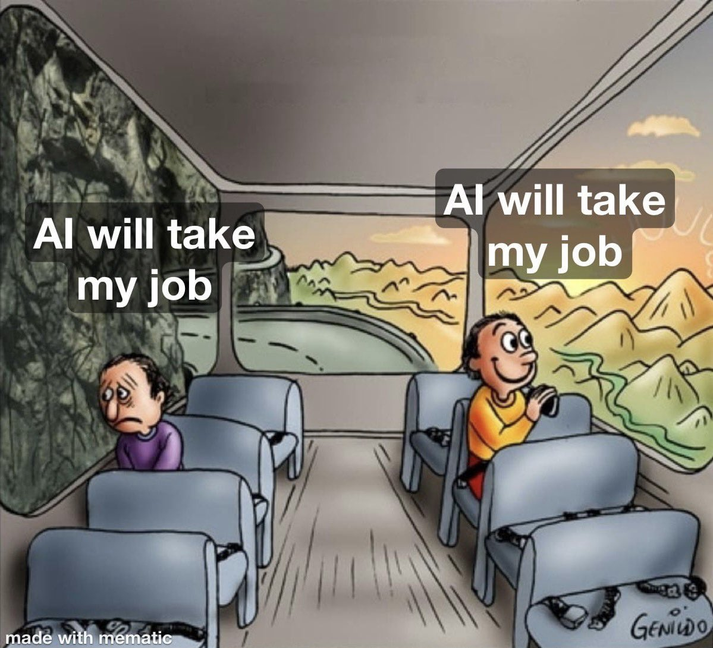{width="100%"}](#){data-modal-type="image" data-modal-url="figures/automation-worker.jpg"}

Source: [X.com](https://x.com/johnkoetsier/status/1603234885791285248)
:::
:::
:::
:::

## Lecture overview
### What we will cover today

:::{style="margin-top: 20px; font-size: 24px;"}

:::{.columns}
:::{.column width=50%}
**Part 1: The automation question**

- Historical perspective on technology and jobs
- Why "this time might be different"
- Task-based framework for thinking about AI

**Part 2: Current evidence**

- What are people using AI for?
- Productivity effects
- Early job market signals
:::

:::{.column width=50%}
**Part 3: Economic scenarios**

- Optimistic views: augmentation and new tasks
- Pessimistic views: displacement and polarisation
- What economists actually think

**Part 4: What does this mean for you?**

- Skills that may remain valuable
- Adapting to an AI-influenced economy
- The graduate job market in 2026
:::
:::
:::

## Meme of the day 😄

:::{style="text-align: center; margin-top: 30px;"}
[{width="40%"}](#){data-modal-type="image" data-modal-url="figures/ai-jobs-meme.webp"}

Source: [r/ProgrammerHumor](https://www.reddit.com/r/ProgrammerHumor/comments/11wozfs/finally_thanks_ai_s/)
:::

# The automation question 🤖 {background-color="#2d4563"}

## This isn't the first time

:::{style="margin-top: 30px; font-size: 20px;"}
:::{.columns}
:::{.column width=55%}
**Historical fears of technological unemployment:**

| Era | Technology | Fear | Outcome |
|-----|------------|------|---------|
| 1810s | Power looms | Luddites destroy machines | Textile jobs changed but grew |
| 1930s | Mechanisation | Keynes: "technological unemployment" | Post-war prosperity |
| 1960s | Mainframes | JFK warns of job losses | Service sector expansion |
| 1990s | Personal computers | End of clerical work | New jobs created |
| 2010s | Robots | Manufacturing collapse | Mixed results |

**The pattern so far:**

- Technology destroys some jobs
- But creates others
- Net effect has been [positive]{.alert} over time
- Adjustment periods are painful
:::

:::{.column width=45%}
:::{style="text-align: center; margin-top: 30px;"}
[{width="100%"}](#){data-modal-type="image" data-modal-url="figures/luddites.jpg"}

Source: [Current Affairs](https://www.currentaffairs.org/news/2021/06/the-luddites-were-right)

:::{style="background: rgba(45, 69, 99, 0.1); padding: 15px; border-radius: 10px; font-size: 18px; margin-top: 15px;"}
Every wave of automation sparked fears of mass unemployment. [So far, those fears haven't materialised]{.alert} at the aggregate level. But past performance doesn't guarantee future results.
:::
:::
:::
:::
:::

## Why this time might be different

:::{style="margin-top: 30px; font-size: 19px;"}
:::{.columns}
:::{.column width=55%}
**Previous automation:**

- Targeted [physical tasks]{.alert}
- Humans retained cognitive advantage
- Automation was task-specific

**AI is different:**

- Targets [cognitive tasks]{.alert}
- General-purpose (not task-specific)
- Improving [very rapidly]{.alert}
- "Computers can't do intellectual work"
- "Computers can't be creative"
- [All of these are now questionable]{.alert}

**Counter-argument:**

- Similar claims made before
- We keep underestimating human adaptability
- New tasks we can't imagine will emerge
:::

:::{.column width=45%}
:::{style="text-align: center;"}
[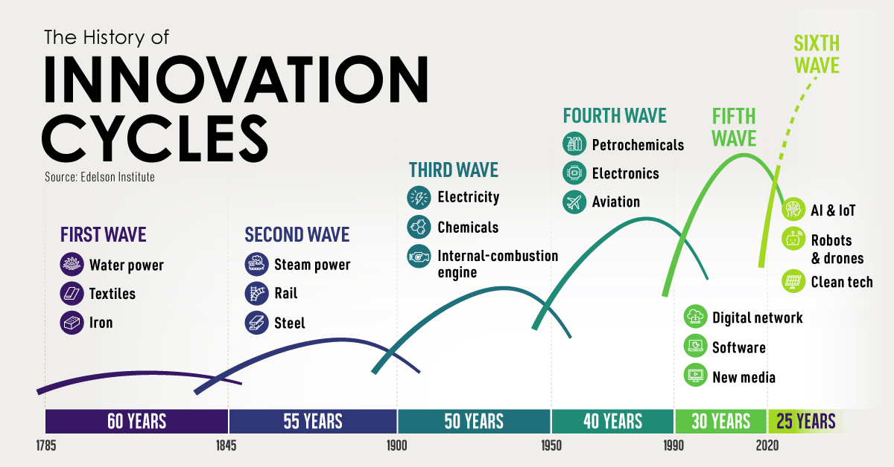{width="100%"}](#){data-modal-type="image" data-modal-url="figures/automation-waves.jpg"}

Source: [Visual Capitalist](https://www.visualcapitalist.com/the-history-of-innovation-cycles/)

:::{style="font-size: 18px; margin-top: 15px;"}
The question isn't whether AI will change work. It's [how fast]{.alert} and [who bears the costs]{.alert} of transition.
:::
:::
:::
:::
:::

## Tasks vs jobs

:::{style="margin-top: 30px; font-size: 20px;"}
:::{.columns}
:::{.column width=55%}
**A more useful framework:**

- Don't think about [jobs]{.alert} being replaced
- Think about [tasks]{.alert} being automated
- Most jobs contain many tasks
- AI might automate some but not all

**Example: Lawyer**

| Task | AI capability |
|------|---------------|
| Document review | [High]{.alert} |
| Legal research | High |
| Contract drafting | Medium-high |
| Client counselling | Medium |
| Court appearance | Low |
| Negotiation | Low |
| Judgment calls | Low |
:::

:::{.column width=45%}
**The effect:**

- Fewer lawyers needed per case
- Role shifts toward [higher-value tasks]{.alert}
- The lawyer doesn't disappear, but [what to do with the unemployed?]{.alert}

:::{style="text-align: center;"}
[{width="70%"}](#){data-modal-type="image" data-modal-url="figures/economist-ai-labour.png"}

Source: [The Economist](https://www.economist.com/finance-and-economics/2025/05/26/why-ai-hasnt-taken-your-job)
:::
:::
:::
:::

## Which tasks are most exposed?

:::{style="margin-top: 30px; font-size: 20px;"}
:::{.columns}
:::{.column width=55%}
**High exposure to AI:**

- Routine cognitive tasks
- Information processing
- Content generation (text, code, images)
- Data analysis and pattern recognition
- Translation and summarisation
- Customer service (text-based)

**Lower exposure (for now):**

- Physical manipulation in unstructured environments
- Tasks requiring physical presence
- Tasks requiring real-time judgment in novel situations
- Tasks requiring deep personal relationships
- Tasks requiring embodied expertise
:::

:::{.column width=45%}
**Exposure by occupation (various studies):**

| Occupation | Exposure |
|------------|----------|
| Telemarketers | Very high |
| Accountants | High |
| Paralegals | High |
| Writers | High |
| Software developers | Medium-high |
| Teachers | Medium |
| Nurses | Medium-low |
| Electricians | Low |
| Plumbers | Low |

:::{style="background: rgba(45, 69, 99, 0.1); padding: 15px; border-radius: 10px; font-size: 18px; margin-top: 15px;"}
Unlike previous automation, AI hits [white-collar work first]{.alert}. [Education level doesn't protect you]{.alert}.
:::
:::
:::
:::

# Current evidence 📊 {background-color="#2d4563"}

## What are people using AI for?

:::{style="margin-top: 30px; font-size: 20px;"}
:::{.columns}
:::{.column width=55%}
**OpenAI's research on ChatGPT use (2025):**

| Category | Share of use |
|----------|--------------|
| Learning and research | ~25% |
| Writing and editing | ~20% |
| Coding and technical | ~15% |
| Creative projects | ~12% |
| Work tasks | ~10% |
| Personal assistance | ~10% |
| Other | ~8% |

**Patterns:**

- Most use is [not work-related]{.alert}
- Learning and personal projects dominate
- Work adoption slower than headlines suggest, significant variation by sector and role

:::{style="background: rgba(45, 69, 99, 0.1); padding: 15px; border-radius: 10px; font-size: 18px; margin-top: 15px;"}
Headlines focus on dramatic changes. Reality: most people are [still figuring out]{.alert} how to use these tools.
:::
:::

:::{.column width=45%}
:::{style="text-align: center;"}
[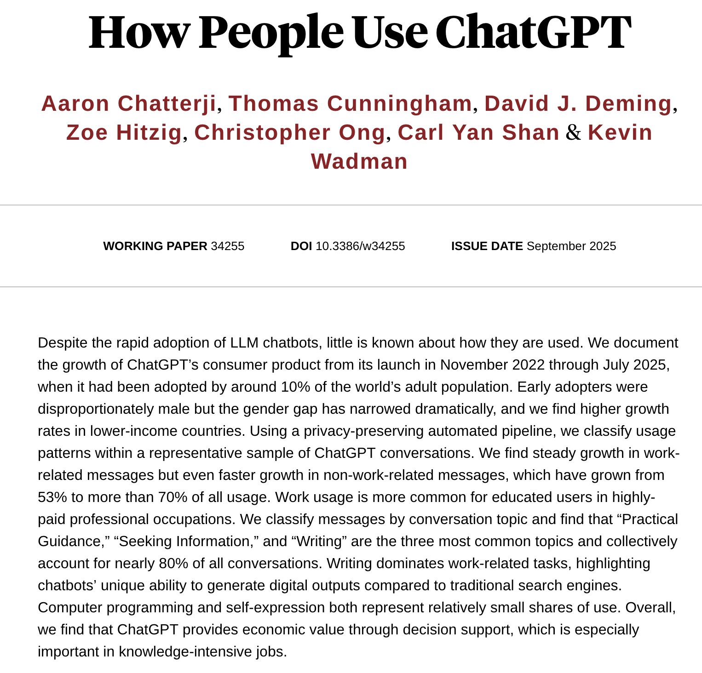{width="100%"}](#){data-modal-type="image" data-modal-url="figures/how-people-use-chatgpt.png"}

Source: [OpenAI (2025)](https://openai.com/index/how-people-are-using-chatgpt/)
:::
:::
:::
:::

## Productivity effects: early evidence

:::{style="margin-top: 30px; font-size: 20px;"}
:::{.columns}
:::{.column width=55%}
**Studies finding positive effects:**

- **Customer service [(Brynjolfsson et al., 2025)](https://academic.oup.com/qje/article/140/2/889/7990658)**: 14% productivity increase, biggest gains for [novice workers]{.alert}
- **Programmers [(GitHub, 2022)](https://github.blog/news-insights/research/research-quantifying-github-copilots-impact-on-developer-productivity-and-happiness/)**: 55% faster task completion with Copilot
- **Consultants [(BCG study, 2023)](https://www.bcg.com/publications/2023/how-people-create-and-destroy-value-with-gen-ai)**: 40% better performance on applicable tasks
- **Writers [(Noy & Zhang, 2023)](https://www.science.org/doi/10.1126/science.adh2586)**: 40% faster, 18% better quality

**Important caveats:**

- Most studies are [short-term]{.alert}
- Often sponsored by AI companies
- Lab settings vs real work differ
- Long-term effects unclear
:::

:::{.column width=45%}
**The pattern emerging:**

- AI [compresses the skill distribution]{.alert}
- Novices improve more than experts
- Experts sometimes do worse with AI
- Benefits concentrated in [specific tasks]{.alert}

:::{style="text-align: center; margin-top: 15px;"}
<!-- Suggested image: Productivity gains chart -->
[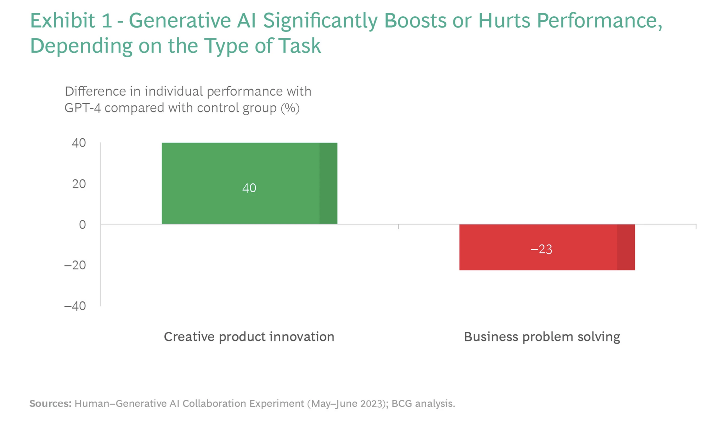{width="100%"}](#){data-modal-type="image" data-modal-url="figures/productivity-gains.png"}

Source: [Boston Consulting Group (2023)](https://www.bcg.com/publications/2023/how-people-create-and-destroy-value-with-gen-ai)
:::
:::
:::
:::

## The graduate job drought

:::{style="margin-top: 30px; font-size: 21px;"}
:::{.columns}
:::{.column width=55%}
**What the data shows (2024-2026):**

- [Entry-level job postings down]{.alert} significantly
- Particularly in tech, finance, consulting
- Companies saying [AI reduces need for junior hires]{.alert}

**Financial Times reporting (2026):**

- Graduate hiring at lowest level in decade
- Tech companies leading the pullback
- Law and consulting firms reducing trainee intakes

**The logic:**

- Junior employees do tasks AI now handles
- Training juniors is expensive
- AI doesn't need healthcare or vacation
- Companies facing pressure to cut costs
:::

:::{.column width=45%}
:::{style="text-align: center;"}
[{width="100%"}](#){data-modal-type="image" data-modal-url="figures/graduate-jobs.png"}

Source: [Financial Times (2026)](https://www.ft.com/content/c89496b1-bc8d-425e-b86b-ec89402410e4)

:::{style="background: rgba(230, 57, 70, 0.1); padding: 15px; border-radius: 10px; font-size: 18px; margin-top: 15px;"}
This is [the first wave]{.alert} of labour market impact. Entry-level positions are often the most exposed to automation.
:::
:::
:::
:::
:::

## But the aggregate numbers are confusing

:::{style="margin-top: 30px; font-size: 20px;"}
:::{.columns}
:::{.column width=55%}
**What we're not seeing (yet):**

- Mass unemployment
- Dramatic productivity surge
- Clear sectoral collapse

**What we are seeing:**

- [Slower hiring]{.alert} rather than mass firing
- Some sectors growing, others shrinking
- Geographic concentration of effects
- Rising inequality

**Why the disconnect?**

- Adoption takes time
- Companies are cautious
- Many tasks don't work well with AI
- Regulations and contracts slow change
:::

:::{.column width=45%}
:::{style="text-align: center;"}
[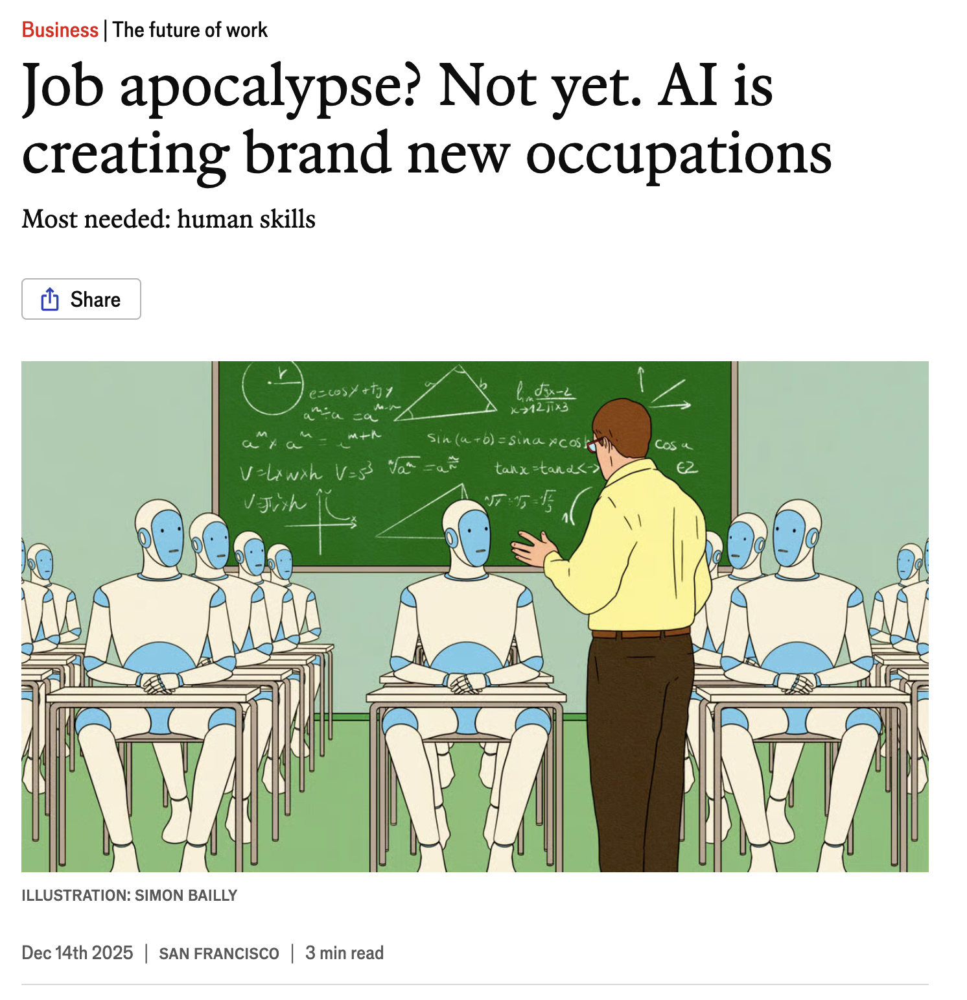{width="100%"}](#){data-modal-type="image" data-modal-url="figures/jobs-apocalypse.png"}

Source: [The Economist](https://www.economist.com/business/2025/12/14/job-apocalypse-not-yet-ai-is-creating-brand-new-occupations)
:::
:::
:::
:::

# Economic scenarios 🔮 {background-color="#2d4563"}

## The optimistic view

:::{style="margin-top: 30px; font-size: 19px;"}
:::{.columns}
:::{.column width=55%}
**Augmentation, not replacement:**

- AI makes workers [more productive]{.alert}
- One person can do what five did before
- But demand expands to absorb capacity
- Net effect: more output, same or more jobs

**New tasks emerge:**

- AI creates [new kinds of work]{.alert}
- Prompt engineering, AI training, oversight
- Jobs we can't imagine yet
- Like social media manager in 1990

**Historical pattern continues:**

- Technology has always created more jobs than it destroyed
- Higher productivity → higher incomes → more demand
- "Lump of labour fallacy": there isn't a fixed amount of work
:::

:::{.column width=45%}
:::{style="text-align: center;"}
[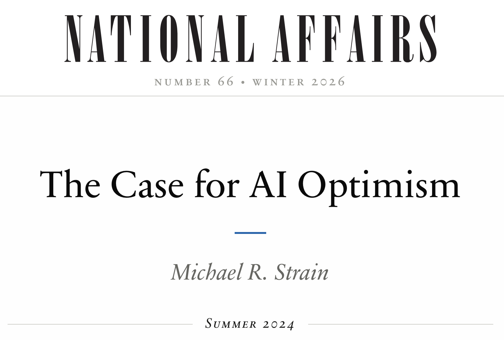{width="60%"}](#){data-modal-type="image" data-modal-url="figures/optimistic-future.png"}
[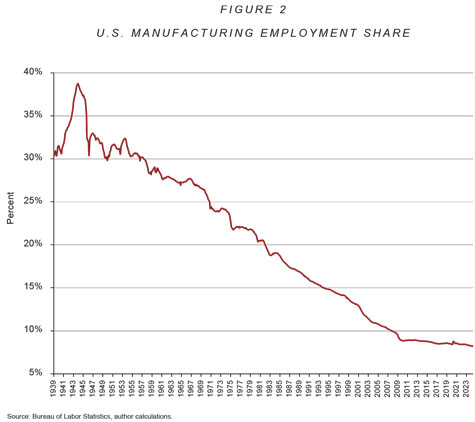{width="60%"}](#){data-modal-type="image" data-modal-url="figures/strainchart2verysmall.jpg"}

Source: [Michael R. Strain](https://nationalaffairs.com/publications/detail/the-case-for-ai-optimism)
:::
:::
:::
:::

## The pessimistic view

:::{style="margin-top: 30px; font-size: 21px;"}
:::{.columns}
:::{.column width=55%}
**Displacement dominates:**

- AI replaces workers [faster than new jobs emerge]{.alert}
- Transition period could be very long
- Many workers never recover
- Skills mismatch is severe

**Polarisation:**

- High-skill jobs get more valuable
- Low-skill service jobs persist (hard to automate)
- Middle gets [hollowed out]{.alert}
- Inequality increases dramatically

**Power dynamics:**

- Productivity gains go to [capital, not labour]{.alert}
- "Race to the bottom" for wages
:::

:::{.column width=45%}
:::{style="text-align: center;"}
[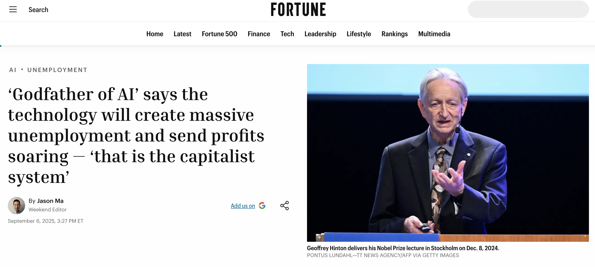{width="100%"}](#){data-modal-type="image" data-modal-url="figures/pessimistic-future-02.png"}

Source: [Fortune](https://fortune.com/2025/09/06/godfather-of-ai-geoffrey-hinton-massive-unemployment-soaring-profits-capitalist-system/)

:::{style="background: rgba(230, 57, 70, 0.1); padding: 15px; border-radius: 10px; font-size: 18px; margin-top: 15px;"}
**Pessimist's argument**: "The horse population never recovered from the automobile. [What if humans are the horses?]{.alert}"
:::
:::
:::
:::
:::

## What economists actually think

:::{style="margin-top: 30px; font-size: 19px;"}
:::{.columns}
:::{.column width=55%}
**Survey results [(IGM Forum, 2024)](https://intgovforum.org/en/content/igf-policy-network-on-ai):**

- Large majority: AI will [significantly change]{.alert} labour markets
- Wide uncertainty about direction
- Most expect [some job displacement]{.alert}, but not mass unemployment
- Strong agreement: [inequality likely to increase]{.alert}

**[Acemoglu's](https://economics.mit.edu/sites/default/files/2024-04/The%20Simple%20Macroeconomics%20of%20AI.pdf) framework:**

- AI can [augment]{.alert} workers (make them more productive)
- Or [replace]{.alert} them (automate their tasks)
- Current AI is [biased toward replacement]{.alert}
- Policy could shift toward augmentation

**[Jones (2026)](https://web.stanford.edu/~chadj/AIandEconomicFuture.pdf) summary:**

- Historical precedent supports optimism
- But [speed and scope]{.alert} are unprecedented
- Transition will be [rough]{.alert} even if outcome is good
:::

:::{.column width=45%}
:::{style="text-align: center;"}
<!-- Suggested image: Economist survey or Acemoglu diagram -->
[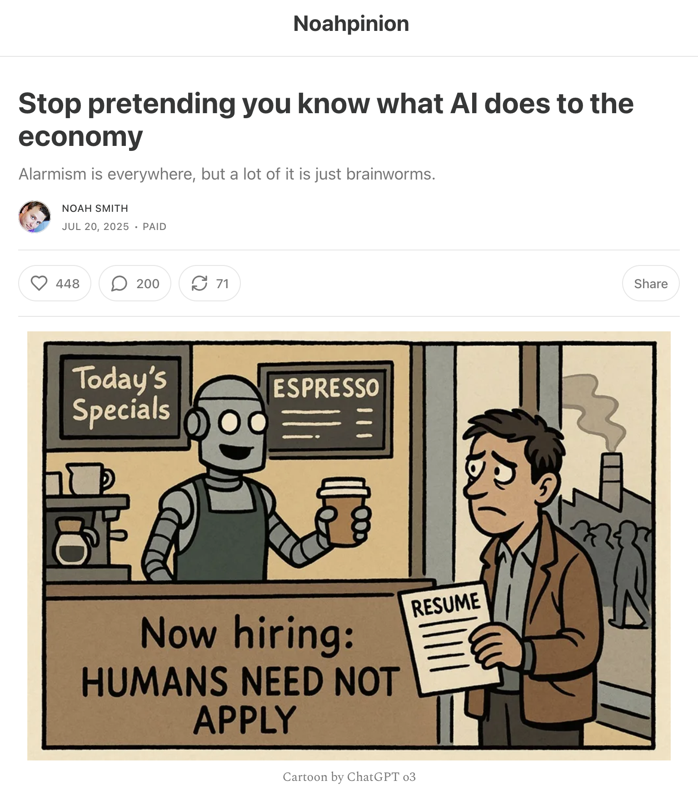{width="60%"}](#){data-modal-type="image" data-modal-url="figures/dont-know.png"}

Source: [Noah Smith](https://www.noahpinion.blog/p/stop-pretending-you-know-what-ai)

:::{style="background: rgba(45, 69, 99, 0.1); padding: 15px; border-radius: 10px; font-size: 18px; margin-top: 15px;"}
**The honest answer**: Nobody knows. Anyone who claims certainty is [selling something]{.alert}. The range of possible outcomes is very wide.
:::
:::
:::
:::
:::

## Discussion: your predictions 🤔

:::{style="margin-top: 30px; font-size: 22px;"}
:::{.columns}
:::{.column width=50%}
**Quick exercise (2 minutes):**

Think about a job you might want after graduation.

1. List 5-7 main tasks in that job
2. For each task: Could AI do this?
   - Now?
   - In 5 years?
   - In 10 years?
3. What tasks would remain human?
4. How might the job change rather than disappear?
:::

:::{.column width=50%}
:::{.fragment}
**Share with a neighbour:**

- What job did you pick?
- Which tasks seemed most automatable?
- Which seemed most human?
- Did this make you more or less worried?

:::{style="background: rgba(45, 69, 99, 0.1); padding: 15px; border-radius: 10px; font-size: 18px; margin-top: 15px;"}
The goal isn't prediction (which is impossible) but [analytical thinking]{.alert} about how AI intersects with specific work.
:::
:::
:::
:::
:::

# What does this mean for you? 🎓 {background-color="#2d4563"}

## Skills that may remain valuable

:::{style="margin-top: 30px; font-size: 21px;"}
:::{.columns}
:::{.column width=55%}
**Human-centric skills:**

- [Building relationships]{.alert} and trust
- Emotional intelligence
- Cultural and contextual judgment

**Metacognitive skills:**

- Knowing when to use AI (and when not to)
- [Evaluating AI outputs]{.alert} critically
- Asking the right questions
- Integrating AI into workflows
- Understanding AI limitations

**Domain expertise:**

- [Judgment in novel situations]{.alert}
- Ethical reasoning and values
- Accountability and responsibility
:::

:::{.column width=45%}
:::{style="text-align: center;"}
[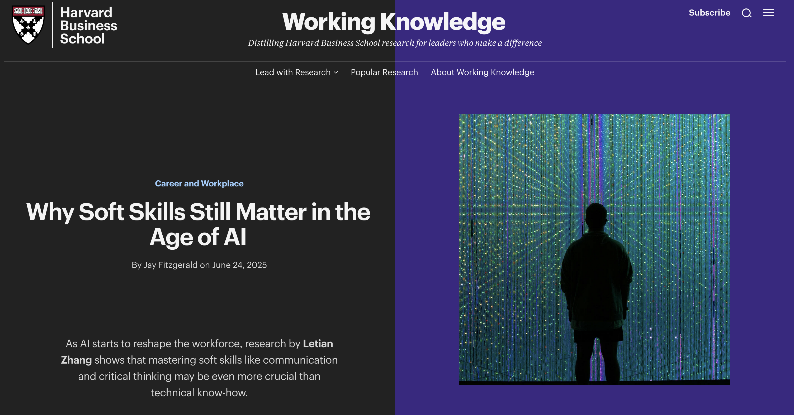{width="100%"}](#){data-modal-type="image" data-modal-url="figures/valuable-skills.png"}

Source: [Harvard Business School](https://www.library.hbs.edu/working-knowledge/why-soft-skills-still-matter-in-the-age-of-ai)

:::{style="background: rgba(45, 69, 99, 0.1); padding: 15px; border-radius: 10px; font-size: 18px; margin-top: 15px;"}
The irony: [The "soft skills"]{.alert} often dismissed as less rigorous may be the hardest to automate.
:::
:::
:::
:::
:::

## Adapting to an AI-influenced economy

:::{style="margin-top: 30px; font-size: 19px;"}
:::{.columns}
:::{.column width=55%}
**Be AI-literate:**

- Understand what AI can and can't do
- Know how to use tools effectively
- Recognise AI hype vs reality
- [This course is a start!]{.alert} 🤓

**Develop complementary skills:**

- If AI does X, learn to do Y (what AI enables)
- Focus on [orchestration]{.alert}, not just execution
- [Learning how to learn]{.alert} matters more than any specific skill
- Don't over-specialise too early

**Maintain perspective:**

- Your career will span 40+ years, AI in 2066 will be very different from AI today
- [Adaptability]{.alert} beats any specific prediction
:::

:::{.column width=45%}
:::{style="text-align: center;"}
[{width="100%"}](#){data-modal-type="image" data-modal-url="figures/feynman.jpg"}

:::{style="font-size: 18px; margin-top: 15px;"}
[Become someone who can keep learning]{.alert}!
:::
:::
:::
:::
:::

## The graduate market in 2026

:::{style="margin-top: 30px; font-size: 21px;"}
:::{.columns}
:::{.column width=55%}
**The tough reality:**

- Entry-level hiring is down
- Competition is intense
- Traditional paths are narrowing
- "Just get a degree" isn't enough

**What might help:**

- Demonstrated AI competence
- Evidence of [applied projects]{.alert}
- Internship and work experience
- Skills beyond your major
- [Network building]{.alert} (still human!)
- Willingness to take non-traditional paths
:::

:::{.column width=45%}
:::{style="background: rgba(45, 69, 99, 0.1); padding: 15px; border-radius: 10px; font-size: 20px;"}
**Uncomfortable truth:**

The job market that existed when you started university [may not be the same when you graduate]{.alert}. That's unsettling. It's also an opportunity for those who adapt.

The people who thrive will be those who can [work with AI]{.alert}.
:::

:::{style="text-align: center; margin-top: 15px;"}
[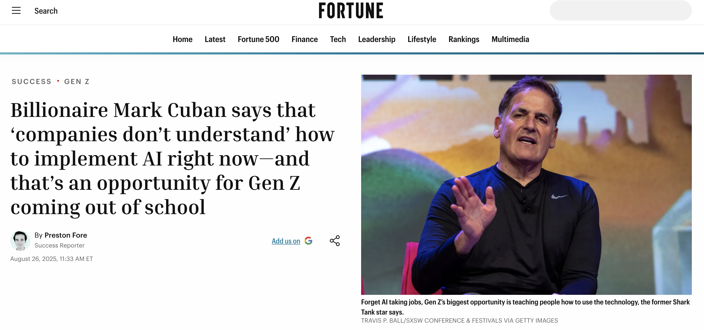{width="80%"}](#){data-modal-type="image" data-modal-url="figures/mark-cuban.png"}

Source: [Fortune](https://fortune.com/2025/08/26/billionaire-mark-cuban-gen-z-job-opportunity-teach-ai-implementation-companies-struggles-to-understand-future-of-work-former-shark-tank-star/)
:::
:::
:::
:::

## Class discussion: what would you advise? 💬

:::{style="margin-top: 30px; font-size: 22px;"}
:::{.columns}
:::{.column width=50%}
**Scenario:**

Your younger sibling is about to start university. They ask:

> "What should I study? I keep hearing AI will take all the jobs. Should I even bother with a degree? What career should I aim for?"

**In groups (5 minutes):**

- What would you tell them?
- What field would you recommend?
- What skills should they prioritise?
- How would you address their anxiety?
:::

:::{.column width=50%}
:::{.fragment}
**Some thoughts to consider:**

- The value of education beyond job training
- The danger of chasing "hot" fields
- The importance of genuine interest
- Building a foundation vs specific skills
- The limits of prediction

:::{style="background: rgba(45, 69, 99, 0.1); padding: 15px; border-radius: 10px; font-size: 18px; margin-top: 15px;"}
There's no right answer. But thinking through [how you'd advise someone else]{.alert} can clarify your own situation.
:::
:::
:::
:::
:::

# Summary and takeaways 📝 {background-color="#2d4563"}

## Main takeaways

:::{style="margin-top: 30px; font-size: 18px;"}
:::{.columns}
:::{.column width=55%}
`r fa('history')` **Historical context**

- Technology has always disrupted labour
- Net effect has been positive over time
- But this time may be different in speed and scope
- Cognitive tasks now exposed

`r fa('magnifying-glass-chart')` **Current evidence**

- Most AI use is not work-related
- Productivity gains real but task-specific
- Graduate job market is challenging
- Aggregate effects still unclear

`r fa('flag')` **Economic scenarios**

- Optimists: augmentation, new tasks
- Pessimists: displacement, polarisation
- Economists: uncertain, expect inequality
- Honest answer: nobody knows
:::

:::{.column width=45%}
`r fa('graduation-cap')` **For your career**

- Focus on complementary skills
- Be AI-literate, not AI-resistant
- Develop adaptability over specifics
- Build human skills that resist automation

`r fa('lightbulb')` **Key insights**

- Think [tasks not jobs]{.alert}
- [Transition pain]{.alert} matters even if outcome is good
- Policy choices will shape outcomes
- [Individual adaptation]{.alert} is necessary but not sufficient

:::{style="background: rgba(45, 69, 99, 0.1); padding: 15px; border-radius: 10px; margin-top: 15px; font-size: 18px;"}
"The best way to predict the future is to [help create it]{.alert}." – Peter Drucker
:::
:::
:::
:::

# ... and that's all for today! 🎉 {background-color="#2d4563"}