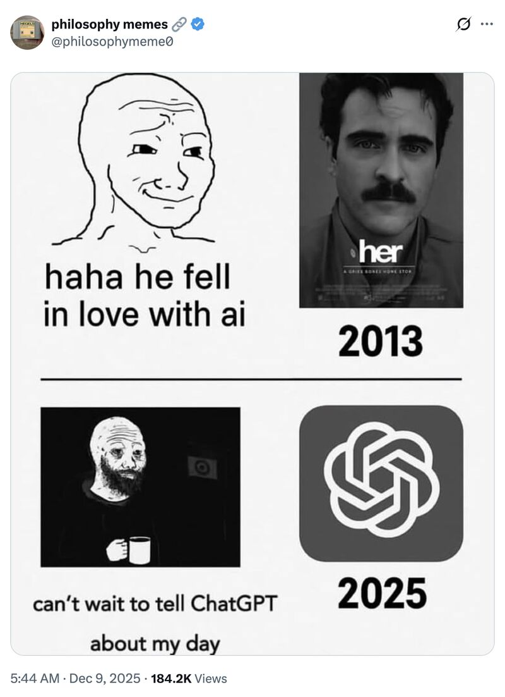
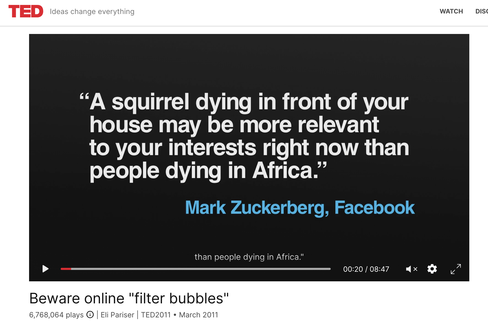
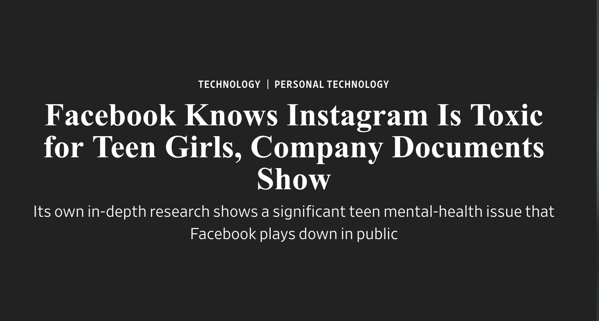
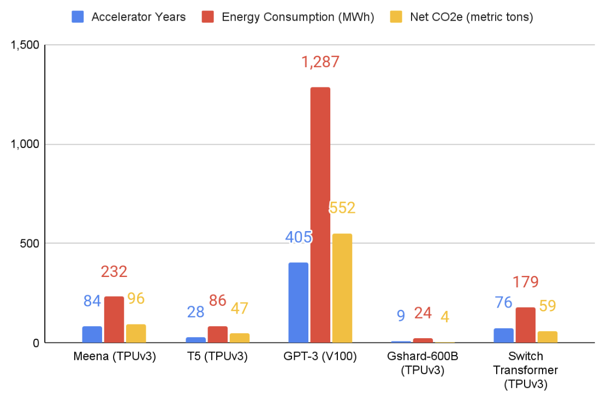
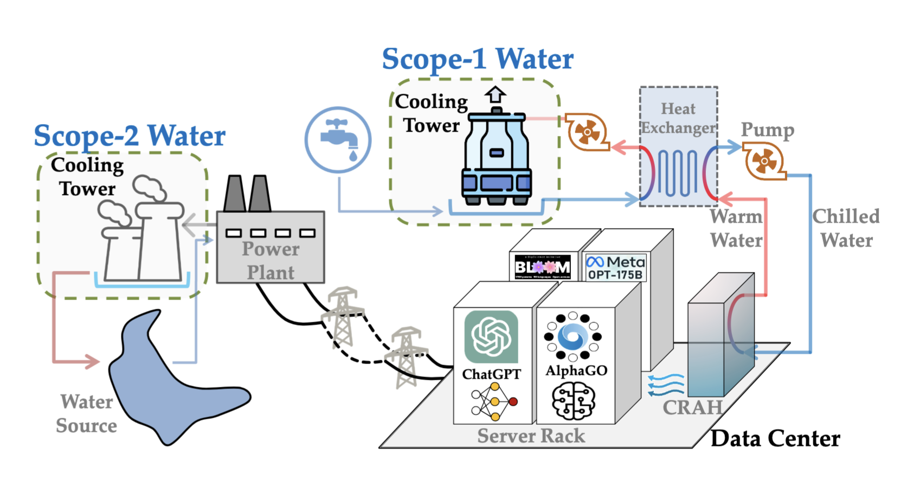
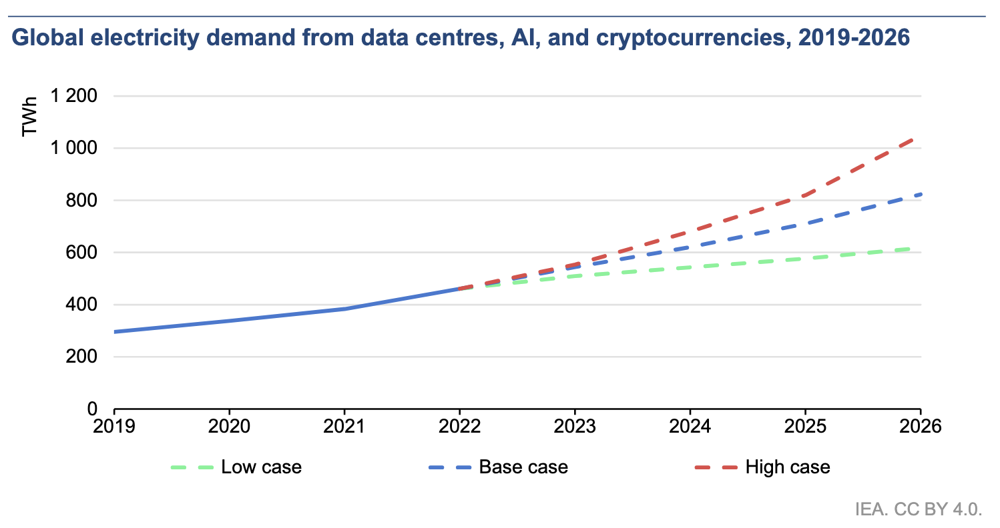
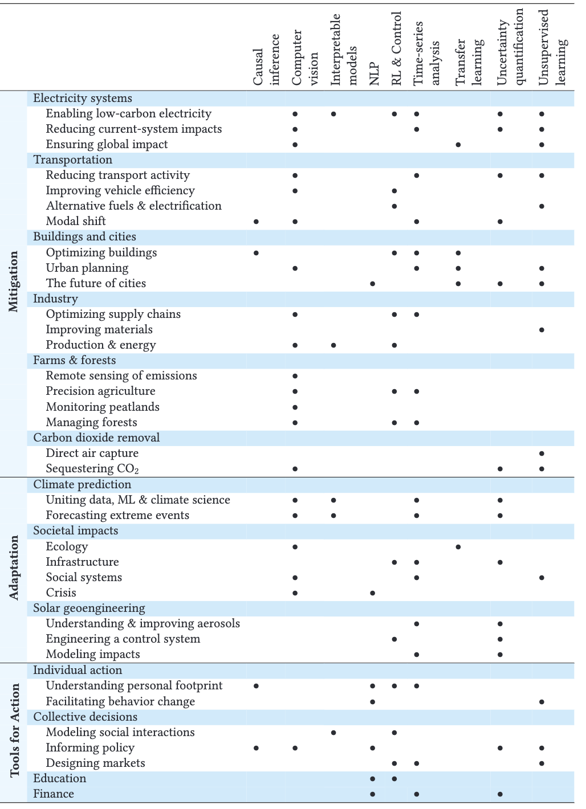
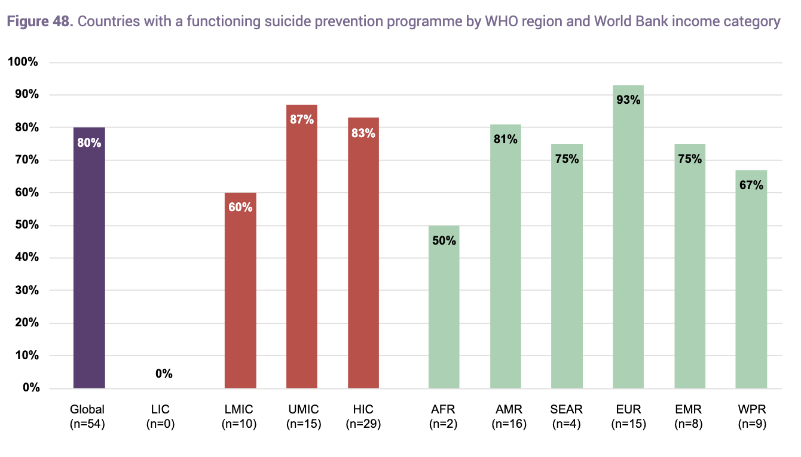
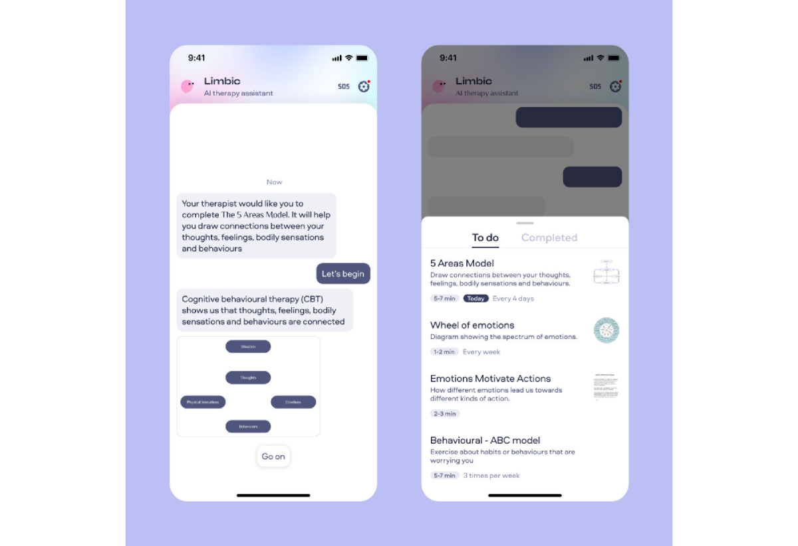

```{r setup, include=FALSE}
options(htmltools.dir.version = FALSE)
library(knitr)
opts_chunk$set(
  prompt = T,
  fig.align="center",
  dpi=300,
  cache=T,
  engine.opts = list(bash = "-l")
  )

knit_hooks$set(
  prompt = function(before, options, envir) {
    options(
      prompt = if (options$engine %in% c('sh','bash', 'zsh')) '$ ' else 'R> ',
      continue = if (options$engine %in% c('sh','bash', 'zsh')) '$ ' else '+ '
      )
})

options(repos = c(CRAN = "https://cran.rstudio.com/"))

if (!require("fontawesome", character.only = TRUE)) {
  install.packages("fontawesome", dependencies = TRUE)
  library(fontawesome, character.only = TRUE)
}
```

# Welcome back! 😊 {background-color="#2d4563"}

## Recap of last class

:::{style="margin-top: 20px; font-size: 26px;"}
:::{.columns}
:::{.column width=50%}
- Last time, we looked at [AI and the labour market]{.alert}
- Automation displaces *tasks*, not whole jobs
- The graduate job market is rough right now
- AI raises worker productivity but may compress wages for some
- Today: a different angle. What does AI do to [people]{.alert}, not jobs?
- Three themes: the [attention economy]{.alert}, the [environment]{.alert}, and [mental health]{.alert}
:::

:::{.column width=50%}
:::{style="text-align: center; margin-top: -30px;"}
[{width="100%"}](#){data-modal-type="image" data-modal-url="figures/wellbeing-intro.png"}

Source: [WHO (2025)](https://www.who.int/news-room/fact-sheets/detail/mental-health-strengthening-our-response)
:::
:::
:::
:::

## Lecture overview
### Today's agenda

:::{style="margin-top: 20px; font-size: 24px;"}

:::{.columns}
:::{.column width=50%}
**Part 1: The attention economy**

- "Your attention is the product"
- How recommendation algorithms work
- Filter bubbles: what the evidence says
- What companies are actually doing

**Part 2: AI and the environment**

- Energy and water costs
- Footprint in context
- AI as a climate tool
:::

:::{.column width=50%}
**Part 3: AI and mental health**

- The treatment gap
- Chatbots in therapy: what the evidence says
- Risks and hard limits
- Augmentation, not replacement

We will pause for discussion after each part

There are no right answers to the questions I put on screen. I'm curious what you think!
:::
:::
:::

## Meme of the day 😄

:::{style="text-align: center; margin-top: 30px;"}
[{width="55%"}](#){data-modal-type="image" data-modal-url="figures/meme-of-the-day.jpg"}

Source: [Twitter/X](https://x.com)
:::

# The attention economy 📱 {background-color="#2d4563"}

## What is the attention economy?

:::{style="margin-top: 30px; font-size: 22px;"}
:::{.columns}
:::{.column width=55%}
- Herbert Simon (1971): information-rich environments create [attention-poor]{.alert} ones
- You have limited hours and limited focus. That's the scarce resource
- The business model: capture attention, sell it to advertisers
- Google, Meta, TikTok. The service is free. [You are the product]{.alert}
- Tristan Harris (ex-Google design ethicist): called it "the race to the bottom of the brainstem"
- The goal is not to inform you but to [keep you on the screen]{.alert}
- Tim Wu's *The Attention Merchants* (2016) traces this logic from 19th-century newspapers to social media
:::

:::{.column width=45%}
:::{style="text-align: center;"}
[{width="100%"}](#){data-modal-type="image" data-modal-url="figures/attention-economy.png"}

Source: [Center for Humane Technology](https://www.humanetech.com/)
:::

:::{style="background: rgba(45, 69, 99, 0.1); padding: 15px; border-radius: 10px; font-size: 18px; margin-top: 15px;"}
The real question: does the [incentive structure produce good outcomes]{.alert} regardless of intent?
:::
:::
:::
:::

## How recommendation algorithms work

:::{style="margin-top: 30px; font-size: 22px;"}
:::{.columns}
:::{.column width=55%}
The core loop:

1. You watch, like, or share something
2. System creates an embedding of "you": a vector of your behaviour (remember lecture 06?)
3. Compares your vector to [what similar users watched next]{.alert}
4. Surfaces content predicted to maximise engagement
5. You watch → loop repeats, embedding updates

- [Engagement]{.alert} = watch time, clicks, shares. Not satisfaction, not learning, not feeling better
- TikTok's ForYou feed updates your profile within the first [3 seconds]{.alert} of a video
- YouTube autoplay: every video leads into another. By design
:::

:::{.column width=45%}
:::{style="text-align: center;"}
[{width="100%"}](#){data-modal-type="image" data-modal-url="figures/recommendation-loop.png"}

:::{style="font-size: 18px; margin-top: 15px;"}
The feedback loop runs continuously, shaping what you see next
:::
:::

:::{style="background: rgba(230, 57, 70, 0.1); padding: 15px; border-radius: 10px; font-size: 18px; margin-top: 15px;"}
These systems have [no concept of "healthy" consumption]{.alert}. They optimise the objective they are given, nothing more.
:::
:::
:::
:::

## Filter bubbles: real or exaggerated? 🫧

:::{style="margin-top: 30px; font-size: 21px;"}
:::{.columns}
:::{.column width=55%}
- Eli Pariser coined "filter bubble" in 2011
- The fear: algorithms seal you in a cocoon of confirming content
- Compelling idea. Two large experiments say: [probably overstated]{.alert}
- Nyhan et al. (2023, *Nature*): reduced like-minded content on Facebook during the 2020 US election, polarisation [barely changed]{.alert}
- Guess et al. (2023, *Science*): algorithmic vs. chronological feeds → [little difference in political attitudes]{.alert}
- So filter bubbles may not drive polarisation the way we feared
- But that's [one outcome]{.alert}. Effects on anxiety, body image, attention spans, and sleep are separate questions, with worse answers
:::

:::{.column width=45%}
:::{style="text-align: center;"}
[{width="100%"}](#){data-modal-type="image" data-modal-url="figures/filter-bubble.png"}

Source: [Eli Pariser (2011)](https://www.ted.com/talks/eli_pariser_beware_online_filter_bubbles)
:::

:::{style="background: rgba(45, 69, 99, 0.1); padding: 15px; border-radius: 10px; font-size: 18px; margin-top: 15px;"}
Good news on political polarisation. [Less good news]{.alert} on mental health and sleep. Don't confuse the two.
:::
:::
:::
:::

## Engagement vs wellbeing

:::{style="margin-top: 30px; font-size: 22px;"}
:::{.columns}
:::{.column width=55%}
- In 2023, YouTube admitted that [watch time alone is a poor proxy for satisfaction]{.alert}
- Started measuring "likes per impression" instead. Took over a decade
- The "outrage drives clicks" problem: content that makes you angry, anxious, or fearful [gets shared more and watched longer]{.alert}
- The algorithm learns this. Surfaces more of it
- The Facebook Papers (2021, *WSJ*): internal research showed Instagram made [body image worse for teenage girls]{.alert}
- Facebook had the data, but kept the feature because fixing it would have cost engagement
- The problem is structural: company revenue and user wellbeing [point in opposite directions]{.alert}
:::

:::{.column width=45%}
:::{style="text-align: center;"}
[{width="100%"}](#){data-modal-type="image" data-modal-url="figures/engagement-wellbeing.png"}

Source: [Wall Street Journal](https://www.wsj.com/articles/facebook-knows-instagram-is-toxic-for-teen-girls-company-documents-show-11631620739)
:::

:::{style="background: rgba(230, 57, 70, 0.1); padding: 15px; border-radius: 10px; font-size: 18px; margin-top: 15px;"}
Companies have a legal duty to shareholders, not to user wellbeing. [The incentives are structurally misaligned]{.alert}.
:::
:::
:::
:::

## What companies are actually doing

:::{style="margin-top: 30px; font-size: 22px;"}
:::{.columns}
:::{.column width=55%}
| Platform | Change | Scope |
|----------|--------|-------|
| Instagram | "Recommended content" toggle | Opt-in |
| TikTok | 60-min daily limit for under-18 | Bypassable |
| YouTube | "Take a break" / "Bedtime" reminders | Opt-in |
| Meta | Teen Accounts with safer defaults | Under-18 |
| Snapchat | No algorithmic Discover for teens | Under-18 |

- The sceptical read: most are opt-in, or reach a minority of users
- The core advertising model? Unchanged
- Also handy to point at when regulators come knocking
- US Surgeon General (2023): called for [warning labels]{.alert} on social media for under-18s
- Amy Orben (Cambridge): [transparency about *why* content is recommended]{.alert} changes behaviour more than usage caps
- Knowing you're being nudged turns out to matter
:::

:::{.column width=45%}
:::{style="text-align: center;"}
[{width="100%"}](#){data-modal-type="image" data-modal-url="figures/platform-changes.png"}

Source: [The Verge](https://www.theverge.com/)
:::

:::{style="background: rgba(45, 69, 99, 0.1); padding: 15px; border-radius: 10px; font-size: 18px; margin-top: 15px;"}
Genuine concern or good PR? Probably [a bit of both]{.alert}. The test is whether these survive when regulators look away.
:::
:::
:::
:::

## Activity: your own feed audit 🔍

:::{style="margin-top: 30px; font-size: 24px;"}
:::{.columns}
:::{.column width=50%}
**Quick experiment (2 minutes):**

1. Open TikTok, Instagram, or YouTube on your phone
2. Look at the first 5 items in your feed
3. How many did you [choose]{.alert} vs. the algorithm chose for you?
4. Do any of those recommendations feel... off?
:::

:::{.column width=50%}
**Then discuss with a neighbour:**

:::{style="background: rgba(45, 69, 99, 0.1); padding: 25px; border-radius: 10px;"}
- Think about the last hour you spent scrolling. Did [you]{.alert} decide to spend that time, or did the app decide for you?
- If platforms only showed content you explicitly searched for, would you use them more or less?
- Who benefits most from your screen time: you or the platform?
:::
:::
:::

:::{style="margin-top: 25px; font-size: 20px;"}
⏱️ 3 minutes. I'll ask what you found.
:::
:::

# AI and the environment 🌍 {background-color="#2d4563"}

## The energy cost of training AI

:::{style="margin-top: 30px; font-size: 21px;"}
:::{.columns}
:::{.column width=55%}
- Training a large model costs serious energy. Companies rarely disclose the numbers
- Patterson et al. (2021): training GPT-3 produced ~[502 tonnes of CO₂]{.alert} (see table below)
- GPT-4? Nobody knows. Estimates range from 5x to 50x GPT-3
- But [training is a one-off cost]{.alert}
- Running billions of queries (inference) is ongoing, and at scale it probably [dwarfs training]{.alert}
- Microsoft's carbon emissions rose 29% between 2020 and 2023, partly driven by AI
- Google's 2024 Environmental Report: emissions up [48% since 2019]{.alert}, largely from data centres

| Activity | CO₂ (approx.) |
|----------|---------------|
| One transatlantic flight | ~1.5 tonnes |
| Average car, one year | ~4.6 tonnes |
| Average US home, one year | ~7.5 tonnes |
| GPT-3 training run | ~502 tonnes |
:::

:::{.column width=45%}
:::{style="text-align: center;"}
[{width="100%"}](#){data-modal-type="image" data-modal-url="figures/ai-energy-cost.png"}

Source: [Patterson et al. (2021)](https://arxiv.org/abs/2104.10350)
:::

:::{style="background: rgba(230, 57, 70, 0.1); padding: 15px; border-radius: 10px; font-size: 18px; margin-top: 15px;"}
Training is a [one-off]{.alert}. Inference (billions of queries, every day) is the number that grows with adoption.
:::
:::
:::
:::

## Water, hardware, and hidden costs

:::{style="margin-top: 30px; font-size: 22px;"}
:::{.columns}
:::{.column width=55%}
- Energy gets the headlines. Water gets ignored
- Li et al. (2023), "Making AI Less Thirsty": training GPT-3 used ~[700,000 litres of freshwater]{.alert} for cooling
- A typical ChatGPT conversation: about 500ml, roughly a bottle of water
- Data centres get built where land and electricity are cheap, often in [water-stressed regions]{.alert}: Phoenix, Las Vegas, northern Chile
- GPUs last 3-5 years. Manufacturing needs lithium, cobalt, and rare earth metals, each with its own environmental cost
- None of this shows up in the headline CO₂ figures
:::

:::{.column width=45%}
:::{style="text-align: center;"}
[{width="100%"}](#){data-modal-type="image" data-modal-url="figures/datacenter-water.png"}

Source: [Li et al. (2023)](https://arxiv.org/abs/2304.03271)
:::

:::{style="background: rgba(45, 69, 99, 0.1); padding: 15px; border-radius: 10px; font-size: 18px; margin-top: 15px;"}
Mining, manufacturing, cooling, disposal: the full supply chain is [almost never counted]{.alert} in the numbers you read.
:::
:::
:::
:::

## The footprint in context

:::{style="margin-top: 30px; font-size: 22px;"}
:::{.columns}
:::{.column width=55%}
Current estimates (IEA, 2024):

| Sector | Share |
|--------|-------|
| Aviation | ~2.5% of global CO₂ |
| All data centres | ~1–1.5% of electricity |
| AI specifically | ~0.5–1% of electricity |
| Global internet | ~3–4% |

- Right now, AI's direct climate footprint is [real but not huge]{.alert} compared to aviation or steel
- The worry is [growth rate]{.alert}: AI electricity use grew ~60% year-on-year between 2022–2024
- Some projections: AI could use as much electricity as France by 2030
- The Jevons paradox: more efficient models → more usage → efficiency gains get cancelled out
- GPT-4 is far more efficient per query than GPT-3. But there are [vastly more queries]{.alert}
:::

:::{.column width=45%}
:::{style="text-align: center;"}
[{width="100%"}](#){data-modal-type="image" data-modal-url="figures/ai-footprint-context.png"}

Source: [IEA (2024)](https://www.iea.org/reports/electricity-2024)
:::

:::{style="background: rgba(45, 69, 99, 0.1); padding: 15px; border-radius: 10px; font-size: 18px; margin-top: 15px;"}
[Small today, growing fast]{.alert}. In 10 years, this picture may look very different.
:::
:::
:::
:::

## AI as a climate tool

:::{style="margin-top: 30px; font-size: 21px;"}
:::{.columns}
:::{.column width=55%}
The same technology that burns energy may also help cut emissions:

- **GraphCast** (DeepMind, 2023): 10-day weather forecasts, faster and more accurate than traditional models. Helps manage renewable grids
- **Grid optimisation**: AI predicts electricity demand, balances wind and solar in real time
- **Wildfire prediction**: better detection and spread modelling
- **Data centre cooling**: DeepMind's RL system cut cooling energy by [40%]{.alert}
- **AlphaFold**: protein structure prediction, opening paths in climate biotech

Rolnick et al. (2022, *ACM Computing Surveys*) identified 70+ high-potential ML applications for climate change

- But: these are [potential benefits, not guaranteed ones]{.alert}
- Many need serious compute to develop
- The teams building high-energy AI and the teams working on climate AI are mostly [different people at different companies]{.alert}
:::

:::{.column width=45%}
:::{style="text-align: center;"}
[{width="100%"}](#){data-modal-type="image" data-modal-url="figures/climate-ai.png"}

Source: [Rolnick et al. (2022)](https://dl.acm.org/doi/10.1145/3485128)
:::

:::{style="background: rgba(45, 69, 99, 0.1); padding: 15px; border-radius: 10px; font-size: 18px; margin-top: 15px;"}
Net impact? [Unclear]{.alert}. The evidence simply isn't there yet.
:::
:::
:::
:::

## Questions to think about 🤔

:::{style="margin-top: 50px; font-size: 26px;"}

:::{style="background: rgba(45, 69, 99, 0.1); padding: 25px; border-radius: 10px;"}
**You used AI today (probably). A single ChatGPT conversation uses about 500ml of water. Should that bother you? Does it?**

**AI companies say their tools will help solve climate change. Their data centres are accelerating it right now. How do you weigh a future promise against a present cost?**

**Is asking individuals to "use AI less" a distraction from the companies building the infrastructure?**
:::

:::{style="margin-top: 25px; font-size: 20px;"}
⏱️ A few minutes. I'll come back to this.
:::
:::

# AI and mental health 🧠 {background-color="#2d4563"}

## The treatment gap

:::{style="margin-top: 30px; font-size: 22px;"}
:::{.columns}
:::{.column width=55%}
- WHO estimate: [75% of people]{.alert} with mental health conditions in low- and middle-income countries receive *no treatment at all*
- Even in wealthy countries:
  - Average US wait for a first psychiatric appointment: [25 days]{.alert} nationally, 30+ weeks in rural areas
  - A therapy session costs $150–250 out of pocket
  - ~1 psychiatrist per 100,000 people in low-income countries
  - Stigma stops many from seeking help where care does exist
- This is the context for AI mental health tools
- [If the alternative is literally nothing]{.alert}, the calculation looks different than if you're imagining replacing well-funded human care
:::

:::{.column width=45%}
:::{style="text-align: center;"}
[{width="100%"}](#){data-modal-type="image" data-modal-url="figures/mental-health-gap.png"}

Source: [WHO Mental Health Atlas (2020)](https://www.who.int/publications/i/item/9789240036703)
:::

:::{style="background: rgba(45, 69, 99, 0.1); padding: 15px; border-radius: 10px; font-size: 18px; margin-top: 15px;"}
"Better than nothing" is a low bar. For millions of people, it's also [the only bar that exists]{.alert}.
:::
:::
:::
:::

## AI as a therapeutic tool

:::{style="margin-top: 30px; font-size: 21px;"}
:::{.columns}
:::{.column width=55%}
- **Woebot** (2017): first major CBT-based chatbot, 2M+ users. Follows clinical CBT protocols, not a free-form LLM
- **Wysa**: similar model, piloted by the UK NHS in several trusts
- **Replika**: not therapy, but an "AI companion." People form real emotional attachments
  - In 2023, the company changed its relationship features without warning
  - [Users reported grief and withdrawal symptoms]{.alert}
- Best recent evidence: Habicht et al. (2025, *JMIR*). Generative AI used alongside group therapy for real patients
- Improvements in clinical outcomes and patient engagement
- Key detail: AI was [supplementing human therapists]{.alert}, not replacing them
:::

:::{.column width=45%}
:::{style="text-align: center;"}
[{width="100%"}](#){data-modal-type="image" data-modal-url="figures/chatbot-companion.png"}

Source: [JMIR (2025)](https://www.jmir.org/2025/1/e60435)
:::

:::{style="background: rgba(45, 69, 99, 0.1); padding: 15px; border-radius: 10px; font-size: 18px; margin-top: 15px;"}
In the Habicht et al. study, AI augmented human therapists. That's [a very different claim]{.alert} from AI replacing them.
:::
:::
:::
:::

## What the research actually shows

:::{style="margin-top: 30px; font-size: 21px;"}
:::{.columns}
:::{.column width=55%}
- Opel and Breakspear (*Science*, 2026), two clinical neuroscientists, say AI "may reduce care inequities [when deployed responsibly]{.alert}"
- That "may" and "responsibly" are doing a lot of work
- What the evidence contains:
  - Small RCTs: short-term symptom relief for mild-to-moderate anxiety and depression
  - Very few studies run past 8–12 weeks. Long-term effects? Unknown
  - High dropout: many people stop using these apps quickly
  - [Publication bias]{.alert}: positive results get published; negative ones mostly don't
- Real signals that AI can help *some* people with *some* conditions, short-term. But the evidence base is [much thinner]{.alert} than the marketing suggests
:::

:::{.column width=45%}
:::{style="background: rgba(45, 69, 99, 0.1); padding: 15px; border-radius: 10px;"}
**Evidence by level:**

| Level | Status |
|-------|--------|
| Long-term RCTs | Almost none |
| Short-term RCTs | Mixed, small samples |
| Observational | Positive signals |
| User self-reports | Generally positive |
| Marketing claims | Very positive |

The gap between marketing and clinical evidence is [wide]{.alert}.
:::

:::{style="background: rgba(230, 57, 70, 0.1); padding: 12px; border-radius: 10px; font-size: 18px; margin-top: 15px;"}
Short-term relief is real. Long-term safety and efficacy? [We don't know yet]{.alert}.
:::
:::
:::
:::

## The risks

:::{style="margin-top: 30px; font-size: 21px;"}
:::{.columns}
:::{.column width=55%}
These are documented, not hypothetical:

- **Dependency.** When Replika changed features in 2023, users [reported grief]{.alert} comparable to losing a real relationship. What happens when an app you're attached to gets discontinued?
- **Data privacy.** Therapy touches the most private parts of someone's life. Chatbot data is rarely protected like clinical notes. Where does it go?
- **Harmful responses.** Moore et al. (2025): LLMs expressed [stigmatising attitudes]{.alert} toward mental health conditions and gave harmful crisis responses
- **No crisis escalation.** A chatbot cannot call an ambulance, contact a GP, or do anything in the physical world
- **Regulatory gap.** Most mental health chatbots are classified as apps, not medical devices. No clinical regulation in the US, UK, or most of the EU. The EU AI Act (2024) classifies some AI health tools as high-risk, but most chatbots still slip through
:::

:::{.column width=45%}
**But also consider:**

- Therapy with a human isn't fully private either: notes, supervision, insurance coding
- "Harmful responses from AI" vs. zero access to care for 75% of the world
- The strongest critique: AI tools may [give governments and employers an excuse]{.alert} to avoid funding real care

:::{style="background: rgba(230, 57, 70, 0.1); padding: 15px; border-radius: 10px; font-size: 18px; margin-top: 15px;"}
Being cautious about AI therapy doesn't mean defending the status quo. [The status quo is also harmful.]{.alert}
:::
:::
:::
:::

## What LLMs literally cannot do

:::{style="margin-top: 30px; font-size: 22px;"}
:::{.columns}
:::{.column width=55%}
**LLMs cannot:**

- Hold [persistent memory]{.alert} between sessions. Every conversation starts fresh, the opposite of how therapy works
- Verify what you tell them. A therapist builds context over months
- Contact emergency services, a GP, or anyone in the physical world
- Provide legally enforceable confidentiality
- Diagnose or prescribe medication
- Read body language, tone, or facial expression

**LLMs can:**

- Be available at 3am
- Be patient. Not judge. Not get tired
- Deliver structured info on anxiety, depression, coping strategies
- Scale to millions at near-zero marginal cost

These are [different capabilities]{.alert}, not better or worse. Whether what AI *can* do matches what people in distress actually *need* is the question worth asking.
:::

:::{.column width=45%}
:::{style="text-align: center;"}
[{width="100%"}](#){data-modal-type="image" data-modal-url="figures/llm-limits.png"}
:::

:::{style="background: rgba(45, 69, 99, 0.1); padding: 15px; border-radius: 10px; font-size: 18px; margin-top: 15px;"}
LLMs and therapists are different tools, not competitors. Comparing them directly means [comparing the wrong things]{.alert}.
:::
:::
:::
:::

## Questions to think about 🤔

:::{style="margin-top: 50px; font-size: 26px;"}

:::{style="background: rgba(45, 69, 99, 0.1); padding: 25px; border-radius: 10px;"}
**It's 3am, you can't sleep, you feel anxious. Would you talk to a chatbot? What would it need to do for you to actually trust it?**

**If AI therapy lets a government say "we've addressed mental health" without funding real services, is that a net positive or negative?**

**Would you feel comfortable knowing your most private thoughts are stored on a company's server, likely without clinical-grade protections?**
:::

:::{style="margin-top: 25px; font-size: 20px;"}
⏱️ A few minutes. I want to hear what you think on this one.
:::
:::

## Augmentation, not replacement

:::{style="margin-top: 30px; font-size: 22px;"}
:::{.columns}
:::{.column width=55%}
The most credible use cases right now:

- [First contact]{.alert}: AI handles initial triage, reduces stigma, connects people to professionals
- [Between-session support]{.alert}: coping strategies and mood tracking between weekly appointments (the Habicht et al. model)
- [Stepped care]{.alert}: AI for mild symptoms, human professionals for moderate-to-severe
- [Admin burden]{.alert}: AI writes session notes, handles scheduling, finds local services. Frees therapist time for actual care
- OpenAI updated ChatGPT in 2025: added safety messaging, crisis hotline signposting, trauma-informed language. An acknowledgement that people [already use the product this way]{.alert}
- [Who decides what "responsible" looks like?]{.alert} Clinical psychologists train 7-10 years working with distressed people. App developers mostly don't
:::

:::{.column width=45%}
:::{style="background: rgba(45, 69, 99, 0.1); padding: 15px; border-radius: 10px;"}
**The hybrid care model:**

```text
Mild symptoms
  → AI triage + self-help tools

Moderate symptoms
  → AI support +
    case management referral

Severe symptoms
  → Human professional care,
    AI for admin support only
```
:::

:::{style="background: rgba(230, 57, 70, 0.1); padding: 12px; border-radius: 10px; font-size: 18px; margin-top: 15px;"}
The technology is moving faster than the evidence, the regulation, and the training of professionals who need to understand it. [That gap is the problem]{.alert}.
:::
:::
:::
:::

# Summary 📚 {background-color="#2d4563"}

## Main takeaways

:::{style="margin-top: 30px; font-size: 28px;"}

- `r fa('mobile-alt')` [Attention economy]{.alert}: recommendation systems optimise engagement, not wellbeing. Filter bubble fears are overstated; mental health effects are not

- `r fa('leaf')` [Environment]{.alert}: training costs are real; inference at scale matters more. AI might cut emissions elsewhere, but net impact is unclear

- `r fa('brain')` [Mental health]{.alert}: the treatment gap is massive. AI shows short-term promise but limited long-term evidence. Augmentation over replacement

- `r fa('exclamation-circle')` [Across all three]{.alert}: incentive structures matter more than intentions. The financial model rarely rewards user wellbeing

- `r fa('question-circle')` [No tidy answers]{.alert}: you'll make decisions about these systems throughout your careers. Informed uncertainty beats confident ignorance

:::

## Further reading

:::{style="margin-top: 30px; font-size: 22px;"}
:::{.columns}
:::{.column width=50%}
**Attention economy:**

- Wu, T. (2016). *The Attention Merchants.* Knopf
- Nyhan, B. et al. (2023). [Like-minded sources on Facebook are prevalent but not polarizing.](https://www.nature.com/articles/s41586-023-06297-w) *Nature*
- Guess, A. et al. (2023). [How do social media feed algorithms affect attitudes and behavior in an election campaign?](https://www.science.org/doi/10.1126/science.abp9364) *Science*

**Environment:**

- Patterson, D. et al. (2021). [Carbon Emissions and Large Neural Network Training.](https://arxiv.org/abs/2104.10350) arXiv
- Li, P. et al. (2023). [Making AI Less Thirsty.](https://arxiv.org/abs/2304.03271) arXiv
- IEA (2024). [Electricity 2024.](https://www.iea.org/reports/electricity-2024) International Energy Agency
:::

:::{.column width=50%}
**Mental health:**

- Habicht, J. et al. (2025). [Closing the accessibility gap to mental health treatment with generative AI.](https://www.jmir.org/2025/1/e60435) *JMIR*
- Opel, N. & Breakspear, M. (2026). Harnessing AI for global mental health. *Science*
- Moore, D. et al. (2025). Stigmatising attitudes in LLMs. Crisis response study

**General:**

- Rolnick, D. et al. (2022). [Tackling Climate Change with Machine Learning.](https://dl.acm.org/doi/10.1145/3485128) *ACM Computing Surveys*
- 🎬 [The Social Dilemma](https://www.thesocialdilemma.com/) (Netflix, 2020)
:::
:::
:::

# ...and that's all for today! 🎉 {background-color="#2d4563"}
