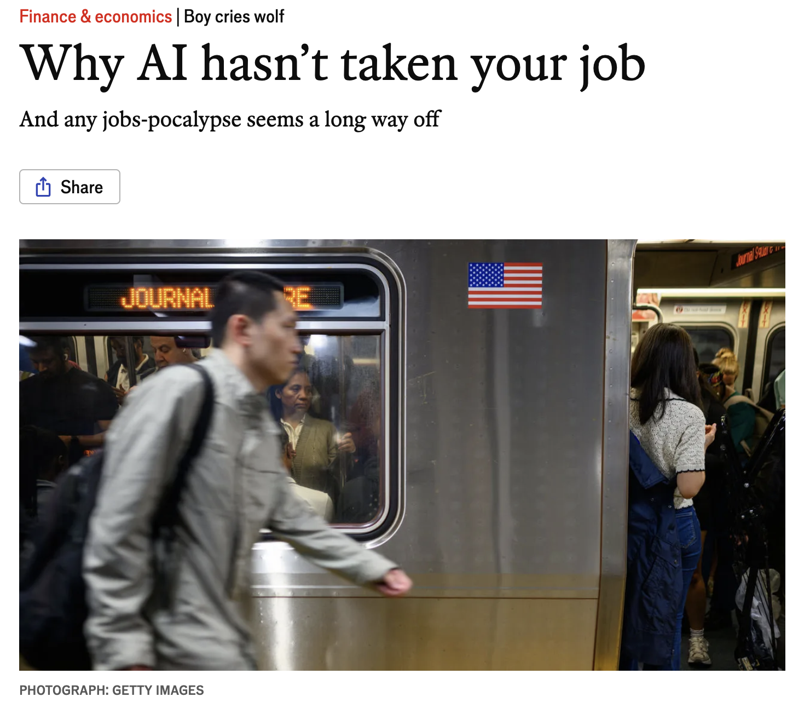
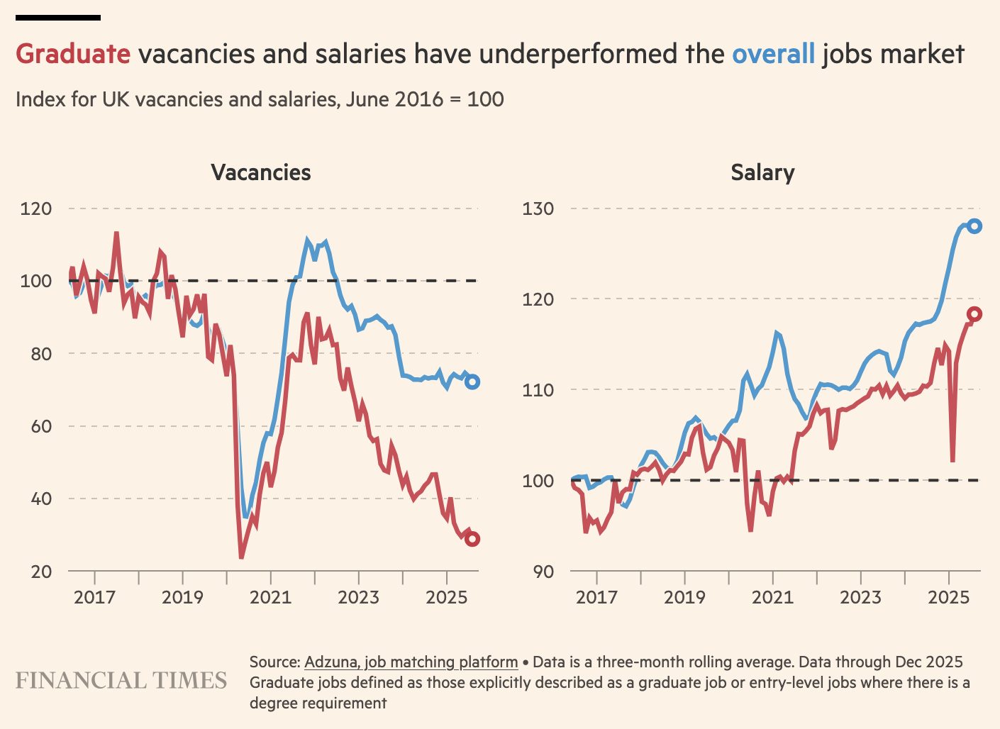
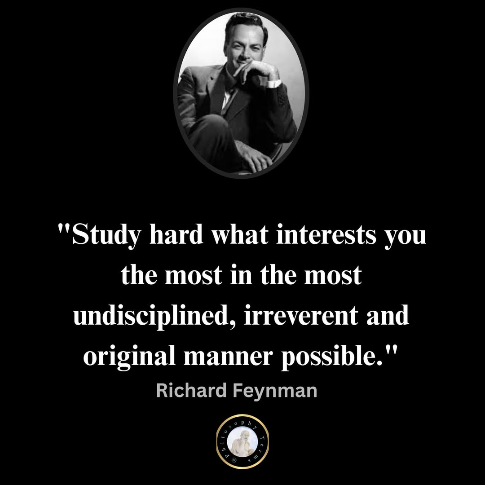

```{r setup, include=FALSE}
options(htmltools.dir.version = FALSE)
library(knitr)
opts_chunk$set(
  prompt = T,
  fig.align="center",
  dpi=300,
  cache=T,
  engine.opts = list(bash = "-l")
  )

knit_hooks$set(
  prompt = function(before, options, envir) {
    options(
      prompt = if (options$engine %in% c('sh','bash', 'zsh')) '$ ' else 'R> ',
      continue = if (options$engine %in% c('sh','bash', 'zsh')) '$ ' else '+ '
      )
})

options(repos = c(CRAN = "https://cran.rstudio.com/"))

if (!require("fontawesome", character.only = TRUE)) {
  install.packages("fontawesome", dependencies = TRUE)
  library(fontawesome, character.only = TRUE)
}
```

# Welcome back! 💼 {background-color="#2d4563"}

## Recap of last class

:::{style="margin-top: 20px; font-size: 24px;"}
:::{.columns}
:::{.column width=50%}
- We saw how [privacy and data protection]{.alert} are challenged by AI models
- AI enables collection at scale and [inference of sensitive data]{.alert}
- [General Data Protection Regulation]{.alert} (GDPR - EU): Comprehensive rights (access, erasure, portability)
- US: [Patchwork of sectoral laws]{.alert} (healthcare, finance) and state laws (CCPA in California)
- Technical approaches ([differential privacy, federated learning, synthetic data]{.alert}) help but have trade-offs
- [Collection is the core problem]{.alert}. Same data enables benefits and surveillance
- Today: [What does AI mean for jobs and the economy?]{.alert}
:::

:::{.column width=50%}
:::{style="text-align: center; margin-top: -30px;"}
[{width="100%"}](#){data-modal-type="image" data-modal-url="figures/automation-worker.jpg"}

Source: [X.com](https://x.com/johnkoetsier/status/1603234885791285248)
:::
:::
:::
:::

## Lecture overview
### What we will cover today

:::{style="margin-top: 20px; font-size: 24px;"}

:::{.columns}
:::{.column width=50%}
**Part 1: The automation question**

- Historical perspective on technology and jobs
- Why "this time might be different"
- Task-based framework for thinking about AI

**Part 2: Current evidence**

- What are people using AI for?
- Productivity effects
- Early job market signals
:::

:::{.column width=50%}
**Part 3: Economic scenarios**

- Optimistic views: augmentation and new tasks
- Pessimistic views: displacement and polarisation
- What economists actually think

**Part 4: What does this mean for you?**

- Skills that may remain valuable
- Adapting to an AI-influenced economy
- The graduate job market in 2026
:::
:::
:::

## Meme of the day 😄

:::{style="text-align: center; margin-top: 30px;"}
[{width="40%"}](#){data-modal-type="image" data-modal-url="figures/ai-jobs-meme.webp"}

Source: [r/ProgrammerHumor](https://www.reddit.com/r/ProgrammerHumor/comments/11wozfs/finally_thanks_ai_s/)
:::

## Funny AI news of the day 😂

:::{style="margin-top: 20px; font-size: 23px;"}
:::{.columns}
:::{.column width=55%}
- Anthropic shipped a debug file with [512K lines of source code]{.alert} inside a routine update ([Decrypt](https://decrypt.co/362917/anthropic-accidentally-leaked-claude-code-source-internet-keeping-forever))
- Spotted within minutes, posted on X
- [21 million views]{.alert} before the team woke up
- Code mirrored across GitHub; DMCA takedowns couldn't keep up
- [Sigrid Jin](https://github.com/instructkr) (most active Claude Code user in the world, [25B tokens/year per the WSJ](https://www.wsj.com/tech/ai/claude-code-cursor-codex-vibe-coding-52750531)) rewrote it all in Python before sunrise
- [His repo](https://github.com/instructkr/claw-code) hit [50K stars in 2 hours]{.alert} 🚀
- Anthropic had built "Undercover Mode" to stop Claude from leaking secrets. [Then leaked their own code]{.alert} 🤦🏻‍♂️
- I guess our jobs are safe for now? 😅
:::

:::{.column width=45%}
:::{style="text-align: center; margin-top: -30px;"}
[{width="75%"}](#){data-modal-type="image" data-modal-url="figures/anthropic-code-leak.png"}

Source: <https://x.com/Fried_rice/status/2038894956459290963>
:::
:::
:::
:::

# The automation question 🤖 {background-color="#2d4563"}

## This isn't the first time

:::{style="margin-top: 30px; font-size: 20px;"}
:::{.columns}
:::{.column width=55%}
**Historical fears of technological unemployment:**

| Era | Technology | Fear | Outcome |
|-----|------------|------|---------|
| 1810s | Power looms | [Luddites destroy machines](https://www.smithsonianmag.com/history/what-the-luddites-really-fought-against-264412/) | [Textile jobs changed but grew](https://www.history.com/articles/who-were-the-luddites) |
| 1930s | Mechanisation | [Keynes: "technological unemployment"](http://www.econ.yale.edu/smith/econ116a/keynes1.pdf) | [Post-war prosperity](https://www.project-syndicate.org/commentary/what-keynes-famous-1930-essay-got-right-and-wrong-by-kaushik-basu-2024-02) |
| 1960s | Mainframes | [JFK warns of job losses](https://www.jfklibrary.org/archives/other-resources/john-f-kennedy-speeches/grand-rapids-mi-19600607) | [Service sector expansion](https://conversableeconomist.com/2014/12/01/automation-and-job-loss-the-fears-of-1964/) |
| 1990s | Personal computers | [End of clerical work](https://www.technologyreview.com/2024/01/27/1087041/technological-unemployment-elon-musk-jobs-ai/) | [New jobs created](https://www.aeaweb.org/articles?id=10.1257/jep.33.2.3) |
| 2010s | Robots | [Manufacturing decline](https://news.mit.edu/2020/how-many-jobs-robots-replace-0504) | [Mixed results](https://www.nber.org/papers/w23285) |

**The pattern so far:**

- Technology destroys some jobs but creates others
- The net effect has been [positive]{.alert} over time
- The adjustment periods, though, are painful
:::

:::{.column width=45%}
:::{style="text-align: center; margin-top: 30px;"}
[{width="100%"}](#){data-modal-type="image" data-modal-url="figures/luddites.jpg"}

Source: [Current Affairs](https://www.currentaffairs.org/news/2021/06/the-luddites-were-right)

:::{style="background: rgba(45, 69, 99, 0.1); padding: 15px; border-radius: 10px; font-size: 18px; margin-top: 15px;"}
Every wave of automation sparked fears of mass unemployment. [So far, those fears haven't materialised]{.alert}. But past performance doesn't guarantee future results! 😅
:::
:::
:::
:::
:::

## Why this time might be different

:::{style="margin-top: 30px; font-size: 19px;"}
:::{.columns}
:::{.column width=55%}
**Previous automation:**

- Targeted [physical tasks]{.alert}
- Humans retained cognitive advantage
- Automation was task-specific (a loom weaves cloth, a lathe cuts metal, an ATM dispenses cash)

**AI is different:**

- Targets [cognitive tasks]{.alert}, not just physical ones
- General-purpose: the same model writes essays, analyses data, and generates images
- Improving [very rapidly]{.alert}
- People used to say "computers can't do intellectual work" or "computers can't be creative". [Both claims look shaky now]{.alert}

**Counter-argument:**

- Similar claims made before
- We keep underestimating human adaptability
- New tasks we can't imagine will emerge
:::

:::{.column width=45%}
:::{style="text-align: center;"}
[{width="100%"}](#){data-modal-type="image" data-modal-url="figures/automation-waves.jpg"}

Source: [Edelson Institute](https://www.visualcapitalist.com/the-history-of-innovation-cycles/)

:::{style="font-size: 18px; margin-top: 15px;"}
AI will change work. Everyone agrees on that much. The real unknowns are [how fast]{.alert} it happens and [who pays the price]{.alert} while the rest of us adjust.
:::
:::
:::
:::
:::

## Tasks vs jobs

:::{style="margin-top: 30px; font-size: 20px;"}
:::{.columns}
:::{.column width=55%}
**A more useful framework ([Acemoglu & Restrepo, 2019](https://www.aeaweb.org/articles?id=10.1257/jep.33.2.3); [HBR explainer](https://hbr.org/2024/05/ai-is-making-economists-rethink-the-story-of-automation)):**

- Don't think about [jobs]{.alert} being replaced
- Think about [tasks]{.alert} being automated
- Most jobs contain many tasks
- [AI might automate some but not all]{.alert}

**Example: Lawyer**

| Task | AI capability |
|------|---------------|
| Document review | [High]{.alert} |
| Legal research | High |
| Contract drafting | Medium-high |
| Client counselling | Medium |
| Court appearance | Low |
| Negotiation | Low |
| Judgment calls | Low |
:::

:::{.column width=45%}
**The effect:**

- Fewer lawyers needed per case, because AI handles the grunt work
- The role shifts toward [higher-value tasks]{.alert} (counselling clients, arguing in court)
- The lawyer doesn't disappear, but firms hire fewer of them. [What happens to the rest?]{.alert}

:::{style="text-align: center;"}
[{width="70%"}](#){data-modal-type="image" data-modal-url="figures/economist-ai-labour.png"}

Source: [The Economist](https://www.economist.com/finance-and-economics/2025/05/26/why-ai-hasnt-taken-your-job)
:::
:::
:::
:::

## Which tasks are most exposed?

:::{style="margin-top: 30px; font-size: 20px;"}
:::{.columns}
:::{.column width=55%}
**High exposure to AI:**

- Content generation (text, code, images)
- Data analysis and pattern recognition
- Translation and summarisation
- Customer service (text-based)

**Lower exposure (for now):**

- Physical work in unpredictable environments (construction, plumbing)
- Jobs where you need to be there in person (nursing, firefighting)
- Real-time judgment in new situations (emergency medicine, crisis management)
- Work built on deep personal relationships (therapy, social work)
:::

:::{.column width=45%}
**Exposure by occupation:** (AI exposure rises with wages, but there are exceptions)

| Occupation | Exposure |
|------------|----------|
| Telemarketers | Very high |
| Accountants | High |
| Paralegals | High |
| Software developers | Medium-high |
| Teachers | Medium |
| Nurses | Medium-low |
| Electricians | Low |
| Plumbers | Low |

Sources: [Frey & Osborne (2017)](https://www.oxfordmartin.ox.ac.uk/publications/the-future-of-employment); [Eloundou et al. (2023)](https://arxiv.org/abs/2303.10130); [IMF (2024)](https://www.imf.org/en/blogs/articles/2024/01/14/ai-will-transform-the-global-economy-lets-make-sure-it-benefits-humanity)
:::
:::
:::

# Current evidence 📊 {background-color="#2d4563"}

## What are people using AI for?

:::{style="margin-top: 30px; font-size: 20px;"}
:::{.columns}
:::{.column width=55%}
**[OpenAI's research on ChatGPT use (2025)](https://www.nber.org/system/files/working_papers/w34255/w34255.pdf):**

| Category | Jul 2024 | Jun 2025 |
|----------|----------|----------|
| Practical Guidance | ~29% | ~29% |
| Writing | ~36% | ~24% |
| Seeking Information | ~14% | ~24% |
| Technical Help | ~12% | ~5% |
| Multimedia | ~2% | ~7% |

**Among work-related messages only** (Jun 2025): Writing dominates at ~40%, Practical Guidance ~24%, Technical Help ~10%.

**What this tells us:**

- Only about [27% of use is work-related]{.alert}, 73% is personal
- Writing's share fell as people found other uses
- Technical help moved to coding tools (Copilot, Codex) outside ChatGPT
:::

:::{.column width=45%}
:::{style="text-align: center;"}
[{width="100%"}](#){data-modal-type="image" data-modal-url="figures/how-people-use-chatgpt.png"}

Source: [OpenAI (2025)](https://openai.com/index/how-people-are-using-chatgpt/)
:::
:::
:::
:::

## Productivity effects: early evidence

:::{style="margin-top: 30px; font-size: 20px;"}
:::{.columns}
:::{.column width=55%}
**Studies finding positive effects:**

- **Customer service [(Brynjolfsson et al., 2025)](https://academic.oup.com/qje/article/140/2/889/7990658)**: 14% productivity increase, biggest gains for [novice workers]{.alert}
- **Programmers [(GitHub, 2022)](https://github.blog/news-insights/research/research-quantifying-github-copilots-impact-on-developer-productivity-and-happiness/)**: 55% faster task completion with Copilot
- **Consultants [(BCG study, 2023)](https://www.bcg.com/publications/2023/how-people-create-and-destroy-value-with-gen-ai)**: 40% better performance on applicable tasks
- **Writers [(Noy & Zhang, 2023)](https://www.science.org/doi/10.1126/science.adh2586)**: 40% faster, 18% better quality

**Important caveats:**

- Most studies are [short-term]{.alert}
- Often sponsored by AI companies
- Lab settings vs real work differ
- Long-term effects unclear
:::

:::{.column width=45%}
**The pattern emerging:**

- AI [compresses the skill distribution]{.alert}
- Novices improve more than experts
- Experts sometimes do worse with AI
- Benefits concentrated in [specific tasks]{.alert}

:::{style="text-align: center; margin-top: 15px;"}
<!-- Suggested image: Productivity gains chart -->
[{width="100%"}](#){data-modal-type="image" data-modal-url="figures/productivity-gains.png"}

Source: [Boston Consulting Group (2023)](https://www.bcg.com/publications/2023/how-people-create-and-destroy-value-with-gen-ai)
:::
:::
:::
:::

## The graduate job drought

:::{style="margin-top: 30px; font-size: 21px;"}
:::{.columns}
:::{.column width=55%}
**What the data shows (2024-2026):**

- [Entry-level job postings down]{.alert} significantly ([Rest of World](https://restofworld.org/2025/engineering-graduates-ai-job-losses/); [IEEE Spectrum](https://spectrum.ieee.org/ai-effect-entry-level-jobs))
- [Brynjolfsson et al. (2025)](https://digitaleconomy.stanford.edu/publication/canaries-in-the-coal-mine-six-facts-about-the-recent-employment-effects-of-artificial-intelligence/): [13% employment decline]{.alert} for workers aged 22-25 in AI-exposed jobs (mainly in tech, finance, consulting)

**[Financial Times reporting (2026)](https://www.ft.com/content/c89496b1-bc8d-425e-b86b-ec89402410e4):**

- Graduate hiring at lowest level in a decade
- Tech companies leading the pullback
- Law and consulting firms reducing trainee intakes

**The logic (from the employer's side):**

- Junior employees used to do the tasks AI now handles
- AI doesn't need healthcare, holidays, or mentoring
:::

:::{.column width=45%}
:::{style="text-align: center;"}
[{width="100%"}](#){data-modal-type="image" data-modal-url="figures/graduate-jobs.png"}

Source: [Financial Times (2026)](https://www.ft.com/content/c89496b1-bc8d-425e-b86b-ec89402410e4)

:::{style="background: rgba(230, 57, 70, 0.1); padding: 15px; border-radius: 10px; font-size: 18px; margin-top: 15px;"}
This matters for you personally: if companies replace junior roles with AI, [where do you get your first job?]{.alert}
:::
:::
:::
:::
:::

## But the aggregate numbers are confusing

:::{style="margin-top: 30px; font-size: 20px;"}
:::{.columns}
:::{.column width=55%}
**What we're not seeing (yet):**

- Mass unemployment
- Dramatic productivity surge
- Clear sectoral collapse

**What we are seeing:**

- [Slower hiring]{.alert} rather than mass firing
- Some sectors growing, others shrinking
- Geographic concentration of effects
- Rising inequality

**Why the disconnect?**

- Adoption takes time (most firms are still experimenting)
- Many tasks don't work well with current AI
- Regulations, contracts, and organisational inertia slow everything down
:::

:::{.column width=45%}
:::{style="text-align: center;"}
[{width="100%"}](#){data-modal-type="image" data-modal-url="figures/jobs-apocalypse.png"}

Source: [The Economist](https://www.economist.com/business/2025/12/14/job-apocalypse-not-yet-ai-is-creating-brand-new-occupations)
:::
:::
:::
:::

# Economic scenarios 🔮 {background-color="#2d4563"}

## The optimistic view

:::{style="margin-top: 30px; font-size: 19px;"}
:::{.columns}
:::{.column width=55%}
**Augmentation, not replacement:**

- AI makes workers [more productive]{.alert}
- One person can do what five did before
- But demand expands to absorb capacity
- Net effect: more output, same or more jobs

**New tasks emerge:**

- AI creates [new kinds of work]{.alert}
- Prompt engineering, AI training, oversight
- Jobs we can't imagine yet
- Like social media manager in 1990

**Historical pattern continues:**

- Technology has always created more jobs than it destroyed
- Higher productivity → higher incomes → more demand
- "Lump of labour fallacy": there isn't a fixed amount of work
:::

:::{.column width=45%}
:::{style="text-align: center;"}
[{width="60%"}](#){data-modal-type="image" data-modal-url="figures/optimistic-future.png"}
[{width="60%"}](#){data-modal-type="image" data-modal-url="figures/strainchart2verysmall.jpg"}

Source: [Michael R. Strain](https://nationalaffairs.com/publications/detail/the-case-for-ai-optimism)
:::
:::
:::
:::

## The pessimistic view

:::{style="margin-top: 30px; font-size: 21px;"}
:::{.columns}
:::{.column width=55%}
**Displacement dominates:**

- AI replaces workers [faster than new jobs emerge]{.alert}
- Transition period could be very long
- Many workers never recover
- Skills mismatch is severe

**Polarisation:**

- High-skill jobs get more valuable
- Low-skill service jobs persist (hard to automate)
- Middle gets [hollowed out]{.alert}
- Inequality increases dramatically

**Power dynamics:**

- Productivity gains go to [capital, not labour]{.alert}
- "Race to the bottom" for wages
:::

:::{.column width=45%}
:::{style="text-align: center;"}
[{width="100%"}](#){data-modal-type="image" data-modal-url="figures/pessimistic-future-02.png"}

Source: [Fortune](https://fortune.com/2025/09/06/godfather-of-ai-geoffrey-hinton-massive-unemployment-soaring-profits-capitalist-system/)

:::{style="background: rgba(230, 57, 70, 0.1); padding: 15px; border-radius: 10px; font-size: 18px; margin-top: 15px;"}
**Pessimist's argument**: "The horse population never recovered from the automobile. [What if humans are the horses?]{.alert}"
:::
:::
:::
:::
:::

## What economists actually think

:::{style="margin-top: 30px; font-size: 19px;"}
:::{.columns}
:::{.column width=55%}
**Survey results [(IGM Forum, 2024)](https://www.igmchicago.org/surveys/inequality-and-ai/):**

- Large majority: AI will [significantly change]{.alert} labour markets
- Wide uncertainty about direction
- Most expect [some job displacement]{.alert}, but not mass unemployment
- Strong agreement: [inequality likely to increase]{.alert}

**[Acemoglu (2025)](https://economics.mit.edu/sites/default/files/2024-04/The%20Simple%20Macroeconomics%20of%20AI.pdf) framework:**

- AI can [augment]{.alert} workers (make them more productive)
- Or [replace]{.alert} them (automate their tasks)
- Current AI is [biased toward replacement]{.alert}
- Policy could shift toward augmentation

**[Jones (2026)](https://web.stanford.edu/~chadj/AIandEconomicFuture.pdf) summary:**

- Historical precedent supports optimism
- But [speed and scope]{.alert} are unprecedented
- Transition will be [rough]{.alert} even if outcome is good
:::

:::{.column width=45%}
:::{style="text-align: center;"}
<!-- Suggested image: Economist survey or Acemoglu diagram -->
[{width="60%"}](#){data-modal-type="image" data-modal-url="figures/dont-know.png"}

Source: [Noah Smith](https://www.noahpinion.blog/p/stop-pretending-you-know-what-ai)

:::{style="background: rgba(45, 69, 99, 0.1); padding: 15px; border-radius: 10px; font-size: 18px; margin-top: 15px;"}
[Nobody knows.]{.alert} Anyone who claims certainty is [selling something]{.alert}. The range of possible outcomes is very wide.
:::
:::
:::
:::
:::

## Discussion: your predictions 🤔

:::{style="margin-top: 30px; font-size: 25px;"}
:::{.columns}
:::{.column width=50%}
**Quick exercise:**

Think about a job you might want after graduation.

1. List 3-4 main tasks in that job
2. For each task: Could AI do this?
   - Now?
   - In 5 years?
   - In 10 years?
3. What tasks would remain human?
4. How might the job change rather than disappear?
:::

:::{.column width=50%}
**Share with us!**

- What job did you pick?
- Which tasks seemed most automatable?
- Which seemed most human?
- Did this make you more or less worried?
:::
:::
:::

# What does this mean for you? 🎓 {background-color="#2d4563"}

## Skills that may remain valuable

:::{style="margin-top: 30px; font-size: 20px;"}
:::{.columns}
:::{.column width=55%}
**Human-centric skills ([Deming, 2017](https://academic.oup.com/qje/article-abstract/132/4/1593/3861633)):**

- [Building relationships]{.alert} and trust
- Emotional intelligence
- Cultural and contextual judgment

**Knowing how to work with AI ([WEF Future of Jobs Report, 2025](https://www.weforum.org/publications/the-future-of-jobs-report-2025/)):**

- Knowing when to use it and when not to
- [Evaluating AI outputs]{.alert} with a critical eye
- Asking the right questions (garbage in, garbage out)
- Recognising where AI falls short

**Domain expertise ([McKinsey, 2025](https://www.mckinsey.com/mgi/our-research/agents-robots-and-us-skill-partnerships-in-the-age-of-ai)):**

- [Judgment in novel situations]{.alert}
- Ethical reasoning and values
- Accountability and responsibility
:::

:::{.column width=45%}
:::{style="text-align: center;"}
[{width="100%"}](#){data-modal-type="image" data-modal-url="figures/valuable-skills.png"}

Source: [Harvard Business School](https://www.library.hbs.edu/working-knowledge/why-soft-skills-still-matter-in-the-age-of-ai)

:::{style="background: rgba(45, 69, 99, 0.1); padding: 15px; border-radius: 10px; font-size: 18px; margin-top: 15px;"}
The irony: ["soft skills"]{.alert}, the ones people used to dismiss as fluffy, may turn out to be the hardest to automate.
:::
:::
:::
:::
:::

## Adapting to an AI-influenced economy

:::{style="margin-top: 30px; font-size: 19px;"}
:::{.columns}
:::{.column width=55%}
**Be AI-literate:**

- Understand what AI can and can't do
- Know how to use tools effectively
- Recognise AI hype vs reality
- [This course is a start!]{.alert} 🤓

**Build skills that complement AI:**

- If AI does X, learn to do Y (what AI makes possible but can't do alone)
- Focus on [orchestration]{.alert}: directing, checking, and combining AI outputs
- [Learning how to learn]{.alert} matters more than any single skill
- Don't over-specialise too early

**Maintain perspective:**

- Your career will span 40+ years. AI in 2066 will be very different from AI today
- [Adaptability]{.alert} beats any specific prediction
:::

:::{.column width=45%}
:::{style="text-align: center;"}
[{width="100%"}](#){data-modal-type="image" data-modal-url="figures/feynman.jpg"}

:::{style="font-size: 18px; margin-top: 15px;"}
[Become someone who can keep learning]{.alert}!
:::
:::
:::
:::
:::

## The graduate market in 2026

:::{style="margin-top: 30px; font-size: 21px;"}
:::{.columns}
:::{.column width=55%}
**The tough reality:**

- Entry-level hiring is down
- Competition is intense
- Traditional paths are narrowing
- "Just get a degree" isn't enough

**What might help:**

- Show that you can actually use AI tools, not just talk about them
- Build [applied projects]{.alert} people can see (a portfolio beats a transcript)
- Get internship or work experience while you can
- Pick up skills outside your major
- [Build a network]{.alert} (still a human activity!)
- Be open to non-traditional paths
:::

:::{.column width=45%}
:::{style="background: rgba(45, 69, 99, 0.1); padding: 15px; border-radius: 10px; font-size: 20px;"}
The job market [shifted while you were in university]{.alert}. That is unsettling, and I won't pretend otherwise. Learning to [work with AI]{.alert} won't fix everything, but ignoring it is worse.
:::

:::{style="text-align: center; margin-top: 15px;"}
[{width="80%"}](#){data-modal-type="image" data-modal-url="figures/mark-cuban.png"}

Source: [Fortune](https://fortune.com/2025/08/26/billionaire-mark-cuban-gen-z-job-opportunity-teach-ai-implementation-companies-struggles-to-understand-future-of-work-former-shark-tank-star/)
:::
:::
:::
:::

## What would you advise? 💬

:::{style="margin-top: 30px; font-size: 24px;"}
:::{.columns}
:::{.column width=50%}
**Scenario:**

Your younger sibling is about to start university. They ask:

> "What should I study? I keep hearing AI will take all the jobs. Should I even bother with a degree? What career should I aim for?"

- What would you tell them?
- What field would you recommend?
- What skills should they prioritise?
- How would you address their anxiety?
:::

:::{.column width=50%}
**Some thoughts to consider:**

- The value of education beyond job training
- The danger of chasing "hot" fields
- The importance of genuine interest
- The limits of prediction
:::
:::
:::

# Summary and takeaways 📝 {background-color="#2d4563"}

## Main takeaways

:::{style="margin-top: 30px; font-size: 18px;"}
:::{.columns}
:::{.column width=55%}
`r fa('history')` **Historical context**

- Technology has always disrupted labour
- Net effect has been positive over time
- But this time may be different in speed and scope
- Cognitive tasks now exposed

`r fa('magnifying-glass-chart')` **Current evidence**

- Most AI use is not work-related
- Productivity gains real but task-specific
- Graduate job market is challenging
- Aggregate effects still unclear

`r fa('flag')` **Economic scenarios**

- Optimists: augmentation, new tasks
- Pessimists: displacement, polarisation
- Economists: uncertain, expect inequality
- Honest answer: nobody knows
:::

:::{.column width=45%}
`r fa('graduation-cap')` **For your career**

- Build skills that complement AI
- Be AI-literate, not AI-resistant
- Adaptability beats any specific bet on the future
- "Soft skills" may be the hardest to automate

`r fa('lightbulb')` **Key insights**

- Think [tasks not jobs]{.alert}
- [Transition pain]{.alert} matters even if outcome is good
- Policy choices will shape outcomes
- Learning AI tools helps, but [policy choices]{.alert} will matter more

:::{style="background: rgba(45, 69, 99, 0.1); padding: 15px; border-radius: 10px; margin-top: 15px; font-size: 18px;"}
Nobody predicted "social media manager" in 1990 or "prompt engineer" in 2020. The jobs of 2036 probably don't have names yet!
:::
:::
:::
:::

# ... and that's all for today! 🎉 {background-color="#2d4563"}