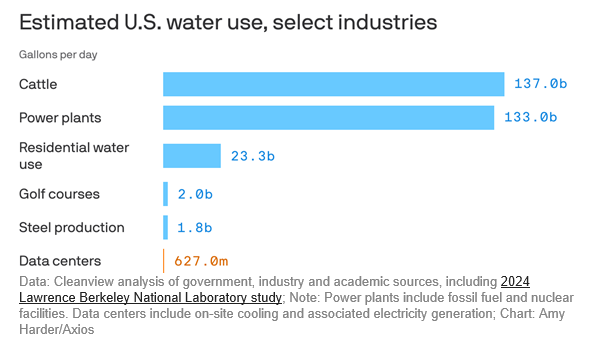

```{r setup, include=FALSE}
options(htmltools.dir.version = FALSE)
library(knitr)
opts_chunk$set(
  prompt = T,
  fig.align="center",
  dpi=300,
  cache=T,
  engine.opts = list(bash = "-l")
  )

knit_hooks$set(
  prompt = function(before, options, envir) {
    options(
      prompt = if (options$engine %in% c('sh','bash', 'zsh')) '$ ' else 'R> ',
      continue = if (options$engine %in% c('sh','bash', 'zsh')) '$ ' else '+ '
      )
})

options(repos = c(CRAN = "https://cran.rstudio.com/"))

if (!require("fontawesome", character.only = TRUE)) {
  install.packages("fontawesome", dependencies = TRUE)
  library(fontawesome, character.only = TRUE)
}
```

# Welcome back! {background-color="#1B3A6B"}

## Recap of last class

:::{style="margin-top: 40px; font-size: 26px;"}
:::{.columns}
:::{.column width=50%}
- [AI and the labour market]{.alert}
- AI targets [cognitive tasks]{.alert}, not just physical ones
- Automation displaces [tasks, not whole jobs]{.alert} (Acemoglu & Restrepo)
- AI raises productivity but may [compress wages]{.alert} and widen inequality
- The graduate job market is rough, and AI is part of the reason
- Today: [what does AI do to people]{.alert}, not jobs?
- Three themes: [attention economy]{.alert}, [mental health]{.alert}, [environment]{.alert}
:::

:::{.column width=50%}
:::{style="text-align: center; margin-top: -30px;"}
[{width="100%"}](#){data-modal-type="image" data-modal-url="figures/ai-interview.jpg"}

Source: [China Daily](https://www.chinadailyhk.com/hk/article/335124)
:::
:::
:::
:::

## Lecture overview
### Today's agenda

:::{style="margin-top: 20px; font-size: 24px;"}

:::{.columns}
:::{.column width=50%}
**Part 1: The attention economy**

- "Your attention is the product"
- How recommendation algorithms work
- Filter bubbles: what the evidence says
- What companies are actually doing

**Part 2: AI and mental health**

- The treatment gap
- Chatbots in therapy: what the evidence says
- Risks and hard limits
- Augmentation, not replacement
:::

:::{.column width=50%}
**Part 3: AI and the environment**

- Energy and water costs
- Footprint in context
- AI as a climate tool

We will pause for discussion after each part

There are no right answers to the questions I put on screen. I'm curious what you think!
:::
:::
:::

## (Sad) meme of the day

:::{style="text-align: center; margin-top: 30px;"}
[{width="40%"}](#){data-modal-type="image" data-modal-url="figures/meme-of-the-day.jpg"}
:::

# The attention economy {background-color="#1B3A6B"}

## What is the attention economy?

:::{style="margin-top: 30px; font-size: 24px;"}
:::{.columns}
:::{.column width=55%}
- [Herbert Simon (1971)](https://gwern.net/doc/design/1971-simon.pdf): information-rich environments create [attention-poor]{.alert} ones
- [Your hours and focus are the scarce resource]{.alert} ([Becker, 1965](https://academic.oup.com/ej/article-abstract/75/299/493/5250146))
- The business model: [capture attention and sell it to advertisers]{.alert}, as TV, radio and newspapers did before
- [Tristan Harris](https://www.cbsnews.com/news/what-is-brain-hacking-tech-insiders-on-why-you-should-care/), ex-Google design ethicist: "the race to the bottom of the brainstem"
- [Algorithms maximise engagement]{.alert}, not truth or wellbeing
- [Tim Wu, *The Attention Merchants* (2016)](https://www.goodreads.com/book/show/28503628-the-attention-merchants): the same logic from 19th-century newspapers to social media
:::

:::{.column width=45%}
:::{style="text-align: center; margin-top: -30px;"}
[{width="100%"}](#){data-modal-type="image" data-modal-url="figures/attention-economy.png"}

Source: [The Atlantic](https://www.theatlantic.com/technology/archive/2021/06/how-memes-become-money/619189/)
:::

:::{style="background: rgba(45, 69, 99, 0.1); padding: 15px; border-radius: 10px; font-size: 20px; margin-top: 15px;"}
Does the [incentive structure produce good outcomes]{.alert} regardless of intent?
:::
:::
:::
:::

## How recommendation algorithms work

:::{style="margin-top: 50px; font-size: 23px;"}
:::{.columns}
:::{.column width=55%}
1. You watch, like, or share something
2. The system builds an embedding of "you", a vector of your behaviour ([lecture 06](https://danilofreire.github.io/datasci101/lectures.html#module-2-language-and-perception))
3. It compares your vector to [what similar users watched next]{.alert}
4. It recommends what they watched
5. You watch → loop repeats, embedding updates

- [Engagement]{.alert} = watch time, clicks, shares
- TikTok's ForYou feed reportedly profiles you within the first [few seconds]{.alert} of a video ([WSJ, 2021](https://www.wsj.com/articles/tiktok-algorithm-video-investigation-11626877477))
- YouTube autoplay leads every video into another by design
:::

:::{.column width=45%}
:::{style="text-align: center; margin-top: -40px;"}
[{width="100%"}](#){data-modal-type="image" data-modal-url="figures/recommendation-loop.webp"}

Source: [Data Science Dojo](https://datasciencedojo.com/blog/social-media-recommendation-system/)

:::{style="font-size: 20px; margin-top: 10px;"}
Every swipe teaches the algorithm something about you
:::
:::

:::{style="background: rgba(230, 57, 70, 0.1); padding: 15px; border-radius: 10px; font-size: 20px; margin-top: 15px;"}
These systems have [no concept of "healthy" consumption]{.alert}. They optimise the objective they are given, nothing more
:::
:::
:::
:::

## Filter bubbles: real or exaggerated?

:::{style="margin-top: 30px; font-size: 23px;"}
:::{.columns}
:::{.column width=55%}
- [Eli Pariser](https://www.ted.com/talks/eli_pariser_beware_online_filter_bubbles) coined "filter bubble" in 2011: algorithms seal you in a cocoon of confirming content
- Two large experiments say the effect is [probably overstated]{.alert}
- [Nyhan et al. (2023, *Nature*)](https://www.nature.com/articles/s41586-023-06297-w): cutting like-minded Facebook content [barely changed]{.alert} polarisation
- [Guess et al. (2023, *Science*)](https://www.science.org/doi/10.1126/science.abp9364): algorithmic vs chronological feeds made [little difference]{.alert} to political attitudes
- Polarisation is [one outcome]{.alert}. Anxiety, body image, attention and sleep look worse
:::

:::{.column width=45%}
:::{style="text-align: center;"}
[{width="100%"}](#){data-modal-type="image" data-modal-url="figures/filter-bubble.png"}

Source: [Eli Pariser (2011)](https://www.ted.com/talks/eli_pariser_beware_online_filter_bubbles)
:::

:::{style="background: rgba(45, 69, 99, 0.1); padding: 15px; border-radius: 10px; font-size: 20px; margin-top: 15px;"}
Good news on political polarisation. [Less good news]{.alert} on mental health and sleep. Don't confuse the two
:::
:::
:::
:::

## Engagement vs wellbeing

:::{style="margin-top: 30px; font-size: 23px;"}
:::{.columns}
:::{.column width=55%}
- YouTube [moved](https://blog.youtube/inside-youtube/on-youtubes-recommendation-system/) off watch time as its sole metric, adding satisfaction surveys. It took over a decade
- "Outrage drives clicks" ([Brady et al., 2017, *PNAS*](https://www.pnas.org/doi/10.1073/pnas.1618923114)): angry content is [shared more and watched longer]{.alert}
- The algorithm learns this and surfaces more of it
- [Facebook's own research (2021, *WSJ*)](https://www.wsj.com/articles/facebook-knows-instagram-is-toxic-for-teen-girls-company-documents-show-11631620739): Instagram made [body image worse for teenage girls]{.alert}
- Facebook kept the feature. Fixing it would have cost engagement
- Revenue and user wellbeing [point in opposite directions]{.alert}
:::

:::{.column width=45%}
:::{style="text-align: center;"}
[{width="100%"}](#){data-modal-type="image" data-modal-url="figures/engagement-wellbeing.png"}

Source: [Wall Street Journal](https://www.wsj.com/articles/facebook-knows-instagram-is-toxic-for-teen-girls-company-documents-show-11631620739)
:::

:::{style="background: rgba(230, 57, 70, 0.1); padding: 15px; border-radius: 10px; font-size: 20px; margin-top: 15px;"}
Companies owe a legal duty to shareholders, not users. When engagement and wellbeing conflict, [engagement wins]{.alert}
:::
:::
:::
:::

## Teens and screens: what the data says

:::{style="margin-top: 30px; font-size: 22px;"}
:::{.columns}
:::{.column width=55%}
- Jonathan Haidt, [*The Anxious Generation*](https://www.anxiousgeneration.com/) (2024): smartphones and social media are [rewiring childhood]{.alert}
- [Orben & Przybylski (2019)](https://www.nature.com/articles/s41562-018-0506-1): screen time explains [at most 0.4%]{.alert} of the variance in adolescent wellbeing
- Haidt's evidence is mostly correlational: teen depression rose [around the same time]{.alert} as smartphone adoption
- [Candice Odgers (2024, *Nature*)](https://www.nature.com/articles/d41586-024-00902-2): the evidence does not support his causal story
- Other studies find the association [small and inconsistent]{.alert} ([1](https://academic.oup.com/jcmc/article/29/1/zmad055/7595758?login=false&guestAccessKey=), [2](https://jamanetwork.com/journals/jamanetworkopen/fullarticle/2834349), [3](https://mental.jmir.org/2022/4/e33450/))
- Individual experiences are real. The [population-level]{.alert} effect is small
:::

:::{.column width=45%}
:::{style="background: rgba(45, 69, 99, 0.1); padding: 15px; border-radius: 10px; margin-top: 15px;"}
**How large is the effect?**

| Factor | Association with wellbeing |
|--------|---------------------------|
| Screen time | ~0.4% of variance |
| Wearing glasses | ~3x screen time |
| Sleep quality | ~44x screen time |
| Family relationships | Much larger still |

Small effects still matter at population scale. They just don't explain the whole story
:::
:::
:::
:::

## What companies are actually doing

:::{style="margin-top: 30px; font-size: 22px;"}
:::{.columns}
:::{.column width=55%}
:::{style="text-align: center;"}

| Platform | Change | Scope |
|----------|--------|-------|
| Instagram | "Recommended content" toggle | Opt-in |
| TikTok | 60-min daily limit for under-18 | Bypassable |
| YouTube | "Take a break" / "Bedtime" reminders | Opt-in |
| Meta | Teen Accounts with safer defaults | Under-18 |
:::

:::{style="margin-top: 30px;"}
:::

- Most are opt-in or reach a minority of users. The ad model is unchanged
- Also handy to point at when regulators come knocking
- [US Surgeon General (2023)](https://pubmed.ncbi.nlm.nih.gov/37721985/): [advisory on social media and youth mental health]{.alert}, then [warning labels in 2024](https://www.cnn.com/2024/06/17/media/surgeon-general-social-media-apps-warning-label/)
- [Amy Orben (Cambridge)](https://www.orben.group/): [transparency about *why* content is recommended]{.alert} changes behaviour more than usage caps
- Knowing you're being nudged matters
:::

:::{.column width=45%}
:::{style="text-align: center;"}
[{width="100%"}](#){data-modal-type="image" data-modal-url="figures/platform-changes.png"}

Source: [The Verge](https://www.theverge.com/news/841036/facebook-redesign-instagram-photos-feed-algorithm)
:::

:::{style="background: rgba(45, 69, 99, 0.1); padding: 15px; border-radius: 10px; font-size: 20px; margin-top: 15px;"}
Genuine concern or good PR? Probably [a bit of both]{.alert}. The test is whether these survive when regulators look away
:::
:::
:::
:::

## China's experiment: opting out of the algorithm

:::{style="margin-top: 30px; font-size: 22px;"}
:::{.columns}
:::{.column width=55%}
- Since March 2022, Chinese users can [legally turn off recommendation algorithms]{.alert}
- The [Algorithmic Recommendation Management Provisions](https://www.chinalawtranslate.com/en/algorithms/) require every app to offer a non-personalised feed
- Douyin, Baidu, Taobao and WeChat added [one-tap opt-out]{.alert} buttons
- Users [appreciated the transparency](https://journals.sagepub.com/doi/10.1177/20594364231209354); long-term effects are still being studied
- The [EU Digital Services Act](https://dsa-observatory.eu/2024/11/22/the-regulation-of-recommender-systems-under-the-dsa-a-transition-from-default-to-multiple-and-dynamic-controls/) (Article 38) now requires a non-profiling feed too
- China mandates algorithmic transparency while keeping [state censorship]{.alert} of the content. Both are true at once
:::

:::{.column width=45%}
:::{style="background: rgba(45, 69, 99, 0.1); padding: 15px; border-radius: 10px;"}
**What the regulation requires:**

- Users must be told [they are being profiled]{.alert}
- One-tap opt-out of personalised recommendations
- Algorithms must not exploit addictive behaviours
- Platforms must label AI-generated content
- Special protections for minors
:::

:::{style="background: rgba(45, 69, 99, 0.1); padding: 15px; border-radius: 10px; font-size: 20px; margin-top: 15px;"}
A real experiment in what happens when users can [choose]{.alert} whether to be recommended to. Results still coming in
:::
:::
:::
:::

## Discussion: designing for wellbeing

:::{style="margin-top: 50px; font-size: 26px;"}

:::{style="background: rgba(45, 69, 99, 0.1); padding: 25px; border-radius: 10px;"}
**If you were designing a recommendation algorithm and your bonus depended on [user wellbeing]{.alert} instead of watch time, what would you change?**

- What metric would you optimise for? How would you even measure "wellbeing"?
- Would your platform still be profitable?
- Would users actually prefer it, or would they migrate to a competitor that gives them the dopamine hits?
:::
:::

# AI and mental healthcare {background-color="#1B3A6B"}

## The treatment gap

:::{style="margin-top: 30px; font-size: 22px;"}
:::{.columns}
:::{.column width=55%}
- WHO estimate: [75% of people]{.alert} with mental health conditions in low- and middle-income countries get *no treatment at all*
- Even in wealthy countries:
  - US wait for a first psychiatric appointment: [25 days]{.alert} nationally, [median 67 days](https://pubmed.ncbi.nlm.nih.gov/37290263/), worse in rural areas
  - A session costs [$150-250 out of pocket](https://www.simplepractice.com/blog/average-therapy-session-rate-by-state/)
  - [~0.1 psychiatrists per 100,000](https://www.who.int/data/gho/indicator-metadata-registry/imr-details/2954) in low-income countries
  - Stigma stops many from seeking the care that exists
- This is the context for AI mental health tools
- [If the alternative is nothing]{.alert}, the calculation differs from replacing well-funded human care
:::

:::{.column width=45%}
:::{style="text-align: center;"}
[{width="100%"}](#){data-modal-type="image" data-modal-url="figures/mental-health-gap.png"}

Source: [WHO Mental Health Atlas (2024)](https://www.who.int/publications/i/item/9789240114487)
:::

:::{style="background: rgba(45, 69, 99, 0.1); padding: 15px; border-radius: 10px; font-size: 20px; margin-top: 15px;"}
"Better than nothing" is a low bar. For millions, it's also [the only bar that exists]{.alert}
:::
:::
:::
:::

## AI as a therapeutic tool

:::{style="margin-top: 30px; font-size: 23px;"}
:::{.columns}
:::{.column width=55%}
- [**Woebot**](https://mental.jmir.org/2017/2/e19) (2017): first major CBT chatbot, 2M+ users. Follows clinical CBT protocols, not a free-form LLM
- [**Wysa**](https://www.wysa.com/nhs-talking-therapies): same model, piloted by the [UK NHS in 31 trusts](https://blogs.wysa.io/blog/company-news/nhs-tackles-mental-health-crisis-with-ai)
- [**Replika**](https://replika.com/): not therapy, an "AI companion". People form [real emotional attachments]{.alert} (risks shortly)
- Best recent evidence, [Habicht et al. (2025, *JMIR*)](https://www.jmir.org/2025/1/e60435): generative AI alongside group therapy for real patients
- Clinical outcomes and patient engagement both improved
- But AI was [supplementing human therapists]{.alert}, not replacing them
:::

:::{.column width=45%}
:::{style="text-align: center;"}
[{width="100%"}](#){data-modal-type="image" data-modal-url="figures/chatbot-companion.png"}

Source: [Habicht et al. (2025)](https://www.jmir.org/2025/1/e60435)
:::

:::{style="background: rgba(45, 69, 99, 0.1); padding: 15px; border-radius: 10px; font-size: 20px; margin-top: 15px;"}
There, AI augmented human therapists. That is [a very different claim]{.alert} from AI replacing them
:::
:::
:::
:::

## What the research shows

:::{style="margin-top: 30px; font-size: 23px;"}
:::{.columns}
:::{.column width=55%}
- [Opel and Breakspear (*Science*, 2026)](https://www.science.org/doi/10.1126/science.adz9193): AI "may reduce care inequities [when deployed responsibly]{.alert}"
- "May" and "responsibly" are doing a lot of work
- Small RCTs show short-term relief for mild-to-moderate anxiety and depression
- Very few studies run past 8-12 weeks, and dropout is high
- [Publication bias]{.alert}: positive results get published, negative ones mostly don't
- The evidence is [much thinner]{.alert} than the marketing
:::

:::{.column width=45%}
:::{style="background: rgba(45, 69, 99, 0.1); padding: 15px; border-radius: 10px; margin-top: 15px;"}
**Evidence by level:**

| Level | Status |
|-------|--------|
| Long-term RCTs | Almost none |
| Short-term RCTs | Mixed, small samples |
| Observational | Positive signals |
| User self-reports | Generally positive |
| Marketing claims | Very positive |

The gap between marketing and clinical evidence is [wide]{.alert}
:::

:::{style="background: rgba(230, 57, 70, 0.1); padding: 12px; border-radius: 10px; font-size: 20px; margin-top: 15px;"}
Short-term relief is real. Long-term safety and efficacy? [We don't know yet]{.alert}
:::
:::
:::
:::

## The risks

:::{style="margin-top: 30px; font-size: 22px;"}
:::{.columns}
:::{.column width=55%}
Documented, not hypothetical:

- **Dependency.** [Replika's 2023 feature change](https://www.vice.com/en/article/ai-companion-replika-erotic-roleplay-updates/) left users [reporting grief]{.alert} like a lost relationship
- **Data privacy.** Chatbot data is rarely protected like clinical notes
- **Harmful responses.** [Moore et al. (2025)](https://arxiv.org/abs/2504.18412): LLMs showed [stigmatising attitudes]{.alert} and gave harmful crisis responses
- **No crisis escalation.** A chatbot cannot call an ambulance
- **Regulatory gap.** Most count as apps, not medical devices, so no clinical regulation in the US, UK or most of the EU
:::

:::{.column width=45%}
**But also consider:**

- Human therapy isn't fully private either: notes, supervision, insurance coding
- Weigh harmful AI responses against [zero access to care]{.alert} for 75% of the world
- AI may [give governments and employers an excuse]{.alert} to avoid funding real care

:::{style="background: rgba(230, 57, 70, 0.1); padding: 15px; border-radius: 10px; font-size: 20px; margin-top: 15px;"}
Being cautious about AI therapy doesn't mean defending the status quo. [The status quo is also harmful]{.alert}
:::
:::
:::
:::

## What LLMs cannot do

:::{style="margin-top: 30px; font-size: 24px;"}
:::{.columns}
:::{.column width=50%}
**LLMs cannot:**

- Hold [reliable long-term memory]{.alert} between sessions. ChatGPT and Claude have memory features, but not clinical continuity
- Verify what you tell them. A therapist builds context over months
- Provide legally enforceable confidentiality
- Diagnose or prescribe medication
- Read body language, tone or facial expression
:::

:::{.column width=50%}
**LLMs can:**

- Be available at 3am
- Be patient, never judge, never tire
- Deliver structured information on anxiety, depression and coping
- Scale to millions at near-zero marginal cost

These are [different capabilities]{.alert}, perhaps complementary, but not substitutes
:::
:::
:::

## Questions to think about

:::{style="margin-top: 50px; font-size: 26px;"}

:::{style="background: rgba(45, 69, 99, 0.1); padding: 25px; border-radius: 10px;"}
**It's 3am, you can't sleep, you feel anxious. Would you talk to a chatbot? What would it need to do for you to actually trust it?**

**If AI therapy lets a government say "we've addressed mental health" without funding real services, is that a net positive or negative?**
:::
:::

## Augmentation, not replacement

:::{style="margin-top: 30px; font-size: 22px;"}
:::{.columns}
:::{.column width=55%}
The credible use cases:

- [First contact]{.alert}: triage with less stigma, then referral to professionals
- [Between-session support]{.alert}: coping strategies and mood tracking (the Habicht et al. model)
- [Stepped care]{.alert}: AI for mild symptoms, humans for moderate-to-severe
- [Admin burden]{.alert}: notes, scheduling and finding local services, freeing therapist time
- [OpenAI added crisis signposting and safety messaging](https://openai.com/index/strengthening-chatgpt-responses-in-sensitive-conversations/) to ChatGPT in 2025, admitting people [already use it this way]{.alert}
- [Who decides what "responsible" looks like?]{.alert}
:::

:::{.column width=45%}
:::{style="background: rgba(45, 69, 99, 0.1); padding: 15px; border-radius: 10px; margin-top: 30px;"}
**The hybrid care model:**

```text
Mild symptoms
  → AI triage + self-help tools

Moderate symptoms
  → AI support +
    case management referral

Severe symptoms
  → Human professional care,
    AI for admin support only
```
:::

:::{style="background: rgba(230, 57, 70, 0.1); padding: 12px; border-radius: 10px; font-size: 20px; margin-top: 30px;"}
The technology moves faster than the evidence, the regulation and the training. [That gap is the problem]{.alert}
:::
:::
:::
:::

# AI and the environment {background-color="#1B3A6B"}

## The energy cost of training AI

:::{style="margin-top: 30px; font-size: 22px;"}
:::{.columns}
:::{.column width=55%}
- Training a large model costs serious energy, and companies rarely disclose the numbers
- [Patterson et al. (2021)](https://arxiv.org/abs/2104.10350): training GPT-3 produced ~[552 tonnes of CO₂]{.alert}:
  - 368 return flights London-New York
  - 120 cars driven for a year
  - The annual footprint of 61 Americans
- GPT-4? Nobody knows. Estimates range from 5x to 50x GPT-3
- [Training is a one-off]{.alert}; inference (billions of queries) is ongoing and probably [dwarfs training]{.alert}
- [Microsoft's emissions](https://www.itpro.com/infrastructure/data-centres/microsofts-ai-fueled-data-center-rush-caused-carbon-emissions-to-surge-by-29-in-2023-and-now-the-tech-giant-could-miss-critical-sustainability-targets) rose 29% between 2020 and 2023, partly from AI
- [Google (2024)](https://sustainability.google/reports/google-2024-environmental-report/): emissions up [48% since 2019]{.alert}, largely data centres
:::

:::{.column width=45%}
:::{style="text-align: center;"}
[{width="100%"}](#){data-modal-type="image" data-modal-url="figures/ai-energy-cost.png"}

Source: [Patterson et al. (2021)](https://arxiv.org/abs/2104.10350)
:::

:::{style="background: rgba(230, 57, 70, 0.1); padding: 15px; border-radius: 10px; font-size: 20px; margin-top: 15px;"}
Training is a [one-off]{.alert}. Inference is the number that grows with adoption
:::
:::
:::
:::

## Water, hardware, and hidden costs

:::{style="margin-top: 30px; font-size: 23px;"}
:::{.columns}
:::{.column width=55%}
- [Li et al. (2023), "Making AI Less Thirsty"](https://arxiv.org/abs/2304.03271): training GPT-3 used ~[700,000 litres of freshwater]{.alert} for cooling
- A typical ChatGPT conversation: about 500ml, one bottle
- A [political flashpoint]{.alert}: 70% of Americans would oppose a local data centre (Gallup, 2026)
- In aggregate the fear is [probably overstated]{.alert}: US data centres use 627m gallons a day, less than golf courses
- About [75%]{.alert} of a data centre's water footprint comes from generating its electricity, not on-site cooling
- The real problem is [local]{.alert}: clusters in Phoenix, Las Vegas and northern Chile are water-stressed
:::

:::{.column width=45%}
:::{style="text-align: center;"}
[{width="100%"}](#){data-modal-type="image" data-modal-url="figures/axios.png"}

Source: [Axios (2026)](https://www.axios.com/2026/06/25/water-energy-ai-flashpoint)
:::

:::{style="background: rgba(45, 69, 99, 0.1); padding: 15px; border-radius: 10px; font-size: 19px; margin-top: 15px;"}
Aggregate figures hide local impacts. The question is how much water a data centre takes [from the region it sits in]{.alert}
:::
:::
:::
:::

## The footprint in context

:::{style="margin-top: 30px; font-size: 22px;"}
:::{.columns}
:::{.column width=55%}
Current estimates (IEA, 2024):

:::{style="text-align: center;"}

| Sector | Share |
|--------|-------|
| Aviation | ~2.5% of global CO₂ |
| All data centres | ~1–1.5% of electricity |
| AI specifically | ~0.5–1% of electricity |
| Global internet | ~3–4% |
:::

- AI's direct footprint is [real but not huge]{.alert} next to aviation or steel
- The worry is the [growth rate]{.alert}: AI electricity use grew ~60% a year from 2022 to 2024
- [IEA projections](https://www.iea.org/reports/energy-and-ai/energy-demand-from-ai): data centre demand could double to ~945 TWh by 2030, roughly Japan's total
- [Jevons paradox](https://en.wikipedia.org/wiki/Jevons_paradox): efficiency invites more usage, cancelling the gains
- GPT-4 costs far less per query than GPT-3, but the queries [multiplied]{.alert}
:::

:::{.column width=45%}
:::{style="text-align: center; margin-top: 30px;"}
[{width="100%"}](#){data-modal-type="image" data-modal-url="figures/ai-footprint-context.png"}

Source: [IEA (2024)](https://www.iea.org/reports/electricity-2024)
:::

:::{style="background: rgba(45, 69, 99, 0.1); padding: 15px; border-radius: 10px; font-size: 20px; margin-top: 15px;"}
[Small today, growing fast]{.alert}. In 10 years this picture may look very different
:::
:::
:::
:::

## AI as a climate tool

:::{style="margin-top: 30px; font-size: 22px;"}
:::{.columns}
:::{.column width=55%}
The same technology may also cut emissions:

- [**GraphCast**](https://deepmind.google/discover/blog/graphcast-ai-model-for-faster-and-more-accurate-global-weather-forecasting/) (DeepMind, 2023): 10-day forecasts beat traditional models, helping manage renewable grids
- **Grid optimisation**: predicts demand, balances wind and solar in real time ([DeepMind, 2019](https://deepmind.google/discover/blog/machine-learning-can-boost-the-value-of-wind-energy/))
- **Wildfire prediction**: better detection and spread modelling ([Jain et al., 2020](https://cdnsciencepub.com/doi/10.1139/er-2020-0019))
- **Data centre cooling**: [DeepMind's RL system](https://deepmind.google/discover/blog/deepmind-ai-reduces-google-data-centre-cooling-bill-by-40/) cut cooling energy by [40%]{.alert}
- [Rolnick et al. (2022)](https://dl.acm.org/doi/10.1145/3485128): 70+ high-potential ML applications, from agriculture to carbon capture
- These are [potential benefits, not guaranteed ones]{.alert}
:::

:::{.column width=45%}
:::{style="text-align: center;"}
[{width="50%"}](#){data-modal-type="image" data-modal-url="figures/climate-ai.png"}

Source: [Rolnick et al. (2022)](https://dl.acm.org/doi/10.1145/3485128)
:::

:::{style="background: rgba(45, 69, 99, 0.1); padding: 15px; border-radius: 10px; font-size: 20px; margin-top: 15px;"}
Net impact? [Unclear]{.alert}. The evidence isn't there yet
:::
:::
:::
:::

## Discussion: the environmental trade-off

:::{style="margin-top: 50px; font-size: 26px;"}

:::{style="background: rgba(45, 69, 99, 0.1); padding: 25px; border-radius: 10px;"}
**You run an AI startup. A journalist asks about your carbon footprint. What do you disclose, and what do you leave out? Why?**

- Do you report training costs, inference costs, or both?
- Do you compare your footprint to other industries (aviation, streaming)? Is that honest or deflecting?
- Would full transparency help or hurt your business?
:::
:::

# Summary {background-color="#1B3A6B"}

## Main takeaways

:::{style="margin-top: 30px; font-size: 30px;"}

- [Attention economy]{.alert}: systems optimise engagement, not wellbeing. Filter bubble fears are overstated, mental health effects are not

- [Mental health]{.alert}: a huge treatment gap, short-term promise, thin long-term evidence. Augmentation over replacement

- [Environment]{.alert}: training costs are real, inference at scale matters more. AI may cut emissions elsewhere, net impact unclear

- [Across all three]{.alert}: incentives beat intentions. The financial model rarely rewards wellbeing

- [No tidy answers]{.alert}: you will face these systems all through your careers. Being honest about what we don't know beats pretending we do

:::

# ...and that's all for today! 🎉 {background-color="#1B3A6B"}
