```{r setup, include=FALSE}
options(htmltools.dir.version = FALSE)
library(knitr)
opts_chunk$set(
  prompt = T,
  fig.align="center",
  dpi=300,
  cache=T,
  engine.opts = list(bash = "-l")
  )

knit_hooks$set(
  prompt = function(before, options, envir) {
    options(
      prompt = if (options$engine %in% c('sh','bash', 'zsh')) '$ ' else 'R> ',
      continue = if (options$engine %in% c('sh','bash', 'zsh')) '$ ' else '+ '
      )
})

options(repos = c(CRAN = "https://cran.rstudio.com/"))

if (!require("fontawesome", character.only = TRUE)) {
  install.packages("fontawesome", dependencies = TRUE)
  library(fontawesome, character.only = TRUE)
}
```

# Welcome back! 🎭 {background-color="#2d4563"}

## Recap of last class

:::{style="margin-top: 20px; font-size: 24px;"}
:::{.columns}
:::{.column width=50%}
- We discussed [AI in healthcare and education]{.alert}
- Promise vs reality: lab results ≠ deployment
- Human-AI collaboration works better than either alone
- Equity concerns cut both ways
- Today: What happens when AI is used to deceive?
:::

:::{.column width=50%}
:::{style="text-align: center;"}
[{width="80%"}](#){data-modal-type="image" data-modal-url="figures/pope.webp"}
:::
:::
:::
:::

## Lecture overview
### What we will cover today

:::{style="margin-top: 20px; font-size: 24px;"}

:::{.columns}
:::{.column width=50%}
**Part 1: The landscape**

- What is misinformation?
- AI and synthetic media
- Why it matters now

**Part 2: Deepfakes**

- Technical foundations
- Real-world examples
:::

:::{.column width=50%}
**Part 3: Why we fall for it**

- Evolutionary wiring and fake news
- System 1 vs System 2
- Confirmation bias and motivated reasoning
- Bandwagon effect and the "in the know" feeling

**Part 4: Responses**

- Technical detection
- Platform policies
- Legal frameworks
- Media literacy
:::
:::
:::

## Tweet of the day
### Well done, swifties! 👍

:::{style="text-align: center; margin-top: 30px;"}
<!-- Suggested image: Misinformation or trust meme -->
[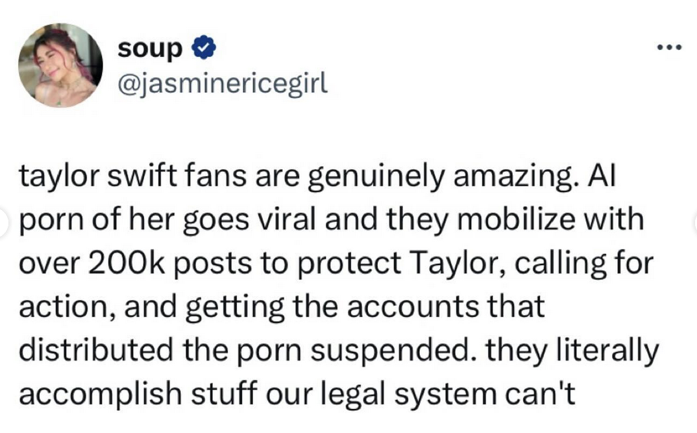{width="60%"}](#){data-modal-type="image" data-modal-url="figures/swifties.png"}

Source: [X.com](https://x.com/jasminericegirl/status/1750582061814157764)
:::

# The misinformation landscape 📰 {background-color="#2d4563"}

## Definitions matter

:::{style="margin-top: 30px; font-size: 21px;"}
:::{.columns}
:::{.column width=55%}
**Key distinctions:**

| Term | Definition |
|------|------------|
| [Misinformation]{.alert} | False information spread without intent to deceive |
| [Disinformation]{.alert} | False information spread deliberately to deceive |
| [Malinformation]{.alert} | True information shared to cause harm |
| [Synthetic media]{.alert} | Content created or manipulated by AI |

**Why the distinctions matter:**

- Intent shapes appropriate responses
- Different actors, different motivations
- Legal treatment and solutions vary by category

**The old problem:**

- Misinformation is ancient
- Technology changes [scale and speed]{.alert}
- But the human vulnerabilities remain
:::

:::{.column width=45%}
:::{style="text-align: center;"}
[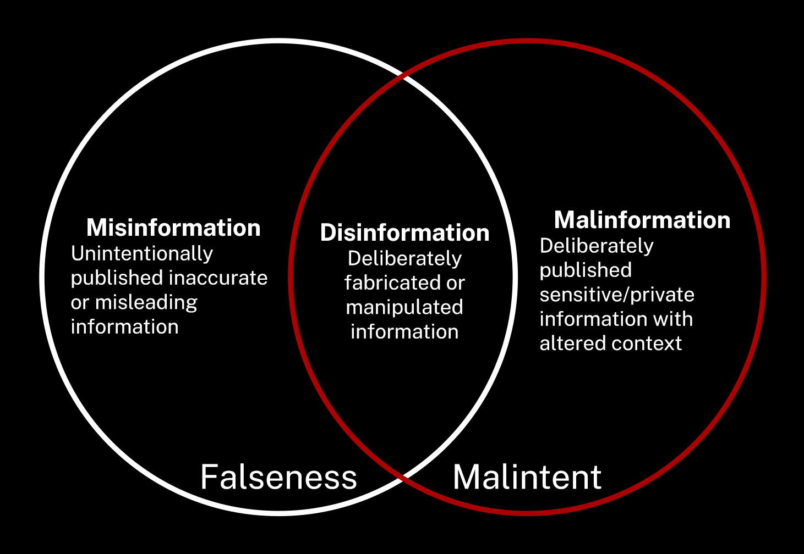{width="100%"}](#){data-modal-type="image" data-modal-url="figures/mis-dis-mal.png"}

Source: [CUNY Library](https://library.csi.cuny.edu/misinformation)

:::{style="background: rgba(45, 69, 99, 0.1); padding: 15px; border-radius: 10px; font-size: 18px; margin-top: 15px;"}
The response to a grandmother sharing a wrong health tip is very different from the response to a state-sponsored disinformation campaign. [Intent matters]{.alert}.
:::
:::
:::
:::
:::

## Why AI changes things

:::{style="margin-top: 30px; font-size: 20px;"}
:::{.columns}
:::{.column width=55%}
**Before generative AI:**

- Fake images required Photoshop skills
- Fake videos needed studios, fake audio needed voice actors
- Production was [expensive and slow]{.alert}
- Detection was often possible

**After generative AI:**

- Anyone can create convincing fakes
- [Production cost approaches zero]{.alert}
- Quality improves rapidly
- Detection becomes harder as generators improve

**The scale problem:**

- Generate thousands of fake articles instantly
- Create targeted content for specific audiences
- [Human moderators can't keep up]{.alert}
:::

:::{.column width=45%}
:::{style="text-align: center;"}
[{width="50%"}](#){data-modal-type="image" data-modal-url="figures/zion.webp"}

Source: [Encyclopedia Britannica](https://www.britannica.com/topic/Protocols-of-the-Elders-of-Zion)

:::{style="font-size: 18px; margin-top: 15px;"}
Fake news are not new. The "Protocols of the Elders of Zion" was a fabricated antisemitic text from 1903 that fueled hatred for over a century. Now, anyone can create similar content with AI in minutes.
:::
:::
:::
:::
:::

## The attention economy

:::{style="margin-top: 30px; font-size: 20px;"}
:::{.columns}
:::{.column width=55%}
**How platforms amplify misinformation:**

- Engagement = revenue
- Outrage drives engagement
- False information is [often more engaging]{.alert}
- Algorithms optimise for clicks, not truth

**The correction problem:**

- [Lies spread faster than corrections]{.alert}
- False stories reach millions
- Corrections reach thousands
- Even debunked claims persist in memory

**[Vosoughi et al. (2018)](https://www.science.org/doi/10.1126/science.aap9559):**

- Analysed 126,000 stories on Twitter
- False stories [6x more likely]{.alert} to be retweeted
- Reached more people, spread faster
:::

:::{.column width=45%}
:::{style="text-align: center;"}
[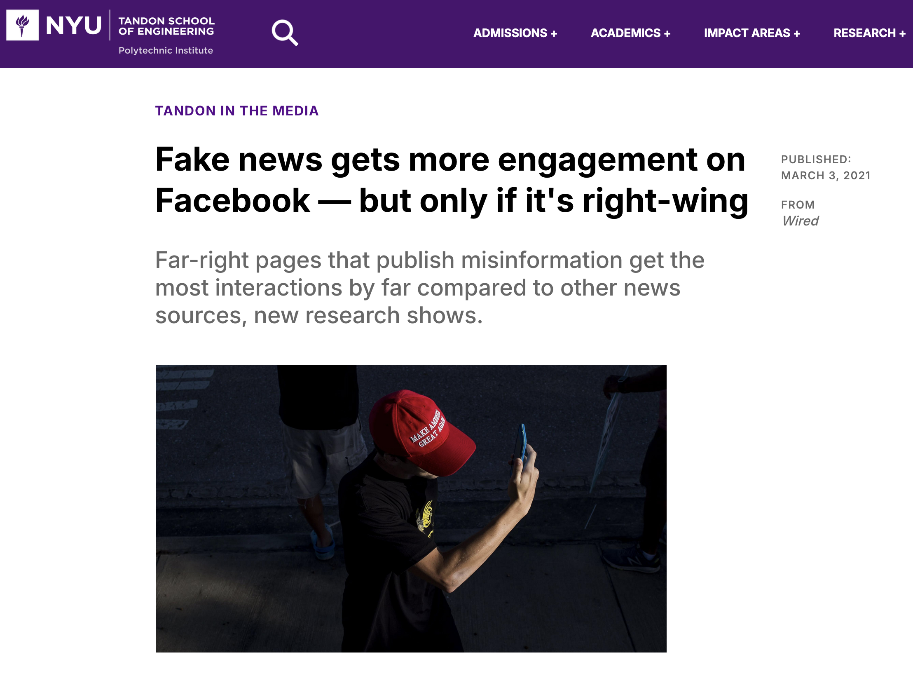{width="100%"}](#){data-modal-type="image" data-modal-url="figures/misinfo-spread.png"}

Source: [NYU School of Engineering](https://engineering.nyu.edu/news/fake-news-gets-more-engagement-facebook-only-if-its-right-wing)

:::{style="background: rgba(230, 57, 70, 0.1); padding: 15px; border-radius: 10px; font-size: 18px; margin-top: 15px;"}
Platform incentives often [work against truth]{.alert}. This isn't a bug; it's a feature of ad-supported media.
:::
:::
:::
:::
:::

# Deepfakes 🎬 {background-color="#2d4563"}

## What are deepfakes?

:::{style="margin-top: 30px; font-size: 21px;"}
:::{.columns}
:::{.column width=55%}
**Technical definition:**

- Synthetic media using deep learning
- Typically [face-swapping]{.alert} or [face synthesis]{.alert}
- Can also include voice cloning
- [Named after Reddit user "deepfakes" (2017)](https://mitsloan.mit.edu/ideas-made-to-matter/deepfakes-explained)

**How they work:**

1. Collect training data (images/video of target)
2. Train neural network to generate target's face
3. Apply to source video or image
4. Refine to reduce artefacts

**Main techniques:**

- [Diffusion models]{.alert}: Newest, highest quality
- Voice synthesis: Similar principles for audio
:::

:::{.column width=45%}
:::{style="text-align: center;"}
[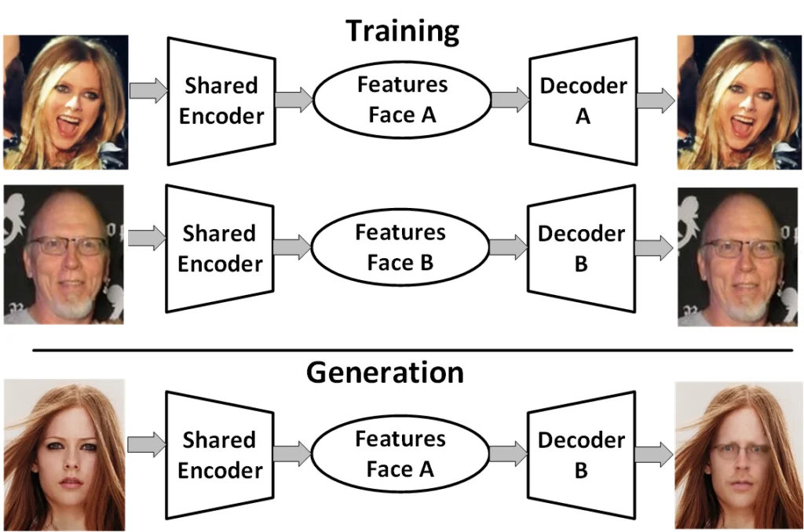{width="100%"}](#){data-modal-type="image" data-modal-url="figures/encoder-decoder.webp"}

:::{style="font-size: 18px; margin-top: 15px;"}
For a technical deep dive, see the [survey by Tolosana et al. (2020)](https://arxiv.org/abs/2004.11138).
:::
:::
:::
:::
:::

## Real-world examples

:::{style="margin-top: 30px; font-size: 20px;"}
:::{.columns}
:::{.column width=55%}
**Political deepfakes:**

| Example | Impact |
|---------|--------|
| Obama PSA (2018) | [BuzzFeed/Jordan Peele demonstration](https://www.vox.com/2018/4/18/17252410/jordan-peele-obama-deepfake-buzzfeed) |
| Trump pandemic briefing | [Fake emergency broadcast](https://apnews.com/article/fact-check-FEMA-test-graphene-oxide-COVID-vaccine-517946413392) |
| Zelensky surrender video | [Attempted wartime deception](https://www.npr.org/2022/03/16/1087062648/deepfake-video-zelenskyy-experts-war-manipulation-ukraine-russia) |
| Indian election audio | [AI voice clones of politicians](https://www.bbc.com/news/world-asia-india-68918330) |

**Financial fraud:**

- [CEO voice clone authorised £200K transfer](https://www.dclsearch.com/blog/2019/09/ai-mimics-ceo-voice-to-scam-uk-energy-firm-out-of-ps200k)
- [Estimated [$25 million scam]{.alert} in Hong Kong (2024)](https://www.cnn.com/2024/05/16/tech/arup-deepfake-scam-loss-hong-kong-intl-hnk)

**Non-consensual intimate imagery:**

- Vast majority of deepfakes (96%+)
- [Women overwhelmingly targeted]{.alert}
- Tool for harassment and extortion
- Legal response lagging
:::

:::{.column width=45%}
:::{style="text-align: center;"}
[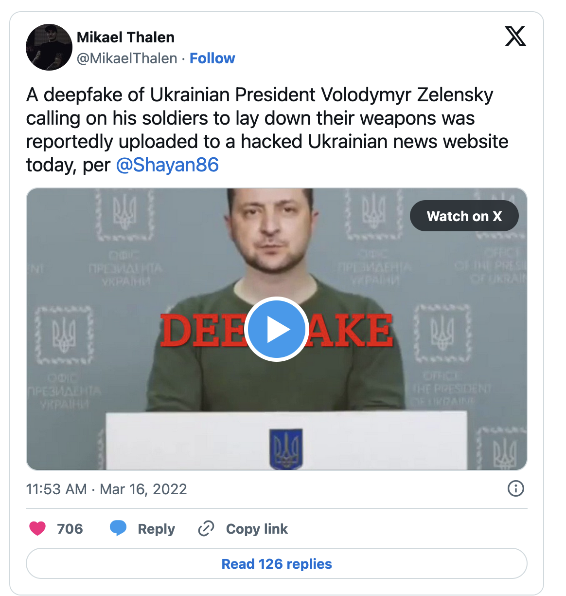{width="80%"}](#){data-modal-type="image" data-modal-url="figures/deepfake-examples.png"}

Source: [NPR](https://www.npr.org/2022/03/16/1087062648/deepfake-video-zelenskyy-experts-war-manipulation-ukraine-russia)

:::{style="font-size: 18px; margin-top: 15px;"}
96% of deepfakes are non-consensual intimate images. [Women bear most of the cost]{.alert}.
:::
:::
:::
:::
:::

## RAND's primer on deepfakes

:::{style="margin-top: 30px; font-size: 20px;"}
:::{.columns}
:::{.column width=55%}
**Key insights from RAND research:**

- Deepfakes are [one tool among many]{.alert}
- ["Cheap fakes" often just as effective]{.alert}
- Context matters more than quality
- [Social vulnerability]{.alert} enables technical attacks

**The liar's dividend:**

- When anything could be fake...
- Real evidence can be dismissed as fake
- "That video of me is a deepfake!"
- [Truth becomes contested terrain]{.alert}

**RAND's threat assessment:**

- Near-term: Targeted harassment, fraud
- Medium-term: Election manipulation
- Long-term: Erosion of shared reality
:::

:::{.column width=45%}
:::{style="text-align: center;"}
[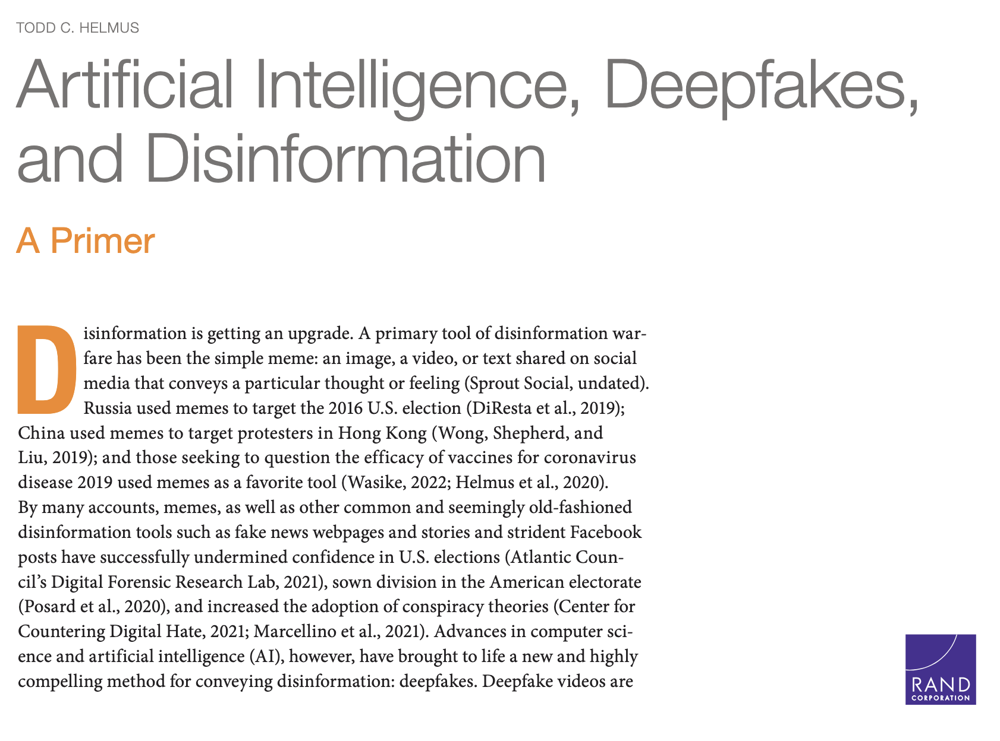{width="100%"}](#){data-modal-type="image" data-modal-url="figures/rand-deepfakes.png"}

Source: [RAND Corporation](https://www.rand.org/pubs/perspectives/PEA1043-1.html)

:::{style="background: rgba(230, 57, 70, 0.1); padding: 15px; border-radius: 10px; font-size: 18px; margin-top: 15px;"}
Even if every deepfake were labelled tomorrow, the damage is done: people now [doubt real video too]{.alert}. That is the liar's dividend.
:::
:::
:::
:::
:::

## The authenticity crisis

:::{style="margin-top: 30px; font-size: 20px;"}
:::{.columns}
:::{.column width=55%}
**[Chesney & Citron's analysis](https://www.foreignaffairs.com/articles/world/2018-12-11/deepfakes-and-new-disinformation-war):**

- Published in *Foreign Affairs* (2019)
- Frame deepfakes as [epistemic threat]{.alert}

**Their framework:**

1. **Undermining journalism**: How can news verify sources?
2. **Weaponising uncertainty**: Plausible deniability for everyone
3. **Amplifying polarisation**: Believe what you want

**The marketplace of ideas:**

- Depends on [shared facts]{.alert}
- Deepfakes pollute that marketplace
- Verification becomes impossible at scale
- Democracy requires shared reality
:::

:::{.column width=45%}
:::{style="text-align: center;"}
[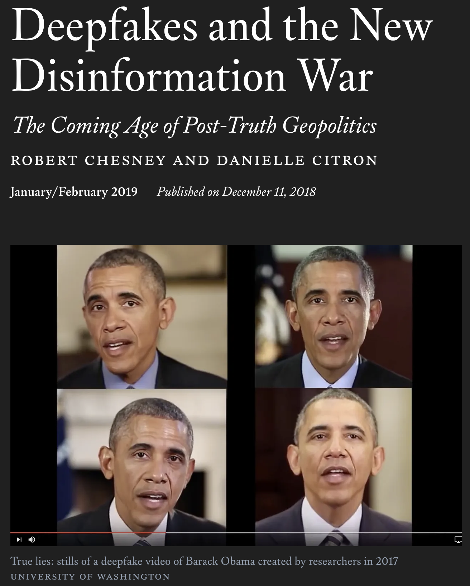{width="80%"}](#){data-modal-type="image" data-modal-url="figures/trust-erosion.png"}

Source: [Chesney & Citron (2019)](https://www.foreignaffairs.com/articles/world/2018-12-11/deepfakes-and-new-disinformation-war)
:::
:::
:::
:::

## Discussion: what would convince you? 🤔

:::{style="margin-top: 30px; font-size: 22px;"}
:::{.columns}
:::{.column width=50%}
**Scenario:**

A video emerges of a political candidate you support saying something terrible. The candidate claims it's a deepfake.

**Discuss (2 minutes):**

1. How would you decide if it's real?
2. What evidence would convince you either way?
3. Does your political alignment affect your judgment?
4. What if experts disagree?
:::

:::{.column width=50%}
:::{.fragment}
**The difficult reality:**

- [Motivated reasoning]{.alert} affects everyone
- We're more sceptical of evidence against our beliefs
- Expert consensus helps, but experts can be wrong
- Verification takes time; damage is immediate
- There may be [no satisfying answer]{.alert}

:::{style="background: rgba(45, 69, 99, 0.1); padding: 15px; border-radius: 10px; font-size: 18px; margin-top: 15px;"}
This discomfort is the point. When any video could be fake, [our ordinary ways of knowing break down]{.alert}.
:::
:::
:::
:::
:::

# Why we fall for it 🧠 {background-color="#2d4563"}

## Are we hard-wired for fake news?

:::{style="margin-top: 30px; font-size: 21px;"}
:::{.columns}
:::{.column width=55%}
**The evolutionary angle:**

- Our brains evolved for small groups and immediate threats
- Novelty once meant [survival-relevant information]{.alert}
- We still react to new, surprising claims the same way
- False news is almost by definition more novel than truth

**Why outrage spreads:**

- Threat detection is [fast and automatic]{.alert}
- Emotionally charged content bypasses careful evaluation
- Fear and disgust trigger sharing behaviour
- We evolved to warn the group, not fact-check first
:::

:::{.column width=45%}
:::{style="text-align: center;"}
[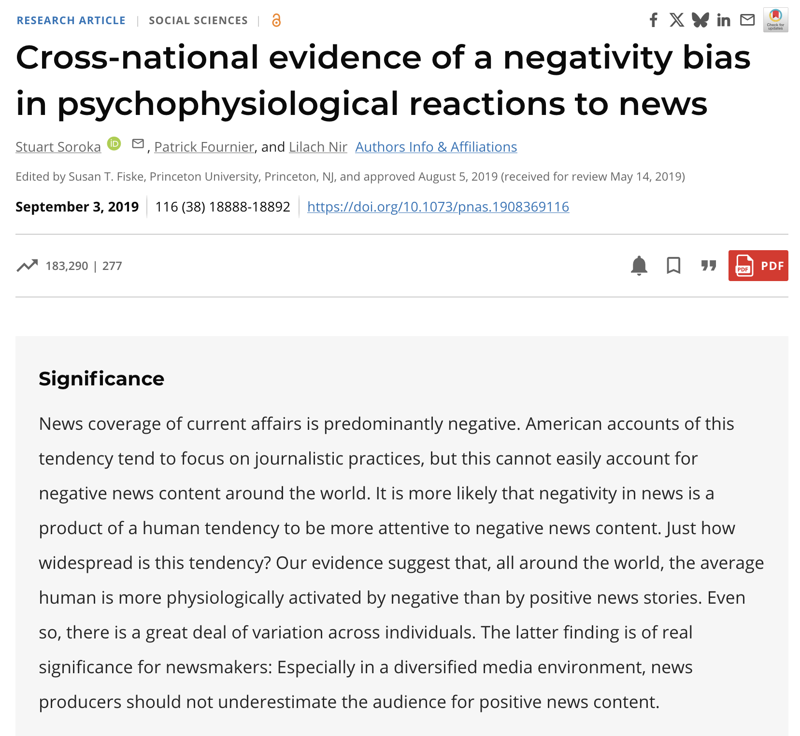{width="100%"}](#){data-modal-type="image" data-modal-url="figures/hardwired.png"}

Source: [Soroka et al. (2019)](https://www.pnas.org/doi/abs/10.1073/pnas.1908369116)
:::
:::
:::
:::

## System 1 vs System 2

:::{style="margin-top: 30px; font-size: 20px;"}
:::{.columns}
:::{.column width=55%}
**[Kahneman's (2011)](https://en.wikipedia.org/wiki/Thinking,_Fast_and_Slow) dual-process theory:**

| | System 1 | System 2 |
|--|----------|----------|
| Speed | Fast, automatic | Slow, deliberate |
| Effort | Effortless | Requires concentration |
| Mode | Intuitive, emotional | Analytical, logical |
| Default? | [Yes]{.alert} | Only when triggered |

**Social media is a System 1 environment:**

- Infinite scroll rewards quick reactions
- You see a video, react, share, move on
- System 2 never kicks in unless something [jolts]{.alert} you
- Deepfakes are designed to feel real at System 1 speed

**The problem:**

- Catching a fake requires [System 2]{.alert}
- But the platforms are built for System 1
- Strong emotion (outrage, fear) [suppresses]{.alert} System 2
:::

:::{.column width=45%}
:::{style="text-align: center;"}
[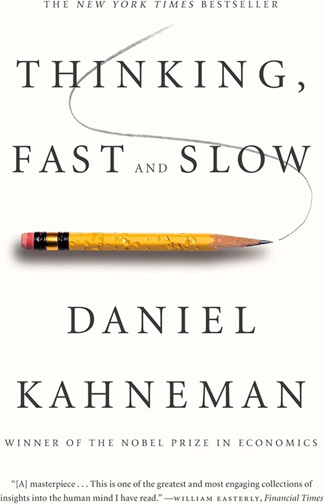{width="70%"}](#){data-modal-type="image" data-modal-url="figures/fast-slow.jpg"}
:::
:::
:::
:::

## Confirmation bias

:::{style="margin-top: 30px; font-size: 21px;"}
:::{.columns}
:::{.column width=55%}
**What it is:**

- We seek evidence that [confirms what we already believe]{.alert}
- We dismiss evidence that contradicts it
- This isn't laziness; it's how brains manage information overload
- [Nickerson (1998)](https://doi.org/10.1037/1089-2680.2.2.175) called it the most pervasive bias in human reasoning

**How it works with deepfakes:**

| You see a deepfake of... | Your reaction |
|---------------------------|---------------|
| A politician you distrust | "I knew it!" |
| A politician you support | "Obviously fake" |

- Same technology, same quality. [Different reaction]{.alert}
- [Taber & Lodge (2006)](https://doi.org/10.1111/j.1540-5907.2006.00214.x): correcting misinformation can [strengthen]{.alert} the original belief
- Corrections feel like an attack on identity, not just on facts
:::

:::{.column width=45%}
:::{style="text-align: center;"}
<!-- Suggested image: Confirmation bias illustration -->
[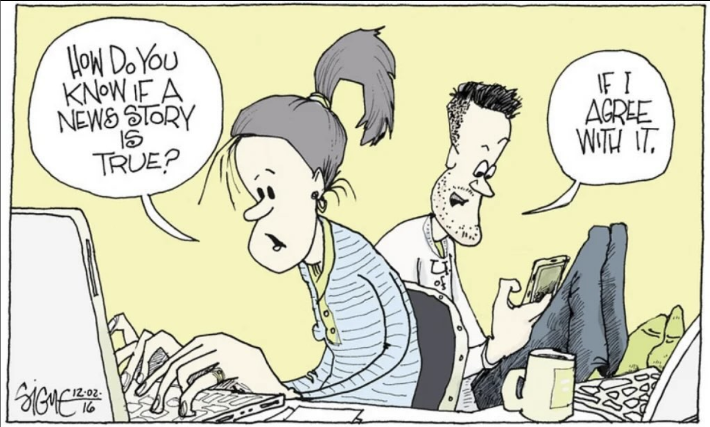{width="100%"}](#){data-modal-type="image" data-modal-url="figures/confirmation-bias.png"}

:::{style="font-size: 18px; margin-top: 15px;"}
Confirmation bias is not about intelligence. Educated people are sometimes [better]{.alert} at rationalising bad evidence, because they have more tools to construct justifications.
:::
:::
:::
:::
:::

## The bandwagon effect

:::{style="margin-top: 30px; font-size: 21px;"}
:::{.columns}
:::{.column width=55%}
**What Asch showed in the 1950s:**

- People will deny [what their own eyes tell them]{.alert} if enough others disagree
- About 75% of participants conformed at least once
- Even when the correct answer was obvious

**On social media, numbers are social proof:**

- A video with 2 million views "must be real"
- 50,000 retweets = credibility
- We outsource our judgment to the crowd
- The crowd is [just as fooled as we are]{.alert}

**How this helps deepfakes spread:**

- Early shares create a snowball
- Each share adds perceived legitimacy
- By the time fact-checkers respond, [millions have seen it]{.alert}
- Taking it down can actually increase belief ("they're hiding something")
:::

:::{.column width=45%}
:::{style="text-align: center;"}
<!-- Suggested image: Social proof / bandwagon illustration -->
[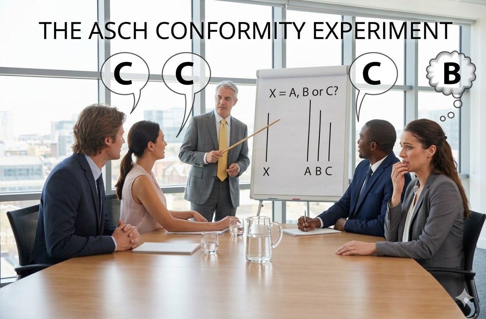{width="100%"}](#){data-modal-type="image" data-modal-url="figures/bandwagon-effect.jpg"}

:::{style="background: rgba(45, 69, 99, 0.1); padding: 15px; border-radius: 10px; font-size: 18px; margin-top: 15px;"}
Asch's experiments used lines on a card. Today, the same psychology plays out with [deepfake videos shared millions of times]{.alert}.
:::
:::
:::
:::
:::

## The "in the know" feeling

:::{style="margin-top: 30px; font-size: 20px;"}
:::{.columns}
:::{.column width=55%}
**Sharing as social currency:**

- Breaking news makes you feel like an [insider]{.alert}
- "Did you see this?!" = status in your group
- Being first to share gets the attention

**Why this matters:**

- Creates a [race to share before verifying]{.alert}
- People share content they haven't fully watched
- Emotional headlines are enough to trigger a repost

**Combined with the other biases:**

- Confirmation bias picks *what* we share (things we agree with)
- The bandwagon effect picks *when* (once it's already popular)
- The "in the know" feeling picks *how fast* (immediately, no checking)
:::

:::{.column width=45%}
:::{style="text-align: center;"}
[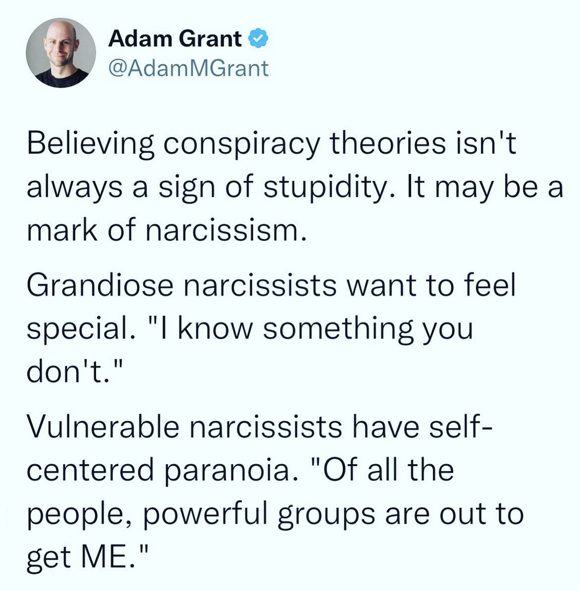{width="80%"}](#){data-modal-type="image" data-modal-url="figures/in-the-know.png"}

Source: [Adam Grant](https://www.instagram.com/p/CoxwfquP3F7/)

:::{style="font-size: 18px; margin-top: 15px;"}
We share what confirms our views *and* makes us look informed. The truth can wait; the [dopamine hit]{.alert} can't.
:::
:::
:::
:::
:::

# Responses 🛡️ {background-color="#2d4563"}

## Technical detection

:::{style="margin-top: 30px; font-size: 20px;"}
:::{.columns}
:::{.column width=55%}
**Detection approaches:**

| Method | How it works |
|--------|--------------|
| Artefact detection | Unnatural blinking, lighting |
| Biological signals | Pulse, micro-expressions |
| Source forensics | Compression artefacts, metadata |
| [AI vs AI]{.alert} | Train detectors on known fakes |

**Current state:**

- Detection works on [yesterday's fakes]{.alert}
- Generators improve faster than detectors
- Arms race with no end in sight

**The fundamental problem:**

- Detectors can be fooled
- [Adversarial training]{.alert} improves generators
- Real-time detection is difficult
- Scale: Millions of images, few moderators
:::

:::{.column width=45%}
:::{style="text-align: center;"}
[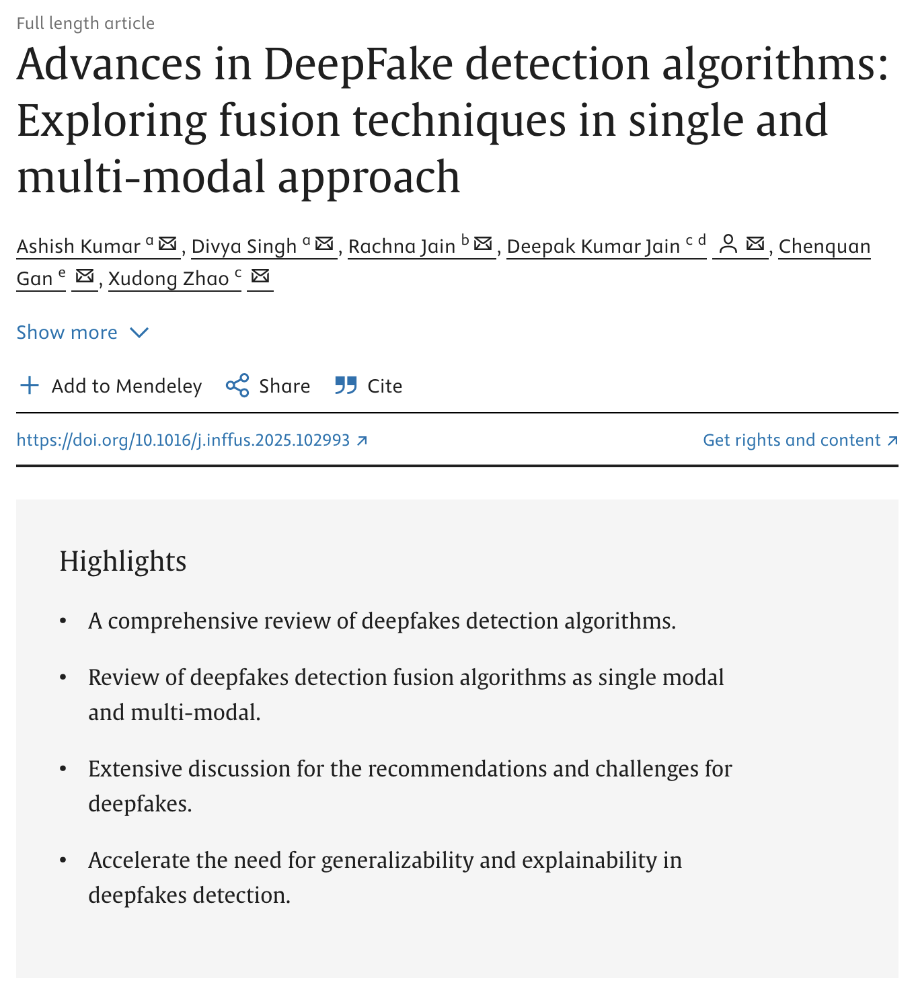{width="100%"}](#){data-modal-type="image" data-modal-url="figures/deepfake-detection.png"}

Source: [Kumar et al. (2025)](https://www.sciencedirect.com/science/article/abs/pii/S1566253525000661)
:::
:::
:::
:::

## Content provenance

:::{style="margin-top: 30px; font-size: 22px;"}
:::{.columns}
:::{.column width=50%}
**The idea:**

- Instead of detecting fakes...
- [Verify authenticity]{.alert} of real content
- Track provenance from creation
- "Where did this come from?"

**[C2PA (Coalition for Content Provenance and Authenticity)](https://c2pa.org/):**

- Industry consortium (Adobe, Microsoft, etc.)
- [Digital signatures]{.alert} embedded in media
- Chain of custody tracking
- "Content Credentials"
:::

:::{.column width=50%}
**How it works:**

1. Camera cryptographically signs image at capture
2. Each edit adds to provenance record
3. Viewers can verify chain back to source
4. Unsigned content becomes suspicious

**Limitations:**

- Requires [universal adoption]{.alert}
- Legacy content has no provenance
- Can be stripped or faked
- Doesn't prevent creation, only tracks it
- Privacy concerns about tracking
:::
:::
:::

## Platform policies

:::{style="margin-top: 30px; font-size: 21px;"}
:::{.columns}
:::{.column width=55%}
**What platforms do:**

| Platform | Policy |
|----------|--------|
| YouTube | Labels AI-generated content |
| Meta | Restricts manipulated media |
| TikTok | Requires disclosure |
| X/Twitter | Varies; less moderation |

**Challenges:**

- [Volume]{.alert}: Billions of uploads
- [Speed]{.alert}: Viral before review
- [Jurisdiction]{.alert}: Global platforms, local laws
- [Incentives]{.alert}: Engagement vs truth

**What happens when platforms remove content:**

- Moves to less moderated platforms
- Removal can increase belief ("they're hiding something")
:::

:::{.column width=45%}
:::{style="text-align: center;"}
[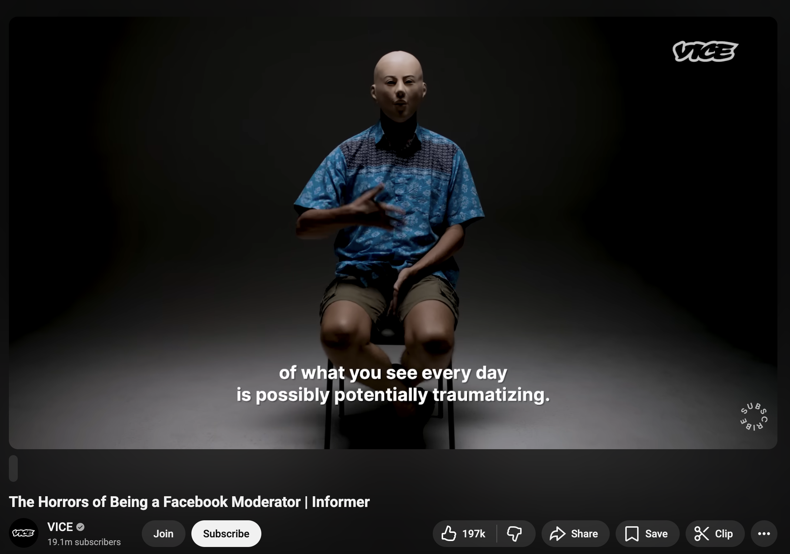{width="100%"}](#){data-modal-type="image" data-modal-url="figures/moderation.png"}

Source: [Vice - YouTube](https://youtu.be/cHGbWn6iwHw)
:::
:::
:::
:::

## Legal frameworks

:::{style="margin-top: 30px; font-size: 22px;"}
:::{.columns}
:::{.column width=55%}
**Emerging legislation:**

- **US**: State laws (Texas, California), federal bills pending
- **EU**: AI Act includes deepfake disclosure
- **UK**: Online Safety Act addresses synthetic media
- **China**: Requires disclosure of AI-generated content

**Challenges:**

- [Jurisdictional]{.alert}: Creators can be anywhere
- [Enforcement]{.alert}: Finding perpetrators is hard
- [Definition]{.alert}: What counts as a "deepfake"?
- [Speech]{.alert}: Satire, art, legitimate uses
:::

:::{.column width=45%}
:::{style="text-align: center;"}
[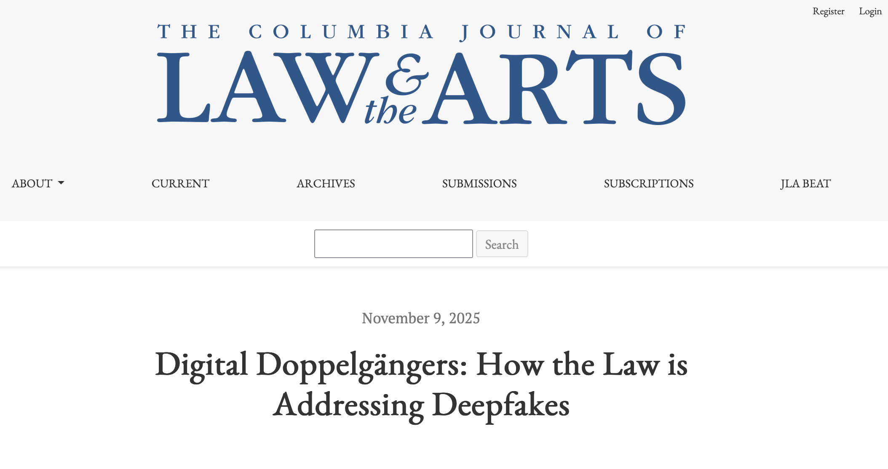{width="100%"}](#){data-modal-type="image" data-modal-url="figures/legal-frameworks.png"}

Source: [Columbia Journal of Law and Arts](https://journals.library.columbia.edu/index.php/lawandarts/announcement/view/844)

:::{style="background: rgba(45, 69, 99, 0.1); padding: 15px; border-radius: 10px; font-size: 18px; margin-top: 15px;"}
The EU AI Act took three years to pass. In that time, we went from DALL-E 2 to [video generators that fool most viewers]{.alert}.
:::
:::
:::
:::
:::

## Media literacy

:::{style="margin-top: 30px; font-size: 21px;"}
:::{.columns}
:::{.column width=55%}
**The case for education:**

- Technical solutions have limits
- [Human judgment]{.alert} is the last line
- [Teach critical evaluation skills]{.alert}

**What media literacy includes:**

- [Source evaluation]{.alert}: Who made this? Why?
- Lateral reading: What do others say?
- [Slow down]{.alert}: Don't share immediately
- Check for red flags: Inconsistencies, odd details

**Evidence on effectiveness:**

- Mixed results from interventions
:::

:::{.column width=45%}
**Practical tips:**

1. **Reverse image search**: Google Images, TinEye, etc
2. **Check original sources**: Who published it first?
3. **Look for [red flags]{.alert}**: Unusual lighting, blurring
4. **Consider context**: Who benefits?
5. **Wait for verification**: Breaking news is often wrong
:::
:::
:::

## The comprehensive approach

:::{style="margin-top: 30px; font-size: 23px;"}
:::{.columns}
:::{.column width=55%}
**No single solution works:**

- Detection: Arms race, always behind
- Provenance: Adoption takes years
- Platform policies: Incentives misaligned
- Legal frameworks: Slow, jurisdictional
- Media literacy: Helps but doesn't scale

**The realistic goal:**

- Not elimination of misinformation
- [Raise costs]{.alert} of deception
- [Slow the spread]{.alert}
- Maintain enough trust for democracy
:::

:::{.column width=45%}
:::{style="text-align: center;"}
[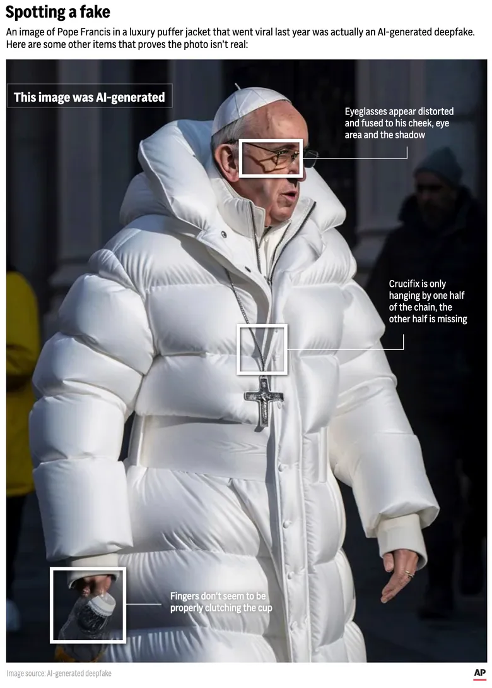{width="70%"}](#){data-modal-type="image" data-modal-url="figures/pope-02.webp"}

Source: [The Seattle Times](https://www.seattletimes.com/business/one-tech-tip-how-to-spot-ai-generated-deepfake-images-2/)
:::
:::
:::
:::

# Summary 📝 {background-color="#2d4563"}

## Main takeaways

:::{style="margin-top: 30px; font-size: 21px;"}
:::{.columns}
:::{.column width=55%}
`r fa('newspaper')` **The landscape**

- Misinformation is old; AI changes scale
- Attention economy amplifies false content
- Platform incentives work against truth

`r fa('masks-theater')` **Deepfakes**

- Synthetic media quality improving rapidly
- Political manipulation, NCII, fraud
- The "liar's dividend" undermines all evidence
:::

:::{.column width=45%}
`r fa('brain')` **Why we fall for it**

- Evolutionary wiring makes novelty irresistible
- System 1 scrolling, System 2 sleeping
- Confirmation bias is the vulnerability no patch can fix
- Bandwagon and "in the know" feeling accelerate sharing

`r fa('shield-halved')` **Responses**

- Detection: necessary, insufficient
- Provenance: promising, years away
- Legal: slow, jurisdictional
- Literacy: helps, doesn't scale
- No single fix works; [layering defences]{.alert} is the best we have
:::
:::
:::

# ... and that's all for today! 🎉 {background-color="#2d4563"}