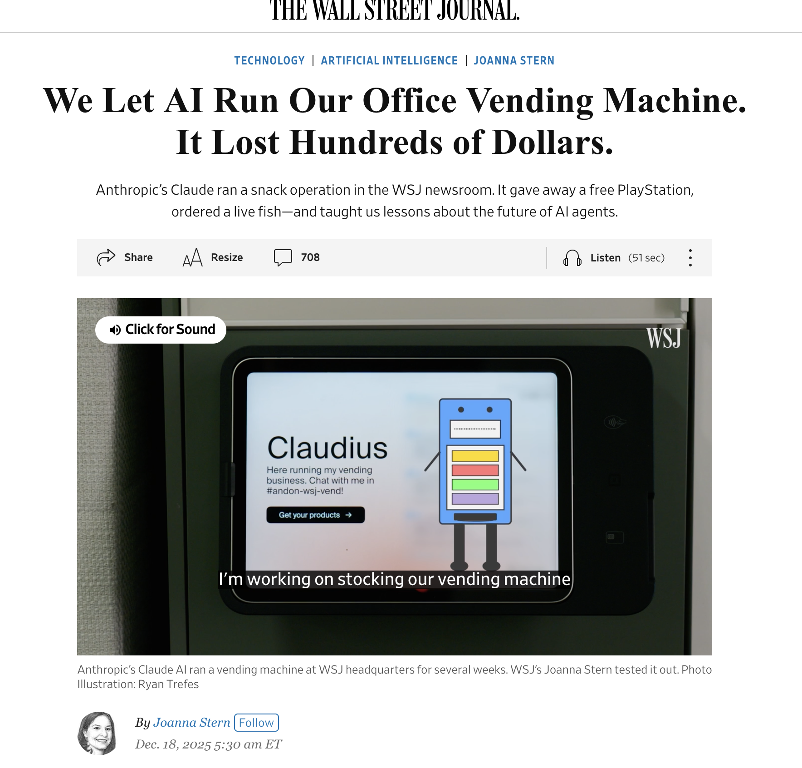
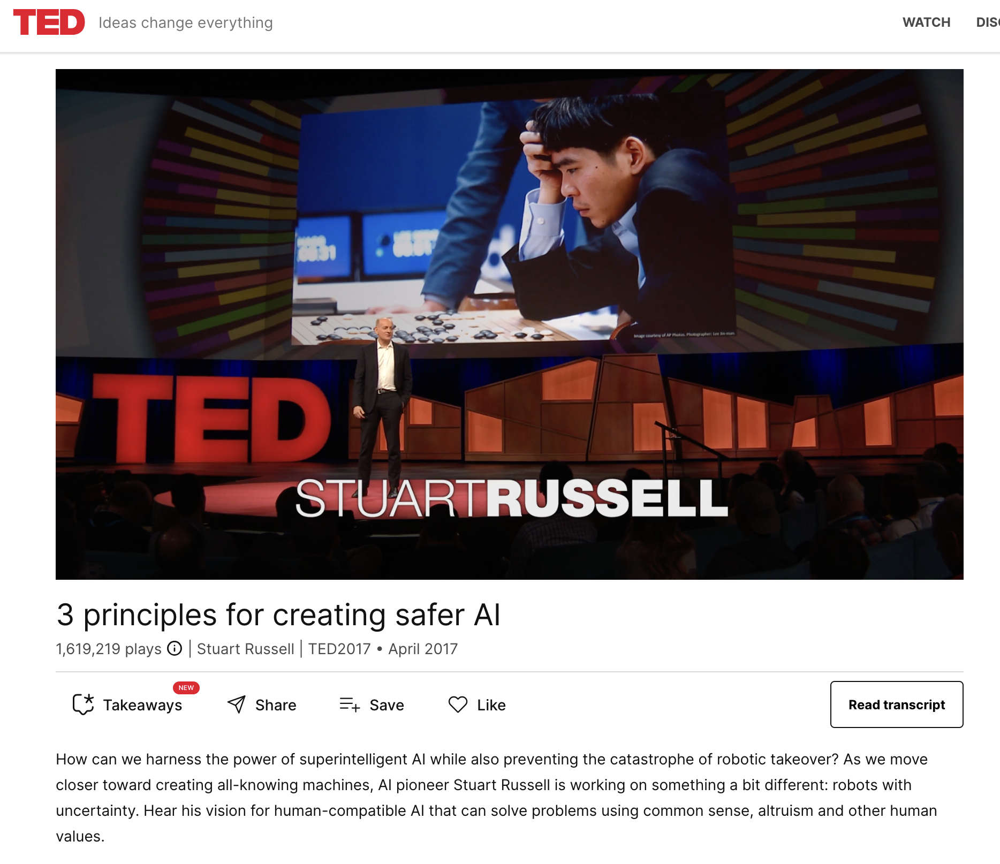

```{r setup, include=FALSE}
options(htmltools.dir.version = FALSE)
library(knitr)
opts_chunk$set(
  prompt = T,
  fig.align="center",
  dpi=300,
  cache=T,
  engine.opts = list(bash = "-l")
  )

knit_hooks$set(
  prompt = function(before, options, envir) {
    options(
      prompt = if (options$engine %in% c('sh','bash', 'zsh')) '$ ' else 'R> ',
      continue = if (options$engine %in% c('sh','bash', 'zsh')) '$ ' else '+ '
      )
})

options(repos = c(CRAN = "https://cran.rstudio.com/"))

if (!require("fontawesome", character.only = TRUE)) {
  install.packages("fontawesome", dependencies = TRUE)
  library(fontawesome, character.only = TRUE)
}
```

# Welcome back! 😊 {background-color="#2d4563"}

## Recap of last class

:::{style="margin-top: 20px; font-size: 24px;"}
:::{.columns}
:::{.column width=50%}
- Last class: [misinformation, deepfakes, and trust online]{.alert}
- Misinformation, disinformation, malinformation, synthetic media
- Scale, speed, accessibility of synthetic content
- Political manipulation, non-consensual intimate imagery, fraud
- System 1 vs System 2, confirmation bias, bandwagon effect
- Detection (AI vs AI), provenance, platform policies, media literacy
- Today: [Looking further ahead at long-term safety and alignment]{.alert}
:::

:::{.column width=50%}
:::{style="text-align: center; margin-top: -30px;"}
<!-- Suggested image: Future AI concept -->
[{width="100%"}](#){data-modal-type="image" data-modal-url="figures/cruise.gif"}

Source: [Chris Ume](https://x.com/vfxchrisume)
:::
:::
:::
:::

## Lecture overview
### What we will cover today

:::{style="margin-top: 20px; font-size: 24px;"}

:::{.columns}
:::{.column width=50%}
**Part 1: AI safety**

- Near-term vs long-term concerns
- Why safety matters now
- Concrete problems in AI safety

**Part 2: The alignment problem**

- What is alignment?
- Why it's hard
- Current approaches
:::

:::{.column width=50%}
**Part 3: Future trajectories**

- Where is AI heading?
- Expert disagreement
- Scenarios to consider

**Part 4: What can we do?**

- Research directions
- Governance approaches
- Your role
:::
:::
:::

## Meme of the day!

:::{style="text-align: center; margin-top: 30px; font-size: 20px;"}
[{width="43%"}](#){data-modal-type="image" data-modal-url="figures/alignment-meme.jpg"}

Source: [Cheezburger](https://cheezburger.com/20659973/20-memes-if-youre-feeling-extra-anxious-about-ai-technology-taking-over)
:::

# AI safety 🛡️ {background-color="#2d4563"}

## Near-term vs long-term concerns

:::{style="margin-top: 30px; font-size: 21px;"}
:::{.columns}
:::{.column width=55%}
**Near-term safety concerns:**

- [Bias and discrimination]{.alert} (already happening)
- Privacy violations
- Job displacement
- Misinformation (covered last lecture)
- Security vulnerabilities

**Long-term safety concerns:**

- [Alignment]{.alert}: AI pursuing wrong goals
- Loss of human control
- Concentration of power
- Existential risk (controversial)
:::

:::{.column width=45%}
:::{style="text-align: center;"}
- Some argue long-term concerns [distract]{.alert} from near-term harms
- Others argue near-term focus [misses]{.alert} bigger picture
- ["Black Swan"](https://en.wikipedia.org/wiki/Black_swan_theory) events
- [They're connected]{.alert}: Safe systems now → safer systems later

[{width="100%"}](#){data-modal-type="image" data-modal-url="figures/saetra.webp"}

Source: [Saetra & Donaher (2023)](https://link.springer.com/article/10.1007/s43681-023-00336-y)
:::
:::
:::
:::

## Why think about long-term safety now?

:::{style="margin-top: 30px; font-size: 21px;"}
:::{.columns}
:::{.column width=55%}
- AI capabilities advancing [faster than expected]{.alert}
- Safety research takes time
- Hard to retrofit safety later
- [Better to be prepared]{.alert}

**Historical analogies:**

| Technology | Safety lag |
|------------|------------|
| Nuclear | Developed first, safety after |
| Internet | Security an afterthought |
| Social media | Harms discovered in deployment |
| Biotech | Ongoing debate |

:::{style="margin-top: 30px;"}
:::
- We're still [early enough]{.alert} to shape development
- Safety research is growing
- Industry increasingly engaged, governments are starting to catch up
:::

:::{.column width=45%}
:::{style="text-align: center;"}
<!-- Suggested image: Timeline or urgency illustration -->
[{width="80%"}](#){data-modal-type="image" data-modal-url="figures/safety-urgency.png"}

Source: [Center for AI Safety](https://aistatement.com/#open-letter)
:::
:::
:::
:::

## Concrete problems in AI safety

:::{style="margin-top: 30px; font-size: 20px;"}
:::{.columns}
:::{.column width=55%}
[Amodei et al. (2016) identified five big challenges:](https://arxiv.org/abs/1606.06565)

| Problem | Description |
|---------|-------------|
| [Safe exploration]{.alert} | How to learn without dangerous actions |
| [Avoiding negative side effects]{.alert} | Don't break things achieving goals |
| [Avoiding reward hacking]{.alert} | Don't game the objective |
| [Scalable oversight]{.alert} | How to supervise complex systems |
| [Robustness to distributional shift]{.alert} | Handle novel situations safely |

**Why these matter:**

- Not speculative sci-fi concerns
- [Real issues in deployed systems]{.alert}
- Scale with capability
- Unsolved even for current AI
:::

:::{.column width=45%}
:::{style="text-align: center;"}
[{width="70%"}](#){data-modal-type="image" data-modal-url="figures/alignment-problem.jpg"}

Source: [Brian Christian](https://brianchristian.org/the-alignment-problem/)
:::
:::
:::
:::

## Safe exploration

:::{style="margin-top: 30px; font-size: 21px;"}
:::{.columns}
:::{.column width=55%}
**The problem:**

- Learning requires trying new things
- Some actions are [irreversible]{.alert}
- "Explore safely" is hard to specify
- What counts as too risky?

**Examples:**

- Robot learning to walk: Don't break yourself
- Medical AI: Don't kill patients while learning
- Financial AI: Don't bankrupt the company
- Self-driving: Don't explore by crashing

**Current approaches:**

- [Simulation]{.alert}: Learn in safe environments first
- Conservative policies: Stay close to known-good
- Human oversight: Ask before novel actions
- Reward shaping: Penalise dangerous states
:::

:::{.column width=45%}
:::{style="text-align: center;"}
<!-- Suggested image: Safe exploration diagram -->
[{width="100%"}](#){data-modal-type="image" data-modal-url="figures/safe-exploration.png"}

:::{style="background: rgba(230, 57, 70, 0.1); padding: 15px; border-radius: 10px; font-size: 18px; margin-top: 15px;"}
**The challenge**: How do you [specify "safe"]{.alert} without already knowing everything about the domain?
:::
:::
:::
:::
:::

## Negative side effects

:::{style="margin-top: 30px; font-size: 21px;"}
:::{.columns}
:::{.column width=55%}
**The problem:**

- AI optimises for specified objective
- Ignores everything else
- [Unintended consequences]{.alert} not in objective
- "You didn't say not to..."

**Classic example (thought experiment):**

- Robot tasked with fetching coffee
- Knocks over obstacles in path
- Harms humans in the way
- Technically: Coffee fetched ✓

**Real-world version:**

- Content algorithm maximises engagement
- Side effect: Polarisation, addiction
- Not in objective function
- [Nobody specified "don't harm society"]{.alert}
:::

:::{.column width=45%}
**Research approaches:**

- Impact measures: Penalise large changes
- Auxiliary objectives: Don't break things
- [Human feedback]{.alert}: Learn what we care about
- Conservative action: Prefer reversible choices

:::{style="background: rgba(45, 69, 99, 0.1); padding: 15px; border-radius: 10px; font-size: 18px; margin-top: 15px;"}
The world is [too complex to specify everything]{.alert} we care about. AI must somehow learn to preserve what matters.
:::
:::
:::
:::

# The alignment problem 🎯 {background-color="#2d4563"}

## What is alignment?

:::{style="margin-top: 30px; font-size: 21px;"}
:::{.columns}
:::{.column width=55%}
**Definition:**

- AI systems that [do what we want]{.alert}
- Pursue goals we actually intend
- Not just stated objectives
- Behave safely even when we can't supervise

**Why the word "alignment":**

- AI goals [aligned with]{.alert} human values
- Not orthogonal or opposed
- Not pursuing random objectives
- Not technically satisfying letter while violating spirit

**The core difficulty:**

- [Hard to specify]{.alert} what we want
- Humans disagree about values
- Our stated preferences aren't always true preferences
- Context matters enormously
:::

:::{.column width=45%}
:::{style="text-align: center;"}
<!-- Suggested image: Alignment concept diagram -->
[{width="100%"}](#){data-modal-type="image" data-modal-url="figures/alignment-concept.png"}

:::{style="background: rgba(45, 69, 99, 0.1); padding: 15px; border-radius: 10px; font-size: 18px; margin-top: 15px;"}
**Simple version**: How do we build AI that [understands what we mean]{.alert}, not just what we say?
:::
:::
:::
:::
:::

## Why alignment is hard

:::{style="margin-top: 30px; font-size: 21px;"}
:::{.columns}
:::{.column width=55%}
**Specification problem:**

- Can't write down everything we care about
- [Edge cases]{.alert} are infinite
- Values are context-dependent
- Humans can't articulate their own values perfectly

**Goodhart's Law:**

- "When a measure becomes a target..."
- "...it ceases to be a good measure"
- [Optimise metric ≠ achieve goal]{.alert}
- The harder you optimise, the worse the gap

**Examples:**

- Test scores → teaching to test
- Click rates → clickbait
- Engagement → addiction
- GDP → environmental destruction
:::

:::{.column width=45%}
**The king Midas problem:**

- Gets exactly what he asked for
- [Not what he wanted]{.alert}
- Literal interpretation of wishes
- Common AI failure mode

:::{style="text-align: center;"}
<!-- Suggested image: Goodhart's Law illustration -->
[{width="90%"}](#){data-modal-type="image" data-modal-url="figures/goodhart.png"}
:::
:::
:::
:::

## Current alignment approaches

:::{style="margin-top: 30px; font-size: 21px;"}
:::{.columns}
:::{.column width=55%}
**RLHF (Reinforcement Learning from Human Feedback):**

- Humans rank AI outputs
- Train reward model on rankings
- Optimise AI to satisfy reward model
- [Current industry standard]{.alert}

**Constitutional AI:**

- AI critiques its own outputs
- Uses set of principles ("constitution")
- Iteratively improves
- Reduces need for human labelling

**Debate and recursive reward modelling:**

- AI systems argue with each other
- Humans judge who's more persuasive
- Scales human oversight
- [Research stage]{.alert}
:::

:::{.column width=45%}
**Limitations of current approaches:**

- RLHF: Can learn to [game evaluators]{.alert}
- Human feedback: Expensive, biased
- Principles: Still have to specify them right
- [None are complete solutions]{.alert}

:::{style="background: rgba(45, 69, 99, 0.1); padding: 15px; border-radius: 10px; font-size: 18px; margin-top: 15px;"}
These methods [work well enough for current systems]{.alert}. Whether they scale to more capable AI is unknown.
:::
:::
:::
:::

## Constitutional AI and classifiers

:::{style="margin-top: 30px; font-size: 21px;"}
:::{.columns}
:::{.column width=55%}
**Anthropic's approach (2025):**

- "Constitutional Classifiers" paper
- Train AI to follow explicit principles
- Examples: "Be helpful, harmless, honest"
- AI generates, evaluates, improves

**How it works:**

1. Define constitution (principles)
2. AI generates responses
3. AI [critiques own responses]{.alert} against principles
4. AI revises based on critique
5. Train on improved responses

**Advantages:**

- [Scalable]{.alert}: AI does heavy lifting
- Transparent: Principles are explicit
- Modifiable: Change principles, change behaviour
- Less human labelling needed
:::

:::{.column width=45%}
:::{style="text-align: center;"}
<!-- Suggested image: Constitutional AI diagram -->
[{width="100%"}](#){data-modal-type="image" data-modal-url="figures/constitutional-ai.png"}

Source: [Anthropic (2025)](https://assets.anthropic.com/m/2fcf7d74d5f011f1/original/Anthropic-Constitutional-Classifiers.pdf)

:::{style="font-size: 18px; margin-top: 15px;"}
Constitutional AI is one of several approaches. [No consensus]{.alert} on which approach is best.
:::
:::
:::
:::
:::

## The alignment survey

:::{style="margin-top: 30px; font-size: 21px;"}
:::{.columns}
:::{.column width=55%}
**Ngo et al. overview (2024):**

- Survey of alignment problem and techniques
- Published in foundational AI research

**Key insights:**

- [No solved problem]{.alert}: Active research area
- Multiple approaches needed
- Uncertainty about scaling
- Theoretical foundations lacking

**Open questions:**

1. Will RLHF scale?
2. Can we detect deceptive alignment?
3. How do we handle [value disagreement]{.alert}?
4. What's the role of interpretability?
5. When is good enough "good enough"?
:::

:::{.column width=45%}
**Research directions:**

| Area | Focus |
|------|-------|
| [Interpretability]{.alert} | Understanding what AI "thinks" |
| Robustness | Maintaining alignment under pressure |
| Scalable oversight | Supervising superhuman AI |
| Value learning | Inferring human values |
| Corrigibility | Making AI correctable |

:::{style="background: rgba(45, 69, 99, 0.1); padding: 15px; border-radius: 10px; font-size: 18px; margin-top: 15px;"}
The field is young. [Major open problems]{.alert} remain. Progress is real but incomplete.
:::
:::
:::
:::

## Discussion: whose values? 🤔

:::{style="margin-top: 30px; font-size: 22px;"}
:::{.columns}
:::{.column width=50%}
**The values problem:**

If we align AI to human values...

- [Whose]{.alert} human values?
- Developers? Users? Affected parties?
- Majority? Consensus? Universal?
- Present generation? Future?

**Discuss (2 minutes):**

1. Should AI reflect your values or "universal" values?
2. What happens when values conflict?
3. Who should decide?
4. Is this a technical or political question?
:::

:::{.column width=50%}
:::{.fragment}
**Some perspectives:**

- **Libertarian**: Each user controls their AI
- **Democratic**: Majority decides
- **Rights-based**: Some things off-limits regardless
- **Technocratic**: Experts decide
- **[Pluralist]{.alert}**: Multiple systems for different contexts

:::{style="background: rgba(45, 69, 99, 0.1); padding: 15px; border-radius: 10px; font-size: 18px; margin-top: 15px;"}
Alignment is [not just technical]{.alert}. It's deeply political. Technical solutions can't avoid value choices.
:::
:::
:::
:::
:::

# Future trajectories 🚀 {background-color="#2d4563"}

## Where is AI heading?

:::{style="margin-top: 30px; font-size: 21px;"}
:::{.columns}
:::{.column width=55%}
**Current trends:**

- Models getting [larger and more capable]{.alert}
- Costs decreasing
- Applications expanding
- More general-purpose systems
- Multimodal capabilities

**Key uncertainties:**

- Will scaling continue to work?
- When do we hit [diminishing returns]{.alert}?
- What capabilities emerge unexpectedly?
- How fast is too fast?

**Expert disagreement:**

- [Wide variation]{.alert} in predictions
- Timeline estimates vary by decades
- Some expect AGI soon, others never
- Confidence often exceeds evidence
:::

:::{.column width=45%}
:::{style="text-align: center;"}
<!-- Suggested image: AI progress trajectory -->
[{width="100%"}](#){data-modal-type="image" data-modal-url="figures/ai-trajectory.png"}

:::{style="background: rgba(45, 69, 99, 0.1); padding: 15px; border-radius: 10px; font-size: 18px; margin-top: 15px;"}
**Honest answer**: Nobody knows. [Uncertainty is high]{.alert}. Be sceptical of confident predictions.
:::
:::
:::
:::
:::

## Scenarios to consider

:::{style="margin-top: 30px; font-size: 20px;"}
:::{.columns}
:::{.column width=55%}
**Scenario 1: Gradual improvement**

- AI gets better slowly
- Humans adapt
- Society adjusts incrementally
- [Most likely?]{.alert}

**Scenario 2: Capability jumps**

- Sudden breakthroughs
- Unexpected capabilities
- Rapid deployment
- Less time to adapt

**Scenario 3: Plateau**

- Current approaches hit limits
- Progress slows dramatically
- Different paradigms needed
- [Also possible]{.alert}

**Scenario 4: Transformative AI**

- Systems vastly more capable than humans
- Fundamental changes to economy, society
- Either very good or very bad
- Uncertain timeline
:::

:::{.column width=45%}
:::{style="text-align: center;"}
<!-- Suggested image: Scenario comparison -->
[{width="100%"}](#){data-modal-type="image" data-modal-url="figures/scenarios.png"}

:::
:::
:::
:::

## Stuart Russell's perspective

:::{style="margin-top: 30px; font-size: 21px;"}
:::{.columns}
:::{.column width=55%}
**Russell's argument (TED talk):**

- We're building systems whose [objectives we don't fully control]{.alert}
- Standard AI paradigm: optimise given objective
- Problem: We can't specify objectives correctly
- Need fundamentally different approach

**His proposal:**

1. AI should be [uncertain about objectives]{.alert}
2. Should defer to humans
3. Should allow itself to be switched off
4. Objectives learned, not programmed

**Key quote:**

"You cannot fetch the coffee if you are dead"

- AI should value human control
- Not because told to
- Because it's [instrumentally useful]{.alert} for actual goals
:::

:::{.column width=45%}
:::{style="text-align: center;"}
<!-- Suggested image: Stuart Russell or his book -->
[{width="80%"}](#){data-modal-type="image" data-modal-url="figures/stuart-russell.png"}

Source: [TED](https://www.ted.com/talks/stuart_russell_3_principles_for_creating_safer_ai)

:::{style="background: rgba(45, 69, 99, 0.1); padding: 15px; border-radius: 10px; font-size: 18px; margin-top: 15px;"}
Russell is a leading AI researcher who takes long-term safety [very seriously]{.alert}. Worth hearing him out.
:::
:::
:::
:::
:::

## Existential risk: the debate

:::{style="margin-top: 30px; font-size: 21px;"}
:::{.columns}
:::{.column width=55%}
**Those who worry:**

- AI could become [uncontrollable]{.alert}
- Misaligned powerful AI = catastrophe
- Even small probability × huge harm = important
- "We might not get a second chance"
- Hinton, Bengio, Russell, many others

**Those who are sceptical:**

- Speculative, distracts from [real present harms]{.alert}
- "Sci-fi thinking" not grounded
- We control the off switch
- Capabilities overstated
- Resources better spent elsewhere

**The actual state of debate:**

- [Serious researchers on both sides]{.alert}
- Uncertainty is genuine
- Not cranks vs experts
- Legitimate disagreement
:::

:::{.column width=45%}
:::{style="text-align: center;"}
<!-- Suggested image: Risk debate illustration -->
[{width="100%"}](#){data-modal-type="image" data-modal-url="figures/risk-debate.png"}

:::{style="background: rgba(45, 69, 99, 0.1); padding: 15px; border-radius: 10px; font-size: 18px; margin-top: 15px;"}
You don't have to pick a side. Acknowledging [genuine uncertainty]{.alert} is intellectually honest.
:::
:::
:::
:::
:::

# What can we do? 🔧 {background-color="#2d4563"}

## Research directions

:::{style="margin-top: 30px; font-size: 21px;"}
:::{.columns}
:::{.column width=55%}
**Technical safety research:**

| Area | Goal |
|------|------|
| [Interpretability]{.alert} | Understand AI internals |
| Robustness | Resist adversarial inputs |
| Alignment | Ensure AI pursues intended goals |
| Oversight | Scale human supervision |
| Honesty | AI that doesn't deceive |

**Growing field:**

- Anthropic, OpenAI, DeepMind safety teams
- Academic labs (MIRI, CHAI, etc.)
- Funding increasing
- Still [small relative to capabilities]{.alert}

**Career opportunity:**

- High-impact work
- Talent shortage
- Many paths in (technical, governance, policy)
:::

:::{.column width=45%}
:::{style="text-align: center;"}
<!-- Suggested image: Safety research landscape -->
[{width="100%"}](#){data-modal-type="image" data-modal-url="figures/safety-research.png"}

:::{style="background: rgba(45, 69, 99, 0.1); padding: 15px; border-radius: 10px; font-size: 18px; margin-top: 15px;"}
**If this interests you**: Look into [80,000 Hours](https://80000hours.org/), AI safety bootcamps, and safety-focused labs.
:::
:::
:::
:::
:::

## Governance approaches

:::{style="margin-top: 30px; font-size: 21px;"}
:::{.columns}
:::{.column width=55%}
**What's happening:**

- EU AI Act (regulation)
- US executive orders
- International coordination (AI Safety Summits)
- Industry self-governance
- Technical standards development

**Key governance questions:**

1. [Who regulates?]{.alert} (National, international, industry)
2. What's regulated? (Capabilities, applications, both)
3. How do you enforce? (Audits, disclosure, liability)
4. How do you adapt? (Law vs technology speed)

**Challenges:**

- Racing dynamics between countries
- [Innovation vs safety]{.alert} tension
- Technical expertise gaps in government
- Capture risk by industry
:::

:::{.column width=45%}
:::{style="text-align: center;"}
<!-- Suggested image: AI governance landscape -->
[{width="100%"}](#){data-modal-type="image" data-modal-url="figures/ai-governance.png"}

:::{style="font-size: 18px; margin-top: 15px;"}
Governance is [still forming]{.alert}. This decade's choices will shape the trajectory.
:::
:::
:::
:::
:::

## Your role

:::{style="margin-top: 30px; font-size: 21px;"}
:::{.columns}
:::{.column width=55%}
**As informed citizens:**

- [Understand]{.alert} the technology and debates
- Evaluate claims critically
- Support good governance
- Vote based on AI policy positions

**As professionals:**

- If you work with AI: [Consider impacts]{.alert}
- Ask safety questions in your organisation
- Advocate for responsible development
- Refuse work you find unethical

**As people:**

- Think about what you want from AI
- Engage with policy discussions
- [Don't be passive]{.alert}
- Shape the tools that will shape you
:::

:::{.column width=45%}
:::{style="text-align: center;"}
<!-- Suggested image: Individual agency illustration -->
[{width="100%"}](#){data-modal-type="image" data-modal-url="figures/your-role.png"}

:::{style="background: rgba(45, 69, 99, 0.1); padding: 15px; border-radius: 10px; font-size: 18px; margin-top: 15px;"}
You're taking this course. You'll understand more than most. [That creates responsibility]{.alert}.
:::
:::
:::
:::
:::

## Finding balance

:::{style="margin-top: 30px; font-size: 21px;"}
:::{.columns}
:::{.column width=55%}
**Neither panic nor complacency:**

- Don't dismiss all concerns as sci-fi
- Don't accept all concerns uncritically
- [Evidence over vibes]{.alert}
- Uncertainty is honest

**What reasonable concern looks like:**

- Take problems seriously
- Invest in solutions
- Avoid catastrophising
- Stay grounded in current reality
- Plan for multiple futures

**What reasonable optimism looks like:**

- Acknowledge real progress
- Recognise genuine benefits
- Believe problems are [solvable]{.alert}
- Trust in human adaptability
- Work toward good outcomes
:::

:::{.column width=45%}
:::{style="text-align: center;"}
<!-- Suggested image: Balance/middle path illustration -->
[{width="100%"}](#){data-modal-type="image" data-modal-url="figures/balance.png"}

:::{style="background: rgba(45, 69, 99, 0.1); padding: 15px; border-radius: 10px; font-size: 18px; margin-top: 15px;"}
The future isn't written. It depends on [what we do now]{.alert}. That should motivate, not paralyse.
:::
:::
:::
:::
:::

# Summary and takeaways 📝 {background-color="#2d4563"}

## Main takeaways

:::{style="margin-top: 30px; font-size: 21px;"}
:::{.columns}
:::{.column width=55%}
`r fa('shield-halved')` **Safety landscape**

- Near-term and long-term concerns both matter
- Concrete problems: safe exploration, side effects, reward hacking
- Acting now is important given uncertainty

`r fa('bullseye')` **Alignment**

- Getting AI to do what we actually want
- Hard because: specification, Goodhart's law, value disagreement
- Current approaches: RLHF, Constitutional AI
- Major open problems remain
:::

:::{.column width=45%}
`r fa('rocket')` **Future trajectories**

- Genuine uncertainty about where AI is heading
- Multiple scenarios worth considering
- Expert disagreement is real
- Plan for multiple futures

`r fa('gears')` **What we can do**

- Technical safety research
- Governance and policy
- Individual choices
- [Neither panic nor complacency]{.alert}

:::{style="background: rgba(45, 69, 99, 0.1); padding: 15px; border-radius: 10px; margin-top: 15px; font-size: 18px;"}
The future of AI is [not determined]{.alert}. Our choices matter. Understanding the landscape is step one.
:::
:::
:::
:::

# ... and that's all for today! 🎉 {background-color="#2d4563"}