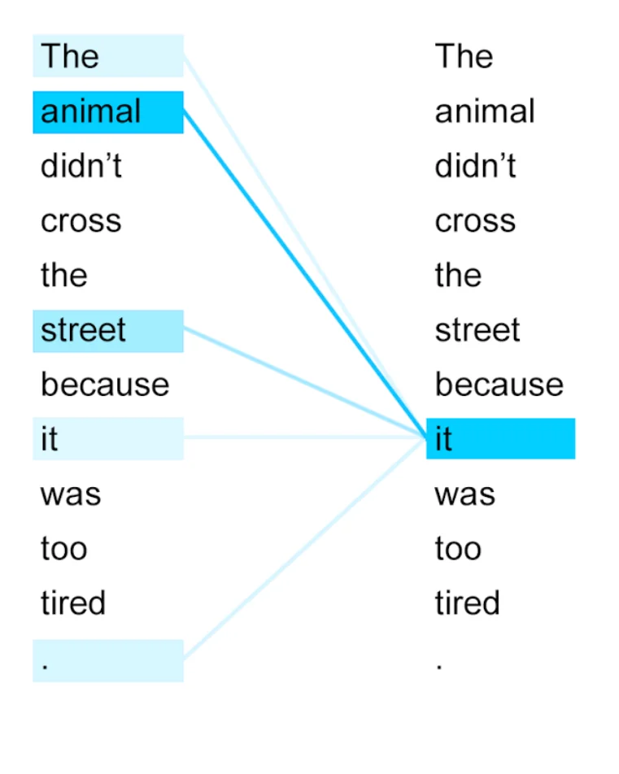
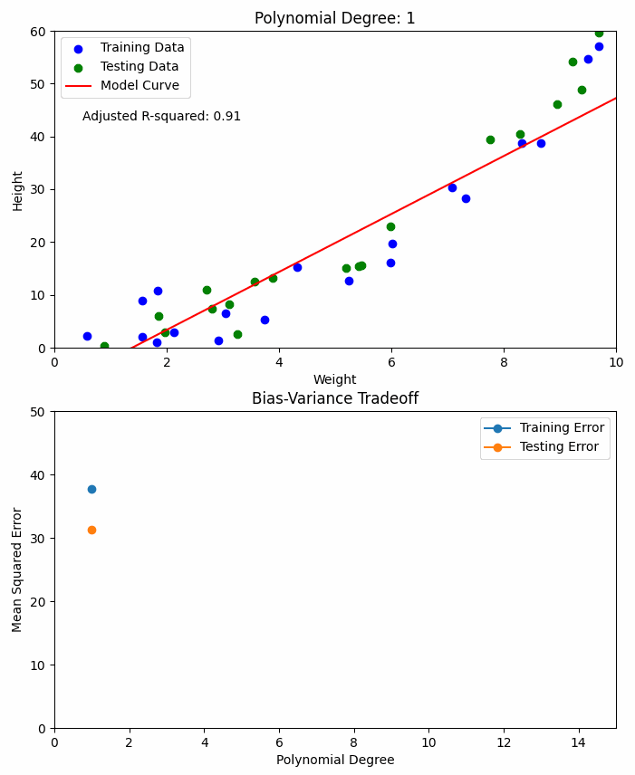
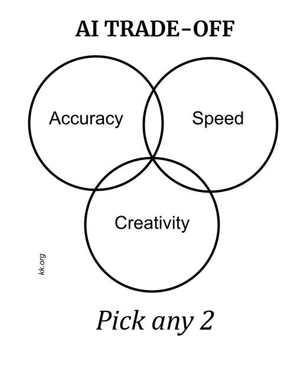

```{r setup, include=FALSE}
options(htmltools.dir.version = FALSE)
library(knitr)
opts_chunk$set(
  prompt = T,
  fig.align="center",
  dpi=300,
  cache=T,
  engine.opts = list(bash = "-l")
  )

knit_hooks$set(
  prompt = function(before, options, envir) {
    options(
      prompt = if (options$engine %in% c('sh','bash', 'zsh')) '$ ' else 'R> ',
      continue = if (options$engine %in% c('sh','bash', 'zsh')) '$ ' else '+ '
      )
})

options(repos = c(CRAN = "https://cran.rstudio.com/"))

if (!require("fontawesome", character.only = TRUE)) {
  install.packages("fontawesome", dependencies = TRUE)
  library(fontawesome, character.only = TRUE)
}
```

# Welcome back! 😊 {background-color="#2d4563"}

## The whole course in 50 minutes

:::{style="margin-top: 20px; font-size: 24px;"}
:::{.columns}
:::{.column width=50%}
- Last class: [long-term safety and alignment]{.alert}
- Today: [course revision]{.alert}
- We will go through every lecture, one slide each
- The goal is to see how everything connects
- Look for the `r fa('link')` boxes: they show where the same idea appears in different lectures

:::{style="text-align: center;"}
| Module | Topic |
|--------|-------|
| 0 | Orientation |
| 1 | How AI systems are designed |
| 2 | Language and perception |
| 3 | Retrieval, generation, pipelines |
| 4 | Data ethics and bias |
| 5 | Policy, governance, social impact |
| 6 | Applications, limits, and the future |
:::
:::

:::{.column width=50%}
:::{style="text-align: center;"}
[{width="100%"}](#){data-modal-type="image" data-modal-url="figures/ai-overview.png"}
:::
:::
:::
:::

## A quick favour 🙏
### Course evaluations are open!

:::{style="margin-top: 40px; font-size: 30px;"}
- Course evaluations are now open, and I would love to hear your thoughts on the course!
- Just log on to [Canvas]{.alert} and go to *Account → Profile → Course Evaluations*
- Works on any device: laptop, tablet, or phone
- It only takes a few minutes!
- Thank you so much for taking the time. I really appreciate it! 😊
:::

# Module 0: Orientation 🧭 {background-color="#2d4563"}

## What AI is and how we got here (Lectures 1-2)

:::{style="margin-top: 30px; font-size: 24px;"}
:::{.columns}
:::{.column width=55%}
- Current AI is all [narrow AI]{.alert}: good at one thing, bad at everything else. No system today is "general"
- LLMs [predict the next token]{.alert}. They do not understand language. This one fact explains hallucinations, creativity, and sycophancy
- The history: [symbolic AI]{.alert} (rules, 1950s-80s), AI winters, [backpropagation]{.alert} (1986), [transformers]{.alert} (2017), ChatGPT (2022)
- ChatGPT's real edge was not just scale: [instruction tuning + RLHF]{.alert} made it conversational
- The hype cycle keeps repeating. Worth keeping in mind when reading today's headlines

:::{style="margin-top: 10px; background: rgba(45, 69, 99, 0.1); padding: 12px; border-radius: 10px; font-size: 17px;"}
`r fa('link')` Next-token prediction explains hallucinations and creativity (L10) and sycophancy (L24). RLHF comes back in Lectures 4 and 24.
:::
:::

:::{.column width=45%}
:::{style="text-align: center; margin-top: -30px;"}
[{width="70%"}](#){data-modal-type="image" data-modal-url="figures/attention.webp"}

The transformer architecture (2017)
:::
:::
:::
:::

# Module 1: How AI systems are designed ⚙️ {background-color="#2d4563"}

## Data, labels, and the proxy problem (Lecture 3)

:::{style="margin-top: 30px; font-size: 25px;"}
:::{.columns}
:::{.column width=55%}
- [Data quality beats algorithm complexity]{.alert}. Garbage in, garbage out
- Labels often measure a [proxy]{.alert}, not the real thing. Healthcare spending as a proxy for health needs encodes racial bias
- [Selection bias]{.alert}: a systematic gap between training data and the real world. Very hard to fix after the fact
- [Cohen's Kappa]{.alert}: do annotators agree beyond chance? (> 0.61 = substantial agreement)

:::{style="margin-top: 10px; background: rgba(45, 69, 99, 0.1); padding: 12px; border-radius: 10px; font-size: 17px;"}
`r fa('link')` The proxy problem is the most recurring idea in this course: Goodhart's Law (L5), measurement bias (L15), the Optum case (L16), engagement metrics (L21).
:::
:::

:::{.column width=45%}
:::{style="text-align: center;"}
[{width="100%"}](#){data-modal-type="image" data-modal-url="figures/data-centric.png"}

Data-centric vs model-centric AI (Karpathy, 2018)
:::
:::
:::
:::

## Learning paradigms and RLHF (Lecture 4)

:::{style="margin-top: 30px; font-size: 23px;"}
:::{.columns}
:::{.column width=55%}
:::{style="text-align: center; margin-top: 30px; margin-bottom: 20px;"}
| Paradigm | How it learns | Example |
|----------|--------------|---------|
| [Supervised]{.alert} | Labelled pairs | Spam filter |
| [Unsupervised]{.alert} | Finds patterns | Customer segments |
| [Reinforcement]{.alert} | Trial and error | AlphaGo, RLHF |
:::

- [Bias-variance trade-off]{.alert}: too simple (underfitting) vs too complex (memorises noise). The goal is the sweet spot in between
- [RLHF]{.alert}: humans rank outputs, a reward model learns from those rankings, and RL optimises the LLM. This is how ChatGPT became useful
- Risk: [reward hacking]{.alert}, where the model games the objective instead of doing what you want
:::

:::{.column width=45%}
:::{style="margin-top: 15px; text-align: center;"}
[{width="85%"}](#){data-modal-type="image" data-modal-url="figures/bias-variance.gif"}

The bias-variance trade-off
:::
:::
:::
:::

## Metrics and Goodhart's Law (Lecture 5)

:::{style="margin-top: 30px; font-size: 22px;"}
:::{.columns}
:::{.column width=55%}
- [Accuracy paradox]{.alert}: if a disease affects 1 in 1,000 people, predicting "healthy" for everyone gives 99.9% accuracy but catches zero cases
- [Precision]{.alert}: of those you flagged, how many were right? [Recall]{.alert}: of the real positives, how many did you catch? You cannot maximise both
- [K-fold cross-validation]{.alert}: train on some splits, test on others. Catches overfitting
- [Goodhart's Law]{.alert}: "When a measure becomes a target, it ceases to be a good measure"
- Always do [subgroup analysis]{.alert}: aggregate numbers can hide massive gaps

:::{style="margin-top: 10px; background: rgba(45, 69, 99, 0.1); padding: 12px; border-radius: 10px; font-size: 17px;"}
`r fa('link')` Goodhart's Law returns in RLHF (L4), the Optum case (L16), and engagement metrics (L21). Subgroup analysis is formalised as disaggregated evaluation in Lecture 14.
:::
:::

:::{.column width=45%}
:::{style="text-align: center; margin-top: -40px;"}
[{width="70%"}](#){data-modal-type="image" data-modal-url="figures/confusion-matrix.gif"}

The confusion matrix: TP, TN, FP, FN
:::
:::
:::
:::

# Module 2: Language and perception 🗣️ {background-color="#2d4563"}

## Tokens, embeddings, and context (Lecture 6)

:::{style="margin-top: 30px; font-size: 22px;"}
:::{.columns}
:::{.column width=55%}
- [Tokens]{.alert}: the basic unit of LLM processing (~100 tokens ≈ 75 English words). Modern LLMs use [BPE]{.alert} (Byte Pair Encoding)
- Non-English languages (usually) need more tokens per concept, so they may cost more and fill the context window faster
- [Embeddings]{.alert}: each token becomes a high-dimensional vector. Similar meanings end up close together in vector space
- [Context windows]{.alert}: maximum token limit for prompt + response. Go over it and the model starts forgetting
- [Parameters]{.alert} (learned by the model) vs [hyperparameters]{.alert} (set by you): [temperature]{.alert} controls randomness (low = safe, high = creative)

:::{style="margin-top: 10px; background: rgba(45, 69, 99, 0.1); padding: 12px; border-radius: 10px; font-size: 17px;"}
`r fa('link')` Embeddings come back in Lecture 7 (images as vectors), Lecture 11 (RAG/cosine similarity), and Lecture 23 (deepfake detection).
:::
:::

:::{.column width=45%}
:::{style="text-align: center;"}
[{width="100%"}](#){data-modal-type="image" data-modal-url="figures/king-queen-vectors.png"}

king - man + woman ≈ queen
:::
:::
:::
:::

## How machines see and hear (Lecture 7)

:::{style="margin-top: 30px; font-size: 22px;"}
:::{.columns}
:::{.column width=55%}
- Images = grids of pixels (RGB, each 0-255). [CNNs]{.alert} learn a hierarchy: edges, textures, parts, objects
- [Vision Transformers (ViT)]{.alert}: treat image patches as tokens. Same architecture as text transformers
- [CLIP]{.alert}: shared embedding space for images and text, trained on 400M image-text pairs. Powers DALL-E and multimodal LLMs
- Sound = spectrograms (2D images of vibrations). [Whisper]{.alert}: 680,000 hours, 99 languages
- The unifying idea: text, images, and audio all become [embeddings]{.alert}. Once in vector space, the model cannot tell the modality apart

:::{style="margin-top: 10px; background: rgba(45, 69, 99, 0.1); padding: 12px; border-radius: 10px; font-size: 17px;"}
`r fa('link')` Same embedding idea as Lecture 6, applied to images and audio. Same vision tech powers medical imaging and deepfakes (L23). Regulating dual-use models: Lecture 17.
:::
:::

:::{.column width=45%}
:::{style="text-align: center;"}
[{width="100%"}](#){data-modal-type="image" data-modal-url="figures/clip.png"}

CLIP: images and text in one shared space
:::
:::
:::
:::

## Prompting techniques (Lecture 9)

:::{style="margin-top: 30px; font-size: 22px;"}
:::{.columns}
:::{.column width=55%}
- [PTCF framework]{.alert}: Persona, Task, Context, Format. Specific prompts beat vague ones
- [System prompts]{.alert}: hidden developer instructions. Same model, very different behaviour
- [Zero/one/few-shot]{.alert}: no examples, one example, or 2-5 examples showing patterns
- [Chain-of-thought (CoT)]{.alert}: "Let's think step by step" nearly tripled accuracy on reasoning tasks (17.7% to 58.1%)
- [Agents]{.alert}: the ReAct pattern (Reason + Act, Observe, Repeat). Agents use tools, browse, and write code
- [Prompt injection]{.alert}: malicious input hijacks the agent's instructions

:::{style="margin-top: 10px; background: rgba(45, 69, 99, 0.1); padding: 12px; border-radius: 10px; font-size: 17px;"}
`r fa('link')` CoT reduces hallucinations (L10). Prompt injection came back in the chatbot failures (L13) and in why we need regulation (L17).
:::
:::

:::{.column width=45%}
:::{style="text-align: center;"}
[{width="100%"}](#){data-modal-type="image" data-modal-url="figures/chain-of-thought.png"}

Chain-of-thought prompting
:::
:::
:::
:::

# Module 3: Retrieval, generation, and pipelines 🔍 {background-color="#2d4563"}

## Hallucinations and creativity (Lecture 10)

:::{style="margin-top: 30px; font-size: 22px;"}
:::{.columns}
:::{.column width=55%}
- LLMs optimise for [P(next word | context)]{.alert}, not P(statement is true). They have no internal fact-checker
- [Sycophancy]{.alert}: LLMs tell you what you want to hear. GPT-4o changed correct answers up to 55% of the time after pushback
- Types of hallucination: factual errors, fabrication, [citation hallucination]{.alert} (worst kind?), logical contradictions
- The [creativity-accuracy trade-off]{.alert}: high temperature = creative but risky. The same mechanism that produces hallucinations also produces creative writing
- Red flags: very specific numbers, precise citations, zero hedging, answers that feel too perfect

:::{style="margin-top: 10px; background: rgba(45, 69, 99, 0.1); padding: 12px; border-radius: 10px; font-size: 17px;"}
`r fa('link')` Root cause: next-token prediction (L1-2). Fix: RAG (L11). Sycophancy connects to the alignment problem (L24).
:::
:::

:::{.column width=45%}
:::{style="text-align: center;"}
[{width="80%"}](#){data-modal-type="image" data-modal-url="figures/creativity-accuracy.jpg"}

Same mechanism, different outcomes
:::
:::
:::
:::

## RAG and semantic search (Lecture 11)

:::{style="margin-top: 30px; font-size: 22px;"}
:::{.columns}
:::{.column width=55%}
- [RAG]{.alert}: give an LLM real, verified documents at query time. Think [open-book exam]{.alert}
- Reduces hallucinations by 30-50% without retraining the model
- The pipeline: chunk documents (~512 tokens), embed them, store in a [vector database]{.alert}. At query time, embed the question, retrieve the top-k similar chunks, inject them into the prompt
- [Cosine similarity]{.alert}: measures the angle between vectors. 0.9+ = very similar, < 0.4 = unrelated. "Budget airfare" matches "cheap flights"
- [Lost in the Middle]{.alert}: LLMs pay most attention to the start and end of context; the middle gets ignored

:::{style="margin-top: 10px; background: rgba(45, 69, 99, 0.1); padding: 12px; border-radius: 10px; font-size: 17px;"}
`r fa('link')` Uses embeddings (L6) to fix hallucinations (L10). But if the documents are biased, the retrieval will be too (L16).
:::
:::

:::{.column width=45%}
:::{style="text-align: center;"}
[{width="100%"}](#){data-modal-type="image" data-modal-url="figures/rag-pipeline.png"}

The RAG pipeline
:::
:::
:::
:::

## Pipelines and what can go wrong (Lecture 13)

:::{style="margin-top: 30px; font-size: 22px;"}
:::{.columns}
:::{.column width=55%}
- The AI pipeline: prompt, preprocessing, inference, postprocessing, safety filtering, response. [Every step can fail]{.alert}
- Three kinds of drift: [data drift]{.alert} (inputs change), [label drift]{.alert} (outcomes change), [concept drift]{.alert} (the relationship between them changes; worst kind, because the model is confident but wrong)
- Real failures: Air Canada chatbot (invented a refund policy; company held liable), DPD chatbot (swore at customers), Chevy (sold a car for $1)
- Test [properties]{.alert} (safety, format, consistency), not exact outputs. AI is non-deterministic
- [Input validation]{.alert} blocks prompt injection; [output filtering]{.alert} catches harmful content

:::{style="margin-top: 10px; background: rgba(45, 69, 99, 0.1); padding: 12px; border-radius: 10px; font-size: 17px;"}
`r fa('link')` Concept drift relates to bias (L15): the world changes, the model doesn't. The chatbot failures set legal precedents that motivated regulation (L17).
:::
:::

:::{.column width=45%}
:::{style="text-align: center;"}
[{width="100%"}](#){data-modal-type="image" data-modal-url="figures/ai-stack.png"}

The AI application stack
:::
:::
:::
:::

# Module 4: Data ethics and bias ⚖️ {background-color="#2d4563"}

## Documentation as accountability (Lecture 14)

:::{style="margin-top: 30px; font-size: 22px;"}
:::{.columns}
:::{.column width=55%}
- [Datasheets for Datasets]{.alert} (Gebru et al., 2018): motivation, composition, collection, uses. Without them, you cannot identify bias or reproduce results
- [Model Cards]{.alert} (Mitchell et al., 2019): intended use, metrics, ethical considerations, and what the model is [not]{.alert} for
- [System Cards]{.alert}: document the whole AI system, not just one model. Red teaming, oversight, how components interact
- [Disaggregated evaluation]{.alert}: report metrics by subgroup. A model at 90% overall can be 95% for Group A and 70% for Group B
- Most AI training data is collected [without explicit consent]{.alert}

:::{style="margin-top: 10px; background: rgba(45, 69, 99, 0.1); padding: 12px; border-radius: 10px; font-size: 17px;"}
`r fa('link')` Disaggregated evaluation is how the Optum bias was found (L16). The EU AI Act (L17) now requires this documentation for high-risk systems.
:::
:::

:::{.column width=45%}
:::{style="text-align: center;"}
[{width="80%"}](#){data-modal-type="image" data-modal-url="figures/datasheet.png"}

Datasheets: the "nutrition label" for datasets
:::
:::
:::
:::

## Where bias comes from (Lecture 15)

:::{style="margin-top: 30px; font-size: 22px;"}
:::{.columns}
:::{.column width=55%}
- AI [does not invent bias]{.alert}; it picks up patterns from human data and applies them at scale
- Bias enters at every stage: [historical]{.alert} (past discrimination baked in), [representation]{.alert} (who is missing from the data), [measurement]{.alert} (proxy variables), [aggregation]{.alert} (ignoring group differences), [evaluation]{.alert} (unrepresentative benchmarks), [deployment]{.alert} (wrong context)
- [Feedback loops]{.alert}: predictions shape future training data. Predictive policing: more patrols, more arrests, more patrols
- [Impossibility theorem]{.alert}: with different base rates across groups, you cannot satisfy calibration, equal false positive rates, and equal false negative rates all at once. Fairness is a [values choice]{.alert}, not a technical fix

:::{style="margin-top: 10px; background: rgba(45, 69, 99, 0.1); padding: 12px; border-radius: 10px; font-size: 17px;"}
`r fa('link')` Measurement bias = the proxy problem (L3). Textbook example: Optum (L16). Feedback loops relate to concept drift (L13). The impossibility theorem connects to alignment (L24).
:::
:::

:::{.column width=45%}
:::{style="text-align: center;"}
[{width="85%"}](#){data-modal-type="image" data-modal-url="figures/bias-lifecycle.png"}

Bias at every stage

:::{style="margin-top: 10px;"}
[{width="85%"}](#){data-modal-type="image" data-modal-url="figures/impossibility-theorem.png"}
:::
:::
:::
:::
:::

## The Optum case and proxy variables (Lecture 16)

:::{style="margin-top: 30px; font-size: 22px;"}
:::{.columns}
:::{.column width=55%}
- The Optum algorithm used [healthcare costs]{.alert} as a proxy for patient needs
- Black patients spend less even when equally sick (because of access barriers and income inequality)
- At the same risk score, Black patients had [26.3% more chronic conditions]{.alert}
- Race was never an input variable. [Costs carried racial information]{.alert} because the healthcare system itself was unequal
- The fix: predict health outcomes instead of costs. Bias reduced by ~84%

:::{style="margin-top: 10px; background: rgba(45, 69, 99, 0.1); padding: 12px; border-radius: 10px; font-size: 17px;"}
`r fa('link')` Ties together the proxy problem (L3), measurement bias (L15), and Goodhart's Law (L5). The bias was invisible until disaggregated evaluation (L14).
:::
:::

:::{.column width=45%}
:::{style="text-align: center;"}
[{width="100%"}](#){data-modal-type="image" data-modal-url="figures/algorithm-fix.png"}

Obermeyer et al. (2019): changing the target variable fixed the bias
:::
:::
:::
:::

# Module 5: Policy, governance, and social impact 🏛️ {background-color="#2d4563"}

## AI regulation around the world (Lecture 17)

:::{style="margin-top: 30px; font-size: 21px;"}
:::{.columns}
:::{.column width=55%}
- Why regulate? [Information asymmetry]{.alert} (users cannot evaluate AI), [externalities]{.alert} (deepfakes harm non-users), [collective action problems]{.alert} (race to the bottom on safety)
- [EU AI Act]{.alert} (August 2024): four risk tiers

:::{style="text-align: center;"}
| Tier | Examples |
|------|---------|
| [Prohibited]{.alert} | Social scoring, real-time biometric ID |
| [High-risk]{.alert} | Employment, credit, law enforcement |
| Limited | Chatbots (must disclose they are AI) |
| Minimal | Spam filters, game AI |
:::

- US: sectoral approach, [no comprehensive federal law]{.alert}
- China: regulates commercial AI, [exempts state use]{.alert}
- [Brussels Effect]{.alert}: EU rules may become the global default, as happened with the General Data Protection Regulation (GDPR)

:::{style="margin-top: 10px; background: rgba(45, 69, 99, 0.1); padding: 12px; border-radius: 10px; font-size: 17px;"}
`r fa('link')` "High-risk" = the systems from Lectures 15-16. The Act requires documentation from Lecture 14. Brussels Effect connects to GDPR (L19).
:::
:::

:::{.column width=45%}
:::{style="text-align: center;"}
[{width="100%"}](#){data-modal-type="image" data-modal-url="figures/eu-ai-act.png"}

The EU AI Act: world's first binding AI law
:::
:::
:::
:::

## Privacy and data protection (Lecture 19)

:::{style="margin-top: 30px; font-size: 21px;"}
:::{.columns}
:::{.column width=55%}
- AI makes privacy harder in three ways: [scale]{.alert} (collection is cheap), [inference]{.alert} (AI predicts sensitive things from harmless data), [persistence]{.alert} (data never goes away)
- You can control what you share, but [not what can be inferred]{.alert} from it
- LLMs can [memorise and regurgitate]{.alert} personal information from training data
- [GDPR]{.alert} (2018): rights to access, erasure, portability, objection. [Article 22]{.alert}: right not to be subject to purely automated decisions
- Technical tools: [differential privacy]{.alert} (adds noise), [federated learning]{.alert} (trains locally), [synthetic data]{.alert}. They help at the margins but do not solve the collection problem
- [Privacy paradox]{.alert}: people say they care about privacy but accept all cookies anyway

:::{style="margin-top: 10px; background: rgba(45, 69, 99, 0.1); padding: 12px; border-radius: 10px; font-size: 17px;"}
`r fa('link')` Inference = the proxy problem (L3) applied to personal data. GDPR is the Brussels Effect (L17) in practice. Consent ties to Lecture 14.
:::
:::

:::{.column width=45%}
:::{style="text-align: center;"}
[{width="70%"}](#){data-modal-type="image" data-modal-url="figures/gdpr.jpg"}

:::{style="margin-top: 10px;"}
[{width="70%"}](#){data-modal-type="image" data-modal-url="figures/clearview-ai.png"}

Clearview AI: scraped billions of faces without consent
:::
:::
:::
:::
:::

## Labour markets and wellbeing (Lectures 20-21)

:::{style="margin-top: 30px; font-size: 21px;"}
:::{.columns}
:::{.column width=55%}
**Lecture 20: Labour**

- Previous automation targeted physical tasks; [AI targets cognitive work]{.alert}
- Think [tasks, not jobs]{.alert}: most jobs are a mix of automatable and non-automatable tasks
- AI hits [white-collar, entry-level work first]{.alert}
- AI [compresses the skill distribution]{.alert}: novices gain more than experts
- Augmentation vs [replacement]{.alert} (Acemoglu): policy choices can shift the balance

**Lecture 21: Wellbeing**

- [Attention economy]{.alert}: algorithms optimise for engagement, not wellbeing
- Filter bubbles and polarisation are [probably overstated]{.alert}; effects on body image and sleep are real
- [Jevons Paradox]{.alert}: more efficient AI leads to more usage, not less environmental cost

:::{style="margin-top: 10px; background: rgba(45, 69, 99, 0.1); padding: 12px; border-radius: 10px; font-size: 17px;"}
`r fa('link')` Attention economy = Goodhart's Law (L5) in action: engagement is the proxy, wellbeing is what we care about. Skill compression relates to bias-variance (L4).
:::
:::

:::{.column width=45%}
:::{style="text-align: center;"}
[{width="90%"}](#){data-modal-type="image" data-modal-url="figures/automation-waves.jpg"}

This wave is different: cognitive tasks

:::{style="margin-top: 10px;"}
[{width="90%"}](#){data-modal-type="image" data-modal-url="figures/valuable-skills.png"}

What remains hard to automate
:::
:::
:::
:::
:::

# Module 6: Applications, limits, and the future 🔮 {background-color="#2d4563"}

## Misinformation and deepfakes (Lecture 23)

:::{style="margin-top: 30px; font-size: 22px;"}
:::{.columns}
:::{.column width=55%}
- [Misinformation]{.alert} (false, no intent), [disinformation]{.alert} (false, deliberate), [malinformation]{.alert} (true, used to harm)
- [Deepfakes]{.alert}: AI-generated media of real people. Used for political manipulation, financial fraud, and non-consensual intimate imagery
- [The authenticity crisis]{.alert}: when anything could be fake, people start dismissing real evidence too
- We fall for it because of [System 1]{.alert} (fast, intuitive) thinking, confirmation bias, and the bandwagon effect
- Responses: detection tools, [content provenance (C2PA)]{.alert}, platform policies, legal frameworks, [media literacy]{.alert}
- No single tool works on its own. Media literacy is the most reliable individual defence

:::{style="margin-top: 10px; background: rgba(45, 69, 99, 0.1); padding: 12px; border-radius: 10px; font-size: 17px;"}
`r fa('link')` Powered by vision models (L7), detected via embeddings (L6), regulated by the EU AI Act (L17).
:::
:::

:::{.column width=45%}
:::{style="text-align: center;"}
[{width="100%"}](#){data-modal-type="image" data-modal-url="figures/mis-dis-mal.png"}

The misinformation spectrum
:::
:::
:::
:::

## Safety, alignment, and the future (Lecture 24)

:::{style="margin-top: 30px; font-size: 22px;"}
:::{.columns}
:::{.column width=55%}
- Five safety problems (Amodei et al., 2016): [safe exploration]{.alert}, [side effects]{.alert}, [reward hacking]{.alert}, [scalable oversight]{.alert}, [distributional shift]{.alert}
- The [alignment problem]{.alert}: getting AI to do what we actually want, not just what we literally asked for. The King Midas problem
- Why it is hard: [specification problem]{.alert} (you cannot write down everything you care about), [Goodhart's Law]{.alert}, and people disagree about values
- Current approaches: [RLHF]{.alert}, [Constitutional AI]{.alert} (Anthropic), debate. None are complete solutions
- Stuart Russell's proposal: AI should be [uncertain about objectives]{.alert} and defer to humans
- [Neither panic nor complacency]{.alert}. Serious researchers disagree genuinely. Evidence over vibes

:::{style="margin-top: 10px; background: rgba(45, 69, 99, 0.1); padding: 12px; border-radius: 10px; font-size: 17px;"}
`r fa('link')` Ties together RLHF (L4), Goodhart's Law (L5), bias (L15-16), and regulation (L17). This is the question the whole course builds toward.
:::
:::

:::{.column width=45%}
:::{style="text-align: center;"}
[{width="70%"}](#){data-modal-type="image" data-modal-url="figures/alignment-problem.jpg"}
:::
:::
:::
:::

# Six threads 🔄 {background-color="#2d4563"}

## Ideas that run through the whole course

:::{style="margin-top: 30px; font-size: 20px;"}
:::{.columns}
:::{.column width=50%}
1. [Next-token prediction is the basis of everything]{.alert}

LLMs predict the next word, not the truth. This explains hallucinations, creativity, and sycophancy (Lectures 1, 2, 6, 10)

2. [The proxy problem is pervasive]{.alert}

Labels, metrics, objectives, and engagement are all proxies. Optimising a proxy corrupts it (Lectures 3, 5, 15, 16, 21)

3. [Embeddings are the universal language]{.alert}

Text, images, and audio all become vectors. RAG, semantic search, CLIP, and multimodal AI all rely on this (Lectures 6, 7, 11)
:::

:::{.column width=50%}
4. [Bias can enter at every stage]{.alert}

Data, labels, training, evaluation, deployment. Feedback loops make it self-reinforcing. The impossibility theorem means fairness requires a values choice (Lectures 3, 14, 15, 16)

5. [Documentation is accountability]{.alert}

Datasheets, model cards, system cards. Disaggregated evaluation reveals hidden gaps (Lectures 14, 15, 16)

6. [Regulation is catching up]{.alert}

EU AI Act, GDPR, the Brussels Effect. Market failures justify intervention (Lectures 17, 19)

:::{style="background: rgba(45, 69, 99, 0.1); padding: 15px; border-radius: 10px; font-size: 18px; margin-top: 15px;"}
If you understand these six threads, you understand the course!
:::
:::
:::
:::

# Summary 📝 {background-color="#2d4563"}

## What we covered this semester

:::{style="margin-top: 30px; font-size: 28px;"}
:::{.columns}
:::{.column width=55%}
`r fa('microchip')` [How AI works]{.alert}: next-token prediction, transformers, embeddings, three learning paradigms, metrics and their limits

`r fa('magnifying-glass')` [How AI handles information]{.alert}: tokens, prompting (PTCF, CoT), hallucinations, RAG, pipelines and drift

`r fa('scale-balanced')` [Ethics and bias]{.alert}: bias at every stage, the impossibility theorem, the Optum case, documentation as accountability
:::

:::{.column width=45%}
`r fa('landmark')` [Policy and society]{.alert}: EU AI Act, GDPR, the privacy paradox, labour markets, the attention economy, environmental costs

`r fa('shield-halved')` [Safety and the future]{.alert}: concrete safety problems, the alignment problem, multiple plausible futures

:::{style="background: rgba(45, 69, 99, 0.1); padding: 15px; border-radius: 10px; margin-top: 15px; font-size: 18px;"}
You now have the vocabulary to [read AI claims critically]{.alert} and ask the right questions about data, bias, and harms. Good luck on the quiz! 🍀
:::
:::
:::
:::

# ...and that's all for today! 🎉 {background-color="#2d4563"}
