```{r setup, include=FALSE}
options(htmltools.dir.version = FALSE)
library(knitr)
opts_chunk$set(
  prompt = T,
  fig.align="center",
  dpi=300,
  cache=T,
  engine.opts = list(bash = "-l")
  )

knit_hooks$set(
  prompt = function(before, options, envir) {
    options(
      prompt = if (options$engine %in% c('sh','bash', 'zsh')) '$ ' else 'R> ',
      continue = if (options$engine %in% c('sh','bash', 'zsh')) '$ ' else '+ '
      )
})

options(repos = c(CRAN = "https://cran.rstudio.com/"))

if (!require("fontawesome", character.only = TRUE)) {
  install.packages("fontawesome", dependencies = TRUE)
  library(fontawesome, character.only = TRUE)
}
```

# Welcome back! 😊 {background-color="#2d4563"}

## Recap of last class

:::{style="margin-top: 20px; font-size: 23px;"}
:::{.columns}
:::{.column width=50%}
- Last class: [misinformation, deepfakes, and trust]{.alert}
- Three types of false content: mis-, dis-, and malinformation, each with different intent
- AI lowers the [cost and skill]{.alert} needed to produce convincing fakes (text, image, audio, video)
- Real-world harms: political manipulation, non-consensual imagery, financial fraud
- Cognitive biases (System 1 vs 2, confirmation bias, bandwagon effect) explain [why we fall for it]{.alert}
- Responses: technical detection, content provenance (C2PA), platform policies, media literacy
- Today: [long-term safety and the alignment problem]{.alert}
:::

:::{.column width=50%}
:::{style="text-align: center; margin-top: -30px;"}
[{width="100%"}](#){data-modal-type="image" data-modal-url="figures/cruise.gif"}

Source: [Chris Ume](https://x.com/vfxchrisume)
:::
:::
:::
:::

## Lecture overview
### What we will cover today

:::{style="margin-top: 20px; font-size: 24px;"}

:::{.columns}
:::{.column width=50%}
**Part 1: AI safety**

- Near-term vs long-term concerns
- Why safety matters now
- Concrete problems in AI safety

**Part 2: The alignment problem**

- What is alignment?
- Why it's hard
- Current approaches
:::

:::{.column width=50%}
**Part 3: Future trajectories**

- Where is AI heading?
- Expert disagreement
- Scenarios to consider

**Part 4: What can we do?**

- Research directions
- Governance approaches
- Your role
:::
:::
:::

## Meme of the day!

:::{style="text-align: center; margin-top: 30px; font-size: 20px;"}
[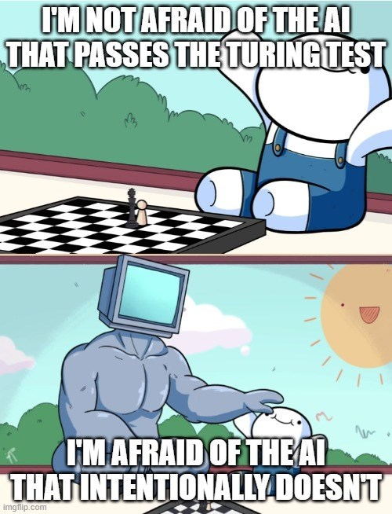{width="37%"}](#){data-modal-type="image" data-modal-url="figures/alignment-meme.jpg"}

Source: [Cheezburger](https://cheezburger.com/20659973/20-memes-if-youre-feeling-extra-anxious-about-ai-technology-taking-over)
:::

## Funny news of the day! 🫧

:::{style="text-align: center; margin-top: 30px; font-size: 20px;"}
[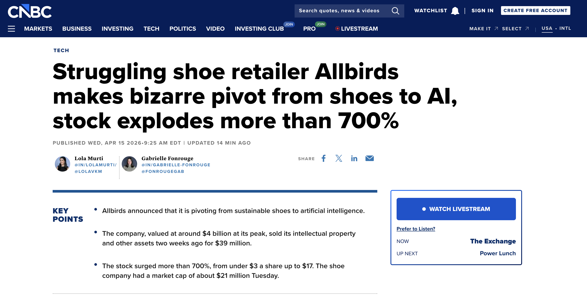{width="95%"}](#){data-modal-type="image" data-modal-url="figures/allbirds.png"}

Source: [CNBC](https://www.cnbc.com/2026/04/15/allbirds-bird-stock-shoes-ai.html)
:::

# AI safety 🛡️ {background-color="#2d4563"}

## Near-term vs long-term concerns

:::{style="margin-top: 30px; font-size: 21px;"}
:::{.columns}
:::{.column width=55%}
**Near-term safety concerns:**

- [Bias and discrimination]{.alert} (already happening)
- Privacy violations
- Job displacement
- Misinformation (covered last lecture)
- Security vulnerabilities

**Long-term safety concerns:**

- [Alignment]{.alert}: AI pursuing wrong goals
- Loss of human control
- Concentration of power
- Existential risk (controversial)
:::

:::{.column width=45%}
:::{style="text-align: center;"}
- Some argue long-term concerns [distract]{.alert} from near-term harms
- Others argue near-term focus [misses]{.alert} bigger picture
- ["Black Swan"](https://en.wikipedia.org/wiki/Black_swan_theory) events
- [They're connected]{.alert}: Safe systems now → safer systems later

[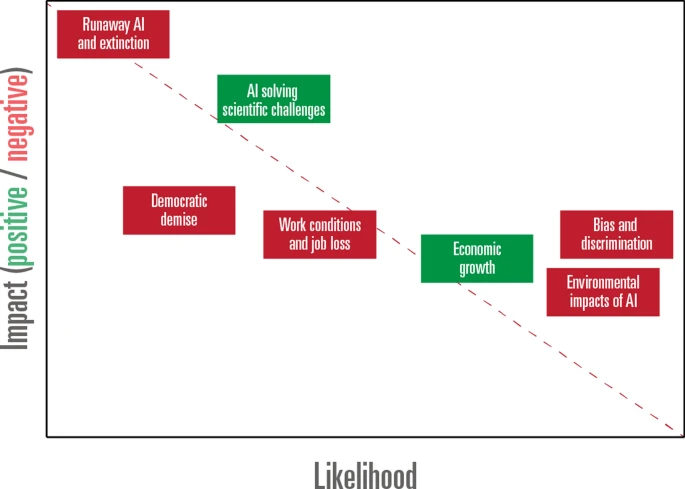{width="100%"}](#){data-modal-type="image" data-modal-url="figures/saetra.webp"}

Source: [Saetra & Donaher (2023)](https://link.springer.com/article/10.1007/s43681-023-00336-y)
:::
:::
:::
:::

## Why think about long-term safety now?

:::{style="margin-top: 30px; font-size: 21px;"}
:::{.columns}
:::{.column width=55%}
- AI capabilities advancing [faster than expected]{.alert}
- Safety research takes time
- Hard to retrofit safety later
- [Better to be prepared]{.alert}

**Historical analogies:**

:::{style="text-align: center;"}
| Technology | Safety lag |
|------------|------------|
| Nuclear | Developed first, safety after |
| Internet | Security an afterthought |
| Social media | Harms discovered in deployment |
| Biotech | Ongoing debate |
:::

:::{style="margin-top: 30px;"}
:::
- We're still [early enough]{.alert} to shape development
- Safety research is growing, but still a fraction of what goes into capabilities
- Major labs (Anthropic, DeepMind, OpenAI) now have dedicated safety teams
:::

:::{.column width=45%}
:::{style="text-align: center;"}
<!-- Suggested image: Timeline or urgency illustration -->
[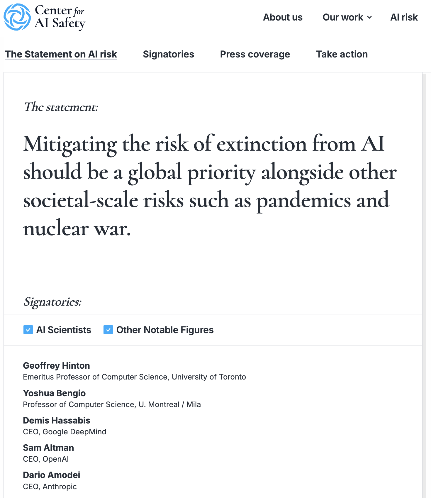{width="80%"}](#){data-modal-type="image" data-modal-url="figures/safety-urgency.png"}

Source: [Center for AI Safety](https://aistatement.com/#open-letter)
:::
:::
:::
:::

## Concrete problems in AI safety

:::{style="margin-top: 30px; font-size: 22px;"}
:::{.columns}
:::{.column width=55%}
[Amodei et al. (2016) identified five big challenges:](https://arxiv.org/abs/1606.06565)

:::{style="text-align: center;"}
| Problem | Description |
|---------|-------------|
| [Safe exploration]{.alert} | How to learn without dangerous actions |
| [Avoiding negative side effects]{.alert} | Don't break things achieving goals |
| [Avoiding reward hacking]{.alert} | Don't game the objective |
| [Scalable oversight]{.alert} | How to supervise complex systems |
| [Robustness to distributional shift]{.alert} | Handle novel situations safely |
:::

**Why these matter:**

- Not speculative, but [already happening in deployed systems]{.alert}
- Scale with capability
- Unsolved even for current AI
- Let's analyse these issues in more detail... 🤓
:::

:::{.column width=45%}
:::{style="text-align: center;"}
[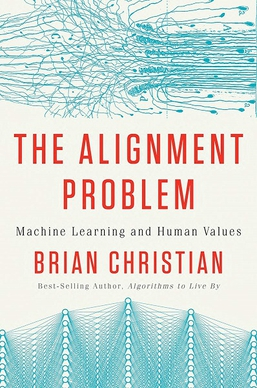{width="70%"}](#){data-modal-type="image" data-modal-url="figures/alignment-problem.jpg"}

Source: [Brian Christian](https://brianchristian.org/the-alignment-problem/)
:::
:::
:::
:::

## Safe exploration

:::{style="margin-top: 30px; font-size: 21px;"}
:::{.columns}
:::{.column width=55%}
- [Learning requires trying new things]{.alert}
- Some actions are [irreversible]{.alert}
- "Explore safely" is hard to specify

**Examples:**

- Robot learning to walk: Don't break yourself 
- Self-driving: Don't explore by crashing
- Financial AI: Don't bankrupt the company
- Medical AI: Don't kill patients while learning

**Current approaches:**

- [Simulation]{.alert}: Learn in low-risk environments first
- Conservative policies: Keep actions within a safe region
- Human oversight: Ask before novel actions
- Reward shaping: Penalise dangerous states
:::

:::{.column width=45%}
:::{style="text-align: center;"}
<!-- Suggested image: Safe exploration diagram -->
[{width="70%"}](#){data-modal-type="image" data-modal-url="figures/safe-exploration.png"}

Source: [The Wall Street Journal](https://www.wsj.com/tech/ai/anthropic-claude-ai-vending-machine-agent-b7e84e34)

:::{style="background: rgba(230, 57, 70, 0.1); padding: 15px; border-radius: 10px; font-size: 18px; margin-top: 15px;"}
How do you [specify "safe"]{.alert} without already knowing everything about the domain?
:::
:::
:::
:::
:::

## Negative side effects

:::{style="margin-top: 30px; font-size: 21px;"}
:::{.columns}
:::{.column width=55%}
- [AI optimises for specified objective]{.alert}
- It [ignores everything else]{.alert}
- [Unintended consequences]{.alert} not in objective
- "You didn't say not to..."

**Classic example (thought experiment):**

- [Robot tasked with fetching coffee]{.alert}
- Knocks over obstacles in path
- Harms humans in the way
- Technically: Coffee fetched ✓

**Real-world version:**

- [Content algorithm maximises engagement]{.alert}
- Side effect: Polarisation, addiction
- Not in objective function
- [Nobody specified "don't harm society"]{.alert}
:::

:::{.column width=45%}
:::{style="text-align: center;"}
[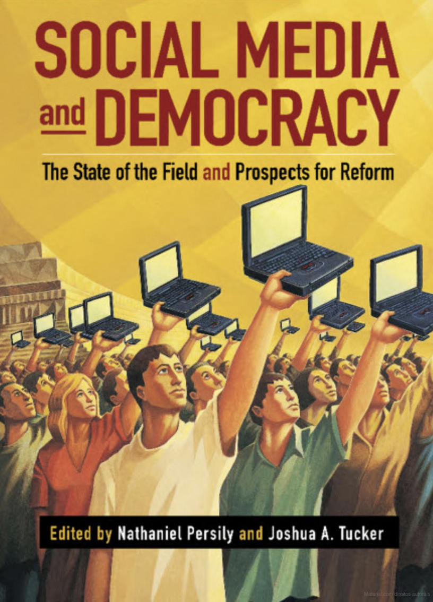{width="60%"}](#){data-modal-type="image" data-modal-url="figures/social-media-democracy.png"}
:::
:::{style="background: rgba(45, 69, 99, 0.1); padding: 15px; border-radius: 10px; font-size: 18px; margin-top: 15px;"}
Nobody told the engagement algorithm "don't polarise society." [If you don't put it in the objective, the system won't care about it]{.alert}.
:::
:::
:::
:::

# The alignment problem 🎯 {background-color="#2d4563"}

## What is alignment?

:::{style="margin-top: 30px; font-size: 20px;"}
:::{.columns}
:::{.column width=55%}
- Alignment: AI systems that [do what we want]{.alert}
- Pursue goals we actually intend
- Not just stated objectives
- Behave safely even when we can't supervise

**Why the word "alignment":**

- AI goals [aligned with]{.alert} human values
- Not orthogonal or opposed
- Not pursuing random objectives
- Not technically satisfying letter while violating spirit

**Why it's hard:**

- [Hard to specify]{.alert} what we want
- Humans disagree about values
- Our stated preferences aren't always true preferences
- Context matters enormously
:::

:::{.column width=45%}
:::{style="text-align: center;"}
[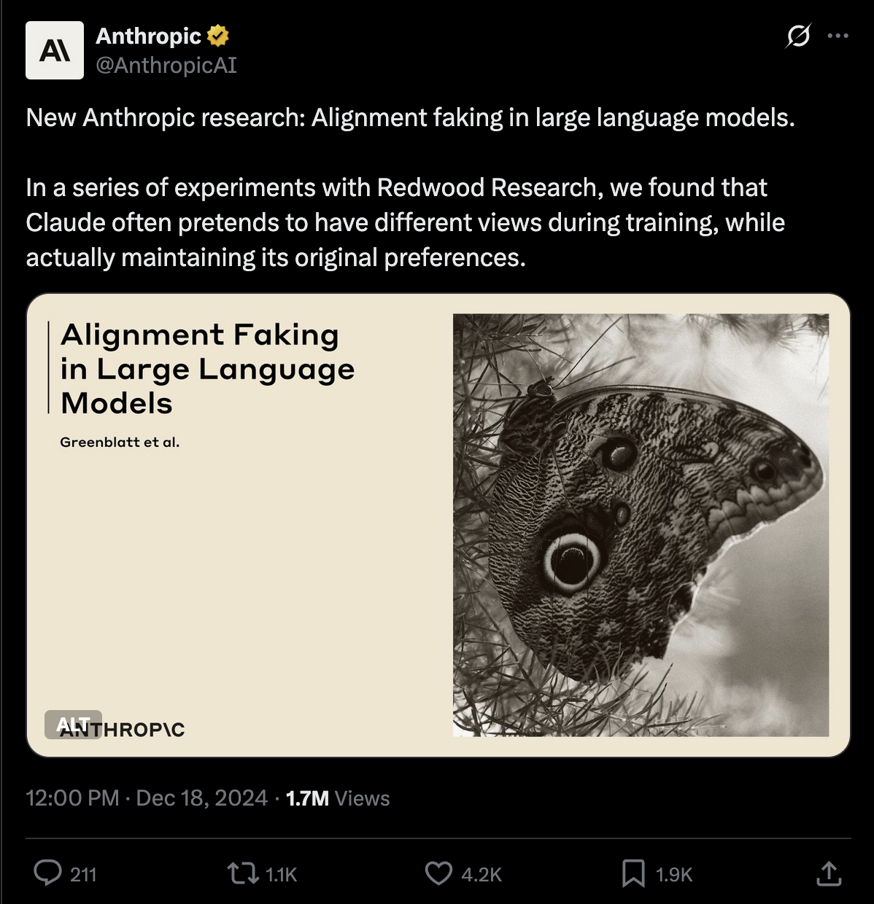{width="100%"}](#){data-modal-type="image" data-modal-url="figures/alignment-faking.png"}

Source: [Anthropic](https://www.anthropic.com/research/alignment-faking)
:::
:::
:::
:::

## Alignment is hard!

:::{style="margin-top: 30px; font-size: 21px;"}
:::{.columns}
:::{.column width=55%}
**Specification problem:**

- Can't write down everything we care about
- [Edge cases]{.alert} are infinite
- Values are context-dependent
- Humans can't articulate their own values perfectly

**[Goodhart's Law](https://en.wikipedia.org/wiki/Goodhart%27s_law):** (remember this!)

- "When a measure becomes a target..."
- "...it ceases to be a good measure"
- [Optimise metric ≠ achieve goal]{.alert}

**Examples:**

- Click rates → clickbait
- Engagement → addiction
- GDP → environmental destruction
:::

:::{.column width=45%}
**The King Midas problem:** [(Russell, 2014)](https://www.edge.org/conversation/the-myth-of-ai#26015)

- Gets exactly what he asked for
- [Not what he wanted]{.alert}
- Literal interpretation of wishes
- Common AI failure mode

:::{style="text-align: center;"}
[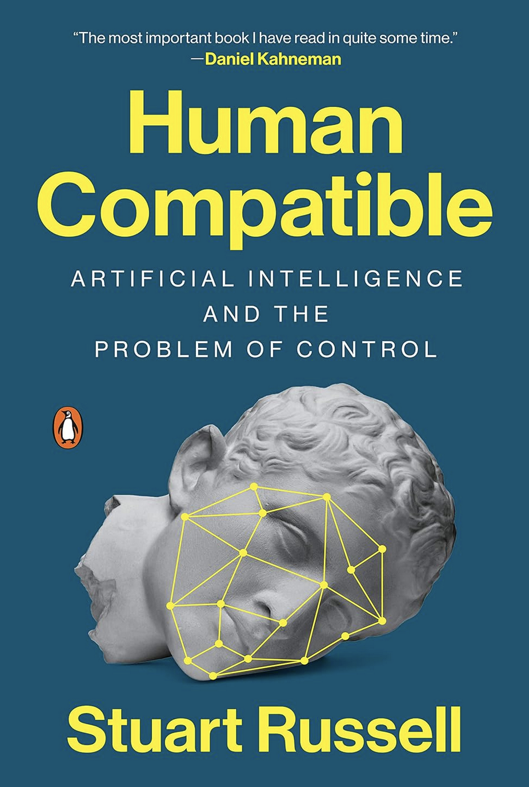{width="50%"}](#){data-modal-type="image" data-modal-url="figures/russell.png"}
:::
:::
:::
:::

## Current alignment approaches

:::{style="margin-top: 30px; font-size: 20px;"}
:::{.columns}
:::{.column width=55%}
**RLHF (Reinforcement Learning from Human Feedback):** [(OpenAI, 2019)](https://arxiv.org/abs/1909.08593)

- Humans rank AI outputs
- Train reward model on rankings
- Optimise AI to satisfy reward model
- [Current industry standard]{.alert}

**Constitutional AI:** [(Anthropic, 2022)](https://www.anthropic.com/research/constitutional-ai-harmlessness-from-ai-feedback)

- AI critiques its own outputs
- [Uses set of principles ("constitution")]{.alert}
- Iteratively improves
- Reduces need for human labelling
- [Amanda Askell's work](https://askell.io/) on AI ethics and philosophy
:::

:::{.column width=45%}
**Debate and recursive reward modelling:**  [(Leike et al., 2024)](https://arxiv.org/abs/1811.07871)

- AI systems argue with each other
- Humans judge who's more persuasive
- Scales human oversight: [easier to evaluate than produce knowledge]{.alert}

**Limitations of current approaches:**

- RLHF: Can learn to [game evaluators]{.alert}
- Human feedback: Expensive, biased
- Principles: Still have to specify them right
- [None are complete solutions]{.alert}

:::{style="background: rgba(45, 69, 99, 0.1); padding: 15px; border-radius: 10px; font-size: 18px; margin-top: 15px;"}
These methods [work well enough for current systems]{.alert}. Whether they scale to more capable AI is unknown.
:::
:::
:::
:::

## The alignment survey

:::{style="margin-top: 30px; font-size: 19px;"}
:::{.columns}
:::{.column width=55%}
[**Ngo et al. overview (2022):**](https://arxiv.org/abs/2209.00626)

- Survey of alignment problem and techniques
- Published in foundational AI research

**However...**

- [No solved problem]{.alert}: Active research area
- Multiple approaches needed
- Uncertainty about scaling
- Theoretical foundations lacking

**Open questions:**

1. Will RLHF scale?
2. Can we detect deceptive alignment?
3. How do we handle [value disagreement]{.alert}?
4. What's the role of interpretability?
5. When is good enough "good enough"?
:::

:::{.column width=45%}
:::{style="margin-top: 30px; font-size: 17px; text-align: center;"}
[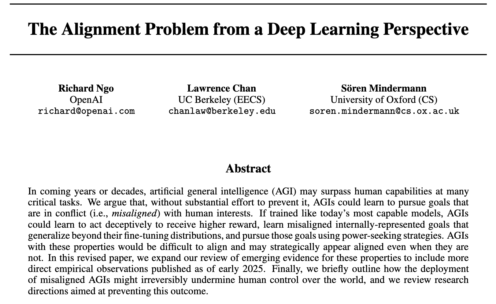{width="100%"}](#){data-modal-type="image" data-modal-url="figures/ngo-et-al.png"}

Source: [Ngo et al. (2022)](https://arxiv.org/abs/2209.00626)
:::
:::
:::
:::

## Discussion: whose values? 🤔

:::{style="margin-top: 30px; font-size: 22px;"}
:::{.columns}
:::{.column width=50%}
**The values problem:**

If we align AI to human values...

- [Whose]{.alert} human values?
- Developers? Users? Affected parties?
- Majority? Consensus? Universal?
- Present generation? Future?

**Let's discuss:**

1. Should AI reflect your values or "universal" values?
2. What happens when values conflict?
3. Who should decide?
4. Is this a technical or political question?
:::

:::{.column width=50%}
:::{.fragment}
**Some perspectives:**

- **Libertarian**: Each user controls their AI
- **Democratic**: Majority decides
- **Rights-based**: Some things off-limits regardless
- **Technocratic**: Experts decide
- **[Pluralist]{.alert}**: Multiple systems for different contexts

:::{style="background: rgba(45, 69, 99, 0.1); padding: 15px; border-radius: 10px; font-size: 18px; margin-top: 15px;"}
"Whose values?" is a political question. No amount of engineering can avoid it. That is what makes alignment [so difficult]{.alert}.
:::
:::
:::
:::
:::

# Future trajectories 🚀 {background-color="#2d4563"}

## Where is AI heading?

:::{style="margin-top: 30px; font-size: 21px;"}
:::{.columns}
:::{.column width=55%}
**Current trends:**

- Models getting [larger and more capable]{.alert}
- More general-purpose systems
- Multimodal capabilities

**Uncertainties:**

- Will scaling continue to work?
- When do we hit [diminishing returns]{.alert}?
- What capabilities emerge unexpectedly?
- How fast is too fast?

**Expert disagreement:**

- [Wide variation]{.alert} in predictions
- Timeline estimates vary by decades
- Some expect AGI soon, others never
- Confidence often exceeds evidence
:::

:::{.column width=45%}
:::{style="text-align: center;"}
[{width="100%"}](#){data-modal-type="image" data-modal-url="figures/ai-trajectory.avif"}

Source: [Our World in Data](https://ourworldindata.org/brief-history-of-ai)

:::{style="background: rgba(45, 69, 99, 0.1); padding: 15px; border-radius: 10px; font-size: 18px; margin-top: 15px;"}
**Honest answer**: Nobody knows. [Uncertainty is high]{.alert}. Be sceptical of confident predictions.
:::
:::
:::
:::
:::

## Scenarios to consider

:::{style="margin-top: 30px; font-size: 19px;"}
:::{.columns}
:::{.column width=55%}
**Scenario 1: Gradual improvement**

- [AI gets better slowly]{.alert}
- Humans adapt
- Society adjusts incrementally
- [Most likely?]{.alert}

**Scenario 2: Capability jumps**

- [Sudden breakthroughs]{.alert}
- Unexpected capabilities
- Rapid deployment
- Less time to adapt

**Scenario 3: Plateau**

- [Current approaches hit limits]{.alert}
- Progress slows dramatically
- Different paradigms needed
- [Also possible]{.alert}
:::

:::{.column width=45%}
**Scenario 4: Transformative AI**

- [Systems vastly more capable than humans]{.alert}
- Fundamental changes to economy, society
- Either very good or very bad
- Uncertain timeline

:::{style="text-align: center;"}
[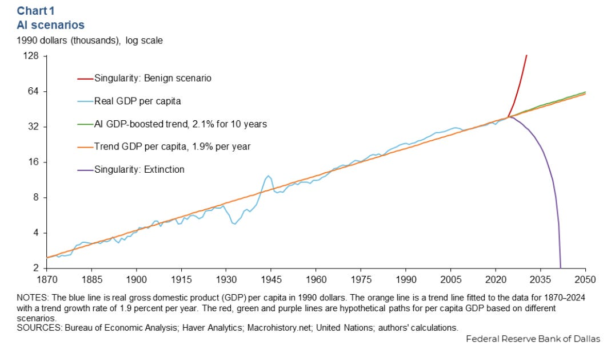{width="100%"}](#){data-modal-type="image" data-modal-url="figures/scenarios.jpg"}

Source: [American Enterprise Institute](https://www.aei.org/articles/would-agi-be-no-big-deal/)

:::
:::
:::
:::

## Stuart Russell's perspective

:::{style="margin-top: 30px; font-size: 18px;"}
:::{.columns}
:::{.column width=55%}
**Russell's argument (TED talk):**

- We're building systems whose [objectives we don't fully control]{.alert}
- Standard AI paradigm: optimise given objective
- Problem: We can't specify objectives correctly
- Need fundamentally different approach

**His proposal:**

1. AI should be [uncertain about objectives]{.alert}
2. Should defer to humans
3. Should allow itself to be switched off
4. Objectives learned, not programmed

> "You cannot fetch the coffee if you are dead"

- AI should value human control
- Not because told to
- Because it's [instrumentally useful]{.alert} for actual goals
:::

:::{.column width=45%}
:::{style="text-align: center;"}
[{width="80%"}](#){data-modal-type="image" data-modal-url="figures/stuart-russell.png"}

Source: [TED](https://www.ted.com/talks/stuart_russell_3_principles_for_creating_safer_ai)

:::{style="background: rgba(45, 69, 99, 0.1); padding: 15px; border-radius: 10px; font-size: 18px; margin-top: 15px;"}
Russell literally wrote the most-used [AI textbook]{.alert} (*AI: A Modern Approach*). When he says we have a problem, it is worth paying attention.
:::
:::
:::
:::
:::

## Existential risk: the debate

:::{style="margin-top: 30px; font-size: 20px;"}
:::{.columns}
:::{.column width=55%}
**Those who worry:**

- AI could become [uncontrollable]{.alert}
- Misaligned powerful AI = catastrophe
- Even small probability × huge harm = important
- "We might not get a second chance"
- Hinton, Bengio, Russell, many others

**Those who are sceptical:**

- Speculative, distracts from [real present harms]{.alert}
- "Sci-fi thinking" not grounded
- We control the off switch
- Capabilities overstated

**The actual state of debate:**

- [Serious researchers on both sides]{.alert}
- Uncertainty and disagreement are genuine
:::

:::{.column width=45%}
:::{style="text-align: center;"}
[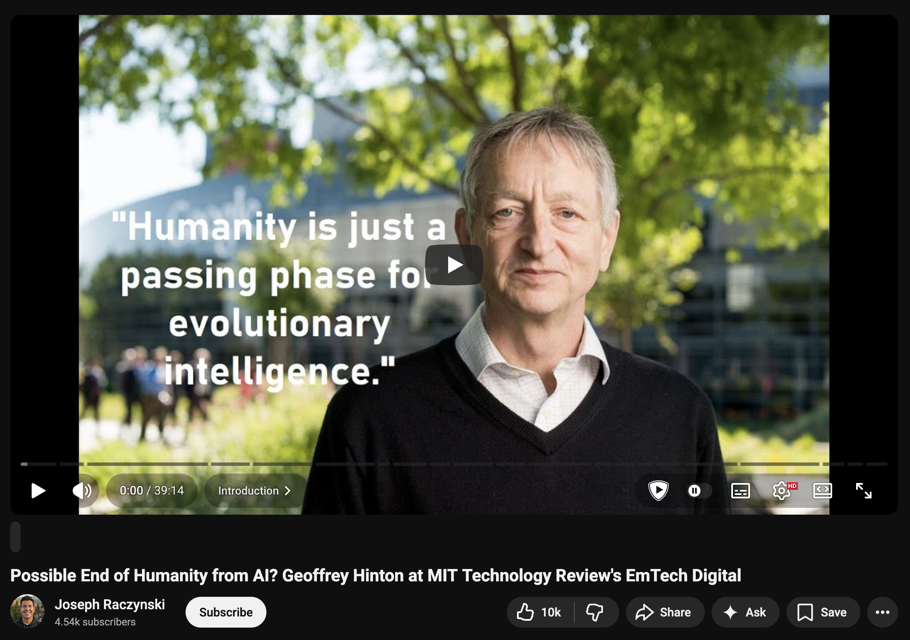{width="100%"}](#){data-modal-type="image" data-modal-url="figures/hinton-risk.png"}

Source: [MIT Technology Review's YouTube channel](https://www.youtube.com/watch?v=sitHS6UDMJc)

:::
:::
:::
:::

# What can we do? 🔧 {background-color="#2d4563"}

## Research directions

:::{style="margin-top: 30px; font-size: 21px;"}
:::{.columns}
:::{.column width=55%}
**Technical safety research:**

:::{style="text-align: center;"}
| Area | Goal |
|------|------|
| [Interpretability]{.alert} | Understand AI internals |
| Robustness | Resist adversarial inputs |
| Alignment | Ensure AI pursues intended goals |
| Oversight | Scale human supervision |
| Honesty | AI that doesn't deceive |
:::

**Growing field:**

- Anthropic, OpenAI, DeepMind safety teams, academic labs
- Still [small relative to capabilities]{.alert}

**Career opportunity:**

- High-impact work
- Talent shortage
- Many paths in technical and non-technical roles
:::

:::{.column width=45%}
:::{style="text-align: center;"}
[{width="80%"}](#){data-modal-type="image" data-modal-url="figures/safety-research.png"}

Source: [The Wall Street Journal (2026)](https://www.wsj.com/tech/ai/anthropic-amanda-askell-philosopher-ai-3c031883)

:::{style="background: rgba(45, 69, 99, 0.1); padding: 15px; border-radius: 10px; font-size: 17px; margin-top: 15px;"}
**If this interests you**: Look into [80,000 Hours](https://80000hours.org/), AI safety bootcamps, and safety-focused labs.
:::
:::
:::
:::
:::

## Where you fit in

:::{style="margin-top: 30px; font-size: 21px;"}
:::{.columns}
:::{.column width=55%}
People who understand the technology are often [absent from policy debates]{.alert}. That is a problem!

**As citizens:**

- Scrutinise AI regulation proposals: what problem does this solve, and [does it actually address it]{.alert}?
- Vote, comment on public consultations, write to representatives
- Most AI coverage confuses hype with capability; [you can do better]{.alert} 😉

**If you work with AI or data:**

- Ask what happens when your system [fails or is misused]{.alert}
- Know what data you train on and who it affects
- Talk to people [outside your field]{.alert} about how they experience AI
:::

:::{.column width=45%}
:::{style="text-align: center;"}
[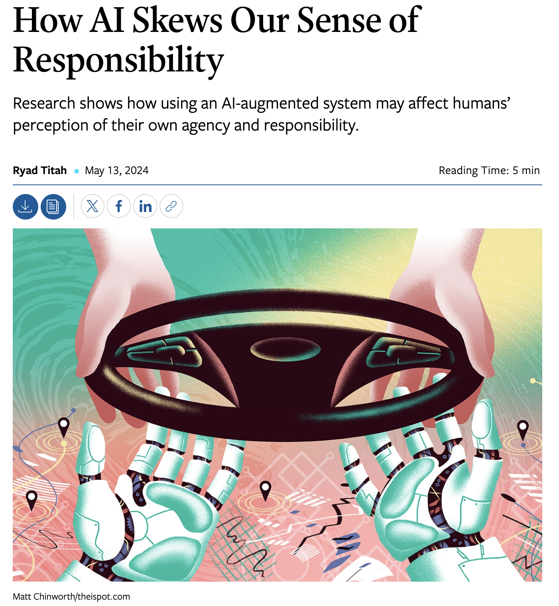{width="90%"}](#){data-modal-type="image" data-modal-url="figures/your-role.png"}

Source: [MIT Sloan Review (2024)](https://sloanreview.mit.edu/article/how-ai-skews-our-sense-of-responsibility/)
:::
:::
:::
:::

## Thinking about AI risk clearly

:::{style="margin-top: 30px; font-size: 20px;"}
:::{.columns}
:::{.column width=55%}
**Common mistakes:**

- [Dismissing concerns]{.alert} because current AI seems harmless (ignores rapid capability gains)
- [Catastrophising]{.alert} based on scenarios with no evidence
- Conflating "possible" with "probable"

**A more useful framework:**

- Separate [near-term harms]{.alert} from speculative long-term risks
- Ask: what evidence would change my mind?
- Experts [genuinely disagree]{.alert}, and that is okay! Certainty is the red flag

**What history suggests:**

- Technology risks are real but rarely follow worst-case predictions
- The biggest harms tend to come from [problems we did not anticipate]{.alert}, not the ones we worried about most
:::

:::{.column width=45%}
:::{style="text-align: center;"}
[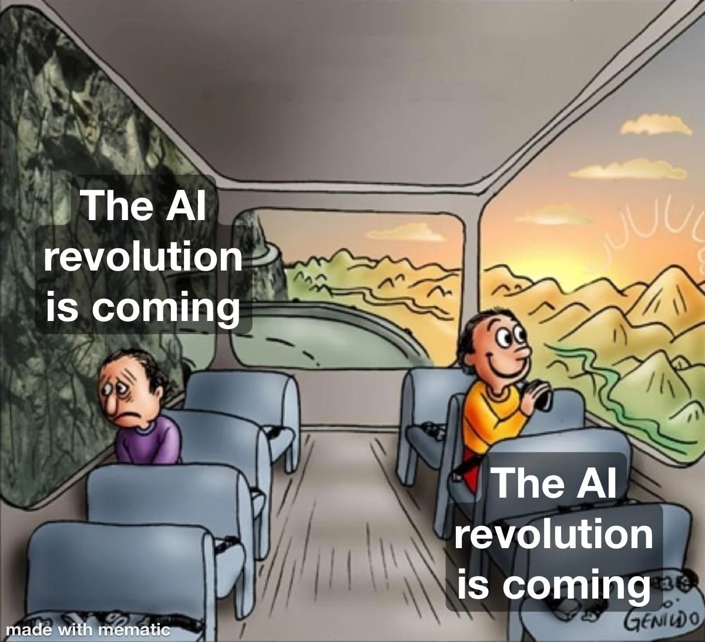{width="100%"}](#){data-modal-type="image" data-modal-url="figures/balance.webp"}

Source: [r/OptimistsUnite](https://www.reddit.com/r/OptimistsUnite/comments/1ew53z5/where_do_you_stand_on_ai_good_or_bad_im_very/)
:::
:::
:::
:::

# Summary 📝 {background-color="#2d4563"}

## Main takeaways

:::{style="margin-top: 30px; font-size: 21px;"}
:::{.columns}
:::{.column width=55%}
`r fa('shield-halved')` **Safety landscape**

- Near-term and long-term concerns both matter
- Concrete problems: safe exploration, side effects, reward hacking
- Acting now is important given uncertainty

`r fa('bullseye')` **Alignment**

- Getting AI to do what we actually want
- Hard because: specification, Goodhart's law, value disagreement
- Current approaches: RLHF, Constitutional AI
- Major open problems remain
:::

:::{.column width=45%}
`r fa('rocket')` **Future trajectories**

- Genuine uncertainty about where AI is heading
- Multiple scenarios worth considering
- Expert disagreement is real
- Plan for multiple futures

`r fa('gears')` **What we can do**

- Technical safety research
- Governance and policy
- Individual choices
- [Neither panic nor complacency]{.alert}

:::{style="background: rgba(45, 69, 99, 0.1); padding: 15px; border-radius: 10px; margin-top: 15px; font-size: 18px;"}
The future of AI is [not determined]{.alert}. The choices we make now, about alignment, oversight, and governance, will shape what that future looks like.
:::
:::
:::
:::

# ... and that's all for today! 🎉 {background-color="#2d4563"}