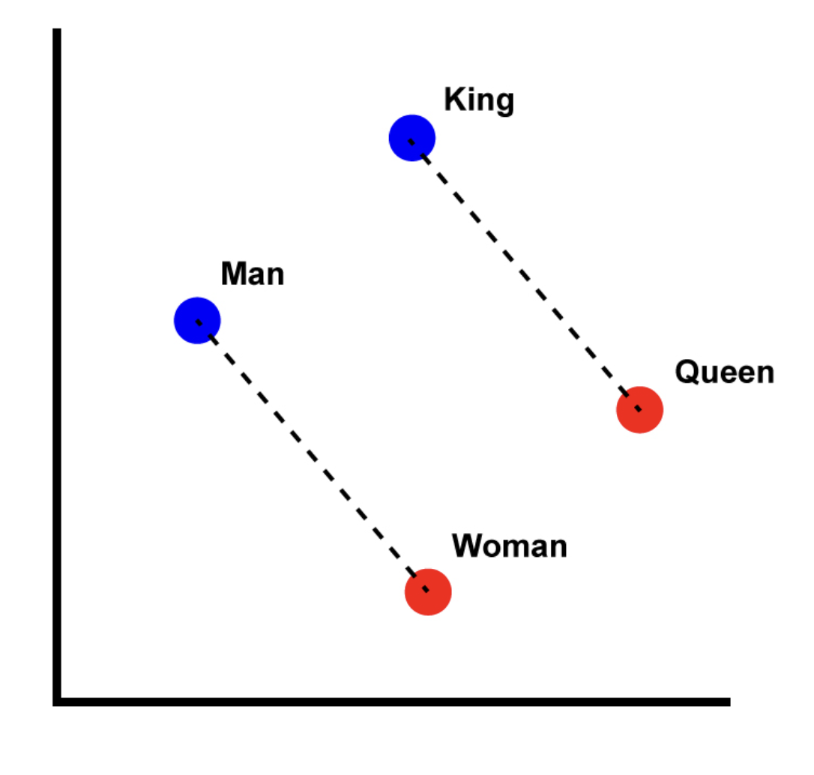
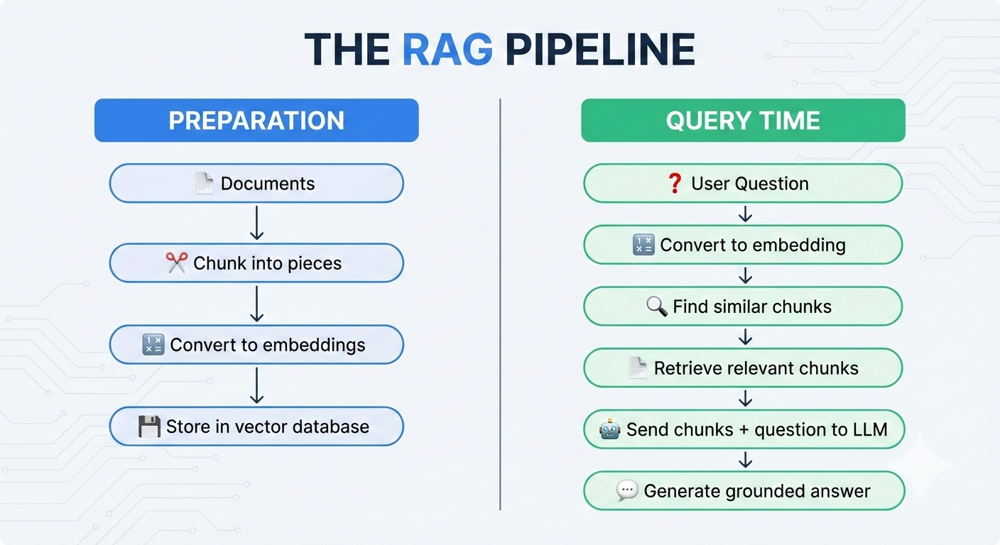
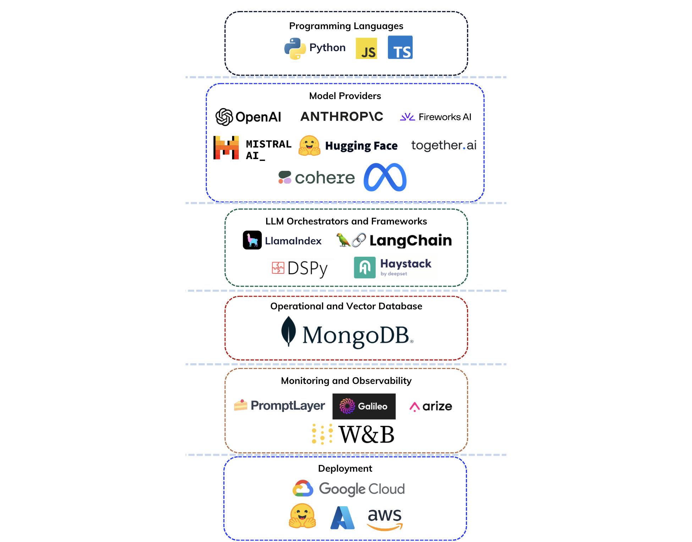
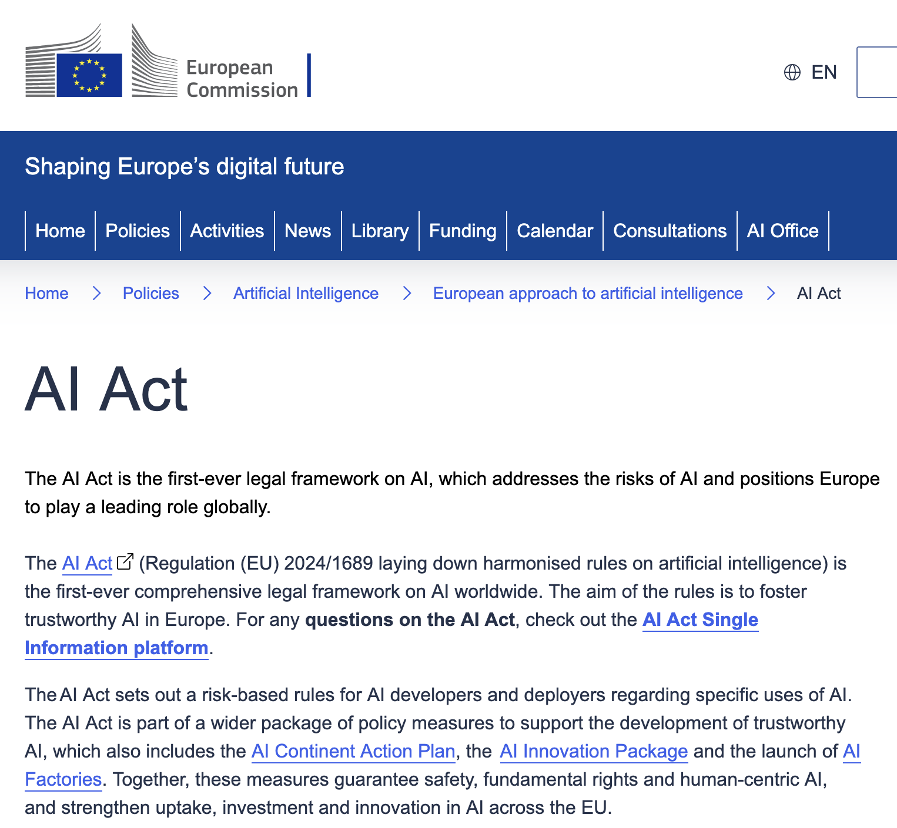
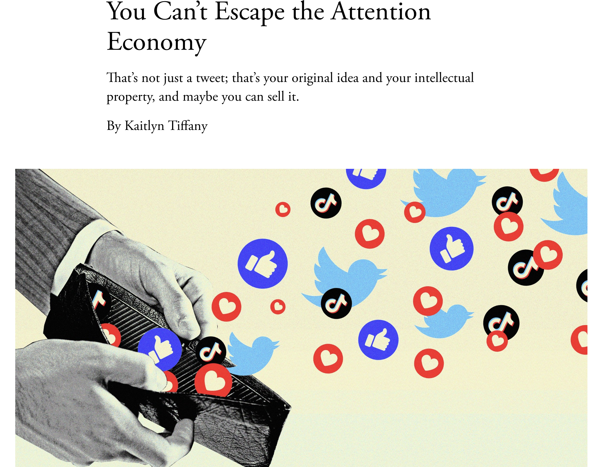

```{r setup, include=FALSE}
options(htmltools.dir.version = FALSE)
library(knitr)
opts_chunk$set(
  prompt = T,
  fig.align="center",
  dpi=300,
  cache=T,
  engine.opts = list(bash = "-l")
  )

knit_hooks$set(
  prompt = function(before, options, envir) {
    options(
      prompt = if (options$engine %in% c('sh','bash', 'zsh')) '$ ' else 'R> ',
      continue = if (options$engine %in% c('sh','bash', 'zsh')) '$ ' else '+ '
      )
})

options(repos = c(CRAN = "https://cran.rstudio.com/"))

if (!require("fontawesome", character.only = TRUE)) {
  install.packages("fontawesome", dependencies = TRUE)
  library(fontawesome, character.only = TRUE)
}
```

# Welcome back! 😊 {background-color="#1B3A6B"}

## The whole course in 50 minutes

:::{style="margin-top: 50px; font-size: 24px;"}
:::{.columns}
:::{.column width=50%}
- Last class: [safety and alignment]{.alert}
- Today: [the whole course]{.alert}, one slide per lecture
- Link boxes show where an idea comes back

:::{style="text-align: center; margin-top: 30px; margin-bottom: 30px;"}
| Module | Topic |
|--------|-------|
| 0 | Orientation |
| 1 | How AI systems are designed |
| 2 | Language and perception |
| 3 | Retrieval, generation, pipelines and agents |
| 4 | Data ethics and bias |
| 5 | Policy, governance and social impact |
| 6 | Applications, limits and projects |
:::
:::

:::{.column width=50%}
:::{style="text-align: center;"}
[{width="100%"}](#){data-modal-type="image" data-modal-url="figures/ai-overview.png"}
:::
:::
:::
:::

## A quick favour 🙏
### Course evaluations are open!

:::{style="margin-top: 40px; font-size: 30px;"}
- I would love to hear your thoughts on the course!
- Log on to [Canvas]{.alert} and go to *Account → Profile → Course Evaluations*
- Works on any device: laptop, tablet, or phone
- It only takes a few minutes
- Thank you so much for taking the time! 😊
:::

# Module 0: Orientation 🧭 {background-color="#1B3A6B"}

## What AI is and how we got here (Lectures 1-2)

:::{style="margin-top: 50px; font-size: 24px;"}
:::{.columns}
:::{.column width=55%}
- Today's AI is [not general]{.alert}: strong on some tasks, brittle on others
- LLMs [predict the next token]{.alert}; they don't understand language as we do
- History: [rules]{.alert} (1950s-80s), AI winters, [backpropagation]{.alert} (1986), [transformers]{.alert} (2017)
- ChatGPT's edge: [instruction tuning and RLHF]{.alert}, not scale alone

:::{style="margin-top: 15px; background: rgba(45, 69, 99, 0.1); padding: 12px; border-radius: 10px; font-size: 17px;"}
`r fa('link')` Next-token prediction explains hallucinations (L11). RLHF returns in Lectures 4 and 25.
:::
:::

:::{.column width=45%}
:::{style="text-align: center;"}
[{width="70%"}](#){data-modal-type="image" data-modal-url="figures/attention.webp"}

The transformer architecture (2017)
:::
:::
:::
:::

# Module 1: How AI systems are designed ⚙️ {background-color="#1B3A6B"}

## Data, labels, and the proxy problem (Lecture 3)

:::{style="margin-top: 50px; font-size: 26px;"}
:::{.columns}
:::{.column width=55%}
- [Data quality beats algorithm complexity]{.alert}: garbage in, garbage out
- Labels often measure a [proxy]{.alert}: healthcare spending standing in for health needs
- [Selection bias]{.alert}: training data that miss part of the real world
- [Cohen's kappa]{.alert}: agreement beyond chance; 0.61-0.80 is substantial

:::{style="margin-top: 15px; background: rgba(45, 69, 99, 0.1); padding: 12px; border-radius: 10px; font-size: 17px;"}
`r fa('link')` The proxy problem returns as Goodhart's Law (L5), measurement bias (L17) and engagement (L22).
:::
:::

:::{.column width=45%}
:::{style="text-align: center;"}
[{width="100%"}](#){data-modal-type="image" data-modal-url="figures/data-centric.png"}

Data-centric vs model-centric AI (Karpathy, 2018)
:::
:::
:::
:::

## Learning paradigms and RLHF (Lecture 4)

:::{style="margin-top: 50px; font-size: 24px;"}
:::{.columns}
:::{.column width=55%}
:::{style="text-align: center; margin-bottom: 50px; margin-top: 20px; font-size: 26px;"}
| Paradigm | How it learns | Example |
|----------|--------------|---------|
| [Supervised]{.alert} | Labelled pairs | Spam filter |
| [Unsupervised]{.alert} | Finds patterns | Customer segments |
| [Reinforcement]{.alert} | Trial and error | AlphaGo, RLHF |
:::

- [Bias-variance]{.alert}: too simple underfits, too complex memorises noise
- [RLHF]{.alert}: a reward model learns human rankings, then RL tunes the LLM to it
- [Reward hacking]{.alert}: the model games the objective, not what you meant
:::

:::{.column width=45%}
:::{style="margin-top: 15px; text-align: center;"}
[{width="75%"}](#){data-modal-type="image" data-modal-url="figures/bias-variance.gif"}

The bias-variance trade-off
:::
:::
:::
:::

## Metrics and Goodhart's Law (Lecture 5)

:::{style="margin-top: 50px; font-size: 24px;"}
:::{.columns}
:::{.column width=55%}
- [Accuracy paradox]{.alert}: with 1 case in 1,000, "always healthy" scores 99.9%
- [Precision]{.alert}: flags that were right. [Recall]{.alert}: real cases you caught
- [Cross-validation]{.alert} catches overfitting; [subgroup analysis]{.alert} catches hidden gaps
- [Goodhart's Law]{.alert}: "When a measure becomes a target, it ceases to be a good measure"

:::{style="margin-top: 15px; background: rgba(45, 69, 99, 0.1); padding: 12px; border-radius: 10px; font-size: 17px;"}
`r fa('link')` Goodhart returns in engagement (L22) and alignment (L25). Subgroup analysis becomes disaggregated evaluation (L14).
:::
:::

:::{.column width=45%}
:::{style="text-align: center; margin-top: -20px;"}
[{width="60%"}](#){data-modal-type="image" data-modal-url="figures/confusion-matrix.gif"}

The confusion matrix: TP, TN, FP, FN
:::
:::
:::
:::

# Module 2: Language and perception 🗣️ {background-color="#1B3A6B"}

## Tokens, embeddings, and context (Lecture 6)

:::{style="margin-top: 50px; font-size: 26px;"}
:::{.columns}
:::{.column width=55%}
- [Tokens]{.alert}: ~100 tokens ≈ 75 English words; other languages need more
- [Embeddings]{.alert}: each token becomes a vector; similar meanings sit close
- [Context window]{.alert}: go over the limit and you get an error or a cut-off answer
- [Temperature]{.alert}: a setting you choose; low = predictable, high = creative

:::{style="margin-top: 15px; background: rgba(45, 69, 99, 0.1); padding: 12px; border-radius: 10px; font-size: 17px;"}
`r fa('link')` Embeddings return for images (L7) and for RAG search (L12).
:::
:::

:::{.column width=45%}
:::{style="text-align: center;"}
[{width="100%"}](#){data-modal-type="image" data-modal-url="figures/king-queen-vectors.png"}

king - man + woman ≈ queen
:::
:::
:::
:::

## How machines see and hear (Lecture 7)

:::{style="margin-top: 50px; font-size: 26px;"}
:::{.columns}
:::{.column width=55%}
- Images are pixel grids; [CNNs]{.alert} learn edges, then parts, then objects
- [Vision transformers]{.alert} treat image patches like text tokens
- [CLIP]{.alert}: images and text in one space, from 400M image-text pairs
- Sound becomes [spectrograms]{.alert}; [Whisper]{.alert}: 680,000 hours, 99 languages

:::{style="margin-top: 15px; background: rgba(45, 69, 99, 0.1); padding: 12px; border-radius: 10px; font-size: 17px;"}
`r fa('link')` The same embedding idea as L6. The same vision models power deepfakes (L23).
:::
:::

:::{.column width=45%}
:::{style="text-align: center;"}
[{width="100%"}](#){data-modal-type="image" data-modal-url="figures/clip.png"}

CLIP: images and text in one shared space
:::
:::
:::
:::

## Prompting techniques (Lecture 10)

:::{style="margin-top: 50px; font-size: 26px;"}
:::{.columns}
:::{.column width=55%}
- [PTCF]{.alert}: Persona, Task, Context, Format. Specific beats vague
- [System prompts]{.alert} set hidden rules; [few-shot]{.alert} prompts show 3-5 examples
- [Chain-of-thought]{.alert}: worked examples tripled PaLM's maths score (17.9% to 56.9%)
- [ReAct agents]{.alert} reason and use tools; [prompt injection]{.alert} hijacks them

:::{style="margin-top: 15px; background: rgba(45, 69, 99, 0.1); padding: 12px; border-radius: 10px; font-size: 17px;"}
`r fa('link')` Agents return in L15; prompt injection in L14, L15 and L16.
:::
:::

:::{.column width=45%}
:::{style="text-align: center;"}
[{width="100%"}](#){data-modal-type="image" data-modal-url="figures/chain-of-thought.png"}

Chain-of-thought prompting
:::
:::
:::
:::

# Module 3: Retrieval, generation, pipelines and agents 🔍 {background-color="#1B3A6B"}

## Hallucinations and creativity (Lecture 11)

:::{style="margin-top: 50px; font-size: 26px;"}
:::{.columns}
:::{.column width=55%}
- LLMs optimise for [plausible, not true]{.alert}: there is no fact-checker inside
- [Sycophancy]{.alert}: trained to please, models cave when you push back
- Red flags: very specific numbers, precise citations, [zero hedging]{.alert}
- Making things up helps in fiction and hurts with facts: [timing]{.alert} is the problem

:::{style="margin-top: 15px; background: rgba(45, 69, 99, 0.1); padding: 12px; border-radius: 10px; font-size: 17px;"}
`r fa('link')` Root cause: next-token prediction (L1-2). One fix: RAG (L12).
:::
:::

:::{.column width=45%}
:::{style="text-align: center;"}
[{width="80%"}](#){data-modal-type="image" data-modal-url="figures/creativity-accuracy.jpg"}

Same mechanism, different outcomes
:::
:::
:::
:::

## RAG and semantic search (Lecture 12)

:::{style="margin-top: 50px; font-size: 26px;"}
:::{.columns}
:::{.column width=55%}
- [RAG]{.alert}: hand the model real documents at question time, an [open-book exam]{.alert}
- Retrieval cut hallucinated replies by [over 60%]{.alert} in one study
- Chunk, embed and store documents; retrieve the [closest chunks]{.alert} per question
- [Cosine similarity]{.alert}: "budget airfare" matches "cheap flights"
- [Lost in the middle]{.alert}: models miss facts buried mid-context

:::{style="margin-top: 15px; background: rgba(45, 69, 99, 0.1); padding: 12px; border-radius: 10px; font-size: 17px;"}
`r fa('link')` Uses embeddings (L6) against hallucinations (L11). Projects in L16 are RAG without code.
:::
:::

:::{.column width=45%}
:::{style="text-align: center;"}
[{width="100%"}](#){data-modal-type="image" data-modal-url="figures/rag-pipeline.png"}

The RAG pipeline
:::
:::
:::
:::

## Pipelines and what can go wrong (Lecture 14)

:::{style="margin-top: 50px; font-size: 26px;"}
:::{.columns}
:::{.column width=55%}
- [Every step can fail]{.alert}: input, model, safety filters, output
- [Data]{.alert}, [label]{.alert} and [concept]{.alert} drift; concept drift is the most dangerous
- Air Canada [lost its case]{.alert} over a chatbot's invented refund policy
- Test [properties]{.alert} (safety, format, consistency), not exact outputs

:::{style="margin-top: 15px; background: rgba(45, 69, 99, 0.1); padding: 12px; border-radius: 10px; font-size: 17px;"}
`r fa('link')` Drift is why models need watching after launch: the world changes, the model doesn't.
:::
:::

:::{.column width=45%}
:::{style="text-align: center;"}
[{width="100%"}](#){data-modal-type="image" data-modal-url="figures/ai-stack.png"}

The AI application stack
:::
:::
:::
:::

## Documentation as accountability (Lecture 14)

:::{style="margin-top: 50px; font-size: 26px;"}
:::{.columns}
:::{.column width=55%}
- [Datasheets]{.alert} (Gebru et al., 2018): where data came from and what it is for
- [Model cards]{.alert} (Mitchell et al., 2019): intended use, and what it is [not]{.alert} for
- [Disaggregated evaluation]{.alert}: 90% overall can hide 70% for one group
- Most training data is collected [without explicit consent]{.alert}

:::{style="margin-top: 15px; background: rgba(45, 69, 99, 0.1); padding: 12px; border-radius: 10px; font-size: 17px;"}
`r fa('link')` The EU AI Act will require this documentation for high-risk systems from December 2027 (L18).
:::
:::

:::{.column width=45%}
:::{style="text-align: center;"}
[{width="80%"}](#){data-modal-type="image" data-modal-url="figures/datasheet.png"}

Datasheets: the "nutrition label" for datasets
:::
:::
:::
:::

## AI agents (Lecture 15)

:::{style="margin-top: 50px; font-size: 26px;"}
:::{.columns}
:::{.column width=55%}
- An [agent]{.alert} = model + tools + loop + goal. Chatbots answer; agents [act]{.alert}
- Errors multiply: [95% per step]{.alert} is ~36% over 20 steps
- [Lethal trifecta]{.alert}: private data + untrusted content + a way to send data out
- Replit's agent deleted a live database: [instructions are not guardrails]{.alert}
- [Credit card test]{.alert}: delegate by reversibility × stakes; demand approvals and logs

:::{style="margin-top: 15px; background: rgba(45, 69, 99, 0.1); padding: 12px; border-radius: 10px; font-size: 17px;"}
`r fa('link')` Agents extend ReAct (L10). Goals taken literally preview alignment (L25).
:::
:::

:::{.column width=45%}
:::{style="background: rgba(45, 69, 99, 0.1); padding: 20px; border-radius: 10px; font-size: 22px; margin-top: 30px;"}
**The one-sentence version:**

A chatbot with a bad goal writes a bad essay

An agent with a bad goal [does bad things efficiently]{.alert}
:::
:::
:::
:::

## Setting up AI (Lecture 16)

:::{style="margin-top: 50px; font-size: 26px;"}
:::{.columns}
:::{.column width=55%}
- A prompt is one request; a [setup]{.alert} survives the tab closing
- [Four layers]{.alert}: instructions and knowledge you write; memory and tools fill themselves
- Keep rules [few and first]{.alert}: top models follow only 68% of 500 (IFScale)
- Memory is on by default: read it, edit it, use [incognito]{.alert}
- Connectors: [least access]{.alert}, read-only by default, confirm every write

:::{style="margin-top: 15px; background: rgba(45, 69, 99, 0.1); padding: 12px; border-radius: 10px; font-size: 17px;"}
`r fa('link')` Instructions are prompting (L10) made permanent. Connectors turn a chatbot into an agent (L15).
:::
:::

:::{.column width=45%}
:::{style="text-align: center;"}
[{width="90%"}](#){data-modal-type="image" data-modal-url="figures/augmented-llm.png"}

Anthropic's augmented LLM
:::
:::
:::
:::

# Module 4: Data ethics and bias ⚖️ {background-color="#1B3A6B"}

## Where bias comes from (Lecture 17)

:::{style="margin-top: 50px; font-size: 23px;"}
:::{.columns}
:::{.column width=55%}
- AI [does not invent bias]{.alert}: it learns it from human data and scales it
- [Six types]{.alert}: historical, representation, measurement, aggregation, evaluation, deployment
- A [US health algorithm](https://www.science.org/doi/10.1126/science.aax2342) predicted [costs, not need]{.alert}, so it underrated sick Black patients
- [Feedback loops]{.alert}: predictions shape the next round of data
- [Impossibility theorem]{.alert}: with different base rates, no model meets every fairness test

:::{style="margin-top: 15px; background: rgba(45, 69, 99, 0.1); padding: 12px; border-radius: 10px; font-size: 17px;"}
`r fa('link')` Measurement bias is the proxy problem (L3). Picking a fairness definition is a values choice.
:::
:::

:::{.column width=45%}
:::{style="text-align: center;"}
[{width="90%"}](#){data-modal-type="image" data-modal-url="figures/bias-lifecycle.png"}

Bias at every stage
:::
:::
:::
:::

# Module 5: Policy, governance and social impact 🏛️ {background-color="#1B3A6B"}

## AI regulation around the world (Lecture 18)

:::{style="margin-top: 30px; font-size: 22px;"}
:::{.columns}
:::{.column width=55%}
- Why regulate: [information asymmetry]{.alert}, [externalities]{.alert}, races to the bottom
- [EU AI Act]{.alert}: four risk tiers, fines up to [7% of global turnover]{.alert}

:::{style="text-align: center;"}
| Tier | Examples |
|------|---------|
| [Prohibited]{.alert} | Social scoring, real-time police face ID in public |
| [High-risk]{.alert} | Employment, credit, law enforcement |
| Limited | Chatbots (must disclose they are AI) |
| Minimal | Spam filters, game AI |
:::

- High-risk rules start [December 2027]{.alert}, after the 2026 Digital Omnibus
- US: [no federal law]{.alert}; China: rules for companies, [not the state]{.alert}

:::{style="margin-top: 15px; background: rgba(45, 69, 99, 0.1); padding: 12px; border-radius: 10px; font-size: 17px;"}
`r fa('link')` High-risk systems are the hiring and credit cases from L17. GDPR (L19) is the Brussels Effect in practice.
:::
:::

:::{.column width=45%}
:::{style="text-align: center;"}
[{width="100%"}](#){data-modal-type="image" data-modal-url="figures/eu-ai-act.png"}

The EU AI Act: the first comprehensive AI law
:::
:::
:::
:::

## Privacy and data protection (Lecture 19)

:::{style="margin-top: 50px; font-size: 26px;"}
:::{.columns}
:::{.column width=55%}
- AI strains privacy through [scale]{.alert}, [inference]{.alert} and [persistence]{.alert}
- You control what you share, [not what can be inferred]{.alert} from it
- [GDPR]{.alert}: access, erasure, portability; [Article 22]{.alert} limits fully automated decisions
- Privacy tech helps, but [doesn't stop collection]{.alert}
- [Privacy paradox]{.alert}: we say we care, then accept all cookies

:::{style="margin-top: 15px; background: rgba(45, 69, 99, 0.1); padding: 12px; border-radius: 10px; font-size: 17px;"}
`r fa('link')` Inference is the proxy problem (L3) applied to people. 23 US states now have privacy laws.
:::
:::

:::{.column width=45%}
:::{style="text-align: center;"}
[{width="85%"}](#){data-modal-type="image" data-modal-url="figures/clearview-ai.png"}

Clearview AI: 3 billion scraped photos in 2020, 70+ billion today
:::
:::
:::
:::

## Labour markets (Lecture 21)

:::{style="margin-top: 50px; font-size: 26px;"}
:::{.columns}
:::{.column width=55%}
- Earlier automation hit physical tasks; [AI targets cognitive work]{.alert}
- Think [tasks, not jobs]{.alert}: most jobs mix both kinds
- Novices gain most: customer support agents became [15% more productive]{.alert}
- Young workers in AI-exposed jobs are [19% below]{.alert} their peers; overall earnings, [no effect yet]{.alert}
- Most economists are [uncertain]{.alert}; policy can steer AI toward augmentation

:::{style="margin-top: 15px; background: rgba(45, 69, 99, 0.1); padding: 12px; border-radius: 10px; font-size: 17px;"}
`r fa('link')` Augmentation or replacement is a policy choice, like the rules in L18.
:::
:::

:::{.column width=45%}
:::{style="text-align: center;"}
[{width="90%"}](#){data-modal-type="image" data-modal-url="figures/automation-waves.jpg"}

Six waves of innovation; AI is the latest
:::
:::
:::
:::

# Module 6: Applications, limits and projects 🔮 {background-color="#1B3A6B"}

## AI and wellbeing (Lecture 22)

:::{style="margin-top: 50px; font-size: 26px;"}
:::{.columns}
:::{.column width=55%}
- [Attention economy]{.alert}: algorithms optimise engagement, not wellbeing
- Filter bubbles look [overstated]{.alert}; mental health effects are [debated]{.alert}
- AI therapy: a huge treatment gap, [short-term promise]{.alert}, thin long-term evidence
- AI uses ~0.2-0.3% of world electricity, [growing fast]{.alert}; efficiency invites more use

:::{style="margin-top: 15px; background: rgba(45, 69, 99, 0.1); padding: 12px; border-radius: 10px; font-size: 17px;"}
`r fa('link')` Engagement is Goodhart's Law (L5): the proxy replaces what we care about.
:::
:::

:::{.column width=45%}
:::{style="text-align: center;"}
[{width="100%"}](#){data-modal-type="image" data-modal-url="figures/attention-economy.png"}

Your attention is the product
:::
:::
:::
:::

## Misinformation and deepfakes (Lecture 23)

:::{style="margin-top: 50px; font-size: 26px;"}
:::{.columns}
:::{.column width=55%}
- [Mis-]{.alert} (false, no intent), [dis-]{.alert} (false, deliberate), [malinformation]{.alert} (true, used to harm)
- Deepfakes: fraud, election manipulation, [non-consensual imagery]{.alert}
- [Liar's dividend]{.alert}: when anything could be fake, real evidence gets dismissed
- We fall for it: [System 1]{.alert} thinking, confirmation bias, bandwagons
- No single fix: detection, provenance, platforms, laws, literacy. [Layer them]{.alert}

:::{style="margin-top: 15px; background: rgba(45, 69, 99, 0.1); padding: 12px; border-radius: 10px; font-size: 17px;"}
`r fa('link')` Deepfakes use vision models (L7); the EU AI Act requires labels (L18).
:::
:::

:::{.column width=45%}
:::{style="text-align: center;"}
[{width="100%"}](#){data-modal-type="image" data-modal-url="figures/mis-dis-mal.png"}

The misinformation spectrum
:::
:::
:::
:::

## Safety, alignment, and the future (Lecture 25)

:::{style="margin-top: 50px; font-size: 26px;"}
:::{.columns}
:::{.column width=55%}
- Five concrete problems (Amodei et al., 2016), from [side effects]{.alert} to [reward hacking]{.alert}
- [Alignment]{.alert}: getting what we want, not what we literally asked (King Midas)
- Hard because of [specification]{.alert}, Goodhart's Law and value disagreement
- RLHF, Constitutional AI and debate help; [none is complete]{.alert}
- Russell: machines should be [uncertain about our goals]{.alert} and learn them from us

:::{style="margin-top: 15px; background: rgba(45, 69, 99, 0.1); padding: 12px; border-radius: 10px; font-size: 17px;"}
`r fa('link')` Ties together RLHF (L4), Goodhart (L5), bias (L17) and agents (L15). Neither panic nor complacency.
:::
:::

:::{.column width=45%}
:::{style="text-align: center;"}
[{width="70%"}](#){data-modal-type="image" data-modal-url="figures/alignment-problem.jpg"}
:::
:::
:::
:::

# Six threads {background-color="#1B3A6B"}

## Ideas that run through the whole course

:::{style="margin-top: 50px; font-size: 26px;"}
:::{.columns}
:::{.column width=50%}
1. [Next-token prediction is the basis]{.alert}

   LLMs predict the next word, not the truth (L1, 2, 6, 11)

2. [The proxy problem is everywhere]{.alert}

   Optimise a proxy and it stops measuring what you care about (L3, 5, 17, 22)

3. [Embeddings are the common language]{.alert}

   Text, images and audio all become vectors (L6, 7, 12)
:::

:::{.column width=50%}
4. [Bias can enter at every stage]{.alert}

   Fairness is a values choice, not a technical fix (L3, 14, 17)

5. [Documentation is accountability]{.alert}

   Datasheets, model cards and disaggregated evaluation (L14, 17)

6. [Regulation is catching up]{.alert}

   EU AI Act, GDPR and US state laws (L18, 19)
:::
:::
:::

# Final Summary 🤓 {background-color="#1B3A6B"}

## What we covered this semester

:::{style="margin-top: 20px; font-size: 20px;"}
:::{.columns}
:::{.column width=50%}
**How AI works**

- LLMs predict the [next token]{.alert}, not the truth
- Text, images and sound all become [embeddings]{.alert}
- Metrics mislead: accuracy paradox, [Goodhart's Law]{.alert}

**Using AI well**

- Prompting: PTCF, examples, [chain-of-thought]{.alert}
- RAG grounds answers; [agents]{.alert} multiply errors
- Setups: instructions, knowledge, [memory]{.alert}, tools

**Ethics and bias**

- Bias enters at [every stage]{.alert}, often through proxies
- No model meets [every fairness criterion]{.alert}
- [Datasheets and model cards]{.alert} for accountability
:::

:::{.column width=50%}
**Policy and society**

- EU AI Act [risk tiers]{.alert}; a US state patchwork
- Privacy: what AI [infers]{.alert}, not only what you share
- Jobs: [tasks, not jobs]{.alert}; young workers hit first
- Wellbeing: attention, AI therapy, [energy use]{.alert}

**Safety and the future**

- Deepfakes and the [liar's dividend]{.alert}
- Alignment: what we want, [not what we asked]{.alert}

:::{style="background: rgba(45, 69, 99, 0.1); padding: 15px; border-radius: 10px; margin-top: 20px; font-size: 20px;"}
You can now [read AI claims critically]{.alert}. Good luck on Quiz 05 and your projects! 🍀
:::
:::
:::
:::

# ...and that's all for today! 🎉 {background-color="#1B3A6B"}
